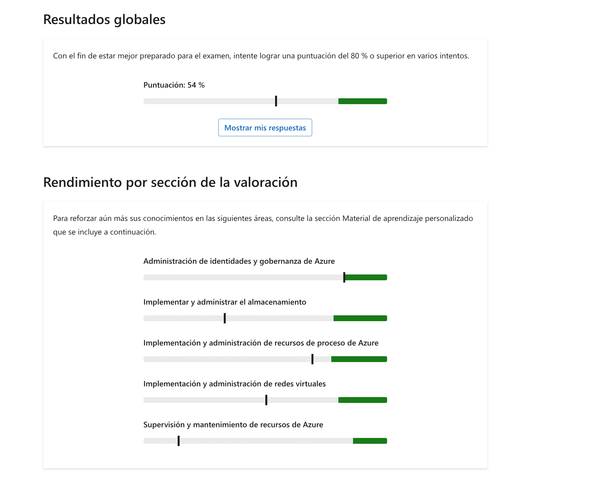

Tiene una suscripción de Azure que contiene grupos de seguridad de red (NSG).

¿Qué dos recursos se pueden asociar a un NSG? Cada respuesta correcta presenta una solución completa.

Seleccione todas las respuestas que procedan.

Redes virtuales

**Esta respuesta no es correcta.**

Máquinas virtuales

**Esta respuesta no es correcta.**

interfaces de red

**Esta respuesta es correcta.**

subredes

**Esta respuesta es correcta.**

Puedes usar un grupo de seguridad de red (NSG) para asignarlo a una interfaz de red. Los NSG se pueden asociar con las subredes o las instancias individuales de máquina virtual dentro de esa subred. Cuando un NSG está asociado a una subred, las reglas de ACL se aplican a todas las instancias de máquinas virtuales de esa subred.

Introducción a los grupos de seguridad de red de [Azure | Microsoft Learn](https://learn.microsoft.com/azure/virtual-network/network-security-groups-overview)

[Configurar grupos de seguridad de red: entrenamiento | Microsoft Learn](https://learn.microsoft.com/training/modules/configure-network-security-groups/)

> [!success] Brain — Respuesta: **interfaces de red** + **subredes**
>
> Un NSG se asocia a una interfaz de red, a una VM individual (a través de su NIC) o a una subred — nunca a una red virtual completa.
>
> 📄 En mi documentación: [az104-network-security-groups.md](../../../knowledge/az104-network-security-groups.md)

___

Tiene una suscripción de Azure que contiene dos grupos de recursos denominados RG1 y RG2.

RG1 contiene los siguientes recursos:

- Una red virtual denominada VNet1 ubicada en la región este de EE. UU. Azure
- Un grupo de seguridad de red (NSG) denominado NSG1 ubicado en la región Azure del Oeste de EE. UU.

RG2 contiene los siguientes recursos:

- Una red virtual denominada VNet2 ubicada en la región este de EE. UU. Azure
- Una red virtual denominada VNet3 ubicada en la región oeste de EE. UU. Azure

Debe asociar NSG1.

¿A qué subredes puede asociar NSG1?

Seleccione solo una respuesta.

las subredes de todas las redes virtuales

**Esta respuesta no es correcta.**

solo las subredes de VNet1

las subredes de VNet1 y VNet2

solo las subredes de VNet3

**Esta respuesta es correcta.**

Puede asignar un grupo de seguridad de red (NSG) a la subred de la red virtual en la misma región, mientras que NSG1 se encuentra en la región Oeste de EE. UU.

[Planificar redes virtuales de Azure | Microsoft Learn](https://learn.microsoft.com/azure/virtual-network/virtual-network-vnet-plan-design-arm)

[Configurar grupos de seguridad de red: entrenamiento | Microsoft Learn](https://learn.microsoft.com/training/modules/configure-network-security-groups/)

> [!success] Brain — Respuesta: **solo las subredes de VNet3**
>
> El NSG y la subred deben estar en la **misma región**: NSG1 está en Oeste de EE. UU. y solo VNet3 está en esa región.
>
> 📄 En mi documentación: [az104-network-security-groups.md](../../../knowledge/az104-network-security-groups.md) — ⚠️ la restricción de región NSG↔subred no está desarrollada (gap).

___
Tiene una suscripción Azure.

Tiene previsto implementar cuatro redes virtuales de Azure que estarán emparejadas. Todas las máquinas virtuales usarán un sufijo DNS de contoso.com.

Debe configurar la resolución de nombres de las redes virtuales para asegurarse de que todas las máquinas virtuales puedan comunicarse mediante sus FQDN. La solución debe minimizar el esfuerzo administrativo.

¿Qué debe usar?

Seleccione solo una respuesta.

un servidor DNS en una máquina virtual Azure

una zona de Azure DNS privado

**Esta respuesta es correcta.**

una zona DNS pública Azure

resolución de nombres proporcionada por Azure

**Esta respuesta no es correcta.**

Azure DNS privado permite la resolución de nombres privados entre redes virtuales de Azure. Azure DNS público proporciona DNS para el acceso público, como la resolución de nombres para un sitio web accesible públicamente. La resolución de nombres proporcionada por Azure no admite nombres de dominio definidos por el usuario y solo admite una red virtual. También se puede usar un servidor DNS en una máquina virtual para lograr el objetivo, pero implica mucho más esfuerzo administrativo para implementar y mantener que usar Azure DNS privado.

[Resolución de nombres para recursos en redes virtuales de Azure | Microsoft Learn](https://learn.microsoft.com/azure/virtual-network/virtual-networks-name-resolution-for-vms-and-role-instances#azure-provided-name-resolution)

[Hospedar el dominio en Azure DNS - Entrenamiento | Microsoft Learn](https://learn.microsoft.com/training/modules/host-domain-azure-dns/)

> [!success] Brain — Respuesta: **una zona de Azure DNS privado**
>
> Una zona privada con vínculo de red virtual a las cuatro VNets (y auto-registration) resuelve FQDN entre VNets emparejadas con mínimo esfuerzo. La resolución proporcionada por Azure no cruza VNets ni admite sufijos propios; un servidor DNS en VM lo logra pero exige mantenerlo.
>
> 📄 En mi documentación: [az104-azure-dns.md](../../../knowledge/az104-azure-dns.md) · [az-104-resumen-modulos.md](../../../cheatsheets/az-104-resumen-modulos.md) — «FQDN entre VNets peer con mínimo esfuerzo → zona privada».

___
Su empresa ha implementado un Azure Load Balancer para distribuir el tráfico entre varias máquinas virtuales de una granja de servidores web. Los usuarios notifican tiempos de espera de conexión intermitentes al acceder a la aplicación web.

Debe resolver los problemas de tiempo de espera de conexión y asegurarse de que el balanceador de carga distribuya el tráfico uniformemente.

¿Qué tiene que hacer?

Seleccione solo una respuesta.

Cambie el modo de distribución a hash de cinco tuplas.

**Esta respuesta es correcta.**

Configure un sondeo de estado para el equilibrador de carga.

Habilite la persistencia de sesión con afinidad de IP de origen.

Actualice el equilibrador de carga a una SKU superior.

**Esta respuesta no es correcta.**

Cambiar el modo de distribución a un conjunto de cinco hash asegura una distribución uniforme del tráfico teniendo en cuenta varios parámetros, lo cual ayuda a solucionar los problemas de espera en la conexión. La configuración de un sondeo de estado para el equilibrador de carga no afecta a la distribución interna del tráfico ni resuelve los tiempos de espera de conexión. La habilitación de la persistencia de sesión con afinidad de IP de origen puede provocar una distribución de tráfico desigual, lo que dirige las solicitudes del mismo cliente a la misma máquina virtual, lo que no resuelve el problema. La actualización del equilibrador de carga a una SKU superior sin solucionar el modo de distribución no resolverá los problemas de tiempo de espera de conexión o distribución de tráfico desiguales.

[Improvear la escalabilidad y resistencia de las aplicaciones mediante Azure Load Balancer](https://learn.microsoft.com/en-us/training/modules/improve-app-scalability-resiliency-with-load-balancer/)

> [!success] Brain — Respuesta: **Cambie el modo de distribución a hash de cinco tuplas**
>
> Cinco tuplas (IP y puerto de origen, IP y puerto de destino, protocolo) = distribución uniforme por flujo. La afinidad de IP de origen (hash de 2/3 tuplas) fija el cliente a una misma VM y desequilibra la carga.
>
> 📄 En mi documentación: [az104-load-balancer.md](../../../knowledge/az104-load-balancer.md) — hash de cinco tuplas y persistencia de sesión (2/3 tuplas) desarrollados.

____
Una organización usa un Microsoft Azure Standard Load Balancer para distribuir el tráfico entre varias máquinas virtuales (VM) en un grupo de back-end. Los usuarios notifican problemas de conectividad intermitentes con las aplicaciones en estas máquinas virtuales.

Debe solucionar y resolver problemas de conectividad.

¿Qué tres acciones debe realizar? Cada respuesta correcta presenta parte de la solución.

Seleccione todas las respuestas que procedan.

Compruebe la configuración del sondeo de estado.

**Esta respuesta es correcta.**

Asegúrese de que las máquinas virtuales responden al puerto configurado.

**Esta respuesta es correcta.**

Aumente el valor del tiempo de espera.

Modifique la configuración de persistencia de la sesión.

**Esta respuesta no es correcta.**

Reinicie las máquinas virtuales.

Compruebe que las reglas de NSG permiten el tráfico entrante.

**Esta respuesta es correcta.**

Para solucionar problemas de conectividad con una Microsoft Azure Standard Load Balancer, es esencial comprobar la configuración del sondeo de estado, asegurarse de que las máquinas virtuales responden al puerto configurado y comprueban que las reglas de NSG permiten el tráfico entrante. Estas acciones abordan posibles errores de configuración que podrían impedir que el tráfico llegue a las máquinas virtuales. Modificar la configuración de persistencia de sesión, aumentar la configuración de tiempo de espera o reiniciar las máquinas virtuales no resuelve directamente los problemas de conectividad y puede introducir nuevas limitaciones o ideas erróneas.

[Puntos de conexión de almacenamiento seguro | Microsoft Learn](https://learn.microsoft.com/en-us/training/modules/configure-storage-accounts/7-secure-storage-endpoints)  
[Crear reglas de grupo de seguridad de red | Microsoft Learn](https://learn.microsoft.com/en-us/training/modules/configure-network-security-groups/5-create-network-security-groups-rules)

> [!success] Brain — Respuesta: **Compruebe la configuración del sondeo de estado** + **Asegúrese de que las máquinas virtuales responden al puerto configurado** + **Compruebe que las reglas de NSG permiten el tráfico entrante**
>
> Tríada de troubleshooting de Load Balancer: un sondeo mal configurado (o cuya sonda bloquea un NSG) marca las instancias como incorrectas y saca el tráfico. Persistencia, timeouts ni reinicios no arreglan una configuración de sondeo/NSG.
>
> 📄 En mi documentación: [az104-load-balancer.md](../../../knowledge/az104-load-balancer.md) (sondeos de estado) · [az104-network-security-groups.md](../../../knowledge/az104-network-security-groups.md)

____
Tiene una plantilla de Azure Resource Manager (ARM) denominada deploy.json que se almacena en un contenedor de blobs de Azure.

Tiene previsto implementar la plantilla mediante la ejecución del cmdlet `New-AzDeployment`.

¿Qué parámetro debe usar para hacer referencia a la plantilla?

Seleccione solo una respuesta.

`-Tag`

`-Templatefile`

**Esta respuesta no es correcta.**

`-TemplateSpecId`

`-TemplateUri`

**Esta respuesta es correcta.**

Los cmdlets de implementación de PowerShell se pueden usar para implementar plantillas JSON que se almacenan localmente en un grupo de recursos como especificación de plantilla o desde una ubicación basada en web. Puede usar el parámetro `-TemplateUri` para especificar una ubicación basada en web, como GitHub o una cuenta de Azure Blob Storage. Puede usar `-Templatefile` para especificar un archivo local. Puede usar `-TemplateSpecId` para especificar una plantilla que se guardó en Azure como especificación de plantilla.

[Implementación de recursos con PowerShell y plantilla: Azure Resource Manager | Microsoft Learn](https://learn.microsoft.com/azure/azure-resource-manager/templates/deploy-powershell)

[Implementar infraestructura de Azure utilizando plantillas ARM JSON - Capacitación | Microsoft Learn](https://learn.microsoft.com/training/modules/create-azure-resource-manager-template-vs-code/)

> [!success] Brain — Respuesta: **`-TemplateUri`**
>
> Plantilla en un blob → es una ubicación web → `-TemplateUri`. `-TemplateFile` es para archivo local y `-TemplateSpecId` para una plantilla guardada en Azure como template spec.
>
> 📄 En mi documentación: [az-104-resumen-modulos.md](../../../cheatsheets/az-104-resumen-modulos.md) — tabla literal «origen de la plantilla → parámetro» (⭐ pregunta del assessment) · [az104-arm-templates.md](../../../knowledge/az104-arm-templates.md) — ⚠️ solo cubre `-TemplateFile` local (gap).

___
Usted es un administrador de Azure para best for You Organics Company.

La empresa usa plantillas de ARM para implementar recursos.  

Debe pasar un array como parámetro en línea durante la implementación de la plantilla de ARM.  

¿Qué tiene que hacer?

Seleccione solo una respuesta.

Modifique la plantilla para incluir los valores de matriz.

Usa la opción --template-file para pasar los valores de la matriz.

Proporcione los valores de matriz en el modificador --parameters del comando de implementación.

**Esta respuesta es correcta.**

Cree un archivo de parámetros independiente que incluya los valores de matriz.

**Esta respuesta no es correcta.**

Para pasar una matriz como parámetro insertado durante la implementación de una plantilla local, debe proporcionar los valores de matriz en el modificador --parameters del comando de implementación. Las otras opciones no son métodos correctos para pasar una matriz como parámetro insertado.

[Cómo usar plantillas de implementación de Azure Resource Manager (ARM) con CLI de Azure - Entrenamiento | Microsoft Learn](https://learn.microsoft.com/en-us/azure/azure-resource-manager/templates/deploy-cli)  
Explore la estructura de la plantilla de Azure Resource Manager - Formación | Microsoft Learn

> [!success] Brain — Respuesta: **Proporcione los valores de matriz en el modificador --parameters del comando de implementación**
>
> En línea, los arrays se pasan en `--parameters` con sintaxis JSON: `--parameters miMatriz='["a","b"]'`. No hay ninguna opción `--template-file` para valores, y modificar la plantilla para fijar los valores rompe su reutilización.
>
> 📄 En mi documentación: [az104-arm-templates.md](../../../knowledge/az104-arm-templates.md) — ⚠️ parámetros cubiertos, pero la sintaxis de array inline no está desarrollada (gap).

___
Tiene un plan de Azure App Service básico que contiene una aplicación web.

Debe asegurarse de que la aplicación web se puede escalar automáticamente cuando el uso de la CPU es superior a 80% durante un período de 15 minutos.

¿Qué dos acciones debe realizar? Cada respuesta correcta presenta parte de la solución.

Seleccione todas las respuestas que procedan.

Configura un espacio de implementación.

Configure una condición de escalado para escalar en función de una métrica y agregue las reglas.

**Esta respuesta es correcta.**

Configure una condición de escalado para escalar en función de un recuento de instancias y, a continuación, establezca el recuento de instancias.

**Esta respuesta no es correcta.**

Ampliar horizontalmente el plan de App Service.

Ampliar el plan de App Service.

**Esta respuesta es correcta.**

El plan de App Service básico no admite el escalado automático: debe actualizar el plan a la versión Premium (o superior) para admitir el escalado automático. Después de eso, debe configurar una condición de escalado basada en una métrica (CPU), que activará automáticamente la expansión horizontal de la aplicación web del servicio de aplicaciones.

[Escalado de características y capacidades: Azure App Service | Microsoft Learn](https://learn.microsoft.com/azure/app-service/manage-scale-up)

[Configure Azure App Service - Training | Microsoft Learn](https://learn.microsoft.com/training/modules/configure-azure-app-services/)

> [!success] Brain — Respuesta: **Ampliar el plan de App Service** + **Configure una condición de escalado para escalar en función de una métrica y agregue las reglas**
>
> El nivel Básico no soporta escalado automático → primero Scale **Up** (a Estándar o superior) y luego la condición de escalado por métrica (CPU > 80 % durante 15 min) con sus reglas. «Escalar en función de un recuento de instancias» es el modo manual/programado, no reactivo a CPU.
>
> 📄 En mi documentación: [az104-app-service-plans.md](../../../knowledge/az104-app-service-plans.md) — Scale Up vs Scale Out y tabla de autoscale por nivel (Básico: N/D).

____

Tiene una suscripción Azure que contiene una cuenta de almacenamiento denominada storage1.

Debe proporcionar acceso a almacenamiento1 a una organización asociada. El acceso a Storage1 debe expirar automáticamente después de 24 horas.

¿Qué debe configurar?

Seleccione solo una respuesta.

firma de acceso compartido (SAS)

**Esta respuesta es correcta.**

clave de acceso

**Esta respuesta no es correcta.**

Azure Content Delivery Network (CDN)

administración del ciclo de vida

Una SAS proporciona acceso delegado a los recursos de la cuenta de almacenamiento. Con una SAS, tiene control granular sobre la forma en que un cliente puede tener acceso a los datos, incluidas las restricciones de tiempo.

Las claves de acceso y Azure CDN proporcionan acceso permanente a los recursos. Requerirán pasos manuales para quitar el acceso. No es necesaria la administración del ciclo de vida.

[Configurar la seguridad de Azure Storage - Entrenamiento | Microsoft Learn](https://learn.microsoft.com/training/modules/configure-storage-security/)

[Grant limitó el acceso a los datos con firmas de acceso compartido (SAS): Azure Storage | Microsoft Learn](https://learn.microsoft.com/azure/storage/common/storage-sas-overview)

> [!success] Brain — Respuesta: **firma de acceso compartido (SAS)**
>
> La SAS delega acceso con permisos granulares y **expiración** — aquí, 24 h y caduca sola. Las claves de acceso son permanentes hasta rotación manual; CDN y administración del ciclo de vida no controlan el acceso.
>
> 📄 En mi documentación: [az104-storage-security.md](../../../knowledge/az104-storage-security.md)

___
Tiene una red local.

Tiene una suscripción Azure que contiene una red virtual denominada VNet1. VNet1 está conectado a la red local mediante ExpressRoute.

Realice las siguientes acciones:

- Creación de una cuenta de almacenamiento denominada storage1
- Asocie VNet1 a storage1 y configure el enrutamiento de red para usar Microsoft enrutamiento de red.

Debe asegurarse de que solo se permiten conexiones desde la red local para acceder al almacenamiento1. La solución debe minimizar el esfuerzo administrativo.

¿Qué tiene que hacer?

Seleccione solo una respuesta.

Configure las opciones de red de storage1.

**Esta respuesta es correcta.**

Cree una tabla de enrutamiento. Agregue una regla de filtro a la tabla.

**Esta respuesta no es correcta.**

Cree una firma de acceso compartido (SAS).

Cree un circuito ExpressRoute. Cree un filtro en la conexión de ExpressRoute.

La solución correcta consiste en configurar las opciones de red de la cuenta de almacenamiento, ya que Azure Storage permite restringir el acceso habilitando el firewall y las reglas de red virtual para que solo se permita el tráfico desde redes virtuales específicas o redes locales (a través de ExpressRoute o VPN). Este enfoque satisface directamente el requisito con un esfuerzo administrativo mínimo, ya que aprovecha la configuración de red integrada. La creación de una tabla de enrutamiento con reglas de filtro no bloquearía el acceso al almacenamiento; solo influye en el enrutamiento de paquetes. Un token de SAS controla la autenticación y los permisos, pero no restringe el origen de red de las solicitudes. La creación de otro circuito ExpressRoute y la configuración de filtros agrega complejidad innecesaria cuando las reglas de red de la cuenta de almacenamiento ya proporcionan el control necesario.

[Protección de puntos de conexión de almacenamiento](https://learn.microsoft.com/en-us/training/modules/configure-storage-accounts/7-secure-storage-endpoints)   
[Control del acceso de red a la cuenta de almacenamiento](https://learn.microsoft.com/en-us/training/modules/secure-azure-storage-account/5-control-network-access)

> [!success] Brain — Respuesta: **Configure las opciones de red de storage1**
>
> «Firewalls y redes virtuales» de la cuenta: permitir solo el tráfico desde la VNet enlazada / red local (ExpressRoute con enrutamiento de Microsoft) y denegar el resto. Una SAS autentica pero no restringe el origen de red, y una tabla de rutas enruta pero no filtra acceso a Storage.
>
> 📄 En mi documentación: [az104-storage-accounts.md](../../../knowledge/az104-storage-accounts.md) (configuración «Firewalls y redes virtuales») · [az104-storage-security.md](../../../knowledge/az104-storage-security.md)

___
Tiene dos cuentas de blob en bloques premium Azure Storage llamadas storage1 y storage2.

Debe configurar la replicación de objetos de storage1 a storage2.

¿Qué tres características se deben habilitar antes de configurar la replicación de objetos? Cada respuesta correcta presenta parte de la solución.

Seleccione todas las respuestas que procedan.

control de versiones de blobs para almacenamiento1

**Esta respuesta es correcta.**

control de versiones de blobs para almacenamiento2

**Esta respuesta es correcta.**

fuente de cambios para storage1

**Esta respuesta es correcta.**

fuente de cambios para storage2

**Esta respuesta no es correcta.**

restauración a un momento dado para contenedores en storage1

restauración a un momento dado para contenedores en storage2

**Esta respuesta no es correcta.**

La replicación de objetos se puede usar para replicar blobs entre cuentas de almacenamiento. Antes de configurar la replicación de objetos, debe habilitar el versionado de blobs para ambas cuentas de almacenamiento, así como el feed de cambios para la cuenta de origen.

[Configurar la replicación de objetos - Azure Storage | Microsoft Learn](https://learn.microsoft.com/azure/storage/blobs/object-replication-configure?tabs=portal)

[Configure Azure Blob Storage - Training | Microsoft Learn](https://learn.microsoft.com/training/modules/configure-blob-storage/)

> [!success] Brain — Respuesta: **control de versiones de blobs para almacenamiento1** + **control de versiones de blobs para almacenamiento2** + **fuente de cambios para storage1**
>
> La replicación de objetos exige control de versiones en **ambas** cuentas y fuente de cambios **solo en la de origen**. La restauración a un momento dado no es requisito.
>
> 📄 En mi documentación: [az104-blob-storage.md](../../../knowledge/az104-blob-storage.md) (versionado en origen y destino) · [az-104-resumen-modulos.md](../../../cheatsheets/az-104-resumen-modulos.md) — ⚠️ el requisito de la fuente de cambios no está desarrollado (gap).

___
Tiene una suscripción Azure que contiene dos máquinas virtuales denominadas VM1 y VM2.

Se realiza una copia de seguridad de VM1 y VM2 en un almacén de Recovery Service denominado Vault1 mediante la misma directiva de copia de seguridad.

Su empresa planea crear más máquinas virtuales y bóvedas de Recovery Services. Durante este proceso, Vault1 se retirará.

Debe eliminar Vault1.

¿Qué tres acciones debe realizar antes de poder eliminar Vault1? Cada respuesta correcta presenta parte de la solución.

Seleccione todas las respuestas que procedan.

Elimine VM1 y VM2.

**Esta respuesta no es correcta.**

Deshabilite la característica de eliminación temporal y elimine todos los datos.

**Esta respuesta es correcta.**

Habilite un bloqueo de lectura en Vault1.

Elimine permanentemente los elementos en estado de eliminación temporal.

**Esta respuesta es correcta.**

Detenga la copia de seguridad de VM1 y VM2.

**Esta respuesta es correcta.**

Debes parar las copias de seguridad para poder prepararte para pasar a la nueva política. La característica de eliminación temporal está habilitada de forma predeterminada, por lo que debe deshabilitarse. Debe quitar todos los elementos que están en estado de eliminación reversible. No es necesario eliminar las máquinas virtuales. No se puede eliminar la directiva sin eliminar la bóveda y la copia de seguridad, y no se necesita una nueva directiva.

[Información general de las bóvedas de Recovery Services: Azure Backup | Microsoft Learn](https://learn.microsoft.com/azure/backup/backup-azure-recovery-services-vault-overview)

[Eliminar una bóveda de Microsoft Azure Recovery Services: Azure Backup | Microsoft Learn](https://learn.microsoft.com/azure/backup/backup-azure-delete-vault?tabs=portal)

> [!success] Brain — Respuesta: **Detenga la copia de seguridad de VM1 y VM2** + **Deshabilite la característica de eliminación temporal y elimine todos los datos** + **Elimine permanentemente los elementos en estado de eliminación temporal**
>
> Para borrar un almacén de Recovery Services: parar la protección y retener/borrar los datos, deshabilitar la eliminación temporal (activada por defecto) y purgar los elementos en estado soft-deleted. No hace falta eliminar las VMs.
>
> 📄 En mi documentación: [az104-azure-backup.md](../../../knowledge/az104-azure-backup.md) · [az104-vm-backup.md](../../../knowledge/az104-vm-backup.md) (eliminación temporal) — ⚠️ el procedimiento completo de borrado del almacén no está desarrollado (gap).

___
Tiene una suscripción de Azure que contiene un usuario denominado User1 y una bóveda de servicios de recuperación denominada Vault1.

Los informes de Azure Backup se usan para supervisar el estado de los recursos protegidos.

Debe notificar al usuario1 por correo electrónico cuando un informe de copia de seguridad muestra un estado de error. La solución debe minimizar el esfuerzo administrativo.

¿Qué debe hacer primero?

Seleccione solo una respuesta.

Configure las propiedades de Vault1.

Configure los valores de Control de acceso (IAM) para Vault1.

Cree un grupo de acciones en Azure Monitor.

**Esta respuesta es correcta.**

Cree una regla de procesamiento de alertas en Azure Monitor.

**Esta respuesta no es correcta.**

**Objetivo:**

5.2 Implementación de copias de seguridad y recuperación

**Qué prueba este elemento:**

Configuración e interpretación de informes y alertas para copias de seguridad

**Lectura adicional:**

[Preguntas frecuentes: Supervisión e informes de Azure Backup - Entrenamiento | Microsoft Learn](https://learn.microsoft.com/en-us/azure/backup/backup-azure-monitor-alert-faq)

**Justificación:**

Correcto: primero se debe crear un grupo de acciones para definir el destino de notificación por correo electrónico antes de que se pueda asociar a cualquier alerta de Azure Monitor, lo que lo convierte en el paso inicial necesario al configurar las notificaciones de alerta de copia de seguridad.

Incorrecto: las propiedades del almacén de claves y la configuración de IAM no configuran notificaciones de alerta, y las reglas de procesamiento de alertas son modificadores opcionales posteriores que no pueden enviar notificaciones sin un grupo de acciones existente.

> [!success] Brain — Respuesta: **Cree un grupo de acciones en Azure Monitor**
>
> «¿Qué hacer PRIMERO?» → sin grupo de acciones no existe el destino del email al que enganchar la alerta. Las reglas de procesamiento modifican o suprimen alertas ya existentes; las propiedades y el IAM del almacén no configuran notificaciones.
>
> 📄 En mi documentación: [az900-monitoring-tools.md](../../../knowledge/az900-monitoring-tools.md) (grupos de acciones) · practicado en [labs/AZ-900/alertas/alerts.md](../../../labs/AZ-900/alertas/alerts.md) · objetivo 5.2 en [az104-vm-backup.md](../../../knowledge/az104-vm-backup.md)

____
Tiene una suscripción Azure que contiene los siguientes usuarios:

- User1: Miembro
- User2: Miembro
- User3: Invitado
- User4: Miembro

La suscripción contiene un grupo denominado Group1 con la siguiente configuración:

- Tipo de pertenencia: asignado
- Miembros: User1, User2, User3
- Propietarios: User4

Asigne una licencia de Microsoft 365 a Group1.

¿Cuántas licencias de Microsoft 365 se usarán?

Seleccione solo una respuesta.

0

1

3

**Esta respuesta es correcta.**

4

**Esta respuesta no es correcta.**

Cuando asigna licencias a un grupo de Microsoft Entra, las licencias son consumidas solo por los miembros del grupo, no por los propietarios del grupo. En este caso, Group1 tiene tres miembros: User1, User2 y User3. Aunque User3 es un usuario invitado, la asignación de una licencia a ellos sigue consume una licencia a menos que la organización haya configurado licencias de invitado restringidas. User4 es solo propietario, no miembro, por lo que no consumen una licencia de esta asignación. Por lo tanto, se usan un total de tres licencias de Microsoft 365.

[Administración de licencias](https://learn.microsoft.com/en-us/training/modules/create-configure-manage-identities/8-manage-licenses)  
[¿Qué es la licencia basada en grupos en Microsoft Entra ID?](https://learn.microsoft.com/en-us/entra/fundamentals/concept-group-based-licensing)  
[Comprender la licencia Microsoft 365 E3 y E5 Funciones adicionales](https://learn.microsoft.com/en-us/microsoft-365/commerce/licenses/e3-extra-features-licenses)

> [!success] Brain — Respuesta: **3**
>
> Consumen licencia los **miembros** (User1, User2, User3), no el propietario (User4); el invitado también consume licencia.
>
> 📄 En mi documentación: [az104-identities.md](../../../knowledge/az104-identities.md) · [az-104-identity-governance.md](../../../cheatsheets/az-104-identity-governance.md)

___
Tiene una suscripción Azure y un usuario denominado User1.

Debe asignar a User1 un rol que permita al usuario crear y administrar todos los tipos de recursos de la suscripción. La solución debe asegurarse de que User1 no puede asignar roles a otros usuarios.

¿Qué rol de Azure debe asignar a User1?

Seleccione solo una respuesta.

Colaborador de servicio de administración de API

Colaborador

**Esta respuesta es correcta.**

Propietario

**Esta respuesta no es correcta.**

Lector

Los usuarios con el rol Colaborador pueden crear y administrar todos los tipos de recursos, pero no pueden delegar el acceso nuevo a otros usuarios. Los usuarios con el rol Lector pueden ver los recursos de Azure existentes, pero no pueden realizar ninguna acción en ellos. Los usuarios con el rol de Colaborador de API Management solo pueden administrar servicios y API. Los usuarios con el rol Propietario tienen acceso total a todos los recursos, incluido el derecho a delegar el acceso a otros usuarios.

[Azure roles integrados: Azure RBAC | Microsoft Learn](https://learn.microsoft.com/azure/role-based-access-control/built-in-roles)

[Protege los recursos de Azure con el control de acceso basado en roles de Azure (Azure RBAC)](https://learn.microsoft.com/training/modules/secure-azure-resources-with-rbac/)

> [!success] Brain — Respuesta: **Colaborador**
>
> «Puede crear y administrar todos los tipos de recursos, pero no puede conceder acceso a otros usuarios» — literal. Propietario es el único de la lista que puede asignar roles; Lector solo ve y API Management Service Contributor es específico de ese servicio.
>
> 📄 En mi documentación: [az104-azure-rbac.md](../../../knowledge/az104-azure-rbac.md)

____

> [!warning] Brain — Pantalla de resultados: **54 %** · más flojas: **Supervisión** (~15-20 %) y **Almacenamiento** (~30 %) · Red (~45 %) · Proceso (~55 %) · Identidad la más fuerte (~80 %)
>
> Prioridades de repaso según las barras: [az104-vm-monitoring.md](../../../knowledge/az104-vm-monitoring.md) (más alertas en [az900-monitoring-tools.md](../../../knowledge/az900-monitoring-tools.md)) para Supervisión; [az104-storage-security.md](../../../knowledge/az104-storage-security.md) · [az104-blob-storage.md](../../../knowledge/az104-blob-storage.md) · [az104-storage-accounts.md](../../../knowledge/az104-storage-accounts.md) para Almacenamiento; repaso global por módulo en [az-104-resumen-modulos.md](../../../cheatsheets/az-104-resumen-modulos.md).