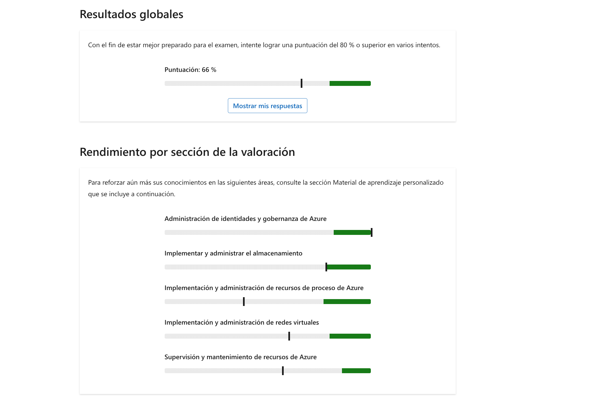

Tiene una suscripción Azure que contiene un grupo de recursos denominado RG1. RG1 contiene una máquina virtual que ejecuta informes diarios.

Debe asegurarse de que la máquina virtual se apaga cuando los costos del grupo de recursos superan el 75 % del presupuesto asignado.

¿Qué dos acciones debe realizar? Cada respuesta correcta presenta parte de la solución.

Seleccione todas las respuestas que procedan.

Cree un grupo de acciones de tipo Runbook y, a continuación, seleccione **Aumentar escala de VM**.

Cree un grupo de acciones de tipo Runbook y, a continuación, seleccione **Detener máquina virtual**.

**Esta respuesta es correcta.**

En Cost Management + Facturación, cree un nuevo análisis de costos.

En Cost Management + Facturación, modifique la configuración de Presupuestos.

**Esta respuesta es correcta.**

Debe ir a Cost Management + Billing y, a continuación, a Presupuestos para editar el presupuesto asociado a los recursos del grupo de recursos. También debe crear un nuevo grupo de acciones del tipo Runbook y, a continuación, elegir "Detener la máquina virtual" como una acción. El análisis de costos no impedirá que se ejecute la máquina virtual y no se requiere la acción de ampliación de máquina virtual.

[Tutorial: creación y administración de presupuestos de Azure : Microsoft Cost Management | Microsoft Learn](https://learn.microsoft.com/azure/cost-management-billing/costs/tutorial-acm-create-budgets)

> [!success] Brain — Respuesta: **En Cost Management + Facturación, modifique la configuración de Presupuestos** + **Cree un grupo de acciones de tipo Runbook y seleccione Detener máquina virtual**
>
> Presupuesto con alerta al 75 % → dispara un grupo de acciones cuya acción (Runbook de Automation) detiene la VM. El análisis de costos solo informa, no actúa; «Aumentar escala de VM» hace justo lo contrario de lo pedido.
>
> 📄 En mi documentación: [az900-monitoring-tools.md](../../../knowledge/az900-monitoring-tools.md) (grupos de acciones) · [az900-cost-management.md](../../../knowledge/az900-cost-management.md) — ⚠️ presupuestos con alertas + acción Runbook no desarrollados (gap).

___
Tiene dos suscripciones Azure denominadas Sub1 y Sub2.

Sub1 contiene una red virtual denominada VNet1 y una puerta de enlace de VPN. Sub2 contiene una red virtual denominada VNet2.

Tiene un dispositivo local denominado Device1 que ejecuta Windows y tiene instalado un cliente VPN de punto a sitio (P2S).

Configuras el emparejamiento de redes entre VNet1 y VNet2.

Debe asegurarse de que Device1 puede acceder a VNet2 cuando se establece una conexión VPN.

¿Qué tiene que hacer?

Seleccione solo una respuesta.

Creación de un punto de conexión privado en Sub2.

**Esta respuesta no es correcta.**

Implemente Azure Front Door en Sub2.

Descargue y vuelva a instalar el cliente VPN P2S en Device1.

**Esta respuesta es correcta.**

Ejecute el `New-SelfSignedCertificate` cmdlet en Device1.

Para asegurarse de que se están descargando las nuevas rutas en el cliente, los clientes VPN de punto a sitio (P2S) deben descargarse e instalarse de nuevo después de que el emparejamiento de red virtual se haya configurado correctamente.

No se requiere un punto de conexión privado ni Azure Front Door para poder acceder a VNet2 desde VNet1.

Device1 ya tiene un certificado digital al instalar el cliente VPN P2S, por lo que no es necesario crear un certificado nuevo manualmente.

[Crear, cambiar o eliminar un emparejamiento de red virtual Azure | Microsoft Learn](https://learn.microsoft.com/azure/virtual-network/virtual-network-manage-peering?tabs=peering-portal#requirements-and-constraints)

> [!success] Brain — Respuesta: **Descargue y vuelva a instalar el cliente VPN P2S en Device1**
>
> El cliente P2S descarga las rutas al instalarse; tras crear un emparejamiento hay que reinstalarlo para que baje las rutas de VNet2. Ni un punto de conexión privado ni Front Door tienen que ver, y el certificado ya se generó en el despliegue inicial.
>
> 📄 En mi documentación: [az104-vnet-peering.md](../../../knowledge/az104-vnet-peering.md) (tránsito de puerta de enlace) — ⚠️ la reinstalación del cliente P2S tras emparejar no está desarrollada (gap).

___
Tiene una suscripción de Azure que contiene las siguientes redes virtuales:

- VNet1: tiene un espacio de direcciones IP de 10.10.0.0/16 y contiene una subred denominada Subnet1 (10.10.1.0/24) que hospeda una máquina virtual denominada VM1 que ejecuta Windows Server.
- VNet2: tiene un espacio de direcciones IP de 10.20.0.0/16 y contiene una subred denominada Subnet2 (10.20.1.0/24) que hospeda una máquina virtual denominada VM2 que ejecuta Windows Server.

VNet1 y VNet2 están conectados mediante el emparejamiento de red virtual.

Los usuarios informan de que VM1 no se puede conectar a VM2.

Debe comprobar si el tráfico de VM1 a la subred 10.20.0.0/16 usa el emparejamiento de red virtual como próximo salto.

¿Qué debe usar?

Seleccione solo una respuesta.

Solución de problemas de conexión en Azure Network Watcher de VM1 a VM2

**Esta respuesta no es correcta.**

rutas eficaces para la interfaz de red de VM1

**Esta respuesta es correcta.**

Azure Network Watcher próximo salto para la interfaz de red de VM1

el rol Controlador de red en VM1

**Objetivo:**

4.1 Configuración y administración de redes virtuales en Azure

**Qué prueba este elemento:**

Creación y configuración de redes virtuales y subredes

**Lectura adicional:**

[Restricciones para redes virtuales enlazadas: formación | Microsoft Learn](https://learn.microsoft.com/en-us/azure/virtual-network/virtual-network-peering-overview#troubleshoot)

Diagnosticador de problemas de red - Entrenamiento | Microsoft Learn

[Administrar redes virtuales: entrenamiento | Microsoft Learn](https://learn.microsoft.com/en-us/training/modules/describe-microsoft-azure-resources-management/4-manage-virtual-networks)

**Justificación:**

Al ver las rutas efectivas en la interfaz de red de VM1, se muestran todas las rutas que Azure aplica al tráfico saliente, incluidas las definidas por el sistema, el emparejamiento y el usuario, así como el tipo de siguiente salto para el prefijo 10.20.0.0/16.

La solución de problemas de conexión valida la accesibilidad, pero no muestra las decisiones de enrutamiento.

Azure Network Watcher próximo salto es una herramienta de diagnóstico que identifica el próximo salto de enrutamiento (tipo, dirección IP e identificador de tabla de rutas) para el tráfico que sale de una máquina virtual. El siguiente salto no muestra las decisiones de enrutamiento.

El rol de Controlador de Red en Windows Server es un punto de administración centralizado y programable para Redes Definidas por Software (SDN).

> [!success] Brain — Respuesta: **rutas eficaces para la interfaz de red de VM1**
>
> Las rutas eficaces muestran la tabla completa aplicada a la NIC (sistema, emparejamiento, UDR) con el tipo de próximo salto de cada prefijo — aquí verías `VNetPeering` para 10.20.0.0/16. «Solución de problemas de conexión» valida accesibilidad, no decisiones de enrutamiento.
>
> 📄 En mi documentación: [az104-user-defined-routes.md](../../../knowledge/az104-user-defined-routes.md) (rutas del sistema, incluido el emparejamiento) · [az104-network-watcher.md](../../../knowledge/az104-network-watcher.md)

____
Tiene una suscripción Azure que contiene una aplicación ASP.NET. La aplicación se hospeda en cuatro máquinas virtuales Azure que ejecutan Windows Server.

Tiene un equilibrador de carga llamado LB1 que distribuye las solicitudes a las máquinas virtuales.

Debe asegurarse de que los usuarios del sitio se conectan al mismo servidor web para todas las solicitudes realizadas a la aplicación.

Seleccione todas las respuestas que procedan.

Configure una regla NAT de entrada.

Establezca Persistencia de sesión en **IP del cliente**.

**Esta respuesta es correcta.**

Establezca Persistencia de sesión en **Ninguna**.

Establezca Persistencia de sesión en **Protocolo**.

**Esta respuesta es correcta.**

Al establecer la persistencia de sesión en IP y protocolo de cliente, asegúrese de que los usuarios del sitio se conectan al mismo servidor web para todas las solicitudes realizadas a la aplicación. Al establecer la persistencia de sesión en Ninguna, se deshabilitan las sesiones permanentes y se usa una regla NAT de entrada para reenviar el tráfico desde un front-end del equilibrador de carga a un grupo de back-end.

modos de distribución [Azure Load Balancer | Microsoft Learn](https://learn.microsoft.com/azure/load-balancer/distribution-mode-concepts)

[Introducción a Azure Load Balancer](https://learn.microsoft.com/en-us/training/modules/intro-to-azure-load-balancer/)

> [!success] Brain — Respuesta: **Persistencia de sesión en IP del cliente** + **Protocolo** (juntas: «IP de cliente y protocolo», hash de 3 tuplas)
>
> El enunciado pide afinidad: 2 tuplas (IP de cliente) o 3 tuplas (IP de cliente + protocolo) fijan las peticiones de un cliente a la misma VM del pool. «Ninguna» balancea cada flujo por 5 tuplas, y la regla NAT de entrada expone una VM concreta, no da afinidad.
>
> 📄 En mi documentación: [az104-load-balancer.md](../../../knowledge/az104-load-balancer.md) — persistencia de sesión (IP de cliente 2-tupla · IP de cliente y protocolo 3-tupla).

___

Tiene una aplicación web funcionando en cuatro máquinas virtuales de Windows Server Azure detrás de un equilibrador de carga.

Los usuarios experimentan problemas al acceder a la aplicación web. Sospecha de un problema con el servidor web y debe comprobar si el servidor está escuchando en el puerto 80.

¿Qué comando debe ejecutar?

Seleccione solo una respuesta.

`Get-AzVirtualNetworkUsageList`

**Esta respuesta no es correcta.**

`nbtstat -c`

`netstat -an`

**Esta respuesta es correcta.**

`Test-NetConnection localhost`

El uso de `netstat -an` enumerará los puertos en los que escucha el servidor. `Test-NetConnection` realizará una prueba de ping/ICMP. `Nbtstat -c` comprueba la memoria caché de NBT. `Get-AzVirtualNetwork` obtiene las redes virtuales en un grupo de recursos.

[Troubleshoot Azure Load Balancer | Microsoft Learn](https://learn.microsoft.com/azure/load-balancer/load-balancer-troubleshoot-backend-traffic)

[Introducción a Azure Load Balancer](https://learn.microsoft.com/en-us/training/modules/intro-to-azure-load-balancer/)

> [!warning] Brain — Respuesta: **`netstat -an`** — no cubierto en mi documentación
>
> `netstat -an` lista los puertos en escucha (buscar `:80 ... LISTENING`). `Test-NetConnection` prueba conectividad (ping/TCP), `nbtstat -c` es la caché NetBIOS y `Get-AzVirtualNetworkUsageList` es de redes virtuales. Comando de Windows, no de Azure.
>
> 📄 Lo más cercano: [az104-load-balancer.md](../../../knowledge/az104-load-balancer.md) (troubleshooting: la VM debe escuchar en el puerto del sondeo).

___

Tiene una red virtual Azure denominada VNet1.

Cree una zona Azure DNS privado denominada contoso.com.

Debe asegurarse de que las máquinas virtuales de VNet1 se registren en la zona DNS privada contoso.com.

¿Qué tiene que hacer?

Seleccione solo una respuesta.

Agregue un vínculo de red virtual a contoso.com.

**Esta respuesta es correcta.**

Agregue el resolutor privado de DNS de Azure a VNet1.

Configure cada máquina virtual para usar un servidor DNS personalizado.

Configure VNet1 para usar un servidor DNS personalizado.

**Esta respuesta no es correcta.**

Para asociar una red virtual a una zona DNS privada, agregue la red virtual a la zona mediante la creación de un vínculo de red virtual.

Azure DNS Private Resolver se utiliza para intermediar en las consultas DNS entre entornos locales y Azure DNS.

Un servidor DNS personalizado funcionará si implementa un servidor DNS como una máquina virtual o un dispositivo, sin embargo, esta configuración no funciona con una zona DNS privada.

[Quickstart: creación de una zona DNS privada de Azure mediante el portal de Azure | Microsoft Learn](https://learn.microsoft.com/azure/dns/private-dns-getstarted-portal)

[Configure Azure DNS - Training | Microsoft Learn](https://learn.microsoft.com/training/modules/configure-azure-dns/)

5. Supervisión y mantenimiento de recursos de Azure

> [!success] Brain — Respuesta: **Agregue un vínculo de red virtual a contoso.com**
>
> La zona privada se asocia a la VNet mediante un vínculo de red virtual; con el **registro automático** activado las VMs se registran solas (registros A). El Private Resolver intermedia consultas híbridas on-prem↔Azure y un servidor DNS personalizado no usa la zona privada de esa forma.
>
> 📄 En mi documentación: [az104-azure-dns.md](../../../knowledge/az104-azure-dns.md) — vínculos de red virtual y tip de registro automático (`-e true`).

___
Tiene una suscripción Azure que contiene una cuenta de almacenamiento denominada storage1.

Debe conceder acceso a una aplicación de terceros a Storage1 durante los próximos 30 días.

¿Qué debe usar?

Seleccione solo una respuesta.

una directiva de acceso condicional

**Esta respuesta no es correcta.**

una firma de acceso compartido

**Esta respuesta es correcta.**

clave de acceso

un rol de Azure

La solución correcta consiste en usar una firma de acceso compartido (SAS), ya que solo SAS puede especificar el acceso limitado de tiempo a Azure almacenamiento. Una clave de acceso proporciona acceso ilimitado a la cuenta de almacenamiento de Azure, un rol de Azure puede proporcionar acceso o administración del recurso de Azure, que no tiene límite de tiempo, y una directiva de acceso condicional actúa como un motor de directivas de confianza cero, "si-entonces", que evalúa señales como la identidad del usuario, el cumplimiento de dispositivos, la ubicación y el riesgo para tomar decisiones de acceso en tiempo real.

[Detección de firmas de acceso compartido](https://learn.microsoft.com/en-us/training/modules/implement-shared-access-signatures/2-shared-access-signatures-overview)  
[Descripción de las firmas de acceso compartido](https://learn.microsoft.com/en-us/training/modules/secure-azure-storage-account/4-shared-access-signatures)

> [!success] Brain — Respuesta: **una firma de acceso compartido**
>
> La SAS delega acceso con expiración (aquí 30 días) sin exponer claves ni crear identidades. La clave de acceso no caduca, el rol de Azure no lleva límite temporal y el acceso condicional evalúa señales de identidad (cero confianza), no delega almacenamiento.
>
> 📄 En mi documentación: [az104-storage-security.md](../../../knowledge/az104-storage-security.md)

___
Tiene una cuenta de Azure Storage que contiene un uso compartido de archivos.

Varios usuarios trabajan desde una ubicación segura que limita el tráfico saliente a Internet.

Debe asegurarse de que los usuarios de la ubicación segura puedan acceder al recurso compartido de archivos en Azure mediante el protocolo SMB.

¿Qué puerto de salida debe permitir en la ubicación segura?

Seleccione solo una respuesta.

80

443

445

**Esta respuesta es correcta.**

5671

Para acceder al recurso compartido de archivos, el puerto 445 debe estar abierto. El puerto 5671 se usa para enviar información de estado a Microsoft Entra. Se recomienda pero no es necesario en las versiones más recientes. El puerto 80 se usa para descargar las listas de revocación de certificados (CRL) para comprobar certificados TLS/SSL. El puerto 443 se usa para el tráfico https, por ejemplo, para sincronizar AD DS con Microsoft Entra.

[Hybrid Identity requiere puertos y protocolos: Azure - Microsoft Entra | Microsoft Learn](https://learn.microsoft.com/azure/active-directory/hybrid/reference-connect-ports)

[Configurar la seguridad de Azure Storage - Entrenamiento | Microsoft Learn](https://learn.microsoft.com/training/modules/configure-storage-security/)

> [!success] Brain — Respuesta: **445**
>
> SMB viaja en el 445 — literal en la página: «muchos ISP bloquean el 445 de salida, que es el problema de conectividad más común al montar recursos compartidos desde entornos locales». 443 es HTTPS, 80 descarga CRLs y 5671 envía telemetría a Entra.
>
> 📄 En mi documentación: [az104-azure-files.md](../../../knowledge/az104-azure-files.md)

___
Su empresa tiene un conjunto de recursos implementados en una suscripción de Azure. Los recursos se implementan en un grupo de recursos denominado app-grp1 mediante plantillas de Azure Resource Manager (ARM).

Debe comprobar la fecha y la hora en que se crearon los recursos de app-grp1.

¿Qué hoja debe revisar para app-grp1 en el portal de Azure?

Seleccione solo una respuesta.

Implementaciones

**Esta respuesta es correcta.**

Configuración de diagnóstico

**Esta respuesta no es correcta.**

Pilas de implementación

Directiva

Navegar a la hoja Configuración de diagnóstico proporciona la capacidad de diagnosticar errores o revisar advertencias. Al navegar a la hoja Métricas se proporciona información de métricas (CPU, recursos) a los usuarios. En la hoja Implementaciones del grupo de recursos (app-grp1), todos los detalles relacionados con una implementación, como el nombre, el estado, la fecha de última modificación y la duración, son visibles. Al navegar al panel Directiva, solo se proporciona información relacionada con las directivas aplicadas en el grupo de recursos.

[Lista de comprobación de implementación de AD de Azure: Microsoft Entra | Microsoft Learn](https://learn.microsoft.com/azure/active-directory/fundamentals/active-directory-deployment-checklist-p2)

> [!success] Brain — Respuesta: **Implementaciones**
>
> La hoja Implementaciones del grupo de recursos es el historial de despliegues: nombre, estado, **fecha y hora**, duración y correlación. Configuración de diagnóstico es logs, Directiva es compliance y las pilas de implementación (deployment stacks) gestionan ciclos de vida, no consultan historial.
>
> 📄 En mi documentación: [az104-arm-templates.md](../../../knowledge/az104-arm-templates.md) — ⚠️ la hoja Implementaciones como fuente de fechas no está desarrollada (gap).

___
Su empresa planea hospedar una aplicación en cuatro máquinas virtuales Azure.

Debe asegurarse de que al menos dos máquinas virtuales están disponibles si se produce un error en un único centro de datos de Azure.

¿Qué opción de disponibilidad debe seleccionar para la máquina virtual?

Seleccione solo una respuesta.

Un conjunto de disponibilidad

**Esta respuesta no es correcta.**

una zona de disponibilidad

**Esta respuesta es correcta.**

conjuntos de escalado

Para protegerse frente a errores de nivel de centro de datos y, si desea conectividad a varias máquinas, debe asegurarse de que las máquinas virtuales se implementan en varias zonas de disponibilidad.

[¿Qué son las regiones de Azure y las zonas de disponibilidad? | Microsoft Learn](https://learn.microsoft.com/azure/reliability/availability-zones-overview)

[Configurar la disponibilidad de la máquina virtual: entrenamiento | Microsoft Learn](https://learn.microsoft.com/training/modules/configure-virtual-machine-availability/)

> [!success] Brain — Respuesta: **una zona de disponibilidad**
>
> «Fallo de un único centro de datos» → zonas de disponibilidad (DCs físicamente separados dentro de la región): reparte las 4 VMs en ≥2 zonas. El conjunto de disponibilidad protege contra fallos de bastidor/actualización **dentro de un mismo DC**, no contra la caída del DC completo.
>
> 📄 En mi documentación: [az104-vm-availability.md](../../../knowledge/az104-vm-availability.md) — conjuntos vs zonas.

___
Va a implementar una máquina virtual mediante un conjunto de disponibilidad en la región de Azure del Este de EE. UU.

Ha implementado 18 máquinas virtuales en dos dominios de fallo y 10 dominios de actualización.

Microsoft realizó el mantenimiento planeado de hardware físico en la región Este de EE. UU.

¿Cuál es el número máximo de máquinas virtuales que estarán no disponibles?

Seleccione solo una respuesta.

2

**Esta respuesta es correcta.**

8

**Esta respuesta no es correcta.**

9

18

18 máquinas virtuales se comparten entre 10 dominios de actualización. Las primeras 10 máquinas virtuales van a 10 dominios de actualización, por lo que ocho dominios de actualización tendrán dos máquinas virtuales. Cuando hay mantenimiento de hardware físico, algunas máquinas virtuales no estarán disponibles en función de su configuración. Si hubiera un fallo en el bastidor, entonces 18 máquinas virtuales se distribuirán en dos dominios de error con nueve máquinas virtuales cada una.

Vista General de Conjuntos de Disponibilidad - Máquinas Virtuales de Azure | Microsoft Learn

[Configurar la disponibilidad de la máquina virtual: entrenamiento | Microsoft Learn](https://learn.microsoft.com/training/modules/configure-virtual-machine-availability/)

> [!success] Brain — Respuesta: **2**
>
> Mantenimiento planeado → se reinicia **un dominio de actualización cada vez**: 18 VMs sobre 10 UDs dejan 8 UDs con 2 VMs → máximo 2 no disponibles. (Si fuera fallo de bastidor/FD: 18 ÷ 2 FDs = 9.) Distinguir UD=mantenimiento vs FD=hardware es LA trampa del ítem.
>
> 📄 En mi documentación: [az104-vm-availability.md](../../../knowledge/az104-vm-availability.md) — «durante el mantenimiento planeado solo se reinicia un dominio de actualización cada vez».

____
Tiene previsto implementar una máquina virtual Azure.

Está evaluando si utilizar una instancia de Spot de Azure.

¿Qué dos factores pueden hacer que se desaloje una instancia de Spot de Azure? Cada respuesta correcta presenta una solución completa.

Seleccione todas las respuestas que procedan.

el promedio de usos de CPU de la instancia

**Esta respuesta no es correcta.**

las necesidades de capacidad Azure

**Esta respuesta es correcta.**

el precio actual de la instancia

**Esta respuesta es correcta.**

la hora del día

Instancias de Spot de Azure permiten aprovisionar máquinas virtuales a un costo reducido, pero Azure puede detener estas máquinas virtuales cuando necesita la capacidad para otras cargas de trabajo de pago por uso, o cuando el precio de la instancia de Spot supera el precio máximo que hayas establecido. Estas máquinas virtuales son adecuadas para desarrollo, pruebas o cargas de trabajo que no requieren ningún Acuerdo de Nivel de Servicio específico.

[Usar máquinas virtuales Spot de Azure - Máquinas virtuales de Azure | Microsoft Learn](https://learn.microsoft.com/azure/virtual-machines/spot-vms)

[Configurar la disponibilidad de la máquina virtual: entrenamiento | Microsoft Learn](https://learn.microsoft.com/training/modules/configure-virtual-machine-availability/)

> [!success] Brain — Respuesta: **las necesidades de capacidad Azure** + **el precio actual de la instancia**
>
> Azure desaloja una Spot cuando necesita la capacidad para cargas de pago por uso o cuando el precio de mercado supera tu precio máximo. Ni el uso de CPU ni la hora del día desalojan por sí solos.
>
> 📄 En mi documentación: [az104-vm-availability.md](../../../knowledge/az104-vm-availability.md) — ⚠️ los factores de desalojo de Spot no están desarrollados (gap).

___
Tiene una suscripción Azure que contiene una aplicación de contenedor denominada App1. App1 está configurada para usar datos almacenados en caché.

Tiene previsto crear un contenedor nuevo.

Debe asegurarse de que el nuevo contenedor actualice automáticamente la memoria caché usada por App1.

¿Qué tipo de contenedor debe configurar?

Seleccione solo una respuesta.

mancha

**Esta respuesta no es correcta.**

inicialización

con privilegios

Sidecar

**Esta respuesta es correcta.**

Azure Container Apps administra los detalles de la orquestación de contenedores y Kubernetes. Los contenedores en Azure Container Apps pueden usar cualquier lenguaje de programación, entorno de ejecución o pila de desarrollo que elija. Puede definir varios contenedores en una sola aplicación contenedora para implementar el patrón sidecar, por ejemplo, un agente que lee los registros del contenedor de aplicaciones principal en un volumen compartido y los reenvía a un servicio de registro.

[Contenedores en Azure Container Apps | Microsoft Learn](https://learn.microsoft.com/azure/container-apps/containers)

> [!warning] Brain — Respuesta: **Sidecar** — no cubierto en mi documentación
>
> Patrón sidecar: contenedor secundario junto al principal que extiende su función (aquí, refrescar la caché de App1) compartiendo ciclo de vida y volúmenes. Los distractores: mancha (stale), inicialización (init container: corre y termina antes del principal) y con privilegios (root).
>
> 📄 Lo más cercano: [az104-container-instances.md](../../../knowledge/az104-container-instances.md) — Container Apps ya estaba marcado ahí como gap del examen.

___
Tiene una suscripción de Azure denominada Sub1 que contiene un grupo de recursos denominado RG1 y un servidor local denominado Server1 que ejecuta Windows Server.

Tiene previsto realizar copias de seguridad de archivos y carpetas de Server1 a Azure mediante Azure Backup.

En RG1, creas una bóveda de servicios de recuperación llamado Vault1.

Instale el agente de Microsoft Azure Recovery Services (MARS) en Server1.

Debe asegurarse de que Server1 puede realizar una copia de seguridad de los datos en Vault1.

¿Qué debe hacer a continuación?

Seleccione solo una respuesta.

Cree una directiva de copia de seguridad para Vault1.

**Esta respuesta no es correcta.**

Descargue las credenciales de Vault1 y registre Server1 con Vault1.

**Esta respuesta es correcta.**

Habilite la eliminación reversible para Vault1.

Modifique la configuración de seguridad de Vault1.

**Objetivo:**

5.2 Implementación de copias de seguridad y recuperación

**Qué prueba este elemento:**

Realizar operaciones de copia de seguridad y restauración mediante Azure Backup

**Lectura adicional:**

[Cómo funciona Azure Backup- Entrenamiento | Microsoft Learn](https://learn.microsoft.com/en-us/training/modules/intro-to-azure-backup/3-how-azure-backup-works)

[Implementa la copia de seguridad híbrida y la recuperación con IaaS de Windows Server - Capacitación | Microsoft Learn](https://learn.microsoft.com/en-us/training/modules/implement-hybrid-backup-recovery-windows-server-iaas/)

**Justificación:**

Correcto: es necesario descargar las credenciales del almacén y registrar el servidor con el almacén de Recovery Services antes de que se puedan producir operaciones de copia de seguridad, ya que esto establece la confianza entre el servidor local y el almacén.

Incorrecto: la configuración de una directiva de copia de seguridad, la habilitación de la eliminación temporal o la modificación de la configuración de seguridad del almacén solo se pueden realizar después de que el almacén registre y reconozca el servidor, por lo que estas acciones no habilitan la conectividad de copia de seguridad por sí sola.

> [!success] Brain — Respuesta: **Descargue las credenciales de Vault1 y registre Server1 con Vault1**
>
> Flujo MARS: instalar agente → **descargar credenciales del almacén → registrar el servidor en el vault** (establece la confianza) → solo después, política y copias. En «¿qué hacer a continuación?» gana siempre el paso más temprano de esa secuencia que aún no se haya hecho.
>
> 📄 En mi documentación: [az104-azure-backup.md](../../../knowledge/az104-azure-backup.md) (agente MARS) · [az104-vm-backup.md](../../../knowledge/az104-vm-backup.md) — ⚠️ el registro con credenciales del almacén no está desarrollado (gap).

> [!warning] Brain — Pantalla de resultados: **66 %** (sube del 54 % del intento anterior) · más flojas: **Proceso** (~50-55 %) y **Supervisión** (~50-55 %) · Red (~60-65 %) · Identidad (~78 %) y Almacenamiento (~75-80 %) ya cerca del umbral
>
> Prioridades según las barras: Proceso → [az104-virtual-machines.md](../../../knowledge/az104-virtual-machines.md) · [az104-vm-availability.md](../../../knowledge/az104-vm-availability.md) · [az104-container-instances.md](../../../knowledge/az104-container-instances.md) (Container Apps sigue siendo gap); Supervisión → [az104-vm-monitoring.md](../../../knowledge/az104-vm-monitoring.md) + [az900-monitoring-tools.md](../../../knowledge/az900-monitoring-tools.md); Red → [az104-load-balancer.md](../../../knowledge/az104-load-balancer.md) · [az104-vnet-peering.md](../../../knowledge/az104-vnet-peering.md). Repaso global por módulo: [az-104-resumen-modulos.md](../../../cheatsheets/az-104-resumen-modulos.md).