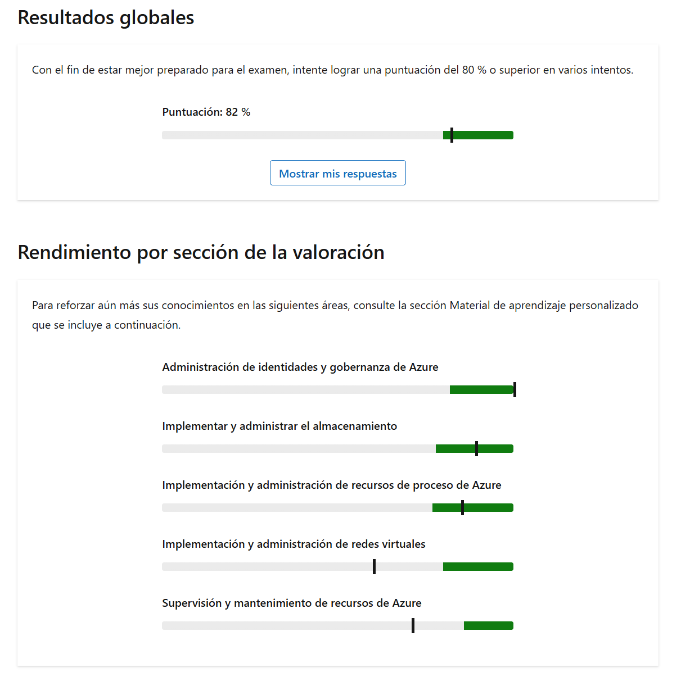

Tiene una suscripción de Azure que contiene una cuenta de almacenamiento denominada storage1 y está vinculada a un inquilino de Microsoft Entra denominado contoso.com.

Tiene previsto proporcionar acceso basado en la identidad a storage1.

¿Qué servicio de datos storage1 se puede configurar para usar el acceso basado en identidades?

Seleccione solo una respuesta.

contenedores

**Esta respuesta no es correcta.**

compartición de archivos

**Esta respuesta es correcta.**

Colas

tablas

Los recursos compartidos de archivos se pueden configurar para usar Microsoft Entra Kerberos y así proporcionar acceso basado en identidad al almacenamiento de datos.

[Configurar cuentas de almacenamiento: entrenamiento | Microsoft Learn](https://learn.microsoft.com/training/modules/configure-storage-accounts/)

Comparar el almacenamiento para recursos compartidos de archivos y datos de blobs - Formación | Microsoft Learn

____

Tiene una red virtual Azure que contiene dos subredes denominadas Subnet1 y Subnet2. Tiene una máquina virtual denominada VM1 que está conectada a Subnet1. VM1 ejecuta Windows Server.

Debe asegurarse de que VM1 está conectada directamente a ambas subredes.

¿Qué debe hacer primero?

Seleccione solo una respuesta.

En el portal de Azure, agregue una interfaz de red.

**Esta respuesta es correcta.**

En el portal de Azure, cree un grupo de IP.

En el portal de Azure, modifique las configuraciones IP de una interfaz de red existente.

Inicie sesión en Windows Server y cree un puente de red.

Se usa una interfaz de red para conectar una máquina virtual a una subred. Dado que VM1 está conectada a Subnet1, VM1 ya tiene una interfaz de red conectada a Subnet1. Para conectar VM1 directamente a Subnet2, debe crear una nueva interfaz de red conectada a Subnet2. A continuación, debe adjuntar la nueva interfaz de red a VM1.

Un grupo IP es una colección definida por el usuario de direcciones IP estáticas, intervalos y subredes. Un puente de red permite conectar varias conexiones de red existentes en Windows juntas. Al cambiar las configuraciones IP de la interfaz de red existente, VM1 se conecta a Subnet2, pero no a Subnet1.

[Redes virtuales y máquinas virtuales en Azure | Microsoft Learn](https://learn.microsoft.com/azure/virtual-network/network-overview)

[Configurar redes virtuales - Entrenamiento | Microsoft Learn](https://learn.microsoft.com/training/modules/configure-virtual-networks/)

____

Tiene una suscripción de Azure que contiene las siguientes redes virtuales:

- VNet1: tiene un espacio de direcciones IP de 10.10.0.0/16 y contiene una subred denominada Subnet1 (10.10.1.0/24) que hospeda una máquina virtual denominada VM1 que ejecuta Windows Server.
- VNet2: tiene un espacio de direcciones IP de 10.20.0.0/16 y contiene una subred denominada Subnet2 (10.20.1.0/24) que hospeda una máquina virtual denominada VM2 que ejecuta Windows Server.

VNet1 y VNet2 están conectados mediante el emparejamiento de red virtual.

Los usuarios informan de que VM1 no se puede conectar a VM2.

Debe comprobar si el tráfico de VM1 a la subred 10.20.0.0/16 usa el emparejamiento de red virtual como próximo salto.

¿Qué debe usar?

Seleccione solo una respuesta.

Solución de problemas de conexión en Azure Network Watcher de VM1 a VM2

rutas eficaces para la interfaz de red de VM1

**Esta respuesta es correcta.**

Azure Network Watcher próximo salto para la interfaz de red de VM1

**Esta respuesta no es correcta.**

el rol Controlador de red en VM1

**Objetivo:**

4.1 Configuración y administración de redes virtuales en Azure

**Qué prueba este elemento:**

Creación y configuración de redes virtuales y subredes

**Lectura adicional:**

[Restricciones para redes virtuales enlazadas: formación | Microsoft Learn](https://learn.microsoft.com/en-us/azure/virtual-network/virtual-network-peering-overview#troubleshoot)

Diagnosticador de problemas de red - Entrenamiento | Microsoft Learn

[Administrar redes virtuales: entrenamiento | Microsoft Learn](https://learn.microsoft.com/en-us/training/modules/describe-microsoft-azure-resources-management/4-manage-virtual-networks)

**Justificación:**

Al ver las rutas efectivas en la interfaz de red de VM1, se muestran todas las rutas que Azure aplica al tráfico saliente, incluidas las definidas por el sistema, el emparejamiento y el usuario, así como el tipo de siguiente salto para el prefijo 10.20.0.0/16.

La solución de problemas de conexión valida la accesibilidad, pero no muestra las decisiones de enrutamiento.

Azure Network Watcher próximo salto es una herramienta de diagnóstico que identifica el próximo salto de enrutamiento (tipo, dirección IP e identificador de tabla de rutas) para el tráfico que sale de una máquina virtual. El siguiente salto no muestra las decisiones de enrutamiento.

El rol de Controlador de Red en Windows Server es un punto de administración centralizado y programable para Redes Definidas por Software (SDN).

____
Tiene una red virtual Azure que contiene cuatro subredes. Cada subred contiene diez máquinas virtuales.

Tiene previsto configurar un grupo de seguridad de red (NSG) que permitirá el tráfico entrante a través del puerto TCP 8080 a dos máquinas virtuales en cada subred. El NSG se asociará a cada subred.

Debe recomendar una solución para configurar el acceso entrante mediante el menor número de reglas de NSG posibles.

¿Qué debe usar como destino en el grupo de seguridad de red?

Seleccione solo una respuesta.

Un grupo de seguridad de aplicaciones

**Esta respuesta es correcta.**

una etiqueta de servicio

las subredes de las máquinas virtuales

**Esta respuesta no es correcta.**

Los grupos de seguridad de aplicaciones permiten agrupar las interfaces de red de varias máquinas virtuales y, a continuación, usar el grupo como origen o destino en una regla de NSG. Las interfaces de red deben estar en la misma red virtual.

Puede usar la dirección IP de cada máquina virtual como destino, pero debe crear una regla para cada máquina virtual.

El uso de las subredes requerirá cuatro reglas y también permitirá el tráfico a todas las máquinas virtuales de esas subredes.

Las etiquetas de servicio son para servicios de Azure específicos, como Azure App Service o Azure Backup.

Introducción a los grupos de seguridad de aplicaciones [Azure | Microsoft Learn](https://learn.microsoft.com/azure/virtual-network/application-security-groups)

[Configurar grupos de seguridad de red: entrenamiento | Microsoft Learn](https://learn.microsoft.com/training/modules/configure-network-security-groups/)

____
Tiene tres grupos de seguridad de red (NSG) denominados NSG1, NSG2 y NSG3. El puerto 80 está bloqueado en NSG3 y se permite en NSG1 y NSG2.

Tiene cuatro Azure máquinas virtuales que tienen las siguientes configuraciones:

VM1:

- Subred: Subnet1
- Tarjeta de red: NIC1
- NIC1 está asociado a NSG2.

VM2:

- Subred: Subnet1
- Tarjeta de red: NIC2
- NIC2 está asociado a NSG3.

VM3:

- Subred: Subnet3
- Tarjeta de red: NIC3
- NIC3 está asociado a NSG3.

VM4:

- Subred: Subnet2

Tiene las siguientes subredes:

- Subnet1 está asociado a NSG1.
- Subnet2 está asociado a NSG3.
- La subred 3 no tiene asignado un NSG.

¿A qué máquina virtual se puede acceder a través de Internet en el puerto 80?

Seleccione solo una respuesta.

VM1

**Esta respuesta es correcta.**

VM2

VM3

VM4

**Esta respuesta no es correcta.**

En VM1, ambos grupos de seguridad de red asignados a Subnet1 y la tarjeta NIC1 permiten el tráfico en el puerto 80. En VM2, NSG1 permite el tráfico, pero NSG3 bloquea el tráfico para la interfaz de red. En VM3 y VM4, NSG3 bloquea el tráfico.

grupo de seguridad de red - cómo funciona | Microsoft Learn

[Configurar grupos de seguridad de red: entrenamiento | Microsoft Learn](https://learn.microsoft.com/training/modules/configure-network-security-groups/)
___
Tiene una suscripción Azure que contiene una cuenta de almacenamiento denominada storage1.

Debe conceder acceso a una aplicación de terceros a Storage1 durante los próximos 30 días.

¿Qué debe usar?

Seleccione solo una respuesta.

una directiva de acceso condicional

**Esta respuesta no es correcta.**

una firma de acceso compartido

**Esta respuesta es correcta.**

clave de acceso

un rol de Azure

La solución correcta consiste en usar una firma de acceso compartido (SAS), ya que solo SAS puede especificar el acceso limitado de tiempo a Azure almacenamiento. Una clave de acceso proporciona acceso ilimitado a la cuenta de almacenamiento de Azure, un rol de Azure puede proporcionar acceso o administración del recurso de Azure, que no tiene límite de tiempo, y una directiva de acceso condicional actúa como un motor de directivas de confianza cero, "si-entonces", que evalúa señales como la identidad del usuario, el cumplimiento de dispositivos, la ubicación y el riesgo para tomar decisiones de acceso en tiempo real.

[Detección de firmas de acceso compartido](https://learn.microsoft.com/en-us/training/modules/implement-shared-access-signatures/2-shared-access-signatures-overview)  
[Descripción de las firmas de acceso compartido](https://learn.microsoft.com/en-us/training/modules/secure-azure-storage-account/4-shared-access-signatures)

____
Tiene una cuenta de Azure Storage denominada storageaccount1 con un contenedor de blobs denominado container1 que almacena información confidencial.

Debe asegurarse de que el contenido de container1 no se modifique ni elimine durante seis meses después de la última fecha de modificación.

¿Qué debe configurar?

Seleccione solo una respuesta.

un rol de Azure personalizado

administración del ciclo de vida

el flujo de cambios

la directiva de inmutabilidad

**Esta respuesta es correcta.**

Se puede aplicar una directiva de retención con tiempo o directivas de suspensión legal para bloquear la eliminación. Las directivas de inmutabilidad pueden estar limitadas a una versión de blob o a un contenedor.

[Información general del almacenamiento inmutable para datos de blobs: Azure Storage | Microsoft Learn](https://learn.microsoft.com/azure/storage/blobs/immutable-storage-overview?tabs=azure-portal)

[Configure Azure Blob Storage - Training | Microsoft Learn](https://learn.microsoft.com/training/modules/configure-blob-storage/)

___
Cree una cuenta de Azure Storage.

Debe crear una regla de administración del ciclo de vida para mover blobs al almacenamiento 'Cool' si los blobs no se han accedido durante 30 días.

¿Qué debe hacer primero?

Seleccione solo una respuesta.

Habilite el seguimiento de acceso.

**Esta respuesta es correcta.**

Habilite el control de versiones para blobs.

Actualice el inventario de blobs.

Gire las claves de cuenta de almacenamiento.

Se puede usar una regla de administración del ciclo de vida para mover o eliminar blobs automáticamente. La regla puede basarse en la hora en que se modificó por última vez el blob o la hora en que se accedió por última vez al blob (lectura o escritura). Para realizar una acción en función de la hora de acceso, se debe habilitar el seguimiento de acceso. Esto puede suponer costos de almacenamiento adicionales.

[Configurar una directiva de administración del ciclo de vida: Azure Storage | Microsoft Learn](https://learn.microsoft.com/azure/storage/blobs/lifecycle-management-policy-configure?tabs=azure-portal)

[Configure Azure Blob Storage - Training | Microsoft Learn](https://learn.microsoft.com/training/modules/configure-blob-storage/)

___
Tiene una suscripción de Azure que contiene 20 redes virtuales y 500 máquinas virtuales.

Debe implementar una nueva máquina virtual denominada VM501.

Detecta que VM501 no puede comunicarse con una máquina virtual denominada VM20 en la suscripción. Sospecha que un grupo de seguridad de red (NSG) es la causa del problema.

Debe identificar si un grupo de seguridad de red (NSG) está bloqueando las comunicaciones. La solución debe minimizar el esfuerzo administrativo.

¿Qué debe usar?

Seleccione solo una respuesta.

registros de diagnóstico

Comprobación del flujo de IP

**Esta respuesta es correcta.**

registros de flujo de red virtual

captura de paquetes

**Esta respuesta no es correcta.**

La comprobación de flujo de IP permite especificar una dirección IPv4 de origen y destino, el puerto, el protocolo (TCP o UDP) y la dirección de tráfico (entrante y saliente). La comprobación del flujo de IP puede identificar el grupo de seguridad de red (NSG) específico que impide la comunicación. Los logs de flujo de NSG son una característica de Azure Network Watcher que registra información del tráfico IP que fluye a través de un NSG. Aunque los registros pueden ayudarle a identificar el origen del problema, requiere mucho más configuración y evaluación manual. La captura de paquetes permite crear sesiones de captura de paquetes para realizar el seguimiento del tráfico hacia y desde una máquina virtual. La captura de paquetes puede ayudar a reducir el ámbito del problema, pero no identificará el grupo de seguridad de red específico que impide la comunicación.

[Azure Network Watcher | Microsoft Learn](https://learn.microsoft.com/azure/network-watcher/network-watcher-monitoring-overview)

[Introducción a Azure Network Watcher - Entrenamiento | Microsoft Learn](https://learn.microsoft.com/en-us/training/modules/intro-to-azure-network-watcher/)

