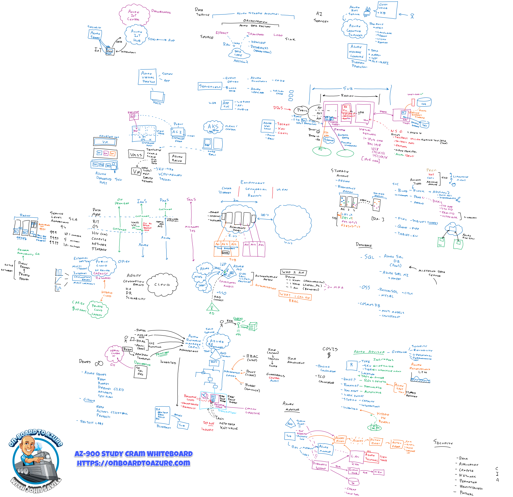

# AZ-900: Microsoft Azure Fundamentals

## Descripción

Certificación de entrada para profesionales tecnológicos que quieren demostrar conocimientos básicos de conceptos cloud en general y de Microsoft Azure en particular. Punto de partida común antes de AZ-104, AZ-500, AZ-305 y el resto de certificaciones de este repositorio. No requiere experiencia técnica previa, aunque ayuda tener trabajo previo en infraestructura, bases de datos o desarrollo de software.

## Objetivos

- Describir los componentes arquitectónicos de Azure y sus servicios (cómputo, redes, almacenamiento).
- Describir las características y herramientas para proteger, gobernar y administrar Azure.

## Habilidades medidas

*Vigente a 20 de julio de 2026 según la guía oficial — verificar antes de programar el examen.*

| Área | Peso |
|---|---|
| Descripción de los conceptos de la nube | 25-30% |
| Descripción de la arquitectura y los servicios de Azure | 35-40% |
| Descripción de la administración y la gobernanza de Azure | 30-35% |

## Módulos

Checklist secuencial del curso [AZ-900T00](https://learn.microsoft.com/es-es/training/courses/az-900t00): 12 módulos en 3 rutas oficiales (composición verificada en Learn el 17/08/2026; la ruta 2 volvió a 5 módulos al separarse redes de proceso). Cada línea: **módulo — Learn — vídeo de Savill — mi nota**.

Los vídeos provienen del *Video Table of Contents* del [handout de John Savill](https://github.com/johnthebrit/AZ900CertCourse/blob/main/John%20Savill's%20AZ-900%20Azure%20Fundamentals%20Certification%20Course%20Handout.pdf) (abril 2025): la serie "AZ-900 Full Course" es una [playlist](https://youtube.com/playlist?list=PLlVtbbG169nED0_vMEniWBQjSoxTsBYS3) de vídeos cortos por tema, no un único vídeo con marcas de tiempo — **@mm:ss es la duración del vídeo**, no un offset. La lista completa de vídeos de cada módulo está en su nota de `knowledge/`.

### Ruta 1 — [Descripción de los conceptos de la nube](https://learn.microsoft.com/es-es/training/paths/microsoft-azure-fundamentals-describe-cloud-concepts/) (25–30%)

- [X] 01 · Informática en la nube — [Learn](https://learn.microsoft.com/es-es/training/modules/describe-cloud-compute/) — [CapEx/OpEx @07:13](https://youtu.be/WiwV9wb0GMo) · [Modelos de nube @12:41](https://youtu.be/7dlCrF2wmXU) — [Mi nota](../../knowledge/az900-cloud-computing.md)
 
- [X] 02 · Ventajas de los servicios en la nube — [Learn](https://learn.microsoft.com/es-es/training/modules/describe-benefits-use-cloud-services/) — [HA y escalabilidad @15:24](https://youtu.be/JRbhGzGzoOA) · [Confiabilidad y previsibilidad @07:16](https://youtu.be/kD2YqdDaO1w) — [Mi nota](../../knowledge/az900-cloud-benefits.md)

- [X] 03 · Tipos de servicio en la nube — [Learn](https://learn.microsoft.com/es-es/training/modules/describe-cloud-service-types/) — [Categorías IaaS/PaaS/SaaS @15:16](https://youtu.be/IqQC1EOQqeU) · [Elegir el tipo adecuado @04:01](https://youtu.be/KH8NH76h2vc) — [Mi nota](../../knowledge/az900-cloud-service-types.md)

### Ruta 2 — [Descripción de la arquitectura y los servicios de Azure](https://learn.microsoft.com/es-es/training/paths/azure-fundamentals-describe-azure-architecture-services/) (35–40%)

- [X] 04 · Componentes arquitectónicos principales — [Learn](https://learn.microsoft.com/es-es/training/modules/describe-core-architectural-components-of-azure/) — [Regiones y pares @13:08](https://youtu.be/4RjPOAN54AE) · [Zonas de disponibilidad @08:41](https://youtu.be/h0enGb17lnw) · [RG @09:38](https://youtu.be/g6thrYZhPZY) · [Suscripciones @08:19](https://youtu.be/9vKAYW_WkLo) · [MG @06:30](https://youtu.be/bPdDiEtCVhM) — [Mi nota](../../knowledge/az900-azure-architecture.md)

- [X] 05 · Servicios de proceso — [Learn](https://learn.microsoft.com/es-es/training/modules/describe-azure-compute-networking-services/) — [Recursos de VM @06:17](https://youtu.be/PP5BWZ0cAJo) · [Compute core @34:32](https://youtu.be/yKDSAYDLGrI) · [Serverless @06:54](https://youtu.be/-xeJGiMw5OE) · [Marketplace @03:12](https://youtu.be/b7RuB4Bymgc) — [Mi nota](../../knowledge/az900-azure-compute.md)

- [X] 06 · Servicios de red — [Learn](https://learn.microsoft.com/es-es/training/modules/describe-azure-networking-services/) — [Redes core @22:04](https://youtu.be/aNK0C9Oj2sg) · [Endpoints públicos/privados @07:23](https://youtu.be/bPNkXwRFsek) · [NSG @08:32](https://youtu.be/flCoRc1uv9o) — [Mi nota](../../knowledge/az900-azure-networking.md)

- [X] 07 · Servicios de almacenamiento — [Learn](https://learn.microsoft.com/es-es/training/modules/describe-azure-storage-services/) — [Cuentas de storage @18:04](https://youtu.be/b8BrfsxLSx8) · [Bases de datos @13:29](https://youtu.be/4sQOF9fSOAU) · [Migración @11:47](https://youtu.be/jNBcXnMTo9s) — [Mi nota](../../knowledge/az900-azure-storage.md)

- [X] 08 · Identidad, acceso y seguridad — [Learn](https://learn.microsoft.com/es-es/training/modules/describe-azure-identity-access-security/) — [Entra @11:34](https://youtu.be/bSIF_GjaCmo) · [RBAC @09:19](https://youtu.be/0iVyJBG06fM) · [Zero Trust @08:13](https://youtu.be/JX3w4to-qgo) *(+6 vídeos en la nota)* — [Mi nota](../../knowledge/az900-azure-identity.md)

### Ruta 3 — [Descripción de la administración y la gobernanza de Azure](https://learn.microsoft.com/es-es/training/paths/describe-azure-management-governance/) (30–35%)

- [X] 09 · Administración de costos — [Learn](https://learn.microsoft.com/es-es/training/modules/describe-cost-management-azure/) — [Factores de coste @06:32](https://youtu.be/fMShW_RGcxY) · [Reducir coste @15:29](https://youtu.be/B5yiKE2DLH8) · [Calculadoras @07:26](https://youtu.be/pE-bf8i5blU) · [Cost Management @05:48](https://youtu.be/FoBjC9CAF08) · [Tags @05:06](https://youtu.be/eaf63hE_6SQ) — [Mi nota](../../knowledge/az900-cost-management.md)

- [X] 10 · Gobernanza y cumplimiento — [Learn](https://learn.microsoft.com/es-es/training/modules/describe-features-tools-azure-for-governance-compliance/) — [Policy @10:50](https://youtu.be/z7WMqHE3R8g) · [Bloqueos @06:16](https://youtu.be/eF_KilJRxbE) · [Purview @10:47](https://youtu.be/mXjXcBr1ajY) · [Jerarquía de gobernanza @06:13](https://youtu.be/ge8r_Z0LKxM) — [Mi nota](../../knowledge/az900-governance-compliance.md)

- [X] 11 · Herramientas de administración e implementación — [Learn](https://learn.microsoft.com/es-es/training/modules/describe-features-tools-manage-deploy-azure-resources/) — [Portal/CLI/PowerShell @09:23](https://youtu.be/6xp-K60ChAk) · [ARM @09:57](https://youtu.be/g4u0NL2-3XM) · [Arc @07:23](https://youtu.be/cW6_rvDYSHg) · [Plantillas ARM @06:41](https://youtu.be/loxcA5MUf-I) — [Mi nota](../../knowledge/az900-management-tools.md)

- [X] 12 · Herramientas de supervisión — [Learn](https://learn.microsoft.com/es-es/training/modules/describe-monitoring-tools-azure/) — [Advisor @03:22](https://youtu.be/nqH4NboyEl0) · [Monitor @10:20](https://youtu.be/v68jL-l9Fww) · [Service Health @02:58](https://youtu.be/M1xPK4T4Vls) — [Mi nota](../../knowledge/az900-monitoring-tools.md)

### Repaso final

- [X] Ver el [AZ-900 Study Cram](https://youtu.be/tQp1YkB2Tgs) de Savill (~3,5 h, edición 2022 — mapea bien con el ámbito vigente)
- [ ] Repasar la whiteboard de ámbito del examen (copia local; original en `raw/savill-cert-materials/`):

- [ ] Repasar el [handout del curso](https://github.com/johnthebrit/AZ900CertCourse/blob/main/John%20Savill's%20AZ-900%20Azure%20Fundamentals%20Certification%20Course%20Handout.pdf) (PDF, 40 págs.)
- [ ] Superar la [evaluación de práctica gratuita](https://learn.microsoft.com/es-es/credentials/certifications/exams/az-900/) y repasar donde falle

## Progreso

Estado: **en curso** (piloto de este repositorio, iniciado 2026-07-07).

Plan de estudio: [notes/AZ-900/roadmap.md](../../notes/AZ-900/roadmap.md) — los 12 módulos de las 3 rutas oficiales del curso AZ-900T00 (checklist arriba) + 8 proyectos guiados con sandbox gratuito, por autoestudio gratuito.

## Laboratorios

En [labs/AZ-900/](../../labs/AZ-900/README.md) — vía principal: los 8 proyectos guiados oficiales de Microsoft Learn con sandbox gratuito.

## Conceptos relacionados

- [[Shared Responsibility Model]]
- [[Azure RBAC]]
- [[Managed Identities]]
- [[Key Vault]]
- [[Entra ID]]
- [[Azure Networking]]
- [[Private Endpoints]]
- [[Terraform vs Bicep]]

## Ejemplos

Referenciar [`examples/`](../../examples/) general cuando exista material (organizado por tecnología, no por certificación).
