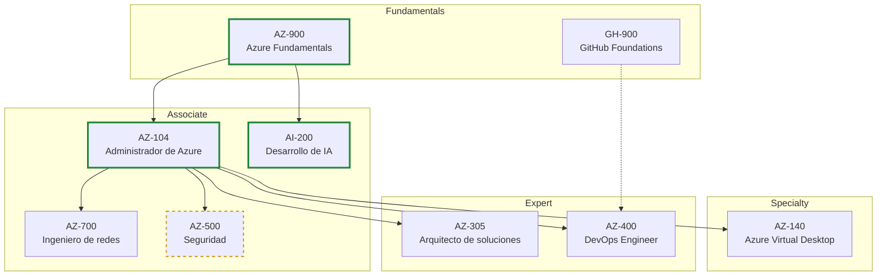

# Roadmap de certificaciones — de básico a experto

Vista global de las 9 certificaciones activas del repositorio, ordenadas por nivel y dependencias. **Este fichero decide el orden de ataque**; el detalle de cada certificación vive en su `INDEX.md` y, cuando está en curso, en su roadmap de estudio en `notes/<CERT>/roadmap.md`.

Whiteboards de ámbito de examen (John Savill, MVP) disponibles en `raw/savill-cert-materials/whiteboards/` para AZ-900, AZ-104, AZ-500, AZ-700 y AZ-305 — enlazados desde cada INDEX.

## Nivel 1 — Fundamentals

Puerta de entrada. No prueban habilidad práctica: miden vocabulario y comprensión conceptual del portal. Se preparan en semanas, no meses.

| Cert | Nombre oficial | Papel en la ruta | Estado |
|---|---|---|---|
| [AZ-900](AZ-900/INDEX.md) | Microsoft Azure Fundamentals | **El punto de partida obligatorio**: conceptos de servicios, facturación, gobernanza, SLAs. Todo lo demás asume este vocabulario. | En curso (piloto del repo) |
| [GH-900](GH-900/INDEX.md) | GitHub Foundations | Paralela y corta. Base de Git/GitHub Actions que AZ-400 (DevOps) da por sabida. Se puede hacer en cualquier momento como descanso entre bloques. | No iniciado |

## Nivel 2 — Associate

El pilar central es AZ-104; el resto son ramas que profundizan un dominio concreto.

| Cert | Nombre oficial | Papel en la ruta | Estado |
|---|---|---|---|
| [AZ-104](AZ-104/INDEX.md) | Administrador de Microsoft Azure | **El certificación-eje**: identidad, redes, storage, cómputo, monitorización a nivel operativo. AZ-500, AZ-700, AZ-140 y AZ-305 asumen este nivel. Priorizar terminarlo antes de ramificar. | **En curso** — [roadmap](../notes/AZ-104/roadmap.md) |
| [AI-200](AI-200/INDEX.md) | Desarrollo de soluciones en la nube de IA en Azure | Rama de desarrollo IA: Python, RAG, Cosmos DB, contenedores. Solo depende de AZ-900 conceptualmente; se puede llevar en paralelo con AZ-104. | **En curso** — [roadmap](../notes/AI-200/roadmap.md) |
| [AZ-700](AZ-700/INDEX.md) | Diseño e implementación de soluciones de redes de Microsoft Azure | Rama de networking profundo: VNets híbridas, Load Balancer, App Gateway, WAN, ExpressRoute, Network Watcher. Natural tras AZ-104. | No iniciado |
| [AZ-500](AZ-500/INDEX.md) | Tecnologías de seguridad de Microsoft Azure | Rama de seguridad: Defender, Sentinel, RBAC/PIP avanzado, Key Vault. Supone AZ-104 dominado. | No iniciado — ⚠️ **se retira el 31/08/2026** (ver abajo) |

> ⚠️ **AZ-500 se retira el 31 de agosto de 2026** según la guía oficial (ver [AZ-500/INDEX.md](AZ-500/INDEX.md)). Con fecha de hoy (17/08/2026) ya no da tiempo a prepararla de cero: decidir entre dejarla pasar y esperar al examen que la sustituya, o examinarse solo si ya se dominara el temario. **Verificar el sucesor en Microsoft Learn antes de planificar.**

## Nivel 3 — Specialty

| Cert | Nombre oficial | Papel en la ruta | Estado |
|---|---|---|---|
| [AZ-140](AZ-140/INDEX.md) | Configuración y funcionamiento de Microsoft Azure Virtual Desktop | Especialidad vertical (AVD/FSLogix/Entra ID en contexto de escritorios). Opcional según el rol laboral: interesante si el trabajo toca escritorios virtuales; prescindible si no. | No iniciado |

## Nivel 4 — Expert

| Cert | Nombre oficial | Papel en la ruta | Estado |
|---|---|---|---|
| [AZ-305](AZ-305/INDEX.md) | Diseño de soluciones de infraestructura de Microsoft Azure | **Arquitecto experto**. Cambia el registro: ya no es operar (AZ-104) sino *diseñar* — requisitos, trade-offs, coste, gobernanza, continuidad. Recomendado llegar con AZ-104 + experiencia real. | No iniciado |
| [AZ-400](AZ-400/INDEX.md) | Diseño e implementación de soluciones de Microsoft DevOps | **DevOps experto**. CI/CD, IaC, SRE, GitHub Actions/ADO. La credencial experta exige oficialmente tener AZ-104 (o AZ-204) además de aprobar AZ-400 — el pilar AZ-104 es literalmente prerrequisito. GH-900 cubre el hueco de GitHub. | No iniciado |

## Secuencia recomendada

Orden lineal de ataque, con las ramas en paralelo donde no chocan:

1. **AZ-900** — en curso. Terminarla primero: es barata y suelta el vocabulario para todo lo demás.
2. **GH-900** — corta y transversal; buena pausa entre AZ-900 y AZ-104.
3. **AZ-104** — el eje. Máxima prioridad una vez cerrado AZ-900.
4. **AI-200** — en paralelo con AZ-104 si hay energía para dos frentes; si no, justo después.
5. **AZ-700** — primera rama post-AZ-104 (las redes son la base más transversal de las tres ramas).
6. **AZ-500** — condicionada por su retirada (31/08/2026): esperar al sucesor salvo dominio previo del temario.
7. **AZ-305** — primer experto. Ideal con unos meses de experiencia operativa tras AZ-104.
8. **AZ-400** — segundo experto; requiere la credencial AZ-104 ya en mano (la ruta ya la incluye).
9. **AZ-140** — especialidad oportunista: hacerla cuando el rol laboral la pida, no por plan.

## Estado actual (2026-08-17)

| Cert | Estado |
|---|---|
| AZ-900 | En curso (piloto del repo, iniciado 2026-07-07) |
| AZ-104 | En curso — [roadmap](../notes/AZ-104/roadmap.md) |
| AI-200 | En curso — [roadmap](../notes/AI-200/roadmap.md) |
| AZ-500, AZ-700, AZ-140, AZ-305, AZ-400, GH-900 | No iniciados |

Próximo hito natural: **cerrar AZ-900** para dejar la fase de fundamentos completa y consolidar AZ-104 como única prioridad.

## Relacionado

- [INDEX.md](../INDEX.md) — catálogo raíz
- Cada certificación: [AZ-900](AZ-900/INDEX.md) · [GH-900](GH-900/INDEX.md) · [AZ-104](AZ-104/INDEX.md) · [AZ-500](AZ-500/INDEX.md) · [AZ-700](AZ-700/INDEX.md) · [AZ-140](AZ-140/INDEX.md) · [AZ-305](AZ-305/INDEX.md) · [AZ-400](AZ-400/INDEX.md) · [AI-200](AI-200/INDEX.md)
- Roadmaps de estudio en curso: [notes/AZ-104/roadmap.md](../notes/AZ-104/roadmap.md), [notes/AI-200/roadmap.md](../notes/AI-200/roadmap.md)
