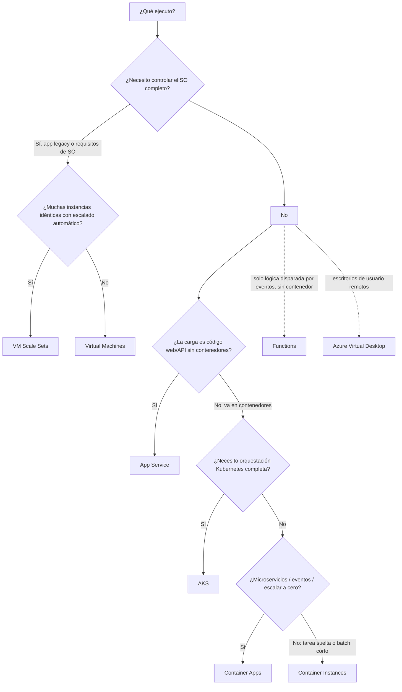

# Guía de decisión — Opciones de cómputo en Azure

La pregunta recurrente del examen y del trabajo real: **"¿dónde ejecuto esta carga?"**. Esta guía cruza todos los servicios de cómputo en una sola vista — las fichas por módulo están en `knowledge/`, aquí lo que hay que razonar es la elección.

La regla mental: **cuanto menos gestionas, más decisiones toma la plataforma por ti** — y al revés, cuánto más control exiges, más operas. IaaS (VM) → PaaS (App Service, Container Apps) → serverless (ACI puntual, Functions).

## Árbol de decisión

## Comparativa

| Servicio | Modelo | Tú gestionas | Escalado | Facturación | Elige cuando | Evita cuando |
|---|---|---|---|---|---|---|
| [VM](../knowledge/az104-virtual-machines.md) | IaaS | SO, parches, app | Manual / autoescala por métrica | Por segundo con VM en ejecución (no detenida-deasignada) | Control total del SO, software legacy, imágenes personalizadas | Carga web estándar que PaaS sirve mejor |
| [VMSS](../knowledge/az104-vm-availability.md) | IaaS | Igual que VM, a escala | Automático (mín/máx/métrica) | Por instancia | Flota uniforme con alta disponibilidad y autoscale | Cargas heterogéneas o una sola máquina |
| [App Service](../knowledge/az104-app-service.md) | PaaS | Código y configuración | Escalado manual o automático por plan | Por instancia del **plan** (no por app: N apps comparten) | Apps web, APIs, backends con CI/CD y slots | Necesitas acceso al SO o ejecutar cualquier binario |
| [ACI](../knowledge/az104-container-instances.md) | Serverless (contenedor) | Solo el contenedor | No hay: se ajusta CPU/mem al crear (0,1–4 vCPU · 0,1–16 GB por contenedor) | Por segundo de ejecución | Contenedor suelto, tarea corta, batch, jobs, dev/test | Microservicios de larga vida o necesidad de orquestación |
| Container Apps | PaaS (contenedor) | Contenedor y app | Automático con KEDA (HTTP, eventos, CPU/mem) — **escala a cero** | Por uso (ejecución y revisiones activas) | Microservicios y jobs controlados por eventos sin gestionar K8s | Necesitas APIs nativas de Kubernetes |
| AKS | PaaS sobre K8s | Clúster (nodos, upgrades opcionales), workloads | HPA de pods + autoscale de nodos | Nodos (VM) + complementos | Ya hay experiencia K8s o requisitos de orquestación completos | Equipo sin conocimientos K8s — empezar por Container Apps |
| Functions | FaaS | Solo la función | Automático por eventos | Por ejecución + consumo | Trozos de código disparados por eventos (colas, timers, HTTP) | Lógica de ejecución larga o con estado complejo |
| [AVD](../knowledge/azure-virtual-desktop.md) | DaaS | Imágenes y pools | Por pool | Por usuario o consumo | Escritorios/apps de usuario remotos | Carga de servidor sin usuarios interactivos |

## Matices que caen en el examen

- **App Service plan**: Free/Shared = cómputo compartido con otros clientes, **sin escalado horizontal**, solo dev/test. Basic → PremiumV4 = VMs dedicadas donde solo tus apps del plan comparten recursos. IsolatedV2 = VMs dedicadas + VNet dedicada (App Service Environment). Se paga **por instancia del plan**, no por app — dos planes con apps pequeñas suelen costar más que un plan compartido por ellas.
- **ACI vs Container Apps**: ACI es el contenedor *individual* sin orquestación; Container Apps aporta entorno, revisions, ingress y escalado KEDA **sin acceso a las APIs de K8s**. Ambos se apoyan en la misma idea: tú no ves nodos.
- **El registro común**: ACI, Container Apps y AKS consumen imágenes de **Azure Container Registry** (gap del examen: crear/administrar ACR, geo-replicación, tareas de build — ver [docs de ACR](https://learn.microsoft.com/es-es/azure/container-registry/)).
- **Grupos de contenedores (ACI)**: varios contenedores comparten host, ciclo de vida, red (misma IP, sin mapeo de puertos) y volúmenes — el equivalente a un pod de K8s.
- **El truco de las preguntas "qué servicio elegir"**: si la respuesta menciona *contenedores sin administrar servidores ni orquestación* → ACI; *microservicios/eventos/escala a cero sin K8s* → Container Apps; *control total del clúster* → AKS; *app web sin ver infraestructura* → App Service.

## Relacionado

- [Contenedores frente a máquinas virtuales](containers-vs-vms.md) — la comparación de fondo
- [Configuración de Azure App Service (AZ-104)](../knowledge/az104-app-service.md) · [Planes de App Service (AZ-104)](../knowledge/az104-app-service-plans.md)
- [Configuración de Azure Container Instances (AZ-104)](../knowledge/az104-container-instances.md)
- [Introducción a Azure Virtual Machines (AZ-104)](../knowledge/az104-virtual-machines.md) · [Disponibilidad de VMs (AZ-104)](../knowledge/az104-vm-availability.md)
- Chuleta de comandos: [AZ-104 Compute](../cheatsheets/az-104-compute.md)
