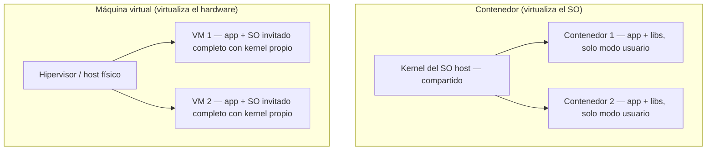

# Contenedores frente a máquinas virtuales

Contenedores y máquinas virtuales son las dos formas de virtualización que hay que distinguir para AZ-104. Muchas implementaciones de contenedores en la nube se ejecutan de hecho **sobre VMs** (el host es una VM), así que no son tecnologías excluyentes sino complementarias.

## Arquitectura

La diferencia raíz: **el contenedor comparte el kernel del SO host; la VM tiene su propio kernel**.

## Comparativa

| Característica | Máquina virtual | Contenedor |
|---|---|---|
| **Aislamiento** | Completo del host y de otras VMs — límite de seguridad fuerte (p. ej. apps de empresas competidoras en el mismo servidor) | Ligero del host y del resto de contenedores — no es un límite de seguridad tan sólido (se refuerza con aislamiento Hyper-V: cada contenedor en una VM ligera) |
| **Sistema operativo** | SO completo incluido kernel — más CPU, memoria y almacenamiento | Solo la parte en modo usuario del SO, reducida a lo que la app necesita — menos recursos |
| **Compatibilidad de invitado** | Casi cualquier SO dentro de la VM | Misma versión de kernel que el host (con aislamiento Hyper-V, versiones anteriores del mismo SO) |
| **Despliegue** | Individual: portal/PowerShell/CLI · en masa: plantillas o VMM | Individual: `docker run` · en masa: orquestador (AKS) |
| **Actualizaciones del SO** | Instalar actualizaciones en cada VM; nueva versión de SO = nueva VM | Editar el Dockerfile, reconstruir la imagen, subirla al registro y redesplegar — el orquestador lo automatiza a escala |
| **Almacenamiento persistente** | VHD local o recurso compartido SMB | Azure Disks (nodo único) o Azure Files SMB (compartido entre nodos) |
| **Tolerancia a errores** | La VM conmuta por error a otro servidor del clúster y su SO arranca allí | El contenedor no se mueve: el orquestador lo **recrea** en otro nodo en segundos |
| **Redes** | NIC virtual propia | Vista aislada de la NIC del host — el firewall del host se comparte entre contenedores |

La tabla completa original (con equilibrio de carga y detalles de redes de Windows) está en el [documento fuente](https://learn.microsoft.com/es-es/virtualization/windowscontainers/about/containers-vs-vm).

## Cuándo elegir cada uno

**VM cuando:**
- Necesitas un **límite de seguridad fuerte** entre cargas.
- La app exige un **SO concreto o legacy** que el kernel del host no puede dar.
- Quieres control total: instalar, tunear, parchear el SO a tu manera.

**Contenedores cuando:**
- Priorizas **arranque rápido** (segundos), densidad de carga y uso eficiente de recursos.
- Quieres portabilidad total (la imagen se comporta igual en dev, test y producción).
- Tu flujo es CI/CD: la unidad de despliegue es la imagen, no el servidor.
- Divides una tarea funcional en varias imágenes (sidecars: logging, monitorización, front-end/back-end).

## Qué recordar para el examen

- El contenedor **no tiene kernel propio** — es la pregunta trampa más típica.
- Aislamiento de contenedor = **ligero**, no un límite de seguridad duro; para endurecerlo existe el modo Hyper-V.
- Actualizar el SO de un contenedor = **rebuild de la imagen + redesplegar** (no se parchea en caliente como una VM).
- Ante fallo de nodo: la VM **se mueve**; el contenedor **se recrea**.
- En Azure: contenedor suelto sin gestionar servidores → [Azure Container Instances](../knowledge/az104-container-instances.md); a escala con orquestación → AKS.

## Relacionado

- [Configuración de Azure Container Instances (AZ-104)](../knowledge/az104-container-instances.md) — ficha del módulo 17 (grupos de contenedores, ACI vs Container Apps)
- [Introducción a Azure Virtual Machines (AZ-104)](../knowledge/az104-virtual-machines.md)
- [Servicios de cómputo de Azure (AZ-900)](../knowledge/az900-azure-compute.md)
- [Guía de decisión — opciones de cómputo en Azure](compute-decision-guide.md)
