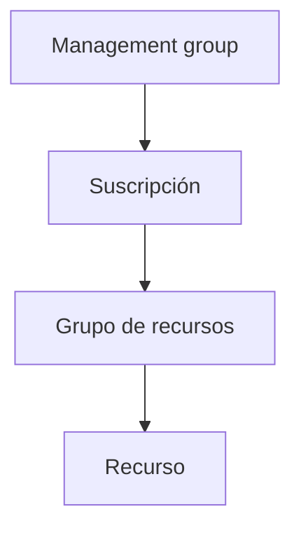

# Guía de decisión — Identidad y gobernanza en Azure

Las cuatro preguntas que resuelven RBAC, Azure Policy, locks y tags. En el examen (y en incidentes reales) se confunden constantemente — la clave es saber **qué controla cada herramienta**:

| Pregunta | Herramienta | Controla | Ejemplo |
|---|---|---|---|
| ¿**Quién** puede hacer **qué**? | **RBAC** | Permisos de acciones sobre recursos | "El grupo Marketing es Contributor solo en el RG `pharma-sales`" |
| ¿**Qué** está permitido en el entorno? | **Azure Policy** | Convenciones y restricciones sobre propiedades | "Solo se permiten VM de ciertos SKUs" / "Exigir tag de centro de coste" |
| ¿Cómo protejo de **borrado/cambio accidental**? | **Locks** | Bloqueo de operaciones de escritura o borrado | ReadOnly en el RG de producción |
| ¿Cómo **organizo e informo**? | **Tags + jerarquía** | Metadatos y agrupación (MG/sub/RG) | Tag `env=prod` para filtrar costes |

## La jerarquía lo hereda (casi) todo

- **RBAC**: asignación = *principal de seguridad* + *definición de rol* + *ámbito*. Los cuatro niveles son ámbitos válidos y **heredan hacia abajo**.
- **Policy**: las asignaciones heredan por la misma jerarquía (una iniciativa en la MG gobierna todas las suscripciones).
- **Locks**: heredan a todo lo que hay debajo.
- **Tags**: **NO se heredan automáticamente** — se replican con Policy si se quiere.

## RBAC — el modelo aditivo

- Permisos efectivos = **suma de todas las asignaciones** (menos denegaciones por deny assignments o Policy deny). Si eres Contributor en la suscripción y Reader en un RG, sigues siendo Contributor: el Reader "no resta".
- **P4X**: cada rol es `Acciones / NotActions / DataActions / NotDataActions` — el plano de gestión (ARM) y el plano de **datos** son permisos separados (de ahí los roles "… Data …" de Storage).
- Roles integrados clave: **Owner** (todo + delegar acceso) · **Contributor** (todo menos gestionar permisos) · **Reader** (solo lectura) · **User Access Administrator** (gestionar permisos, para no dar Owner).
- Los grupos de seguridad de Entra ID son la forma recomendada de asignar (gestión centralizada), mejor que asignar a usuarios sueltos.

## Azure Policy — convención, no permiso

- Cadena: **definición** (regla) → **iniciativa** (conjunto de definiciones, p. ej. las iniciativas de soberanía del módulo 04) → **asignación** (definición/iniciativa en un ámbito).
- Efectos típicos: **Audit** (registra incumplimiento, no bloquea) · **Deny** (bloquea el create/update) · **Modify/DeployIfNotExists** (remedia: añade tag, despliega extensión…).
- Evaluación continua: recursos existentes marcados como *non-compliant*; la remediación de los existentes hay que lanzarla (`az policy remediation`).

## RBAC vs Policy — la pareja del examen

RBAC limita **lo que un usuario puede hacer** (no ve el botón); Policy limita **lo que cualquier usuario —incluido Owner— puede crear** (el botón está pero la petición se rechaza). Se complementan: Owner + Policy Deny = puede casi todo, salvo lo que la política veta.

## Locks — el cinturón de seguridad

- `CanNotDelete` (Delete lock): se puede leer y modificar, no borrar.
- `ReadOnly`: se puede leer, no modificar (efecto similar a conceder Reader a todos — ¡ojo, bloquea incluso a Contributor para escribir!).
- Heredan; para borrar un recurso protegido hay que quitar primero el lock del recurso **o de un nivel superior**.
- Los crea/quita quien tiene `Microsoft.Authorization/locks/*` (Owner o User Access Administrator), **independientemente del rol de Contributor**.

## Qué recordar para el examen

- Reader **no es inofensivo** en storage: puede leer las claves de cuenta (plano de gestión) y con ellas los datos.
- ReadOnly lock sobre una storage account bloquea incluso listar claves (necesita POST) — síntoma típico de pregunta.
- Una asignación RBAC y una Policy en el mismo ámbito no entran en conflicto: **actúan en planos distintos**.
- Los locks **no son control de acceso**: un Contributor sin locks puede borrar; el lock detiene el borrado incluso para él.
- Costes: **alertas** (umbral sobre gasto), **presupuestos** (budget con acciones al superar %) y **Advisor** (recomendaciones) — el otro trío que cae en este bloque.

## Relacionado

- [Protección de recursos con Azure RBAC (AZ-104)](../knowledge/az104-azure-rbac.md) · [Iniciativas de Azure Policy (AZ-104)](../knowledge/az104-azure-policy.md)
- [Entender Microsoft Entra ID (AZ-104)](../knowledge/az104-entra-id.md) · [Identidades (AZ-104)](../knowledge/az104-identities.md) · [SSPR (AZ-104)](../knowledge/az104-sspr.md)
- [Entra ID](../knowledge/entra-id.md) (stub)
- Chuleta de comandos: [AZ-104 Identidad y gobernanza](../cheatsheets/az-104-identity-governance.md)
