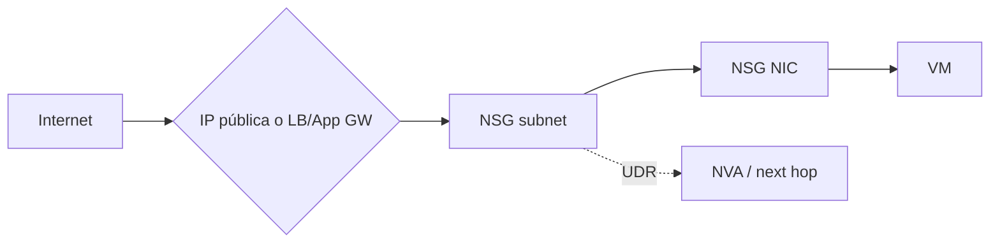

# Modelo mental de red en Azure — Bloque 4

Mapa de conjunto **antes de empezar los 8 módulos del Bloque 4** de AZ-104. La idea: en Azure todo el tráfico entre recursos de una VNet viaja por el backbone privado; las piezas (subnets, NSG, rutas, peering, endpoints, balanceadores) son filtros y caminos que se apilan. Cada módulo del bloque desarrolla una pieza — aquí está cómo encajan.

## 1. El espacio: VNet y subnets

- Una **VNet** vive en una región; su *address space* (CIDR privadas, p. ej. 10.0.0.0/16) se trocea en **subnets** (10.0.1.0/24…) que no pueden solaparse.
- Cada VM recibe una **NIC** con IP privada de su subnet (dinámica o estática); la IP pública es un recurso aparte, asociado a la NIC o a un servicio.
- Azure reserva **5 IPs por subnet** (.0 red, .1 gateway, .2/.3 DNS, .255 broadcast) — una /24 da 251 utilizables.
- El tráfico entre subnets de la misma VNet es privado y va por rutas del sistema — no sale a Internet.

## 2. El guardián: NSG

- NSG = lista de reglas **stateful** aplicada a una **subnet**, a una **NIC**, o ambas (reglas efectivas = combinación).
- Prioridad **100–4096**: gana el número más bajo; cuando una regla coincide, el procesamiento **se detiene**. Las reglas por defecto tienen la prioridad más baja (AllowVNetInBound 65000, AllowAzureLoadBalancerInBound 65001, DenyAllInBound 65500) para que las tuyas siempre se evalúen antes.
- Regla = 5-tupla (origen, puerto origen, destino, puerto destino, protocolo) + acción Allow/Deny. Los **service tags** (`VirtualNetwork`, `Internet`, `AzureLoadBalancer`…) sustituyen a rangos de IP.
- **ASG** (application security groups) agrupan NICs para escribir reglas por nombre de app en vez de por IP.

## 3. Los caminos: rutas del sistema y UDR

| Ruta del sistema | Next hop | Efecto |
|---|---|---|
| VNet local | VNet | Tráfico dentro de la VNet |
| 0.0.0.0/0 | Internet | Salida a Internet (y retorno) |
| Opcionales | Virtual network gateway, AzureLoadBalancer | VPN/ExpressRoute, LB |

Las **UDR** (user-defined routes) se aplican por subnet y **prevalecen** sobre las del sistema por coincidencia de prefijo más largo (LPM). Next hop típico: *Virtual appliance* (una NVA firewall) para forzar el tráfico por inspección — el patrón hub-spoke. `None` descarta el tráfico.

## 4. La conexión: peering

- Peering = enlace **privado** entre dos VNets (puede ser inter-región, *global peering*); el tráfico viaja por el backbone, nunca por Internet.
- **No es transitivo**: si A↔B y B↔C, A no habla con C solo por eso (el clásico de examen) — o se peera todo con un hub, o se usa *gateway transit* en B.
- **Gateway transit**: la VNet remota usa la VPN gateway de la peer para llegar a on-prem. Una VNet solo puede usar una gateway (local o remota, no ambas).
- Se factura el tráfico que cruza el peering en ambas direcciones.

## 5. PaaS: pública → service endpoint → private endpoint

| | Sin nada | **Service endpoint** | **Private endpoint** |
|---|---|---|---|
| Tráfico a la PaaS | Va por Internet | Por el backbone (desde la subnet) | Por el backbone (IP privada en tu VNet) |
| La PaaS expone | IP pública | Sigue con IP pública, pero firewall acepta solo esa subnet | **No necesita IP pública** para ti |
| Caso de uso | Dev/test | Cerrar el acceso público por subnets sin consumir IP privada | Aislar del todo el recurso (examen lo exige explícito) |

Ver [Private Endpoints](../knowledge/private-endpoints.md) y [Hub-Spoke](../knowledge/hub-spoke.md).

## 6. Repartir el tráfico: LB vs App Gateway

| | [Load Balancer](../knowledge/az104-load-balancer.md) | [Application Gateway](../knowledge/az104-application-gateway.md) |
|---|---|---|
| Capa | **L4** (TCP/UDP) | **L7** (HTTP/HTTPS) |
| Decide por | 5-tupla (hash) | Path, host, cabeceras |
| Extras | Health probes, interno/público, HA ports | SSL termination, *path-based routing*, **WAF**, redirección |
| Elige para | Cualquier TCP/UDP, alto rendimiento, barato | APIs y webs con routing HTTP o necesidad de WAF |

(Ambos son *región*; para balanceo global + TLS → Front Door.)

## 7. DNS

- **Azure DNS**: alojar zonas **públicas** (resueltas desde Internet) y **privadas** (resueltas solo dentro de VNets asociadas).
- Registros habituales: A (nombre→IP), CNAME (nombre→nombre), MX, TXT. Delegación con NS en el registrador.
- Los recursos de Azure se registran automáticamente en el DNS interno de Azure (`*.internal.cloudapp.net`...); la resolución on-prem↔Azure exige DNS personalizado o private zones.

## 8. Cuando algo no conecta — la escalera de diagnóstico

1. ¿Resuelve el nombre? (DNS/`nslookup`)
2. ¿Está la IP/puerto correctos? (IP privada/pública, listener)
3. ¿Hay NSG bloqueando? → **reglas efectivas** de subnet+NIC
4. ¿Hay una UDR desviando el paquete? → **Next hop**
5. ¿El peering existe y es el camino esperado? (recuerda: no transitivo)
6. ¿La PaaS es privada y se accede por el endpoint correcto?

Herramientas de **Network Watcher** (gap del examen — [docs](https://learn.microsoft.com/es-es/azure/network-watcher/network-watcher-monitoring-overview)): *IP flow verify* (¿qué regla bloquea?), *Next hop* (¿por dónde sale?), *Connection Monitor* (latencia/disponibilidad continua), *NSG flow logs*, *packet capture*, *Topology*.

## Relacionado

- Fichas del Bloque 4: [Redes virtuales](../knowledge/az104-virtual-networks.md) · [NSG](../knowledge/az104-network-security-groups.md) · [Azure DNS](../knowledge/az104-azure-dns.md) · [Peering](../knowledge/az104-vnet-peering.md) · [UDR](../knowledge/az104-user-defined-routes.md) · [Load Balancer](../knowledge/az104-load-balancer.md) · [Application Gateway](../knowledge/az104-application-gateway.md) · [Network Watcher](../knowledge/az104-network-watcher.md)
- Stubs: [Azure Networking](../knowledge/azure-networking.md) · [Private Endpoints](../knowledge/private-endpoints.md) · [Hub-Spoke](../knowledge/hub-spoke.md)
- [Roadmap AZ-104 — Bloque 4](../notes/AZ-104/roadmap.md)
