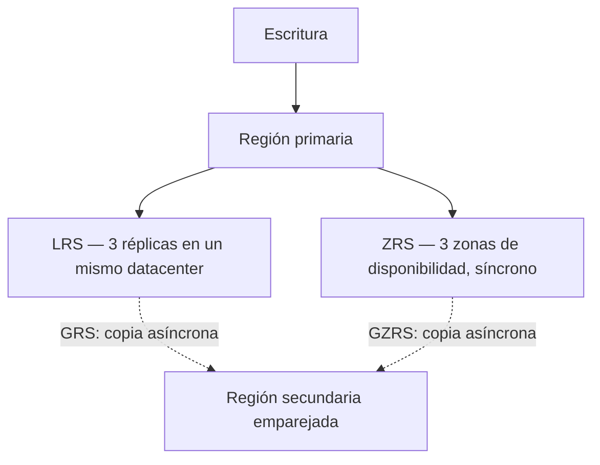

# Guía de decisión — Almacenamiento en Azure

Cuatro decisiones encadenadas al diseñar almacenamiento: **qué servicio → qué redundancia → qué tier → cómo se accede**. Las fichas del Bloque 2 están en `knowledge/az104-storage-*`; aquí se junta el razonamiento completo.

## 1. ¿Qué servicio?

| Servicio | Qué es | Elige cuando |
|---|---|---|
| **Blob Storage** | Objetos no estructurados vía REST/HTTP | Imágenes, documentos, backups, datos para análisis, sitio web estático. Tiers y ciclo de vida |
| **Azure Files** | Recursos compartidos SMB/NFS (PaaS) | Compartir ficheros entre VMs/apps o con on-prem (híbrido con **File Sync**: cachear en local y tiers en la nube) |
| **Queue Storage** | Colas de mensajes | Desacoplar componentes de una app (productor/consumidor) |
| **Table Storage** | NoSQL clave-valor | Datos semiestructurados con acceso clave/partición, sin SQL |
| **Managed Disks** | Discos de VM | Almacenamiento de VMs — **no vive en una storage account**, se crea junto a la VM |
| **Data Lake Gen2** | Blob + namespace jerárquico | Analítica a escala (activar *hierarchical namespace* en la cuenta) |

Todos (menos los discos) viven dentro de una **storage account**: `https://<cuenta>.blob.core.windows.net`, `.file.`, `.queue.`, `.table.` — una cuenta, cuatro endpoints.

## 2. ¿Qué redundancia?

| Opción | Réplicas | Protege contra | Notas |
|---|---|---|---|
| **LRS** | 3 en un datacenter | Fallo de disco/servidor/rack | La más barata. Sufre si el DC cae entero. Obligada si una norma exige datos solo en la región |
| **ZRS** | 3+ zonas de disponibilidad (síncrono) | Caída de un DC/zona | Microsoft la recomienda en primaria para HA, combinada con réplica a secundaria |
| **GRS** | LRS + copia **asíncrona** a región emparejada | Desastre regional | La secundaria solo se lee tras failover (o con RA-GRS, lectura siempre activa) |
| **GZRS** | ZRS + copia asíncrona a secundaria | Zona + desastre regional | La opción de máxima durabilidad; RA-GZRS = variante con lectura en secundaria |

Regla mnemotécnica: **G = geo (región secundaria), Z = zonas, RA = lectura en la secundaria sin failover**. La replicación asíncrona a secundaria implica un **RPO** (pérdida posible de los últimos datos no replicados).

## 3. ¿Qué tier de blob?

| Tier | Estado | Mínimo recomendado | Coste almacenamiento / acceso | Uso |
|---|---|---|---|---|
| **Hot** | Online | — | Más alto / más bajo | Datos en uso activo |
| **Cool** | Online | 30 días | Bajo / alto | Acceso infrecuente pero inmediato |
| **Cold** | Online | 90 días | Más bajo / más alto | Acceso raro pero con recuperación rápida |
| **Archive** | **Offline** | 180 días | El más bajo / el más alto | Retención legal, backups — la recuperación tarda **horas** y hay que rehidratar primero |
| **Smart tier** | Online | — | Automático | Mueve blobs entre hot/cool/cold según patrones de uso |

Claves: bajar de tier se hace al momento; **subir de archive cuesta horas**. Borrar antes del mínimo recomendado genera cargos por borrado anticipado. La automatización de movimientos es la **directiva de ciclo de vida** (reglas tipo "blobs sin acceder 90 días → Cool").

## 4. ¿Cómo se accede?

| Mecanismo | Qué da | Riesgo/nota |
|---|---|---|
| **Claves de cuenta** (2, rotables) | Control total de la cuenta | Quien lee una clave lo es dueño de todo — rotarlas y no incrustarlas en código |
| **SAS** (account/service) | Delegación limitada (permisos + ventana temporal + IP) | SAS directa **no se puede revocar** sin rotar claves → mejor emitirla desde una *stored access policy*, que sí se puede cambiar |
| **Entra ID + RBAC de datos** | Permisos por identidad en el plano de datos (Storage Blob Data Reader/Contributor) | La opción recomendada — sin secretos; `--auth-mode login` en CLI |
| **Firewall / reglas de red** | Restringir por IP o subnet (service endpoint) | `default-action Deny` para cerrar el acceso público |
| **Private endpoint** | IP privada dentro de la VNet | Sin exposición pública — ver [Private Endpoints](../knowledge/private-endpoints.md) |

Gotcha de examen: el rol **Lector** en una storage account puede leer las claves de cuenta (listKeys) y con ellas acceder a los datos — para conceder solo lectura de datos usar los roles de datos (Storage Blob Data Reader).

## Relacionado

- Fichas del Bloque 2: [Cuentas de almacenamiento](../knowledge/az104-storage-accounts.md) · [Blob Storage](../knowledge/az104-blob-storage.md) · [Seguridad de Storage](../knowledge/az104-storage-security.md) · [Azure Files](../knowledge/az104-azure-files.md)
- [Private Endpoints](../knowledge/private-endpoints.md) (stub a desarrollar)
- Chuleta de comandos: [AZ-104 Storage](../cheatsheets/az-104-storage.md)
- Lab: [07 — Manage Azure Storage](../labs/AZ-104/MicrosoftAzureAdministrator/AZ-104-MicrosoftAzureAdministrator..md)
