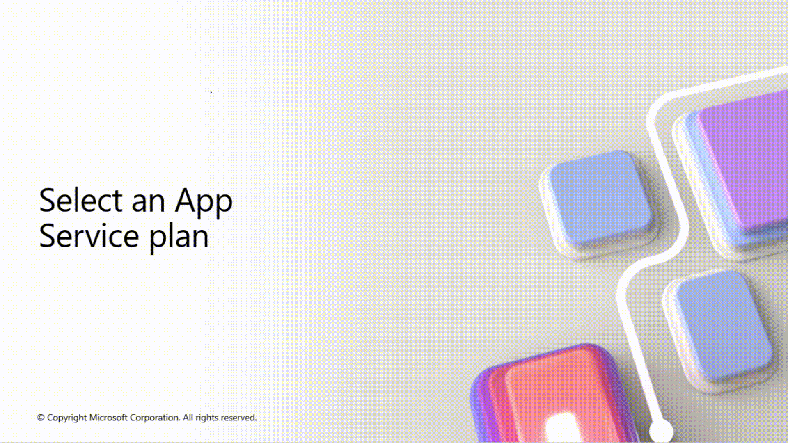
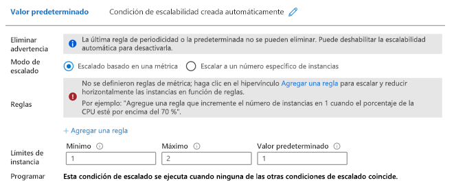

# AZ-104 — Configuración de planes de Azure App Service

Módulo 15 del [AZ-104T00](https://learn.microsoft.com/en-us/training/courses/az-104t00) ([ES](https://learn.microsoft.com/es-es/training/courses/az-104t00)) · Ruta 3 — Implementación y administración de recursos de procesos de Azure · Área: Implementación y administración de recursos de procesos de Azure (20–25%).

## Concepto

Configuración de un plan de Azure App Service: niveles de precio, características por tier y escalado.

## Resumen en mis palabras

> *(pendiente — rellenar al estudiar el módulo)*

## Por qué importa para el examen

> - Aprovisionamiento de un plan de App Service
> - Configuración del escalado de un plan de App Service (up vs out, reglas de autoscale)

## Enlaces relacionados

**Módulo de Learn**: [Configuración de planes de Azure App Service](https://learn.microsoft.com/en-us/training/modules/configure-app-service-plans/) ([ES](https://learn.microsoft.com/es-es/training/modules/configure-app-service-plans/))

**Savill**: buscar "App Service" en la [playlist AZ-104](https://www.youtube.com/playlist?list=PLlVtbbG169nGlGPWs9xaLKT1KfwqREHbs) · repaso final con el [Study Cram v2](https://www.youtube.com/watch?v=0Knf9nub4-k)

**Páginas de `knowledge/`**: —

**Laboratorio**: Lab 09a (Implement Web Apps) de [MicrosoftLearning/AZ-104](https://github.com/MicrosoftLearning/AZ-104-MicrosoftAzureAdministrator) — ver [labs/AZ-104](create-vm.md)


# Introducción.

Los administradores de Azure deben poder escalar una aplicación web. El escalado permite que la aplicación siga respondiendo durante períodos de gran demanda. El escalado también ayuda a ahorrar dinero, ya que reduce los recursos necesarios cuando la demanda disminuye.

Supongamos que trabaja para una gran cadena de hoteles. Usted es responsable de mantener el sitio web del hotel. Los clientes visitan el sitio web para hacer nuevas reservas y ver los detalles de sus reservas actuales. En determinados momentos del año, el volumen del tráfico crece porque los clientes buscan hoteles para las vacaciones durante festivos nacionales/regionales. En otras épocas, el tráfico se reduce. Estos patrones de uso de sitios web son predecibles.

En este módulo, aprenderá a implementar planes de Azure App Service. Obtenga información sobre cómo los diferentes planes de App Service proporcionan diferentes precios y opciones de escalado. Obtendrá información sobre cómo cambiar el plan afecta al rendimiento.

El objetivo de este módulo es garantizar que pueda determinar el mejor plan de App Service para la aplicación.

## Objetivos de aprendizaje

En este módulo aprenderá a:

- Seleccionar un plan de tarifa de Azure App Service adecuado.
- Escalar un plan de servicio de aplicaciones de Azure.


# Implementación de los planes de Azure App Service.

Un plan de App Service define un conjunto de recursos de proceso necesarios para que una aplicación web se ejecute. Estos recursos de proceso son análogos a la granja de servidores de un hospedaje web convencional. Pueden configurarse una o varias aplicaciones para que se ejecuten en los mismos recursos de computación (o en el mismo plan de App Service).

## Aspectos que debe saber sobre los planes de App Service

Echemos un vistazo con más detenimiento a cómo implementar y usar un plan de App Service con las máquinas virtuales.

- Cuando se crea un plan de App Service en una región, se crea un conjunto de recursos de proceso para ese plan en la región especificada. Todas las aplicaciones que coloque en el plan se ejecutan en los recursos de proceso definidos por el plan.
    
- Cada plan de App Service define esta configuración:
    
    - **Sistema operativo**: Linux o Windows.
    - **Región**: región del plan de App Service, como Oeste de EE. UU., Centro de la India, Norte de Europa, etc.
    - **Plan de tarifa**: Determina qué características App Service obtiene y cuánto paga por el plan. Los planes de tarifa disponibles para el plan de App Service dependen del sistema operativo seleccionado en el momento de la creación.
    - **Número de instancias de máquina virtual**: determinado por el plan.
    - **Tamaño de las instancias de máquina virtual**: Definido por CPU, memoria y almacenamiento remoto.
- Puede seguir agregando nuevas aplicaciones a un plan existente siempre y cuando el plan tenga suficientes recursos para administrar el incremento de la carga.
    

## Aspectos que se deben tener en cuenta al usar los planes de App Service

Revise las siguientes consideraciones sobre el uso de planes de Azure App Service para ejecutar y escalar las aplicaciones. Piense en qué condiciones podrían aplicarse a la ejecución y a la ampliación de la página web del hotel.

- **Considere el ahorro de costos**. Puesto que paga por los recursos de computación que asigna su plan de App Service, posiblemente pueda ahorrar dinero si coloca varias aplicaciones en un mismo plan de App Service.
    
- **Considere varias aplicaciones en un plan**. Cree un único plan para admitir varias aplicaciones para facilitar la configuración y el mantenimiento de instancias de máquina virtual compartidas. Dado que las aplicaciones comparten las mismas instancias de máquina virtual, debe administrar cuidadosamente los recursos y la capacidad del plan.
    
- **Considere la capacidad del plan**. Antes de agregar una nueva aplicación a un plan existente, determine los requisitos de recursos de la nueva aplicación e identifique la capacidad restante del plan.
    

> [!NOTE] Importante
   La sobrecarga de un plan de App Service puede dar lugar a tiempos de inactividad de las aplicaciones nuevas y existentes.

    
- **Considere el aislamiento de la aplicación**. Aísle la aplicación en un nuevo plan de App Service en los siguientes casos:
    
    - La aplicación consume muchos recursos.
    - Quiere escalar la aplicación de manera independiente de las otras aplicaciones del plan existente.
    - La aplicación necesita recursos de una región geográfica diferente.

## Ejemplo (chatGTP).

Sí. La clave para entender **App Service** después de haber estudiado VM, escalado, dominios de error y dominios de actualización es ver que **no estás aprendiendo conceptos aislados**: estás viendo distintas formas de resolver el mismo problema de disponibilidad y capacidad.

La propia ruta AZ-104 coloca primero las VM y su disponibilidad, y después App Service.

### La idea fundamental

Imagina que tienes una aplicación web:

> **TiendaOnline.com**

y tienes 10.000 usuarios al mismo tiempo.

Con **VMs**, tú eres bastante responsable de la infraestructura:

```
                  Internet
                     │
                Load Balancer
                     │
          ┌──────────┴──────────┐
          │                     │
       VM 1                   VM 2
    aplicación             aplicación
          │                     │
          └──────────┬──────────┘
                     │
                  Database
```

Aquí entran los conceptos que acabas de estudiar:

- **Escalado vertical** → VM más potente: 2 CPU → 8 CPU.
- **Escalado horizontal** → 1 VM → 3 VMs.
- **Availability Set / dominios de error** → repartir VMs para que un fallo físico no las tire todas.
- **Update domains** → evitar actualizar/reiniciar todas las VMs simultáneamente.
- Tú administras bastante de esto.

---

# ¿Qué cambia con App Service?

Con **Azure App Service**, Microsoft te dice:

> "No quiero que tengas que administrar las VMs que ejecutan tu aplicación web."

App Service es **PaaS**. Azure administra el sistema operativo y buena parte de la infraestructura subyacente.

Tu arquitectura pasa conceptualmente a:

```
                 Internet
                     │
                     ▼
              Azure App Service
                     │
          ┌──────────┼──────────┐
          │          │          │
       Instancia  Instancia  Instancia
           1          2          3
          │          │          │
          └──────────┼──────────┘
                     │
                  Database
```

Pero **tú no administras esas máquinas como VMs normales**.

Y aquí aparece una distinción MUY importante para AZ-104:

## App Service Plan ≠ App Service

Piensa así:

```
          APP SERVICE PLAN
       ┌─────────────────────┐
       │ Recursos de cómputo │
       │                     │
       │ VM   VM   VM        │
       └─────────────────────┘
          │       │       │
          ▼       ▼       ▼
       WebApp  WebApp  WebApp
```

El **App Service Plan** determina los recursos de cómputo disponibles.

Las **Web Apps** son las aplicaciones que se ejecutan encima.

Microsoft confirma que una aplicación de App Service se ejecuta en todas las instancias configuradas en su plan, y que varias aplicaciones dentro del mismo plan comparten esas instancias.

---

# Ejemplo real

Supongamos que trabajas para una administración pública.

Tienes:

**PortalCiudadano**

Una aplicación web donde los ciudadanos:

- consultan expedientes
- solicitan certificados
- presentan documentación
- consultan el estado de sus solicitudes

Un día normal:

```
500 usuarios
     │
     ▼
┌─────────────────┐
│   App Service   │
│                 │
│   Instancia 1   │
└─────────────────┘
```

Funciona perfectamente.

Pero llega el último día para presentar una ayuda:

```
             20.000 usuarios
                    │
                    ▼
             ┌──────────────┐
             │ App Service  │
             │              │
             │ Instancia 1  │
             │ Instancia 2  │
             │ Instancia 3  │
             │ Instancia 4  │
             └──────────────┘
```

Has hecho **escalado horizontal**.

No has cambiado el tamaño de una máquina.

Has aumentado el **número de instancias** que ejecutan tu aplicación. Microsoft describe precisamente el escalado horizontal de App Service como aumentar el número de instancias de VM que ejecutan la aplicación.

Y puedes automatizarlo.

Por ejemplo:

```
Normal
   ↓
2 instancias

Mucho tráfico
   ↓
4 instancias

Pico enorme
   ↓
8 instancias

Vuelve la normalidad
   ↓
2 instancias
```

El escalado automático puede utilizar métricas como CPU/memoria o reglas y programación; App Service también tiene mecanismos específicos de escalado basados en tráfico HTTP según el nivel utilizado.

---

## ¿Y el escalado vertical que acabas de estudiar?

También existe en App Service.

Supongamos que tienes:

```
App Service Plan B1

1 instancia
1 CPU
1.75 GB RAM
```

Tu aplicación necesita más potencia.

Puedes hacer:

```
B1
 ↓
P1
 ↓
más CPU
más RAM
más características
```

Eso es **Scale Up**.

No estás creando más instancias.

Estás haciendo:

```
          ANTES                  DESPUÉS

       ┌─────────┐             ┌──────────────┐
       │  VM     │             │     VM       │
       │ pequeña │    ───►     │    grande    │
       └─────────┘             └──────────────┘
```

Microsoft distingue exactamente ambos conceptos: **Scale Up** cambia el nivel/tamaño del plan, mientras que **Scale Out** aumenta el número de instancias.

---

## ¿Y los dominios de error que acabas de estudiar?

Aquí está la parte que probablemente te está generando la confusión.

Con VMs tú piensas:

> "Tengo que colocar mis máquinas de forma que un fallo de infraestructura no me las tire todas."

Con App Service:

> "Azure se encarga de buena parte de esa distribución."

Cuando un App Service Plan tiene varias instancias, Azure distribuye automáticamente las instancias entre dominios de error dentro de la región.

Por eso puedes pensar:

```
                 APP SERVICE PLAN

        ┌────────────┬────────────┐
        │            │            │
     Instancia     Instancia    Instancia
         1             2            3
        │             │            │
     Fault         Fault        Fault
     Domain        Domain       Domain
       A              B            C
```

**No tienes que administrar esas VMs como cuando utilizas Azure Virtual Machines.**

Ese es precisamente uno de los grandes atractivos de PaaS.

---

## ¿Y las actualizaciones?

Aquí también conecta directamente con lo que acabas de estudiar.

Con una VM tradicional:

```
VM
├── Windows/Linux
├── parches
├── runtime
├── IIS/Nginx
├── configuración
└── aplicación
```

Tú tienes que preocuparte de actualizar muchas cosas.

Con App Service:

```
Azure
 ├── infraestructura
 ├── sistema operativo
 ├── plataforma
 └── runtime
          │
          ▼
      TU APLICACIÓN
```

Azure administra el SO y la pila de aplicaciones de App Service y aplica sus actualizaciones.

Por eso App Service te permite concentrarte mucho más en:

```
Código
  ↓
Aplicación
  ↓
Datos
```

y menos en:

```
VM
  ↓
SO
  ↓
parches
  ↓
red
  ↓
infraestructura
```

---

## El ejemplo completo

Quédate con este escenario porque reúne prácticamente todo lo que estás estudiando:

### Tienda online

Tienes una aplicación:

```
www.tienda.es
```

### Opción A — Virtual Machines

```
                    Internet
                       │
                 Load Balancer
                       │
          ┌────────────┴────────────┐
          │                         │
        VM 1                      VM 2
          │                         │
     Availability Set / Fault Domains
          │                         │
          └────────────┬────────────┘
                       │
                    Database
```

Tú gestionas las VMs.

---

### Opción B — App Service

```
                    Internet
                       │
                       ▼
                Azure App Service
                       │
             ┌─────────┼─────────┐
             │         │         │
          Instance  Instance  Instance
             1         2         3
             │         │         │
             └─────────┼─────────┘
                       │
                    Database
```

Azure administra la infraestructura.

Tú gestionas principalmente:

```
Aplicación
Configuración
Deployment
Escalado
Dominios
TLS
Slots
Monitoring
```

Y el **App Service Plan** determina la capacidad de cómputo que tienes disponible.

---

## Y aparece otra cosa MUY importante: Deployment Slots

Esto te va a conectar todavía más conceptos.

Supongamos que tienes:

```
PRODUCCIÓN

www.tienda.es
     │
     ▼
   v1.5
```

Has terminado `v1.6`.

En lugar de lanzarlo directamente:

```
v1.6 ──► producción 😱
```

puedes utilizar un **slot**:

```
App Service
│
├── Production
│      └── v1.5
│
└── Staging
       └── v1.6
```

Pruebas `v1.6` en `staging`.

Cuando estás satisfecho:

```
             SWAP
              ↓

Production ──► v1.6
Staging    ──► v1.5
```

Esto también forma parte de lo que Microsoft incluye en esta sección de AZ-104: configuración y supervisión de App Service, incluidas las ranuras de implementación.

---

## La frase que yo me aprendería para AZ-104

> **Virtual Machine:** yo administro la máquina.

> **App Service:** Azure administra la infraestructura y yo administro la aplicación.

Y respecto al escalado:

> **Scale Up = una instancia más potente.**

> **Scale Out = más instancias ejecutando mi aplicación.**

Y respecto a disponibilidad:

> **Con VMs estudio explícitamente cómo distribuir las máquinas mediante mecanismos de disponibilidad. Con App Service, Azure abstrae gran parte de esa infraestructura y proporciona distribución y redundancia gestionadas.**

Esa es la conexión entre lo que acabas de estudiar y **App Service**. No son conceptos diferentes: **App Service es otra forma de proporcionar capacidad de cómputo para una aplicación, pero con un nivel de abstracción superior.**

> [!TIP] 
> App Service = pagas a Azure para que te abstraiga y gestione gran parte de la infraestructura necesaria para ejecutar una aplicación web.

# Determinación de los precios del plan de Azure App Service.
El nivel de precios de un plan de Azure App Service determina qué características de App Service obtiene y cuánto paga por el plan. Los ejemplos del plan de tarifa son: **Gratis, Compartido, Básico, Estándar, Premium, PremiumV2, PremiumV3, Aislado y AisladoV2.**

## Cómo se ejecutan y escalan las aplicaciones en planes de App Service

El plan de Azure App Service es la unidad de escalado de las aplicaciones de App Service. En función del plan de tarifa del plan de Azure App Service, las aplicaciones se ejecutan y se escalan de manera diferente. Si el plan está configurado para ejecutar cinco instancias de máquinas virtuales, todas las aplicaciones del plan se ejecutan en las cinco instancias. Si tu plan está configurado para el escalado automático, entonces todas las aplicaciones del plan se amplían de manera conjunta de acuerdo con dichas configuraciones.

Los planes de tarifa se agrupan en tres categorías:

- **Proceso compartido**:
    - los dos planes básicos, Gratis y Compartido, ejecutan una aplicación en la misma VM de Azure que otras aplicaciones de App Service, incluidas las aplicaciones de otros clientes.
    - Estos niveles asignan cuotas de CPU a cada aplicación que se ejecuta en los recursos compartidos, y los recursos no pueden escalar horizontalmente.
    - Estos niveles están pensados para su uso exclusivo con fines de desarrollo y pruebas.
- **Proceso dedicado**:
    - Los planes Básico, Estándar, Premium, PremiumV2 y PremiumV3 ejecutan aplicaciones en VM de Azure dedicadas.
    - Solo las aplicaciones del mismo plan de App Service tienen los mismos recursos de proceso. Cuanto más alto sea el nivel, más instancias de máquina virtual estarán disponibles para la escalabilidad horizontal.
- **Aislada**:
    - Los niveles Aislado y AisladoV2 ejecutan máquinas virtuales de Azure dedicadas en redes virtuales de Azure dedicadas.
    - Este nivel proporciona aislamiento de red, además de aislamiento de proceso a sus aplicaciones.
    - Este nivel ofrece las máximas capacidades de expansión horizontal.

Este es un ejemplo de diferentes [detalles del plan](https://learn.microsoft.com/es-es/azure/app-service/overview-hosting-plans).

|Característica|F1 Gratis|Básico B1|Estándar S1|Premium P1V3|Aislado V2|
|---|---|---|---|---|---|
|Uso|Desarrollo, pruebas|Desarrollo, pruebas|Cargas de trabajo de producción|Escala mejorada, rendimiento|Tareas de trabajo aisladas en red|
|Espacios de ensayo|N/D|N/D|5|20|20|
|Escalado automático|N/D|Manual|Reglas|Reglas, Elastic|Reglas|
|Instancias de escalado|N/D|3|10|30|200|
|Copias de seguridad diarias|N/D|N/D|10|50|50|

### Gratis y compartidos

Los planes de servicio gratis y compartidos corresponden a niveles básicos que se ejecutan en las mismas máquinas virtuales de Azure que otras aplicaciones. Es posible que algunas aplicaciones pertenezcan a otros clientes. Estos niveles están pensados para su uso exclusivo con fines de desarrollo y pruebas. No se proporciona ningún contrato de nivel de servicio para los planes de servicio gratis y compartidos. Los planes gratuitos y compartidos se facturan por aplicación.

### Básico

El plan de servicio Básico está diseñado para aplicaciones que tienen requisitos de tráfico más bajos y no necesitan características avanzadas de escalado automático ni administración del tráfico. Los precios se basarán en el tamaño y el número de instancias que ejecute. El soporte incorporado para el equilibrio de carga de red distribuye automáticamente el tráfico entre las instancias. El plan de servicio Básico con entornos en tiempo de ejecución de Linux admite Web App for Containers.

### Estándar

El plan de servicio Estándar está diseñado para ejecutar cargas de trabajo de producción. Los precios se basarán en el tamaño y el número de instancias que ejecute. El soporte integrado de equilibrio de carga de red distribuye automáticamente el tráfico entre las instancias. El plan Estándar incluye un escalado automático que puede ajustar automáticamente el número de instancias de máquina virtual que se ejecutan para satisfacer sus necesidades de tráfico. El plan de servicio Estándar con entornos en tiempo de ejecución de Linux admite Web App for Containers.

### Premium

El plan de servicio Premium está diseñado para aplicaciones de producción que necesitan un mayor rendimiento y escala. PremiumV3 es el nivel Premium actual, que ofrece máquinas virtuales de la serie Dav4 y Ddv4 y almacenamiento SSD. PremiumV3 admite SKU de proceso estándar y SKU optimizadas para memoria para cargas de trabajo de gran memoria. PremiumV3 admite el escalado automático basado en reglas y el escalado automático. PremiumV3 se recomienda para las nuevas implementaciones.

### Aislado

El plan de servicio aislado admite cargas de trabajo críticas que necesitan aislamiento de red. IsolatedV2 es el nivel preferido que ofrece hardware más reciente, hasta 200 instancias, entornos privados y seguridad mejorada. IsolatedV2 se recomienda para las nuevas cargas de trabajo debido a un mejor rendimiento y precios más sencillos.

## Tarea que se va a realizar: selección de un plan de App Service

Puede ver los planes de App Service disponibles en Azure Portal. Puede elegir en función de los requisitos de hardware o características. Entre las consideraciones de hardware se incluyen las instancias de CPU, memoria y escalado. Entre las consideraciones de características se incluyen las copias de seguridad, las ranuras de ensayo y la redundancia de zona.

Sugerencia

Al seleccionar un plan de servicio, tenga en cuenta los requisitos de hardware y características.

1. En Azure Portal, busque y seleccione **Planes de App Service**.
2. **Cree** un nuevo plan de App Service.
3. Seleccione **Explorar planes de precios** para ver los planes disponibles.



# Escalado vertical y escalado horizontal Azure App Service

Hay dos métodos para escalar el plan y las aplicaciones de Azure App Service: _escalar verticalmente_ y _escalar horizontalmente_. Puede escalar las aplicaciones de forma manual o automática, lo que se conoce como _escalabilidad automática_.

Vea el siguiente vídeo sobre cómo implementar el escalado automático para el plan y las aplicaciones de Azure App Service.

https://www.youtube.com/watch?v=LS8ZPbQzRpc


### Aspectos que debe saber sobre el escalado de Azure App Service

Vamos a examinar los detalles del escalado del plan de Azure App Service y las aplicaciones de App Service.

- El método de <font color="#00b050"><b>escalado vertical</b></font> aumenta la cantidad de CPU, memoria y espacio en disco. El escalado vertical proporciona características adicionales como <font color="#00b050"><b>máquinas virtuales exclusivas, dominios y certificados personalizados, espacios de ensayo, autoescala y mucho más.</b></font> Para escalar verticalmente, se cambia el plan de tarifa del plan de Azure App Service en el que se encuentra la aplicación.
    
- El método de <font color="#00b050"><b>escalabilidad horizontal</b></font> aumenta el número de instancias de máquina virtual que ejecutan la aplicación. Puede escalar horizontalmente hasta el número máximo de instancias correspondiente a su nivel de precios. Aproveche las ventajas de los entornos de App Service en el nivel Aislado para aumentar aún más el número de escalado horizontal a 100 instancias. El recuento de instancias de escalado se puede configurar manual o automáticamente (escalado automático).
    
- Con el escalado automático, puede aumentar automáticamente el número de instancias de escalado para el método de escalabilidad horizontal. El escalado automático se basa en reglas y programaciones predefinidas.
    
- El plan de App Service se puede escalar y reducir verticalmente en cualquier momento cambiando el plan de tarifa del plan.
    

### Aspectos que se deben tener en cuenta al usar el escalado de Azure App Service

Revise las siguientes ventajas de implementar el escalado para el plan y las aplicaciones de App Service. Piense en las ventajas de escalado de su sitio web de hotel.

- **Considere la posibilidad de ajustar manualmente los niveles de plan**. Inicie el plan en un plan de tarifa inferior y escale verticalmente según sea necesario para adquirir más características de App Service. Reduzca verticalmente cuando ya no se necesiten características y controle los costos generales.
    
    Considere un escenario en el que empieza a probar la aplicación web con el nivel de Azure App Service Gratis, donde no paga nada para usar el servicio. Después de un tiempo, decide agregar un nombre DNS personalizado a la aplicación web, por lo que escala el plan hasta el nivel Compartido. A continuación, descubre que necesita crear un enlace SSL, por lo que escala el plan hasta el nivel Básico. Más adelante, determina que se necesitan entornos de ensayo, por lo que se escala verticalmente al nivel Estándar. Cuando necesite más núcleos, memoria o almacenamiento, puede escalar verticalmente a un tamaño superior de máquina virtual del mismo nivel.
    
    El proceso de escalado funciona igual a la inversa. Si decide que ya no necesita las funcionalidades o características de un nivel superior, puede reducir verticalmente a un plan inferior, lo que permite ahorrar dinero.
    
- **Considere la posibilidad de escalar automáticamente para admitir a los usuarios y reducir los costos**. Siga atendiendo a los usuarios cuando la aplicación esté experimentando un alto rendimiento. Implemente el escalado automático para controlar cuántas características y soporte técnico se ofrecen en un momento dado en función de la configuración de preferencias y las condiciones de regla. El escalado automático le ayuda a ahorrar dinero cuando la carga en la aplicación disminuye al reducir automáticamente las características suscritas.
    
- **Considere la posibilidad de no volver a implementar**. Al cambiar la configuración de escalado, no es necesario cambiar el código ni volver a implementar las aplicaciones. El cambio de la configuración de escalado del plan tarda solo segundos en aplicarse. Los cambios afectan a todas las aplicaciones del plan de App Service.
    
- **Considere la posibilidad de escalar otros servicios de Azure**. Si su aplicación de App Service depende de otros servicios de Azure, como Azure SQL Database o Azure Storage, también puede escalar estos recursos por separado. El plan de App Service no administra esos recursos.


| Concepto                   | Qué cambia                           | Cuándo usarlo                                                | Ejemplo AZ-104       | Palabra clave      |
| -------------------------- | ------------------------------------ | ------------------------------------------------------------ | -------------------- | ------------------ |
| **Scale Up (Vertical)**    | Recursos de **cada instancia**       | Falta CPU, RAM, disco o necesitas un tier superior           | 4 GB RAM → 8 GB RAM  | **Más potencia**   |
| **Scale Out (Horizontal)** | **Número de instancias**             | Mucho tráfico, muchas peticiones, necesitas distribuir carga | 2 → 5 instancias     | **Más instancias** |
| **Autoscale**              | Nº de instancias **automáticamente** | La carga cambia según tráfico, CPU, horario, etc.            | 2 → 6 → 2 instancias | **Automático**     |
### ⚠️ Para el examen

- **Más CPU / RAM / disco** → **Scale Up**
- **Más usuarios / peticiones / tráfico** → **Scale Out**
- **Escalar según métricas o programación** → **Autoscale**
- **Necesitas una característica de un tier superior** → **Scale Up**


# Configuración de planes de Azure App Service

El proceso de escalado automático le permite ejecutar la cantidad correcta de recursos para administrar la carga de la aplicación. Puede agregar recursos para admitir aumentos de carga y ahorrar dinero quitando los recursos inactivos.

### Cosas que debe saber sobre la escalabilidad automática

Echemos un vistazo con más detenimiento sobre cómo usar el escalado automático para el plan y las aplicaciones de Azure App Service.

- Para usar el escalado automático, especifique el número mínimo y máximo de instancias que se van a ejecutar mediante un conjunto de reglas y condiciones.
    
- Cuando la aplicación se ejecuta en condiciones de escalado automático, el número de instancias de máquina virtual se ajusta automáticamente en función de las reglas. Cuando se cumplen las condiciones de regla, se desencadenan una o varias acciones de escalado automático.
    
- El motor de escalabilidad automática usa un valor de escalabilidad automática para determinar si se debe realizar el escalado o la reducción horizontales. Las opciones de configuración del escalado automático se agrupan en perfiles.
    
- Las reglas de escalabilidad automática incluyen un desencadenador y una acción de escalado (horizontal o vertical). El desencadenador puede basarse en métricas o en tiempo.
    
    
    
    - **Las reglas basadas en** métricas miden la carga de la aplicación y agregan o quitan máquinas virtuales basadas en la carga, como "realice esta acción cuando el uso de cpu sea superior a 50%". Entre las métricas de ejemplo se incluyen el tiempo de CPU, el tiempo medio de respuesta y las solicitudes.
        
    - **Las reglas basadas en tiempo** (o, basadas en programación) le permiten escalar cuando vea patrones de tiempo en la carga y quiera escalar antes de que se produzca un posible aumento o disminución de la carga. Un ejemplo sería "desencadenar un webhook todos los sábados a las 8:00 a. m. en una zona horaria determinada".
        
- El motor de escalado automático usa la configuración de notificación.
    
    La configuración de las notificaciones define qué notificaciones deben aparecer cuando se produce un evento de escalabilidad automática en función de si se satisfacen los criterios de un perfil de la configuración de escalabilidad automática. Con la escalabilidad automática se pueden realizar notificaciones a una o más direcciones de correo electrónico o realizar llamadas a uno o más webhooks.
    

### Aspectos que se deben tener en cuenta al configurar la escalabilidad automática

Hay varias consideraciones que debe tener en cuenta al configurar el escalado automático para el plan y las aplicaciones de Azure App Service.

- **Recuento mínimo de instancias**. Establecer un recuento de instancias mínimo garantiza la ejecución continua de la aplicación aunque no exista carga.

- **Número máximo de instancias**. Tener un recuento de instancias máximo limita el posible costo total por hora.

- **Margen de escala adecuado**. Asegúrese de que los valores de recuento máximo y mínimo de instancias son diferentes y establezca un margen adecuado entre los dos valores. Puede realizar un escalado automático entre el mínimo y el máximo mediante las reglas que cree.

- **Combinaciones de reglas de escalado**. Use siempre una combinación de reglas de escalabilidad y reducción horizontales que realice un aumento y una disminución. Si no establece una regla de escalado horizontal, es posible que se produzca un error en la aplicación o que el rendimiento se degrade en cargas mayores. Si no establece una regla de reducción horizontal, puede experimentar costos innecesarios y extensos cuando disminuye la carga.

- **Estadísticas de métricas**. Elija cuidadosamente la estadística adecuada para las métricas de diagnóstico, como Promedio, Mínimo, Máximo y Total.

- **Recuento de instancias predeterminado**. Seleccione siempre un recuento de instancias predeterminado seguro. El número predeterminado de instancias es importante, porque el escalado automático escala el servicio al número que especifique cuando no hay métricas disponibles.

- **Notificaciones**. Configure siempre las notificaciones de escalado automático. Es importante ser consciente de cómo funciona la aplicación a medida que cambia la carga.


### Aspectos que se deben tener en cuenta al configurar el escalado automático

Además de la escalabilidad automática basada en reglas, Azure App Service ofrece escalado automático (también denominado escalado elástico) para los niveles PremiumV2 y PremiumV3. Se trata de una característica de escalado independiente que funciona de forma diferente a las reglas de escalado automático.

- **Basado en tráfico HTTP.** El escalado automático responde directamente a las solicitudes HTTP entrantes sin necesidad de configurar reglas de escalado.
    
- **Administrado por la plataforma.** Azure administra automáticamente las decisiones de escalado en función de los patrones de tráfico, lo que elimina la necesidad de configuración de reglas.
    
- **Instancias siempre preparadas.** Mantiene instancias activadas previamente para gestionar inmediatamente los picos de tráfico.
    
- **Disponibilidad de niveles.** Solo está disponible en los niveles PremiumV2 y PremiumV3.
    

### Elegir entre escalabilidad automática y escalado automático

- **Use la escalabilidad automática basada en reglas.** Necesita lógica de escalado personalizada, desea escalar en función de varias métricas o necesita escalado basado en calendario.
    
- **Use escalado automático.** Quiere menos administración, no puede predecir patrones de carga o necesita una respuesta rápida a los cambios de tráfico sin configuración de reglas.

# Evaluación del módulo.

Está elaborando una estrategia para implementar planes de Azure App Service para satisfacer los requisitos de escalado del sitio web del hotel. Varios equipos de su organización envían solicitudes y preguntas para su consideración.

- El equipo de administración solicita información sobre las opciones de escalado. Prefieren una opción que puede aumentar el espacio en disco y la CPU en lugar de tener que agregar más máquinas virtuales.
    
- El equipo de producción administra una aplicación web que requiere escalar a 10 entornos de prueba.
    
- En la configuración del sitio web, necesita una regla para desencadenar un evento a las 8:00 a. m. los sábados.
    

### Responda a las siguientes preguntas

Elija la respuesta más adecuada para cada pregunta.

1. ¿Qué opción de escalado proporciona más CPU, memoria o espacio en disco sin agregar más máquinas virtuales?

- [x] Escalado vertical

- [ ] Escalar horizontalmente

- [ ] Reducción vertical

2. ¿Qué plan de App Service admite el requisito de 10 ranuras de ensayo del equipo de producción?

- [ ] Básico B1

- [ ] Estándar S1

- [x] Premium V3 P1V3

3. ¿Desencadenar un evento a las 8:00 a.m. el sábado es un ejemplo de qué tipo de regla?

- [ ] Una regla basada en métricas.

- [x] Una regla basada en el tiempo.

- [ ] Una regla de análisis de aplicaciones.

# Resumen y recursos

En este módulo, ha obtenido información sobre los planes de Azure App Service y cómo se usan para definir los recursos de proceso para ejecutar aplicaciones en Azure App Service. Estos planes se pueden configurar con una región específica, el número de instancias de máquina virtual y el tamaño de las instancias de máquina virtual. El plan de tarifa del plan de App Service determina las características y el costo. Los planes de tarifa incluyen planes gratis y compartidos con fines de desarrollo y pruebas. Los planes de tarifa también incluyen planes aislados para cargas de trabajo críticas.

Ha aprendido a escalar en Azure App Service. El escalado vertical implica aumentar la CPU, la memoria y el espacio en disco cambiando el plan de tarifa. El escalado horizontal aumenta el número de instancias de máquina virtual que ejecutan la aplicación. El escalado automático permite ajustar automáticamente el número de recursos en función de la carga en la aplicación. El escalado automático se puede configurar con reglas basadas en métricas o en tiempo.

Las principales conclusiones de este módulo son:

- Los planes de Azure App Service se usan para definir los recursos de proceso para ejecutar aplicaciones web en Azure App Service.
- El plan de tarifa del plan de App Service determina las características y el costo, con opciones que van desde planes gratuitos y compartidos a planes aislados.
- El escalado en Azure App Service se puede realizar a través del escalado vertical (cambiar el plan de tarifa) o el escalado horizontal (aumentando el número de instancias de máquina virtual).
- El escalado automático permite ajustar automáticamente los recursos en función de la carga de la aplicación, con reglas basadas en métricas y en el tiempo.

## Más información con Copilot

Copilot puede ayudarle a configurar soluciones de infraestructura de Azure. Copilot puede comparar, recomendar, explicar e investigar productos y servicios en los que necesita más información. Abra un explorador de Microsoft Edge y elija Copilot (arriba a la derecha) o vaya a copilot.microsoft.com. Dedique unos minutos a probar estos mensajes y ampliar el aprendizaje con Copilot.

- En Microsoft Azure, ¿cuáles son los planes de precios de App Service? Proporcione ejemplos de cuándo usar cada plan.
    
- En Microsoft Azure, ¿qué significa reducir horizontalmente y escalar horizontalmente? ¿Cómo puedo determinar cuándo escalar una aplicación?
    

## Obtener más información con la documentación

- [Planes de servicio de aplicaciones de Azure](https://learn.microsoft.com/es-es/azure/app-service/overview-hosting-plans). En este artículo se proporciona información general sobre los planes de App Service.
    
- [Administración de un plan de App Service en Azure](https://learn.microsoft.com/es-es/azure/app-service/app-service-plan-manage). Esta guía muestra cómo crear y administrar un plan de App Service.
    
- [Ampliar una aplicación en Azure App Service](https://learn.microsoft.com/es-es/azure/app-service/manage-scale-up). En este artículo se muestra cómo escalar aplicaciones en Azure App Service.
    

## Obtén más información con el aprendizaje autodirigido

- [Escalado de aplicaciones en Azure App Service](https://learn.microsoft.com/es-es/training/modules/scale-apps-app-service/). Obtenga información sobre cómo funciona el escalado automático en App Service. Aprenda a identificar factores de escalado automático, habilitar la escalabilidad automática y crear condiciones de escalado automático.


# Relacionado

- [Índice AZ-104](../certifications/AZ-104/INDEX.md)
- [[Servicios de proceso de Azure (AZ-900)]]
