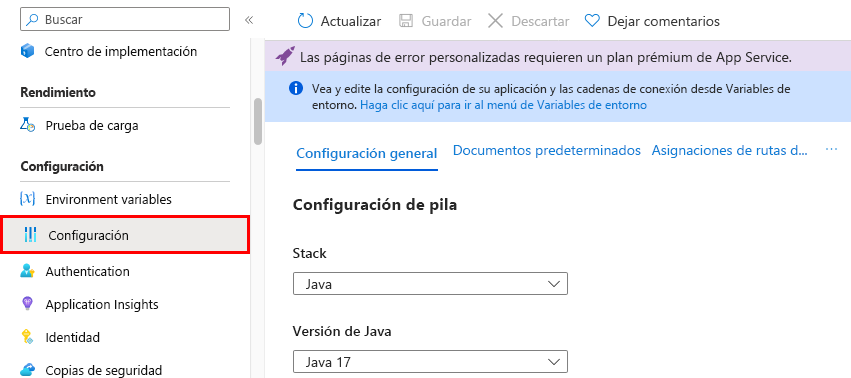
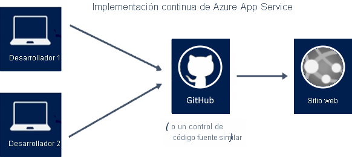
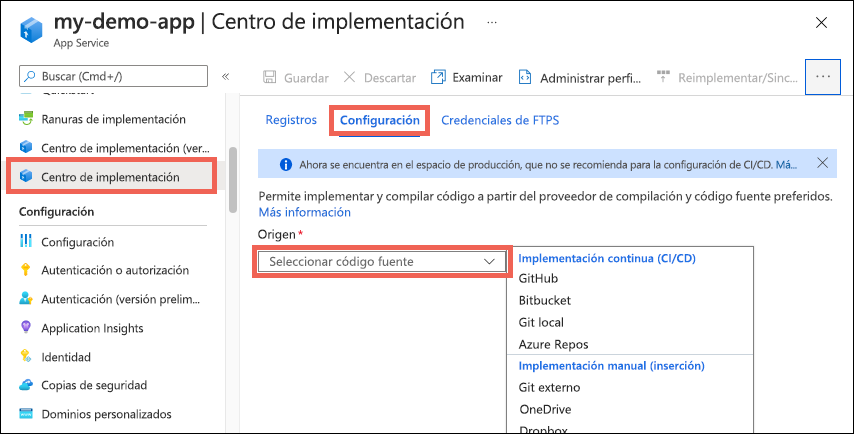
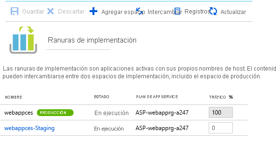
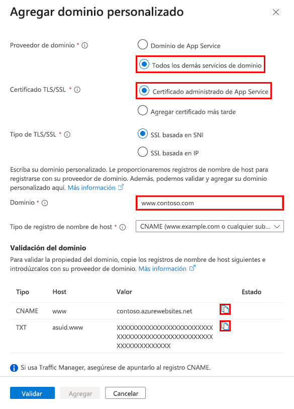
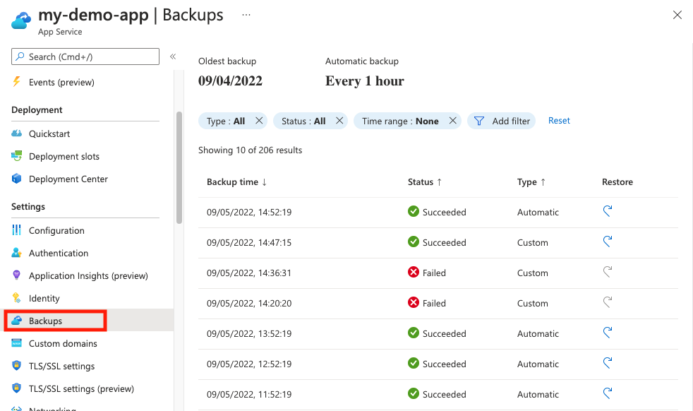
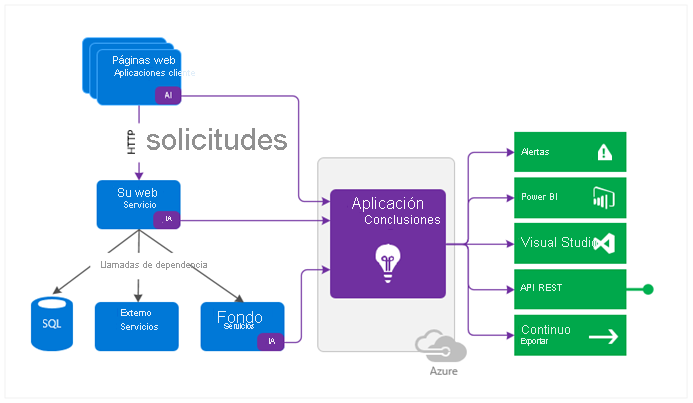

# AZ-104 — Configuración de Azure App Service

Módulo 16 del [AZ-104T00](https://learn.microsoft.com/en-us/training/courses/az-104t00) ([ES](https://learn.microsoft.com/es-es/training/courses/az-104t00)) · Ruta 3 — Implementación y administración de recursos de procesos de Azure · Área: Implementación y administración de recursos de procesos de Azure (20–25%).

## Concepto

Configurar y supervisar instancias de Azure App Service, incluidas las ranuras de implementación (deployment slots).

## Resumen en mis palabras

> *(pendiente — rellenar al estudiar el módulo)*

## Por qué importa para el examen

> - Crear un App Service
> - Configuración de certificados y SSL/TLS para un App Service
> - Asignar un nombre DNS personalizado existente
> - Configurar copia de seguridad para un App Service
> - Configurar la configuración de red para un App Service
> - Configurar ranuras de implementación para un App Service

## Enlaces relacionados

**Módulo de Learn**: [Configuración de Azure App Service](https://learn.microsoft.com/en-us/training/modules/configure-azure-app-services/) ([ES](https://learn.microsoft.com/es-es/training/modules/configure-azure-app-services/))

**Savill**: buscar "App Service" en la [playlist AZ-104](https://www.youtube.com/playlist?list=PLlVtbbG169nGlGPWs9xaLKT1KfwqREHbs) · repaso final con el [Study Cram v2](https://www.youtube.com/watch?v=0Knf9nub4-k)

**Páginas de `knowledge/`**: —

**Laboratorio**: Lab 09a (Implement Web Apps) de [MicrosoftLearning/AZ-104](https://github.com/MicrosoftLearning/AZ-104-MicrosoftAzureAdministrator) — ver [labs/AZ-104](create-vm.md)


# Introducción.

Los administradores de Azure están interesados en soluciones que simplifiquen la implementación y administración de sus aplicaciones web, móviles y de API. Los administradores de Azure están interesados en soluciones preparadas para IA.

Su empresa ofrece un estudio de los consumidores y su equipo se encarga de administrar los servidores locales. Los servidores que administra ejecutan toda la infraestructura de la empresa, desde los servidores web hasta las bases de datos. El hardware se está quedando obsoleto y empieza a tener dificultades para mantenerse al día con algunas de las nuevas aplicaciones de análisis de datos. En lugar de actualizar el hardware, la empresa decidió implementar Azure App Service.

En este módulo aprenderá a configurar y administrar Azure App Service. Obtendrá información sobre las opciones de configuración, las ranuras de implementación y los nombres de dominios personalizados. Obtendrá información sobre las copias de seguridad, la recuperación y la supervisión de aplicaciones.

El objetivo de este módulo es proporcionarle los conocimientos y aptitudes necesarios para usar de forma eficaz Azure App Services.

## Objetivos de aprendizaje

En este módulo aprenderá a:

- Identificar las características y los casos de uso de Azure App Service.
- Crear una aplicación con App Service.
- Configurar los valores de implementación, específicamente las ranuras de implementación
- Proteger la aplicación de App Service.
- Configurar nombres de dominio personalizados
- Hacer una copia de seguridad de la aplicación de Azure App Service y restaurarla.
- Configurar Azure Application Insights.

# Implementación de Azure App Service.

[Azure App Service](https://learn.microsoft.com/es-es/azure/app-service/overview) reúne todo lo que necesita para crear sitios web, back-end móviles y API web para cualquier plataforma o dispositivo. Las aplicaciones se ejecutan y escalan fácilmente en entornos tanto Windows como Linux.

App Service proporciona inicios rápidos para lenguajes de programación. Estos lenguajes incluyen: ASP.NET, Java, Node.js, Python y PHP.

### Ventajas de App Service

Usar App Service para desarrollar e implementar aplicaciones web, móviles y de API reporta un sinfín de ventajas. Revise la siguiente tabla y piense en qué características le pueden ayudar a hospedar sus instancias de App Service.


| Prestación                                | Descripción                                                                                                                                                                                                                                                                                                                                        |
| ----------------------------------------- | -------------------------------------------------------------------------------------------------------------------------------------------------------------------------------------------------------------------------------------------------------------------------------------------------------------------------------------------------- |
| **Varios lenguajes y marcos**             | App Service tiene compatibilidad de primera clase con ASP.NET, Java, Node.js, PHP y Python. También puede ejecutar PowerShell y otros scripts o ejecutables como servicios en segundo plano.                                                                                                                                                       |
| **Optimización de DevOps**                | App Service admite la integración e implementación continuas con Azure DevOps, GitHub, BitBucket, Docker Hub y Azure Container Registry. Puede promover actualizaciones a través de entornos de ensayo y prueba. Administre las aplicaciones de App Service mediante Azure PowerShell o la interfaz de la línea de comandos (CLI) multiplataforma. |
| **Escala global con alta disponibilidad** | App Service le ayuda a escalar hacia arriba o hacia afuera de forma manual o automática. Puede hospedar sus aplicaciones en cualquier lugar de la infraestructura global de centros de datos de Microsoft; el Acuerdo de Nivel de Servicio de App Service ofrece una alta disponibilidad.                                                          |
| **Seguridad y cumplimiento normativo**    | App Service cumple con ISO, SOC y PCI. Puede autenticar a los usuarios con microsoft Entra ID o con inicios de sesión sociales a través de Google, Facebook, X o Microsoft. Cree restricciones de direcciones IP y administre las identidades de servicio.                                                                                         |
| **Plantillas de aplicación**              | Elija entre una extensa lista de plantillas de aplicaciones en Azure Marketplace, como WordPress, Joomla y Drupal.                                                                                                                                                                                                                                 |
| **Integración de Visual Studio**          | App Service ofrece herramientas dedicadas en Visual Studio que ayudan a optimizar las tareas de creación, implementación y depuración.                                                                                                                                                                                                             |
| **API y características para móviles**    | App Service proporciona compatibilidad inmediata con CORS en escenarios de API de RESTful. Puede simplificar los escenarios de su aplicación móvil habilitando la autenticación, la sincronización de datos sin conexión, las notificaciones push, etc.                                                                                            |

# Creación de una aplicación con App Service.

Puede usar las características de Web Apps, Mobile Apps o API Apps de Azure App Service y crear sus propias aplicaciones en Azure Portal.

### Cosas que saber sobre las opciones de configuración

Vamos a examinar algunas de las opciones de configuración básicas que se necesitan para crear una aplicación con App Service.

- **Nombre**: el nombre de la aplicación debe ser único. El nombre identifica y localiza la aplicación en Azure. Un nombre de ejemplo es `webappces1.azurewebsites.net`. Puede asignar un nombre de dominio personalizado, si prefiere usar esa opción en su lugar.
    
- **Publicar**: App Service hospeda (publica) tu aplicación como código o como un contenedor de Docker.
    
- **Pila en tiempo de ejecución**: App Service usa una pila de software para ejecutar la aplicación, incluidas las versiones de idioma y del SDK. En las aplicaciones Linux y las aplicaciones de contenedor personalizadas, también se puede establecer un archivo o un comando de inicio opcional. Entre las opciones de pila se incluyen .NET Core, .NET Framework, Node.js, PHP y Python. Hay varias versiones de cada producto disponibles para Linux y Windows.
    
- **Sistema Operativo**: El sistema operativo de la pila de ejecución de la aplicación puede ser Linux o Windows.
    
- **Región**: la ubicación de la región que elija para la aplicación afecta a los planes de App Service que están disponibles.
    
- **Planes de precios**: la aplicación debe asociarse a un plan de Azure App Service para establecer recursos, características y capacidad disponibles. Puede elegir entre los planes de tarifa que hay disponibles en la ubicación de la región seleccionada.
    

#### Configuración tras la creación

Una vez creada la aplicación, otras opciones de configuración de **Configuración** estarán disponibles en Azure Portal, incluidas las opciones de implementación de la aplicación y la asignación de rutas de acceso.



Algunas de las opciones de configuración adicionales se pueden incluir en el código del desarrollador, mientras que otras pueden configurarse en la aplicación. Estas son algunas de las configuraciones adicionales de la aplicación.

- **AlwaysOn**: puedes mantener la aplicación cargada incluso cuando no hay tráfico. Esta opción es necesaria en los WebJobs continuos o WebJobs que se desencadenan mediante una expresión CRON.
    
- **Afinidad de sesión**: en una implementación de varias instancias, puede asegurarse de que el cliente de la aplicación se enruta a la misma instancia durante la vida útil de la sesión.
    
- **Solo HTTPS**: cuando está habilitado, todo el tráfico HTTP se redirige a HTTPS.
    

> [!TIP] Sugerencia 
> Considere la posibilidad de practicar por su cuenta con el [Ejercicio: creación de una aplicación web en Azure Portal](https://learn.microsoft.com/es-es/training/modules/host-a-web-app-with-azure-app-service/3-exercise-create-a-web-app-in-the-azure-portal?pivots=csharp). En este ejercicio se proporciona un espacio aislado.


> [!EXAMPLE] Ejemplo-Lab
> [[app-service.]]


# Explora la integración y el despliegue continuos.

Azure Portal proporciona integración e implementación continuas de fábrica con Azure DevOps Services, GitHub, Bitbucket, FTP o un repositorio de Git local en la máquina de desarrollo. Puede conectar la aplicación web con cualquiera de los orígenes anteriores, y App Service se encargará del resto de forma automática. App Service sincroniza automáticamente el código y cualquier cambio futuro con el código de la aplicación web. Con Azure DevOps Services, también puede definir su propio proceso de compilación y versión. Compile el código fuente, realice pruebas y cree e implemente la versión en la aplicación web cada vez que confirme el código. Todas las operaciones suceden implícitamente, sin necesidad de intervención humana.



### Aspectos que se deben conocer sobre la implementación continua y manual

Al crear la aplicación web con App Service, puede elegir entre la implementación automatizada o la manual. A medida que revise estas opciones, estudie qué método de implementación usar con sus aplicaciones de App Service. Estas opciones se encuentran en el Centro de implementación.



**La implementación continua (CI/CD)** es un proceso que se usa para insertar nuevas características y correcciones de errores en un patrón rápido y repetitivo con un impacto mínimo en los usuarios finales. Azure admite la implementación automatizada directamente desde varios orígenes:

- **GitHub**: Azure admite la implementación automatizada directamente desde GitHub. Azure admite la implementación automatizada directamente desde GitHub mediante dos proveedores de compilación. Al conectar el repositorio de GitHub a Azure, puede elegir entre **[Acciones de GitHub](https://learn.microsoft.com/es-es/azure/developer/github/github-actions)** (valor predeterminado) y **[App Service Build Service](https://learn.microsoft.com/es-es/azure/app-service/deploy-continuous-deployment?tabs=others#enable-continuous-deployment)**.
    
- **Bitbucket**: con sus similitudes con GitHub, puede configurar una implementación automatizada con Bitbucket.
    
- **Git local**: la característica App Service Web Apps ofrece una dirección URL local que puede agregar como repositorio.
    
- **Azure Repos**: Azure Repos es un conjunto de herramientas de control de versiones que puede usar para administrar el código. Independientemente de que el proyecto de software sea grande o pequeño, se recomienda usar el control de versiones lo antes posible.
    

**La implementación manual** le permite insertar manualmente el código en Azure.

- **Git remoto**: la característica App Service Web Apps ofrece una dirección URL de Git que puede agregar como repositorio remoto. Al insertar en el repositorio remoto, se implementa la aplicación.


# Crear espacios de implementación.

Cuando implementa su aplicación web, aplicación web en Linux, back-end móvil o aplicación de API en Azure App Service, puede usar una ranura de implementación independiente en lugar del espacio de producción predeterminado.

> [!NOTE] Title
> Una **ranura de implementación** (_deployment slot_) es una **copia de tu aplicación en Azure App Service con su propia URL**, que vive junto a la de producción. Despliegas la nueva versión en la ranura, la pruebas ahí y, cuando todo está bien, **intercambias (swap)** las dos: la ranura pasa a ser producción sin cortar el servicio.
> ```
Antes del swap:
  Usuarios → miapp.azurewebsites.net          → [Producción: v1]
  Tú       → miapp-staging.azurewebsites.net  → [Staging:    v2]
  Después del swap:
  Usuarios → miapp.azurewebsites.net          → [Producción: v2]
  (v1 queda en staging, lista para volver atrás)
>```
 > ### El problema que resuelve.
  > Sin ranuras, desplegar una nueva versión directamente en producción implica:- Un **corte o reinicio** mientras se copia el código.- Usuarios reales viendo errores si la versión nueva falla.- Una vuelta atrás lenta, porque hay que volver a desplegar la versión anterior. Con ranuras, la versión nueva **ya está arrancada y probada** antes de recibir tráfico real. Azure la calienta (_warm-up_) y solo entonces cambia el enrutamiento.


### Aspectos que se deben conocer sobre las ranuras de implementación

Veamos las características de los slots de implementación con más detalle.

- Las ranuras de implementación son aplicaciones activas que tienen sus propios nombres de host.
    
- Las ranuras de implementación están disponibles en los planes de tarifa de App Service v2 Estándar, Premium y Aislado. Para poder usar ranuras de implementación, tu aplicación debe ejecutarse en uno de estos niveles.
    
- Los niveles Estándar, Premium y Aislado ofrecen diferentes cantidades de ranuras de implementación.
    
- El contenido de la aplicación y los elementos de configuración se pueden intercambiar entre dos ranuras de implementación, incluida la ranura de producción.
    



### Cosas que tener en cuenta al usar ranuras de implementación

Hay varias ventajas en el uso de ranuras de implementación con la aplicación de App Service. Revise las siguientes ventajas y piense en cómo pueden admitir la implementación de App Service.

- **Considere la validación**. Puede validar los cambios en la aplicación en un espacio de implementación de ensayo antes de intercambiar los cambios de la aplicación con el contenido de la ranura de producción.
    
- **Considere las reducciones en el tiempo de inactividad**. La implementación de una aplicación en una ranura primero y su intercambio en producción garantiza que todas las instancias estén listas. Esta opción elimina los tiempos de inactividad al implementar la aplicación. El redireccionamiento del tráfico es perfecto y no se pierde ninguna solicitud debido a las operaciones de intercambio. El flujo de trabajo completo se puede automatizar mediante la configuración del **intercambio automático** cuando no sea necesario realizar ninguna validación antes del intercambio.
    
- **Considere la posibilidad de restaurar al último sitio correcto conocido**. Después de un intercambio, la ranura con la aplicación preconfigurada ya tiene la aplicación de producción anterior. Si los cambios intercambiados en el espacio de producción no son los esperados, puede realizar el mismo intercambio inmediatamente para volver al "último sitio correcto conocido".
    
- **Considere el intercambio automático**. El intercambio automático optimiza los escenarios de Azure Pipelines en los que se quiera implementar una aplicación continuamente sin arranques en frío ni tiempos de inactividad para los clientes de la aplicación. Cuando el intercambio automático está habilitado desde una ranura en producción, cada vez que inserte los cambios de código en esa ranura, App Service intercambia automáticamente la aplicación en producción después de que se haya activado en la ranura de origen.

# Incorporación de ranuras de implementación.

Las ranuras de implementación se configuran en Azure Portal. Los elementos de contenido y configuración de la aplicación se pueden intercambiar entre espacios de implementación, incluido el espacio de producción.

### Cosas que saber sobre la creación de ranuras de implementación

Vamos a revisar algunos detalles sobre cómo se configuran las ranuras de implementación.

- Las ranuras de implementación nuevas pueden estar vacías o clonadas.
    
- La configuración de ranuras de implementación se divide en tres categorías:
    
    - Configuración de aplicación y cadenas de conexión específicas de la ranura (si procede).
    - Configuración de la implementación continua (si está habilitada).
    - Configuración de la autenticación de App Service (si está habilitada).
- Cuando clona una configuración de otra ranura de implementación, la configuración clonada se puede editar. Algunos elementos de configuración se trasladan junto con el contenido durante el intercambio. Otros elementos de configuración específicos de ranura permanecen en la ranura de origen después del intercambio.
    

#### Opciones intercambiadas frente a opciones específicas de ranura

En la tabla siguiente se enumeran las opciones de configuración que se intercambian entre ranuras de implementación. En la tabla también se muestra la configuración que permanece en la ranura de origen (específica de la ranura). Cuando revise estas opciones, tenga en cuenta qué características son necesarias en el caso de sus aplicaciones de App Service. Lea más acerca de [qué configuración se intercambia](https://learn.microsoft.com/es-es/azure/app-service/deploy-staging-slots?tabs=portal#which-settings-are-swapped).

|Opciones intercambiadas|Valores específicos de la ranura|
|---|---|
|Ecosistema de lenguajes de programación y versión, 32/64-bit  <br>Opciones de la aplicación*****  <br>Cadenas de conexión *****  <br>Cuentas de almacenamiento montadas*  <br>Certificados públicos  <br>Contenido de WebJobs  <br>Conexiones híbridas ******  <br>Puntos de conexión de servicio ******  <br>Azure Content Delivery Network ******  <br>Asignación de rutas de acceso|Nombres de dominio personalizados  <br>Certificados no públicos y configuración de TLS/SSL  <br>Configuración de escala  <br>Siempre Activado  <br>Restricciones de IP  <br>Programadores de WebJobs  <br>Configuración de diagnóstico  <br>Uso compartido de recursos entre orígenes (CORS)  <br>Integración de la red virtual  <br>Identidades administradas|

***** La configuración se puede ajustar para que sea específica de ranura.

****** Esta característica no está disponible actualmente.


# Protección de la aplicación de App Service.

Azure App Service proporciona compatibilidad integrada de [autenticación y autorización](https://learn.microsoft.com/es-es/azure/app-service/overview-authentication-authorization) . Puede proporcionar inicio de sesión a los usuarios y acceder a los datos con una cantidad mínima de código, o directamente sin código, en la aplicación web, la API y el back-end para dispositivos móviles, así como en las aplicaciones de Azure Functions.

Para proteger la autenticación y la autorización es necesario entender perfectamente la seguridad, incluida la federación, el cifrado, la administración de JSON Web Token (JWT), los tipos de concesión, etc. App Service proporciona estas utilidades para que pueda dedicar más tiempo y energía a proporcionar un valor empresarial a su cliente.

> [!NOTE] Nota:
> 
> No es necesario usar Azure App Service para la autenticación y autorización. Muchos marcos web vienen con características de seguridad, y puede usar el servicio de su preferencia.

### Cosas que saber sobre la seguridad de las aplicaciones con App Service

Veamos más detenidamente cómo App Service ayuda a proporcionar seguridad para la aplicación.

- El módulo de seguridad de autenticación y autorización de Azure App Service se ejecuta en el mismo entorno que el código de la aplicación, pero por separado.
    
- El módulo de seguridad se configura mediante la configuración de la aplicación. No se necesitan SDK, idiomas específicos o cambios en el código de aplicación.
    
- El módulo de seguridad controla varias tareas relativas a la aplicación:
    
    - Autenticar usuarios con el proveedor especificado
    - Validar, almacenar y actualizar tokens
    - Administrar la sesión autenticada
    - Insertar información de identidad en los encabezados de solicitud

### Cosas que tener en cuenta al usar App Service para la seguridad de aplicaciones

Para configurar la seguridad de autenticación y autorización en App Service, seleccione características en Azure Portal. Revise las siguientes opciones y analice qué seguridad puede ser beneficiosa para su implementación de aplicaciones de App Service.

- **Permitir solicitudes anónimas (ninguna acción)**. Traslada la autorización del tráfico sin autenticar al código de la aplicación. Para las solicitudes autenticadas, App Service también transfiere información de autenticación en los encabezados HTTP. Esta característica proporciona más flexibilidad a la hora de controlar las solicitudes anónimas. Con esta característica, puede mostrar varios proveedores de inicio de sesión a los usuarios.
    
- **Permitir solo solicitudes autenticadas**. Redirige todas las solicitudes anónimas a `/.auth/login/<provider>` del proveedor que elija. Esta característica es equivalente a **Iniciar sesión con `<proveedor>`**. Si la solicitud anónima procede de una aplicación móvil nativa, la respuesta devuelta es un mensaje `HTTP 401 Unauthorized`. Con esta característica, no es necesario escribir ningún código de autenticación en la aplicación.

> [!NOTE]  Importante
Esta característica restringe el acceso a **todas** las llamadas a la aplicación. Es posible que no sea conveniente restringir el acceso a todas las llamadas si la aplicación requiere una página principal pública, como es el caso de muchas aplicaciones de página única.


- **Registro y seguimiento**. Vea seguimientos de autenticación y autorización directamente en los archivos de registro. Si ve un error de autenticación que no esperaba, puede encontrar cómodamente todos los detalles examinando los registros de aplicaciones existentes. Si habilita el seguimiento de solicitudes erróneas, puede ver exactamente el modo en que el módulo de seguridad ha participado en una solicitud errónea. En los registros de seguimiento, busque las referencias a un módulo denominado `EasyAuthModule_32/64`.

# Creación de nombres de dominio personalizados.

Cuando se crea una aplicación web, Azure asigna la aplicación a un subdominio de `azurewebsites.net`. Supongamos que la aplicación web se llama `contoso`. Azure crea una dirección URL para la aplicación web como `contoso.azurewebsites.net`. Azure también asigna una dirección IP virtual para la aplicación. Si se trata de una aplicación web de producción, probablemente lo más conveniente es que los usuarios vean un nombre de dominio personalizado.

### ¿Qué es un dominio personalizado?

Un nombre de dominio es la dirección que los usuarios escriben en un explorador web para llegar a su sitio web. Un dominio personalizado es un nombre de dominio propietario y configurado para que apunte a la aplicación hospedada en Azure, reemplazando el dominio de Azure predeterminado.

Por ejemplo:

- Dominio de Azure predeterminado: `myapp-00000.westus.azurewebsites.net`
- Dominio personalizado: `www.contoso.com`

El uso de un dominio personalizado le permite:

- Establezca una dirección web de marca y fácil de usar.
- Mejorar la confianza y la credibilidad con los clientes.
- Administrar y proteger el tráfico hacia tu aplicación.

### Pasos para configurar un nombre de dominio personalizado para la aplicación

La creación de un nombre de dominio personalizado requiere proveedores, seguridad e información de nomenclatura.



Hay que realizar tres pasos para crear un nombre de dominio personalizado.

1. **Reserve el nombre de dominio**. La manera más fácil de configurar un dominio personalizado es comprar uno directamente en Azure Portal. (Este nombre no es el nombre asignado de Azure `\*.azurewebsites.net`). El proceso de registro permite administrar el nombre de dominio de la aplicación web directamente en Azure Portal, en lugar de ir a un sitio de terceros. La configuración del nombre de dominio en la aplicación web también es un proceso sencillo en Azure Portal.
    
2. **Cree registros DNS para asignar el dominio a la aplicación web de Azure**. El Sistema de nombres de dominio (DNS) usa registros de datos para asignar nombres de dominio a direcciones IP. Hay varios tipos de registros DNS.
    
    - En el caso de las aplicaciones web, hay que crear un registro `A` (dirección) o un registro `CNAME` (nombre canónico).
        
        - Un registro `A` asigna un nombre de dominio a una dirección IP.
        - Un registro `CNAME` asigna un nombre de dominio a otro nombre de dominio. DNS usa el segundo nombre para buscar la dirección. Los usuarios todavía ven el primer nombre de dominio en su explorador. Por ejemplo, `contoso.com`se puede asignar a la dirección URL `webapp.azurewebsites.net`.
    - Si la dirección IP cambia, una entrada `CNAME` sigue siendo válida, mientras que el registro `A` debe actualizarse.
        
    - Algunos registradores de dominios no permiten el uso de registros `CNAME` en el dominio raíz o en los dominios comodín. En estos casos, se debe usar un registro `A`.
        
3. **Habilite el dominio personalizado**. Una vez que tenga el dominio y haya creado el registro DNS, use Azure Portal para validar el dominio personalizado y agregarlo a la aplicación web. No olvide comprobar el dominio antes de publicarlo.
    

> [!NOTE] Importante
> 
> App Service ofrece certificados TLS administrados gratuitos. Los certificados se renuevan automáticamente 30 días antes de la expiración. En Azure Portal, vaya a **Dominios personalizados** → **Agregar enlace** → **Certificado administrado de App Service**.
> 


# Copia de seguridad y restauración de la aplicación de App Service.

La [característica Copia de seguridad y restauración](https://learn.microsoft.com/es-es/azure/app-service/manage-backup) de Azure App Service le permite crear fácilmente copias de seguridad manualmente o según una programación. Puede configurar las copias de seguridad de modo que se conserven durante un período de tiempo concreto o indefinido. Puede restaurar la aplicación o el sitio a una instantánea de un estado anterior sobrescribiendo el contenido existente o restaurándolo a otra aplicación o sitio.

En la página **Copias de seguridad se** enumeran todas las copias de seguridad automáticas y personalizadas de la aplicación y se muestra el estado de cada una.



### Cosas que saber sobre la característica de copia de seguridad y restauración

Analice los siguientes detalles sobre la característica de copia de seguridad y restauración. Piense en cómo puede implementar esta característica con sus aplicaciones de App Service.

- La copia de seguridad y la restauración se admiten en los niveles Básico, Estándar, Premium y Aislado. En el nivel Básico, solo puede realizar copias de seguridad y restaurar el espacio de producción.
    
- Se necesita una cuenta de almacenamiento de Azure y un contenedor en la misma suscripción que la aplicación de la que va a hacer una copia de seguridad.
    
- Azure App Service puede hacer una copia de seguridad de la siguiente información en la cuenta de almacenamiento de Azure y el contenedor que haya configurado para su aplicación.
    
    - Opciones de configuración de la aplicación
    - Contenido del archivo
    - Cualquier base de datos conectada a la aplicación (SQL Database, Azure Database for MySQL, Azure Database for PostgreSQL, MySQL in-app).

- En la cuenta de almacenamiento, cada copia de seguridad consta de un archivo ZIP y un archivo XML:    
    - El archivo Zip contiene los datos de copia de seguridad de la aplicación o el sitio.
    - El archivo XML contiene un manifiesto del contenido del archivo Zip.
    
- Es posible configurar las copias de seguridad de manera manual o programada.
    
- Las copias de seguridad completas son el valor predeterminado.
    
- Se admiten copias de seguridad parciales. Puede especificar los archivos y carpetas que se excluirán de una copia de seguridad.
    
- Las copias de seguridad parciales de la aplicación o el sitio se restauran de la misma manera que se restaura una copia de seguridad al uso.
    
- Las copias de seguridad tienen capacidad para hasta 10 GB de contenido de base de datos y aplicación.
    
- Las copias de seguridad de la aplicación o el sitio están visibles en la página **Contenedores** de la cuenta de almacenamiento y la aplicación (o sitio) en Azure Portal.
    

### Cosas que tener en cuenta al crear copias de seguridad y restaurar copias de seguridad

Analicemos algunas consideraciones sobre la creación de una copia de seguridad de la aplicación o el sitio y la restauración de datos y contenido desde una copia de seguridad.

- **Considere la posibilidad de realizar copias de seguridad completas**. Haga una copia de seguridad completa para guardar fácilmente todas las opciones de configuración, todo el contenido de archivos y todo el contenido de base de datos conectado con la aplicación o el sitio.
    
    Cuando se restaura una copia de seguridad completa, se reemplaza todo el contenido en el sitio por lo que haya en la copia de seguridad. Si un archivo está en el sitio, pero no en la copia de seguridad, el archivo se elimina.
    
- **Considere la posibilidad de realizar copias de seguridad parciales**. Especifique una copia de seguridad parcial para poder elegir exactamente los archivos de los que se va a hacer una copia de seguridad.
    
    Al restaurar una copia de seguridad parcial, cualquier contenido ubicado en una carpeta o archivo excluidos se deja tal cual.
    
- **Considere la posibilidad de examinar los archivos de copia de seguridad**. Descomprima y examine los archivos Zip y XML asociados a la copia de seguridad para acceder a las copias de seguridad. Esta opción permite ver el contenido sin realizar realmente una restauración de la aplicación o el sitio.
    
- **Considere el firewall como destino de copia de seguridad**. Si la cuenta de almacenamiento está habilitada con un firewall, la cuenta de almacenamiento no se puede usar como destino de las copias de seguridad

# Utilización de Azure Application Insights.


[Azure Application Insights](https://learn.microsoft.com/es-es/azure/azure-monitor/app/app-insights-overview) es una característica de Azure Monitor que le permite supervisar las aplicaciones en directo. Application Insights se puede integrar en la configuración de App Service para detectar automáticamente anomalías de rendimiento en las aplicaciones.

Application Insights está diseñado para ayudar a mejorar continuamente el rendimiento y la facilidad de uso de las aplicaciones. Esta característica ofrece herramientas de análisis eficaces que ayudan a diagnosticar problemas y saber qué hacen realmente los usuarios con las aplicaciones.



### Cosas que saber sobre Application Insights

Vamos a examinar algunas características de Application Insights para Azure Monitor.

- Application Insights funciona en varias plataformas, como .NET, Node.jsy Java EE.
    
- Esta característica se puede usar en configuraciones hospedadas en un entorno local, en un entorno híbrido o en cualquier nube pública.
    
- Application Insights se integra en los procesos de Azure Pipeline y tiene puntos de conexión con muchas herramientas de desarrollo.
    

### Cosas que tener en cuenta al usar Application Insights

Application Insights es ideal para apoyar al equipo de desarrollo. Esta característica ayuda a los desarrolladores a saber cómo está funcionando la aplicación y cómo se está usando. Considere la posibilidad de supervisar los siguientes elementos en el escenario de configuración de App Service.

- **Considere las tasas de solicitud, los tiempos de respuesta y las tasas de error**. Averigüe qué páginas son las más populares, en qué momento del día y dónde están los usuarios. Vea qué páginas presentan mejor rendimiento. Si los tiempos de respuesta y las tasas de error aumentan cuando hay más solicitudes, quizás tiene un problema de recursos.
    
- **Considere las tasas de dependencia, los tiempos de respuesta y las tasas de error**. Use Application Insights para detectar si hay algún servicio externo que esté degradando el rendimiento de la aplicación.
    
- **Tenga en cuenta las excepciones**. Analice las estadísticas agregadas o seleccione instancias concretas y profundice en el seguimiento de la pila y las solicitudes relacionadas. Se notifican tanto las excepciones de servidor como las de explorador.
    
- **Considere las vistas de página y el rendimiento de carga**. Recopile el número de vistas de página notificadas por los exploradores de los usuarios y analice el rendimiento de la carga.
    
- **Considere los recuentos de usuarios y sesiones**. Application Insights ayuda a realizar un seguimiento del número de usuarios y sesiones que hay conectados a la aplicación.
    
- **Considere los contadores de rendimiento**. Agregue contadores de rendimiento de Application Insights desde las máquinas de servidor de Windows o Linux. Supervise la salida de rendimiento de la CPU, la memoria, el uso de red, etc.
    
- **Considere los diagnósticos de host**. Integre diagnósticos de Docker o Azure en la instancia de Application Insights de su aplicación.
    
- **Considere los registros de seguimiento de diagnóstico**. Implemente registros de seguimiento desde la aplicación para ayudar a correlacionar eventos de seguimiento con solicitudes y diagnosticar problemas.
    
- **Considere la posibilidad de usar eventos y métricas personalizados**. Escriba sus propios algoritmos personalizados de seguimiento de métricas y eventos como código de cliente o servidor. Lleve un seguimiento de eventos empresariales, como el número de artículos vendidos o el número de juegos ganados.
    

> [!TIP] Sugerencia
> Considere la posibilidad de ampliar el aprendizaje con las [_soluciones de solución de problemas mediante_](https://learn.microsoft.com/es-es/training/paths/az-204-instrument-solutions-support-monitoring-logging/) el módulo de entrenamiento de Application Insights.

Ejercicio: [[Lab09a-Implement-Web-Apps]]

# Resumen y recursos.
Azure App Service es un servicio basado en HTTP para hospedar aplicaciones web. Con App Service, puede desarrollar aplicaciones web en su lenguaje favorito. El servicio permite ejecutar y escalar fácilmente las aplicaciones web en entornos basados en Windows y Linux.

En este módulo, ha revisado las características y los casos de uso de Azure App Service. Ha aprendido a crear y proteger aplicaciones web y a hacer copias de seguridad. Ha explorado cómo configurar las opciones de implementación, incluidas las ranuras de implementación y los nombres de dominio personalizados de las aplicaciones web. Ha descubierto cómo usar Azure Application Insights para supervisar las aplicaciones web.

## Las principales conclusiones de este módulo

- Azure App Service le permite desarrollar e implementar aplicaciones web, móviles y de API.
    
- Las opciones de configuración de Azure App Service incluyen la pila en tiempo de ejecución, el sistema operativo, la región y el plan de App Service.
    
- Las ranuras de implementación le ayudan a administrar diferentes fases de la aplicación; por ejemplo, desarrollo, prueba, fase y producción.
    
- El nombre de dominio predeterminado de Azure App Service se puede personalizar para su organización.
    
- Azure Application Insights es una característica de Azure Monitor que permite supervisar las aplicaciones activas. Application Insights se puede integrar en la configuración de App Service para detectar automáticamente anomalías de rendimiento en las aplicaciones.
    
- Application Insights le permite supervisar continuamente el rendimiento y la facilidad de uso de las aplicaciones.
    

## Más información con Copilot

Copilot puede ayudarle a configurar soluciones de infraestructura de Azure. Copilot puede comparar, recomendar, explicar e investigar productos y servicios en los que necesita más información. Abra un explorador de Microsoft Edge y elija Copilot (arriba a la derecha) o vaya a copilot.microsoft.com. Dedique unos minutos a probar estos mensajes y ampliar el aprendizaje con Copilot.

- ¿Cuáles son las tareas principales para configurar una aplicación web de Azure App Service?
    
- ¿Qué opciones están disponibles para escalar una aplicación web de Azure App Service?
    

## Obtener más información con la documentación

- [Introducción a App Service](https://learn.microsoft.com/es-es/azure/app-service/overview). En este artículo se proporciona información general sobre App Service y por qué usaría este servicio.
    
- [Configure una aplicación de App Service](https://learn.microsoft.com/es-es/azure/app-service/configure-common). En este artículo se explica cómo configurar los ajustes comunes de aplicaciones web, back-end para dispositivos móviles o aplicación de API.
    
- [Configuración de entornos de ensayo en Azure App Service](https://learn.microsoft.com/es-es/azure/app-service/deploy-staging-slots). En el artículo se tratan las ranuras de implementación y las operaciones de intercambio.
    

## Más información con el aprendizaje autodirigido

- [Ensayo de la implementación de una aplicación web para pruebas y reversión mediante ranuras de implementación de App Service](https://learn.microsoft.com/es-es/training/modules/stage-deploy-app-service-deployment-slots/). Aprenda a usar ranuras de implementación para simplificar la implementación y revertirla.
    
- [Explore las ranuras de implementación de Azure App Service](https://learn.microsoft.com/es-es/training/modules/understand-app-service-deployment-slots/). Obtenga información sobre cómo funciona el intercambio de ranuras y cómo enrutar el tráfico a diferentes ranuras.
    
- [Hospede una aplicación web con Azure App Service](https://learn.microsoft.com/es-es/training/modules/host-a-web-app-with-azure-app-service/). Aprenda a crear un sitio web mediante la plataforma de aplicaciones web hospedada en Azure App Service.

## Relacionado

- [Índice AZ-104](../certifications/AZ-104/INDEX.md)
- [[Servicios de proceso de Azure (AZ-900)]]
