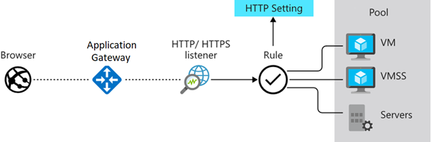
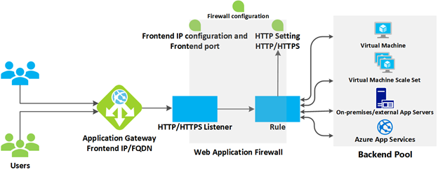
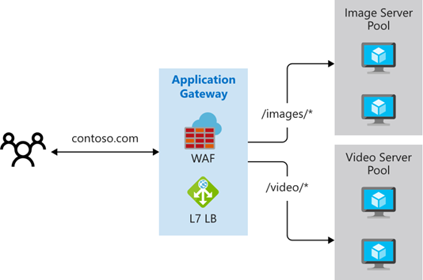
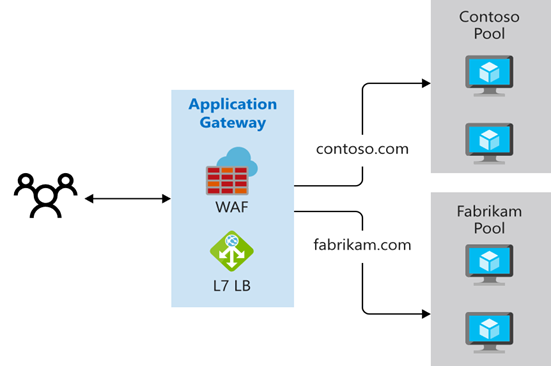
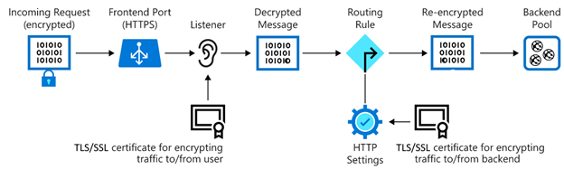

# AZ-104 — Introducción a Azure Application Gateway

Módulo 24 del [AZ-104T00](https://learn.microsoft.com/en-us/training/courses/az-104t00) ([ES](https://learn.microsoft.com/es-es/training/courses/az-104t00)) · Ruta 4 — Configuración y administración de redes virtuales · Área: Implementación y administración de redes virtuales (15–20%).

## Concepto

Qué hace Azure Application Gateway (balanceador de capa 7), cómo funciona y cuándo elegirlo frente a Load Balancer.

## Resumen en mis palabras

> *(pendiente — rellenar al estudiar el módulo)*

## Por qué importa para el examen

> - Entra en "Configuración de la resolución de nombres y el equilibrio de carga" del área
> - Distinguir LB (L4) vs App Gateway (L7, routing HTTP/S, listeners, WAF)

> **Gap del examen**: la ruta es solo intro — routing HTTP/S, reglas y WAF hay que cubrirlos con [docs de Application Gateway](https://learn.microsoft.com/en-us/azure/application-gateway/) ([ES](https://learn.microsoft.com/es-es/azure/application-gateway/)).

## Enlaces relacionados

**Módulo de Learn**: [Introducción a Azure Application Gateway](https://learn.microsoft.com/en-us/training/modules/intro-to-azure-application-gateway/) ([ES](https://learn.microsoft.com/es-es/training/modules/intro-to-azure-application-gateway/))

**Savill**: buscar "Application Gateway" en la [playlist AZ-104](https://www.youtube.com/playlist?list=PLlVtbbG169nGlGPWs9xaLKT1KfwqREHbs) · repaso final con el [Study Cram v2](https://www.youtube.com/watch?v=0Knf9nub4-k)

**Páginas de `knowledge/`**: [Azure Networking](azure-networking.md)

**Laboratorio**: Lab 06 (Implement Network Traffic Management, incluye App Gateway) de [MicrosoftLearning/AZ-104](https://github.com/MicrosoftLearning/AZ-104-MicrosoftAzureAdministrator) — ver [labs/AZ-104](../labs/AZ-104/)

# Introducción.

Azure Application Gateway es un servicio de Azure que procesa el tráfico a las aplicaciones web hospedadas en un grupo de servidores web. El procesamiento realizado por Azure Application Gateway incluye el equilibrio de carga del tráfico HTTP e inspeccionar el tráfico mediante el firewall de aplicaciones web. También incluye el cifrado del tráfico entre usuarios y una puerta de enlace de aplicación, y el cifrado del tráfico entre servidores de aplicaciones y una puerta de enlace de aplicación.

Adatum es una nueva tienda de comercio en línea que vende drones industriales. Usted es responsable de las redes en la empresa. Adatum tiene varias aplicaciones web hospedadas en equipos de su centro de datos local. En este momento, se implementa un dispositivo de hardware especial pero antiguo en la red perimetral de Adatum que administra el tráfico a las aplicaciones web hospedadas en estos equipos. Quiere retirar este dispositivo y que el tráfico sea mediado por un servicio de Azure.

Para cumplir sus objetivos, debe asegurarse de que el servicio de Azure replica la funcionalidad que proporciona actualmente el hardware especial. La funcionalidad importante que debe estar presente en el servicio de reemplazo incluye:

- Detecte si uno de los servidores locales deja de estar disponible para que el tráfico ya no se dirija a él.
- Funcionalidad de terminación TLS (Seguridad de la capa de transporte) para reducir la cantidad de recursos de CPU consumidos por las operaciones de cifrado y descifrado.
- Afinidad de sesión para asegurarse de que el mismo host de grupo de back-end siempre atiende una conexión de cliente a una aplicación web.
- Filtrado de seguridad del tráfico malintencionado, como los ataques de inyección de código SQL y scripts entre sitios.

En este módulo se explica lo que hace Azure Application Gateway, cómo funciona y cuándo debe elegir usar Azure Application Gateway como solución para satisfacer las necesidades de su organización.

# ¿Qué es Azure Application Gateway?.

Azure Application Gateway administra las solicitudes que las aplicaciones cliente envían a aplicaciones web hospedadas en un grupo de servidores web. El grupo de servidores web puede ser máquinas virtuales de Azure, conjuntos de escalado de máquinas virtuales de Azure, Azure App Service e incluso servidores locales.

Application Gateway proporciona características como el tráfico HTTP de equilibrio de carga y el firewall de aplicaciones web. Admite el cifrado TLS/SSL del tráfico entre el usuario y una puerta de enlace de aplicaciones, y entre los servidores de aplicaciones y una puerta de enlace de aplicaciones.

**Application Gateway utiliza el proceso round robin** para enviar solicitudes de equilibrio de carga a los servidores de cada grupo back-end. La permanencia de sesión garantiza que las solicitudes de cliente de una misma sesión se enrutan al mismo servidor back-end. La permanencia de sesión es especialmente importante con las aplicaciones de comercio electrónico en las que no quiere que se interrumpa una transacción porque el equilibrador de carga la devuelve entre los servidores back-end.

Azure Application Gateway incluye las siguientes características:

- Compatibilidad con los protocolos HTTP, HTTPS, HTTP/2 y WebSocket.
- Firewall de aplicaciones web para protegerse frente a vulnerabilidades de aplicaciones web.
- Cifrado de la solicitud de un extremo a otro.
- Escalado automático para ajustar dinámicamente la capacidad a medida que cambia la carga del tráfico web.
- La purga de conexión permite la correcta eliminación de miembros del grupo de back-end durante las actualizaciones de servicio planeadas.

> [!info] Analogía: Round Robin
> **Round Robin** significa "por turnos" o "en rotación". Consiste en repartir algo de forma cíclica: cuando llega al último participante, vuelve al primero. Se usa en sistemas operativos, reparto de tareas, balanceo de carga y competiciones.
>
> Tienes tres procesos que quieren usar la CPU:
>
> - P1 necesita 5 segundos
> - P2 necesita 3 segundos
> - P3 necesita 4 segundos
>
> Y decides que cada uno puede usar la CPU como máximo **2 segundos seguidos**. A esos 2 segundos se les llama _quantum_.
>
> La CPU los atiende así:
>
> | Tiempo | Ejecuta | Qué ocurre |
> |---|---|---|
> | 0–2 | P1 | Le quedan 3 s; vuelve al final de la cola |
> | 2–4 | P2 | Le queda 1 s; vuelve al final |
> | 4–6 | P3 | Le quedan 2 s; vuelve al final |
> | 6–8 | P1 | Le queda 1 s; vuelve al final |
> | 8–9 | P2 | Termina |
> | 9–11 | P3 | Termina |
> | 11–12 | P1 | Termina |
>
> El orden es: `P1 → P2 → P3 → P1 → P2 → P3 → P1`

# Funcionamiento de Azure Application Gateway

Azure Application Gateway tiene una serie de componentes que se combinan para enrutar y equilibrar la carga de forma segura las solicitudes en un grupo de servidores web. Application Gateway incluye los siguientes componentes:

- **Dirección IP de front-end**: las solicitudes de cliente se reciben a través de una dirección IP de front-end. Puede configurar Application Gateway para que tenga una dirección IP pública, privada o ambas. Application Gateway no puede tener más de una dirección IP pública y una privada.

- **Clientes de escucha**: Application Gateway usa uno o varios clientes de escucha para recibir las solicitudes entrantes. Un agente de escucha acepta el tráfico que llega a una combinación especificada de protocolo, puerto, host y dirección IP. Cada agente de escucha enruta las solicitudes a un grupo de servidores back-end siguiendo las reglas de enrutamiento que especifique. Un agente de escucha puede ser Básico o Multisitio. Un cliente de escucha _básico_ solo enruta una solicitud según la ruta de acceso de la dirección URL. Un cliente de escucha _multisitio_ también puede enrutar las solicitudes mediante el elemento de nombre de host de la dirección URL. Los agentes de escucha también controlan los certificados TLS/SSL para proteger la aplicación entre el usuario y Application Gateway.

- **Reglas de enrutamiento**: una regla de enrutamiento enlaza un cliente de escucha a los grupos de servidores back-end. Una regla especifica cómo interpretar los elementos de nombre de host y ruta de acceso de la dirección URL de una solicitud, y dirige la solicitud al grupo de servidores back-end adecuado. Una regla de enrutamiento también tiene un conjunto de configuración de HTTP asociado. Estas configuraciones de HTTP indican si se cifra el tráfico entre Application Gateway y los servidores back-end y cómo hacerlo. Entre las otras informaciones de configuración se incluye el protocolo, la permanencia de sesión, el drenaje de conexiones, el período de tiempo de espera de una solicitud y los sondeos de estado.

## Equilibrio de carga en Application Gateway

Application Gateway usa un mecanismo **round robin** para equilibrar automáticamente la carga de las solicitudes enviadas a los servidores de cada grupo de back-end. El equilibrio de carga funciona con el enrutamiento de capa 7 de interconexión de sistemas abiertos (OSI) implementado por el enrutamiento de Application Gateway, lo que significa que equilibra la carga de las solicitudes en función de los parámetros de enrutamiento (nombres de host y rutas de acceso) usados por las reglas de Application Gateway. En comparación, otros equilibradores de carga, como Azure Load Balancer, funcionan en el nivel de capa OSI 4 y distribuyen el tráfico según la dirección IP del destino de una solicitud.

Si tiene que asegurarse de que todas las solicitudes para un cliente en la misma sesión se enrutan al mismo servidor en un grupo de servidores back-end, puede configurar la permanencia de sesión.

## Firewall de aplicaciones web

El firewall de aplicaciones web (WAF) es un componente opcional que controla las solicitudes entrantes antes de llegar a un agente de escucha. El firewall de aplicaciones web comprueba cada solicitud en busca de muchos riesgos comunes, según el Open Web Application Security Project (OWASP). Entre las amenazas comunes se incluyen: Inyección de código SQL, scripting entre sitios, inyección de comandos, contrabandización de solicitudes HTTP, división de respuesta HTTP, inclusión de archivos remotos, bots, rastreadores y escáneres, y infracciones y anomalías del protocolo HTTP.

OWASP define un conjunto de reglas genéricas para detectar ataques. Estas reglas se conocen como Core Rule Set (CRS). Los conjuntos de reglas están en continua revisión, puesto que los ataques son cada vez más sofisticados. WAF admite cuatro conjuntos de reglas: CRS 3.2, 3.1, 3.0 y 2.2.9. CRS 3.1 es el valor predeterminado. Si es necesario, puede optar por seleccionar únicamente determinadas reglas de un conjunto de reglas, que están destinadas a determinadas amenazas. Además, puede personalizar el firewall para que especifique qué elementos de una solicitud debe examinar y limitar el tamaño de los mensajes para evitar que cargas masivas sobrecarguen los servidores.

## Grupos de servidores back-end

Un grupo de back-end es una colección de servidores web que se pueden componer de: un conjunto fijo de máquinas virtuales, un conjunto de escalado de máquinas virtuales, una aplicación hospedada por Azure App Services o una colección de servidores locales.

Cada grupo de servidores back-end tiene un equilibrador de carga asociado que distribuye el trabajo en el grupo. Al configurar el grupo, proporcione la dirección IP o el nombre de cada servidor web. Todos los servidores en el grupo de back-end se deben configurar de la misma manera, incluida su configuración de seguridad.

Si usa TLS/SSL, el grupo de back-end tiene una configuración de HTTP que hace referencia a un certificado utilizado para autenticar los servidores de back-end. La puerta de enlace vuelve a cifrar el tráfico con este certificado antes de enviarlo a uno de los servidores en el grupo de back-end.

Si usa Azure App Service para hospedar la aplicación de back-end, no es necesario que instale ningún certificado en Application Gateway para conectarse al grupo de back-end. Todas las comunicaciones se cifran automáticamente. Application Gateway confía en los servidores porque los administra Azure.

Application Gateway usa una regla para especificar cómo dirigir los mensajes que recibe en su puerto entrante a los servidores del grupo de back-end. Si los servidores usan TLS/SSL, debe configurar la regla para que indique lo siguiente:

- Que los servidores esperan tráfico a través del protocolo HTTPS.
- Qué certificado debe usarse para cifrar el tráfico y autenticar la conexión a un servidor.

## Enrutamiento de Application Gateway

Cuando la puerta de enlace enruta la solicitud del cliente a un servidor web en el grupo de servidores back-end mediante un conjunto de reglas configuradas para que la puerta de enlace determine dónde debería ir la solicitud. Hay dos métodos principales de enrutamiento del tráfico de solicitudes de clientes: enrutamiento basado en rutas de acceso y enrutamiento de varios sitios.

### Enrutamiento basado en ruta de acceso

El enrutamiento basado en rutas de acceso envía solicitudes con distintas rutas de acceso de URL a distintos grupos de servidores back-end. Por ejemplo, podría dirigir las solicitudes con la ruta /video/* a un grupo de servidores backend que contenga servidores que están optimizados para controlar el streaming de vídeo y dirigir las solicitudes de /images/* a un grupo de servidores que administran la recuperación de imágenes.

### Enrutamiento de varios sitios

El enrutamiento de varios sitios configura más de una aplicación web en la misma instancia de Application Gateway. En una configuración de varios sitios, se registran varios nombres de sistema de nombres de dominio (CNAME) para la dirección IP de la puerta de enlace de aplicaciones, especificando el nombre de cada sitio. Application Gateway usa agentes de escucha independientes para esperar por las solicitudes de cada sitio. Cada agente de escucha pasa la solicitud a otra regla, que puede enrutar las solicitudes a servidores en otro grupo de servidores back-end. Por ejemplo, podría dirigir todas las solicitudes de `http://contoso.com` a los servidores de un grupo back-end y las solicitudes de `http://fabrikam.com` a otro grupo back-end. El diagrama siguiente muestra esta configuración:

Las configuraciones de varios sitios son útiles para admitir aplicaciones multiinquilino, donde cada inquilino tiene su propio conjunto de máquinas virtuales u otros recursos que hospedan una aplicación web.

El enrutamiento de Application Gateway también incluye estas características:

- **Redireccionamiento**. El redireccionamiento puede ser hacia otro sitio o de HTTP a HTTPS.
- **Reescritura de encabezados HTTP**. Los encabezados HTTP permiten que el cliente y el servidor pasen información de parámetros con la solicitud o la respuesta.
- **Páginas de error personalizadas**. Application Gateway permite crear páginas de error personalizadas en lugar de mostrar páginas de error predeterminadas. La página de error puede personalizarse para incluir una marca y diseño propios.

## Terminación de TLS/SSL

Cuando finaliza la conexión TLS/SSL en la puerta de enlace de aplicaciones, descarga la carga de trabajo de la terminación TLS/SSL intensiva de CPU de los servidores. Además, no es necesario instalar certificados y configurar TLS/SSL en los servidores.

Si necesita el cifrado de extremo a extremo, Application Gateway puede descifrar el tráfico en la puerta de enlace con la clave privada y, después, volver a cifrarlo con la clave pública del servicio que se ejecuta en el grupo de back-end.

El tráfico entra en la puerta de enlace por medio de un puerto de front-end. Puede abrir muchos puertos, y Application Gateway puede recibir mensajes en cualquiera de ellos. Un cliente de escucha es lo primero que se encuentra el tráfico al entrar en la puerta de enlace a través de un puerto. El agente de escucha está configurado para escuchar un nombre de host específico y un puerto específico en una dirección IP específica. El cliente de escucha puede usar un certificado TLS/SSL para descifrar el tráfico que entra en la puerta de enlace. Después, el cliente de escucha usa una regla que ha definido para dirigir las solicitudes entrantes a un grupo de back-end.

Exponer una aplicación web o un sitio web a través de la puerta de enlace de aplicaciones también significa que los servidores no se conectan directamente a la web. Solo expone el puerto 80 o el 443 en la puerta de enlace de aplicaciones, que luego se reenvía al servidor del grupo de back-end. En esta configuración, los servidores web no son accesibles directamente desde Internet, lo que reduce la superficie de ataque de su infraestructura.

## Comprobaciones de salud

Los sondeos de estado determinan qué servidores están disponibles para el equilibrio de carga en un grupo back-end. Application Gateway usa un sondeo de estado para enviar una solicitud a un servidor. Cuando el servidor devuelve una respuesta HTTP con un código de estado entre 200 y 399, se considera que el servidor está en buen estado. Si no configura un sondeo de estado, Application Gateway crea un sondeo predeterminado que espera 30 segundos antes de decidir que un servidor no está disponible. Los sondeos de estado garantizan que el tráfico no se dirige a un punto de conexión web no responde o con errores en el grupo de back-end.

## Escalado automático

Application Gateway admite el escalado automático y puede escalarse o reducirse verticalmente en función de los cambiantes patrones de la carga de tráfico. El escalado automático también quita el requisito de elegir un tamaño de implementación o un recuento de instancias durante el aprovisionamiento.

## Tráfico de WebSocket y HTTP/2

Application Gateway proporciona compatibilidad nativa con los protocolos WebSocket y HTTP/2. Los protocolos WebSocket y HTTP/2 permiten la comunicación dúplex completa entre un servidor y un cliente a través de una conexión de Protocolo de control de transmisión (TCP) de larga duración. Este tipo de comunicación es más interactivo entre el servidor web y el cliente, y puede ser bidireccional sin necesidad de sondear según sea necesario en implementaciones basadas en HTTP. Estos protocolos tienen, a diferencia de HTTP, una sobrecarga reducida y pueden reutilizar la misma conexión TCP para varias solicitudes y respuestas, con lo que se utilizan los recursos de una manera más eficaz. Estos protocolos están diseñados para funcionar a través de puertos HTTP tradicionales de 80 y 443.

# Cuándo usar Azure Application Gateway

Azure Application Gateway puede satisfacer las necesidades de su organización por los siguientes motivos:

- El enrutamiento de Azure Application Gateway permite dirigir el tráfico desde un punto de conexión de Azure a un grupo de back-end formado por servidores que se ejecutan en el centro de datos local de Adatum. La funcionalidad de sondeo de estado de Azure Application Gateway garantiza que el tráfico no se dirige a ningún servidor que deje de estar disponible.
- La funcionalidad de terminación TLS de Azure Application Gateway reduce la cantidad de capacidad de CPU que los servidores del grupo de back-end asignan a las operaciones de cifrado y descifrado.
- Azure Application Gateway permite que Adatum use un firewall de aplicaciones web para bloquear el scripting entre sitios y el tráfico de inyección de código SQL antes de llegar a los servidores del grupo de back-end.
- Azure Application Gateway admite la afinidad de sesión. Esta compatibilidad es necesaria porque las varias aplicaciones web implementadas por Adatum usan la información de estado de sesión de usuario almacenada localmente en servidores individuales del grupo de back-end.

## Cuándo no usar Azure Application Gateway

Azure Application Gateway no es adecuado si tiene una aplicación web que no requiere equilibrio de carga. Por ejemplo, si tiene una aplicación web que solo recibe una pequeña cantidad de tráfico y la infraestructura existente ya maneja competentemente la carga actual, no es necesario implementar un grupo de aplicaciones web back-end o máquinas virtuales ni usar Application Gateway.

Azure proporciona otras soluciones de equilibrio de carga, como Azure Front Door, Azure Traffic Manager y Azure Load Balancer. En la lista siguiente se describen las diferencias entre estos servicios:

- **Front Door** es una red de entrega de aplicaciones que proporciona equilibrio de carga global y servicio de aceleración de sitios para aplicaciones web. Ofrece funcionalidades de nivel 7 para la aplicación, como la descarga TLS/SSL, el enrutamiento basado en rutas de acceso, la conmutación por error rápida, el firewall de aplicaciones web y el almacenamiento en caché para mejorar el rendimiento y la alta disponibilidad de las aplicaciones. Elija esta opción en escenarios como el equilibrio de carga de una aplicación web implementada en varias regiones de Azure.
- **Traffic Manager** es un equilibrador de carga de tráfico basado en DNS que permite distribuir el tráfico de forma óptima a los servicios en regiones globales de Azure, a la vez que proporciona alta disponibilidad y capacidad de respuesta. Dado que Traffic Manager es un servicio de equilibrio de carga basado en DNS, solo equilibra la carga en el nivel del dominio. Por ese motivo, no puede conmutar por error tan rápidamente como con Front Door, debido a los desafíos comunes relacionados con el almacenamiento en caché de DNS y a los sistemas que no respetan los TTL de DNS.
- **Azure Load Balancer** es un servicio de equilibrio de carga de capa 4 de alto rendimiento y ultra baja latencia para todos los protocolos UDP y TCP. Azure Load Balancer se ha creado para controlar millones de solicitudes por segundo, a la vez que se garantiza que la solución es de alta disponibilidad. Azure Load Balancer es con redundancia de zona, lo que garantiza una alta disponibilidad en todas las zonas de disponibilidad. Azure Load Balancer funciona dentro de una región en lugar de globalmente.

# Ejercicio

## 1. Protección contra inyección SQL

> [!success] Respuesta correcta
> **Firewall de aplicaciones web (WAF)**
> 
> El WAF de Application Gateway incluye reglas que detectan y bloquean patrones típicos de ataques de inyección SQL, XSS y otros riesgos web comunes. No es una función de sondeos ni de TLS; es específicamente una capa de seguridad de aplicación.

> [!failure] Por qué las otras son incorrectas
> - **Sondeos de estado**: solo comprueban si el backend está disponible (puerto, ruta, código de respuesta). No inspeccionan el contenido de las peticiones ni protegen contra ataques.
> - **Terminación de TLS/SSL**: gestiona la conexión HTTPS (cifrado, certificados) entre cliente y gateway. Mejora la seguridad del canal, pero no analiza ni bloquea inyecciones SQL en el tráfico HTTP.

---

## 2. Evitar enviar tráfico a una VM que no responde

> [!success] Respuesta correcta
> **Sondeos de estado**
> 
> Los sondeos de estado comprueban periódicamente si cada instancia del backend está disponible (puerto, ruta, código de respuesta, etc.). Si una VM deja de responder correctamente, Application Gateway la marca como no saludable y deja de enviarle nuevas peticiones hasta que vuelve a pasar los sondeos.

> [!failure] Por qué las otras son incorrectas
> - **Firewall de aplicaciones web (WAF)**: protege contra ataques web (SQLi, XSS, etc.), pero no determina si una VM del backend está caída o no responde. No es un mecanismo de salud del backend.
> - **Purga de la conexión**: se usa para sacar una instancia de forma controlada durante mantenimiento. No detecta automáticamente fallos ni evita que se envíe tráfico a una VM que falla por sí sola.

---

## 3. Sacar una VM del backend para mantenimiento sin cortar conexiones existentes

> [!success] Respuesta correcta
> **Purga de la conexión**
> 
> La purga de la conexión permite sacar una instancia del grupo de back-end de forma controlada:
> - Se detiene el envío de **nuevas** conexiones a esa VM.
> - Se permite que las **conexiones existentes** finalicen de forma natural.
> 
> Esto es ideal para operaciones de mantenimiento o despliegues en los que no quieres interrumpir usuarios activos, pero sí evitar que lleguen nuevas peticiones a esa máquina.

> [!failure] Por qué las otras son incorrectas
> - **Afinidad de sesión**: sirve para que las peticiones de un mismo cliente vayan siempre a la misma instancia del backend (stickiness). No sirve para sacar una VM del pool ni para gestionar mantenimiento.
> - **Sondeos de estado**: detectan si una instancia está sana o no, pero no ofrecen un modo controlado de “quitar para mantenimiento” respetando las sesiones activas. Además, dependen de que la VM falle el sondeo, no de una acción administrativa deliberada.

# Resumen

En este módulo, ha aprendido sobre Azure Application Gateway, un servicio que le permite administrar las solicitudes que las aplicaciones cliente pueden enviar a una aplicación web. Ha aprendido que Application Gateway enruta el tráfico a un grupo de servidores web en función de la dirección URL de una solicitud. El grupo de servidores web puede estar compuesto de máquinas virtuales de Azure, conjuntos de escalado de máquinas virtuales, Azure App Service e incluso servidores locales. Ha aprendido que Application Gateway proporciona características como el equilibrio de carga del tráfico HTTP, un firewall de aplicaciones web y la compatibilidad con el cifrado TLS/SSL de los datos. También ha aprendido que Application Gateway admite el cifrado del tráfico entre los usuarios y una puerta de enlace de aplicaciones, y entre los servidores de aplicaciones y una puerta de enlace de aplicaciones.

## Relacionado

- [Índice AZ-104](../certifications/AZ-104/INDEX.md)
- [Azure Networking](azure-networking.md)
- [AZ-104 — Introducción a Azure Load Balancer](az104-load-balancer.md)
