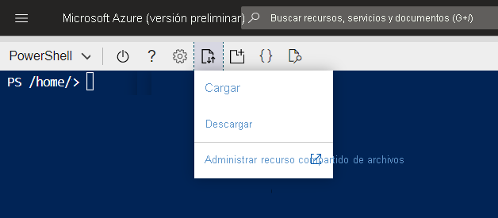
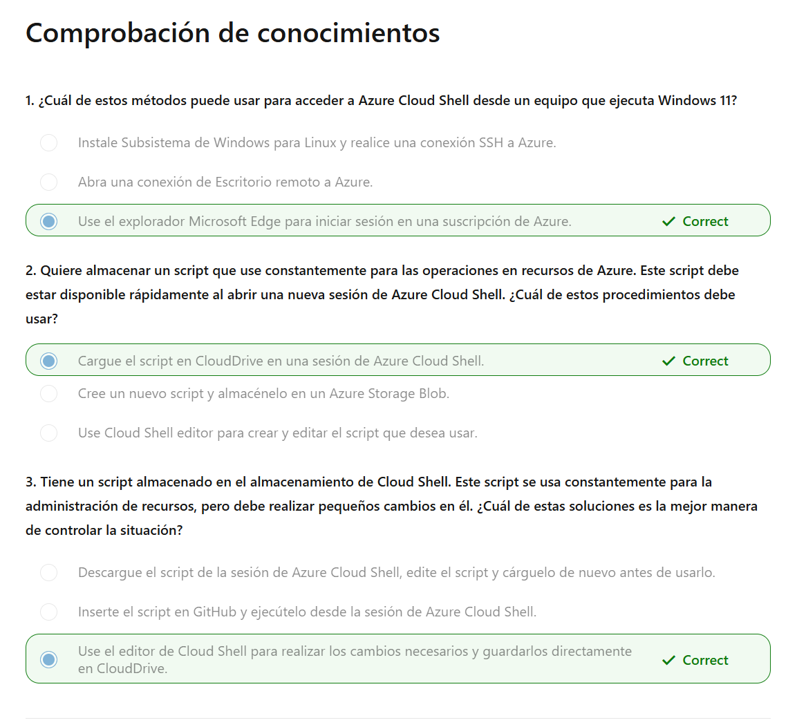

# ¿Qué es Azure Cloud Shell?

Azure Cloud Shell es un entorno de línea de comandos al que puede acceder a través del explorador web. Puede usar este entorno para administrar recursos de Azure, incluidas las máquinas virtuales, el almacenamiento y las redes. Al igual que lo hace al usar la CLI de Azure o Azure PowerShell.

Azure Cloud Shell también proporciona almacenamiento en la nube para conservar archivos como claves SSH, scripts, etc. Esta funcionalidad le permite acceder a archivos importantes entre sesiones y con diferentes máquinas. Por último, puede usar el editor de Cloud Shell para realizar cambios en archivos, como scripts, que se guardan en este almacenamiento en la nube directamente desde la interfaz Cloud Shell.

## Access Cloud Shell

You have a few different options for accessing Azure Cloud Shell:

- From a direct link: [https://shell.azure.com](https://shell.azure.com/)

![[assets/images/AZ-104/cloud-shell.png]]

## Acceso a sus propios scripts y archivos

Al usar Cloud Shell, es posible que también tenga que ejecutar scripts o usar archivos para diferentes acciones. Puede conservar archivos en Cloud Shell mediante Azure CloudDrive:

## Herramientas de Cloud Shell

Si necesita administrar recursos (como contenedores de Docker o clústeres de Kubernetes) o desea usar herramientas que no sean de Microsoft (como Ansible y Terraform) en Cloud Shell, la sesión de Cloud Shell incluye estos complementos ya configurados previamente.

Esta es una lista de todos los complementos disponibles en una sesión de Cloud Shell:

|Categoría|Nombre|
|---|---|
|**Herramientas de Linux**|bash   zsh   sh   tmux   dig|
|**Herramientas de Azure**|[Azure CLI](https://learn.microsoft.com/es-es/cli/azure/)   AzCopy   CLI de Azure Functions   CLI de Service Fabric   Batch Shipyard   blobxfer|
|**Editores de texto**|código (editor de Cloud Shell)   Vim   nano   Emacs|
|**Control de código fuente**|git|
|**Herramientas de compilación**|make   maven   npm   pip|
|**Recipientes**|Máquina de Docker   Kubectl   Helm   DC/OS CLI|
|**Bases de datos**|Cliente de MySQL   Cliente de PostgreSql   Utilidad sqlcmd   mssql-scripter|
|**Otro**|Cliente de iPython   CLI de Cloud Foundry   Terraform   Ansible   Chef InSpec   Puppet Bolt   HashiCorp Packer   CLI de Office 365|
# ¿Cuándo puede usar Azure Cloud Shell?

Como Administración de TI para Contoso Corporation, necesita alternativas para interactuar con los recursos de Azure desde la línea de comandos incluso cuando no se usa el dispositivo administrativo predeterminado.

Puede utilizar Azure Cloud Shell para:

- Abrir una sesión de línea de comandos segura desde cualquier dispositivo basado en explorador.
- Interactuar con los recursos de Azure sin necesidad de instalar complementos o complementos en el dispositivo.
- Conservar archivos entre sesiones para su uso posterior.
- Utilizar Bash o PowerShell, lo que prefiera, para administrar los recursos de Azure.
- Editar archivos (como scripts) mediante el editor de Cloud Shell.

No debe usar Azure Cloud Shell si:

- Tiene previsto dejar abierta una sesión durante más de 20 minutos para scripts o actividades de larga duración. En estos casos, la sesión se desconecta sin advertencia y se pierde el estado actual.
- Necesita permisos de administrador, como el acceso sudo, desde la CLI de Azure o el entorno de PowerShell.
- Debe instalar herramientas que no se admiten en el entorno limitado de Cloud Shell, sino que requieren un entorno como una máquina virtual personalizada o un contenedor.
- Necesita almacenamiento de diferentes regiones. Es posible que tenga que realizar copias de seguridad y sincronizar este contenido, ya que solo una región puede tener asignado el almacenamiento a Azure Cloud Shell.
- Debe abrir varias sesiones al mismo tiempo. Azure Cloud Shell solo permite una instancia a la vez y no es adecuada para el trabajo simultáneo en varias suscripciones o inquilinos.
- 

## Learn more

Check out these articles to learn more about Azure Cloud Shell.

[Azure Cloud Shell Overview](https://learn.microsoft.com/en-us/azure/cloud-shell/overview) ([ES](https://learn.microsoft.com/es-es/azure/cloud-shell/overview))
t
[Azure Cloud Shell – Browser-Based Command Line](https://azure.microsoft.com/features/cloud-shell/)
