# AZ-104 — Hospedaje de su dominio en Azure DNS

Módulo 20 del [AZ-104T00](https://learn.microsoft.com/en-us/training/courses/az-104t00) ([ES](https://learn.microsoft.com/es-es/training/courses/az-104t00)) · Ruta 4 — Configuración y administración de redes virtuales · Área: Implementación y administración de redes virtuales (15–20%).

## Concepto

Crear una zona DNS para un nombre de dominio, registros DNS para asignar el dominio a una IP, y comprobar la resolución.

## Resumen en mis palabras

> *(pendiente — rellenar al estudiar el módulo)*

## Por qué importa para el examen

> - Configuración de Azure DNS (zonas públicas y privadas, tipos de registro A/CNAME/MX/TXT)

## Enlaces relacionados

**Módulo de Learn**: [Hospedaje de su dominio en Azure DNS](https://learn.microsoft.com/en-us/training/modules/host-domain-azure-dns/) ([ES](https://learn.microsoft.com/es-es/training/modules/host-domain-azure-dns/))

**Savill**: buscar "DNS" en la [playlist AZ-104](https://www.youtube.com/playlist?list=PLlVtbbG169nGlGPWs9xaLKT1KfwqREHbs) · repaso final con el [Study Cram v2](https://www.youtube.com/watch?v=0Knf9nub4-k)

**Páginas de `knowledge/`**: [Azure Networking](azure-networking.md)

**Laboratorio**: sin lab dedicado en el repo oficial — práctica libre en sandbox. Ver [labs/AZ-104](../labs/AZ-104/)

# Introducción.

Azure DNS le permite hospedar los registros DNS de sus dominios en la infraestructura de Azure. Con Azure DNS puede usar las mismas credenciales, API, herramientas y facturación que con los demás servicios de Azure.

Imaginemos que su empresa ha comprado hace poco el nombre de dominio personalizado wideworldimporters.com a un registrador de nombres de dominio de terceros. El nombre de dominio es para un sitio web nuevo que tiene previsto lanzar su organización. Necesita un servicio de hospedaje de dominios DNS. Este servicio de hospedaje resolvería el dominio wideworldimporters.com a la dirección IP del servidor web.

Ya usa Azure para compilar el sitio web, por lo que decide usar Azure DNS para administrar el dominio.

En este módulo se muestra cómo configurar Azure DNS para hospedar su dominio. También aprenderá a agregar un alias y otros registros DNS para resolver el nombre de dominio en un sitio web.

# ¿Qué es Azure DNS?

Azure DNS es un servicio de hospedaje para dominios de Sistema de nombres de dominio (DNS) que ofrece una resolución de nombres mediante la infraestructura de Azure.

En esta unidad, obtendrá información sobre qué es DNS y cómo funciona. También aprenderá sobre Azure DNS y por qué lo usaría.

## ¿Qué es DNS?

DNS (sistema de nombres de dominio) es un protocolo que se encuentra dentro del estándar TCP/IP. DNS tiene un rol esencial de convertir los nombres de dominio legibles (por ejemplo, `www.wideworldimports.com`) en una dirección de protocolo IP conocida. Las direcciones IP permiten a los equipos y a los dispositivos de red identificar y enrutar las solicitudes entre sí.

DNS usa un directorio global hospedado en servidores de todo el mundo. Microsoft forma parte de la red que proporciona un servicio DNS mediante Azure DNS.

Un servidor DNS también se denomina servidor de nombres DNS (o simplemente servidor de nombres).

## ¿Cómo funciona DNS?

Un servidor DNS desempeña una de las dos funciones principales:

- Mantiene una memoria caché local de nombres de dominio usados recientemente y sus direcciones IP. Esta memoria caché proporciona una respuesta más rápida a una solicitud de búsqueda en un dominio local. Si el servidor DNS no encuentra el dominio solicitado, pasa la solicitud a otro servidor DNS. Este proceso se repite en cada servidor DNS hasta que se encuentra una coincidencia o hasta que se agota el tiempo de espera de la búsqueda.

- Mantiene la base de datos de pares clave-valor de las direcciones IP y cualquier host o subdominio sobre el que el servidor DNS tiene autoridad. Esta función se suele asociar al correo, la Web y otros servicios de dominio de Internet.

### Asignación de servidores DNS

Para que un equipo, servidor u otro dispositivo habilitado para la red acceda a recursos web, debe hacer referencia a un servidor DNS.

Cuando se conecta usando la red local, la configuración de DNS procede de su servidor. Al conectarse desde una ubicación externa, como un hotel, la configuración de DNS procede del proveedor de acceso a Internet (ISP).

### Solicitudes de búsqueda de dominio

A continuación se muestra una introducción simplificada del proceso que usa un servidor DNS cuando resuelve una solicitud de búsqueda de nombre de dominio:

- Si el nombre de dominio se almacena en la memoria caché a corto plazo, el servidor DNS resuelve la solicitud de dominio.
- Si el dominio no se encuentra en la memoria caché, se pondrá en contacto con uno o varios servidores DNS de la web para ver si tienen una coincidencia. Si se encuentra una, el servidor DNS actualiza la memoria caché local y resuelve la solicitud.
- Si el dominio no se encuentra después de un número razonable de comprobaciones de DNS, el servidor DNS responde con un error _No se encuentra el dominio_.

### IPv4 e IPv6

Cada equipo, servidor o dispositivo habilitado para la red que se encuentra en su red tiene una dirección IP. Las direcciones IP son únicas dentro de su dominio. Hay dos estándares de dirección IP: IPv4 e IPv6.

- **IPv4** se compone de cuatro conjuntos de números, en el intervalo de 0 a 255, separados por un punto; por ejemplo: 127.0.0.1. En la actualidad, IPv4 es el estándar que se usa con más frecuencia. Sin embargo, con el aumento de los dispositivos IoT, el estándar IPv4 no podrá mantenerse.
    
- **IPv6** es un estándar relativamente nuevo y está pensado para reemplazar finalmente IPv4. Se compone de ocho grupos de números hexadecimales, cada uno separado por dos puntos; por ejemplo: fe80:11a1:ac15:e9gf:e884:edb0:ddee:fea3.
    

Muchos dispositivos de red se aprovisionan ahora con una dirección IPv4 y una dirección IPv6. El servidor de nombres DNS puede resolver nombres de dominio tanto en direcciones IPv4 como en direcciones IPv6.

### Configuración DNS del dominio

Tanto si un tercero hospeda el servidor DNS como si lo administra internamente, debe configurarlo para cada tipo de host que use. Los tipos de host incluyen Web, correo electrónico u otros servicios en uso.

Como administrador de su empresa, quiere configurar un servidor DNS mediante Azure DNS. En este caso, el servidor DNS actúa como inicio de autoridad (SOA) de su dominio.

### Tipos de registros DNS

La información de configuración del servidor DNS se almacena en forma de archivo dentro de una zona del servidor DNS. Cada archivo se denomina registro. Los siguientes tipos de registro son los que se crean y usan más a menudo:

- **A** es el registro host y es el tipo de registro DNS más habitual. Asigna el nombre de dominio o de host a la dirección IP.
- **CNAME** es un registro de nombre canónico que se usa para asignar un alias de un nombre de dominio a otro. Si tuvieras nombres de dominio diferentes que todos apuntan al mismo sitio web, usarías CNAME.
- **MX** es el registro de intercambio de correo. Asigna solicitudes de correo al servidor de correo electrónico, tanto si están hospedadas en el entorno local como en la nube.
- **TXT** es el registro de texto. Sirve para asociar cadenas de texto a un nombre de dominio. Azure y Microsoft 365 usan registros TXT para comprobar la propiedad del dominio.

Por otro lado, existen también los siguientes tipos de registro:

- Caracteres comodín
- CAA (entidad de certificación)
- NS (servidor de nombres)
- SOA (inicio de autoridad)
- SPF (marco de directivas de remitente)
- SRV (ubicaciones de servidor)

Los registros SOA y NS se crean automáticamente al crear una zona DNS con Azure DNS.

### Conjuntos de registros

Algunos tipos de registro admiten el concepto de conjuntos de registros (o conjuntos de registros de recursos). Un conjunto de registros permite definir varios recursos en un único registro. Por ejemplo, esto es un registro A que tiene un dominio con dos direcciones IP:

```
www.wideworldimports.com.     3600    IN    A    127.0.0.1
www.wideworldimports.com.     3600    IN    A    127.0.0.2
```

Los registros SOA y CNAME no pueden contener conjuntos de registros.

## ¿Qué es Azure DNS?

Azure DNS le permite hospedar y administrar sus dominios usando una infraestructura de servidor de nombres distribuida globalmente. Le permite administrar todos sus dominios con sus credenciales de Azure existentes.

Azure DNS actúa como SOA del dominio.

> [!TIP]
> SOA = Start of Authority. Registro que identifica al servidor autoritativo de la zona. Azure lo crea solo, y existe uno por zona.

No puede usar Azure DNS para registrar un nombre de dominio; debe usar un registrador de dominios de terceros para ello.

## ¿Por qué usar Azure DNS para hospedar su dominio?

Azure DNS se basa en el servicio Azure Resource Manager, el cual ofrece las siguientes ventajas:

- Seguridad mejorada
- Facilidad de uso
- Dominios de DNS privados
- Conjuntos de registros de alias

En este momento, Azure DNS no es compatible con las extensiones de seguridad del sistema de nombres de dominio. Si necesita esta extensión de seguridad, deberá hospedar esas partes del dominio con un proveedor de terceros.

|Sigla|Significado|Qué es|
|---|---|---|
|**DNS**|Domain Name System|Traduce nombres a IPs|
|**NS**|Name Server|Indica qué servidores gestionan la zona (Azure asigna 4)|
|**A**|Address|Nombre → IPv4|
|**AAAA**|Address (IPv6)|Nombre → IPv6|
|**CNAME**|Canonical Name|Un nombre es alias de otro|
|**MX**|Mail Exchange|Servidor de correo del dominio|
|**TXT**|Text|Texto libre, usado para verificaciones (SPF, dominio)|
|**PTR**|Pointer|Resolución inversa: IP → nombre|
|**TTL**|Time To Live|Segundos que se cachea un registro|
|**SPF**|Sender Policy Framework|Lista qué servidores pueden enviar correo por el dominio|
### Características de seguridad

Azure DNS proporciona las siguientes características de seguridad:

- **Control de acceso basado en roles**, que permite un control específico del acceso de los usuarios a los recursos de Azure. Puede supervisar su uso y controlar los recursos y servicios a los que tienen acceso.
- **Registros de actividad**, que le permiten hacer un seguimiento de los cambios en un recurso e indicar dónde se han producido errores.
- **Bloqueo de recursos**, que proporciona un mayor nivel de control para restringir o quitar el acceso a grupos de recursos, suscripciones o a cualquier recurso de Azure.

### Facilidad de uso

Azure DNS puede administrar registros DNS para sus servicios de Azure y proporcionar DNS para sus recursos externos. Azure DNS usa las mismas credenciales de Azure, el mismo contrato de soporte técnico y la misma facturación que los demás servicios de Azure.

Puede administrar sus dominios y registros usando los cmdlets de Azure PowerShell, Azure Portal o la CLI de Azure. Las aplicaciones que requieren la administración de DNS automatizada se pueden integrar con el servicio usando la API de REST y los kits de desarrollo de software (SDK).

### Dominios privados

Azure DNS controla la traducción de nombres de dominio externos a direcciones IP. Azure DNS le permite crear zonas privadas. Estas zonas proporcionan la resolución de nombres para las máquinas virtuales (VM) dentro de una red virtual, y entre redes virtuales, sin tener que crear una solución DNS personalizada. Las zonas privadas le permiten usar sus propios nombres de dominio personalizados en lugar de los nombres proporcionados por Azure.

Para publicar una zona DNS privada en la red virtual, especifique la lista de redes virtuales que pueden resolver registros en ella.

Las zonas DNS privadas ofrecen las ventajas siguientes:

- Las zonas DNS se admiten como parte de la infraestructura de Azure, por lo que no es necesario invertir en una solución DNS.
- Se admiten todos los tipos de registros DNS: A, CNAME, TXT, MX, SOA, AAAA, PTR y SRV.
- Los nombres de host de las máquinas virtuales de su red virtual se mantienen automáticamente.
- La compatibilidad con DNS de horizonte dividido permite que el mismo nombre de dominio exista en zonas públicas y privadas. Se resuelve en el dominio correcto en función de la ubicación de la solicitud de origen.

### Conjuntos de registros de alias

Los conjuntos de registros de alias pueden apuntar a un recurso de Azure. Por ejemplo, puede configurar un registro de alias para dirigir el tráfico a una IP pública de Azure, un perfil de Azure Traffic Manager o un punto de conexión de Azure Content Delivery Network.

El conjunto de registros de alias es compatible con los siguientes tipos de registro DNS:

- A
- AAAA
- CNAME

# Configurar Azure DNS para hospedar su dominio.

El nuevo sitio web de la empresa está en la fase de pruebas finales. Está trabajando en el plan para implementar el dominio wideworldimports.com con Azure DNS. Debe analizar cuáles son los pasos necesarios.

En esta unidad, aprenderá lo siguiente:

- Crear y configurar una zona DNS para su dominio con Azure DNS.
- Entender cómo vincular su dominio a una zona de Azure DNS.
- Crear y configurar una zona DNS privada.

## Configuración de una zona DNS pública

Las zonas DNS se usan para hospedar los registros DNS de un dominio, como wideworldimports.com.

### Paso 1: crear una zona DNS en Azure

Ha usado un registrador de nombres de dominio de terceros para registrar el dominio wideworldimports.com. El dominio todavía no apunta al sitio web de su organización.

Para hospedar el nombre de dominio con Azure DNS, primero debe crear una zona DNS para ese dominio. Las zonas DNS contienen todas las entradas DNS del dominio.

Al crear una zona DNS, debe proporcionar los siguientes datos:

- **Suscripción:** suscripción que se va a usar.
    
- **Grupo de recursos.** nombre del grupo de recursos que contendrá sus dominios. Si no existe ninguno, cree uno para permitir un mejor control y administración.
    
- **Nombre**: El nombre de dominio, que en este caso es wideworldimports.com.
    
- **Ubicación del grupo de recursos:** de manera predeterminada, la ubicación es la ubicación del grupo de recursos.
    
    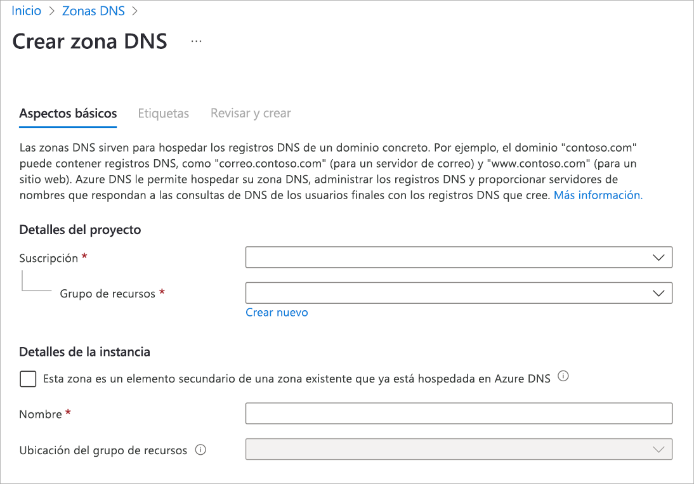
    

### Paso 2: obtener los servidores de nombres de Azure DNS

Una vez creada una zona DNS para el dominio, deberá obtener los datos del servidor de nombres a partir del registro de servidores de nombres (NS). Estos datos sirven para actualizar la información de su registrador de dominios y apuntar a la zona Azure DNS.

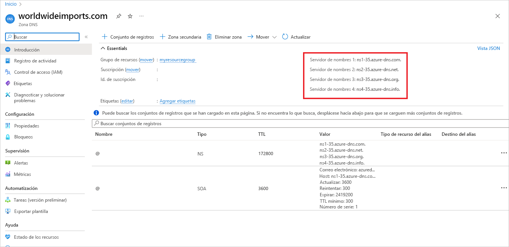

### Paso 3: actualizar la configuración del registrador de dominios

Como propietario del dominio, debe iniciar sesión en la aplicación de administración de dominios proporcionada por su registrador de dominios. En la aplicación de administración, edite el registro NS y cambie los datos de NS para que coincidan con los datos del servidor de nombres de Azure DNS.

La acción de cambiar los datos de NS se denomina _delegación de dominio_. Al delegar el dominio, debe usar los cuatro servidores de nombres proporcionados por Azure DNS.

### Paso 4: comprobar la delegación de los servicios de nombres de dominio

El siguiente paso consiste en comprobar que el dominio delegado apunta ahora a la zona DNS de Azure que ha creado para el dominio. Este proceso puede tardar unos 10 minutos, pero también más tiempo.

Para comprobar si la delegación de dominio se ha efectuado correctamente, consulte el registro del inicio de autoridad (SOA). El registro SOA se crea automáticamente al configurar la zona DNS de Azure. Puede comprobar el registro SOA mediante una herramienta como nslookup.

El registro SOA representa su dominio y se convierte en el punto de referencia cuando otros servidores DNS busquen su dominio en Internet.

Para comprobar la delegación, use nslookup de la siguiente manera:

```
nslookup -type=SOA wideworldimports.com
```

### Paso 5: establecer la configuración de DNS personalizada

El nombre de dominio es wideworldimports.com. Cuando se usa en un explorador, el dominio se resuelve en el sitio web. Pero ¿qué ocurre si quiere agregarlo a servidores web o a equilibradores de carga? Estos recursos deben tener su propia configuración personalizada en la zona DNS, ya sea como registro A o CNAME.

#### Registro A

Cada registro A necesita los siguientes datos:

- **Nombre:** nombre del dominio personalizado (por ejemplo, _webserver1_).
- **Tipo:** A, en este caso.
- **TTL:** representa el período de vida como unidad entera, donde 1 es un segundo. Este valor indica durante cuánto tiempo reside el registro A en una memoria caché de DNS antes de que expire.
- **Dirección IP:** dirección IP del servidor en el que debe resolverse este registro A.

#### Registro CNAME

CNAME es el nombre canónico o el alias de un registro A. Use CNAME si tiene distintos nombres de dominio que acceden al mismo sitio web. Por ejemplo, puede que necesite un CNAME en la zona _wideworldimports_ si quiere que tanto www.wideworldimports.com como wideworldimports.com se resuelvan en la misma dirección IP.

Crearía el registro CNAME en la zona _wideworldimports_ con la siguiente información:

- Nombre: www
- TTL: 600 segundos
- Tipo de registro: CNAME

Si hubiera expuesto una función web, debería crear un registro CNAME que se resuelve en la función de Azure.

## Configuración de una zona DNS privada

Otro tipo de zona DNS que puede configurar y hospedar en Azure es una zona DNS privada. Las zonas DNS privadas no están visibles en Internet y no requieren que use un registrador de dominios. Puede usar zonas DNS privadas para asignar nombres DNS a máquinas virtuales (VM) en las redes virtuales de Azure.

### Paso 1: Creación de una zona DNS privada

En Azure Portal, busque _Zonas DNS privadas_. Para crear la zona privada, debe especificar un grupo de recursos y el nombre de la zona. Por ejemplo, el nombre podría ser similar a private.wideworldimports.com.

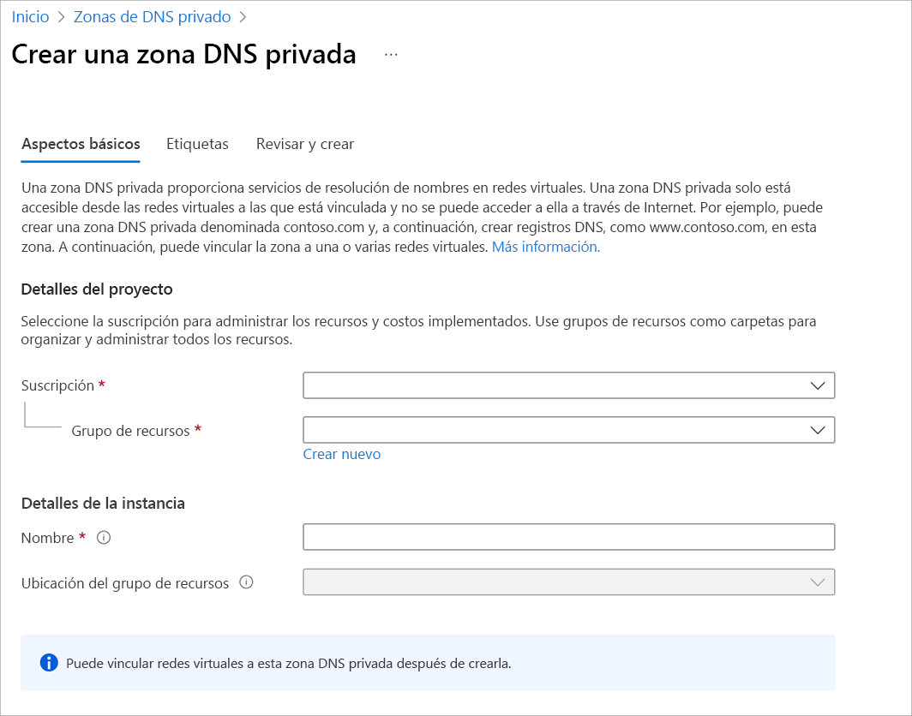

### Paso 2: identificar redes virtuales

Supongamos que su organización ya ha creado las máquinas virtuales y las redes virtuales en un entorno de producción. Identifique las redes virtuales asociadas a las máquinas virtuales que necesiten compatibilidad con la resolución de nombres. Para vincular las redes virtuales a la zona privada, necesitará los nombres de las redes virtuales.

### Paso 3: vincular la red virtual a una zona DNS privada

Para vincular la zona DNS privada a una red virtual, deberá crear un vínculo de red virtual. En Azure Portal, vaya a la zona privada y seleccione **Vínculos de la red virtual**.

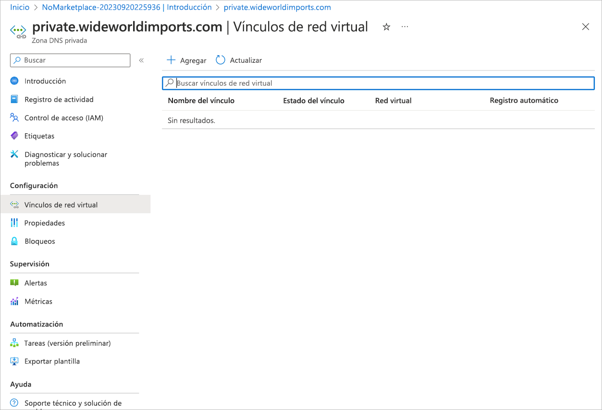

Seleccione **Agregar** para seleccionar la red virtual que quiera vincular a la zona privada.

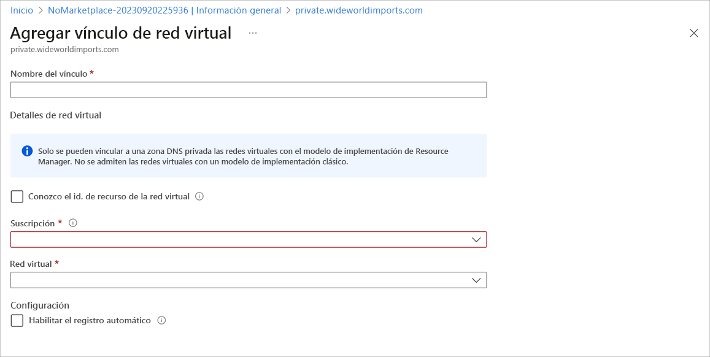

Agregue un registro de vínculo de red virtual para cada red virtual que necesite compatibilidad con la resolución de nombres privados.

En la próxima unidad aprenderá a crear una zona DNS pública.

> [!abstract] Resumen en una frase **DNS pública** = nombres visibles para todo Internet, apuntando a IPs públicas. **DNS privada** = nombres visibles solo dentro de tus VNets enlazadas, apuntando a IPs privadas.

---

## 📖 Glosario de siglas

|Sigla|Significado|Qué es|
|---|---|---|
|**DNS**|Domain Name System|Traduce nombres a direcciones IP|
|**SOA**|Start of Authority|Registro que identifica al servidor autoritativo de la zona|
|**NS**|Name Server|Servidores que gestionan la zona (Azure asigna 4)|
|**A**|Address|Registro que asocia un nombre con una IPv4|
|**CNAME**|Canonical Name|Un nombre es alias de otro|
|**TTL**|Time To Live|Segundos que se cachea un registro|
|**VNet**|Virtual Network|Red privada de Azure|
|**VM**|Virtual Machine|Máquina virtual|
|**IP**|Internet Protocol|Dirección de red|
|**LB**|Load Balancer|Balanceador de carga|
|**RG**|Resource Group|Contenedor lógico de recursos|

---

## 🆚 Comparativa

|DNS **pública**|DNS **privada**|
|---|---|---|
|**Accesible desde**|Internet|Solo VNets enlazadas|
|**Devuelve**|IPs públicas|IPs privadas|
|**Name servers (NS)**|Sí, 4 asignados por Azure|No tiene|
|**Necesita _virtual network link_**|No|**Sí**|
|**Uso típico**|Web pública (`www`)|Nombres internos de VMs y bases de datos|
|**Comando CLI**|`az network dns`|`az network private-dns`|

> [!info] Virtual network link Es el **enlace** que conecta una zona privada con una VNet. Sin él, las VMs de esa VNet no pueden resolver los nombres de la zona.

---

## 🛒 Caso de uso: una tienda online

Tienes el dominio `tienda.com`, con un frontend web y una base de datos en una VNet. Necesitas dos cosas:

- Que los **clientes en Internet** accedan a `www.tienda.com`.
- Que tus **servidores se encuentren por nombre** sin exponerse a Internet.

```
                    INTERNET
                       │
        DNS pública: www.tienda.com → 20.50.10.5 (IP pública)
                       │
                       ▼
              ┌─────────────────┐
              │  Load Balancer  │
              └────────┬────────┘
   ┌───────────────────┼───────────────────┐
   │ VNet              ▼                   │
   │        [VM web]  ────────►  [VM base de datos]
   │                  bd.interno.tienda.com
   │                  (DNS privada → 10.0.2.4)
   └───────────────────────────────────────┘
```

### Qué resuelve cada zona

|DNS pública|DNS privada|
|---|---|---|
|**Zona**|`tienda.com`|`interno.tienda.com`|
|**Registro**|`www` → `20.50.10.5`|`bd` → `10.0.2.4`|
|**Quién lo ve**|Cualquiera en Internet|Solo las VMs de las VNets enlazadas|
|**Para qué**|Que los clientes lleguen a la web|Que la web encuentre la base de datos|

---

## 🛠️ Creación paso a paso

### Zona pública + registro `www`

```bash
az network dns zone create -g rg-dns -n tienda.com

az network dns record-set a add-record \
  -g rg-dns -z tienda.com -n www \
  -a 20.50.10.5
```

### Zona privada + enlace a la VNet + registro `bd`

```bash
az network private-dns zone create -g rg-dns -n interno.tienda.com

az network private-dns link vnet create \
  -g rg-dns -z interno.tienda.com -n enlace-vnet \
  -v vnet-tienda -e false

az network private-dns record-set a add-record \
  -g rg-dns -z interno.tienda.com -n bd \
  -a 10.0.2.4
```

> [!tip] Registro automático `-e false` desactiva el registro automático. Con `-e true`, las VMs de la VNet se registran solas en la zona privada.

---

## 🔍 Qué pasa en la práctica

|Quién consulta|Pregunta|Resultado|
|---|---|---|
|Un cliente en su casa|`www.tienda.com`|`20.50.10.5` ✅|
|Un cliente en su casa|`bd.interno.tienda.com`|**No existe** (la zona privada no es visible desde Internet) ✅|
|La VM web dentro de la VNet|`bd.interno.tienda.com`|`10.0.2.4` ✅|

> [!success] Ventaja La base de datos nunca queda expuesta a Internet, y la aplicación usa un nombre fijo en lugar de una IP que podría cambiar.

---

## 🔀 Variante: Split-horizon DNS

**Split-horizon** (horizonte dividido): una zona privada con el **mismo nombre** que la pública. La respuesta depende de **desde dónde** se consulta.

|Quién consulta `api.tienda.com`|Respuesta|
|---|---|
|Un cliente desde Internet|IP pública `20.50.10.5`|
|Una VM dentro de la VNet|IP privada `10.0.1.10`|

> [!info] Para qué sirve Las VMs internas hablan directamente por la red privada, sin salir a Internet, mientras que los usuarios externos usan la entrada pública.

---

## ✅ Ideas clave para el examen

|#|Concepto|Recuerda|
|---|---|---|
|1|**DNS pública**|Resuelve desde Internet; tiene 4 name servers|
|2|**DNS privada**|Solo dentro de VNets enlazadas; no tiene name servers|
|3|**Virtual network link**|Obligatorio para que una VNet use una zona privada|
|4|**SOA**|Un registro por zona, lo crea Azure solo|
|5|**Registro A**|Nombre → IPv4|
|6|**Split-horizon**|Mismo nombre, distinta respuesta según el origen|

# Ejercicio: Creación de una zona DNS y un registro A con Azure DNS

En la unidad anterior, se describió cómo instalar y configurar el dominio wideworldimports.com para que apunte a su hospedaje de Azure en Azure DNS.

En esta unidad aprenderá a:

- Configurar un Azure DNS y crear una zona DNS pública.
- Crear un registro A.
- Comprobar que el registro A se resuelve en una dirección IP.

> [!NOTE]
> Este ejercicio es opcional. Si desea completar este ejercicio, deberá crear una suscripción de Azure antes de comenzar. Si no tiene una cuenta de Azure o no quiere crear una en este momento, puede leer las instrucciones para que comprenda la información que se presenta.

> [!NOTE]
> Debe usar un grupo de recursos para completar los pasos de este ejercicio. Puede usar un grupo de recursos que ya ha creado o puede crear un nuevo grupo de recursos específicamente para este ejercicio. Si decide crear un nuevo grupo de recursos, esto facilitará la limpieza de los recursos que cree a medida que complete el ejercicio. Si no tiene un grupo de recursos existente o desea crear uno nuevo específicamente para este ejercicio, puede seguir los pasos descritos en [Uso de Azure Portal y Azure Resource Manager para administrar grupos](https://learn.microsoft.com/es-es/azure/azure-resource-manager/management/manage-resource-groups-portal) de recursos para crear un grupo de recursos mediante Azure Portal, o puede seguir los pasos descritos en [Administración de grupos de recursos de Azure mediante la CLI de Azure](https://learn.microsoft.com/es-es/azure/azure-resource-manager/management/manage-resource-groups-cli) para crear un grupo de recursos mediante la CLI de Azure.

## Creación de una zona DNS en Azure DNS

Para poder hospedar el dominio wideworldimports.com en sus servidores, debe crear una zona DNS. La zona DNS contiene todos los registros de configuración asociados a su dominio.

Para crear la zona DNS, debe hacer lo siguiente:

1. Inicie sesión en [Azure Portal](https://portal.azure.com/learn.docs.microsoft.com) con la cuenta que ha usado para activar el espacio aislado.
    
2. En la página **principal** de Azure, en **Servicios de Azure**, seleccione **Crear un recurso**. Aparecerá el panel **Crear un recurso**.
    
3. En el cuadro de búsqueda _Buscar servicios y marketplace_, busque y seleccione **Zona DNS** por Microsoft. Aparecerá el panel **Zona DNS**.
    
4. Seleccione **Crear**>**zona DNS**.
    
    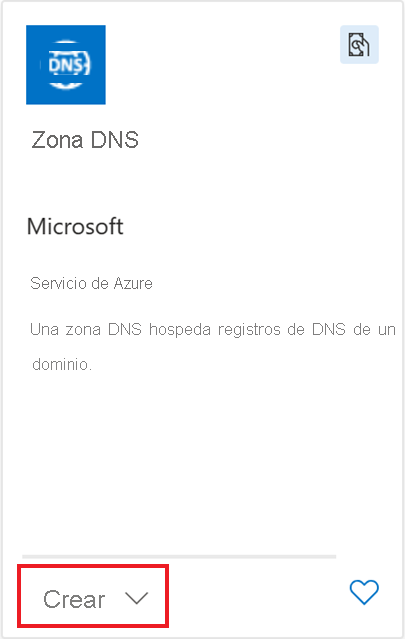
    
    Se abrirá el panel **Crear zona DNS**.
    
5. En la pestaña **Aspectos básicos**, escriba los valores siguientes para cada opción.
    
|Configuración|Valor|
|---|---|
|**Detalles del proyecto**||
|Suscripción|Elección de la suscripción|
|Grupo de recursos|En la lista desplegable, seleccione el grupo de recursos que desea usar para este ejercicio.|
|**Detalles de instancia**||
|Nombre|El nombre debe ser único en el espacio aislado. Use `wideworldimportsXXXX.com` y reemplace las "X" por letras o números.|
    
    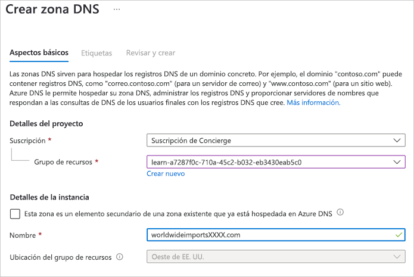
    
6. Seleccione **Revisar + crear**.
    
7. Una vez pasada la validación, seleccione **Crear**. La operación de creación de la zona DNS tarda unos minutos.
    
8. Una vez finalizada la implementación, seleccione **Ir al recurso**. Aparece el panel **Información general** de la **zona DNS**.
    
9. Seleccione **Conjuntos de registros** en la barra de menús superior.
    
    De forma predeterminada, los conjuntos de registros NS y SOA se crean automáticamente cada vez que se crea una zona DNS y se eliminan automáticamente cada vez que se elimina una zona DNS. El conjunto de registros NS define los espacios de nombres de Azure DNS y contiene los cuatro conjuntos de registros de Azure DNS. Usará los cuatro registros al actualizar el registrador.
    
    El registro SOA representa su dominio y se usa cuando otros servidores DNS buscan su dominio.
    
10. Anote los valores del registro NS, Los necesitará en la siguiente sección.
    

## Creación de un registro DNS

Ahora que tiene la zona DNS, debe crear los registros necesarios para admitir el dominio.

El conjunto de registros principal que se va a crear es el registro A. El conjunto de registros A se usa para apuntar el tráfico desde un nombre de dominio lógico hasta la dirección IP del servidor de hospedaje. Un conjunto de registros A puede tener varios registros. En un conjunto de registros, el nombre de dominio permanece constante, mientras que las direcciones IP son diferentes.

1. Si aún no está en la pantalla **Conjuntos de registros**, abra el panel **Zona DNS** para _wideworldimportsXXXX.com_. En la barra de menús superior, seleccione **Conjuntos de registros**.
    
2. En el panel **Conjuntos de registros**, seleccione **+ Agregar** en la barra de menús superior.
    
3. Seleccione **Agregar** en la parte superior de la página Conjuntos de registros.
    
    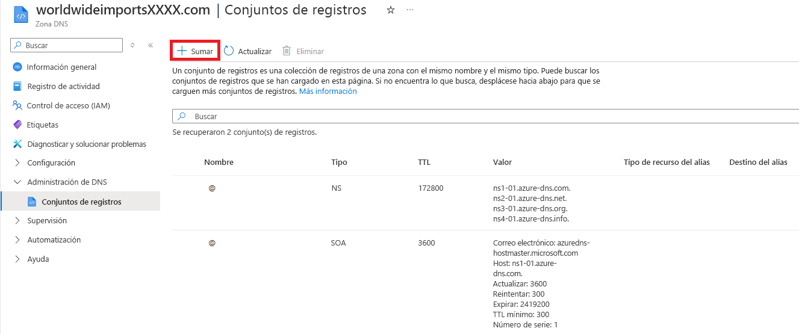
    
    Aparecerá el panel **Agregar conjunto de registros**.
    
4. Escriba los valores siguientes para cada opción.
    
    |Configuración|Valor|Descripción|
    |---|---|---|
    |Nombre|www|El nombre de host que quiere resolver en una dirección IP.|
    |Tipo|Un|El registro **A** es el que se usa con más frecuencia. Si usa IPv6, seleccione el tipo **AAAA**.|
    |Conjunto de registros de alias|No|Solo se puede aplicar a los tipos de registro A, AAAA y CNAME.|
    |TTL|1|El período de vida especifica el período de tiempo que cada servidor DNS almacena en caché la resolución antes de que se purgue.|
    |Unidad de TTL|Horas|Este valor puede indicar segundos, minutos, horas, días o semanas. Aquí representa horas.|
    |Dirección IP|10.10.10.10|Dirección IP a la que se resuelve el nombre del registro. En un escenario real, escribiría la dirección IP pública del servidor web.|
    
5. Seleccione **Aceptar** para agregar el registro a la zona.
    
    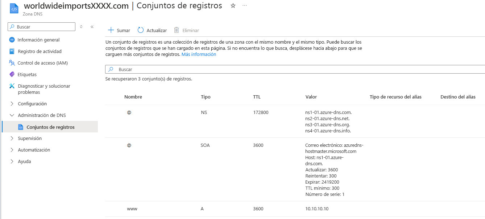
    

Tenga en cuenta que puede tener más de una dirección IP configurada para su servidor web. En ese caso, agregará todas las direcciones IP asociadas como registros al conjunto de registros A. Una vez creado el conjunto de registros, puede actualizarlo con más direcciones IP.

## Comprobación del DNS de Azure global

En un caso real, después de crear la zona DNS pública, se actualizarían los registros NS del registrador de nombres de dominio para delegar el dominio en Azure.

Aunque no tenemos ningún dominio registrado, todavía es posible comprobar que la zona DNS funciona según lo previsto usando la herramienta `nslookup`.

### Uso de nslookup para comprobar la configuración

Aquí se muestra cómo usar `nslookup` para comprobar la configuración de la zona DNS.

1. Use Cloud Shell para ejecutar el comando que aparece a continuación. Reemplace el nombre de la zona DNS por la zona que creó y reemplace `<name server address>` por uno de los valores NS que copió después de crear la zona DNS.
    
    ```
    nslookup www.wideworldimportsXXXX.com <name server address>
    ```
    
    El comando debería tener un aspecto similar al siguiente:
    
    ```
    nslookup www.wideworldimportsXXXX.com ns1-04.azure-dns.com
    ```
    
2. Debería ver que el nombre de host `www.wideworldimportsXXXX.com` se resuelve en 10.10.10.10.
    
    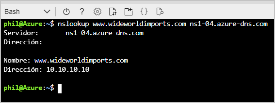
    

Felicidades. Ha configurado correctamente una zona DNS y ha creado un registro A.

# Resolución dinámica del nombre del recurso mediante un registro de alias

En el ejercicio anterior, ha delegado correctamente el dominio del registrador de dominios a Azure DNS y ha configurado un registro A para vincular el dominio al servidor web.

La siguiente fase de la implementación consiste en mejorar la resistencia usando un equilibrador de carga. Los equilibradores de carga distribuyen las solicitudes de datos de entrada y el tráfico a través de uno o varios servidores. Reducen la carga en cualquier servidor y mejoran el rendimiento. Esta tecnología está bien establecida. Puede usarlo en toda la red local.

Sabe que el registro A y el registro CNAME no admiten la conexión directa con recursos de Azure, como los equilibradores de carga. Tiene la tarea de averiguar cómo vincular el dominio de vértice con un equilibrador de carga.

## ¿Qué es un dominio de vértice?

El dominio de vértice representa el nivel más alto del dominio. En nuestro caso, se trata de wideworldimports.com. El dominio de vértice también se conoce a veces como _vértice de zona_ o _vértice raíz_. El símbolo **@** suele representar el dominio de vértice en los registros de zona DNS.

Si comprueba la zona DNS para wideworldimports.com, verá que hay dos registros de dominio de vértice: NS y SOA. Los registros NS y SOA se crean automáticamente al crear la zona DNS.

Los registros CNAME que puede necesitar para un perfil de Azure Traffic Manager o los puntos de conexión de Azure Content Delivery Network no son compatibles con el nivel de vértice de zona. Sin embargo, los _registros de alias_ se admiten en el nivel de vértice de zona.

## ¿Qué son los registros de alias?

Los registros de alias de Azure permiten que un dominio de vértice de zona haga referencia a otros recursos de Azure desde la zona DNS. No es necesario crear directivas de redirección complejas. También puede usar un alias de Azure para enrutar todo el tráfico a través de Traffic Manager.

El registro de alias de Azure puede apuntar a los siguientes recursos de Azure:

- Un perfil de Traffic Manager.
- Puntos de conexión de Azure Content Delivery Network.
- Un recurso de IP pública.
- Un perfil de Front Door

Los registros de alias proporcionan un seguimiento del ciclo de vida de los recursos de destino, lo que garantiza que los cambios efectuados en cualquier recurso de destino se aplican automáticamente a la zona DNS. Además, proporcionan compatibilidad con las aplicaciones de carga equilibrada en el vértice de zona.

El conjunto de registros de alias es compatible con los siguientes tipos de registro de zona DNS:

- **A**: el registro de asignación de nombres de dominio IPv4.
- **AAAA**: el registro de asignación de nombres de dominio IPv6.
- **CNAME**: alias del dominio, que se vincula al registro A.

## Usos de los registros de alias

A continuación se muestran algunas de las ventajas del uso de registros de alias:

- **Impide los registros DNS colgantes**: un registro DNS colgante ocurre cuando los registros de la zona DNS no están actualizados con los cambios en las direcciones IP. Los registros de alias evitan las referencias pendientes al acoplar estrechamente el ciclo de vida de un registro DNS con un recurso de Azure.
- **Actualiza automáticamente el conjunto de registros DNS cuando cambian las direcciones IP**: cuando se cambia la dirección IP subyacente de un recurso, servicio o aplicación, el registro de alias garantiza que los registros DNS asociados se actualicen automáticamente.
- **Hospeda aplicaciones de carga equilibrada en el vértice de zona**: los registros de alias permiten el enrutamiento de recursos de vértice de zona a Traffic Manager.
- **Apunta el vértice de zona a los puntos de conexión de Azure Content Delivery Network**: con los registros de alias, ahora puede hacer referencia directamente a su instancia de Azure Content Delivery Network.

Un registro de alias le permite vincular el vértice de zona (wideworldimports.com) a un equilibrador de carga. Crea un vínculo al recurso de Azure en lugar de crear una conexión basada en IP directa. Por lo tanto, si la dirección IP de su equilibrador de carga cambia, el registro del vértice de zona sigue funcionando.

# Ejercicio: Creación de registros de alias para Azure DNS

**12 minutos** · 100 XP completados

La nueva implementación del sitio web fue un gran éxito. El volumen de uso es superior al previsto. El único servidor web en el que se ejecuta el sitio web muestra signos de saturación. Su organización quiere aumentar el número de servidores y distribuir la carga con un equilibrador de carga.

Ahora sabe que puede usar un registro de alias de Azure para proporcionar un vínculo dinámico y de actualización automática entre el vértice de la zona y el equilibrador de carga.

En esta unidad aprenderá a:

- Configurar una red virtual con dos máquinas virtuales y un equilibrador de carga.
- Configurar un alias de Azure en el vértice de la zona para dirigirlo al equilibrador de carga.
- Comprobar que el nombre de dominio se resuelve en una o en cualquiera de las máquinas virtuales de la red virtual.

> [!NOTE]
> Este ejercicio es opcional. Si desea completar este ejercicio, deberá crear una suscripción de Azure antes de comenzar. Si no tiene una cuenta de Azure o no quiere crear una en este momento, puede leer las instrucciones para que comprenda la información que se presenta.

## Configuración de una red virtual, un equilibrador de carga y máquinas virtuales en Azure

Al crear manualmente una red virtual, un equilibrador de carga y dos máquinas virtuales, se tarda algún tiempo. Para reducir este tiempo, puede usar un script de configuración de Bash que esté disponible en GitHub. Siga estas instrucciones para crear un entorno de prueba para su registro de alias.

1. En Azure Cloud Shell, ejecute el siguiente script de configuración:
    
    ```
    git clone https://github.com/MicrosoftDocs/mslearn-host-domain-azure-dns.git
    ```
    
2. Para ejecutar el script de configuración, ejecute los siguientes comandos:
    
    ```
    cd mslearn-host-domain-azure-dns
    chmod +x setup.sh
    ./setup.sh
    ```
    
    El script de instalación tarda unos minutos en ejecutarse. El script:
    
    - Crea un grupo de seguridad de red.
    - Crea dos controladores de interfaz de red (NIC) y dos máquinas virtuales.
    - Crea una red virtual y asigna las máquinas virtuales.
    - Crea una IP pública y actualiza la configuración de las máquinas virtuales.
    - Crea un equilibrador de carga que hace referencia a las máquinas virtuales, incluidas las reglas del equilibrador de carga.
    - Vincula las NIC al equilibrador de carga.
    
    Una vez concluido el script, le mostrará la IP pública del equilibrador de carga. Copie la dirección IP para usarla más adelante.
    

## Creación de un registro de alias en el vértice de la zona

Ahora que ha creado un entorno de prueba, está listo para configurar el registro de alias de Azure en el vértice de la zona.

1. En [Azure Portal](https://portal.azure.com/learn.docs.microsoft.com), seleccione **Grupos de recursos**. Aparece el panel **Grupos de recursos**.
    
2. Seleccione el grupo de recursos. Aparecerá el panel **Grupo de recursos**.
    
3. En la lista de recursos, seleccione la zona DNS que creó en el ejercicio anterior, wideworldimportsXXXX.com. Aparece el panel **wideworldimportsXXXX.com - Zona DNS**.
    
4. En la barra de menús, seleccione **+ Conjunto de registros**. Aparecerá el panel **Agregar conjunto de registros**.
    
5. Escriba los valores siguientes para cada opción a fin de crear un registro de alias.
    
    |Configuración|Value|
    |---|---|
    |Nombre|Deje el nombre en blanco. En blanco se indica la zona DNS para wideworldimportsXXXX.com.|
    |Tipo|A. Aunque estamos creando un alias, el tipo de registro base debe seguir siendo A, AAAA, o CNAME.|
    |Conjunto de registros de alias|Sí|
    |Tipo de alias|Recurso de Azure|
    |Recurso de Azure|En la lista de recursos, seleccione **myPublicIP**. Las implementaciones pueden tardar hasta 15 minutos en propagarse. Si este recurso no aparece en la lista, espere varios minutos, actualice el portal y vuelva a intentarlo.|
    
    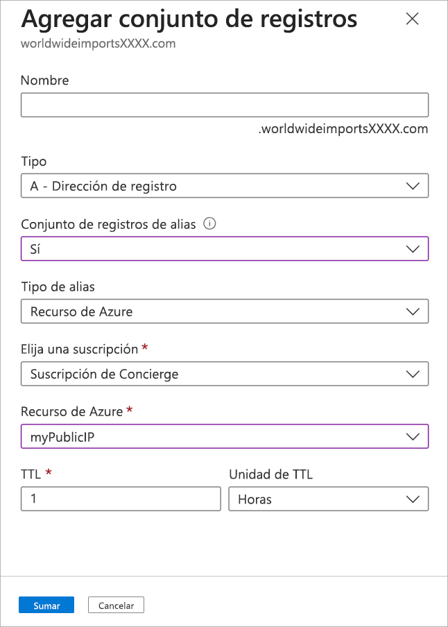
    
6. Seleccione **Aceptar** para agregar el registro a la zona.
    

Al crear el registro de alias, debería tener un aspecto similar al siguiente:

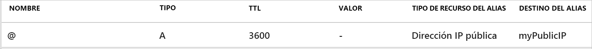

## Comprobación de que el alias se resuelve en el equilibrador de carga

Ahora debe asegurarse de que el registro de alias está configurado correctamente. En un escenario real, tendría un dominio real y completaría la delegación de dominios en Azure DNS. Usaría el nombre de dominio registrado para este ejercicio. Dado que en esta unidad se supone que no hay ningún dominio registrado, se usa la dirección IP pública.

1. En Azure Portal, vaya al grupo de recursos, seleccione **myPublicIP**y, a continuación, seleccione el icono **Copiar** junto a la dirección IP.
    
    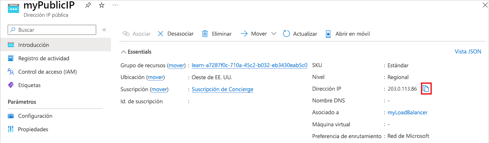
    
2. En un explorador web, pegue la IP pública como dirección URL.
    
3. Verá una página web básica que muestra el nombre de la máquina virtual (VM) a la que el equilibrador de carga envió la solicitud.

# Resumen

Su empresa ha comprado hace poco el nombre de dominio personalizado wideworldimporters.com a un registrador de nombres de dominio de terceros. El nombre de dominio es para un sitio web nuevo que tiene previsto lanzar su organización. Necesita un servicio de hospedaje de dominios DNS. Este servicio de hospedaje resolvería el dominio wideworldimporters.com en la dirección IP de su servidor web basado en Azure.

Su empresa quería administrar toda su infraestructura y la información relacionada del nombre de dominio en un solo lugar. Ha visto lo fácil que es administrar la información del Sistema de nombres de dominio (DNS) mediante una zona de Azure DNS. Primero, ha creado una zona de Azure DNS y luego ha actualizado los registros NS en el registrador de dominios para que apunten a ella.

Ha aprendido los usos de los distintos conjuntos de registros: A, AAAA, CNAME, NS y SOA. También ha aprendido cómo usar los alias de Azure para invalidar el registro estático A/AAAA/CNAME a fin de proporcionar una referencia dinámica a los recursos. El uso de una zona de Azure DNS ha mejorado la administración de recursos de su empresa, ya que su personal solo necesitaba un lugar para administrar las tareas relacionadas con DNS.

La zona de Azure DNS permite un mejor control y mayor integración con los recursos de Azure. Puede obtener algunas de las funciones de conjuntos de registros más básicas con la consola de administración del registrador de dominios. Sin embargo, la vinculación a cualquiera de sus recursos de Azure se vuelve difícil o imposible sin un alto grado de redireccionamiento complejo.

Usando una zona de Azure DNS para hospedar su dominio, su organización se beneficiará de la administración de todos los recursos gracias a una única interfaz común. Esta solución proporciona una mejor integración con los recursos existentes de Azure, mayor seguridad y herramientas de supervisión.

Importante

En los ejercicios opcionales de este módulo, ha creado recursos mediante su propia suscripción de Azure. Limpie estos recursos para que no se le siga cobrando por ellos.

## Más información

- [Inicio rápido: Creación de una zona DNS privada de Azure con Azure Portal](https://learn.microsoft.com/es-es/azure/dns/private-dns-getstarted-portal)
- [Información general sobre zonas y registros de DNS](https://learn.microsoft.com/es-es/azure/dns/dns-zones-records)

## Relacionado

- [Índice AZ-104](../certifications/AZ-104/INDEX.md)
- [Azure Networking](azure-networking.md)
