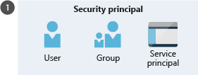
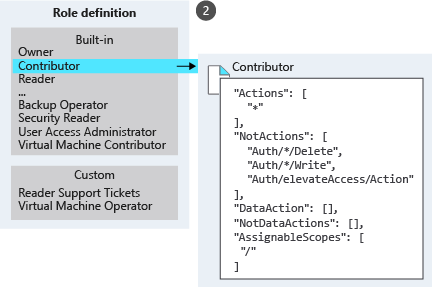
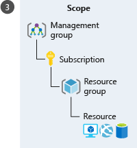

# AZ-104 — Protección de los recursos de Azure con Azure RBAC

Módulo 07 del [AZ-104T00](https://learn.microsoft.com/en-us/training/courses/az-104t00) ([ES](https://learn.microsoft.com/es-es/training/courses/az-104t00)) · Ruta 1 — Administración de identidades y gobernanza · Área: Administración de identidades y gobernanza en Azure (20–25%).

## Concepto

Uso del control de acceso basado en roles (RBAC) de Azure para administrar el acceso a los recursos: roles integrados y asignación en distintos ámbitos.

## Resumen en mis palabras

Azure RBAC es el sistema de autorización de Azure Resource Manager para controlar quién puede administrar recursos, qué acciones puede realizar y en qué ámbito.

Una asignación de roles combina tres elementos:

- **Quién:** una entidad de seguridad, como un usuario, grupo o aplicación.

- **Qué:** una definición de rol con sus permisos.

- **Dónde:** un ámbito: grupo de administración, suscripción, grupo de recursos o recurso.

Los permisos asignados en un ámbito superior se heredan en sus ámbitos secundarios. Por ejemplo, un rol asignado a una suscripción se aplica también a sus grupos de recursos y recursos. Las suscripciones están asociadas a un único directorio de Microsoft Entra.

Roles integrados habituales:

- **Propietario:** acceso total y capacidad para delegar acceso.

- **Colaborador:** administra recursos, pero no concede acceso a otros.

- **Lector:** puede ver los recursos.

- **Administrador de acceso de usuario:** administra el acceso de usuarios.

Los permisos de varias asignaciones se combinan: si una otorga lectura y otra escritura, se obtienen ambas. `NotActions` excluye ciertas operaciones de un rol, pero no funciona como una denegación explícita frente a permisos obtenidos mediante otras asignaciones.

## Por qué importa para el examen.

> - Administración de roles de Azure integrados
> - Asignación de roles en distintos ámbitos (MG → suscripción → RG → recurso)
> - Interpretación de las asignaciones de acceso (quién hace qué sobre qué y desde dónde)

## Enlaces relacionados

**Módulo de Learn**: [Protección de los recursos de Azure con el control de acceso basado en roles de Azure (Azure RBAC)](https://learn.microsoft.com/en-us/training/modules/secure-azure-resources-with-rbac/) ([ES](https://learn.microsoft.com/es-es/training/modules/secure-azure-resources-with-rbac/))

**Savill**: buscar "RBAC" en la [playlist AZ-104](https://www.youtube.com/playlist?list=PLlVtbbG169nGlGPWs9xaLKT1KfwqREHbs) · repaso final con el [Study Cram v2](https://www.youtube.com/watch?v=0Knf9nub4-k)

**Páginas de `knowledge/`**: [[Azure RBAC]] · [[Managed Identities]] · [[Identidad, acceso y seguridad en Azure (AZ-900)]]

**Laboratorio**: Lab 02a (suscripciones y RBAC) de [MicrosoftLearning/AZ-104](https://github.com/MicrosoftLearning/AZ-104-MicrosoftAzureAdministrator) — ver [labs/AZ-104](../labs/AZ-104/README.md)

## Relacionado

- [Índice AZ-104](../certifications/AZ-104/INDEX.md)
- [[Azure RBAC]]
- [[Entra ID]]
# ¿Qué es Azure RBAC?.

**RBAC = Role-Based Access Control**

En lo que respecta a la identidad y al acceso, la mayoría de las organizaciones que están pensando en usar la nube pública se preocupan de dos cosas:

1. Garantizar que cuando los usuarios dejan la organización, pierden el acceso a los recursos en la nube.
2. Alcanzar el equilibrio adecuado entre la autonomía y la gobernanza central. Por ejemplo, proporcionar a los equipos de proyecto la capacidad de crear y administrar máquinas virtuales en la nube, al tiempo que controla centralmente las redes que usan esas máquinas virtuales para comunicarse con otros recursos.

Microsoft Entra ID y Azure RBAC funcionan conjuntamente para facilitar la realización de estos objetivos.

## Suscripciones de Azure

En primer lugar, recuerde que cada suscripción de Azure está asociada a un único directorio de Microsoft Entra. Los usuarios, grupos y aplicaciones de ese directorio pueden administrar los recursos de la suscripción de Azure. Las suscripciones usan Microsoft Entra ID para el inicio de sesión único (SSO) y la administración de acceso. Puede ampliar Active Directory local a la nube mediante **Microsoft Entra Connect**. Esta característica permite a los empleados administrar sus suscripciones de Azure mediante el uso de sus identidades de trabajo existentes. Cuando deshabilita una cuenta de Active Directory local, pierde automáticamente el acceso a todas las suscripciones de Azure conectadas con Microsoft Entra ID.

## ¿Qué es Azure RBAC?

Azure RBAC es un sistema de autorización basado en Azure Resource Manager que proporciona administración de acceso específica para los recursos de Azure. Con Azure RBAC, puede conceder el acceso que los usuarios necesitan para realizar sus trabajos. Por ejemplo, puede usar Azure RBAC para permitir que un empleado administre máquinas virtuales en una suscripción, mientras que otro administra las bases de datos SQL dentro de la misma suscripción.

Puede conceder acceso al asignar el rol de Azure adecuado a usuarios, grupos y aplicaciones de un determinado ámbito. El ámbito de una asignación de roles puede ser un grupo de administración, una suscripción, un grupo de recursos o un único recurso. Un rol asignado en un ámbito principal también concede acceso a los ámbitos secundarios dentro del mismo. Por ejemplo, un usuario con acceso a un grupo de recursos puede administrar todos los recursos que contiene, como sitios web, máquinas virtuales y subredes. El rol de Azure que se asigna determina qué recursos puede administrar el usuario, el grupo o la aplicación dentro de ese ámbito.

En el diagrama siguiente se muestra cómo los roles de administrador de suscripciones clásicas, los roles de Azure y los roles de Microsoft Entra están relacionados con un nivel alto. Los ámbitos secundarios, como las instancias de servicio, heredan los roles asignados en un ámbito superior, como una suscripción completa.

![[2-azuread-and-azure-roles.png]]

En el diagrama anterior, una suscripción solo está asociada a un inquilino de Microsoft Entra. Tenga en cuenta también que un grupo de recursos puede tener varios recursos, pero está asociado a una única suscripción. Aunque no es fácil deducirlo a partir del diagrama, un recurso se puede enlazar a un solo grupo de recursos.

## ¿Qué puedo hacer con RBAC de Azure?

Azure RBAC le permite conceder acceso a los recursos de Azure que controla. Suponga que necesita administrar el acceso a los recursos en Azure para los equipos de desarrollo, ingeniería y marketing. Ha empezado a recibir solicitudes de acceso y necesita saber rápidamente cómo funciona la administración de acceso para los recursos en Azure.

Estos son algunos de los escenarios que puede implementar con RBAC de Azure:

- Permitir que un usuario administre las máquinas virtuales de una suscripción y que otro usuario administre las redes virtuales.

- Permitir que un grupo de administradores de bases de datos administre bases de datos SQL en una suscripción.

- Permitir que un usuario administre todos los recursos de un grupo de recursos, como las máquinas virtuales, los sitios web y las subredes.

- Permitir que una aplicación acceda a todos los recursos de un grupo de recursos.

## Azure RBAC en Azure Portal

En varias áreas de Azure Portal, verá un panel denominado **Control de acceso (IAM)**, también conocido como _administración de identidad y acceso_. En este panel puede ver quién tiene acceso a dicha área y su rol. Con este mismo panel, puede conceder o quitar el acceso.

A continuación se muestra un ejemplo del panel Control de acceso (IAM) para un grupo de recursos. En este ejemplo, Alain tiene asignado el rol Operador de copias de seguridad en este grupo de recursos.

![[2-resource-group-access-control.png]]

## ¿Cómo funciona Azure RBAC?

Puede controlar el acceso a los recursos mediante Azure RBAC mediante la creación de asignaciones de roles, que controlan cómo se aplican los permisos. Para crear una asignación de roles, se necesitan tres elementos: una entidad de seguridad, una definición de roles y un ámbito. Puede pensar en estos elementos como _quién_, _qué_ y _dónde_.

### 1. Entidad de seguridad (quién)

Una _entidad de seguridad_ es simplemente un nombre extravagante para un usuario, un grupo o una aplicación a los que quiere conceder acceso.

### 2. Definición de rol (qué)

Una _definición de roles_ es una recopilación de permisos. A veces, se denomina simplemente rol. Una definición de roles enumera los permisos que el rol puede realizar, como lectura, escritura y eliminación. Los roles pueden ser generales, como Propietario, o bien específicos, como Colaborador de máquina virtual.

Azure incluye varios roles integrados que puede usar. Aquí se enumeran cuatros roles integrados fundamentales:

- **Propietario**: tiene acceso total a todos los recursos, incluido el derecho a delegar el acceso a otros usuarios.

- **Colaborador**: puede crear y administrar todos los tipos de recursos de Azure, pero no puede conceder acceso a otros usuarios.

- **Lector**: puede ver los recursos de Azure existentes.

- **Administrador de acceso de usuario**: permite administrar el acceso de los usuarios a los recursos de Azure.

Si los roles integrados no cumplen las necesidades específicas de su organización, puede crear sus propios roles personalizados.
### 3. Ámbito (dónde)

_Ámbito_ es el nivel al que se aplica el acceso. Esto resulta útil si desea convertir a alguien en colaborador del sitio web, pero solo para un grupo de recursos.

En Azure, puede especificar un ámbito en varios niveles: grupo de administración, suscripción, grupo de recursos o recurso. Los ámbitos se estructuran en una relación de elementos primarios y secundarios. Si otorga acceso a un ámbito primario, los ámbitos secundarios heredan automáticamente esos permisos. Por ejemplo, si a un grupo se le asigna el rol Colaborador en el ámbito de la suscripción, heredará el rol de todos los grupos de recursos y recursos de la suscripción.

### Asignación de roles

Cuando haya determinado el quién, qué y dónde, puede combinar estos elementos para conceder acceso. Una _asignación de roles_ es el proceso de enlazar un rol a una entidad de servicio en un ámbito determinado con el fin de conceder acceso. Para conceder acceso, creará una asignación de roles. Para revocar el acceso, quitará una asignación de roles,

En el ejemplo siguiente se muestra cómo al grupo de marketing se le asignó el rol Colaborador en el ámbito del grupo de recursos de ventas.

![[2-rbac-overview.png]]

## Azure RBAC es un modelo de permiso

Azure RBAC es un modelo de _permiso_. Esto significa que, cuando se le asigna un rol, Azure RBAC permite realizar determinadas acciones, como lectura, escritura o eliminación. Si una asignación de roles le concede permisos de lectura a un grupo de recursos y otra asignación de roles le concede permisos de escritura en el mismo grupo de recursos, tendrá permisos de lectura y escritura en ese grupo de recursos.

Azure RBAC dispone de lo que se conoce como permisos `NotActions`. Puede usar `NotActions` para crear un conjunto de permisos no permitidos. El acceso que concede un rol (los _permisos efectivos_) se calcula restando las operaciones `NotActions` de las operaciones `Actions`. Por ejemplo, el rol [Colaborador](https://learn.microsoft.com/es-es/azure/role-based-access-control/built-in-roles#contributor) tiene tanto `Actions` como `NotActions`. El carácter comodín (*) de `Actions` indica que puede realizar todas las operaciones en el plano de control. A continuación, reste las siguientes operaciones en `NotActions` para calcular los permisos efectivos:

- Eliminación de roles y asignaciones de roles

- Creación de roles y asignaciones de roles

- Concesión al autor de llamada de acceso de administrador al acceso de usuarios en el ámbito de inquilinos

- Creación o actualización de los artefactos de plano técnico

- Eliminación de los artefactos de plano técnico.

# Ejercicios.

[Enumera el acceso utilizando Azure RBAC y el Azure portal](https://learn.microsoft.com/es-es/training/modules/secure-azure-resources-with-rbac/4-list-access)

[Concesión de acceso mediante Azure RBAC y Azure Portal](https://learn.microsoft.com/es-es/training/modules/secure-azure-resources-with-rbac/5-grant-access)

[Visualización de los registros de actividad de cambios de Azure RBAC](https://learn.microsoft.com/es-es/training/modules/secure-azure-resources-with-rbac/6-view-activity-logs)

Soluciones:

[[Role]]