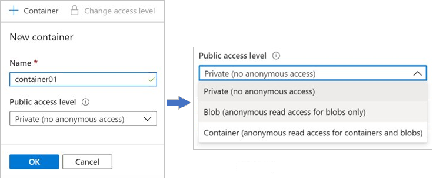
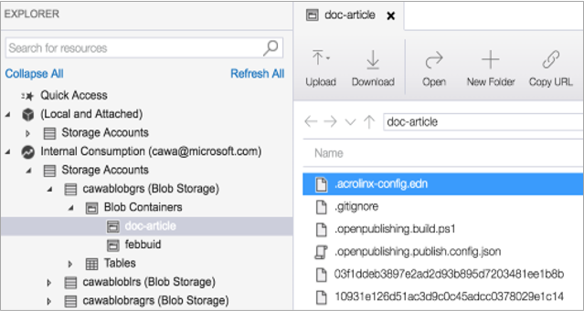

# AZ-104 — Configuración de Azure Blob Storage

Módulo 10 del [AZ-104T00](https://learn.microsoft.com/en-us/training/courses/az-104t00) ([ES](https://learn.microsoft.com/es-es/training/courses/az-104t00)) · Ruta 2 — Implementación y administración del almacenamiento · Área: Implementación y administración del almacenamiento (15–20%).

## Concepto

Configuración de Azure Blob Storage, incluidos los niveles de acceso (tiers) y la replicación de objetos.

## Resumen en mis palabras

> *(pendiente — rellenar al estudiar el módulo)*

## Por qué importa para el examen

> - Creación y configuración de un contenedor en Azure Blob Storage
> - Configuración de las capas de almacenamiento (hot/cool/cold/archive)
> - Configuración de la eliminación suave para blobs y contenedores
> - Configuración de la administración del ciclo de vida de los blobs
> - Configuración del control de versiones de blobs

## Enlaces relacionados

**Módulo de Learn**: [Configuración de Azure Blob Storage](https://learn.microsoft.com/en-us/training/modules/configure-blob-storage/) ([ES](https://learn.microsoft.com/es-es/training/modules/configure-blob-storage/))

**Savill**: buscar "blob" en la [playlist AZ-104](https://www.youtube.com/playlist?list=PLlVtbbG169nGlGPWs9xaLKT1KfwqREHbs) · repaso final con el [Study Cram v2](https://www.youtube.com/watch?v=0Knf9nub4-k)

**Páginas de `knowledge/`**: [[Servicios de almacenamiento de Azure (AZ-900)]]

**Laboratorio**: Lab 07 (Manage Azure Storage) de [MicrosoftLearning/AZ-104](https://github.com/MicrosoftLearning/AZ-104-MicrosoftAzureAdministrator) — ver [labs/AZ-104](../labs/AZ-104/README.md)

## Relacionado

- [Índice AZ-104](../certifications/AZ-104/INDEX.md)
- [[Servicios de almacenamiento de Azure (AZ-900)]]
# Implementación de Azure Blob Storage.

[Azure Blob Storage](https://learn.microsoft.com/es-es/azure/storage/blobs/storage-blobs-overview) es un servicio que almacena datos no estructurados en la nube como objetos o blobs. El término blob es el acrónimo en inglés de "objeto binario grande". Blob Storage también se conoce como _almacenamiento de objetos_ o _almacenamiento de contenedores_.

### Aspectos que debe saber sobre Azure Blob Storage

Vamos a examinar algunas características de configuración de Blob Storage.

![[blob-storage-94fb52b8.png]]

- Blob Storage puede almacenar cualquier tipo de datos de texto o binarios. Entre los ejemplos, se incluyen documentos de texto, imágenes, archivos de vídeo e instaladores de aplicaciones.
    
- Blob Storage usa tres recursos para almacenar y administrar los datos:    
    - Una cuenta de almacenamiento de Azure
    - Contenedores en una cuenta de almacenamiento de Azure
    - Blobs en un contenedor
- Para implementar Blob Storage, se configuran varias opciones:    
    - Opciones del contenedor de blobs.
    - Tipos de blobs y opciones de carga.
    - Niveles de acceso de Blob Storage.
    - Reglas del ciclo de vida de los blobs.
    - Opciones de replicación de objetos de blob.

### Aspectos que se deben tener en cuenta al implementar Azure Blob Storage

Hay muchos usos comunes para Blob Storage. Considere estos escenarios y piense en sus propias necesidades de datos:

- **Considere las subidas a través del navegador**. Use Blob Storage para proporcionar imágenes o documentos directamente a un explorador.
    
- **Considere la posibilidad de tener acceso distribuido**. Blob Storage puede almacenar archivos para acceso distribuido, como durante un proceso de instalación.
    
- **Considere la posibilidad de transmitir datos**. Transmita vídeo y audio mediante Blob Storage.
    
- **Considere la posibilidad de archivar y recuperar**. Blob Storage es una solución excelente para almacenar datos para copias de seguridad y restauración, recuperación ante desastres y archivado.
    
- **Considere la posibilidad de acceder a la aplicación**. Puede almacenar datos en Blob Storage para su análisis mediante un servicio local u hospedado en Azure.

# Creación de contenedores de blobs

Azure Blob Storage usa un recurso de contenedor para agrupar un conjunto de blobs. Un blob no puede existir solo en Blob Storage. Un blob se debe almacenar en un recurso de contenedor.

### Aspectos que debe saber sobre contenedores y blobs

Echemos un vistazo a las características de configuración de contenedores y blobs.

- Todos los blobs deben estar en un contenedor.
- Los contenedores organizan el almacenamiento de blobs.
- Un contenedor puede almacenar un número ilimitado de blobs.
- Una cuenta de almacenamiento de Azure puede contener una cantidad ilimitada de contenedores.
- Debe crear un contenedor de almacenamiento para poder empezar a cargar datos.

### Configuración de un contenedor

En Azure Portal, configurará las opciones para crear un contenedor para una cuenta de Azure Storage. Cuando revise estos detalles, tenga en cuenta cómo puede organizar los contenedores en la cuenta de almacenamiento.

- **Nombre**: escriba un nombre para el contenedor. El nombre debe ser único en la cuenta de almacenamiento de Azure.    
    - El nombre solo puede contener letras minúsculas, números y guiones.
    - El nombre debe empezar con una letra o un número.
    - El nombre no puede tener menos de tres caracteres.
    - El nombre no puede tener más de 63 caracteres.
- **Nivel de acceso público**: el nivel de acceso especifica si se puede acceder al contenedor y a sus blobs públicamente. De manera predeterminada, los datos de contenedor son privados y solo el propietario de la cuenta los puede ver. Hay tres opciones de nivel de acceso:    
    - **Privado**: (valor predeterminado) Prohíbe el acceso anónimo al contenedor y a los blobs.
    - **Blob**: permite el acceso anónimo público de lectura solo para los blobs.
    - **Contenedor**: permite el acceso anónimo público de lectura y escritura a todo el contenedor, incluidos los blobs.

> [!NOTE] Importante> 
> Los niveles de acceso de blob y contenedor no tienen ningún efecto a menos que la configuración **Permitir acceso anónimo de blobs** de la cuenta de almacenamiento esté habilitada. Cuando se deshabilita, todos los contenedores permanecen privados independientemente de su configuración de nivel de acceso individual. Microsoft recomienda mantener el acceso anónimo deshabilitado en el nivel de cuenta a menos que sirva escenarios de contenido público.

# Asignación de niveles de acceso de blob.

### Aspectos que debe saber sobre los niveles de acceso de blobs

Vamos a examinar las características de los niveles de acceso de blobs.

#### Nivel de acceso frecuente

El nivel de acceso frecuente está optimizado para lecturas y escrituras frecuentes de objetos en la cuenta de almacenamiento de Azure. Un buen caso de uso son los datos que se están procesando activamente. El nivel de acceso frecuente tiene los costos de almacenamiento más altos, pero los costos de acceso más bajos.

#### Nivel de acceso esporádico

El nivel de acceso esporádico está optimizado para almacenar grandes cantidades de datos a los que se accede con poca frecuencia. Este nivel está diseñado para datos que permanecen en el nivel de acceso **esporádico durante al menos 30 días**. Un caso de uso para el nivel de acceso esporádico son los conjuntos de datos de copia de seguridad y recuperación ante desastres a corto plazo y los contenidos multimedia antiguos. Este contenido no se debe ver con frecuencia, pero debe estar disponible inmediatamente. El almacenamiento de datos en el nivel de acceso esporádico es más rentable. El nivel de acceso esporádico tiene menores costes de almacenamiento y mayores costes de acceso en comparación con el nivel de acceso frecuente.

#### Nivel de acceso frío

El nivel de acceso en frío también está optimizado para almacenar grandes cantidades de datos que se usan con poca frecuencia. Este nivel está pensado para los datos que pueden permanecer en el **nivel durante al menos 90 días**. El nivel de acceso frío tiene menores costes de almacenamiento y mayores costes de acceso en comparación con el nivel de acceso esporádico.

#### Nivel de acceso de archivo

El nivel de acceso de archivo es un nivel sin conexión que está optimizado para los datos que pueden tolerar varias horas de latencia de recuperación. Los datos deben permanecer en el nivel de archivo **durante al menos 180 días o estar sujetos a un cargo por eliminación temprana**. Los datos del nivel de archivo incluyen copias de seguridad secundarias, datos sin procesar originales e información de cumplimiento requerida legalmente. Este nivel es la opción más rentable para almacenar datos. El acceso a datos es más costoso en el nivel de archivo que el acceso a datos en los demás niveles.

Para acceder al contenido del blob, puede rehidratarlo al nivel de acceso frecuente, esporádico o inactivo mediante dos métodos: **Copiar blob** (recomendado: crea un nuevo blob en un nivel en línea) o **Establecer nivel del blob** (cambia el nivel en contexto). Ambos métodos admiten la prioridad estándar (hasta 15 horas) o alta prioridad (en un plazo de 1 hora para los objetos menores de 10 GB, a un costo mayor). Use alta prioridad para la recuperación urgente de datos en escenarios de recuperación ante desastres.

### Comparación de los niveles de acceso

Las opciones de acceso para Azure Blob Storage ofrecen una variedad de características y niveles de soporte para ayudarlo a optimizar los costos de almacenamiento. A medida que compare las características y el soporte, piense en qué opciones de acceso pueden satisfacer mejor las necesidades de la aplicación.

| Comparación                                | Nivel de acceso frecuente | Nivel de acceso esporádico | Nivel de acceso frío | Nivel de acceso de archivo |
| ------------------------------------------ | ------------------------- | -------------------------- | -------------------- | -------------------------- |
| **Disponibilidad**                         | 99,9 %                    | 99 %                       | 99 %                 | 99 %                       |
| **Disponibilidad (lecturas de RA-GRS)**    | 99,99 %                   | 99,9 %                     | 99,9 %               | 99,9 %                     |
| **Latencia (tiempo hasta el primer byte)** | milisegundos              | milisegundos               | milisegundos         | horas                      |
| **Duración mínima del almacenamiento**     | N/D                       | 30 días                    | 90 días              | 180 días                   |
# Adición de reglas de administración del ciclo de vida de los blobs.

Cada conjunto de datos tiene un ciclo de vida único. Al principio del ciclo de vida, los usuarios tienden a acceder a algunos de los datos del conjunto, pero no a todos. A medida que el conjunto de datos envejece, el acceso a todos los datos del conjunto se tiende a reducir considerablemente. Algunos conjuntos de datos permanecen inactivos en la nube y rara vez se accede a ellos. Algunos datos expiran en unos días o meses después de la creación. Otros datos se leen y modifican activamente a lo largo de la vigencia del conjunto de datos.

Azure Blob Storage admite la [administración del ciclo](https://learn.microsoft.com/es-es/azure/storage/blobs/lifecycle-management-policy-configure) de vida para conjuntos de datos. Ofrece una directiva completa basada en reglas para cuentas GPv2 (**GPv2 ->General Purpose v2** es el tipo de cuenta de almacenamiento **recomendado por Microsoft** para la mayoría de los escenarios.) y cuentas de blobs de bloques Premium. También se admiten cuentas de Blob Storage heredadas, pero se recomienda GPv2 para nuevas implementaciones. Puede usar reglas de directivas de ciclo de vida para realizar la transición de los datos a los niveles de acceso adecuados y establecer los tiempos de expiración para el final del ciclo de vida de un conjunto de datos.

### Aspectos que debe saber sobre la administración del ciclo de vida

Puede usar las reglas de directivas de administración del ciclo de vida de Azure Blob Storage para realizar varias tareas.

- Realice la transición de blobs a un nivel de almacenamiento más esporádico (frecuente a esporádico, frecuente a inactivo, frecuente a archivo, esporádico a inactivo, esporádico a archivo, inactivo a archivo) para optimizar el rendimiento y el coste.

- Eliminar las versiones actuales de un blob, las versiones anteriores de un blob o las instantáneas de blob al final de su ciclo de vida.

- Realice la transición automática de blobs del nivel Inactivo al nivel Frecuente cuando se acceda a ellos. Esta configuración se optimiza para patrones de acceso imprevisibles sin cargos de eliminación anticipada.

- Aplique reglas a toda una cuenta de almacenamiento, a contenedores seleccionados o a un subconjunto de blobs utilizando prefijos de nombres o etiquetas de índice de blobs como filtros.

#### Escenario empresarial

Piense en un escenario en el que se accede frecuentemente a los datos en las primeras fases del ciclo de vida, pero solo de manera ocasional al cabo de dos semanas. Transcurrido el primer mes, rara vez se accede al conjunto de datos. En este escenario, el nivel de acceso frecuente de Blob Storage es el mejor durante las primeras fases. El almacenamiento de nivel frío es más adecuado para un acceso ocasional. El almacenamiento en capa de archivo es la mejor opción después de que los datos superen un mes. Para conseguir esta transición, las reglas de directivas de administración del ciclo de vida se encuentran disponibles para mover los datos antiguos a niveles de almacenamiento de acceso más esporádico.

### Configuración de reglas de directivas de administración del ciclo de vida

En Azure Portal, creará reglas de directivas de administración del ciclo de vida para la cuenta de almacenamiento de Azure mediante la especificación de varios valores de configuración. Para cada regla, se crean condiciones de bloque **If - Then** para realizar la transición de datos o hacer que expiren en función de las especificaciones. Cuando revise estos detalles, tenga en cuenta cómo puede configurar reglas de directivas de administración del ciclo de vida para los conjuntos de datos.
![[blob-lifecycle-2854d812.png]]

- **If**: la cláusula **If** establece la cláusula de evaluación para la regla de directivas. Cuando la cláusula **If** se evalúa en true, se ejecuta la cláusula **Then**. Utilice la cláusula **If** para establecer el período que se va a aplicar a los datos de blob. La característica de administración del ciclo de vida comprueba si se accede a los datos o se modifican en función de la hora especificada.
    
    - **Más de (días atrás)**: el número de días que se van a utilizar en la condición de evaluación.
- **Then**: la cláusula **Then** establece la cláusula de acción para la regla de directivas. Cuando la cláusula **If** se evalúa en true, se ejecuta la cláusula **Then**. Utilice la cláusula **Then** para establecer la acción de transición para los datos de blob. La característica de administración del ciclo de vida realiza la transición de los datos en función de la configuración.
    
    - **Mover al almacenamiento de acceso esporádico**: se hace la transición de los datos de blob al almacenamiento de nivel de acceso esporádico.
    - **Mover al almacenamiento de acceso inactivo**: se hace la transición de los datos de blob al almacenamiento de nivel de acceso inactivo.
    - **Mover al almacenamiento de archivo**: se hace la transición de los datos de blob al almacenamiento de nivel de acceso de archivo.
    - **Eliminar el blob**: se elimina el dato del blob.

Al diseñar reglas de directivas para ajustar los niveles de almacenamiento en relación con la antigüedad de los datos, puede designar las opciones de almacenamiento menos costosas para satisfacer sus necesidades.

> [!NOTE] Tip
> Amplíe sus conocimientos en [el módulo de administración del ciclo de vida del almacenamiento de blobs de Azure](https://learn.microsoft.com/es-es/training/modules/manage-azure-blob-storage-lifecycle/).

# Determinar la replicación de objetos blob.

La [replicación de objetos](https://learn.microsoft.com/es-es/azure/storage/blobs/object-replication-overview) copia blobs de datos dentro de un contenedor de manera asincrónica según las directivas que configure.

![[blob-object-replication-21fd3c07.png]]

La replicación incluye el contenido del blob, las propiedades de metadatos y las versiones. En la ilustración siguiente, se muestra un ejemplo de la replicación asincrónica de contenedores de blobs entre regiones.
### Aspectos que debe saber sobre la replicación de objetos de blob

Son varias las consideraciones que se deben tener en cuenta al planear la configuración de la replicación de objetos de blob.

- La replicación de objetos requiere que el [control de versiones de blobs](https://learn.microsoft.com/es-es/azure/storage/blobs/versioning-overview) esté habilitado en las cuentas de origen y destino. Cuando el versionado de blobs está activado, se puede acceder a versiones anteriores de un blob. Este acceso le permite recuperar los datos modificados o eliminados.

- La replicación de objetos no admite instantáneas de blobs. Las instantáneas de un blob de la cuenta de origen no se replican en la cuenta de destino.

- La replicación de objetos se admite cuando las cuentas de origen y de destino se encuentran en el nivel Caliente, Frío o Helado. Las cuentas de origen y destino pueden estar en niveles diferentes.

- Al configurar la replicación de objetos, se crea una directiva de replicación que especifica la cuenta de almacenamiento de Azure de origen y la cuenta de almacenamiento de destino.

- Una directiva de replicación incluye una o varias reglas que especifican un contenedor de origen y un contenedor de destino. La directiva identifica los blobs del contenedor de origen que se van a replicar.

### Aspectos que se deben tener en cuenta al configurar la replicación de objetos de blob

Utilizar la replicación de objetos de blob presenta varias ventajas. Considere los escenarios siguientes y piense en cómo la replicación puede formar parte de la estrategia de Blob Storage.

- **Considere las reducciones de latencia**. Minimice la latencia con la replicación de objetos de blob. Puede reducir la latencia de las solicitudes de lectura si permite que los clientes consuman datos de una región que esté más cerca físicamente.

- **Considere la eficiencia de las cargas de trabajo de cómputo**. Mejore la eficiencia de las cargas de trabajo computacionales mediante la replicación de objetos blob. Con la replicación de objetos, las cargas de trabajo de computación pueden procesar los mismos conjuntos de blobs en diferentes regiones.

- **Considere la distribución de los datos**. Optimice la configuración de la distribución de los datos. Puede procesar o analizar los datos en una ubicación única y replicar solo los resultados en otras regiones.

- **Tenga en cuenta las ventajas de costos**. Administre la configuración y optimice las directivas de almacenamiento. Una vez que se replican los datos, puede reducir los costos moviendo los datos al nivel de archivo usando políticas de gestión del ciclo de vida.

# Administración de blobs.

Un blob puede ser un archivo de cualquier tipo de datos y de cualquier tamaño. Azure Storage ofrece tres tipos de blobs: _block blob_, _page blob_ y _append blob_.

### Aspectos que debe saber sobre los tipos de blobs

Veamos las características de los tipos de blobs con más detalle.

- **Blobs en bloques**. Un blob en bloques consta de bloques de datos que se ensamblan para crear un blob. La mayoría de los escenarios de Blob Storage usan blobs en bloques. Los blobs de bloques son ideales para almacenar datos de texto y binarios en la nube, como archivos, imágenes y vídeos. El tipo de blob en bloques es el tipo predeterminado para un blob nuevo. Al crear un nuevo bloque de datos, si no elige un tipo específico, el nuevo bloque de datos se creará como un bloque de datos en bloques.
    
- **Blobs en anexos**. Un blob anexo es similar a un blob en bloques, porque el blob anexo también consta de bloques de datos. Los bloques de datos de un blob anexo están optimizados para las operaciones de _anexión_. Los blobs anexos son útiles en escenarios de registro en los que la cantidad de datos puede aumentar a medida que avanza la operación de registro.
    
- **Blobs de páginas**. Un blob en páginas puede tener un tamaño de hasta 8 TB. Los blobs de páginas son más eficientes para las operaciones frecuentes de lectura y escritura. Azure Virtual Machines utiliza blobs de páginas para los discos de sistema operativo y discos de datos.

> [!WARNING] BLOB
> Una vez que se crea un blob, no se puede cambiar el tipo.

### Aspectos que se deben tener en cuenta al administrar Blob Storage

Puede usar el portal para cargar y administrar blobs. Esta opción es buena para algunos archivos. Una vez que identifique los archivos que se van a cargar, elija el tipo de blob y el tamaño del bloque, además de la carpeta contenedora. También establece el nivel de acceso y el ámbito de cifrado.

![[upload-blobs-7ad73d30.png]]

Para un mayor número de archivos, es mejor usar una herramienta. Revise las opciones siguientes y considere las herramientas que podrían ajustarse a sus necesidades de configuración.

- [**Explorador de Azure Storage**](https://learn.microsoft.com/es-es/azure/storage/storage-explorer/vs-azure-tools-storage-manage-with-storage-explorer). Cargue, descargue y administre blobs, archivos, colas y tablas, así como entidades y discos administrados de Azure Data Lake Storage. También puede ver, editar y administrar recursos, obtener una vista previa de los datos y configurar los permisos de almacenamiento y los controles de acceso.

- [**AzCopy**](https://learn.microsoft.com/es-es/azure/storage/common/storage-use-azcopy-v10). Una herramienta de línea de comandos fácil de usar para Windows y Linux. Puede copiar datos hacia y desde Blob Storage, entre contenedores y entre cuentas de almacenamiento.
- [**Azure Data Box Disk**](https://learn.microsoft.com/es-es/azure/databox/data-box-disk-overview). Un servicio para transferir datos locales a Blob Storage cuando los conjuntos de datos de gran tamaño o las restricciones de red hacen que la carga de datos mediante la red no sea realista. Puede usar discos de Azure Data Box para solicitar discos de estado sólido (SSD) a Microsoft. Puede copiar los datos en esos discos y enviarlos de vuelta a Microsoft para su carga en Blob Storage.
# Determinación de los precios de Blob Storage

Comprender los patrones de acceso y ponerlos en correlación con las necesidades de durabilidad y disponibilidad le ayuda a administrar mejor los costos de Azure Blob Storage. La herramienta principal para calcular estos costos es la calculadora de precios de Azure. La herramienta de precios puede calcular las estimaciones de migración, las estimaciones mensuales y los precios futuros en función de la entrada controlada por la carga de trabajo que especifique. En general, el costo del almacenamiento de blobs en bloques depende de:

- Volumen de datos almacenados al mes.
- Cantidad y tipo de operaciones realizadas, junto con los costos de posibles transferencias de datos.
- Opción de redundancia de datos seleccionada.

Puede usar la Calculadora de precios de Azure para calcular los costos de almacenamiento.

![[blob-pricing.png]]

### Aspectos que debe conocer sobre los precios de Blob Storage

Revise estas consideraciones de facturación para una cuenta de almacenamiento de Azure y Blob Storage.

- **Niveles de rendimiento**. El nivel de acceso de Blob Storage determina la cantidad de datos almacenados y el costo de almacenarlos. A medida que el nivel de rendimiento se enfría, el costo por gigabyte disminuye.
    
- **Costos de acceso a datos**. Los gastos de acceso a los datos aumentan a medida que el nivel es más esporádico. Para los datos en los niveles de acceso esporádico, inactivo y archivo, se factura un cargo de acceso a datos por gigabyte por las acciones de lectura.
    
- **Costos de transacción**. Todos los niveles tienen un cargo por transacción. El cargo aumenta a medida que el nivel se vuelve más esporádico.
    
- **Costos de transferencias de datos de replicación geográfica**. Este cargo solo se aplica a las cuentas que tienen configurada la replicación geográfica. La transferencia de datos de replicación geográfica incurre en un cargo por gigabyte.
    
- **Costos de transferencia de datos salientes**. Las transferencias de datos salientes incurren en facturación por uso de ancho de banda por gigabyte. Esta facturación es coherente con las cuentas de almacenamiento de Azure de uso general.
    
- **Cambios en el nivel de almacenamiento**. Si cambia el nivel de almacenamiento de la cuenta de Frío a Caliente, se genera un cargo equivalente a leer todos los datos que existen en la cuenta de almacenamiento. Cambiar el nivel de almacenamiento de la cuenta de Caliente a Frío genera un cargo igual que escribir todos los datos en el nivel de almacenamiento Frío (solo para cuentas GPv2).

# Resumen y recursos

En este módulo, ha obtenido información acerca de Azure Blob Storage y cómo configurarlo. Ha descubierto que Blob Storage es la solución de almacenamiento de objetos de Microsoft para la nube. Ha aprendido que Azure Blob Storage está optimizado para almacenar grandes cantidades de datos no estructurados, como texto o archivos binarios. Ha explorado las características de Blob Storage y sus casos de uso. También ha aprendido a configurar Blob Storage, incluida la elección de los niveles de acceso adecuados para reducir el costo y mejorar el rendimiento. Además, ha aprendido a crear una estrategia de administración del ciclo de vida y a configurar la replicación de objetos para la conmutación por error.

**Las principales conclusiones de este módulo son:**

- Azure Blob Storage es una solución eficaz para almacenar datos no estructurados en la nube, como documentos de texto, imágenes y vídeos.
- Blob Storage ofrece diferentes niveles de acceso (frecuente, esporádico y de archivo) para optimizar el rendimiento y el costo en función de los patrones de uso de los datos.
- Puede configurar directivas de administración del ciclo de vida para realizar la transición automática de datos entre los niveles de acceso y establecer los tiempos de expiración de los datos.
- La replicación de objetos permite copiar blobs de forma asincrónica entre contenedores de diferentes regiones, lo que proporciona redundancia y reduce la latencia de las solicitudes de lectura.

## Más información con Copilot

Copilot puede ayudarle a configurar soluciones de infraestructura de Azure. Copilot puede comparar, recomendar, explicar e investigar productos y servicios en los que necesita más información. Abra un explorador de Microsoft Edge y elija Copilot (arriba a la derecha) o vaya a copilot.microsoft.com. Dedique unos minutos a probar estos mensajes y ampliar el aprendizaje con Copilot.

- ¿Qué son las tareas de administración comunes asociadas a Azure Blob Storage?
    
- ¿Cómo tiene el precio de Azure Blob Storage?
    

## Más información con la documentación de Azure

- [Documentación de Azure Blob Storage](https://learn.microsoft.com/es-es/azure/storage/blobs/) : la documentación oficial de Microsoft Azure proporciona información completa sobre cómo configurar y administrar Blob Storage. Encontrará guías detalladas, tutoriales y ejemplos para ayudarle a explorar distintos aspectos de la configuración de Blob Storage.
    
- [Conceptos de Azure Blob Storage](https://learn.microsoft.com/es-es/azure/storage/blobs/storage-blobs-introduction) : en este artículo se proporciona información general sobre los conceptos clave relacionados con Azure Blob Storage, incluidas las cuentas de almacenamiento, los contenedores y los blobs. En él se explica cómo crear y administrar estas entidades y se tratan varias opciones de configuración.
    
- [Seguridad de Azure Blob Storage](https://learn.microsoft.com/es-es/azure/storage/blobs/security-recommendations) : comprender los aspectos de seguridad de Blob Storage es fundamental para una configuración adecuada. En este artículo se exploran las opciones de autenticación, autorización y cifrado disponibles en Azure Blob Storage. También se tratan los procedimientos recomendados para proteger los recursos de Blob Storage.
    
- [Rendimiento y escalabilidad de Azure Blob Storage](https://learn.microsoft.com/es-es/azure/storage/blobs/scalability-targets) : en este artículo se describen las consideraciones de rendimiento al configurar Blob Storage. El módulo trata el tipo de cuenta de almacenamiento y la optimización de la transferencia de datos.
    
- [Administración del ciclo de vida de Azure Blob Storage](https://learn.microsoft.com/es-es/azure/storage/blobs/storage-lifecycle-management-concepts) : la administración del ciclo de vida de Blob Storage permite automatizar el movimiento y la eliminación de datos en función de las reglas predefinidas. En este artículo se explica cómo configurar y administrar directivas de ciclo de vida para optimizar los costos de almacenamiento y mejorar la administración de datos.
# Ejercicio: Proporcionar almacenamiento para el sitio web público.

Laboratorio: [[alamcenamiento-publico]]

