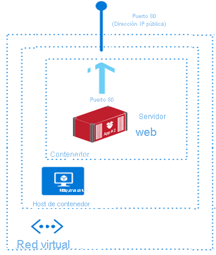
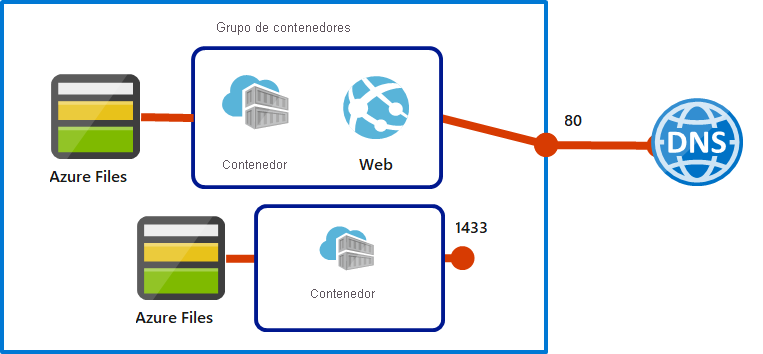

# AZ-104 — Configuración de Azure Container Instances

Módulo 17 del [AZ-104T00](https://learn.microsoft.com/en-us/training/courses/az-104t00) ([ES](https://learn.microsoft.com/es-es/training/courses/az-104t00)) · Ruta 3 — Implementación y administración de recursos de procesos de Azure · Área: Implementación y administración de recursos de procesos de Azure (20–25%).

## Concepto

Configurar instancias de Azure Container Instances (ACI), incluidos los grupos de contenedores.

## Resumen en mis palabras

> *(pendiente — rellenar al estudiar el módulo)*

## Por qué importa para el examen

> - Aprovisionamiento de un contenedor con Azure Container Instances
> - Administración del ajuste de tamaño y el escalado de contenedores

> **Gap del examen**: la ruta no tiene módulos propios para **Azure Container Registry** (crear/administrar, geo-replicación, tareas) ni **Azure Container Apps** (aprovisionar, escalado con KEDA) — ambos son objetivos explícitos del examen. Cubrir con [docs de ACR](https://learn.microsoft.com/en-us/azure/container-registry/) ([ES](https://learn.microsoft.com/es-es/azure/container-registry/)) y [docs de Container Apps](https://learn.microsoft.com/en-us/azure/container-apps/) ([ES](https://learn.microsoft.com/es-es/azure/container-apps/)).

## Enlaces relacionados

**Módulo de Learn**: [Configuración de Azure Container Instances](https://learn.microsoft.com/en-us/training/modules/configure-azure-container-instances/) ([ES](https://learn.microsoft.com/es-es/training/modules/configure-azure-container-instances/))

**Savill**: buscar "container" / "ACR" en la [playlist AZ-104](https://www.youtube.com/playlist?list=PLlVtbbG169nGlGPWs9xaLKT1KfwqREHbs) · repaso final con el [Study Cram v2](https://www.youtube.com/watch?v=0Knf9nub4-k)

**Páginas de `knowledge/`**: [[AKS]]

**Laboratorio**: Labs 09b (ACI) y 09c (Container Apps — cubre parte del gap) de [MicrosoftLearning/AZ-104](https://github.com/MicrosoftLearning/AZ-104-MicrosoftAzureAdministrator) — ver [labs/AZ-104](../labs/AZ-104/README.md)

# Introducción

Los contenedores y las máquinas virtuales son formas de virtualización, pero hay algunas diferencias clave entre ellos.

Para proporcionar contexto, consideremos un escenario: Es administrador de Azure responsable de implementar y administrar aplicaciones en un entorno en la nube. Su organización busca una solución que ofrece tiempos de inicio rápidos, administración sencilla y la capacidad de ejecutar aplicaciones en contenedores aislados. Quiere comprender las ventajas de usar Azure Container Instances y cómo se compara con las máquinas virtuales.

En este módulo, aprenderá a usar Azure Container Instances en lugar de máquinas virtuales. También obtendrá información general sobre las características y los casos de uso.

El objetivo de este módulo es presentar los Azure Container Instances preparados para IA.

## Objetivos de aprendizaje

En este módulo aprenderá a:

- Identificar cuándo debe usar contenedores y cuándo máquinas virtuales.
- Reconocer las características y los casos de uso de Azure Container Instances.
- Implementar grupos de contenedores de Azure.

# Comparación de las máquinas virtuales con los contenedores.

La virtualización de hardware permite ejecutar varias instancias aisladas de sistemas operativos simultáneamente en el mismo hardware físico. Los contenedores representan la siguiente fase de la virtualización de los recursos informáticos.

La virtualización basada en contenedores le permite virtualizar el sistema operativo. Este enfoque permite ejecutar varias aplicaciones en la misma instancia de un sistema operativo y seguir manteniendo el aislamiento entre las aplicaciones. Los contenedores en una máquina virtual proporcionan una funcionalidad similar a la de las máquinas virtuales en un servidor físico.

### Aspectos que deben conocerse sobre los contenedores frente a las máquinas virtuales

Para comprender mejor la virtualización basada en contenedores, vamos a [comparar contenedores y máquinas virtuales](https://learn.microsoft.com/es-es/virtualization/windowscontainers/about/containers-vs-vm).

> [!TIP] Concepto
> [Contenedores frente a máquinas virtuales](../concepts/containers-vs-vms.md)

|Comparar|Contenedores|Máquinas virtuales|
|---|---|---|
|**Aislamiento**|Un contenedor suele proporcionar un aislamiento ligero del host y otros contenedores, pero no proporciona un límite de seguridad tan sólido como el de una máquina virtual.|Una máquina virtual proporciona un aislamiento completo del sistema operativo host y otras máquinas virtuales. Esta separación es útil cuando un límite de seguridad sólido es fundamental, como en el hospedaje de aplicaciones de empresas de la competencia en el mismo servidor o clúster.|
|**Sistema operativo**|Los contenedores ejecutan la parte del modo de usuario de un sistema operativo y se pueden personalizar para que contengan solo los servicios necesarios para la aplicación. Este enfoque ayuda a usar menos recursos del sistema.|Las máquinas virtuales ejecutan un sistema operativo completo que incluye el kernel, para lo que se necesitan más recursos del sistema (CPU, memoria y almacenamiento).|
|**Implementación**|Puede implementar contenedores individuales usando Docker desde la línea de comandos. Puede implementar varios contenedores usando un orquestador, como Azure Kubernetes Service.|Puede implementar máquinas virtuales individuales mediante Windows Admin Center o el administrador de Hyper-V. Puede implementar varias máquinas virtuales usando PowerShell o System Center Virtual Machine Manager.|
|**Almacenamiento persistente**|Los contenedores usan discos de Azure para el almacenamiento local de un único nodo, o bien Azure Files (recursos compartidos SMB) para el almacenamiento compartido por varios nodos o servidores.|Las máquinas virtuales usan un disco duro virtual (VHD) para el almacenamiento local de una sola máquina virtual, o bien un recurso compartido de archivos SMB para el almacenamiento compartido por varios servidores.|
|**Tolerancia a errores**|Si se produce un error en un nodo de clúster, el orquestador de otro nodo del clúster recrea rápidamente cualquier contenedor que se esté ejecutando en el nodo.|Las máquinas virtuales pueden conmutar por error a otro servidor de un clúster y el sistema operativo de la máquina virtual se reinicia en el nuevo servidor.|

### Aspectos que deben tenerse en cuenta cuando se usan contenedores

Los contenedores ofrecen varias ventajas respecto a las máquinas físicas y virtuales. Revise las siguientes ventajas y piense cómo puede implementar contenedores para las aplicaciones internas de su empresa.

- **Considere la flexibilidad y la velocidad**. Obtenga mayor flexibilidad y velocidad al desarrollar y compartir el código de una aplicación contenedorizada.
    
- **Considere la posibilidad de realizar pruebas**. Elija contenedores para su configuración con el fin de simplificar la realización de pruebas en sus aplicaciones.
    
- **Considere la posibilidad de implementar la aplicación**. Implemente contenedores para lograr una implementación simplificada y acelerada de sus aplicaciones.
    
- **Considere la densidad de la carga de trabajo**. Trabaje con contenedores para poder admitir una mayor densidad de la carga de trabajo y mejorar el uso de los recursos.

# Análisis de Azure Container Instances.

Los contenedores están convirtiéndose en la manera preferida de empaquetar, implementar y administrar aplicaciones en la nube. Hay muchas opciones para que los equipos compilen e implemente aplicaciones contenedorizadas y nativas de la nube en Azure. En esta unidad, se revisa Azure Container Instances (ACI).

Azure Container Instances ofrece la forma más rápida y sencilla de ejecutar un contenedor en Azure, sin tener que administrar ninguna máquina virtual y sin necesidad de adoptar un servicio de nivel superior. Azure Container Instances es una solución excelente para cualquier escenario que pueda funcionar en contenedores aislados.

### Comprender las imágenes de contenedor

Todos los contenedores se crean a partir de imágenes de contenedor. Una imagen de contenedor es un paquete de software ligero, independiente y ejecutable que encapsula todo lo necesario para ejecutar una aplicación. Incluye los siguientes componentes:

- **Código**: El código fuente de la aplicación.
- **Runtime**: El entorno necesario para ejecutar la aplicación.
- **Herramientas del sistema**: Utilidades necesarias para que la aplicación funcione.
- **Bibliotecas del sistema**: Bibliotecas compartidas usadas por la aplicación.
- **Configuración**: Parámetros de configuración específicos de la aplicación.

Al crear una imagen de contenedor, se convierte en una unidad portátil que se puede ejecutar de forma coherente en distintos entornos informáticos. Estas imágenes son los bloques de creación de contenedores, que son instancias de estas imágenes que se ejecutan en runtime.

En la siguiente ilustración se muestra un contenedor de servidor web creado con Azure Container Instances. El contenedor se ejecuta en una máquina virtual de una red virtual.

### Aspectos que hay que saber sobre Azure Container Instances

Vamos a revisar algunas de las [ventajas de usar Azure Container Instances](https://learn.microsoft.com/es-es/azure/container-instances/container-instances-overview). A medida que revise estos puntos, piense en cómo puede implementar Container Instances para sus aplicaciones internas.

- **Tiempos de inicio rápidos**. Los contenedores pueden iniciarse en segundos sin necesidad de implementar y administrar máquinas virtuales.
    
- **Conectividad con IP pública y nombres DNS**. Los contenedores se pueden exponer directamente a Internet con una dirección IP y un nombre de dominio completo (FQDN).
    
- **Tamaños personalizados**. Especifique núcleos de CPU (de 0,1 a 4 vCPU) y memoria (de 0,1 a 16 GB) para cada contenedor en el momento de la implementación. La asignación de recursos se fija durante la vigencia del grupo de contenedores.
    
- **Almacenamiento persistente**. Los contenedores admiten el montaje directo de recursos compartidos de archivos de Azure Files.
    
- **Contenedores de Linux y Windows**. Las instancias de contenedor pueden programar contenedores tanto de Windows como de Linux. Especifique el tipo de sistema operativo cuando cree los grupos de contenedores.
    
- **Grupos cosincronizados**. Container Instances admite la programación de grupos con varios contenedores que comparten recursos de máquinas host.
    
- **Implementación en red virtual**. Los grupos de contenedores de Linux se pueden implementar en una red virtual de Azure para la comunicación privada con otros recursos de Azure. Los contenedores implementados en la red virtual no reciben ninguna dirección IP pública y solo se comunican dentro de la red virtual o las redes emparejadas.

# Implementación de grupos de contenedores

El recurso de nivel superior de Azure Container Instances es el **grupo de contenedores**. Un [grupo de contenedores](https://learn.microsoft.com/es-es/azure/container-instances/container-instances-container-groups) es una colección de contenedores que se programan en la misma máquina host. Los contenedores comparten un ciclo de vida, recursos, red local y volúmenes de almacenamiento.

### Cosas que debe saber sobre los grupos de contenedores

Veamos algunos detalles sobre los grupos de contenedores para Azure Container Instances.

- Un grupo de contenedores es similar a un pod en Kubernetes. Un pod suele tener una correspondencia 1:1 con un contenedor, pero un pod puede contener varios contenedores. Los contenedores de un pod multicontenedor pueden compartir recursos relacionados.
    
- Azure Container Instances asigna recursos a un grupo multicontenedor agregando las solicitudes de recursos de todos los contenedores del grupo. Los recursos pueden incluir elementos como CPU, memoria y GPU.
    
- Hay tres maneras comunes de implementar un grupo de varios contenedores.
    
    - **Plantilla de Azure Resource Manager** Infraestructura basada en JSON como código, ideal al implementar junto con otros recursos de Azure.
        
    - **Bicep**. La infraestructura recomendada de Microsoft como lenguaje de código, más concisa que las plantillas de Azure Resource Manager. Bicep incluye compatibilidad completa con IntelliSense.
        
    - **Archivos YAML**. Formato centrado en contenedores, ideal para implementaciones que solo incluyen instancias de contenedor.
        
- Los grupos de contenedores pueden compartir una dirección IP externa, uno o varios puertos de esa dirección IP y una etiqueta DNS con un FQDN.
    
    - **Acceso de cliente externo**. Debe exponer el puerto en la dirección IP y desde el contenedor para permitir que los clientes externos accedan a un contenedor de su grupo.
        
    - **Asignación de puertos**. La asignación de puertos no es posible porque los contenedores de un grupo comparten un espacio de nombres de puerto.
        
    - **Grupos eliminados**. Cuando se elimina un grupo de contenedores, se liberan su dirección IP y su FQDN.
        

#### Ejemplo de configuración

Vea el siguiente ejemplo de un grupo multicontenedor con dos contenedores.

El grupo multicontenedor tiene las siguientes características y configuración:

- El grupo de contenedores está programado en una sola máquina host y tiene asignada una etiqueta de nombre DNS.
- El grupo de contenedores expone una única dirección IP pública con un puerto expuesto.
- Un contenedor del grupo escucha en el puerto 80. El otro contenedor escucha en el puerto 1433.
- El grupo incluye dos recursos compartidos de archivos de Azure Files como montajes de volumen. Cada contenedor del grupo monta uno de los recursos compartidos de archivos localmente.

### Aspectos que deben tenerse en cuenta cuando se usan grupos de contenedores

Los grupos multicontenedor son útiles cuando se quiere dividir una sola tarea funcional en varias imágenes de contenedor. Los distintos equipos pueden entregar las imágenes y las imágenes pueden tener requisitos de recursos independientes.

Tenga en cuenta los siguientes escenarios para trabajar con grupos multicontenedor. Piense en qué opciones pueden sustentar sus aplicaciones internas para el comerciante minorista en línea.

- **Considere las actualizaciones de las aplicaciones web**. Admita actualizaciones de las aplicaciones web implementando un grupo multicontenedor. Un contenedor del grupo sirve la aplicación web y otro contenedor extrae el contenido más reciente del control de código fuente.
    
- **Considere la recopilación de datos de registros**. Use un grupo multicontenedor para capturar datos de registros y métricas sobre la aplicación. El contenedor de la aplicación genera registros y métricas. Un contenedor de registro recopila los datos de salida y escribe los datos en el almacenamiento a largo plazo.
    
- **Considere la supervisión de las aplicaciones**. Habilite la supervisión de su aplicación con un grupo multicontenedor. Un contenedor de supervisión realiza periódicamente una solicitud al contenedor de la aplicación para asegurarse de que la aplicación se ejecuta y responde correctamente. El contenedor de supervisión genera una alerta si identifica posibles problemas con la aplicación.
    
- **Considere la funcionalidad de front-end y back-end**. Cree un grupo multicontenedor para albergar el contenedor de front-end y el de back-end. El contenedor de front-end puede servir una aplicación web. El contenedor de back-end puede ejecutar un servicio para recuperar datos.

# Revisión de Azure Container Apps

Hay muchas opciones para que los equipos compilen e implemente aplicaciones contenedorizadas y nativas de la nube en Azure. Conozca qué escenarios y casos de uso son más adecuados para Azure Container Apps y cómo se compara con otras opciones de contenedor en Azure. Escuche la vista del desarrollador de Azure Container Instances.

### Aspectos que hay que saber sobre Azure Container Apps

[Azure Container Apps](https://learn.microsoft.com/es-es/azure/container-apps/overview) es una plataforma sin servidor que permite mantener menos infraestructura y ahorrar costos al ejecutar aplicaciones en contenedores. En lugar de preocuparse por la configuración del servidor, la orquestación de contenedores y los detalles de implementación, Container Apps proporciona todos los recursos de servidor actualizados necesarios para mantener las aplicaciones estables y seguras.

Entre los usos comunes de Azure Container Apps se incluyen:

- Implementación de puntos de conexión de API
- Hospedaje de trabajos de procesamiento en segundo plano
- Control del procesamiento controlado por eventos
- Ejecución de microservicios

Las aplicaciones creadas en Azure Container Apps se pueden escalar dinámicamente en función de las siguientes características:

- Tráfico HTTP
- Procesamiento controlado por eventos
- Carga de CPU o de memoria
- Cualquier escalador compatible con KEDA

### Aspectos que hay que tener en cuenta al usar Azure Container Apps

Azure Container Apps permite crear microservicios y trabajos sin servidor basados en contenedores. Entre las características distintivas de Container Apps se incluyen:

- Optimizado para ejecutar contenedores de uso general, especialmente para aplicaciones que abarcan muchos microservicios implementados en contenedores.
- Con tecnología de Kubernetes y tecnologías de código abierto, como Dapr, KEDA y envoy.
- Admite aplicaciones y microservicios de estilo Kubernetes con características como la detección de servicios y la separación del tráfico.
- Habilita las arquitecturas de aplicaciones impulsadas por eventos al admitir la escalabilidad basada en el tráfico y la extracción de fuentes de eventos como colas, con la capacidad de escalar hasta a cero.
- Admite la ejecución de trabajos a petición, programados y controlados por eventos.

Azure Container Apps no proporciona acceso directo a las API de Kubernetes subyacentes. Si desea crear aplicaciones de estilo Kubernetes y no requiere acceso directo a todas las API nativas de Kubernetes y la administración de clústeres, Container Apps proporciona una experiencia totalmente administrada basada en los procedimientos recomendados. Por estos motivos, muchos equipos prefieren empezar a compilar microservicios de contenedor con Azure Container Apps.

#### Comparación de soluciones de administración de contenedores

Azure ofrece varias plataformas de contenedor para diferentes escenarios. Azure Container Instances (ACI) es mejor para tareas aisladas y de corta duración. Azure Container Apps (ACA) proporciona microservicios sin servidor. Azure Kubernetes Service (AKS) proporciona control completo de Kubernetes para necesidades complejas de orquestación.

| Característica      | Azure Container Apps (ACA)                                                                                                                                                                               | Azure Kubernetes Service (AKS)                                                                                                                                                                                   |
| ------------------- | -------------------------------------------------------------------------------------------------------------------------------------------------------------------------------------------------------- | ---------------------------------------------------------------------------------------------------------------------------------------------------------------------------------------------------------------- |
| Información general | ACA es una plataforma de contenedor sin servidor que simplifica la implementación y administración de aplicaciones basadas en microservicios mediante la abstracción de la infraestructura subyacente.   | AKS simplifica la implementación de un clúster de Kubernetes administrado en Azure mediante la descarga de la sobrecarga operativa en Azure. Es adecuada para aplicaciones complejas que requieren orquestación. |
| Implementación      | ACA proporciona una experiencia de PaaS con funcionalidades rápidas de implementación y administración.                                                                                                  | AKS ofrece más opciones de control y personalización para entornos de Kubernetes, lo que hace que sea adecuado para aplicaciones y microservicios complejos.                                                     |
| Administración      | ACA se basa en AKS y ofrece una experiencia PaaS simplificada para ejecutar contenedores.                                                                                                                | AKS proporciona un control más detallado sobre el entorno de Kubernetes, lo cual resulta adecuado para los equipos que ya cuentan con experiencia en Kubernetes.                                                 |
| Escalabilidad       | ACA admite el escalado automático basado en HTTP y el escalado controlado por eventos, lo que hace que sea idónea para las aplicaciones que necesitan responder rápidamente a los cambios en la demanda. | AKS ofrece escalado automático de pods horizontal y escalado automático de clústeres, lo que proporciona opciones de escalabilidad sólidas para aplicaciones contenedorizadas.                                   |
| Casos de uso:       | ACA está diseñado para microservicios y aplicaciones sin servidor que se benefician de un escalado rápido y una administración simplificada.                                                             | AKS es mejor para aplicaciones complejas y de larga duración. Estas aplicaciones requieren características completas de Kubernetes y una estrecha integración con otros servicios de Azure.                      |
### Ejercicio

[Contenedor](../labs/AZ-104/containers/Contenedor.md)

# Evaluación del módulo.

|Si la pregunta habla de...|Respuesta|
|---|---|
|Aislamiento fuerte / seguridad|Máquinas virtuales|
|Densidad y uso eficiente de recursos|Contenedores|
|Contenedor simple, rápido, sin infraestructura|Azure Container Instances|
|Orquestación y Kubernetes|AKS|
|Eventos sin servidor|Azure Functions|

1. Su empresa requiere una solución que garantice un aislamiento seguro entre las aplicaciones con fines de seguridad. ¿Qué tecnología se debe elegir?

Azure Container Instances (Instancias de Contenedores de Azure)

Azure Container Apps (Aplicaciones de Contenedores de Azure)

**Máquinas virtuales**

2. Su organización está desarrollando una nueva aplicación y quiere maximizar la densidad de carga de trabajo y el uso de recursos. ¿Qué tecnología debería considerar usar, contenedores o máquinas virtuales?

Las máquinas virtuales, ya que proporcionan aislamiento completo y requieren más recursos del sistema.

Las máquinas virtuales, ya que pueden admitir la ejecución de varias aplicaciones dentro de la misma instancia del sistema operativo.

**Los contenedores, debido a su capacidad de admitir una mayor densidad de carga de trabajo y mejorar el uso de los recursos.**

3. ¿Qué escenario se beneficiaría del uso de Azure Container Instances en otros servicios de Azure?

Una aplicación que requiere una configuración y orquestación detalladas de Kubernetes.

**Una aplicación web sencilla que necesita una implementación rápida sin administrar la infraestructura.**

Función sin servidor que se escala en función de desencadenadores de eventos.

4. El equipo debe ejecutar una aplicación en contenedor accesible a través de una dirección IP pública sin administrar la infraestructura subyacente. ¿Qué servicio de Azure debe usar?

**Azure Container Instances (Instancias de Contenedores de Azure)**

Azure Kubernetes Service

Azure Virtual Machines

5. ¿Cuál es el primer paso para implementar una aplicación en contenedor mediante Azure Container Instances?

Configure las opciones de DNS para la instancia de contenedor.

**Cree una imagen de contenedor mediante Docker.**

Seleccione el grupo de recursos para la implementación del contenedor.

6. ¿Qué componente es esencial incluir en una imagen de Docker para que se ejecute correctamente en Azure Container Instances?

**Un entorno en tiempo de ejecución para la aplicación.**

Un archivo de configuración detallado de Kubernetes.

Una plantilla de Azure Resource Manager

7. Su organización está considerando usar Azure Container Instances para implementar sus aplicaciones. ¿Cuál es una ventaja importante de usar contenedores sobre máquinas virtuales en términos de requisitos del sistema operativo?

Los contenedores usan más recursos del sistema que las máquinas virtuales porque ejecutan varias aplicaciones dentro de la misma instancia de un sistema operativo.

Los contenedores requieren una instalación completa del sistema operativo, similar a las máquinas virtuales.

**Los contenedores ejecutan la parte del modo de usuario de un sistema operativo, que usa menos recursos del sistema.**

8. ¿Cuál de las siguientes características se cumple con respecto a las funcionalidades de aislamiento de los contenedores en comparación con las máquinas virtuales?

**Los contenedores proporcionan aislamiento ligero, pero las máquinas virtuales ofrecen límites de seguridad más sólidos.**

Las máquinas virtuales proporcionan aislamiento ligero similar a los contenedores.

Los contenedores ofrecen el mismo nivel de aislamiento que las máquinas virtuales.

9. ¿Cuál de las siguientes es una característica única de Azure Container Instances en comparación con otros servicios de Azure?

**Tiempos de inicio rápidos sin administrar máquinas virtuales**

Proporciona acceso directo a las API de Kubernetes.

Requiere la adopción de un servicio de nivel superior para la implementación

# Resumen y recursos
En este módulo, ha aprendido a identificar cuándo usar instancias de Azure Container Instances en lugar de máquinas virtuales de Azure. Ha explorado las características y los casos de uso de Azure Container Instances. Ha descubierto cómo implementar grupos de contenedores de Azure.

Las principales conclusiones de este módulo son:

- Los contenedores proporcionan aislamiento ligero y usan menos recursos del sistema en comparación con las máquinas virtuales.
- Los contenedores se pueden implementar individualmente mediante Docker o con un orquestador como Azure Container Apps.
- Los contenedores usan Azure Disks o Azure Files para el almacenamiento.
- Un grupo de contenedores es una colección de contenedores que se programan en la misma máquina host.
- Los contenedores se pueden volver a crear rápidamente en otro nodo de clúster si se produce un error en un nodo.
## Más información con Copilot

Copilot puede ayudarle a configurar soluciones de infraestructura de Azure. Copilot puede comparar, recomendar, explicar e investigar productos y servicios en los que necesita más información. Abra un explorador de Microsoft Edge y elija Copilot (arriba a la derecha) o vaya a copilot.microsoft.com. Dedique unos minutos a probar estos mensajes y ampliar el aprendizaje con Copilot.

- Compare las ventajas y los casos de uso de contenedores y máquinas virtuales.
    
- ¿Cuáles son los procedimientos recomendados para configurar Azure Container Instances para cargas de trabajo basadas en tareas? Explicar las directivas de reinicio.
    
- ¿Cómo se implementa un grupo de varios contenedores en Azure Container Instances mediante Bicep? Mostrar un ejemplo con variables de entorno.
    

## Obtener más información con la documentación

- [Contenedores frente a máquinas virtuales](https://learn.microsoft.com/es-es/virtualization/windowscontainers/about/containers-vs-vm). En este artículo se revisan las similitudes y las diferencias más importantes entre los contenedores y las máquinas virtuales (VM) y cuándo es posible que quiera usar cada uno.
    
- [Inicio rápido: Implementación de una instancia de contenedor en Azure mediante Azure Portal](https://learn.microsoft.com/es-es/azure/container-instances/container-instances-quickstart-portal). En esta guía de inicio rápido, va a usar Azure Portal para implementar un contenedor de Docker aislado y hacer que su aplicación esté disponible con un nombre de dominio completo (FQDN). Después de configurar algunos valores e implementar el contenedor, puede ir a la aplicación en ejecución:
    
- [Grupos de contenedores en Azure Container Instances](https://learn.microsoft.com/es-es/azure/container-instances/container-instances-container-groups). Este artículo describe qué son los grupos de contenedores y qué tipos de escenarios permiten.
    

## Infórmese más con la formación a su propio ritmo

- [Ejecute imágenes de contenedor en Azure Container Instances](https://learn.microsoft.com/es-es/training/modules/create-run-container-images-azure-container-instances/). Descubra cómo Azure Container Instances puede ayudarle a implementar rápidamente contenedores, a establecer variables de entorno y a especificar directivas de reinicio de contenedores.
    
- [Implemente Azure Container Apps](https://learn.microsoft.com/es-es/training/modules/implement-azure-container-apps/). Obtenga información sobre cómo Azure Container Apps puede ayudarle a implementar y administrar microservicios y aplicaciones en contenedores en una plataforma sin servidor que se ejecuta sobre Azure Kubernetes Service.
    
- [Introducción a los contenedores de Docker](https://learn.microsoft.com/es-es/training/modules/intro-to-docker-containers/). Obtenga información sobre las ventajas del uso de contenedores de Docker como plataforma de creación de contenedores. Analice la infraestructura que proporciona la plataforma Docker.

## Relacionado

- [Índice AZ-104](../certifications/AZ-104/INDEX.md)
- [[AKS]]
