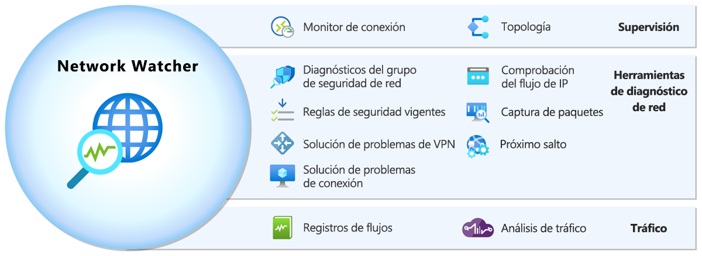
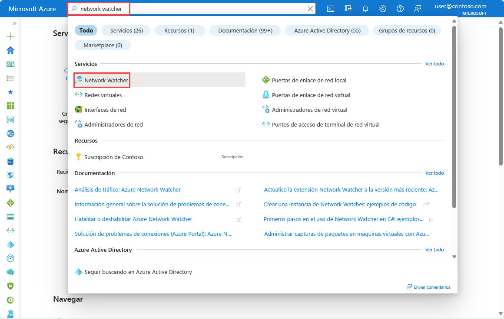
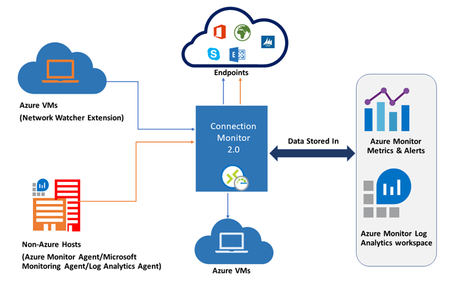

# AZ-104 — Introducción a Azure Network Watcher

Módulo 25 del [AZ-104T00](https://learn.microsoft.com/en-us/training/courses/az-104t00) ([ES](https://learn.microsoft.com/es-es/training/courses/az-104t00)) · Ruta 4 — Configuración y administración de redes virtuales · Área: Implementación y administración de redes virtuales (15–20%).

## Concepto

Detectar, diagnosticar y supervisar problemas de rendimiento de red de recursos IaaS: Network Watcher y sus herramientas.

## Resumen en mis palabras

> *(pendiente — rellenar al estudiar el módulo)*

## Por qué importa para el examen

> - Uso de Azure Network Watcher y Connection Monitor
> - Herramientas clave: IP flow verify, next hop, connection troubleshoot, packet capture, topology

## Enlaces relacionados

**Módulo de Learn**: [Introducción a Azure Network Watcher](https://learn.microsoft.com/en-us/training/modules/intro-to-azure-network-watcher/) ([ES](https://learn.microsoft.com/es-es/training/modules/intro-to-azure-network-watcher/))

**Savill**: buscar "Network Watcher" en la [playlist AZ-104](https://www.youtube.com/playlist?list=PLlVtbbG169nGlGPWs9xaLKT1KfwqREHbs) · repaso final con el [Study Cram v2](https://www.youtube.com/watch?v=0Knf9nub4-k)

**Páginas de `knowledge/`**: [Azure Networking](azure-networking.md)

**Laboratorio**: sin lab dedicado — práctica libre en sandbox (IP flow verify, next hop, connection troubleshoot). Ver [labs/AZ-104](../labs/AZ-104/) y el [Lab 05 — Implement Intersite Connectivity](../labs/AZ-104/dns/Lab%2005%20-%20Implement%20Intersite%20Connectivity..md) (tarea 3: Connection troubleshoot)

# Introducción

Las organizaciones pueden usar Azure Network Watcher para detectar y supervisar problemas relacionados con el rendimiento de la red de recursos de infraestructura como servicio (IaaS -> **Infrastructure as a Service**) en Microsoft Azure.

Adatum es una nueva tienda de comercio en línea en expansión. Trabaja en DevOps en Adatum y es responsable de las redes. Adatum tiene varias aplicaciones de tres niveles que se ejecutan en máquinas virtuales que se migraron desde centros de datos locales a Azure. Las aplicaciones se hospedan en varias redes virtuales de Azure. Adatum también tiene varias aplicaciones híbridas que tienen niveles de proceso tanto en ubicaciones locales como en la nube.

En este módulo se explica lo que hace Azure Network Watcher, cómo funciona y cuándo debe elegir usar Azure Network Watcher como solución para satisfacer las necesidades de su organización.
## Objetivos de aprendizaje

En este módulo, aprenderá a:

- Obtenga información sobre qué es Azure Network Watcher y la funcionalidad que proporciona.
- Determine si Azure Network Watcher satisface las necesidades de su organización.

# ¿Qué es Azure Network Watcher?

Azure Network Watcher proporciona un conjunto de herramientas para supervisar, diagnosticar, ver métricas y habilitar o deshabilitar registros para recursos de IaaS de Azure (infraestructura como servicio). Network Watcher le permite supervisar y reparar el estado de red de productos iaaS como máquinas virtuales (VM), redes virtuales (VNet), puertas de enlace de aplicaciones, equilibradores de carga, etc. Network Watcher no está diseñado ni diseñado para la supervisión de PaaS ni para el análisis web.

Network Watcher consta de tres conjuntos principales de herramientas y funcionalidades:

- Supervisión
    - Topología
    - Monitor de conexión
- Diagnóstico de red
    - Verificación del flujo de IP
    - Diagnósticos de NSG
    - Próximo salto
    - Reglas de seguridad eficaces
    - Solución de problemas de conexión
    - Captura de paquetes
    - Solución de problemas de VPN
- Tráfico
    - Registros de flujos
    - Análisis de tráfico

## Monitorización

Network Watcher ofrece dos herramientas de supervisión que le ayudan a ver y supervisar los recursos:

- Topología
- Monitor de conexión

### Topología

La herramienta **Topología** proporciona una visualización de toda la red para comprender la configuración de red. Proporciona una interfaz interactiva para ver los recursos y sus relaciones en Azure que abarcan varias suscripciones, grupos de recursos y ubicaciones. Al principio del proceso de solución de problemas, esta herramienta le ayuda a visualizar todos los elementos implicados en el problema, lo que le permite encontrar algo que no es aparente examinando el contenido de los grupos de recursos.

### Monitor de conexión

**El monitor** de conexión proporciona supervisión de conexión de un extremo a otro para los puntos de conexión híbridos y de Azure. Le ayuda a comprender el rendimiento de la red entre varios puntos de conexión de la infraestructura de red. Puede usar el monitor de conexión para comprobar que dos máquinas virtuales IaaS que hospedan los componentes de una aplicación de varios niveles pueden comunicarse entre sí. También puede usarlo para comprobar la conectividad en escenarios híbridos.

## Herramientas de diagnóstico de red

Network Watcher ofrece siete herramientas de diagnóstico de red que ayudan a solucionar y diagnosticar problemas de red:

- Verificación del flujo de IP
- Diagnósticos de NSG (Network Security Group)
- Próximo salto
- Reglas de seguridad eficaces
- Solución de problemas de conexión
- Captura de paquetes
- Solución de problemas de VPN

### Verificación del flujo de IP

**La comprobación del flujo de IP** permite detectar problemas de filtrado de tráfico en un nivel de máquina virtual. Comprueba si se permite o deniega un paquete hacia o desde una dirección IP (dirección IPv4 o IPv6). También indica qué regla de seguridad permitió o denegó el tráfico.

### Diagnósticos de NSG

**Los diagnósticos de NSG (Network Security Group)** permiten detectar problemas de filtrado de tráfico en una máquina virtual, un conjunto de escalado de máquinas virtuales o un nivel de puerta de enlace de aplicaciones. Comprueba si se permite o se deniega un paquete hacia o desde una dirección IP, un prefijo IP o una etiqueta de servicio. Indica qué regla de seguridad permitió o denegó el tráfico. También permite agregar una nueva regla de seguridad con una prioridad más alta para permitir o denegar el tráfico.

### Próximo salto

**El próximo salto** le permite detectar problemas de enrutamiento. Comprueba si el tráfico se enruta correctamente al destino previsto. Proporciona información sobre el tipo de próximo salto, la dirección IP y el identificador de la tabla de rutas para una dirección IP de destino específica.

### Reglas de seguridad eficaces

**Las reglas de seguridad eficaces** permiten ver las reglas de seguridad eficaces aplicadas a una interfaz de red. Muestra todas las reglas de seguridad aplicadas a la interfaz de red, la subred en la que se encuentra la interfaz de red y el agregado de ambos.

### Solución de problemas de conexión

**La solución de problemas de conexión** permite probar una conexión entre una máquina virtual, un conjunto de escalado de máquinas virtuales, una puerta de enlace de aplicaciones o un host de Bastion y una máquina virtual, un FQDN, un URI o una dirección IPv4. La prueba devuelve información similar que se devuelve al usar la herramienta de supervisión de conexiones, pero prueba la conexión en un momento dado en lugar de supervisarla con el tiempo, como hace el monitor de conexión.

### Captura de paquetes

**La captura de paquetes** permite crear sesiones de captura de paquetes de forma remota para registrar todo el tráfico de red hacia y desde una máquina virtual (VM) o un conjunto de escalado de máquinas virtuales.

### Solución de problemas de VPN

**La solución de problemas de VPN** le permite solucionar problemas de puertas de enlace de red virtual y sus conexiones.

## Tráfico

Network Watcher ofrece dos herramientas de tráfico que le ayudan a registrar y visualizar el tráfico de red:

- Registros de flujos
- Análisis de tráfico

### Registros de flujos

**Los registros de flujo** le permiten registrar información sobre el tráfico ip de Azure y almacenar los datos en Azure Storage. Puede registrar el tráfico IP que fluye por un grupo de seguridad de red o una red virtual de Azure.

### Análisis de tráfico

**El análisis de tráfico** proporciona visualizaciones enriquecidas de los datos de registros de flujo.

# Funcionamiento de Azure Network Watcher.

Network Watcher estará disponible automáticamente al crear una red virtual en una región de Azure de la suscripción. Para acceder a Network Watcher directamente en Azure Portal, escriba **Network Watcher** en la barra **de búsqueda** .

## Herramienta de topología de Network Watcher

La funcionalidad de topología de Azure Network Watcher permite ver todos los recursos siguientes en una red virtual. Incluidos, los recursos asociados a los recursos de una red virtual y las relaciones entre los recursos.

- Subredes
- Interfaces de red
- Grupos de seguridad de red
- Equilibrador de carga
- Sondeos de estado de Load Balancer
- Direcciones IP públicas
- Emparejamiento de redes virtuales de Azure
- Puertas de enlace de red virtual
- Conexiones de VPN Gateway
- Máquinas virtuales
- Conjuntos de máquinas virtuales escalables

Todos los recursos devueltos en una topología tienen las siguientes propiedades:

- **Nombre**: nombre del recurso.
- **Identificador**: el URI del recurso.
- **Ubicación**: la región de Azure en la que se encuentra el recurso.
- **Asociaciones**: una lista de asociaciones al objeto al que se hace referencia. Cada asociación tiene las siguientes propiedades:
    - **AssociationType**: Hace referencia a la relación entre el objeto hijo y el objeto padre. Los valores válidos son `Contains` y `Associated`.
    - **Nombre**: nombre del recurso al que se hace referencia.
    - **ResourceId**: El URI del recurso referido en la asociación.

## Herramienta Connection Monitor

Connection Monitor proporciona supervisión unificada de conexiones de un extremo a otro en Azure Network Watcher. Connection Monitor admite implementaciones híbridas y en la nube de Azure. Puede usar la herramienta Connection Monitor para medir la latencia entre los recursos. Connection Monitor puede detectar cambios que afectan a la conectividad, como cambios de configuración de red o modificaciones en las reglas de NSG. Puede configurar Connection Monitor para sondear las máquinas virtuales a intervalos regulares para buscar errores o cambios. El Monitor de conexión puede diagnosticar problemas y proporcionar explicaciones sobre por qué se produjo el problema y los pasos que puede seguir para corregir un problema.

Para usar Connection Monitor para la supervisión, debe instalar agentes de supervisión en los hosts que supervisa. Connection Monitor usa archivos ejecutables ligeros para ejecutar comprobaciones de conectividad, tanto si un host se encuentra en una red virtual de Azure como en una red local. Con las máquinas virtuales de Azure, se puede instalar la máquina virtual del agente de Network Watcher, también conocida como extensión Network Watcher.

## Verificación del flujo de IP

La herramienta de comprobación del flujo de IP utiliza un mecanismo de verificación basado en parámetros de paquetes de 5 tuplas para detectar si se permiten o deniegan paquetes entrantes o salientes hacia o desde una máquina virtual. Dentro de la herramienta, puede especificar un puerto local y remoto, el protocolo (TCP o UDP), la dirección IP local, la dirección IP remota, la máquina virtual y el adaptador de red de la máquina virtual.

## Próximo salto

El tráfico de una máquina virtual iaaS se envía a un destino en función de las rutas efectivas asociadas a una interfaz de red (NIC). El próximo salto obtiene el tipo de próximo salto y la dirección IP de un paquete de una máquina virtual y una NIC específicas. Conocer el próximo salto le ayuda a determinar si el tráfico se dirige al destino previsto o si el tráfico se envía sin problemas. Una configuración incorrecta de las rutas, en las que el tráfico se dirige a una ubicación local o a una aplicación virtual, podría provocar problemas de conectividad. La funcionalidad Próximo salto también devuelve la tabla de ruta asociada con el próximo salto. Si la ruta se define como una ruta definida por el usuario, se devolverá esa ruta. De lo contrario, el próximo salto devuelve `System Route`.

## Reglas de seguridad eficaces

Los grupos de seguridad de red (NSG) filtran los paquetes en función de su dirección IP de origen y destino y números de puerto. Se puede aplicar más de un grupo de seguridad de red (NSG) a un recurso de IaaS en una red virtual de Azure. Al considerar todas las reglas que se aplican en todos los NSG para un recurso, la herramienta Reglas de Seguridad Efectivas le permite determinar por qué se puede denegar o permitir cierto tráfico.

## Captura de paquetes

La captura de paquetes es una extensión de máquina virtual que se inicia de forma remota a través de Network Watcher. Esta funcionalidad facilita la carga de ejecutar manualmente una captura de paquetes en una máquina virtual específica mediante herramientas del sistema operativo o utilidades de terceros. La captura de paquetes se puede desencadenar a través del portal, PowerShell, la CLI de Azure o la API REST. Network Watcher permite configurar filtros para la sesión de captura para asegurarse de que captura el tráfico que desea supervisar. Los filtros se basan en una información 5-tupla (protocolo, dirección IP local, dirección IP remota, el puerto local y el puerto remoto). Los datos capturados se almacenan en el disco local o en un blob de almacenamiento.

## Solución de problemas de conexión

La herramienta de solución de problemas de conexión comprueba la conectividad TCP entre un origen y una máquina virtual de destino. Puede especificar la máquina virtual de destino mediante un FQDN, un URI o una dirección IP. Si la conexión se realiza correctamente, aparece información sobre la comunicación, entre las que se incluyen:

- Latencia en milisegundos.
- Número de paquetes de sondeo enviados.
- Cantidad de saltos en la ruta completa hacia el destino.

Si la conexión no se realiza correctamente, la herramienta muestra detalles sobre el error. Es posible que vea los siguientes tipos de error:

- **CPU**: se produjo un error en la conexión debido a un uso elevado de la CPU.
- **Memoria**: error en la conexión debido a un uso elevado de memoria.
- **GuestFirewall**: un firewall fuera de Azure bloqueó la conexión.
- **DNSResolution**: no se pudo resolver la dirección IP de destino.
- **NetworkSecurityRule**: un grupo de seguridad de red bloqueó la conexión.
- **UserDefinedRoute**: hay una ruta de usuario incorrecta en una tabla de enrutamiento.

## Solución de problemas de VPN

Network Watcher proporciona la capacidad de solucionar problemas de puertas de enlace y conexiones. La funcionalidad se puede llamar a través del portal, PowerShell, la CLI de Azure o la API REST. Cuando se llama a Network Watcher, diagnostica el estado de la puerta de enlace o la conexión y luego devuelve los resultados adecuados. La solicitud es una transacción de larga duración. Los resultados preliminares que se devuelven proporcionan una imagen general del estado del recurso.

En la lista siguiente se describen los valores que se devuelven mediante una llamada a la API de solución de problemas de VPN:

- **startTime**: hora en que se inició la solución de problemas.
- **endTime**: hora en que finalizó la solución de problemas.
- **code**: este valor es `UnHealthy` si hay un único error de diagnóstico.
- **results**: Una colección de resultados devueltos en la conexión o en la puerta de enlace de la red virtual.
    - **id**: el tipo de error.
    - **summary**: un resumen del error.
    - **detallado**: una descripción detallada del error.
    - **recommendedActions**: una colección de acciones recomendadas que se van a realizar.
    - **actionText**: texto que describe qué acción realizar.
    - **actionUri**: el URI de la documentación que describe qué acción realizar.
    - **actionUriText**: descripción breve del texto de la acción.

# Cuándo se debe usar Azure Network Watcher.

Azure Network Watcher es útil cuando intenta solucionar problemas de red relacionados con los productos iaaS de Azure. Por ejemplo, puede usar las herramientas incluidas en Azure Network Watcher en los escenarios siguientes:

- Resuelva los problemas de conectividad relacionados con las máquinas virtuales iaaS.
- Solución de problemas de conexiones VPN.
- Determine las latencias de red entre regiones.

## Resolución de problemas de conectividad relacionados con máquinas virtuales IaaS

Recientemente, se implementó una máquina virtual IaaS de Windows Server en Azure. Los desarrolladores que implementaron la máquina virtual no pueden establecer una sesión remota de PowerShell en esta máquina virtual iaaS desde otra máquina virtual de IaaS en la misma red virtual.

Puede solucionar este problema mediante la herramienta de comprobación del flujo de IP. Esta herramienta le permite especificar un puerto local y remoto, el protocolo (TCP/UDP), la dirección IP local y la dirección IP remota para comprobar el estado de conexión. También le permite especificar la dirección de la conexión (entrante o saliente). La verificación del flujo de IP ejecuta una prueba lógica de las reglas que están en su red.

En este caso, puede usar la comprobación del flujo de IP para especificar la dirección IP de la máquina virtual y el puerto TCP 5986 (que usa PowerShell al usar HTTPS). A continuación, especifique la dirección IP y el puerto de la máquina virtual remota. Elija el protocolo TCP y, a continuación, seleccione **Comprobar**. Si una regla de NSG bloquea el tráfico, la regla de comprobación del flujo de IP notifica qué regla es responsable del tráfico eliminado.

## Solución de problemas de conexiones VPN

Una máquina virtual iaaS se implementa en una red virtual de Azure. Las conexiones a esta máquina virtual iaaS desde hosts locales se realizan a través de una conexión VPN de sitio a sitio.

Puede solucionar problemas de esta conexión VPN mediante la herramienta de solución de problemas de VPN de Azure. Esta herramienta ejecuta diagnósticos en una conexión de puerta de enlace de red virtual y devuelve un diagnóstico de estado. Puede ejecutar esta herramienta desde Azure Portal, PowerShell o la CLI de Azure.

Esta herramienta comprueba si hay problemas comunes en la puerta de enlace y devuelve el diagnóstico de estado. También puede ver el archivo de registro para obtener más información. El diagnóstico muestra si la conexión VPN funciona. Si la conexión VPN no funciona, la herramienta de solución de problemas de VPN de Azure sugiere formas de resolver el problema.

## Determinación de la latencia de red entre regiones

Puede usar herramientas de Network Watcher para determinar la mejor ubicación para colocar los recursos de IaaS en función de las latencias de red. Por ejemplo, puede usar Network Watcher para que las máquinas virtuales de IaaS se hagan ping entre sí periódicamente para determinar la latencia de red entre regiones. Esta información puede permitirle determinar si todas las máquinas virtuales de IaaS deben encontrarse en una sola región. O bien, si se pueden distribuir entre diferentes regiones para admitir arquitecturas de aplicaciones específicas.

Supongamos que tiene una aplicación híbrida local y una aplicación que se ejecuta en una máquina virtual iaaS de Azure que se conecta al mismo punto de conexión de la cuenta de almacenamiento. Puede usar Network Watcher para realizar una comparación de latencias de las dos aplicaciones. Si la latencia de la aplicación local es demasiado alta, podría reforzar un caso para migrar esa aplicación a Azure. Si la latencia de la máquina virtual iaaS de Azure es demasiado alta, podría reforzar un caso para migrar la máquina virtual a otra región con una latencia menor.

## Cuándo no usar Network Watcher

Las herramientas de Network Watcher proporcionan niveles intermedios de funcionalidad de diagnóstico de red. Estas herramientas no proporcionan algunas de las características avanzadas disponibles en algunas herramientas de terceros. Si su organización necesita acceso a esta funcionalidad avanzada, es posible que tenga que implementar una herramienta de terceros que incluya esta funcionalidad avanzada para lograr los objetivos de diagnóstico.

Es importante tener en cuenta que Network Watcher se usa principalmente para los recursos de IaaS en redes virtuales de Azure. No puede usar Azure Network Watcher para diagnosticar problemas de conectividad relacionados con servicios PaaS o análisis web. Si tiene problemas relacionados con estos servicios, debe comprobar el estado de Azure o el panel de estado del servicio.

## Relacionado

- [Índice AZ-104](../certifications/AZ-104/INDEX.md)
- [Azure Networking](azure-networking.md)
- [Herramientas de supervisión de Azure (AZ-900)](az900-monitoring-tools.md)
