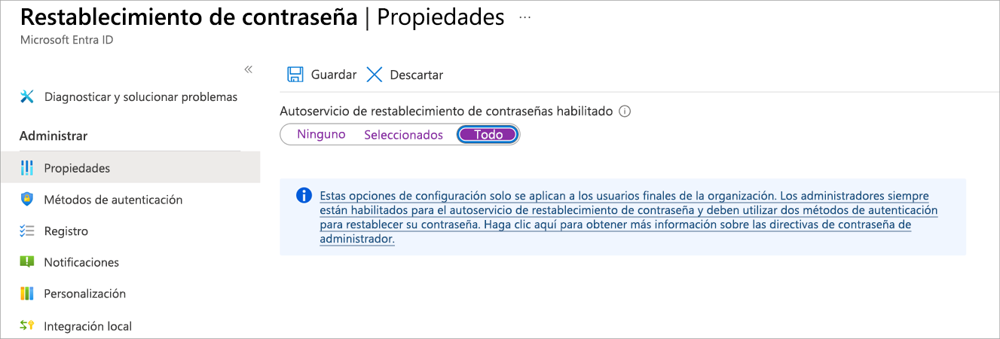
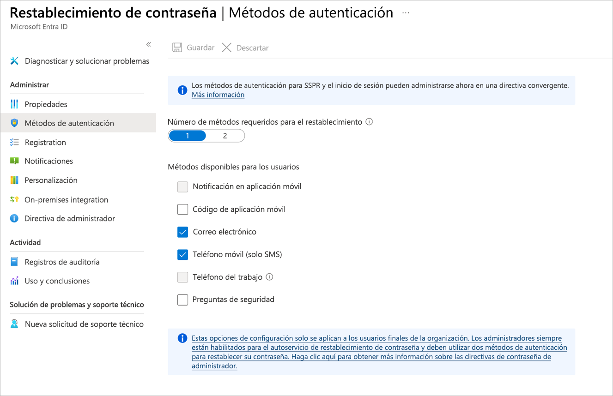
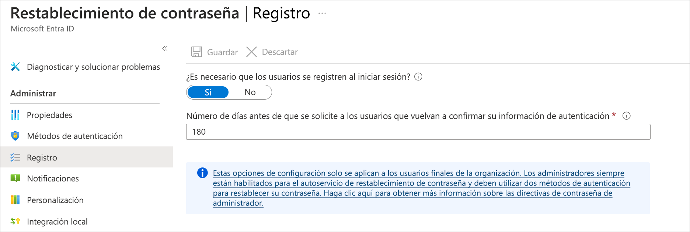
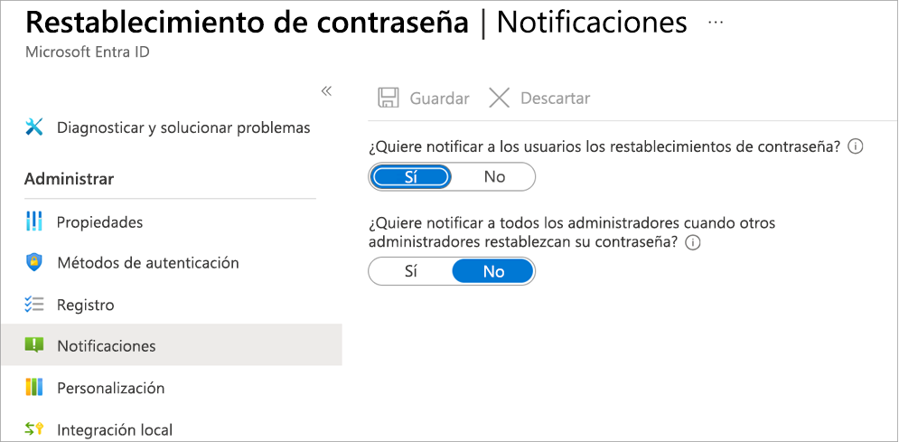
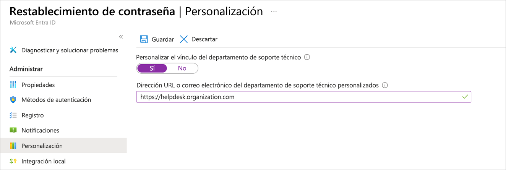

# AZ-104 - Restablecimiento de contraseñas con SSPR (Self-Service Password Reset)

Módulo 08 del [AZ-104T00](https://learn.microsoft.com/en-us/training/courses/az-104t00) ([ES](https://learn.microsoft.com/es-es/training/courses/az-104t00)) · Ruta 1 — Administración de identidades y gobernanza · Área: Administración de identidades y gobernanza en Azure (20–25%).

## Concepto

Evaluar el autoservicio de restablecimiento de contraseña (SSPR) para que los usuarios restablezcan contraseñas o desbloqueen cuentas; implementarlo, configurarlo y probarlo.

## Resumen en mis palabras

> *Imaginemos que somos un administrador de TI de una organización minorista de gran tamaño. Su organización comienza a usar Microsoft Entra ID para permitir que los empleados inicien sesión de forma segura y usen aplicaciones de software como servicio (SaaS).*

## Por qué importa para el examen

> - Configuración del autoservicio de restablecimiento de contraseña (SSPR)
> - Métodos de autenticación habilitados y combinación de métodos requerida

## Enlaces relacionados

**Módulo de Learn**: [Permitir que los usuarios restablezcan sus contraseñas con el autoservicio de restablecimiento de contraseña de Microsoft Entra](https://learn.microsoft.com/en-us/training/modules/allow-users-reset-their-password/) ([ES](https://learn.microsoft.com/es-es/training/modules/allow-users-reset-their-password/))

**Savill**: buscar "SSPR" / "password" en la [playlist AZ-104](https://www.youtube.com/playlist?list=PLlVtbbG169nGlGPWs9xaLKT1KfwqREHbs) · repaso final con el [Study Cram v2](https://www.youtube.com/watch?v=0Knf9nub4-k)

**Páginas de `knowledge/`**: [[Entra ID]]

**Laboratorio**: Lab 01 (Entra ID) de [MicrosoftLearning/AZ-104](https://github.com/MicrosoftLearning/AZ-104-MicrosoftAzureAdministrator) — ver [labs/AZ-104](../labs/AZ-104/README.md)

## Relacionado

- [Índice AZ-104](../certifications/AZ-104/INDEX.md)
- [[Entra ID]]

# Permitir que los usuarios restablezcan sus contraseñas con el autoservicio de restablecimiento de contraseña de Microsoft Entra.

# Introducción.

Imaginemos que somos un administrador de TI de una organización minorista de gran tamaño. Su organización comienza a usar Microsoft Entra ID para permitir que los empleados inicien sesión de forma segura y usen aplicaciones de software como servicio (SaaS). También permite el acceso a los recursos de la organización en Microsoft 365. Está sobrecargado con las solicitudes de restablecimiento de contraseña porque actualmente restablece manualmente las contraseñas de los empleados. Para que estos empleados vuelvan a ser productivos rápidamente y la carga de trabajo se reduzca, decidimos evaluar y configurar el autoservicio de restablecimiento de contraseña en Microsoft Entra ID.

En este módulo, veremos cómo Azure admite esta característica y cómo podemos configurarla. Solo las suscripciones de pago pueden aprovechar esto, mientras que las suscripciones gratuitas y de pago por uso no pueden hacerlo.

Al término de este módulo, sabremos configurar el autoservicio de restablecimiento de contraseña en Microsoft Entra ID.

# ¿Qué es el autoservicio de restablecimiento de contraseña de Microsoft Entra ID?.

Se le ha pedido que evalúe las maneras de reducir los costos del departamento de soporte técnico en la organización comercial. Se ha detectado que el personal de soporte técnico dedica mucho tiempo a restablecer las contraseñas de los usuarios. A menudo, los usuarios se quejan de retrasos con este proceso y estos retrasos afectan a su productividad. Queremos saber cómo podemos configurar Azure para permitir que los usuarios administren sus propias contraseñas.
En esta unidad, veremos cómo funciona el autoservicio de restablecimiento de contraseña (SSPR) de Microsoft Entra ID.

## ¿Por qué usar SSPR?

En Microsoft Entra ID, cualquier usuario puede cambiar su contraseña si ya ha iniciado sesión. Pero si no ha iniciado sesión, olvidó su contraseña o ha expirado, tendrá que restablecer su contraseña. Con SSPR, los usuarios pueden restablecer sus contraseñas en un explorador web o en una pantalla de inicio de sesión de Windows para poder volver a acceder a Azure, Microsoft 365 y cualquier otra aplicación que use Microsoft Entra ID para la autenticación.

El SSPR reduce la carga de los administradores porque los usuarios pueden solucionar los problemas relacionados con sus contraseñas por sí mismos, sin tener que acudir al departamento de soporte técnico. Además, reduce el impacto en la productividad que conlleva una contraseña olvidada o caducada. Los usuarios no tienen que esperar a que un administrador esté disponible para restablecer su contraseña.

## Cómo funciona SSPR

El usuario inicia un restablecimiento de contraseña yendo directamente al portal de restablecimiento de contraseña o seleccionando el vínculo **No puede acceder a su cuenta** en una página de inicio de sesión. En el portal de restablecimiento se llevan a cabo estos pasos:

1. **Localización**: El portal comprueba la configuración regional del explorador y representa la página SSPR en el idioma correspondiente.

2. **Comprobación**: El usuario escribe su nombre de usuario y pasa un CAPTCHA para garantizar que es un usuario, y no un robot.

3. **Autenticación**: el usuario escribe los datos necesarios para autenticar su identidad; Podrían ingresar un código o responder preguntas de seguridad.

4. **Restablecimiento de contraseña**: Si el usuario pasa las pruebas de autenticación, puede escribir una nueva contraseña y confirmarla.

5. **Notificación**: se envía un mensaje al usuario para confirmar el restablecimiento.

Existen diversas formas de personalizar la experiencia de usuario de SSPR. Por ejemplo, podemos agregar el logotipo de la empresa a la página de inicio de sesión para que los usuarios sepan que están en el lugar adecuado para restablecer la contraseña.

## Autenticación de un restablecimiento de contraseña

Antes de permitir un restablecimiento de contraseña, es fundamental confirmar la identidad de un usuario. Los usuarios malintencionados podrían aprovechar cualquier debilidad del sistema para suplantar a ese usuario. Azure admite seis maneras diferentes de autenticar solicitudes de restablecimiento.

Como administrador, puede elegir los métodos que se van a usar al configurar el SSPR. Habilite dos o más de estos métodos para que los usuarios puedan elegir los que pueden usar con facilidad. Los métodos son los siguientes:

| Método de autenticación          | Cómo registrarse                                                                                                                                  | Cómo autenticar un restablecimiento de contraseña                                                                                                                        |
| -------------------------------- | ------------------------------------------------------------------------------------------------------------------------------------------------- | ------------------------------------------------------------------------------------------------------------------------------------------------------------------------ |
| Notificación en aplicación móvil | Instale la aplicación Microsoft Authenticator en el dispositivo móvil y regístrela en la página de configuración de la autenticación multifactor. | Azure envía una notificación a la aplicación, que se puede confirmar o denegar.                                                                                          |
| Código de aplicación móvil       | Este método también usa la aplicación Authenticator y se instala y registra de la misma manera.                                                   | Escriba el código de la aplicación.                                                                                                                                      |
| Correo electrónico               | Indique una dirección de correo electrónico que sea ajena a Azure y Microsoft 365.                                                                | Azure envía un código a la dirección, que hay que introducir en el asistente de restablecimiento.                                                                        |
| Teléfono móvil                   | Indique un número de teléfono móvil.                                                                                                              | Azure envía un código al teléfono en un mensaje SMS, que debes introducir en el asistente de restablecimiento. También puede optar por recibir una llamada automatizada. |
| Teléfono del trabajo             | Proporcione un número de teléfono no móvil.                                                                                                       | Se recibirá una llamada automatizada a dicho número, y habrá que presionar #.                                                                                            |
| Preguntas de seguridad           | Seleccione preguntas como "¿En qué ciudad nació su madre?" y guarde las respuestas.                                                               | Responda las preguntas.                                                                                                                                                  |
En las organizaciones de Microsoft Entra de prueba no se admiten las opciones de llamada de teléfono.
### Requerimiento del número mínimo de métodos de autenticación

Puede especificar el número mínimo de métodos que el usuario debe configurar, ya sea uno o dos. Por ejemplo, puede habilitar los métodos de código de aplicación móvil, correo electrónico, teléfono de la oficina y preguntas de seguridad y especificar un mínimo de dos métodos. Después, los usuarios pueden elegir los dos métodos que prefieran, como el correo electrónico y el código de la aplicación móvil.

En el caso del método de preguntas de seguridad, puede especificar un número mínimo de preguntas que el usuario debe configurar para registrarse para este método. También puede especificar un número mínimo de preguntas que estos deben responder correctamente para restablecer la contraseña.

Una vez que los usuarios registren la información necesaria para el número mínimo de métodos que ha especificado, se consideran registrados para SSPR.

### Recomendaciones

- Habilite dos o más métodos de solicitud de restablecimiento de autenticación.
- Use la notificación o el código de la aplicación móvil como método principal. Pero habilite también los métodos de correo electrónico o teléfono de la oficina para dar soporte a los usuarios sin dispositivos móviles.
- El método del teléfono móvil no es un método recomendado, ya que se pueden enviar mensajes SMS fraudulentos.
- La opción de preguntas de seguridad es el método menos recomendable porque existe la posibilidad de que otras personas conozcan las respuestas a esas preguntas. Use el método de preguntas de seguridad únicamente en combinación con, al menos, otro de los métodos.

### Cuentas asociadas a roles de administrador

- Las cuentas con un rol de administrador siempre tienen aplicada una directiva de autenticación de dos métodos muy sólida, independientemente de la configuración de otros usuarios.
- El método de preguntas de seguridad no está disponible en las cuentas asociadas a un rol de administrador.

## Configuración de notificaciones

Los administradores pueden elegir cómo se va a notificar a los usuarios de los cambios de contraseña. Se pueden habilitar dos opciones:

- **¿Quiere notificar a los usuarios los restablecimientos de contraseña?**: el usuario que restablezca su propia contraseña recibirá una notificación en sus direcciones de correo electrónico principal y secundaria. Si el restablecimiento lo ha realizado un usuario malintencionado, dicha notificación avisará al usuario, que puede tomar medidas de mitigación de riesgos.
- **¿Quiere notificar a todos los administradores cuando otros administradores restablezcan su contraseña?**: cuando un administrador restablezca su contraseña, se notificará a todos los demás administradores.

## Requisitos de licencia

Existen dos ediciones de Microsoft Entra ID: Premium P1 y Premium P2. La funcionalidad de restablecimiento de contraseña que puede usar dependerá de la edición.

Cualquier usuario que haya iniciado sesión puede cambiar su contraseña, independientemente de la edición de Microsoft Entra ID que posea.

¿Qué ocurre si no ha iniciado sesión y ha olvidado la contraseña, o esta ha expirado? En este caso, puede usar SSPR en Microsoft Entra ID P1 o P2. También está disponible con Aplicaciones de Microsoft 365 para negocios o Microsoft 365.

En una situación híbrida donde haya Active Directory en un entorno local y Microsoft Entra ID en la nube, cualquier cambio de contraseña en la nube se debe volver a escribir en el directorio local. Esta compatibilidad con escritura diferida está disponible en Microsoft Entra ID, tanto P1 como P2. También está disponible con Aplicaciones de Microsoft 365 para negocios.

## Opciones de implementación de SSPR

Puede implementar el SSPR con escritura diferida de contraseñas mediante [Microsoft Entra Connect](https://learn.microsoft.com/es-es/entra/identity/authentication/tutorial-enable-sspr-writeback/) o [Cloud Sync](https://learn.microsoft.com/es-es/entra/identity/authentication/tutorial-enable-cloud-sync-sspr-writeback/) en la nube, en función de las necesidades de los usuarios. Puede implementar cada opción en paralelo en dominios diferentes para dirigirse a distintos conjuntos de usuarios. Esto ayuda a los usuarios existentes locales a reescribir los cambios de contraseña, al tiempo que se agrega una opción para los usuarios de dominios desconectados debido a una fusión o división de la empresa. Los usuarios de un dominio local existente pueden utilizar Microsoft Entra Connect, mientras que los nuevos usuarios de una fusión pueden utilizar la sincronización en la nube en otro dominio.

La sincronización en la nube también puede proporcionar una mayor disponibilidad porque no se basa en una sola instancia de Microsoft Entra Connect. Para obtener una comparación de características entre las dos opciones de implementación, consulte [Comparación entre Microsoft Entra Connect y la sincronización en la nube](https://learn.microsoft.com/es-es/entra/identity/hybrid/cloud-sync/what-is-cloud-sync#how-is-azure-ad-connect-cloud-sync-different-from-azure-ad-connect-sync/).

# Implementar el autoservicio de restablecimiento de contraseña de Microsoft Entra.

Ha decidido implementar el autoservicio de restablecimiento de contraseña (SSPR) en Microsoft Entra ID para su organización. Queremos empezar a usar SSPR con un grupo de 20 usuarios del departamento de marketing a modo de implementación de prueba. Si todo va bien, habilitaremos SSPR en toda la organización.

En esta unidad, aprenderá a habilitar SSPR en Microsoft Entra ID.

## Requisitos previos

Antes de empezar a configurar SSPR, necesita una:

- **organización de Microsoft Entra**: Esta organización debe tener al menos una licencia de prueba habilitada P1 o P2.
- **Cuenta de Microsoft Entra con el rol Administrador de directivas de autenticación**: La usaremos para configurar SSPR.
- **cuenta de usuario no administrativo**: La usaremos para comprobar SSPR. Es importante que esta cuenta no sea de administrador, ya que Microsoft Entra impone más requisitos en las cuentas administrativas de SSPR. Este usuario, y todas las cuentas de usuario, deben tener una licencia válida para usar SSPR.
- **grupo seguridad con el que probar la configuración**: La cuenta de usuario no administrativo debe ser miembro de este grupo. Usaremos este grupo de seguridad para limitar en qué usuarios implementaremos SSPR.

## Ámbito de la implementación de SSPR

Hay tres opciones de configuración en la propiedad **Se habilitó el restablecimiento de contraseña del autoservicio**:

- **Ninguno**: Ningún usuario de la organización de Microsoft Entra puede usar SSPR. Este es el valor predeterminado.
- **Seleccionado**: solo los miembros del grupo de seguridad especificado pueden usar SSPR. Esto permite habilitar SSPR en un grupo de usuarios concreto, que puede probarlo y comprobar que funciona según lo previsto. Cuando todo esté listo para llevar a cabo la implementación global, establezca la propiedad en **Habilitado**, así todos los usuarios tendrán acceso a SSPR.
- **Todos**: Todos los usuarios de la organización de Microsoft Entra pueden usar SSPR.

## Configuración de SSPR

Estos son los pasos de alto nivel para configurar SSPR:

1. Vaya a [Azure Portal](https://portal.azure.com/), a continuación a **Microsoft Entra ID**>**Administrar**>**Restablecimiento de contraseña**.
    
2. **Propiedades**:
    
    - Habilite SSPR.
    - Puede habilitarlo para todos los usuarios de la organización de Microsoft Entra o solo para determinados usuarios.
    - Para habilitarlo para determinados usuarios, debe especificar el grupo de seguridad. Los miembros de este grupo pueden usar SSPR.

    - 

3.**Métodos de autenticación**:

- Elija si desea requerir uno o dos métodos de autenticación.
- Elija los métodos de autenticación que los usuarios pueden usar.

4. **Registro**:
    - Especifique si los usuarios deben registrarse en SSPR la próxima vez que inicien sesión.
    - Especifique con qué frecuencia se va a pedir a los usuarios que vuelvan a confirmar su información de autenticación.
    
    
    
5. **Notificaciones**: Elija si se va a notificar a los usuarios y a los administradores los restablecimientos de contraseñas.
    
    
    
6. **Personalización**: Indique una dirección de correo electrónico o una dirección URL de página web donde los usuarios puedan obtener ayuda.
    
    

# Ejercicios.

[Configurar el autoservicio de restablecimiento de contraseña](https://learn.microsoft.com/es-es/training/modules/allow-users-reset-their-password/4-exercise-set-up-self-service-password-reset)
[Personalizar la información de marca de directorio](https://learn.microsoft.com/es-es/training/modules/allow-users-reset-their-password/5-exercise-customize-directory-branding)

[[SSPR]]