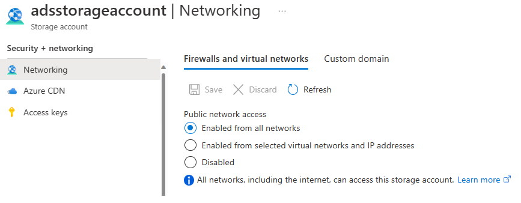
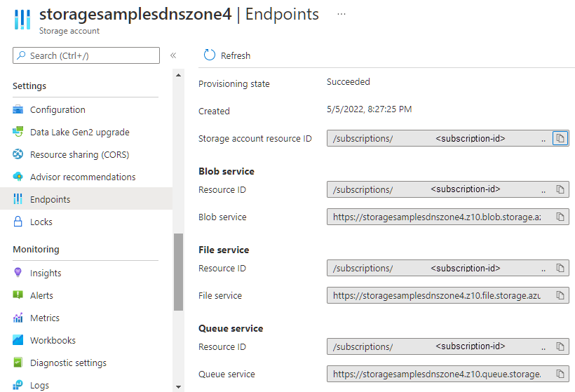
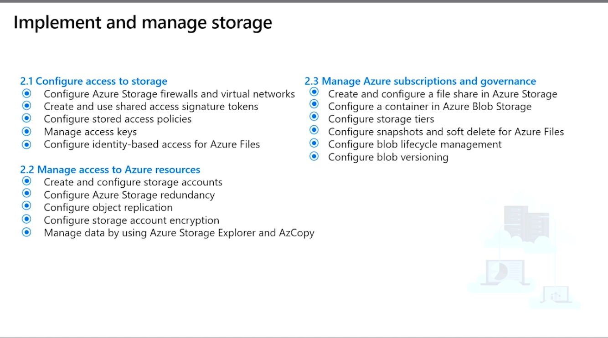
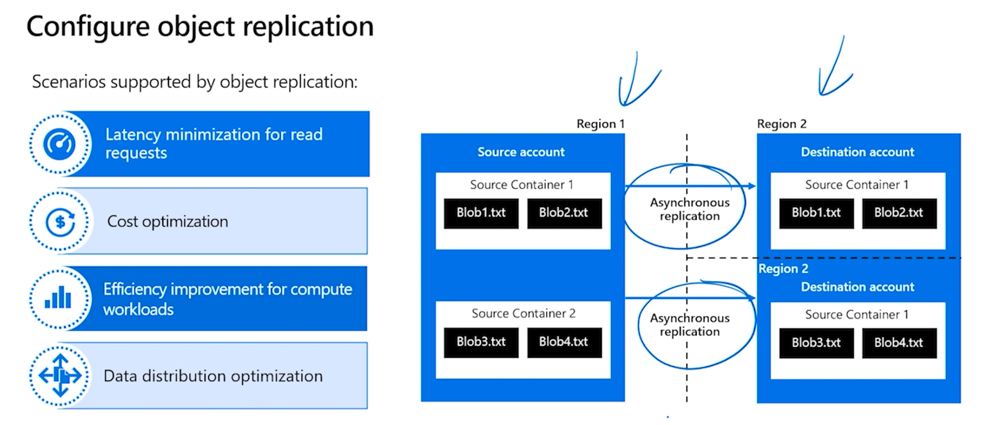

# AZ-104 — Configuración de cuentas de almacenamiento

Módulo 09 del [AZ-104T00](https://learn.microsoft.com/en-us/training/courses/az-104t00) ([ES](https://learn.microsoft.com/es-es/training/courses/az-104t00)) · Ruta 2 — Implementación y administración del almacenamiento · Área: Implementación y administración del almacenamiento (15–20%).

## Concepto

Configuración de cuentas de almacenamiento, incluida la replicación (redundancia) y los puntos de conexión (endpoints).

## Resumen en mis palabras

> *(pendiente — rellenar al estudiar el módulo)*

## Por qué importa para el examen

> - Creación y configuración de cuentas de almacenamiento
> - Configuración de la redundancia de Azure Storage (LRS/ZRS/GRS/GZRS y failover)
> - Configuración de la replicación de objetos
> - Configuración del cifrado de una cuenta de almacenamiento
> - Administración de datos mediante Explorador de Azure Storage y AzCopy

## Enlaces relacionados

**Módulo de Learn**: [Configuración de cuentas de almacenamiento](https://learn.microsoft.com/en-us/training/modules/configure-storage-accounts/) ([ES](https://learn.microsoft.com/es-es/training/modules/configure-storage-accounts/))

**Savill**: buscar "storage" en la [playlist AZ-104](https://www.youtube.com/playlist?list=PLlVtbbG169nGlGPWs9xaLKT1KfwqREHbs) · repaso final con el [Study Cram v2](https://www.youtube.com/watch?v=0Knf9nub4-k)

**Páginas de `knowledge/`**: [[Servicios de almacenamiento de Azure (AZ-900)]]

**Laboratorio**: Lab 07 (storage accounts) de [MicrosoftLearning/AZ-104](https://github.com/MicrosoftLearning/AZ-104-MicrosoftAzureAdministrator) — ver [labs/AZ-104](../labs/AZ-104/README.md)

## Relacionado

- [Índice AZ-104](../certifications/AZ-104/INDEX.md)
- [[Servicios de almacenamiento de Azure (AZ-900)]]

# Introducción.

Azure Storage es la solución de almacenamiento de Microsoft para los escenarios modernos de almacenamiento de datos.

Supongamos que trabaja para una gran empresa de comercio electrónico que necesita almacenar y servir un gran número de imágenes de producto a sus clientes. La empresa quiere una solución escalable y fiable que pueda controlar el tráfico elevado y garantizar la durabilidad de los datos. Quieren restaurar rápidamente los datos si hay una interrupción.

En este módulo, aprenderá a configurar cuentas de almacenamiento y a seleccionar los tipos de almacenamiento adecuados en Azure. En el módulo se tratan temas como la implementación de estrategias de replicación y la configuración del acceso seguro al almacenamiento.

El objetivo de este módulo es proporcionar a los administradores de Azure los conocimientos y aptitudes para configurar y administrar de forma eficaz las cuentas de almacenamiento de Azure.

## Objetivos de aprendizaje

En este módulo aprenderá a:

- Identificar las características y los casos de uso de las cuentas de almacenamiento de Azure
- Seleccione uno de los diferentes tipos de instancias de Azure Storage y cree cuentas de almacenamiento.
- Seleccionar una estrategia de replicación de almacenamiento
- Configure el acceso seguro de red a los puntos de conexión de almacenamiento.

# Implementación de Azure Storage.

[Azure Storage](https://learn.microsoft.com/es-es/azure/storage/common/storage-introduction) es Microsoft solución de almacenamiento en la nube para escenarios de almacenamiento de datos modernos. Azure Storage ofrece un almacén de objetos escalable de forma masiva para objetos de datos. Proporciona un servicio de sistema de archivos para la nube, un almacén de mensajería para mensajería confiable y un almacén de NoSQL.

Azure Storage es un servicio listo para inteligencia artificial que puede usar para almacenar archivos, mensajes, tablas y otros tipos de información. Usa Azure Storage para aplicaciones como la compartición de archivos. Los desarrolladores usan Azure Storage para los datos de trabajo. Los datos de trabajo incluyen sitios web, aplicaciones móviles y aplicaciones de escritorio. Azure Storage también lo usan las máquinas virtuales iaaS y los servicios en la nube de PaaS.

### Cosas que se deben saber sobre Azure Storage

Puede considerar Azure Storage como compatibles con tres categorías de datos: datos estructurados, datos no estructurados y datos de máquina virtual. Revise las siguientes categorías y piense en qué tipos de almacenamiento se usan en su organización.
![[storage-types.png]]

| Category                     | Description                                                                                                                                                                                                                                                            | Ejemplos de almacenamiento                                                                                                                                                                                                                                                                                                                                                |
| ---------------------------- | ---------------------------------------------------------------------------------------------------------------------------------------------------------------------------------------------------------------------------------------------------------------------- | ------------------------------------------------------------------------------------------------------------------------------------------------------------------------------------------------------------------------------------------------------------------------------------------------------------------------------------------------------------------------- |
| **Datos de máquina virtual** | El almacenamiento de datos de una máquina virtual incluye discos y archivos. Los discos son un almacenamiento en bloques persistente para las máquinas virtuales IaaS de Azure. Los archivos son unidades compartidas de archivos totalmente administradas en la nube. | El almacenamiento de los datos de máquina virtual se proporciona a través de Azure discos administrados. Las máquinas virtuales usan discos de datos para almacenar datos como archivos de base de datos, contenido estático del sitio web o código de aplicación personalizado. El número de discos de datos que puede agregar depende del tamaño de la máquina virtual. |
| **Datos no estructurados**   | Los datos no estructurados son los menos organizados. El formato de los datos no estructurados se conoce como _no relacional_.                                                                                                                                         | Los datos no estructurados se pueden almacenar mediante Azure Blob Storage y Azure Data Lake Storage. Blob Storage es un almacén de objetos en la nube basado en REST altamente escalable. Azure Data Lake Storage es el sistema de archivos distribuido de Hadoop (HDFS) como servicio.                                                                                  |
| **Datos estructurados**      | Los datos estructurados se almacenan en un formato relacional que tiene un esquema compartido. Los datos estructurados suelen estar en una tabla de base de datos con filas, columnas y claves. Las tablas son un almacén de escalado automático NoSQL.                | Los datos estructurados se pueden almacenar mediante Azure Table Storage, Azure Cosmos DB y Azure SQL Database. Azure Cosmos DB es un servicio de base de datos distribuido globalmente. Azure SQL Database es una base de datos como servicio totalmente administrada basada en SQL.                                                                                     |

### Aspectos que se deben tener en cuenta al usar Azure Storage

A medida que piense en el plan de configuración para Azure Storage, tenga en cuenta estas características destacadas.

- **Considere la durabilidad y la disponibilidad**. Azure Storage es duradero y de alta disponibilidad. La redundancia garantiza que los datos estén seguros durante errores de hardware transitorios. Puede replicar datos entre centros de datos o regiones geográficas para obtener protección frente a catástrofes locales o desastres naturales. Los datos replicados siguen teniendo una alta disponibilidad en caso de una interrupción inesperada.
    
- **Considere la posibilidad de proteger el acceso**. Azure Storage cifra todos los datos. Azure Storage proporciona un control específico sobre quién tiene acceso a los datos.
    
- **Considere la escalabilidad**. Azure Storage está diseñado para ser escalable de forma masiva para satisfacer las necesidades de almacenamiento de datos y rendimiento de las aplicaciones modernas.
    
- **Considere la posibilidad de administrar**. Microsoft Azure controla el mantenimiento, las actualizaciones y los problemas críticos de hardware.
    
- **Considere la posibilidad de accesibilidad de los datos**. Los datos de Azure Storage son accesibles desde cualquier lugar del mundo a través de HTTP o HTTPS. Microsoft proporciona SDK para Azure Storage en varios idiomas. Puede usar .NET, Java, Node.js, Python, PHP, Ruby, Go y la API REST. Azure Storage admite el scripting en Azure PowerShell o el CLI de Azure. El portal de Azure y Explorador de Azure Storage ofrecen soluciones visuales sencillas para trabajar con los datos.
    
- **Considere la posibilidad de admitir SFTP**. Blob Storage puede usar SFTP (protocolo de transferencia de archivos SSH), por lo que puede seguir usando herramientas SFTP existentes para mover archivos directamente hacia y desde blobs. Para usar SFTP, habilite el espacio de nombres jerárquico (HNS). Puede activarla al crear la cuenta de almacenamiento (pestaña Avanzadas) o posterior en Configuración → Configuración.
    
- **Considere la posibilidad de admitir el protocolo NFSv3**. también se puede acceder a Blob Storage mediante NFSv3, lo que permite a los clientes linux montar un contenedor como un recurso compartido NFS. NFSv3 puede simplificar las migraciones de cargas de trabajo de archivos de Linux a Azure.
    
- **Considere las preferencias de autorización predeterminadas**. En el portal de Azure, puede habilitar **Autorización predeterminada de Microsoft Entra**. Esta autenticación hace que el control de acceso basado en rol (RBAC) sea el valor predeterminado en lugar de las claves de acceso compartidas, lo que puede mejorar la seguridad.

# Exploración de los servicios de Azure Storage

![[azure-storage-types.png]]

### Azure Blob Storage (Servicio de almacenamiento de blobs de Azure)

[Azure Blob Storage](https://learn.microsoft.com/es-es/azure/storage/blobs/storage-blobs-overview) es la solución de almacenamiento de objetos de Microsoft para la nube. Blob Storage está optimizado para almacenar grandes cantidades de datos no estructurados o _no relacionales_, como texto o datos binarios. Blob Storage resulta ideal para lo siguiente:

- Visualización de imágenes o documentos directamente en un explorador.
- Almacenamiento de archivos para el acceso distribuido.
- Streaming de audio y vídeo.
- Almacenamiento de datos para copia de seguridad y restauración, recuperación ante desastres y archivado.
- Almacenamiento de datos para el análisis por un servicio local u hospedado por Azure.

Se puede acceder a los objetos de Blob Storage desde cualquier parte del mundo a través de HTTP o HTTPS. Los usuarios o aplicaciones cliente pueden acceder a blobs a través de direcciones URL, la API de REST de Azure Storage, Azure PowerShell, la CLI de Azure o una biblioteca de cliente de Azure Storage. Las bibliotecas de cliente de almacenamiento están disponibles para numerosos lenguajes, como **.NET, Java, Node.js, Python, Go, PHP y Ruby.**

### Azure Files

[Azure Files](https://learn.microsoft.com/es-es/azure/storage/files/storage-files-introduction) le permite configurar recursos compartidos de archivos de red de alta disponibilidad. Se puede acceder a los recursos compartidos mediante el protocolo de Bloque de mensajes del servidor (SMB) y el protocolo Network File System (NFS). Varias máquinas virtuales pueden compartir los mismos archivos con acceso de lectura y escritura. También puede leer los archivos mediante la interfaz REST o las bibliotecas de cliente de Storage.

Los recursos compartidos de archivos se pueden usar en muchos escenarios comunes:

- Muchas aplicaciones locales usan recursos compartidos de archivos. Esta característica facilita la migración de las aplicaciones que comparten datos en Azure. Si monta el recurso compartido de archivos en la misma letra de unidad que la aplicación local usa, la parte de la aplicación que accede al recurso compartido de archivos debe funcionar con cambios mínimos, si los hay.
- Los archivos de configuración se pueden almacenar en un recurso compartido de archivos y se puede acceder a ellos desde varias máquinas virtuales. Las herramientas y utilidades que usan varios desarrolladores en un grupo se pueden almacenar en un recurso compartido de archivos, lo que garantiza que todos los usuarios puedan encontrarlos y que usen la misma versión.
- Los registros de diagnóstico, las métricas y los volcados de memoria son solo tres ejemplos de datos que se pueden escribir en un recurso compartido y procesarlos o analizarlos más adelante.

Las credenciales de la cuenta de almacenamiento se usan para proporcionar autenticación para el acceso al recurso compartido. Todos los usuarios que tengan el recurso compartido montado deben tener acceso completo de lectura y escritura al recurso compartido.

### Azure Queue Storage

[Azure Queue Storage](https://learn.microsoft.com/es-es/azure/storage/queues/storage-queues-introduction) se usa para almacenar y recuperar mensajes. La cola de mensajes puede ser de hasta 64 KB de tamaño y contener millones de mensajes. Las colas se usan para almacenar listas de mensajes y procesarlas de forma asincrónica.

Considere un escenario en el que desea que los clientes puedan cargar imágenes y le interesa crear miniaturas para cada imagen. Es posible que el cliente espere a que cree las miniaturas mientras se cargan las imágenes. Otra alternativa es utilizar una cola. Cuando el cliente finalice la carga, puede escribir un mensaje en la cola. Después, puede usar una función de Azure para recuperar el mensaje de la cola y crear las miniaturas. Cada una de las partes de procesamiento se puede escalar por separado, lo que permite un mayor control a la hora de ajustar la configuración.

### Azure Table Storage (almacenamiento de tablas de Azure)

[Azure Table storage](https://learn.microsoft.com/es-es/azure/storage/tables/table-storage-overview) es un servicio que almacena datos estructurados no relacionales (también conocidos como datos NoSQL estructurados) en la nube y proporciona un almacén de claves y atributos con un diseño sin esquema. Dado que Table Storage no tiene esquemas, es fácil adaptar los datos a medida que evolucionan las necesidades de la aplicación. El acceso a los datos de Table Storage es rápido y rentable para muchos tipos de aplicaciones y, por lo general, el costo es normalmente menor que con el SQL tradicional para volúmenes parecidos de datos. Además del servicio Azure Table Storage existente, hay una nueva oferta de Table API de Azure Cosmos DB que proporciona tablas optimizadas para el rendimiento, la distribución global y los índices secundarios automáticos.

### Aspectos que se deben tener en cuenta al elegir servicios de Azure Storage

Cuando piense en su plan de configuración para Azure Storage, tenga en cuenta las características más destacadas de los tipos de Azure Storage y qué opciones son compatibles con las necesidades de su aplicación.

- **Considere la optimización del almacenamiento para datos masivos**. **Azure Blob Storage** está optimizado para el almacenamiento de cantidades masivas de datos no estructurados. Se puede acceder a los objetos de Blob Storage desde cualquier parte del mundo a través de HTTP o HTTPS. Blob Storage es ideal para servir datos directamente a un navegador, transmitir datos y almacenar datos para copias de seguridad y restauración.
    
- **Considere la posibilidad de almacenar con alta disponibilidad**. **Azure Files** admite recursos compartidos de archivos de red de alta disponibilidad. Las aplicaciones locales usan recursos compartidos de archivos para facilitar la migración. Al usar Azure Files, todos los usuarios pueden acceder a los datos y herramientas compartidos. Las credenciales de la cuenta de almacenamiento proporcionan autenticación de recurso compartido de archivos para asegurarse de que todos los usuarios que tengan montado el recurso compartido de archivos tengan el acceso correcto de lectura y escritura.
    
- **Considere la posibilidad de almacenar los mensajes**. Use **Azure Queue Storage** para almacenar un gran número de mensajes. Queue Storage se usa normalmente para crear un trabajo pendiente que se va a procesar de forma asincrónica.
    
- **Considere la posibilidad de almacenar datos estructurados**. **Azure Table Storage** es idóneo para almacenar datos estructurados y no relacionales. Ofrece tablas optimizadas para el rendimiento, distribución global e índices secundarios automáticos. B
# Determinación de los tipos de cuentas de almacenamiento

Las cuentas de almacenamiento de Azure de uso general tienen dos tipos básicos **Estándar** y **Premium**.

### Aspectos que se deben tener en cuenta sobre los tipos de cuentas de almacenamiento

**Las** cuentas de almacenamiento **estándar** están respaldadas por unidades de disco duro magnéticas (HDD). Una cuenta de almacenamiento estándar proporciona el costo más bajo por GB. Puede utilizar el almacenamiento estándar para aplicaciones que requieran un almacenamiento masivo o en las que se acceda a los datos con poca frecuencia.

Las cuentas de **Premium Storage** están respaldadas por unidades de estado sólido (SSD) y ofrecen un rendimiento coherente de baja latencia. Puede usar almacenamiento Premium para discos de máquinas virtuales en Azure con aplicaciones que tienen un uso intensivo de E/S, como bases de datos.

> [!NOTE] Nota:
> No es posible convertir una cuenta de almacenamiento estándar en premium o viceversa. Debe crear una cuenta de almacenamiento con el tipo deseado y copiar los datos a ella, si es aplicable. Todos los tipos de cuenta de almacenamiento se cifran mediante Storage Service Encryption (SSE) para los datos en reposo.

| Cuenta de almacenamiento                                                                                                                  | Servicios admitidos                                                                    | Opciones de redundancia                                                                | Uso recomendado                                                                                                                                                                                                                                                                                                                                     |
| ----------------------------------------------------------------------------------------------------------------------------------------- | -------------------------------------------------------------------------------------- | -------------------------------------------------------------------------------------- | --------------------------------------------------------------------------------------------------------------------------------------------------------------------------------------------------------------------------------------------------------------------------------------------------------------------------------------------------- |
| [**Estándar****uso general v2**](https://learn.microsoft.com/es-es/azure/storage/common/storage-account-upgrade)                          | Blob Storage (incluidos Data Lake Storage), Queue Storage, Table Storage y Azure Files | LRS, GRS, RA-GRS, ZRS, GZRS, RA-GZRS                                                   | Cuenta de almacenamiento estándar para la mayoría de los escenarios, incluidos blobs, recursos compartidos de archivos, colas, tablas y discos (blobs en páginas).                                                                                                                                                                                  |
| [**Premium****blobs en bloques**](https://learn.microsoft.com/es-es/azure/storage/blobs/storage-blob-block-blob-premium)                  | Blob Storage (incluido Data Lake Storage)                                              | LRS (Almacenamiento con Redundancia Local), ZRS (Almacenamiento con Redundancia Zonal) | Cuenta de almacenamiento Premium para blobs en bloques y blobs anexos. Se recomienda para las aplicaciones con altas tasas de transacciones. Use blobs en bloques Premium si trabaja con objetos más pequeños o requiere una latencia de almacenamiento constantemente baja. Este almacenamiento está diseñado para escalarse con las aplicaciones. |
| [**Premium****recursos compartidos de archivos**](https://learn.microsoft.com/es-es/azure/storage/files/storage-how-to-create-file-share) | Azure Files                                                                            | LRS (Almacenamiento con Redundancia Local), ZRS (Almacenamiento con Redundancia Zonal) | Cuenta de almacenamiento Premium solo para recursos compartidos de archivos. Se recomiendan para aplicaciones a escala empresarial o de alto rendimiento. Use recursos compartidos de archivos Premium si necesita compatibilidad con el Bloque de mensajes del servidor (SMB) y los recursos compartidos de archivos NFS.                          |
| [**Premium****blobs en páginas**](https://learn.microsoft.com/es-es/azure/storage/blobs/storage-blob-pageblob-overview)                   | Solo blobs en páginas                                                                  | Solo LRS                                                                               | Cuenta de almacenamiento de alto rendimiento Premium solo para blobs en páginas. Los blobs en páginas son ideales para almacenar estructuras de datos dispersas y basadas en índices, como los sistemas operativos, los discos de datos para máquinas virtuales y las bases de datos.                                                               |

| Servicio                | ¿Qué almacena?                                                          | Caso de uso típico                                                   | Acceso                       |
| ----------------------- | ----------------------------------------------------------------------- | -------------------------------------------------------------------- | ---------------------------- |
| **Azure Blob Storage**  | Archivos no estructurados (imágenes, vídeos, documentos, backups, logs) | Data Lake, copias de seguridad, contenido web, almacenamiento masivo | REST API, SDKs, Azure Portal |
| **Azure Files**         | Archivos compartidos en formato SMB/NFS                                 | Carpetas compartidas entre servidores y usuarios                     | SMB, NFS, Azure File Sync    |
| **Azure Queue Storage** | Mensajes en cola                                                        | Comunicación asíncrona entre aplicaciones y microservicios           | REST API, SDKs               |
| **Azure Table Storage** | Datos NoSQL clave-valor                                                 | Almacenamiento rápido y económico de datos semiestructurados         | REST API, SDKs               |

| Servicio                                        | Dónde se guardan los datos                                                                                                          |
| ----------------------------------------------- | ----------------------------------------------------------------------------------------------------------------------------------- |
| **Azure SQL Database**                          | En una base de datos administrada por Azure (PaaS). Los archivos físicos los gestiona Microsoft y no tienes acceso directo a ellos. |
| **Azure SQL Managed Instance**                  | Similar a SQL Server, pero totalmente administrado por Azure. Los datos se almacenan en almacenamiento administrado por Azure.      |
| **SQL Server en una Máquina Virtual (IaaS)**    | Los datos se guardan en los discos de la VM (`.mdf`, `.ldf`) igual que en un SQL Server tradicional.                                |
| **Azure SQL Edge / SQL Server en contenedores** | Los datos se almacenan en volúmenes o almacenamiento asociado al contenedor.                                                        |

> [!NOTE] Nota:
> Los administradores que administran suscripciones de Azure existentes pueden encontrar tipos de cuenta de almacenamiento heredados, como cuentas de uso general v1 (GPv1) y BlobStorage heredadas. Microsoft recomienda actualizar cuentas heredadas a Uso general v2 para acceder a todas las funcionalidades actuales. Las actualizaciones se admiten en el lugar a través del Portal de Azure, CLI de Azure o PowerShell.

> [!INFO] Sugerencia
> Antes de continuar, considere la posibilidad de trabajar en el módulo [_de entrenamiento Crear una cuenta de almacenamiento_](https://learn.microsoft.com/es-es/training/modules/create-azure-storage-account/) .

# Determinación de las estrategias de replicación.

Los datos de la cuenta de almacenamiento de Azure se replican siempre para garantizar su durabilidad y alta disponibilidad. [La replicación de Azure Storage](https://learn.microsoft.com/es-es/azure/storage/common/storage-redundancy) copia los datos para protegerse de eventos planeados y no planeados. Estos eventos pueden incluir, entre otros, errores de hardware transitorios, cortes de red, apagones, desastres naturales masivos. Puede optar por replicar los datos en el mismo centro de datos, en centros de datos zonales que estén en la misma región e incluso entre regiones. La replicación garantiza que la cuenta de almacenamiento cumpla el contrato de nivel de servicio (**SLA (Service Level Agreement)** significa **Acuerdo de Nivel de Servicio**.) para Azure Storage, incluso en caso de errores.

### Almacenamiento con redundancia local

![[assets/images/AZ-104/locally-redundant-storage.png]]

El **almacenamiento con redundancia local (LRS Locally Redundant Storage)** es la opción de replicación de costo más bajo y ofrece la menor durabilidad en comparación con otras opciones. Si se produce un desastre de nivel de centro de datos, como un incendio o una inundación, todas las réplicas podrían perderse o no recuperarse. A pesar de sus limitaciones, LRS puede ser adecuado en estos escenarios:

- Si la aplicación almacena datos que se pueden reconstruir fácilmente en caso de que se produzca una pérdida de datos.
- Si los datos cambian constantemente, como en una fuente en vivo, y el almacenamiento de los datos no es esencial.
- La aplicación está restringida a replicar datos solo dentro de una ubicación debido a los requisitos de gobernanza de datos.

### Almacenamiento con redundancia de zona

![[assets/images/AZ-104/zone-redundant-storage.png]]

El almacenamiento con redundancia de zona (**ZRS Zone-Redundant Storage**) replica los datos de manera sincrónica en tres clústeres de almacenamiento en una sola región. Cada clúster de almacenamiento está separado físicamente de los demás y reside en su propia zona de disponibilidad. Cada zona de disponibilidad, así como el clúster ZRS dentro de ella, es autónoma y tiene distintas herramientas y funcionalidades de red. Al almacenar los datos en una cuenta de ZRS, se asegura de que podrá acceder a los datos y administrarlos aunque una zona deja de estar disponible. ZRS proporciona un excelente rendimiento y baja latencia.

- ZRS no está disponible actualmente en todas las regiones.
- Para cambiar a ZRS desde otra opción de replicación de datos, es necesario mover los datos físicos de un solo stamp de almacenamiento a varios stamps de una región.

### Almacenamiento con redundancia geográfica

![[assets/images/AZ-104/geo-redundant-storage.png]]

El almacenamiento con redundancia geográfica (**GRS Geo-Redundant Storage**) replica los datos en una región secundaria (a cientos de kilómetros de la ubicación principal del origen de datos). GRS proporciona un mayor nivel de durabilidad incluso en caso de interrupción regional. GRS está diseñado para proporcionar al menos 99,9999999999999999 % **(16 nueves) de durabilidad**. Si la cuenta de almacenamiento tiene GRS habilitado, los datos se mantienen incluso ante una interrupción regional completa o un desastre del que la región primaria no se puede recuperar.

Si opta por implementar GRS, puede elegir entre dos opciones:

- **GRS** replica los datos en otro centro de datos de una región secundaria. Los datos están disponibles para su lectura (RA) solo si Microsoft inicia una conmutación por error de la región primaria a la secundaria.
    
- El **almacenamiento con redundancia geográfica con acceso de lectura** (RA-GRS) se basa en GRS. RA-GRS replica los datos en otro centro de datos de una región secundaria y también proporciona la opción para leer desde la región secundaria. Con RA-GRS, puede leer desde la región secundaria sin importar si Microsoft inicia una conmutación por error desde la región primaria a la región secundaria.
    

Para una cuenta de almacenamiento con GRS o RA-GRS habilitado, todos los datos se replican primero con el almacenamiento con redundancia local. Una actualización se confirma primero en la ubicación principal y se replica mediante LRS. A continuación, la actualización se replica de manera asincrónica en la región secundaria mediante GRS. Los datos de la región secundaria usan LRS. Las regiones primarias y secundarias administran las réplicas entre dominios de error y de actualización diferentes dentro de una unidad de escalado de almacenamiento. La unidad de escalado de almacenamiento es la unidad de replicación básica dentro del centro de datos. LRS proporciona replicación en este nivel.

### Almacenamiento con redundancia de zona geográfica.

![[assets/images/AZ-104/geo-zone-redundant-storage.png]]

El almacenamiento con redundancia de zona geográfica (**GZRS Geo-Zone-Redundant Storage**) combina la alta disponibilidad del almacenamiento con redundancia de zona y la protección frente a interrupciones regionales que proporciona el almacenamiento con redundancia geográfica. Los datos de una cuenta de almacenamiento de GZRS se replican en las zonas de disponibilidad de Azure en la región primaria y en una región geográfica secundaria para la protección frente a desastres regionales. Cada región de Azure se empareja con otra región de la misma zona geográfica, que juntas forman un emparejamiento regional.

Con una cuenta de almacenamiento de GZRS, puede seguir leyendo y escribiendo datos si una zona de disponibilidad deja de estar disponible o es irrecuperable. Además, los datos se mantienen cuando se produce una interrupción regional completa o un desastre del cual la región primaria no se puede recuperar. El almacenamiento con redundancia de zona geográfica (GZRS) está diseñado para proporcionar una durabilidad mínima del 99,99999999999999 % (dieciséis nueves) de los objetos en un año determinado. GZRS también ofrece los mismos objetivos de escalabilidad que LRS, ZRS, GRS o RA-GRS. Opcionalmente, puede habilitar el acceso de lectura a los datos de la región secundaria con el almacenamiento con redundancia de zona geográfica con acceso de lectura (RA-GZRS).

> [!TIP] TIP
> Microsoft recomienda el uso de GZRS en aplicaciones que requieren coherencia, durabilidad, alta disponibilidad, un rendimiento excelente y resistencia para la recuperación ante desastres. Habilite RA-GZRS para el acceso de lectura a una región secundaria cuando se produce un desastre regional.

### Aspectos que se deben tener en cuenta al elegir estrategias de replicación.

Examinemos el ámbito de durabilidad y disponibilidad de las diferentes estrategias de replicación. En la tabla siguiente se describen varios factores clave durante el proceso de replicación, incluida la falta de disponibilidad del nodo dentro de un centro de datos y si todo el centro de datos (zonal o no zonal) deja de estar disponible. La tabla identifica el acceso de lectura a los datos de una región remota replicada geográficamente durante la falta de disponibilidad en toda la región y los tipos de cuenta de almacenamiento de Azure admitidos.

| Nodo en el centro de datos no disponible                                                     | Todo el centro de datos no disponible                                         | Interrupción en toda la región                                 | Acceso de lectura durante una interrupción en toda la región |
| -------------------------------------------------------------------------------------------- | ----------------------------------------------------------------------------- | -------------------------------------------------------------- | ------------------------------------------------------------ |
| - **LRS**   - **ZRS**   - **GRS**   - **RA-GRS**   - **GZRS**   - **RA-GZRS** | - **ZRS**   - **GRS**   - **RA-GRS**   - **GZRS**   - **RA-GZRS** | - **GRS**   - **RA-GRS**   - **GZRS**   - **RA-GZRS** | - **RA-GRS**   - **RA-GZRS**                              |

| Tipo        | Significado                                | Descripción                                                                                                                                                                   |
| ----------- | ------------------------------------------ | ----------------------------------------------------------------------------------------------------------------------------------------------------------------------------- |
| **LRS**     | **Locally Redundant Storage**              | Mantiene **3 copias** de los datos dentro de un único datacenter de una región Azure. Protege frente a fallos de hardware locales.                                            |
| **ZRS**     | **Zone-Redundant Storage**                 | Mantiene los datos replicados de forma síncrona en **3 Availability Zones** de la misma región. Protege frente a la caída de una zona completa.                               |
| **GRS**     | **Geo-Redundant Storage**                  | Replica los datos a una **segunda región emparejada**. Mantiene **6 copias** (3 en la región primaria y 3 en la secundaria). Protege frente a la pérdida de una región.       |
| **RA-GRS**  | **Read-Access Geo-Redundant Storage**      | Igual que GRS, pero permite **lectura desde la región secundaria** además de la primaria.                                                                                     |
| **GZRS**    | **Geo-Zone-Redundant Storage**             | Combina **ZRS + GRS**. Replica los datos entre zonas de la región primaria y después a una región secundaria. Protege frente a la caída de una zona o de una región completa. |
| **RA-GZRS** | **Read-Access Geo-Zone-Redundant Storage** | Igual que GZRS, pero permite **acceso de lectura a la región secundaria**. Es la opción con mayor disponibilidad y resiliencia.                                               |
|             |                                            |                                                                                                                                                                               |

|Requisito|Solución|
|---|---|
|Fallo de hardware|LRS|
|Fallo de zona|ZRS|
|Fallo de región|GRS|
|Fallo de zona + fallo de región|GZRS|

# Acceso al almacenamiento.

Cada objeto que se almacena en Azure Storage tiene una dirección URL única. El nombre de la cuenta de almacenamiento forma la parte del _subdominio_ de la dirección URL. La combinación del subdominio y el nombre de dominio, que es específico de cada servicio, forma un punto de conexión para su cuenta de almacenamiento.

Veamos un ejemplo. Si el nombre de la cuenta de almacenamiento es _mystorageaccount_, se forman puntos de conexión predeterminados de la cuenta de almacenamiento para los servicios de Azure, como se muestra en la tabla siguiente:

|Servicio|Punto de conexión predeterminado|
|---|---|
|**Servicio de contenedor**|`//`**`mystorageaccount`**`.blob.core.windows.net`|
|**Servicio de mesa**|`//`**`mystorageaccount`**`.table.core.windows.net`|
|**Queue Service**|`//`**`mystorageaccount`**`.queue.core.windows.net`|
|**Servicio de archivos**|`//`**`mystorageaccount`**`.file.core.windows.net`|

Creamos la dirección URL para acceder a un objeto de una cuenta de almacenamiento anexando la ubicación de este al punto de conexión.

Por ejemplo, para acceder a los datos _de myblob_ en la ubicación _mycontainer_ de la cuenta de almacenamiento, se usa la siguiente dirección URL:

`//`**`mystorageaccount`**`.blob.core.windows.net/`**`mycontainer`**`/`**`myblob`**.

## Configuración de dominios personalizados.

Puede configurar un [dominio personalizado](https://learn.microsoft.com/es-es/azure/storage/blobs/storage-custom-domain-name) para acceder a datos de blobs en la cuenta de Azure Storage. Como hemos revisado, el punto de conexión predeterminado para Azure Blob Storage es `\<storage-account-name>.blob.core.windows.net`. Si asigna un dominio y un subdominio personalizados (como `www.contoso.com`) al punto de conexión web o de blob para la cuenta de almacenamiento, los usuarios pueden utilizar dicho dominio para acceder a los datos de blob en la cuenta de almacenamiento.

La **asignación directa** permite habilitar un dominio personalizado para un subdominio en una cuenta de almacenamiento de Azure. Para este enfoque, se crea un registro `CNAME` que apunta desde el subdominio a la cuenta de Azure Storage.

En el ejemplo siguiente se muestra cómo se asigna un subdominio a una cuenta de Azure Storage para crear un registro `CNAME` en el sistema de nombres de dominio (DNS):

- Subdominio: `blobs.contoso.com`
- Cuenta de Azure Storage: `\<storage account>\.blob.core.windows.net`
- Registro `CNAME` directo: `contosoblobs.blob.core.windows.net`

# Protección de puntos de conexión de almacenamiento.

En el portal de Azure, cada servicio Azure requiere determinados pasos para configurar los puntos de conexión de servicio y restringir el acceso a la red.

*Para acceder a esta configuración de la cuenta de almacenamiento, use la configuración de **Firewalls y redes virtuales**. Agregue las redes virtuales que deben tener acceso al servicio para la cuenta. - Esta configuración restringe el acceso a la cuenta de almacenamiento desde subredes específicas en redes virtuales o direcciones IP públicas.*

> [!NOTE] NSG
> **NSG (Network Security Group)** es un servicio de Azure que actúa como un **firewall de red básico** para controlar qué tráfico puede entrar o salir de tus recursos.

![[secure-storage-access-d32868ef.png]]

Los puntos de conexión de servicio de una cuenta de almacenamiento proporcionan la dirección URL base para cualquier blob, cola, tabla o objeto de archivo en Azure Storage. Use esta dirección URL base para construir la dirección de cualquier recurso determinado.

![[assets/images/AZ-104/service-endpoints-portal-lrg.png]]

### Aspectos que se deben saber sobre la configuración de puntos de conexión de servicio

Estos son algunos puntos que se deben tener en cuenta para configurar las opciones de acceso al servicio:

- Puede configurar el servicio para permitir el acceso a uno o varios intervalos de direcciones IP públicas.
    
- Las subredes y redes virtuales deben existir en el mismo par de regiones o regiones de Azure que la cuenta de almacenamiento.

> [!NOTE] Azure Service Endpoints
> La **principal ventaja de usar Azure Service Endpoints** para proteger una cuenta de almacenamiento es que:
> **Permiten que el tráfico entre una VNet y Azure Storage viaje por la red troncal privada de Azure, limitando el acceso al servicio únicamente desde subredes autorizadas.**

> [!quote] Title
> Asegúrese de probar el punto de conexión de servicio y compruebe que el punto de conexión limita el acceso según lo previsto.

**Diferencias clave de los puntos de conexión de servicio**

- Los puntos de conexión privados asignan una dirección IP privada de la red virtual a la cuenta de almacenamiento, lo que mantiene todo el tráfico dentro de la red troncal de Microsoft. Uso de puntos de conexión privados para cargas de trabajo de producción que requieren requisitos completos de aislamiento y cumplimiento de red
    
- Los puntos de conexión de servicio mantienen la cuenta de almacenamiento en su punto de conexión público, pero restringen el acceso a redes virtuales y subredes específicas. Use puntos de conexión de servicio para escenarios de desarrollo o cuando necesite una configuración más sencilla con algún acceso público a Internet.

> [!tip] Sugerencia
> Obtenga más información con el módulo de formación [_asegure y aísle el acceso a los recursos de Azure mediante grupos de seguridad de red y puntos de conexión de servicio_](https://learn.microsoft.com/es-es/training/modules/secure-and-isolate-with-nsg-and-service-endpoints/). Este módulo tiene un espacio aislado donde puede restringir el acceso a Azure Storage mediante puntos de conexión de servicio.

# Resumen y recursos.

En este módulo, se ha informado sobre Azure Storage y cómo crear una cuenta de almacenamiento.

**Las principales conclusiones de este módulo son las siguientes:**

- Azure Storage proporciona una variedad de opciones de almacenamiento para distintos tipos de datos, incluyendo datos de máquina virtual, datos no estructurados y estructurados.
    
- Hay diferentes tipos de cuentas de almacenamiento disponibles, cada una con sus propias características y modelos de precios. Es importante tener en cuenta los requisitos específicos de la aplicación al elegir el tipo de cuenta de almacenamiento adecuado.
    
- Azure Storage ofrece cuatro servicios de datos: Azure Blob Storage, Azure Files, Azure Queue Storage y Azure Table Storage. Cada servicio está optimizado para diferentes tipos de datos y tiene sus propios casos de uso y ventajas.
    
- Es importante considerar la replicación para garantizar la durabilidad de los datos y la alta disponibilidad. Azure Storage ofrece diferentes estrategias de replicación para elegir en función de sus requisitos.
    
- La configuración de dominios personalizados y puntos de conexión seguros le permite acceder a la cuenta de almacenamiento y protegerla en Azure.
## Más información con Copilot

Copilot puede ayudarle a configurar soluciones de infraestructura de Azure. Copilot puede comparar, recomendar, explicar e investigar productos y servicios en los que necesita más información. Abra un explorador de Microsoft Edge y elija Copilot (arriba a la derecha) o vaya a copilot.microsoft.com. Dedique unos minutos a probar estos mensajes y ampliar el aprendizaje con Copilot.

- ¿Qué es una cuenta de Azure Storage? ¿Qué tipo de cuentas de almacenamiento están disponibles?
    
- Explique a una persona sin conocimientos técnicos la redundancia de datos de Azure para cuentas de almacenamiento.
    

## Más información con la documentación de Azure

- [Introducción a las cuentas de almacenamiento](https://learn.microsoft.com/es-es/azure/storage/common/storage-account-overview). Este artículo es el punto de partida para informarse sobre las cuentas de almacenamiento de Azure.
    
- [Redundancia de Azure Storage](https://learn.microsoft.com/es-es/azure/storage/common/storage-redundancy). Este artículo repasa cómo reducir el costo y la disponibilidad al seleccionar una opción de redundancia.
    

## Más información con el aprendizaje autodirigido

- [Creación de una cuenta de almacenamiento de Azure](https://learn.microsoft.com/es-es/training/modules/create-azure-storage-account/). Cómo crear una cuenta de Azure Storage con las opciones correctas para sus necesidades empresariales.
    
- [Diseño e implementación de acceso privado en los servicios de Azure](https://learn.microsoft.com/es-es/training/modules/design-implement-private-access-to-azure-services/). Cómo diseñar e implementar acceso privado en los servicios de Azure con Azure Private Link y puntos de conexión de servicio de red virtual.

# Acceso al almacenamiento.

Cada objeto que se almacena en Azure Storage tiene una dirección URL única. El nombre de la cuenta de almacenamiento forma la parte del _subdominio_ de la dirección URL. La combinación del subdominio y el nombre de dominio, que es específico de cada servicio, forma un punto de conexión para su cuenta de almacenamiento.

Veamos un ejemplo. Si el nombre de la cuenta de almacenamiento es _mystorageaccount_, se forman puntos de conexión predeterminados de la cuenta de almacenamiento para los servicios de Azure, como se muestra en la tabla siguiente:

|Servicio|Punto de conexión predeterminado|
|---|---|
|**Servicio de contenedor**|`//`**`mystorageaccount`**`.blob.core.windows.net`|
|**Servicio de mesa**|`//`**`mystorageaccount`**`.table.core.windows.net`|
|**Queue Service**|`//`**`mystorageaccount`**`.queue.core.windows.net`|
|**Servicio de archivos**|`//`**`mystorageaccount`**`.file.core.windows.net`|

Creamos la dirección URL para acceder a un objeto de una cuenta de almacenamiento anexando la ubicación de este al punto de conexión.

Por ejemplo, para acceder a los datos _de myblob_ en la ubicación _mycontainer_ de la cuenta de almacenamiento, se usa la siguiente dirección URL:

`//`**`mystorageaccount`**`.blob.core.windows.net/`**`mycontainer`**`/`**`myblob`**.

## Configuración de dominios personalizados

Puede configurar un [dominio personalizado](https://learn.microsoft.com/es-es/azure/storage/blobs/storage-custom-domain-name) para acceder a datos de blobs en la cuenta de Azure Storage. Como hemos revisado, el punto de conexión predeterminado para Azure Blob Storage es `\<storage-account-name>.blob.core.windows.net`. Si asigna un dominio y un subdominio personalizados (como `www.contoso.com`) al punto de conexión web o de blob para la cuenta de almacenamiento, los usuarios pueden utilizar dicho dominio para acceder a los datos de blob en la cuenta de almacenamiento.

La **asignación directa** permite habilitar un dominio personalizado para un subdominio en una cuenta de almacenamiento de Azure. Para este enfoque, se crea un registro `CNAME` que apunta desde el subdominio a la cuenta de Azure Storage.

En el ejemplo siguiente se muestra cómo se asigna un subdominio a una cuenta de Azure Storage para crear un registro `CNAME` en el sistema de nombres de dominio (DNS):

- Subdominio: `blobs.contoso.com`
- Cuenta de Azure Storage: `\<storage account>\.blob.core.windows.net`
- Registro `CNAME` directo: `contosoblobs.blob.core.windows.net`

# Protección de puntos de conexión de almacenamiento.

En el portal de Azure, cada servicio Azure requiere determinados pasos para configurar los puntos de conexión de servicio y restringir el acceso a la red.

Para acceder a esta configuración de la cuenta de almacenamiento, use la configuración de **Firewalls y redes virtuales**. Agregue las redes virtuales que deben tener acceso al servicio para la cuenta. - Esta configuración restringe el acceso a la cuenta de almacenamiento desde subredes específicas en redes virtuales o direcciones IP públicas.

Los puntos de conexión de servicio de una cuenta de almacenamiento proporcionan la dirección URL base para cualquier blob, cola, tabla o objeto de archivo en Azure Storage. Use esta dirección URL base para construir la dirección de cualquier recurso determinado.

### Aspectos que se deben saber sobre la configuración de puntos de conexión de servicio

Estos son algunos puntos que se deben tener en cuenta para configurar las opciones de acceso al servicio:

- Puede configurar el servicio para permitir el acceso a uno o varios intervalos de direcciones IP públicas.
    
- Las subredes y redes virtuales deben existir en el mismo par de regiones o regiones de Azure que la cuenta de almacenamiento.
    

> [!NOTE] Importante> 
> Asegúrese de probar el punto de conexión de servicio y compruebe que el punto de conexión limita el acceso según lo previsto.

### Aspectos que se deben saber sobre la configuración de puntos de conexión privados

Además de los puntos de conexión de servicio, Azure Storage admite puntos de conexión privados para mejorar la seguridad y el aislamiento de red. Los puntos de conexión privados son el enfoque recomendado para cargas de trabajo de producción que requieren acceso seguro.

Un punto de conexión privado usa una dirección IP privada de la red virtual para incorporar el servicio Azure Storage a la red virtual. Todo el tráfico entre la red virtual y el servicio de almacenamiento pasa por la red troncal de Microsoft, lo que elimina la exposición a la red pública de Internet.

**Diferencias clave de los puntos de conexión de servicio**

- Los puntos de conexión privados asignan una dirección IP privada de la red virtual a la cuenta de almacenamiento, lo que mantiene todo el tráfico dentro de la red troncal de Microsoft. Uso de puntos de conexión privados para cargas de trabajo de producción que requieren requisitos completos de aislamiento y cumplimiento de red
    
- Los puntos de conexión de servicio mantienen la cuenta de almacenamiento en su punto de conexión público, pero restringen el acceso a redes virtuales y subredes específicas. Use puntos de conexión de servicio para escenarios de desarrollo o cuando necesite una configuración más sencilla con algún acceso público a Internet
    

> [!TIP] Sugerencia> 
> Obtenga más información con el módulo de formación [_asegure y aísle el acceso a los recursos de Azure mediante grupos de seguridad de red y puntos de conexión de servicio_](https://learn.microsoft.com/es-es/training/modules/secure-and-isolate-with-nsg-and-service-endpoints/). Este módulo tiene un espacio aislado donde puede restringir el acceso a Azure Storage mediante puntos de conexión de servicio.

# Resumen y recursos.

En este módulo, se ha informado sobre Azure Storage y cómo crear una cuenta de almacenamiento.

**Las principales conclusiones de este módulo son las siguientes:**

- Azure Storage proporciona una variedad de opciones de almacenamiento para distintos tipos de datos, incluyendo datos de máquina virtual, datos no estructurados y estructurados.
    
- Hay diferentes tipos de cuentas de almacenamiento disponibles, cada una con sus propias características y modelos de precios. Es importante tener en cuenta los requisitos específicos de la aplicación al elegir el tipo de cuenta de almacenamiento adecuado.
    
- Azure Storage ofrece cuatro servicios de datos: Azure Blob Storage, Azure Files, Azure Queue Storage y Azure Table Storage. Cada servicio está optimizado para diferentes tipos de datos y tiene sus propios casos de uso y ventajas.
    
- Es importante considerar la replicación para garantizar la durabilidad de los datos y la alta disponibilidad. Azure Storage ofrece diferentes estrategias de replicación para elegir en función de sus requisitos.
    
- La configuración de dominios personalizados y puntos de conexión seguros le permite acceder a la cuenta de almacenamiento y protegerla en Azure.

## Más información con Copilot

Copilot puede ayudarle a configurar soluciones de infraestructura de Azure. Copilot puede comparar, recomendar, explicar e investigar productos y servicios en los que necesita más información. Abra un explorador de Microsoft Edge y elija Copilot (arriba a la derecha) o vaya a copilot.microsoft.com. Dedique unos minutos a probar estos mensajes y ampliar el aprendizaje con Copilot.

- ¿Qué es una cuenta de Azure Storage? ¿Qué tipo de cuentas de almacenamiento están disponibles?
    
- Explique a una persona sin conocimientos técnicos la redundancia de datos de Azure para cuentas de almacenamiento.
    

## Más información con la documentación de Azure

- [Introducción a las cuentas de almacenamiento](https://learn.microsoft.com/es-es/azure/storage/common/storage-account-overview). Este artículo es el punto de partida para informarse sobre las cuentas de almacenamiento de Azure.
    
- [Redundancia de Azure Storage](https://learn.microsoft.com/es-es/azure/storage/common/storage-redundancy). Este artículo repasa cómo reducir el costo y la disponibilidad al seleccionar una opción de redundancia.
    

## Más información con el aprendizaje autodirigido

- [Creación de una cuenta de almacenamiento de Azure](https://learn.microsoft.com/es-es/training/modules/create-azure-storage-account/). Cómo crear una cuenta de Azure Storage con las opciones correctas para sus necesidades empresariales.
    
- [Diseño e implementación de acceso privado en los servicios de Azure](https://learn.microsoft.com/es-es/training/modules/design-implement-private-access-to-azure-services/). Cómo diseñar e implementar acceso privado en los servicios de Azure con Azure Private Link y puntos de conexión de servicio de red virtual.

# Protección de puntos de conexión de almacenamiento.

En el portal de Azure, cada servicio Azure requiere determinados pasos para configurar los puntos de conexión de servicio y restringir el acceso a la red.

Para acceder a esta configuración de la cuenta de almacenamiento, use la configuración de **Firewalls y redes virtuales**. Agregue las redes virtuales que deben tener acceso al servicio para la cuenta. - Esta configuración restringe el acceso a la cuenta de almacenamiento desde subredes específicas en redes virtuales o direcciones IP públicas.

Los puntos de conexión de servicio de una cuenta de almacenamiento proporcionan la dirección URL base para cualquier blob, cola, tabla o objeto de archivo en Azure Storage. Use esta dirección URL base para construir la dirección de cualquier recurso determinado.

### Aspectos que se deben saber sobre la configuración de puntos de conexión de servicio

Estos son algunos puntos que se deben tener en cuenta para configurar las opciones de acceso al servicio:

- Puede configurar el servicio para permitir el acceso a uno o varios intervalos de direcciones IP públicas.

- Las subredes y redes virtuales deben existir en el mismo par de regiones o regiones de Azure que la cuenta de almacenamiento.

> [!NOTE] Importante 
> Asegúrese de probar el punto de conexión de servicio y compruebe que el punto de conexión limita el acceso según lo previsto.

### Aspectos que se deben saber sobre la configuración de puntos de conexión privados

Además de los puntos de conexión de servicio, Azure Storage admite puntos de conexión privados para mejorar la seguridad y el aislamiento de red. Los puntos de conexión privados son el enfoque recomendado para cargas de trabajo de producción que requieren acceso seguro.

Un punto de conexión privado usa una dirección IP privada de la red virtual para incorporar el servicio Azure Storage a la red virtual. Todo el tráfico entre la red virtual y el servicio de almacenamiento pasa por la red troncal de Microsoft, lo que elimina la exposición a la red pública de Internet.

**Diferencias clave de los puntos de conexión de servicio**

- Los puntos de conexión privados asignan una dirección IP privada de la red virtual a la cuenta de almacenamiento, lo que mantiene todo el tráfico dentro de la red troncal de Microsoft. Uso de puntos de conexión privados para cargas de trabajo de producción que requieren requisitos completos de aislamiento y cumplimiento de red
  
- Los puntos de conexión de servicio mantienen la cuenta de almacenamiento en su punto de conexión público, pero restringen el acceso a redes virtuales y subredes específicas. Use puntos de conexión de servicio para escenarios de desarrollo o cuando necesite una configuración más sencilla con algún acceso público a Internet

> [!NOTE] Sugerencia> 
> Obtenga más información con el módulo de formación [_asegure y aísle el acceso a los recursos de Azure mediante grupos de seguridad de red y puntos de conexión de servicio_](https://learn.microsoft.com/es-es/training/modules/secure-and-isolate-with-nsg-and-service-endpoints/). Este módulo tiene un espacio aislado donde puede restringir el acceso a Azure Storage mediante puntos de conexión de servicio.

# Resumen y recursos

En este módulo, se ha informado sobre Azure Storage y cómo crear una cuenta de almacenamiento.

**Las principales conclusiones de este módulo son las siguientes:**

- Azure Storage proporciona una variedad de opciones de almacenamiento para distintos tipos de datos, incluyendo datos de máquina virtual, datos no estructurados y estructurados.
    
- Hay diferentes tipos de cuentas de almacenamiento disponibles, cada una con sus propias características y modelos de precios. Es importante tener en cuenta los requisitos específicos de la aplicación al elegir el tipo de cuenta de almacenamiento adecuado.
    
- Azure Storage ofrece cuatro servicios de datos: Azure Blob Storage, Azure Files, Azure Queue Storage y Azure Table Storage. Cada servicio está optimizado para diferentes tipos de datos y tiene sus propios casos de uso y ventajas.
    
- Es importante considerar la replicación para garantizar la durabilidad de los datos y la alta disponibilidad. Azure Storage ofrece diferentes estrategias de replicación para elegir en función de sus requisitos.
    
- La configuración de dominios personalizados y puntos de conexión seguros le permite acceder a la cuenta de almacenamiento y protegerla en Azure.
    

## Más información con Copilot

Copilot puede ayudarle a configurar soluciones de infraestructura de Azure. Copilot puede comparar, recomendar, explicar e investigar productos y servicios en los que necesita más información. Abra un explorador de Microsoft Edge y elija Copilot (arriba a la derecha) o vaya a copilot.microsoft.com. Dedique unos minutos a probar estos mensajes y ampliar el aprendizaje con Copilot.

- ¿Qué es una cuenta de Azure Storage? ¿Qué tipo de cuentas de almacenamiento están disponibles?
    
- Explique a una persona sin conocimientos técnicos la redundancia de datos de Azure para cuentas de almacenamiento.
    

## Más información con la documentación de Azure

- [Introducción a las cuentas de almacenamiento](https://learn.microsoft.com/es-es/azure/storage/common/storage-account-overview). Este artículo es el punto de partida para informarse sobre las cuentas de almacenamiento de Azure.
    
- [Redundancia de Azure Storage](https://learn.microsoft.com/es-es/azure/storage/common/storage-redundancy). Este artículo repasa cómo reducir el costo y la disponibilidad al seleccionar una opción de redundancia.
    

## Más información con el aprendizaje autodirigido

- [Creación de una cuenta de almacenamiento de Azure](https://learn.microsoft.com/es-es/training/modules/create-azure-storage-account/). Cómo crear una cuenta de Azure Storage con las opciones correctas para sus necesidades empresariales.
    
- [Diseño e implementación de acceso privado en los servicios de Azure](https://learn.microsoft.com/es-es/training/modules/design-implement-private-access-to-azure-services/). Cómo diseñar e implementar acceso privado en los servicios de Azure con Azure Private Link y puntos de conexión de servicio de red virtual.

____

| Característica                 | Identity-Based Access (Autenticación basada en identidad)              | SAS (Shared Access Signature)  | Access Keys (Claves de acceso de la Storage Account) | IAM (Identity and Access Management / RBAC) |
| ------------------------------ | ---------------------------------------------------------------------- | ------------------------------ | ---------------------------------------------------- | ------------------------------------------- |
| ¿Usa Microsoft Entra ID?       | ✅                                                                      | ❌                              | ❌                                                    | ✅                                           |
| ¿Qué autentica?                | Usuario, Grupo, Service Principal, Managed Identity                    | Token SAS                      | Cuenta de almacenamiento                             | No autentica                                |
| ¿Qué autoriza?                 | Mediante RBAC (Role-Based Access Control) + ACLs (Access Control List) | Permisos incluidos en el token | Acceso completo según la clave                       | Roles RBAC(Role-Based Access Control)       |
| Granularidad                   | Alta                                                                   | Muy alta                       | Baja                                                 | Alta                                        |
| Acceso temporal                | ❌                                                                      | ✅                              | ❌                                                    | ❌                                           |
| Acceso permanente              | ✅                                                                      | Opcional                       | ✅                                                    | ✅                                           |
| Compatible con SMB             | ✅                                                                      | ❌                              | ✅                                                    | ✅ (junto con Identity-Based)                |
| Compatible con API REST        | ✅                                                                      | ✅                              | ✅                                                    | ✅                                           |
| Principio de mínimo privilegio | ✅                                                                      | ✅                              | ❌                                                    | ✅                                           |
| Seguridad                      | Alta                                                                   | Alta                           | Baja                                                 | Alta                                        |
| Gestión de usuarios            | ✅                                                                      | ❌                              | ❌                                                    | ✅                                           |
| Uso recomendado por Microsoft  | ✅                                                                      | ✅                              | ⚠️ Solo casos legacy                                 | ✅                                           |
| Caso de uso típico             | Usuarios corporativos                                                  | Compartir acceso temporal      | Aplicaciones antiguas                                | Control de permisos                         |

