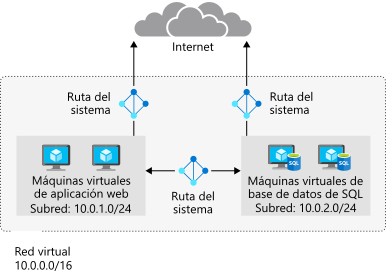
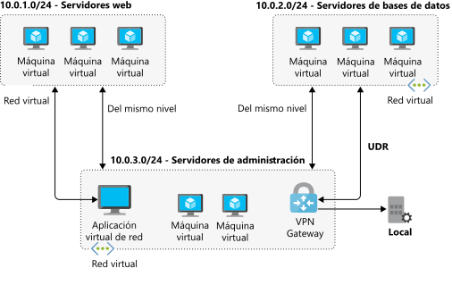
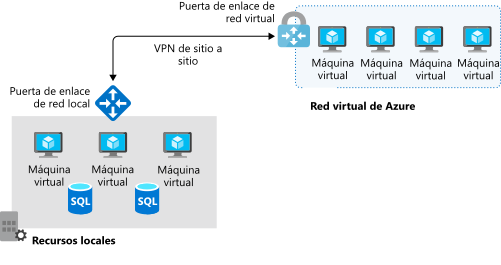
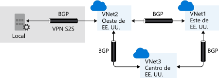
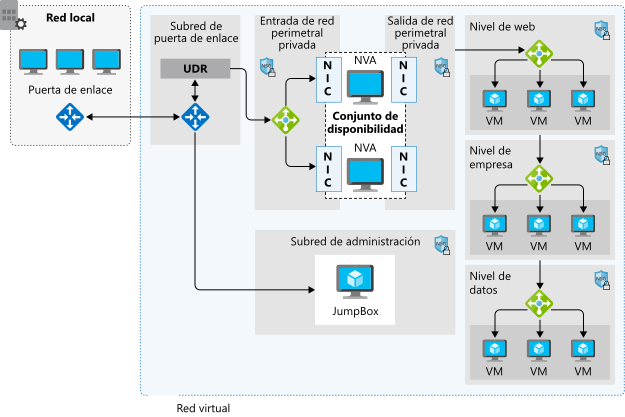

# AZ-104 — Administración y control del flujo de tráfico con rutas

Módulo 22 del [AZ-104T00](https://learn.microsoft.com/en-us/training/courses/az-104t00) ([ES](https://learn.microsoft.com/es-es/training/courses/az-104t00)) · Ruta 4 — Configuración y administración de redes virtuales · Área: Implementación y administración de redes virtuales (15–20%).

## Concepto

Controlar el tráfico de red virtual implementando rutas personalizadas: rutas definidas por el usuario (UDR) y sus hops siguientes.

## Resumen en mis palabras

> *(pendiente — rellenar al estudiar el módulo)*

## Por qué importa para el examen

> - Configuración de rutas definidas por el usuario (UDR, next hop)
> - Solución de problemas de conectividad de red (junto con Network Watcher: IP flow verify, next hop)

## Enlaces relacionados

**Módulo de Learn**: [Administración y control del flujo de tráfico en la implementación de Azure con rutas](https://learn.microsoft.com/en-us/training/modules/control-network-traffic-flow-with-routes/) ([ES](https://learn.microsoft.com/es-es/training/modules/control-network-traffic-flow-with-routes/))

**Savill**: buscar "route" / "UDR" en la [playlist AZ-104](https://www.youtube.com/playlist?list=PLlVtbbG169nGlGPWs9xaLKT1KfwqREHbs) · repaso final con el [Study Cram v2](https://www.youtube.com/watch?v=0Knf9nub4-k)

**Páginas de `knowledge/`**: [Azure Networking](azure-networking.md)

**Laboratorio**: sin lab dedicado — práctica libre en sandbox (rutas + verificación con Network Watcher). Ver [labs/AZ-104](../labs/AZ-104/)

# Introducción.

Una red virtual permite implementar un perímetro de seguridad en torno a los recursos en la nube. Puede controlar la información que entra y sale de una red virtual. También puede restringir el acceso para permitir solo el tráfico que se origina en fuentes de confianza.

Imagine que es el arquitecto de soluciones de una organización comercial. Imagine también que la organización ha sufrido recientemente un incidente de seguridad que ha expuesto información del cliente, como nombres, direcciones y números de tarjetas de crédito. Actores malintencionados han infiltrado vulnerabilidades en la infraestructura de red del minorista, lo que ha provocado la pérdida de información confidencial de los clientes.

Como parte de un plan de corrección, el equipo de seguridad recomienda agregar protecciones de red en forma de aplicaciones virtuales de red. El equipo de infraestructura de la nube debe asegurarse de que el tráfico se enruta correctamente a través de las aplicaciones virtuales y se inspecciona en busca de actividad malintencionada.

En este módulo obtendrá información sobre el enrutamiento de Azure y creará rutas personalizadas para controlar el flujo de tráfico. También aprenderá a redirigir el tráfico a través de la aplicación virtual de red para poder inspeccionarlo antes de que se le permita pasar.

## Objetivos de aprendizaje

Objetivos de este módulo:

- Identificar las funcionalidades de enrutamiento de una red virtual de Azure.
- Configurar el enrutamiento dentro de una red virtual.
- Implementar una aplicación virtual de red básica.
- Configurar el enrutamiento para enviar tráfico a través de una aplicación virtual de red.

# Identificación de la funcionalidad de enrutamiento de una red virtual de Azure.

Para controlar el flujo de tráfico dentro de la red virtual, debe conocer el propósito y las ventajas de las rutas personalizadas. También debe obtener información sobre cómo configurar las rutas para dirigir el flujo de tráfico a través de una aplicación virtual de red (NVA).

## Enrutamiento de Azure

El tráfico de red en Azure se enruta automáticamente entre las redes locales, las redes virtuales y las subredes de Azure. Las rutas del sistema controlan este enrutamiento. Se asignan de forma predeterminada a cada subred de una red virtual. Con estas rutas del sistema, cualquier máquina virtual de Azure que se implemente en una red virtual se puede comunicar con cualquier otra de la red. También se puede tener acceso a estas máquinas virtuales desde el entorno local a través de una red híbrida o de Internet.

No se pueden crear ni eliminar rutas del sistema, pero puede invalidar las rutas del sistema agregando rutas personalizadas para controlar el flujo de tráfico al próximo salto.

Cada subred tiene las rutas predeterminadas del sistema siguientes:

|Prefijo de dirección|Tipo del próximo salto|
|---|---|
|Único para la red virtual|Red virtual|
|0.0.0.0/0|Internet|
|10.0.0.0/8|Ninguno|
|172.16.0.0/12|Ninguno|
|192.168.0.0/16|Ninguno|
|100.64.0.0/10|Ninguno|

En la columna **Tipo de siguiente salto** se muestra la trayectoria de red que sigue el tráfico enviado a cada prefijo de dirección. La ruta de acceso puede ser uno de los siguientes tipos de salto:

- **Red virtual**: se crea una ruta en el prefijo de dirección. El prefijo representa cada intervalo de direcciones creado en el nivel de red virtual. Si se especifican varios intervalos de direcciones, se crean varias rutas para cada uno.
- **Internet**: la ruta predeterminada del sistema 0.0.0.0/0 enruta cualquier intervalo de direcciones a Internet, a menos que se reemplace la ruta predeterminada de Azure por una ruta personalizada.
- **Ninguno**: Se quita cualquier tráfico enrutado a este tipo de salto y no se enruta fuera de la subred. De forma predeterminada, se crean los siguientes prefijos de dirección privada IPv4: 10.0.0.0/8, 172.16.0.0/12 y 192.168.0.0/16. También se agrega el prefijo 100.64.0.0/10 para un espacio de direcciones compartido. Ninguno de estos intervalos de direcciones se puede enrutar globalmente.

En el diagrama siguiente se muestra información general sobre las rutas del sistema y cómo fluye el tráfico de forma predeterminada entre las subredes e Internet. En el diagrama puede ver que el tráfico fluye libremente entre las dos subredes e Internet.

Dentro de Azure hay otras rutas del sistema. Azure crea estas rutas si se habilitan las funcionalidades siguientes:

- Emparejamiento de redes virtuales
- Encadenamiento de servicios
- Puerta de enlace de red virtual
- Puntos de conexión de servicio de red virtual

### Emparejamiento de redes virtuales y encadenamiento de servicios

El emparejamiento de red virtual y el encadenamiento de servicios permiten que las redes virtuales de Azure se conecten entre sí. Con esta conexión, las máquinas virtuales se pueden comunicar entre sí dentro de la misma región o entre regiones. Esta comunicación, a su vez, crea más rutas dentro de la tabla de rutas predeterminada. El encadenamiento de servicios permite reemplazar estas rutas mediante la creación de rutas definidas por el usuario entre redes emparejadas.

En el diagrama siguiente se muestran dos redes virtuales con emparejamiento configurado. Las rutas definidas por el usuario están configuradas para enrutar el tráfico a través de una NVA o una puerta de enlace de VPN de Azure.

### Puerta de enlace de red virtual

Use una puerta de enlace de red virtual para enviar tráfico cifrado entre Azure y el entorno local a través de Internet, así como para enviar tráfico cifrado entre redes de Azure. Una puerta de enlace de red virtual contiene tablas de enrutamiento y servicios de puerta de enlace.

### Puntos de conexión de servicio de red virtual

Los puntos de conexión de red virtual amplían el espacio de direcciones privadas en Azure proporcionando una conexión directa a los recursos de Azure. Este conexión restringe el flujo de tráfico: las máquinas virtuales de Azure pueden acceder a la cuenta de almacenamiento directamente desde el espacio de direcciones privadas y denegar el acceso desde una máquina virtual pública. A medida que se habilitan los puntos de conexión de servicio, Azure crea rutas en la tabla de rutas para dirigir este tráfico.

## Rutas personalizadas

Es posible que las rutas del sistema faciliten la tarea de poner en marcha el entorno rápidamente. Sin embargo, hay muchos escenarios en los que querrá controlar más estrechamente el flujo de tráfico dentro de la red. Por ejemplo, es posible que quiera enrutar el tráfico a través de una NVA o de un firewall. Este control es posible con las rutas personalizadas.

Tiene dos opciones para implementar rutas personalizadas: crear una ruta definida por el usuario o usar el Protocolo de puerta de enlace de borde (BGP) para intercambiar rutas entre las redes locales y de Azure.

### Rutas definidas por el usuario

Una ruta definida por el usuario se puede usar para reemplazar las rutas predeterminadas del sistema para que el tráfico se pueda enrutar a través de firewalls o aplicaciones virtuales de red.

Por ejemplo, es posible que tenga una red con dos subredes y quiera agregar una máquina virtual en la red perimetral para usarla como firewall. Puede crear una ruta definida por el usuario para que el tráfico pase a través del firewall y no vaya directamente de una subred a otra.

Al crear rutas definidas por el usuario, se pueden especificar estos tipos de próximo salto:

- **Aplicación virtual**: suele ser un dispositivo de firewall que se usa para analizar o filtrar el tráfico que entra o sale de la red. Puede especificar la dirección IP privada de una tarjeta de interfaz de red (NIC) conectada a una máquina virtual para que se pueda habilitar el reenvío IP. O bien, puede proporcionar la dirección IP privada de un equilibrador de carga interno.
- **Puerta de enlace de red virtual**: se usa para indicar cuándo quiere que las rutas para una dirección específica se enruten a una puerta de enlace de red virtual. La puerta de enlace de la red virtual se especifica como una VPN para el siguiente tipo de salto.
- **Red virtual**: se usa para reemplazar la ruta predeterminada del sistema en una red virtual.
- **Internet**: se usa para enrutar el tráfico a un prefijo de dirección especificado que se enruta a Internet.
- **Ninguno**: se usa para quitar el tráfico enviado a un prefijo de dirección especificado.

Con las rutas definidas por el usuario, no se puede especificar el tipo de salto siguiente **VirtualNetworkServiceEndpoint**, que indica el emparejamiento de redes virtuales.

### Etiquetas de servicio para rutas definidas por el usuario

Puede especificar una etiqueta de servicio como prefijo de dirección de una ruta definida por el usuario en lugar de un intervalo IP explícito. Una etiqueta de servicio representa un grupo de prefijos de direcciones IP de un servicio de Azure determinado. Microsoft administra los prefijos de dirección incluidos en la etiqueta de servicio y actualiza automáticamente esta a medida que cambian las direcciones, lo que reduce la complejidad de las actualizaciones frecuentes a las rutas definidas por el usuario y el número de rutas que se deben crear.

### Protocolo de puerta de enlace de frontera

Una puerta de enlace de red en su red local puede intercambiar rutas con una puerta de enlace de red virtual en Azure mediante BGP. BGP es el protocolo de enrutamiento estándar que se usa habitualmente para el intercambio de información de enrutamiento entre dos o más redes. BGP se usa para transferir datos e información entre sistemas autónomos en Internet, como puertas de enlace de host diferentes.

Normalmente se usa BGP para anunciar rutas locales en Azure cuando se está conectado a un centro de datos de Azure a través de Azure ExpressRoute. También puede configurar BGP si se conecta a una red virtual de Azure con una conexión VPN de sitio a sitio.

En el diagrama siguiente se muestra una topología con rutas de acceso que permiten la transferencia de datos entre Azure VPN Gateway y redes locales:

BGP ofrece estabilidad de red porque los enrutadores pueden cambiar rápidamente las conexiones para enviar paquetes si una ruta de conexión deja de funcionar.

## Selección de rutas y prioridad

Si hay varias rutas disponibles en una tabla de rutas, Azure usa la ruta con la coincidencia de prefijo más larga. Por ejemplo, se envía un mensaje a la dirección IP 10.0.0.2, pero hay dos rutas disponibles con los prefijos 10.0.0.0/16 y 10.0.0.0/24. Azure selecciona la ruta con el prefijo 10.0.0.0/24 porque es más específico.

Cuanto más largo sea el prefijo de ruta, más corta será la lista de direcciones IP disponibles a través de ese prefijo. Cuando se usan prefijos más largos, el algoritmo de enrutamiento puede seleccionar la dirección deseada más rápidamente.

No se pueden configurar varias rutas definidas por el usuario con el mismo prefijo de dirección.

Si hay varias rutas con el mismo prefijo de dirección, Azure selecciona la ruta según el tipo, con el orden de prioridad siguiente:

1. Rutas definidas por el usuario
2. Rutas BGP
3. Rutas del sistema

# Ejercicio: Creación de rutas personalizadas.

[Ejercicio interactivo en Microsoft Learn](https://learn.microsoft.com/es-es/training/modules/control-network-traffic-flow-with-routes/3-exercise-create-custom-routes)

# ¿Qué es una NVA (Network Virtual Appliance)?.

Una aplicación virtual de red (NVA) es una aplicación virtual que se compone de varias capas como las siguientes:

- Un firewall
- Un optimizador de WAN
- Controladores de entrega de aplicaciones
- Enrutadores
- Equilibradores de carga
- IDS/IPS
- Proxies

Puede implementar NVA que seleccione de proveedores en Azure Marketplace. Estos proveedores incluyen Cisco, Check Point, Barracuda, Sophos, WatchGuard y SonicWall. Puede usar una aplicación virtual de red para filtrar el tráfico de entrada a una red virtual, bloquear solicitudes malintencionadas y bloquear solicitudes realizadas desde recursos inesperados.

En el escenario de ejemplo de la organización comercial, debe trabajar con los equipos de seguridad y de red. Quiere implementar un entorno seguro que examine todo el tráfico entrante y bloquee el tráfico no autorizado para que no pase a la red interna. Como parte de la estrategia de seguridad de red de la empresa, también quiere proteger las redes de máquinas virtuales y las de los servicios de Azure.

El objetivo es impedir que el tráfico de red no seguro o no deseado llegue a los sistemas clave.

Como parte de la estrategia de seguridad de red, debe controlar el flujo de tráfico dentro de la red virtual. También debe conocer el rol de una NVA y la ventaja de usarla para controlar el flujo de tráfico a través de una red de Azure.

## Aplicación virtual de red

Las aplicaciones virtuales de red (NVA) son máquinas virtuales que controlan el flujo del tráfico de red mediante el control del enrutamiento. Se suelen usar para administrar el flujo de tráfico desde un entorno de red perimetral a otras redes o subredes.

Puede implementar aplicaciones de firewall en una red virtual con distintas configuraciones. Puede colocar una aplicación de firewall en una subred de red perimetral en la red virtual o si quiere tener un mayor control de la seguridad, implemente un enfoque de microsegmentación.

Con el enfoque de microsegmentación puede crear subredes dedicadas para el firewall y luego implementar aplicaciones web y otros servicios en otras subredes. Todo el tráfico se enruta a través del firewall y lo inspeccionan las NVA. Habilitará el reenvío en las interfaces de red de aplicaciones virtuales para pasar el tráfico que acepta la subred adecuada.

La microsegmentación permite al firewall inspeccionar todos los paquetes en la capa 4 OSI y, en el caso de las aplicaciones compatibles con aplicaciones, en la capa 7. Al implementar una NVA en Azure, actúa como un enrutador que reenvía las solicitudes entre las subredes de la red virtual.

Algunas NVA requieren varias interfaces de red. Una interfaz de red está dedicada a la red de administración para la aplicación. Las interfaces de red adicionales administran y controlan el procesamiento del tráfico. Una vez implementada la NVA, se puede configurar para enrutar el tráfico a través de la interfaz adecuada.

### Rutas definidas por el usuario

En la mayoría de los entornos, las rutas predeterminadas del sistema ya definidas por Azure son suficientes para poner en marcha los entornos. En ciertos casos, hay que crear una tabla de enrutamiento y agregar rutas personalizadas. Algunos ejemplos son los siguientes:

- Acceso a Internet a través de una red local con tunelización forzada
- Uso de aplicaciones virtuales para controlar el flujo de tráfico

Puede crear varias tablas de rutas en Azure. Cada tabla de enrutamiento se puede asociar con una o más subredes. Una subred solo se puede asociar con una tabla de rutas.

## Aplicaciones virtuales de red en una arquitectura de alta disponibilidad

Si el tráfico se enruta a través de una NVA, esta se convierte en una parte fundamental de la infraestructura. Cualquier error de NVA afectará directamente a la capacidad de los servicios para comunicarse. Es importante incluir una arquitectura de alta disponibilidad en la implementación de NVA.

Hay varios métodos para lograr una alta disponibilidad cuando se usan NVA. Al final de este módulo encontrará más información sobre el uso de NVA en escenarios de alta disponibilidad.

# Ejercicio: Creación de una NVA y máquinas virtuales.

[Ejercicio interactivo en Microsoft Learn](https://learn.microsoft.com/es-es/training/modules/control-network-traffic-flow-with-routes/5-exercise-create-nva-vm)

# Ejercicio: Enrutamiento del tráfico a través de la NVA.

[Ejercicio interactivo en Microsoft Learn](https://learn.microsoft.com/es-es/training/modules/control-network-traffic-flow-with-routes/6-exercise-route-traffic-through-nva)

# Resumen.

En este módulo, ha aprendido a personalizar rutas en una red virtual de Azure y cómo redirigir el flujo de tráfico a través de una aplicación virtual de red. También ha aprendido a crear una aplicación virtual de red personalizada propia mediante la implementación de una máquina virtual de Azure.

> [!NOTE] Importante 
> En los ejercicios opcionales de este módulo, ha creado recursos mediante su propia suscripción de Azure. Limpie estos recursos para que no se le siga cobrando por ellos.

## Relacionado

- [Índice AZ-104](../certifications/AZ-104/INDEX.md)
- [Azure Networking](azure-networking.md)
