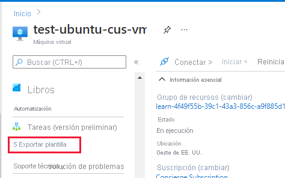
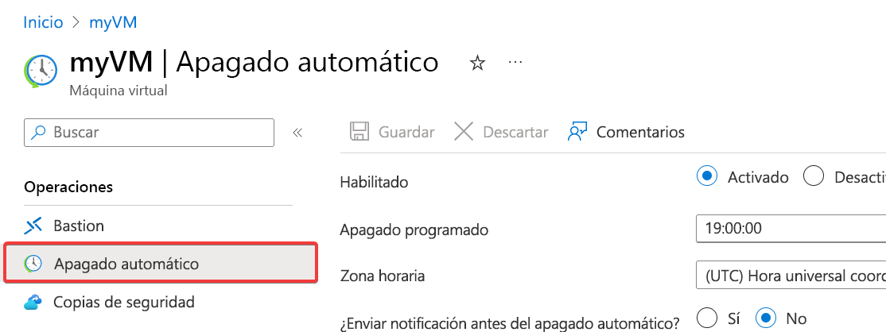
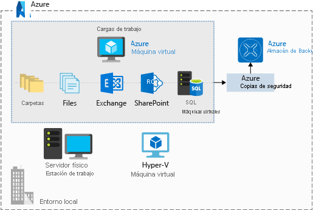
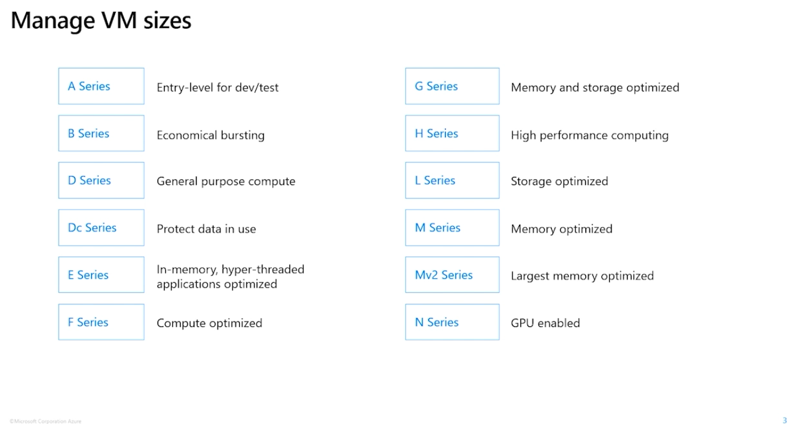

# AZ-104 — Introducción a Azure Virtual Machines

Módulo 13 del [AZ-104T00](https://learn.microsoft.com/en-us/training/courses/az-104t00) ([ES](https://learn.microsoft.com/es-es/training/courses/az-104t00)) · Ruta 3 — Implementación y administración de recursos de procesos de Azure · Área: Implementación y administración de recursos de procesos de Azure (20–25%).

## Concepto

Decisiones previas a crear una VM, opciones de creación y administración, extensiones y servicios de administración.

## Resumen en mis palabras

> *(pendiente — rellenar al estudiar el módulo)*

## Por qué importa para el examen

> - Creación de una máquina virtual (portal, CLI, PowerShell, ARM/Bicep)
> - Administración de los tamaños de máquina virtual (cambio de tamaño)
> - Administración de discos de máquinas virtuales (tipos, añadir/adjuntar)
> - Del mismo grupo (cubrir con labs): cifrado en el host, mover VM entre RG/suscripción/región

## Enlaces relacionados

**Módulo de Learn**: [Introducción a Azure Virtual Machines](https://learn.microsoft.com/en-us/training/modules/intro-to-azure-virtual-machines/) ([ES](https://learn.microsoft.com/es-es/training/modules/intro-to-azure-virtual-machines/))

**Savill**: buscar "VM" en la [playlist AZ-104](https://www.youtube.com/playlist?list=PLlVtbbG169nGlGPWs9xaLKT1KfwqREHbs) · repaso final con el [Study Cram v2](https://www.youtube.com/watch?v=0Knf9nub4-k)

**Páginas de `knowledge/`**: [[Servicios de proceso de Azure (AZ-900)]]

**Laboratorio**: Lab 08 (Manage Virtual Machines) de [MicrosoftLearning/AZ-104](https://github.com/MicrosoftLearning/AZ-104-MicrosoftAzureAdministrator) — ver [labs/AZ-104](../labs/AZ-104/README.md)
## Objetivos de aprendizaje

En este módulo aprenderá a:

- Crear una lista de comprobación para crear una máquina virtual
- Describir las opciones para crear y administrar máquinas virtuales
- Describir los otros servicios disponibles para administrar máquinas virtuales


# Introducción.

Supongamos que trabaja para una empresa que lleva a cabo investigaciones médicas y que es responsable de administrar los servidores locales. Los servidores que administra ejecutan toda la infraestructura de la empresa, desde los servidores web hasta las bases de datos. Sin embargo, el hardware se está quedando obsoleto y empieza a tener dificultades para mantenerse al día con algunas de las nuevas aplicaciones de análisis de datos que se implementan en él.

Podría actualizar todo el hardware, pero esa opción no resulta atractiva por varias razones:

- Los servidores están físicamente dispersos por todo el mundo con un personal mínimo en cada ubicación. Nos gustaría centralizar la actualización en nuestra oficina principal.
    
- La empresa ejecuta un software de análisis de datos personalizado con varias versiones y distintas versiones de Windows y Linux, a veces con configuraciones extrañas no siempre comprensibles. Necesitamos una forma de probar nuestras implementaciones completamente y probar otras configuraciones diferentes para asegurarnos de que todo funciona antes de realizar la transición del trabajo.
    
- El negocio está en alza y la empresa está creciendo rápido. Es probable que la carga de los servidores internos, especialmente la de las bases de datos, continúe creciendo. Este crecimiento nos obliga a realizar nuevas compras en el futuro o a proponer un plan de escalado para administrar el crecimiento.
    

Por estos motivos, decide que es el momento de explorar la nube para ver si puede ayudarle a solucionar el problema de carga y de escalado. Como tiene varios servidores mixtos y software personalizado, es lógico intentar moverlos de uno en uno a Azure mediante máquinas virtuales (VM) de Azure.

Las máquinas virtuales de Azure son uno de los diversos tipos de recursos de proceso a petición y escalables que ofrece Azure. Con las máquinas virtuales, tiene un control total sobre la configuración y puede instalar todo lo que necesite para realizar el trabajo. No es necesario comprar hardware físico para escalar o ampliar su centro de datos. Por último, Azure proporciona otros servicios para supervisar, proteger y administrar las actualizaciones y revisiones del sistema operativo.

Vamos a observar las decisiones tomadas antes de crear una máquina virtual, las opciones para crear y administrar la máquina virtual, y las extensiones y servicios que usa para administrarla.

# Crear una lista de comprobación para crear una máquina virtual de Azure


La migración de los servidores locales a Azure requiere planeamiento y atención. Puede moverlos todos al mismo tiempo o, lo que es más probable, en lotes pequeños o incluso individualmente. Antes de crear una sola máquina virtual, debe reflexionar y esbozar el modelo de infraestructura actual y ver cómo puede asignarse a la nube.

## ¿Qué es un recurso de Azure?

Un **recurso de Azure** es un elemento fácil de administrar en Azure. Al igual que un equipo físico del centro de datos, las máquinas virtuales tienen varios elementos que son necesarios para realizar su trabajo:

- La propia máquina virtual
- Discos de almacenamiento
- Red de área virtual
- Una interfaz de red para comunicarse en la red virtual
- Grupo de seguridad de red (NSG) para proteger el tráfico de red
- Una dirección IP (pública, privada o ambas)

Azure crea todos estos recursos si es necesario, o bien puede proporcionar los ya existentes como parte del proceso de implementación. Cada recurso necesita un nombre, que se utiliza para identificarlo. Si Azure crea el recurso, usa el nombre de la máquina virtual para generar un nombre de recurso. Esta es otra razón por la que es muy importante mantener la coherencia de los nombres de máquina virtual.

## Recursos necesarios para las máquinas virtuales de IaaS

Vamos a repasar una lista de comprobación con los elementos sobre los que hay que reflexionar.

- La red
- Nombre de la máquina virtual
- Location
- El tamaño de la máquina virtual
- Discos
- Sistema operativo

## La red

Lo primero en lo que debe pensar no tiene nada que ver con la máquina virtual, sino con la red. Eche un vistazo a los servidores locales:

- ¿Con qué se comunica el servidor?
- ¿Qué puertos están abiertos?

Las redes virtuales se usan en Azure para proporcionar conectividad privada entre Azure Virtual Machines y otros servicios de Azure. Las máquinas virtuales y servicios que forman parte de la misma red virtual tienen acceso mutuo. De manera predeterminada, los servicios fuera de la red virtual no se pueden conectar a los servicios dentro de la red virtual. No obstante, puede configurar la red para permitir el acceso a un servicio externo, incluido el acceso a los servidores locales.

Esto último es el motivo por el que debe invertir algún tiempo en reflexionar sobre la configuración de la red. Las direcciones de red y las subredes no necesitan cambios triviales una vez que se configuran. Si pretende conectar la red privada de la empresa a los servicios de Azure, querrá estar seguro de que se tiene en cuenta la topología antes de poner en marcha una máquina virtual.

Cuando configura una red virtual, puede especificar los espacios de direcciones disponibles, las subredes y la seguridad. Si la red virtual se conecta a otras redes virtuales, es preciso seleccionar intervalos de direcciones que no se superpongan. Este es el intervalo de direcciones privadas que pueden usar las máquinas virtuales y los servicios de la red. Puede usar direcciones IP no enrutables, como 10.0.0.0/8, 172.16.0.0/12 o 192.168.0.0/16, o definir su propio intervalo. Azure trata todos los intervalos de direcciones como parte del espacio de direcciones IP de la red virtual privada si solo se puede acceder a esta desde dentro de la red virtual, desde dentro de redes virtuales interconectadas y desde su ubicación local. Si hay otro responsable de las redes internas, debe colaborar con esa persona antes de seleccionar el espacio de direcciones para asegurarse de que no hay ninguna superposición. Infórmele acerca del espacio que desea usar, con el fin de que no intente usar el mismo intervalo de direcciones IP.

### Segregación de la red

Después de decidir los espacios de direcciones de la red virtual, puede crear una o varias subredes. Crea estas subredes para dividir la red en secciones más fáciles de administrar. Por ejemplo, podría asignar 10.1.0.0 a las máquinas virtuales, 10.2.0.0 a los servicios back-end y 10.3.0.0 a las máquinas virtuales con SQL Server.

> [!NOTE] Nota:> 
> Azure reserva las cuatro primeras direcciones y la última de cada subred para uso interno.

### Protección de la red

De forma predeterminada, no hay ningún límite de seguridad entre subredes, por lo que los servicios de cada una de estas subredes pueden comunicarse entre sí. Sin embargo, se pueden configurar grupos de seguridad de red (NSG -> Network Security Group), que permiten controlar el flujo de tráfico que llega y sale tanto de las subredes como de las máquinas virtuales. Los grupos de seguridad de red actúan como firewalls de software que aplican reglas personalizadas a cada solicitud entrante o saliente en el nivel de interfaz de red y de subred. Así pues, puede controlar completamente cada solicitud de red que entra o sale de la máquina virtual.

## Planeamiento de la implementación de cada máquina virtual

Una vez que ha configurado la comunicación y los requisitos de red, puede empezar a pensar en las máquinas virtuales que desea crear. Una buena idea es seleccionar un servidor y hacer un inventario:

- ¿Qué sistema operativo se usa?
- ¿Cuánto espacio en disco está en uso?
- ¿Qué tipo de datos usa? ¿Hay restricciones (legales o de otra índole) en torno a cómo se almacenan o dónde se encuentran físicamente?
- ¿Qué tipo de CPU, memoria y carga de E/S de disco tiene el servidor? ¿Hay picos de tráfico que se deban tener en cuenta?

A continuación, podemos comenzar a dar respuesta a algunas de las preguntas de Azure con respecto a una nueva máquina virtual.

### Nombre de la máquina virtual

El nombre de la máquina virtual se usa como nombre del equipo, que está configurado como parte del sistema operativo. Puede especificar un nombre de hasta 64 caracteres en una máquina virtual de Linux y hasta 15 caracteres en una máquina virtual de Windows.

Este nombre también permite definir un **recurso de Azure** administrable y no es fácil de cambiar más tarde. Esto significa que debe elegir nombres que sean significativos y coherentes para que pueda identificar fácilmente qué hace la máquina virtual. Una buena convención es incluir la siguiente información en el nombre:

|Elemento|Ejemplo|Notas|
|---|---|---|
|Entorno|desarrollo, producción, control de calidad|Identifica el entorno del recurso|
|Location|`eus` para el Este de EE. UU., `jw` para el Oeste de Japón|Identifica la región en la que se implementa el recurso|
|Instancia|01, 02|Para los recursos que tienen más de una instancia con nombre (servidores web, etc.).|
|Producto o servicio|servicio|Identifica el producto, la aplicación o el servicio que admite el recurso|
|Rol|sql, web, mensajería|Identifica el rol del recurso asociado|

Por ejemplo, `deveus-webvm01` podría representar el primer servidor web de desarrollo hospedado en la ubicación Este de EE. UU.

### Decidir la ubicación de la máquina virtual

Azure tiene centros de datos distribuidos por todo el mundo dotados de servidores y discos. Estos centros de datos se agrupan en _regiones_ geográficas ("Oeste de EE. UU", "Norte de Europa", "Sudeste Asiático", etc) para proporcionar redundancia y disponibilidad.

Al crear e implementar una máquina virtual, debe seleccionar la región en la que quiere asignar los recursos. Puede colocar las máquinas virtuales lo más cerca posible de los usuarios para mejorar el rendimiento y cumplir con todos los requisitos legales, de cumplimiento o fiscales.

Otras dos cosas en las que pensar con respecto a la opción de ubicación. En primer lugar, la ubicación puede limitar las opciones disponibles. Cada región tiene un hardware diferente disponible y algunas configuraciones no están disponibles en todas las regiones. En segundo lugar, hay diferencias de precio entre las ubicaciones. Si la carga de trabajo no está enlazada a una ubicación específica, puede ser muy rentable comprobar la configuración necesaria en varias regiones para encontrar el precio más bajo.

### Determinación del tamaño de la máquina virtual

Una vez que ha establecido el nombre y la ubicación, debe decidir [el tamaño de la máquina virtual](https://learn.microsoft.com/es-es/azure/virtual-machines/sizes). En lugar de especificar la capacidad de procesamiento, memoria y almacenamiento por separado, Azure proporciona diferentes _tamaños de máquina virtual_ que ofrecen variaciones de estos elementos en diferentes tamaños. Azure proporciona una amplia gama de opciones de tamaño de máquina virtual, lo que le permite seleccionar la combinación adecuada de capacidad de proceso, memoria y almacenamiento para las tareas que desea realizar.

La mejor manera de determinar el tamaño de máquina virtual adecuado es tener en cuenta el tipo de carga de trabajo que la máquina virtual debe ejecutar. Según la carga de trabajo, podrá elegir entre un subconjunto de tamaños de máquina virtual disponibles. Las opciones de carga de trabajo se clasifican como se indica a continuación en Azure:

|Opción|Descripción|
|---|---|
|[De uso general](https://learn.microsoft.com/es-es/azure/virtual-machines/sizes-general)|Los tamaños de máquina virtual de uso general están diseñados para proporcionar una relación equilibrada entre CPU y memoria. Ideal para desarrollo y pruebas, bases de datos pequeñas o medianas, y servidores web de tráfico bajo o medio.|
|[Optimizada para proceso](https://learn.microsoft.com/es-es/azure/virtual-machines/sizes-compute)|Las máquinas virtuales optimizadas para proceso están diseñadas para proporcionar una relación alta entre CPU y memoria. Es un tamaño adecuado para servidores web de tráfico medio, aplicaciones de red, procesos por lotes y servidores de aplicaciones.|
|[Optimizada para memoria](https://learn.microsoft.com/es-es/azure/virtual-machines/sizes-memory)|Las máquinas virtuales optimizadas para memoria están diseñadas para proporcionar una relación alta entre memoria y CPU. Excelente para servidores de bases de datos relacionales, memorias caché de capacidad media o grande y análisis en memoria.|
|[Optimizada para almacenamiento](https://learn.microsoft.com/es-es/azure/virtual-machines/sizes-storage)|Las máquinas virtuales optimizadas para almacenamiento están diseñadas para tener un alto rendimiento de disco y E/S. Es un tamaño ideal para máquinas virtuales que ejecutan bases de datos.|
|[GPU](https://learn.microsoft.com/es-es/azure/virtual-machines/sizes-gpu)|Las máquinas virtuales de GPU son máquinas virtuales especializadas específicas para la representación de gráficos pesados y la edición de vídeo. Estas máquinas virtuales son la opción ideal para el entrenamiento de modelos y la realización de inferencias con aprendizaje profundo.|
|[Proceso de alto rendimiento](https://learn.microsoft.com/es-es/azure/virtual-machines/sizes-hpc)|Las de informática de alto rendimiento son las máquinas virtuales de CPU más rápidas y potentes con interfaces de red de alto rendimiento opcionales.|
### Familias de VM de Azure con ejemplos

|Familia|Series / tamaños de ejemplo|Ejemplos de cargas de trabajo|
|---|---|---|
|**General purpose**|B2s, D2s_v5, D4s_v5|Servidor web con poco tráfico, entornos de desarrollo y pruebas, servidor de aplicaciones pequeño, controlador de dominio, base de datos pequeña|
|**Compute optimized**|F4s_v2, F8s_v2|**Appliances de red** (firewall, proxy inverso, balanceador), servidor web con tráfico medio, procesamiento por lotes, juegos en servidor, compilación (CI)|
|**Memory optimized**|E4s_v5, E8s_v5, M-series|SQL Server o PostgreSQL grandes, SAP HANA, Redis o cachés en memoria, análisis de datos|
|**Storage optimized**|L8s_v3, L16s_v3|Big data, bases de datos NoSQL (Cassandra, MongoDB), data warehouses, logs con mucho acceso a disco|
|**GPU**|NC, ND, NV series|Entrenamiento e inferencia de IA, renderizado 3D, edición de vídeo, escritorios virtuales con gráficos|
|**High performance compute**|HB, HC series|Simulaciones científicas, dinámica de fluidos, modelado financiero, análisis genómico|

### Regla rápida para el examen

| Si el enunciado dice...                        | Elige                    |
| ---------------------------------------------- | ------------------------ |
| Pruebas, desarrollo, web pequeña, uso general  | General purpose          |
| Appliance de red, CPU intensiva, tráfico medio | Compute optimized        |
| Base de datos grande, caché en memoria         | Memory optimized         |
| Mucho throughput de disco, big data            | Storage optimized        |
| IA, renderizado, gráficos                      | GPU                      |
| Simulaciones, cálculo científico               | High performance compute |
Podrá filtrar según el tipo de carga de trabajo cuando configure el tamaño de máquina virtual de Azure. El tamaño que elija influye directamente en el costo del servicio. Cuanto mayor sea la capacidad de CPU, memoria y GPU que necesite, mayor será el precio.

### ¿Qué ocurre si mis necesidades de tamaño cambian?

Azure le permite cambiar el tamaño de la máquina virtual cuando el tamaño existente ya no cumpla con sus necesidades. Puedes actualizar o cambiar a una versión anterior la máquina virtual, siempre y cuando se permita la configuración del hardware actual en el nuevo tamaño. La capacidad de cambiar el tamaño de la máquina virtual proporciona un enfoque totalmente ágil y escalable para la administración de máquinas virtuales.

Se puede cambiar el tamaño de máquina virtual mientras esta se está ejecutando, siempre que el nuevo tamaño esté disponible en el clúster de hardware actual en el que se está ejecutando la máquina virtual. Azure Portal hace que las opciones de tamaño resulten evidentes mostrándole solo las opciones de tamaño disponibles. Las herramientas de línea de comandos notifican un error si intenta cambiar el tamaño de una máquina virtual a un tamaño que no está disponible. Cambiar el tamaño de una máquina virtual en ejecución hace que esta se reinicie de forma automática para completar la solicitud.

Si detiene y desasigna la máquina virtual, entonces puede seleccionar cualquier tamaño disponible en su región, ya que la desasignación quita la máquina virtual del clúster en el que se estaba ejecutando.

> [!WARNING] Advertencia
> Tenga cuidado al cambiar el tamaño de las máquinas virtuales de producción, ya que se reiniciarán automáticamente, lo que puede provocar una interrupción temporal y cambiar algunos valores de configuración, como la dirección IP.

### Partes de una máquina virtual y cómo se facturan

Al crear una máquina virtual, también va a crear recursos que admitan la máquina virtual. Estos recursos incluyen sus propios costos, que se deben tener en cuenta.

Los recursos predeterminados que admiten una máquina virtual y cómo se facturan se detallan en la tabla siguiente:

|Resource|Descripción|Coste|
|---|---|---|
|Red de área virtual|Para proporcionar a la máquina virtual la capacidad de comunicarse con otros recursos|[Precios de Virtual Network](https://azure.microsoft.com/pricing/details/virtual-network/)|
|Una tarjeta de interfaz de red virtual (NIC)|Para conectarse a la red virtual|No hay ningún costo específico para las NIC. Sin embargo, hay un límite para el número de NIC que puede usar en función del [tamaño de la máquina virtual](https://learn.microsoft.com/es-es/azure/virtual-machines/sizes). Ajuste el tamaño de la máquina virtual en consecuencia y consulte los [precios de máquina virtual](https://azure.microsoft.com/pricing/details/virtual-machines/linux/).|
|Una dirección IP privada y a veces una dirección IP pública.|Para la comunicación y el intercambio de datos en la red propia y con redes externas|[Precios de direcciones IP](https://azure.microsoft.com/pricing/details/ip-addresses/)|
|Grupo de seguridad de red (NSG)|Para administrar el tráfico de red también y desde la máquina virtual. Por ejemplo, es posible que tenga que abrir el puerto 22 para el acceso SSH, pero es posible que desee bloquear el tráfico al puerto 80. El bloqueo y la habilitación del acceso al puerto se realiza a través del grupo de seguridad de red.|No hay cargos adicionales por los grupos de seguridad de red en Azure.|
|Disco del sistema operativo y posiblemente discos independientes para los datos.|Se recomienda mantener los datos en un disco independiente del sistema operativo, ya que, en caso de que alguna vez se produzca un error en una máquina virtual, simplemente puede desasociar el disco de datos y conectarlo a una nueva máquina virtual.|Todas las máquinas virtuales nuevas tienen un disco de sistema operativo y un disco local.  <br>Azure no aplica ningún cargo por el almacenamiento en disco local.  <br>El cargo que se aplica por el disco del sistema operativo, que normalmente es de 127 GiB pero que es más pequeño para algunas imágenes, es la [tarifa normal de los discos](https://azure.microsoft.com/pricing/details/managed-disks/).  <br>Puede ver el costo de conectar discos prémium (basados en SSD) y estándar (basados en HDD) a las máquinas virtuales en la [página de precios de Managed Disks](https://azure.microsoft.com/pricing/details/managed-disks/).|
|En algunos casos, una licencia para el sistema operativo|Para proporcionar las ejecuciones de la máquina virtual para ejecutar el sistema operativo|El costo varía en función del número de núcleos de la máquina virtual, por lo que debe [ajustar el tamaño de la máquina virtual en consecuencia](https://learn.microsoft.com/es-es/azure/virtual-machines/sizes). El costo se puede reducir a través de la [Ventaja híbrida de Azure](https://azure.microsoft.com/pricing/hybrid-benefit/#overview).|

### Descripción del modelo de precios

Hay dos costos independientes por los que se cobra en la suscripción de cada máquina virtual: proceso y almacenamiento. Al separar estos costos, los puede escalar por separado y pagar solo por lo que necesita.

**Costos de proceso**: los gastos de proceso tienen un precio por horas pero se facturan por minutos. Por ejemplo, solo se le cobrarán 55 minutos de uso si la máquina virtual se implementa durante ese tiempo. No se le cobrará por la capacidad de proceso si detiene y desasigna la máquina virtual ya que la desasignación libera el hardware. El precio por horas varía en función del tamaño de máquina virtual y del sistema operativo que seleccione. Las instancias basadas en Linux son más baratas porque no hay gastos por licencia del sistema operativo. Para Windows, el costo de una máquina virtual incluye los gastos por el sistema operativo.

> [!TIP] Sugerencia
> Puede ahorrar dinero mediante la reutilización de las licencias existentes con la **Ventaja híbrida de Azure** para [Linux](https://learn.microsoft.com/es-es/azure/virtual-machines/linux/azure-hybrid-benefit-linux) o [Windows](https://learn.microsoft.com/es-es/azure/virtual-machines/windows/hybrid-use-benefit-licensing).> 
> Podrá elegir entre dos opciones de pago para los costos de proceso.

|Opción|Descripción|
|---|---|
|**Pago por uso**|Con la opción de **pago por uso**, paga por la capacidad de proceso por segundo, sin ningún tipo de compromiso a largo plazo ni pago por adelantado. Podrá aumentar o disminuir la capacidad de proceso a petición, así como iniciarla o detenerla en cualquier momento. Seleccione esta opción si ejecuta aplicaciones con cargas de trabajo a corto plazo o impredecibles que no se pueden interrumpir. Por ejemplo, si va a realizar una prueba rápida o a desarrollar una aplicación en una máquina virtual, el **pago por uso** es la opción adecuada.|
|**Instancias reservadas de máquina virtual**|La opción de instancias reservadas de máquina virtual (RI) es una compra por adelantado de una máquina virtual para uno o tres años en una región determinada. El compromiso se realiza por adelantado y, a cambio, se obtiene una rebaja en el precio de hasta un 72 % en comparación con los precios de pago por uso. Las **instancias reservadas** son flexibles y se pueden intercambiar o devolver fácilmente a cambio de una tarifa por cancelación anticipada. Seleccione esta opción si la máquina virtual debe estar en ejecución continuamente o si necesita realizar una estimación presupuestaria, **y** puede comprometerse a usar la máquina virtual durante un año como mínimo.|

**Costes de almacenamiento**: se le cobran por separado en función del almacenamiento que usa la máquina virtual. El estado de la máquina virtual no tiene ninguna relación con los cargos de almacenamiento en los que se incurre. Si la máquina virtual está detenida o desasignada y no se le factura por la máquina virtual en ejecución, se le seguirá cobrando por el almacenamiento que usan los discos.

### Almacenamiento de la máquina virtual

Todas las máquinas virtuales de Azure tienen al menos dos discos duros virtuales (VHD). El primer disco almacena el sistema operativo y el segundo se usa como almacenamiento temporal. Debe agregar más discos de datos para almacenar los datos de la aplicación. Separar los datos en discos diferentes le permite administrar los discos de forma independiente. El tamaño de la máquina virtual determina el número máximo de discos de datos que puede conectar a la máquina virtual, normalmente dos por vCPU.

Hay cinco tipos de disco, cada uno destinado a abordar un escenario de cliente específico:

- [Discos Ultra](https://learn.microsoft.com/es-es/azure/virtual-machines/disks-types#ultra-disks)
- [SSD prémium v2 (versión preliminar)](https://learn.microsoft.com/es-es/azure/virtual-machines/disks-types#premium-ssd-v2-preview)
- [Discos SSD prémium (unidades de estado sólido)](https://learn.microsoft.com/es-es/azure/virtual-machines/disks-types#premium-ssds)
- [Discos SSD estándar](https://learn.microsoft.com/es-es/azure/virtual-machines/disks-types#standard-ssds)
- [Discos HDD estándar (unidades de disco duro)](https://learn.microsoft.com/es-es/azure/virtual-machines/disks-types#standard-hdds)

En la tabla siguiente se proporciona una comparación de los cinco tipos de disco para ayudarle a decidir cuál usar.

|Disco Ultra|SSD prémium v2|SSD Premium|SSD estándar|HDD estándar|
|---|---|---|---|---|---|
|Tipo de disco|SSD|SSD|SSD|SSD|HDD|
|Escenario|Cargas de trabajo de uso intensivo de E/S, como [SAP HANA](https://learn.microsoft.com/es-es/azure/virtual-machines/workloads/sap/hana-vm-operations-storage), bases de datos de nivel superior (por ejemplo, SQL y Oracle) y otras cargas de trabajo con muchas transacciones.|Cargas de trabajo de producción y sensibles al rendimiento que requieren constantemente baja latencia, un alto número de IOPS y rendimiento elevado|Cargas de trabajo delicadas de producción y rendimiento|Servidores web, aplicaciones empresariales poco utilizadas y desarrollo y pruebas|Copia de seguridad, no crítico, acceso poco frecuente|
|Tamaño máximo del disco|65 536 gibibytes (GiB)|65 536 GiB|32 767 GiB|32 767 GiB|32 767 GiB|
|Rendimiento máx.|4000 MB/s|1200 MB/s|900 MB/s|750 MB/s|500 MB/s|
|IOPS máx.|160 000|80 000|20.000|6,000|2\.000|
|¿Se puede usar como disco del sistema operativo?|No|No|Sí|Sí|Sí|

### Selección de un sistema operativo

Azure proporciona varias imágenes del sistema operativo que puede instalar en la máquina virtual, incluidas muchas distribuciones de Linux. La elección del sistema operativo puede influir en el precio por horas de proceso ya que Azure incluye el costo por la licencia del sistema operativo en el precio.

Si busca algo más que imágenes básicas del sistema operativo, puede buscar en Azure Marketplace imágenes más sofisticadas que incluyan el sistema operativo y las herramientas de software más conocidas para escenarios específicos. Por ejemplo, si necesita un nuevo sitio de WordPress, el componente tecnológico estándar debe consistir en un servidor Linux, un servidor web Apache, una base de datos MySQL y PHP. En lugar de instalar y configurar cada componente, puede usar una imagen de Marketplace e instalar todo el componente completo a la vez.

Por último, si no encuentra una imagen de sistema operativo adecuada, puede crear las suyas propias con lo que necesita y usarlas para crear máquinas virtuales. Puede crear imágenes individuales para usarlas en desarrollo y pruebas. Puede crear una instancia de [Azure Compute Gallery](https://learn.microsoft.com/es-es/azure/virtual-machines/azure-compute-gallery) para administrar varias imágenes y replicarlas en las regiones en las que se necesitan.
# Ejercicio: Creación de una máquina virtual desde Azure Portal.

[[Creación de una VM.]]


# Descripción de las opciones disponibles para crear y administrar una máquina virtual de Azure.

Azure Portal es la manera más sencilla de crear recursos como máquinas virtuales al empezar a trabajar. Sin embargo, no es necesariamente la manera más eficaz o rápida de trabajar con Azure, especialmente si necesita crear varios recursos juntos. En nuestro caso, finalmente creamos docenas de máquinas virtuales para controlar diferentes tareas. Crearlos manualmente en Azure Portal no sería una tarea divertida.

Echemos un vistazo a otras formas de crear y administrar recursos en Azure:

- Las plantillas de Azure Resource Manager
- Azure PowerShell
- CLI de Azure
- API REST de Azure
- SDK de cliente de Azure
- Extensiones de máquina virtual de Azure
- Servicios de Azure Automation

## Plantillas de Administrador de Recursos

Supongamos que quiere crear una copia de una máquina virtual con la misma configuración. Puede crear una imagen de máquina virtual, cargarla en Azure y hacer referencia a ella como base para la nueva máquina virtual. Este proceso es ineficaz y lento. Azure le proporciona la opción de crear una plantilla a partir de la cual crear una copia exacta de una máquina virtual.

**Las plantillas de Resource Manager** son archivos **<font color="#ff0000">JSON</font>** que definen los recursos que necesita implementar para la solución.

Puede crear una plantilla de recursos para la máquina virtual. En el menú de la máquina virtual, en **Automatización** , seleccione **Exportar plantilla**.




> [!NOTE] Nota
> Las directivas de los recursos incluidos en el espacio aislado para este módulo de Learn impiden que pueda exportar la máquina virtual que acaba de crear; Dicho esto, una plantilla exportada es un archivo JSON fácil de editar. Tiene la opción de descargar o guardar una plantilla para su uso posterior o implementar inmediatamente una nueva máquina virtual basada en la plantilla. Por ejemplo, puede crear una máquina virtual a partir de una plantilla en un entorno de prueba y encontrar que no funciona bastante para reemplazar la máquina local. Puede eliminar el grupo de recursos, que elimina todos los recursos, ajustar la plantilla e intentarlo de nuevo. Si solo desea realizar cambios en los recursos implementados existentes, puede cambiar la plantilla que se usa para crearla y volver a implementarla. Resource Manager cambiará los recursos para que coincidan con la nueva plantilla.


Una vez que haya funcionado de la manera que quiera, puede usar esa plantilla para replicar fácilmente varias versiones de la infraestructura, como almacenamiento provisional y producción. Puede parametrizar campos como el nombre de la máquina virtual, el nombre de red, el nombre de la cuenta de almacenamiento, etc., y cargar la plantilla repetidamente, mediante parámetros diferentes para personalizar cada entorno.

Para obtener más información sobre el uso de plantillas, consulte [Inicio rápido: Creación de una máquina virtual Ubuntu Linux mediante una plantilla de ARM](https://learn.microsoft.com/es-es/azure/virtual-machines/linux/quick-create-template).

## CLI de Azure

Una opción para la interacción de Azure de scripting y línea de comandos es la **CLI de Azure**.

La CLI de Azure es la herramienta de línea de comandos multiplataforma de Microsoft para administrar recursos de Azure, como máquinas virtuales y discos desde la línea de comandos. Está disponible para Linux, macOS, Windows o en un explorador mediante Cloud Shell.

Por ejemplo, desde la CLI, puede crear una máquina virtual de Azure con el `az vm create` comando .

```
az vm create --resource-group TestResourceGroup --name test-wp1-eus-vm --image Ubuntu2204 --admin-username azureuser --generate-ssh-keys
```


La CLI de Azure se puede usar con otros lenguajes de scripting, como Ruby y Python.

Obtenga más información sobre cómo crear y administrar máquinas virtuales en el módulo **Administración de máquinas virtuales con la herramienta de la CLI de Azure** .

Para más información sobre el uso de la CLI de Azure para crear máquinas virtuales, consulte [Inicio rápido: Creación de una máquina virtual Linux mediante la CLI](https://learn.microsoft.com/es-es/azure/virtual-machines/linux/quick-create-cli).

## Azure PowerShell

**Azure PowerShell** es ideal para tareas interactivas únicas o la automatización de tareas repetidas.

> [!NOTE] Nota:
> PowerShell es un shell multiplataforma que proporciona servicios como la ventana del shell y el análisis de comandos. Azure PowerShell es un paquete de complemento opcional que agrega los comandos específicos de Azure ( **denominados cmdlets**). Puede obtener más información sobre cómo instalar y usar Azure PowerShell en un módulo de entrenamiento independiente.

Por ejemplo, puede usar el `New-AzVM` cmdlet para crear una nueva máquina virtual de Azure basada en Debian.


```
New-AzVm -ResourceGroupName "TestResourceGroup" 
-Name "test-wp1-eus-vm" -Location "East US" 
-Image Debian11 -VirtualNetworkName "test-wp1-eus-network" 
-SubnetName "default" -SecurityGroupName "test-wp1-eus-nsg" 
-PublicIpAddressName "test-wp1-eus-pubip" 
-GenerateSshKey -SshKeyName myPSKey
-OpenPorts 22
```


Como se muestra aquí, se proporcionan varios parámetros para controlar el gran número de opciones de configuración de máquina virtual disponibles. La mayoría de los parámetros tienen valores razonables; Solo tiene que especificar los parámetros necesarios. Obtenga más información sobre cómo crear y administrar máquinas virtuales con Azure PowerShell en el módulo **Automatización de tareas de Azure mediante scripts con PowerShell** .

Para obtener más información sobre el uso de PowerShell para crear máquinas virtuales, consulte [Inicio rápido: Creación de una máquina virtual Linux mediante PowerShell](https://learn.microsoft.com/es-es/azure/virtual-machines/linux/quick-create-powershell).

## Terraformación

Azure también tiene un proveedor de Terraform, por lo que puede usar fácilmente Terraform para crear y administrar las máquinas virtuales. Terraform habilita la definición, la versión preliminar y la implementación de la infraestructura en la nube. Con Terraform, se crean archivos de configuración mediante la sintaxis de HCL. La sintaxis de HCL permite especificar el proveedor de la nube, como Azure, y los elementos que componen la infraestructura de la nube. Después de crear los archivos de configuración, se crea un plan de ejecución que permite obtener una vista previa de los cambios de infraestructura antes de implementarlos. Una vez que compruebe los cambios, aplique el plan de ejecución para implementar la infraestructura.

Para más información, consulte El proveedor y el inicio rápido de [Azure Terraform](https://registry.terraform.io/providers/hashicorp/azurerm/latest/docs)[: Uso de Terraform para crear una máquina virtual](https://learn.microsoft.com/es-es/azure/virtual-machines/linux/quick-create-terraform).

## Programación (API)

Por lo general, tanto Azure PowerShell como la CLI de Azure son buenas opciones si tiene scripts sencillos para ejecutarse y desea seguir las herramientas de línea de comandos. Cuando se trata de escenarios más complejos, donde la creación y administración de máquinas virtuales forman parte de una aplicación más grande con lógica compleja, se necesita otro enfoque.

Puede interactuar con cada tipo de recurso en Azure mediante programación.

### API REST de Azure

La API REST de Azure proporciona a los desarrolladores operaciones clasificadas por recurso y la capacidad de crear y administrar máquinas virtuales. Las operaciones se exponen como URI con los métodos HTTP correspondientes (`GET`, `PUT`, `POST`, `DELETE`y `PATCH`) y una respuesta correspondiente.

Las API de Azure Compute proporcionan acceso mediante programación a las máquinas virtuales y sus recursos auxiliares.

Para más información, consulte la [referencia de la API REST de Virtual Machines](https://learn.microsoft.com/es-es/rest/api/compute/virtual-machines).

### SDK de cliente de Azure

Aunque la API REST es independiente de la plataforma y del lenguaje, la mayoría de las veces los desarrolladores buscan un nivel más alto de abstracción. El SDK de cliente de Azure encapsula la API REST de Azure, lo que facilita mucho a los desarrolladores la interacción con Azure.

Los SDK de cliente de Azure están disponibles para varios lenguajes y marcos, incluidos . Lenguajes basados en NET como C#, Java, Node.js, PHP, Python, Ruby y Go.

Este es un fragmento de código de ejemplo de C# para crear una máquina virtual de Azure mediante el `Microsoft.Azure.Management.Fluent` paquete NuGet.

```C#
var azure = Azure
    .Configure()
    .WithLogLevel(HttpLoggingDelegatingHandler.Level.Basic)
    .Authenticate(credentials)
    .WithDefaultSubscription();
// ...
var vmName = "test-wp1-eus-vm";

azure.VirtualMachines.Define(vmName)
    .WithRegion(Region.USEast)
    .WithExistingResourceGroup("TestResourceGroup")
    .WithExistingPrimaryNetworkInterface(networkInterface)
    .WithLatestWindowsImage("MicrosoftWindowsServer", "WindowsServer", "2012-R2-Datacenter")
    .WithAdminUsername("jonc")
    .WithAdminPassword("aReallyGoodPasswordHere")
    .WithComputerName(vmName)
    .WithSize(VirtualMachineSizeTypes.StandardDS1)
    .Create();
```

```java

String vmName = "test-wp1-eus-vm";
// ...
VirtualMachine virtualMachine = azure.virtualMachines()
    .define(vmName)
    .withRegion(Region.US_EAST)
    .withExistingResourceGroup("TestResourceGroup")
    .withExistingPrimaryNetworkInterface(networkInterface)
    .withLatestWindowsImage("MicrosoftWindowsServer", "WindowsServer", "2012-R2-Datacenter")
    .withAdminUsername("jonc")
    .withAdminPassword("aReallyGoodPasswordHere")
    .withComputerName(vmName)
    .withSize("Standard_DS1")
    .create();
```


## Extensiones de máquina virtual de Azure

Supongamos que quiere configurar e instalar más software en la máquina virtual después de la implementación inicial. Quiere que esta tarea use una configuración específica, supervisada y ejecutada automáticamente.

**Las extensiones de máquina virtual de Azure** son aplicaciones pequeñas que permiten configurar y automatizar tareas en máquinas virtuales de Azure después de la implementación inicial.

Para más información, consulte [Características y extensiones de máquina virtual de Azure](https://learn.microsoft.com/es-es/azure/virtual-machines/extensions/overview).

## Servicios de Azure Automation

Ahorrar tiempo, reducir los errores y aumentar la eficacia son algunos de los desafíos de administración operativa más significativos que se enfrentan al administrar la infraestructura remota. Si tiene numerosos servicios de infraestructura, es posible que quiera considerar el uso de servicios de nivel superior en Azure para ayudarle a operar desde un nivel superior.

**Azure Automation** le permite integrar servicios que le permiten automatizar tareas de administración frecuentes, lentas y propensas a errores con facilidad. Estos servicios incluyen **automatización de procesos**, **administración de configuración** y **administración de actualizaciones**.

- **Automatización de procesos**. Supongamos que tiene una máquina virtual supervisada para un evento de error específico. Quiere tomar medidas y corregir el problema tan pronto como se notifique. La automatización de procesos permite configurar tareas de monitor que pueden responder a eventos que pueden producirse en el centro de datos.
    
- **Administración de configuración**. Quizás quiera realizar un seguimiento de las actualizaciones de software que estén disponibles para el sistema operativo que se ejecuta en la máquina virtual. Hay actualizaciones específicas que puede incluir o excluir. La administración de configuración le permite realizar un seguimiento de estas actualizaciones y tomar medidas según sea necesario. Puede usar **Microsoft Endpoint Configuration Manager** para administrar el equipo, los servidores y los dispositivos móviles de su empresa. Puede ampliar esta compatibilidad a las máquinas virtuales de Azure con Configuration Manager.
    
- **Update Management**. Use este servicio para administrar las actualizaciones y las revisiones de las máquinas virtuales. Con este servicio, puede evaluar el estado de las actualizaciones disponibles, programar la instalación y revisar los resultados de la implementación para comprobar que las actualizaciones se han aplicado correctamente. Update Management incorpora servicios que proporcionan administración de procesos y configuraciones. Habilite update management para una máquina virtual directamente desde la cuenta de **Azure Automation** . También puede habilitar update management para una sola máquina virtual desde el panel máquina virtual del portal.
    

## Apagado automático

El apagado automático es una característica de Azure que permite apagar automáticamente las máquinas virtuales según una programación. Use apagado automático para ahorrar costos asegurándose de que las máquinas virtuales no se ejecutan cuando no son necesarias. Puede establecer la programación para que el apagado automático se produzca diaria o semanalmente, y también puede especificar la zona horaria de la programación.

Para ir a la característica Apagado automático en una máquina virtual en Azure Portal, vaya a la hoja de la máquina virtual en el portal, haga clic en "Apagado automático" en la sección "Operaciones" y, a continuación, configure las opciones de apagado automático según sus preferencias.



Para obtener más información, consulte [Apagado automático](https://learn.microsoft.com/es-es/azure/virtual-machines/auto-shutdown-vm).

Como puede ver, Azure proporciona varias herramientas para crear y administrar recursos para que pueda integrar las operaciones de administración en un proceso _que le convenga_. Vamos a examinar algunos de los otros servicios de Azure para asegurarse de que los recursos de infraestructura se ejecutan sin problemas.

# Administración de la disponibilidad de las máquinas virtuales de Azure.

A menudo, el éxito de una empresa de servicios está directamente relacionado con los acuerdos de nivel de servicio (SLA) que tiene con sus clientes. Los clientes esperan que los servicios que proporciona siempre estén disponibles y que sus datos se mantengan a salvo. Esta seguridad es algo que Microsoft se toma muy en serio. Azure proporciona herramientas que puede usar para administrar la disponibilidad, la seguridad de los datos y la supervisión, por lo que sabe que los servicios están siempre disponibles para los clientes.

La administración de una máquina virtual de Azure no se limita a administrar el sistema operativo o el software que se ejecuta en la máquina virtual. Resulta útil saber qué servicios proporciona Azure para garantizar la disponibilidad del servicio y admitir la automatización. Estos servicios le ayudan a planear la continuidad empresarial y la estrategia de recuperación ante desastres de su organización.

Aquí, se describe un servicio de Azure que le ayuda a mejorar la disponibilidad de las máquinas virtuales, optimizar las tareas de administración de estas y mantener a salvo copias de seguridad de los datos de las máquinas virtuales. Vamos a empezar por definir disponibilidad.

## ¿Qué es la disponibilidad?

Disponibilidad es el porcentaje de tiempo que un servicio está disponible para su uso.

Supongamos que tiene un sitio web y quiere que los clientes puedan acceder siempre a la información. Su expectativa es conseguir el 100 % de disponibilidad en relación con el acceso al sitio web.

### ¿Por qué es necesario pensar sobre la disponibilidad cuando se usa Azure?

Las máquinas virtuales de Azure se ejecutan en servidores físicos hospedados en el centro de datos de Azure. Al igual que con la mayoría de los dispositivos físicos, es probable que se pueda producir un error. Si se produce un error en el servidor físico, también se produce un error en las máquinas virtuales hospedadas en ese servidor. Si se produce un error, Azure mueve automáticamente la máquina virtual a un servidor host correcto. Pero esa migración de reparación puede tardar varios minutos en completarse, período durante el cual las aplicaciones hospedadas en esa máquina virtual no están disponibles.

Las actualizaciones periódicas iniciadas automáticamente por Azure también pueden afectar a las máquinas virtuales. Estos eventos de mantenimiento van desde actualizaciones de software a actualizaciones de hardware y son necesarios para mejorar la confiabilidad y el rendimiento de la plataforma. Normalmente, estos eventos se realizan sin afectar a las máquinas virtuales invitadas, pero, a veces, estas se reinician para completar una actualización.

## Zonas de disponibilidad

Las [zonas de disponibilidad](https://learn.microsoft.com/es-es/azure/reliability/availability-zones-overview) expanden el nivel de control que tiene para mantener la disponibilidad de las aplicaciones y los datos en las máquinas virtuales. Una zona de disponibilidad es una zona separada físicamente dentro de una región de Azure. Hay tres zonas de disponibilidad por cada región de Azure admitida.

Cada zona de disponibilidad tiene una fuente de alimentación, una red y un sistema de refrigeración distintos. Si diseña las soluciones para que usen máquinas virtuales replicadas en zonas, puede proteger sus datos y aplicaciones frente a la pérdida de un centro de datos. Aunque una zona esté en peligro, las aplicaciones y los datos replicados estarán disponibles instantáneamente en otra zona.

## Conjuntos de escalado de máquinas virtuales

Los [conjuntos de escalado de máquinas virtuales de Azure](https://learn.microsoft.com/es-es/azure/virtual-machines/flexible-virtual-machine-scale-sets) permiten crear y administrar un grupo de máquinas virtuales con equilibrio de carga. El número de instancias de máquina virtual puede aumentar o disminuir automáticamente según la demanda, o de acuerdo a una programación definida. Los conjuntos de escalado proporcionan una alta disponibilidad a las aplicaciones y le permiten administrar, configurar y actualizar de forma centralizada muchas máquinas virtuales. No hay ningún costo asociado con el conjunto de escalado propiamente dicho, solo se paga por cada instancia de máquina virtual que cree.

Las máquinas virtuales de un conjunto de escalado también se pueden implementar en varias zonas de disponibilidad, en una sola o en regiones. Las opciones de implementación de zona de disponibilidad pueden diferir según el [modo de orquestación](https://learn.microsoft.com/es-es/azure/virtual-machine-scale-sets/virtual-machine-scale-sets-orchestration-modes).

## Equilibrador de carga

Combine[Azure Load Balancer](https://learn.microsoft.com/es-es/azure/load-balancer/load-balancer-overview) con un conjunto o zona de disponibilidad para aprovechar al máximo la resistencia de la aplicación. El equilibrador de carga de Azure distribuye el tráfico entre varias máquinas virtuales. El equilibrador de carga de Azure está incluido en nuestras máquinas virtuales de niveles estándar. No todos los niveles de las máquinas virtuales incluyen Azure Load Balancer. Para obtener más información sobre el equilibrio de carga en máquinas virtuales, consulte **Equilibrio de carga de máquinas virtuales** para [Linux](https://learn.microsoft.com/es-es/azure/virtual-machines/linux/tutorial-load-balancer) o [Windows](https://learn.microsoft.com/es-es/azure/virtual-machines/windows/tutorial-load-balancer).

## Redundancia de Azure Storage

Azure Storage siempre almacena varias copias de los datos, con el fin de protegerlos de eventos planeados y no planeados, como errores transitorios del hardware, interrupciones del suministro eléctrico o cortes de la red, y desastres naturales masivos. La redundancia garantiza que la cuenta de almacenamiento cumple sus objetivos de disponibilidad y durabilidad, aunque se produzcan errores.

A la hora de decidir qué opción de redundancia es la más adecuada para su escenario, intente buscar un equilibrio entre bajo costo y alta disponibilidad. Entre los factores que ayudan a determinar qué opción de redundancia debe elegir se incluye:

- Cómo se replican los datos en la región primaria.
- Si los datos se replicarán en una segunda ubicación que está alejada geográficamente de la región primaria, para protegerse frente a desastres regionales.
- Si la aplicación necesita acceso de lectura a los datos replicados en la región secundaria en caso de que la región primaria deje de estar disponible por cualquier motivo.

Para más información, vea [Redundancia de Azure Storage](https://learn.microsoft.com/es-es/azure/storage/common/storage-redundancy).

## Conmutación por error entre ubicaciones

También puede replicar su infraestructura en varios sitios para controlar la conmutación por error regional. **Azure Site Recovery** replica las cargas de trabajo de un sitio principal en una ubicación secundaria. Si se produce una interrupción en el sitio principal, puede conmutar por error a una ubicación secundaria. Esta conmutación por error permite a los usuarios seguir accediendo a las aplicaciones sin interrupción. Después, puede realizar una conmutación por recuperación al sitio principal una vez que esté de nuevo en ejecución. Azure Site Recovery se usa en la replicación de máquinas físicas o virtuales. Mantiene las cargas de trabajo disponibles en caso de una interrupción del servicio.

Aunque hay muchas características técnicas que resultan atractivas en Site Recovery, hay al menos dos ventajas empresariales significativas:

- Site Recovery permite el uso de Azure como destino de la recuperación, lo que elimina el costo y la complejidad de mantener un centro de datos físico secundario.
    
- Site Recovery hace que resulte extremadamente sencillo probar las conmutaciones por error para maniobras de recuperación sin afectar a los entornos de producción. Esta característica hace que sea fácil probar las conmutaciones por error, sean planeadas o no. Después de todo, no tendrá un plan de recuperación ante desastres conveniente si nunca ha intentado realizar una conmutación por error.
    

Los planes de recuperación que se crean con Site Recovery pueden ser sencillos o complejos, según lo requiera su escenario. Pueden incluir scripts de PowerShell personalizados, runbooks de Azure Automation o pasos de intervención manual. Puede usar los planes de recuperación para replicar cargas de trabajo en Azure, habilitar fácilmente nuevas oportunidades para la migración, ráfagas de actividad temporales durante los períodos de pico de trabajo o el desarrollo y prueba de nuevas aplicaciones.

Azure Site Recovery funciona con recursos de Azure o Hyper-V, VMware y servidores físicos de su infraestructura local. Puede constituir una parte fundamental de la estrategia de continuidad empresarial y recuperación ante desastres de su organización mediante la orquestación de la replicación, conmutación por error y recuperación de las cargas de trabajo y aplicaciones si se produce un error en la ubicación principal.


> [!NOTE] Title
> Auiero montar una web con front end en angular, base de datos postgres y backend en python...  ¿monto 3 vm?
> ### Arquitectura recomendada
| Capa             | Servicio Azure                                      | Por qué                                                                                                      |
| ---------------- | --------------------------------------------------- | ------------------------------------------------------------------------------------------------------------ |
| Frontend Angular | **Static Web Apps**                                 | Es solo HTML/JS compilado. Tiene plan gratuito, CDN, HTTPS y despliegue desde GitHub Actions.                |
| Backend Python   | **App Service** (Linux) o **Container Apps**        | App Service es lo más simple (FastAPI/Django/Flask). Container Apps si quieres usar Docker y escalar a cero. |
| Base de datos    | **Azure Database for PostgreSQL – Flexible Server** | Backups automáticos, alta disponibilidad opcional y parches gestionados.                                     |
| Secretos         | **Key Vault**                                       | Credenciales fuera del código.                                                                               |
> 
> 
> ### Dominio y HTTPS todo en Azure
> 
| Paso                      | Dónde                                      | Qué hacer                                                                                                                                                               |
| ------------------------- | ------------------------------------------ | ----------------------------------------------------------------------------------------------------------------------------------------------------------------------- |
| 1. Comprar el dominio     | Azure → _App Service Domains_ → _Create_   | Compra el dominio en Azure. Crea la zona DNS automáticamente. Si ya lo tienes en otro registrador, sáltate este paso.                                                   |
| 2. Crear la zona DNS      | Azure → _DNS zones_ → _Create_             | Nombre `midominio.com` en tu grupo de recursos. Si compraste en Azure, ya existe.                                                                                       |
| 3. Delegar nameservers    | Registrador externo                        | Solo si compraste fuera: copia los 4 nameservers de la zona (`ns1-xx.azure-dns.com`, etc.) y ponlos en tu registrador. La propagación puede tardar hasta 24-48 h.       |
| 4. Dominio en el frontend | Static Web Apps → _Custom domains_ → _Add_ | Elige _Custom domain on Azure DNS_ y selecciona `www.midominio.com`. Azure crea el registro por ti.                                                                     |
| 5. Dominio raíz           | Static Web Apps → _Custom domains_         | Añade `midominio.com`. Con Azure DNS se crea un **alias record** que apunta directamente al recurso, sin necesidad de CNAME.                                            |
| 6. Dominio en el backend  | App Service → _Custom domains_ → _Add_     | Introduce `api.midominio.com`. Anota el _Custom Domain Verification ID_.                                                                                                |
| 7. Registros del backend  | DNS zone → _Record sets_                   | **CNAME** `api` → `miapp.azurewebsites.net` y **TXT** `asuid.api` → _verification ID_.                                                                                  |
| 8. Certificado            | Cada servicio                              | Static Web Apps lo emite solo al validar el dominio. En App Service pulsa _Add binding_ → _Create App Service Managed Certificate_. Gratis y con renovación automática. |
| 9. Comprobar              | Navegador / terminal                       | `https://www.midominio.com` y `https://api.midominio.com`. Con `nslookup` verifica los registros.                                                                       |
> 
> 
> 
> 
> 
> 
> 
> 
> 
> 
> 
> 


# Copia de seguridad de las máquinas virtuales.

La copia de seguridad y la recuperación de datos son elementos necesarios para el planeamiento de una buena infraestructura. Imagine que se produce un error que hace que se borren algunos datos o, tal vez, necesita recuperar algunos datos archivados para una auditoría. Mantener una buena estrategia de copia de seguridad le garantiza que no perderá los nervios cuando tenga que restaurar datos o software.

**Azure Backup** es _una oferta de copia de seguridad como servicio_ que protege las máquinas físicas o virtuales independientemente de dónde residen: locales o en la nube.

Azure Backup se puede usar en una amplia gama de escenarios de copia de seguridad de datos, como los siguientes:

- Archivos y carpetas en máquinas con sistemas operativos de Windows (físicas o virtuales, locales o en la nube)
- Instantáneas basadas en aplicaciones (Servicio de instantáneas de volumen)
- Cargas de trabajo conocidas de Microsoft como Microsoft SQL Server, Microsoft SharePoint y Microsoft Exchange
- Soporte nativo para instancias de Azure Virtual Machines en Windows y Linux
- Máquinas cliente de Linux y Windows 10



## Ventajas del uso de Azure Backup

Las soluciones tradicionales de copia de seguridad no siempre aprovechan al máximo la plataforma de Azure subyacente. El resultado es una solución que tiende a ser ineficaz o costosa, La solución ofrece un almacenamiento demasiado grande o demasiado pequeño, no ofrece los tipos correctos de almacenamiento o incluye tareas administrativas interminables y engorrosas. Azure Backup se diseñó para funcionar conjuntamente con otros servicios de Azure y ofrece varias ventajas claras, como por ejemplo:

- **Administración automática del almacenamiento**. Azure Backup asigna y administra automáticamente almacenamiento de copia de seguridad y emplea un modelo de pago por uso. Pague solo por lo que usa.
    
- **Escalado ilimitado**. Azure Backup usa la eficacia y escalabilidad de Azure para ofrecer alta disponibilidad.
    
- **Varias opciones de almacenamiento**. Azure Backup ofrece un almacenamiento con redundancia local en el que todas las copias de datos existen dentro de la misma región y un almacenamiento con redundancia geográfica en el que los datos se replican en una región secundaria.
    
- **Transferencia ilimitada de datos**. Azure Backup no limita la cantidad de datos de entrada y salida que se transfieren. Azure Backup tampoco cobra por los datos transferidos.
    
- **Cifrado de datos**. El cifrado de datos permite la transmisión y el almacenamiento seguros de los datos en Azure.
    
- **Copia de seguridad coherente con la aplicación**. Una copia de seguridad coherente con la aplicación significa un punto de recuperación que tiene todos los datos necesarios para restaurar la copia de seguridad. Azure Backup proporciona copias de seguridad coherentes con la aplicación.
    
- **Retención a largo plazo**. Azure no limita la duración del tiempo que puede conservar los datos de copia de seguridad.
    

## Uso de Azure Backup

Azure Backup usa varios componentes que puede descargar e implementar en cada equipo del que quiera realizar una copia de seguridad. El componente que se implemente depende de lo que quiera proteger.

- Agente de Azure Backup
- System Center Data Protection Manager (Administrador de Protección de Datos del Centro del Sistema)
- Servidor de Azure Backup
- Extensión de máquina virtual de Azure Backup

Azure Backup usa un almacén de Recovery Services para almacenar los datos de copia de seguridad. Los blobs de Azure Storage respaldan un almacén, lo que lo convierte en un medio de almacenamiento a largo plazo muy eficiente y económico. Con el almacén implementado, puede seleccionar las máquinas de las que realizar copias de seguridad y definir una directiva de copia de seguridad (para establecer cuándo se toman las instantáneas y durante cuánto tiempo se almacenan).


# Resumen

En este módulo, ha visto las decisiones que debe tomar antes de crear una máquina virtual. Estas decisiones incluyen aspectos tales como el tamaño de la máquina virtual, los tipos de discos que se utilizan, la imagen del sistema operativo seleccionado y los tipos de recursos creados.

También ha visto las opciones para crear y administrar máquinas virtuales en Azure. Ha visto lo fácil que es crear y administrar máquinas virtuales mediante el portal. También ha aprendido cuándo usar plantillas de Resource Manager, PowerShell, la CLI de Azure y el SDK de cliente de Azure.

Por último, ha visto las extensiones y los servicios disponibles para administrar más fácilmente las máquinas virtuales.

> [!IMPORTANT] Importante
> 
> En los ejercicios opcionales de este módulo, ha creado recursos mediante su propia suscripción de Azure. Limpie estos recursos para que no se le siga cobrando por ellos.


## Relacionado
- [Índice AZ-104](../certifications/AZ-104/INDEX.md)
- [[Servicios de proceso de Azure (AZ-900)]]
