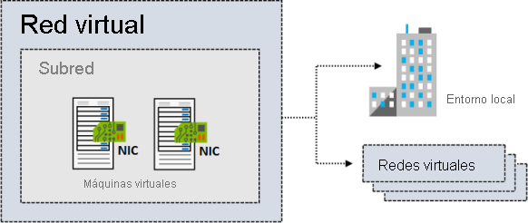
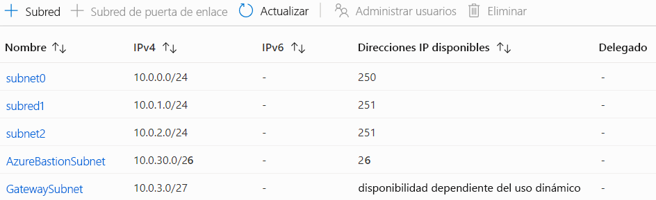
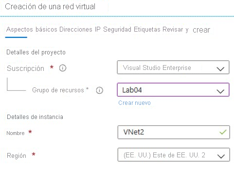
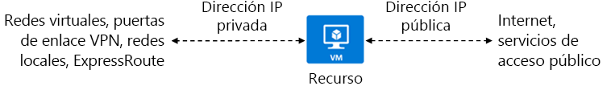
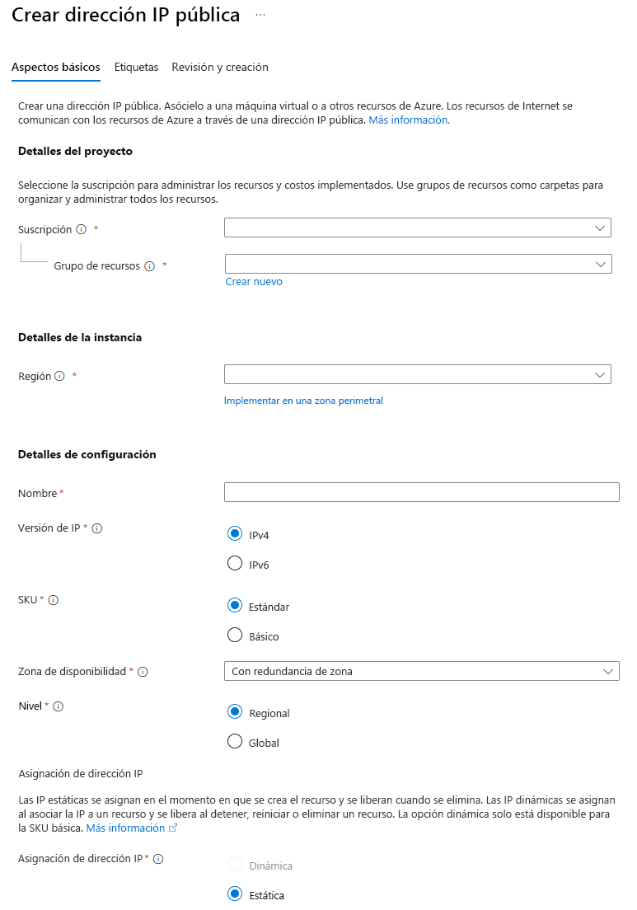
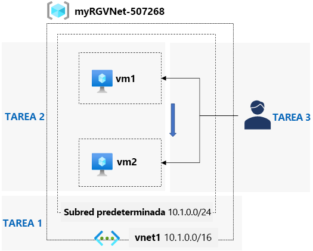

# AZ-104 — Configuración de redes virtuales

Módulo 18 del [AZ-104T00](https://learn.microsoft.com/en-us/training/courses/az-104t00) ([ES](https://learn.microsoft.com/es-es/training/courses/az-104t00)) · Ruta 4 — Configuración y administración de redes virtuales · Área: Implementación y administración de redes virtuales (15–20%).

## Concepto

Configuración de redes y subredes virtuales, incluido el direccionamiento IP (espacios de dirección, IPs públicas y privadas).

## Resumen en mis palabras

> *(pendiente — rellenar al estudiar el módulo)*

## Por qué importa para el examen

> - Creación y configuración de redes virtuales y subredes
> - Configuración de direcciones IP públicas (SKU básica/estándar)

> **Gap del examen**: los **service endpoints** y **private endpoints** para PaaS son objetivos explícitos del área sin módulo propio en la ruta — cubrir con docs y desarrollar [Private Endpoints](private-endpoints.md).

## Enlaces relacionados

**Módulo de Learn**: [Configuración de redes virtuales](https://learn.microsoft.com/en-us/training/modules/configure-virtual-networks/) ([ES](https://learn.microsoft.com/es-es/training/modules/configure-virtual-networks/))

**Savill**: buscar "VNet" / "virtual network" en la [playlist AZ-104](https://www.youtube.com/playlist?list=PLlVtbbG169nGlGPWs9xaLKT1KfwqREHbs) · repaso final con el [Study Cram v2](https://www.youtube.com/watch?v=0Knf9nub4-k)

**Páginas de `knowledge/`**: [Azure Networking](azure-networking.md) · [Hub-Spoke](hub-spoke.md) · [Servicios de red de Azure (AZ-900)](az900-azure-networking.md)

**Laboratorio**: Lab 04 (Implement Virtual Networking) de [MicrosoftLearning/AZ-104](https://github.com/MicrosoftLearning/AZ-104-MicrosoftAzureAdministrator) — ver [labs/AZ-104](../labs/AZ-104/)

# Introducción

Las redes virtuales de Azure son un componente esencial para crear redes privadas en Azure. Permiten que diferentes recursos de Azure se puedan comunicar de forma segura entre ellos, con Internet y con redes en el entorno local.

Supongamos que trabaja para una empresa en el sector sanitario. Su empresa está buscando migrar su infraestructura local a Azure. Quieren garantizar una comunicación segura entre sus recursos en Azure y su red local. La empresa también se preocupa por la escalabilidad y la disponibilidad. Mediante el uso de redes virtuales de Azure, pueden crear una red privada en Azure y conectar sus recursos de forma segura.

Los temas descritos en este módulo incluyen la subred, la creación de redes virtuales y el uso de direcciones IP privadas y públicas. También obtendrá información sobre los distintos escenarios en los que se pueden usar las redes virtuales. Estos escenarios incluyen la creación de una red de solo nube privada dedicada o la extensión de un centro de datos de forma segura. El módulo proporciona una explicación detallada de las subredes y sus ventajas, y cómo planear el direccionamiento IP para los recursos de Azure.

Al final de este módulo, tendrás una clara comprensión de cómo crear y configurar redes virtuales preparadas para IA en Azure. Puede usar subredes de forma eficaz, asignar direcciones IP y garantizar una comunicación segura entre los recursos de Azure y la red local.

# Planear redes virtuales.

Un incentivo importante para adoptar soluciones en la nube como Azure consiste en permitir que los departamentos de tecnologías de la información muevan los recursos de servidor a la nube. Cuando se migran recursos a la nube, se puede ahorrar dinero y simplificar las operaciones administrativas. La reubicación de recursos elimina la necesidad de mantener centros de datos costosos con sistemas de alimentación ininterrumpida, generadores, varios sistemas de seguridad a prueba errores o servidores de bases de datos en clúster. En el caso de las pequeñas y medianas empresas, que podrían no tener la experiencia necesaria para mantener una infraestructura sólida propia, la migración a la nube es especialmente interesante.

### Aspectos que se deben conocer sobre las redes virtuales de Azure

Puede implementar Azure Virtual Network para crear una representación virtual de la red en la nube. Con algún [planeamiento](https://learn.microsoft.com/es-es/azure/virtual-network/virtual-network-vnet-plan-design-arm), puede implementar redes virtuales y conectar los recursos que necesita de forma más eficaz. Vamos a examinar algunas características de las redes virtuales en Azure.

- Una red virtual de Azure es un aislamiento lógico de los recursos en la nube de Azure.
    
- Puede usar redes virtuales para aprovisionar y administrar redes privadas virtuales (VPN) en Azure.
    
- Cada red virtual tiene su propio bloque de enrutamiento de interdominios sin clases (CIDR) y se puede vincular a otras redes virtuales y redes locales.
    
- Puede vincular redes virtuales con una infraestructura de TI local para crear soluciones híbridas o entre entornos locales, cuando los bloques CIDR de las redes de conexión no se superponen.
    
- Puede controlar la configuración del servidor DNS para las redes virtuales y la segmentación de la red virtual en subredes.
    

En la ilustración siguiente se muestra una red virtual que tiene una subred que contiene dos máquinas virtuales. La red virtual tiene conexiones a una infraestructura local y a una red virtual independiente.

### Aspectos que se deben tener en cuenta al usar redes virtuales

Las redes virtuales se pueden usar de muchas formas. A medida que piense en el plan de configuración de las redes virtuales y subredes, tenga en cuenta los siguientes escenarios.

| Escenario                                                        | Descripción                                                                                                                                                                                                                                                                                                                                                                                                  |
| ---------------------------------------------------------------- | ------------------------------------------------------------------------------------------------------------------------------------------------------------------------------------------------------------------------------------------------------------------------------------------------------------------------------------------------------------------------------------------------------------ |
| _Creación de una red virtual de solo nube privada dedicada_      | A veces no necesita una configuración entre entornos para su solución. Cuando crea una red virtual, los servicios y las máquinas virtuales de la red virtual pueden comunicarse de manera directa y segura entre sí en la nube. Aun así, puede configurar conexiones de punto de conexión para las máquinas virtuales y los servicios que requieren la comunicación con Internet, como parte de la solución. |
| _Ampliar de forma segura el centro de datos con redes virtuales_ | Puede crear VPN de sitio a sitio tradicionales para escalar la capacidad del centro de datos de forma segura. Las redes privadas virtuales de sitio a sitio usan IPSEC para proporcionar una conexión segura entre la puerta de enlace VPN corporativa y Azure.                                                                                                                                              |
| _Habilitación de escenarios de nube híbrida_                     | Las redes virtuales ofrecen flexibilidad para admitir distintos escenarios de nube híbrida. Puede conectar de forma segura aplicaciones basadas en la nube a cualquier tipo de sistema local como grandes sistemas y sistemas Unix.                                                                                                                                                                          |

# Creación de las subredes.

[Las subredes](https://learn.microsoft.com/es-es/azure/virtual-network/virtual-network-manage-subnet?tabs=azure-portal) de Azure proporcionan una manera de implementar divisiones lógicas dentro de la red virtual. La red se puede segmentar en subredes para ayudar a mejorar la seguridad, aumentar el rendimiento y facilitar la administración.

### Aspectos que saber sobre las subredes

Hay ciertas condiciones relativas a las direcciones IP de una red virtual cuando se usa la segmentación con subredes.

- Cada subred contiene un intervalo de direcciones IP que están dentro del espacio de direcciones de la red virtual.
    
- El intervalo de direcciones de una subred debe ser único dentro del espacio de direcciones de la red virtual.
    
- El intervalo de una subred no se puede superponer con otros intervalos de direcciones IP de subred en la misma red virtual.
    
- El espacio de direcciones IP de una subred debe especificarse con notación de CIDR.
    
- Puede segmentar una red virtual en una o varias subredes en Azure Portal. Aquí se muestran las características de las direcciones IP de las subredes.
    
    
    

#### Direcciones reservadas

En cada subred, Azure reserva cinco direcciones IP. Reserva las cuatro primeras y la última.

Vamos a examinar las direcciones reservadas en un intervalo de direcciones IP de `192.168.1.0/24`.

|Dirección reservada|Motivo|
|---|---|
|`192.168.1.0`|Este valor identifica la dirección de red virtual.|
|`192.168.1.1`|Azure configura esta dirección como puerta de enlace predeterminada.|
|`192.168.1.2` _y_`192.168.1.3`|Azure asigna estas direcciones IP de Azure DNS al espacio de red virtual.|
|`192.168.1.255`|Este valor proporciona la dirección de difusión de red virtual.|

### Aspectos que tener en cuenta al usar subredes

Al planear la adición de segmentos de subred dentro de una red virtual, hay varios factores que se deben tener en cuenta.

- **Tenga en cuenta los requisitos de servicio**. Cada servicio implementado directamente en una red virtual tiene requisitos específicos de enrutamiento y de los tipos de tráfico que deben permitirse dentro y fuera de las subredes asociadas. Un servicio puede requerir o crear su propia subred. Debe haber suficiente espacio sin asignar para cumplir los requisitos de servicio. Supongamos que conecta una red virtual a una red local mediante Azure VPN Gateway. La red virtual debe tener una subred dedicada para la puerta de enlace.

- **Tenga en cuenta las aplicaciones virtuales de red**. De forma predeterminada, Azure enruta el tráfico de red entre todas las subredes de una red virtual. Puede invalidar el enrutamiento predeterminado de Azure para impedir el enrutamiento de Azure entre subredes. También puede invalidar el enrutamiento predeterminado entre subredes mediante una aplicación virtual de red. Si necesita que el tráfico entre los recursos de la misma red virtual fluya por una aplicación virtual de red, implemente los recursos en subredes diferentes.

- **Considere los grupos de seguridad de red**. Puede asociar un grupo de seguridad de red o ninguno, a cada subred de una red virtual. Puede asociar el mismo grupo de seguridad de red (u otro diferente) a cada subred. Cada grupo de seguridad de red contiene reglas que permiten o niegan el paso del tráfico hacia y desde los orígenes y destinos.
   
- **Tenga en cuenta los vínculos privados**. Azure Private Link proporciona conectividad privada desde una red virtual a la plataforma como servicio (PaaS) de Azure, propiedad del cliente o servicios de asociados de Microsoft. Private Link simplifica la arquitectura de red y protege la conexión entre los puntos de conexión de Azure. El servicio elimina la exposición de datos a la red pública de Internet.

# Creación de redes virtuales.

Puede crear nuevas redes virtuales en cualquier momento. También puede agregar redes virtuales al crear una máquina virtual.

### Aspectos que se deben saber sobre la creación de redes virtuales

Revise estos requisitos para crear una red virtual.

- Al crear una red virtual, debe definir el espacio de direcciones IP de la red.
    
- Planee usar un espacio de direcciones IP que aún no esté en uso en su organización.
    
- El espacio de direcciones de la red virtual puede ser local o en la nube, pero no ambos.
    
- Para crear una red virtual, debe definir al menos una subred.
    
    - Cada subred contiene un intervalo de direcciones IP que están dentro del espacio de direcciones de la red virtual.
        
    - El intervalo de direcciones de cada subred debe ser único dentro del espacio de direcciones de la red virtual.
        
    - El intervalo de una subred no se puede superponer con otros intervalos de direcciones IP de subred en la misma red virtual.
        
- Puede crear una red virtual en Azure Portal. Proporcione la suscripción de Azure, el grupo de recursos, el nombre de red virtual y la región del servicio para la red.
    
    

> [!NOTE]
> Los límites predeterminados en los recursos de red de Azure pueden cambiar periódicamente. Asegúrese de consultar la [documentación de redes de Azure](https://learn.microsoft.com/es-es/azure/networking/) para obtener la información más reciente.

# Planeamiento de las direcciones IP.

Comencemos con una introducción al direccionamiento IP.

Puede asignar direcciones IP a los recursos de Azure para que se comuniquen con otros recursos de Azure, la red local e Internet. Hay dos tipos de direcciones IP de Azure: _privadas_ y _públicas_.

**Las direcciones IP privadas** permiten la comunicación dentro de una red virtual de Azure y la red local. Cree una dirección IP privada para el recurso cuando use una puerta de enlace de VPN o un circuito ExpressRoute de Azure para ampliar la red a Azure.

**Las direcciones IP públicas** permiten que el recurso se comunique con Internet. Puede crear una dirección IP pública para conectarse a los servicios orientados al público de Azure.

En la ilustración siguiente se muestra un recurso de máquina virtual que tiene una dirección IP privada y una dirección IP pública.

### Aspectos que se deben conocer sobre las direcciones IP

Veamos las características de las direcciones IP con más detalle.

- Las direcciones IP se pueden asignar de forma estática o dinámica.
    
- Puede separar en subredes diferentes los recursos de la dirección IP asignados de forma dinámica y estática.
    
- Las direcciones IP estáticas no cambian y son más recomendables para determinadas situaciones, como las siguientes:
    
    - Resolución de nombres DNS, donde un cambio en la dirección IP requiere actualizar los registros de host.
    - Modelos de seguridad basados en direcciones IP que requieren que las aplicaciones o servicios tengan una dirección IP estática
    - Certificados TLS/SSL vinculados a una dirección IP.
    - Reglas de firewall que permiten o deniegan el tráfico mediante intervalos de direcciones IP.
    - Máquinas virtuales basadas en roles, como controladores de dominio y servidores DNS.

# Creación de direcciones IP públicas.

Puede crear una dirección IP pública para el recurso en Azure Portal. Por ejemplo, podría crear una dirección IP pública para una máquina virtual.

### Aspectos que se deben tener en cuenta al crear una dirección IP pública

Para crear una dirección IP pública, configure estas opciones. Tenga en cuenta que las direcciones IP públicas a menudo se usan con equilibradores de carga.

- **Versión de IP**: las direcciones IP públicas se pueden asociar a un equilibrador de carga o a una interfaz de red. Las direcciones IPv4 e IPv6 se cobran a la misma tarifa.
    
- **SKU**: seleccione la SKU para la dirección IP pública. La SKU de una dirección IP pública debe coincidir con la SKU del equilibrador de carga con el que se usa.
    
- **Nivel**: debe coincidir con el nivel del equilibrador de carga. Un equilibrador de carga entre regiones distribuye el tráfico entre backends regionales. Regional distribuye el tráfico dentro de una red virtual.
    
- **Asignación de direcciones IP**: las direcciones estáticas se asignan cuando se crea una dirección IP pública. Las direcciones estáticas no se liberan hasta que se elimina un recurso de dirección IP pública.

# Asociación de direcciones IP públicas.

Un recurso de [dirección IP pública](https://learn.microsoft.com/es-es/azure/virtual-network/ip-services/public-ip-addresses) se puede asociar a interfaces de red de máquina virtual, equilibradores de carga accesibles desde Internet, puertas de enlace de VPN y puertas de enlace de aplicaciones. Puede asociar su recurso a direcciones IP públicas tanto dinámicas como estáticas.

| Recurso de nivel superior                                                                         | Configuración de dirección IP           |
| ------------------------------------------------------------------------------------------------- | --------------------------------------- |
| Máquina virtual                                                                                   | Configuración de la interfaz de red     |
| Puerta de enlace de red virtual (VPN), puerta de enlace de red virtual (ER), puerta de enlace NAT | Configuración de IP de puerta de enlace |
| Equilibrador de carga público, Application Gateway, Azure Firewall, Route Server, API Management  | Configuración de front-end              |
| Host bastión                                                                                      | Configuración de IP pública             |

#### Características del **SKU** (_Stock Keeping Unit_) de dirección IP pública

En la tabla siguiente se resumen las características de SKU estándar.

|Dirección IP pública|SKU Estándar|
|---|---|
|Método de asignación|Estática|
|Seguridad|Modelo seguro por defecto|
|Zonas disponibles|Supported. Las direcciones IP Estándar pueden ser no zonales, zonales o con redundancia de zona.|

# Asignación de direcciones IP privadas.

Un recurso [de dirección IP privada](https://learn.microsoft.com/es-es/azure/virtual-network/ip-services/private-ip-addresses) se puede asociar a interfaces de red de máquina virtual, equilibradores de carga internos y puertas de enlace de aplicaciones. Azure puede proporcionar una dirección IP (asignación dinámica), o bien puede ser usted quien asigne la dirección IP (asignación estática).

### Aspectos que se deben tener en cuenta al asociar direcciones IP privadas.
En la tabla siguiente se resume cómo puede asociar direcciones IP privadas para distintos tipos de recursos.

|Recurso|Asociación de direcciones IP privadas|Dirección IP dinámica|Dirección IP estática|
|---|---|---|---|
|Máquina virtual|NIC|Sí|Sí|
|Equilibrador de carga interno|Configuración de front-end|Sí|Sí|
|puerta de enlace de aplicaciones|Configuración de front-end|Sí|Sí|

#### Asignación de la dirección IP privada

Se asigna una dirección IP privada del intervalo de direcciones de la subred de la red virtual en la que se implementa un recurso. Hay dos opciones: dinámicas y estáticas.

- **Dinámico**: Azure asigna la siguiente dirección IP sin asignar o no reservada disponible en el intervalo de direcciones de la subred. La asignación dinámica es el método de asignación predeterminado.
    
    Supongamos que las direcciones 10.0.0.4 a 10.0.0.9 ya están asignadas a otros recursos. En este caso, Azure asigna la dirección 10.0.0.10 a un nuevo recurso.
    
- **Estático**: seleccione y asigne cualquier dirección IP sin asignar o no reservada en el intervalo de direcciones de la subred.
    
    Supongamos que un intervalo de direcciones de la subred es 10.0.0.0/16 y las direcciones 10.0.0.4 a 10.0.0.9 ya se han asignado a otros recursos. En este escenario, puede asignar cualquier dirección entre 10.0.0.10 y 10.0.255.254.

> [!TIP] Sugerencia
> Para obtener una revisión más completa de las redes virtuales, considere el módulo [de entrenamiento Introducción a las redes virtuales](https://learn.microsoft.com/es-es/training/modules/introduction-to-azure-virtual-networks/).

# Ejercicio: Creación y configuración de redes virtuales.

## Escenario del ejercicio

La organización está migrando una aplicación basada en web a Azure. Tu primera tarea consiste en colocar las redes virtuales y subredes. También debes emparejar de forma segura las redes virtuales. Identificas estos requisitos.

- Se requieren dos redes virtuales, app-vnet y hub-vnet. Las redes virtuales simulan una arquitectura de red en estrella tipo hub-and-spoke.
- La red virtual de la aplicación hospeda la aplicación. La red virtual app-vnet requiere dos subredes. La subred de front-end hospeda los servidores web. La subred de back-end hospeda los servidores de base de datos.
- La red virtual de concentrador solo requiere una subred para el firewall.
- Las dos redes virtuales deben ser capaces de comunicarse entre sí de forma segura y privada a través de un emparejamiento de red virtual.
- Ambas redes virtuales deben estar en la misma región.

## Diagrama de la arquitectura

## Aptitudes de trabajo

- Cree una red virtual.
- Cree una subred.
- Configura el emparejamiento de red virtual (opcional).

> [!NOTE] Nota
> Tiempo estimado: 30 minutos. Para completar este ejercicio, necesitará una [suscripción a Azure](https://azure.microsoft.com/pricing/purchase-options/azure-account?cid=msft_learn_79c01a4f-9410-6cbc-5a75-ef6ab0a7152d).

Inicie el ejercicio y siga las instrucciones. Cuando termine, asegúrese de volver a esta página para que pueda continuar aprendiendo.

[Create and configure network.](../labs/AZ-104/network/Create%20and%20configure%20network..md)

# Resumen y recursos.

En este módulo, ha aprendido sobre las redes virtuales de Azure y su importancia en la creación de redes privadas en Azure. Ha explorado las ventajas de usar redes virtuales, como escalabilidad, disponibilidad y aislamiento. Ha aprendido a crear redes virtuales con subredes y a determinar qué recursos requieren direcciones IP públicas o privadas.

Las principales conclusiones de este módulo son:

- Las redes virtuales de Azure permiten que diferentes recursos de Azure se comuniquen de forma segura entre sí, con Internet y con redes locales.
    
- Las subredes de las redes virtuales proporcionan divisiones lógicas, lo que mejora la seguridad, el rendimiento y la administración.
    
- Al crear redes virtuales, asegúrese de que el espacio de direcciones IP es único y no se superpone con otras subredes.
    
- Las direcciones IP pueden proporcionar acceso público o privado a los recursos.

## Más información con Copilot

Copilot puede ayudarle a diseñar soluciones de infraestructura de Azure. Copilot puede comparar, recomendar, explicar e investigar productos y servicios en los que necesita más información. Abra un explorador de Microsoft Edge y elija Copilot (arriba a la derecha) o vaya a copilot.microsoft.com. Dedique unos minutos a probar estos mensajes y ampliar el aprendizaje con Copilot.

- Explicar CIDR para un público no técnico. Provisión de ejemplos.
    
- ¿Cuáles son los pasos y consideraciones básicos para crear una red virtual en Azure?
    
- ¿Qué tipos de recursos de Azure se deben asignar a una dirección IP estática?
    

## Más información con la documentación

- [¿Qué es Azure Virtual Network?](https://learn.microsoft.com/es-es/azure/virtual-network/virtual-networks-overview). Este artículo es el punto de partida para obtener información sobre las redes virtuales.
    
- [Direcciones IP públicas](https://learn.microsoft.com/es-es/azure/virtual-network/ip-services/public-ip-addresses). En este artículo se revisan los conceptos básicos de cuándo usar direcciones IP públicas.
    
- [Direcciones IP privadas](https://learn.microsoft.com/es-es/azure/virtual-network/private-ip-addresses). En este artículo se revisan los aspectos básicos de cuándo usar direcciones IP privadas.
    

## Aprende más con formación a tu propio ritmo

- [Introducción a las redes virtuales de Azure](https://learn.microsoft.com/es-es/training/modules/introduction-to-azure-virtual-networks/). Aprenda a diseñar e implementar la infraestructura principal de redes de Azure.
    
- [Implemente el enrutamiento y el direccionamiento IP de la máquina virtual IaaS de Windows Server](https://learn.microsoft.com/es-es/training/modules/implement-windows-server-iaas-virtual-machine-ip-addressing-routing/). Obtenga información sobre el direccionamiento IP y las redes virtuales para las máquinas virtuales.

## Relacionado

- [Índice AZ-104](../certifications/AZ-104/INDEX.md)
- [Azure Networking](azure-networking.md)
- [Hub-Spoke](hub-spoke.md)
- [Lab AZ-104: Implementación de redes virtuales](../labs/AZ-104/network/Implementación%20de%20redes%20virtuales..md)
