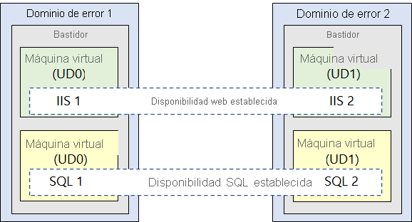
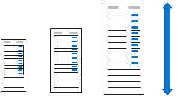
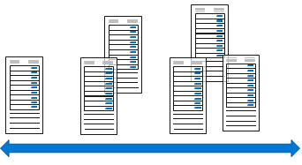
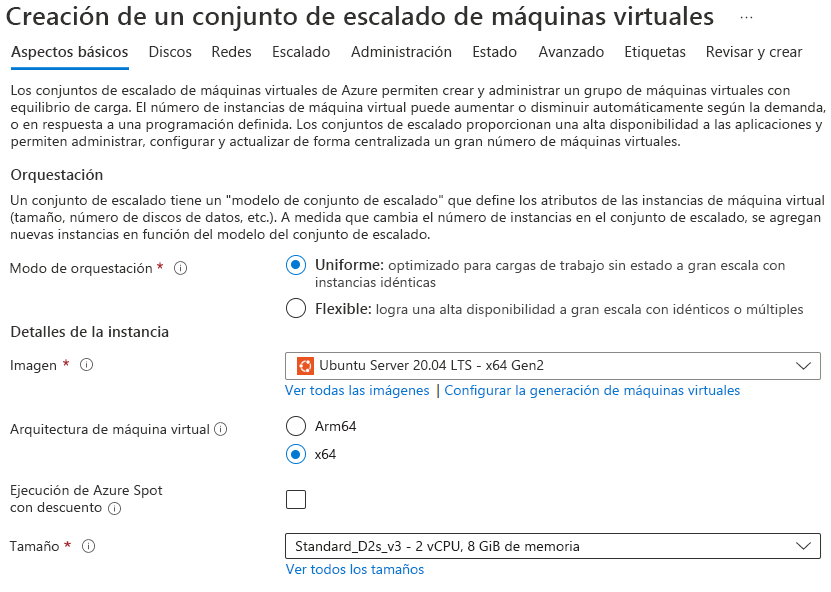
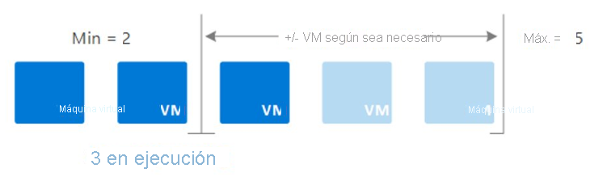
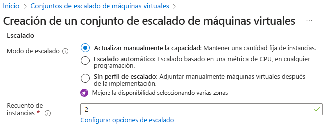
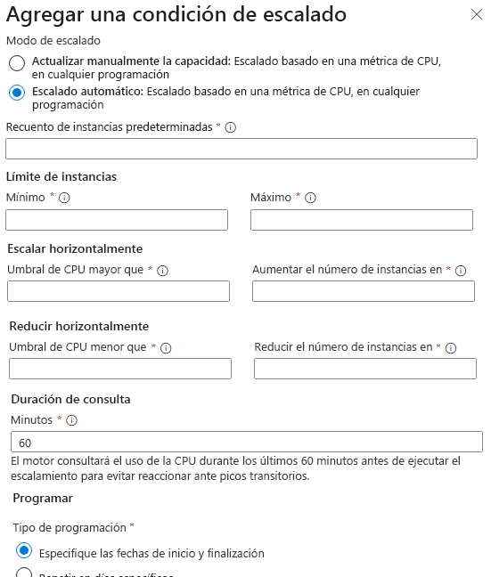

# AZ-104 — Configuración de la disponibilidad de las máquinas virtuales

Módulo 14 del [AZ-104T00](https://learn.microsoft.com/en-us/training/courses/az-104t00) ([ES](https://learn.microsoft.com/es-es/training/courses/az-104t00)) · Ruta 3 — Implementación y administración de recursos de procesos de Azure · Área: Implementación y administración de recursos de procesos de Azure (20–25%).

## Concepto

Disponibilidad de VMs: dominios de fault/update, escalado vertical y horizontal, y conjuntos de escalado (VMSS).

## Resumen en mis palabras

> *(pendiente — rellenar al estudiar el módulo)*

## Por qué importa para el examen

> - Implementación de máquinas virtuales en zonas de disponibilidad y conjuntos de disponibilidad
> - Implementación y configuración de un conjunto de escalado de máquinas virtuales de Azure (VMSS)
> - Escalado vertical (tamaños) vs horizontal (instancias)

## Enlaces relacionados

**Módulo de Learn**: [Configuración de la disponibilidad de las máquinas virtuales](https://learn.microsoft.com/en-us/training/modules/configure-virtual-machine-availability/) ([ES](https://learn.microsoft.com/es-es/training/modules/configure-virtual-machine-availability/))

**Savill**: buscar "availability" / "scale set" en la [playlist AZ-104](https://www.youtube.com/playlist?list=PLlVtbbG169nGlGPWs9xaLKT1KfwqREHbs) · repaso final con el [Study Cram v2](https://www.youtube.com/watch?v=0Knf9nub4-k)

**Páginas de `knowledge/`**: [[Servicios de proceso de Azure (AZ-900)]]

**Laboratorio**: Lab 08 (Manage Virtual Machines) de [MicrosoftLearning/AZ-104](https://github.com/MicrosoftLearning/AZ-104-MicrosoftAzureAdministrator) — ver [labs/AZ-104](../labs/AZ-104/README.md)

# Introducción

La administración de máquinas virtuales a escala puede resultar complicada, especialmente cuando los patrones de uso varían y la demanda en las aplicaciones fluctúa. Los administradores de Azure deben poder ajustar sus recursos de máquina virtual para que cumplan con las demandas cambiantes. Al mismo tiempo, quieren mantener la coherencia de la configuración de las máquinas virtuales para garantizar la estabilidad de las aplicaciones. Lograr estos objetivos significa mantener el rendimiento y la capacidad de respuesta, a la vez que se minimizan los costos de la ejecución continua de un gran número de máquinas virtuales.

El sitio web de la empresa usa máquinas virtuales y administra cargas de trabajo de gran tamaño. El departamento de TI quiere asegurarse de que las máquinas virtuales se puedan ajustar dinámicamente a los aumentos y reducciones de las cargas de trabajo. También quieren asegurarse de que hay un plan de continuidad empresarial para proporcionar máquinas de alta disponibilidad. Usted es responsable de implementar las máquinas virtuales de alta disponibilidad. Decide usar **Azure Virtual Machine Scale Sets** y la característica de escalabilidad automática.

En este módulo, obtendrá información sobre el escalado de máquinas virtuales. Obtenga información sobre zonas de disponibilidad, conjuntos de disponibilidad y dominios de actualización y error. También obtendrá información sobre los conjuntos de escalado y el escalado automático.

El objetivo de este módulo es aprender a responder correctamente a las cargas de trabajo de máquina virtual cambiantes.

# Planificación del mantenimiento y el tiempo de inactividad.

Los administradores de Azure se preparan para errores planeados y no planeados.

### Aspectos que se deben conocer sobre el planeamiento del mantenimiento

Un plan de disponibilidad para máquinas virtuales de Azure debe incluir estrategias para el mantenimiento de hardware no planeado, un tiempo de inactividad inesperado y el mantenimiento planeado.

- Se produce un evento de **mantenimiento de hardware no planeado** cuando la plataforma Azure predice que el hardware o cualquier componente de la plataforma asociado a una máquina física está a punto de presentar un error. Cuando la plataforma predice un error, emite un evento de mantenimiento de hardware no planeado. Azure usa tecnología de migración en vivo para migrar las máquinas virtuales del hardware en el que se producen errores a una máquina física en buen estado. La migración en vivo es una operación de conservación de máquinas virtuales que solo pausa la máquina virtual durante un breve período de tiempo, pero el rendimiento se podría ver reducido antes o después del evento.

- El **tiempo de inactividad inesperado** ocurre cuando en el hardware o en la infraestructura física de la máquina virtual se produce un error de manera imprevista. El tiempo de inactividad inesperado puede incluir errores de la red local, errores de los discos locales u otros errores de nivel de bastidor. Cuando se detecta, la plataforma Azure migra (recupera) automáticamente la máquina virtual a una máquina física en buen estado en el mismo centro de datos. Durante el procedimiento de recuperación, las máquinas virtuales experimentan tiempos de inactividad (reinicio) y, en algunos casos, pérdidas de la unidad temporal.

- Los eventos de **mantenimiento planeado** son actualizaciones periódicas que realiza Microsoft en la plataforma Azure subyacente para mejorar en general la fiabilidad, el rendimiento y la seguridad de la infraestructura de la plataforma sobre las que se ejecutan las máquinas virtuales.


> [!NOTE]   
Microsoft no actualiza automáticamente el sistema operativo de la máquina virtual ni ningún otro software. El usuario tiene el control total y la responsabilidad plena de realizar estas actualizaciones. Pero el host de software y el hardware subyacentes se revisan periódicamente para garantizar la fiabilidad y el alto rendimiento.


# Creación de conjuntos de disponibilidad.

Un conjunto de disponibilidad es una característica lógica que puede usar para asegurarse de que un grupo de máquinas virtuales relacionadas se implementen juntas. Esta agrupación permite evitar que un único punto de error afecte a todas las máquinas. Agrupar las máquinas virtuales garantiza que no todas se actualicen al mismo tiempo durante una actualización del sistema operativo host en el centro de datos.

### Aspectos que conviene saber sobre los conjuntos de disponibilidad

Vamos a revisar algunas características de los conjuntos de disponibilidad.

- Todas las máquinas virtuales de un conjunto de disponibilidad deben realizar el conjunto idéntico de funcionalidades.

- Todas las máquinas virtuales de un conjunto de disponibilidad deben tener instalado el mismo software.

- Azure garantiza que las máquinas virtuales de un conjunto de disponibilidad se ejecuten en varios servidores físicos, grupos de proceso, unidades de almacenamiento y conmutadores de red.

    Si se produce un error de hardware o software de Azure, solo se ve afectado un subconjunto de las máquinas virtuales del conjunto de disponibilidad. La aplicación permanece al día y sigue estando disponible para los clientes.

- Puede crear una máquina virtual y un conjunto de disponibilidad al mismo tiempo.

    Una máquina virtual solo se puede agregar a un conjunto de disponibilidad cuando se crea la máquina virtual. Para cambiar el conjunto de disponibilidad de una máquina virtual, debe eliminar la máquina y volver a crearla.

- Puede crear conjuntos de disponibilidad mediante Azure Portal, plantillas de Azure Resource Manager (ARM), scripting o herramientas de API.


> [!NOTE] Nota:
> Agregar las máquinas virtuales a un conjunto de disponibilidad no protege las aplicaciones frente a errores específicos del sistema operativo o de la aplicación. Debe explorar otras técnicas de recuperación ante desastres y copia de seguridad para proporcionar protección a nivel de aplicación.


### Aspectos que se deben tener en cuenta al usar conjuntos de disponibilidad

Los conjuntos de disponibilidad son una funcionalidad fundamental para compilar soluciones en la nube confiables. Al planear conjuntos de disponibilidad, tenga en mente estos principios generales:

- **Considere la redundancia**. Para alcanzar la redundancia en la configuración, coloque varias máquinas virtuales en un conjunto de disponibilidad.
    
- **Considere la posibilidad de separar las capas de aplicación**. Cada nivel de aplicación utilizado en la configuración debe estar en un conjunto de disponibilidad independiente. Esta separación ayuda a mitigar un único punto de error en todas las máquinas.
    
- **Tenga en cuenta el equilibrio de carga**. Para lograr una alta disponibilidad y un gran rendimiento de la red, cree un conjunto de disponibilidad de carga equilibrada mediante Azure Load Balancer. Load Balancer distribuye el tráfico entrante entre instancias de trabajo de servicios que se definen en el conjunto de disponibilidad de carga equilibrada.
    
- **Considere el uso de discos administrados**. Puede utilizar discos administrados de Azure con las máquinas virtuales de Azure en conjuntos de disponibilidad para almacenamiento a nivel de bloque.


# Revisión de dominios de actualización y dominios de error

Los conjuntos de disponibilidad de máquinas virtuales de Azure implementan dos conceptos de nodo para ayudar a Azure a mantener una alta disponibilidad y tolerancia a errores al implementar y actualizar aplicaciones: _dominios de actualización_ y _dominios de error_. Cada máquina virtual de un conjunto de disponibilidad se coloca en un dominio de actualización y un dominio de error.

### Aspectos que se deben conocer sobre los dominios de actualización

Un dominio de actualización es un grupo de nodos que se actualizan en conjunto durante el proceso de actualización de un servicio (o _lanzamiento_). Un dominio de actualización permite a Azure realizar actualizaciones incrementales o graduales en una implementación. Estas son algunas otras características de los dominios de actualización.

- Cada dominio de actualización incluye un conjunto de máquinas virtuales y hardware físico asociado que se puede actualizar y reiniciar al mismo tiempo.

- Durante el mantenimiento planeado solo se reinicia un dominio de actualización cada vez.

- Puede especificar entre 1 y 20 dominios de actualización al crear un conjunto de disponibilidad. Si no especifica un valor, Azure tiene como valor predeterminado cinco dominios de actualización.

- La cantidad de dominios de actualización es inmutable después de la creación; para cambiarla, debe eliminar y volver a crear el conjunto de disponibilidad.


### Aspectos que se deben conocer sobre los dominios de error

Un dominio de error es un grupo de nodos que representan una unidad física de error. Piense en un dominio de error como nodos que pertenecen al mismo bastidor físico.

- Un dominio de error define un grupo de máquinas virtuales que comparten un conjunto común de hardware (o _conmutadores_) que comparten un único punto de error. Un ejemplo es un bastidor de servidor que recibe servicio de un conjunto de conmutadores de alimentación o de red.

- Dos dominios de error trabajan en conjunto para mitigar los errores de hardware, las interrupciones de red, las interrupciones de alimentación o las actualizaciones de software.


Echemos un vistazo a un escenario con dos dominios de error que tienen dos máquinas virtuales cada uno. Las máquinas virtuales de cada dominio de error están contenidas en diferentes conjuntos de disponibilidad. El conjunto de disponibilidad web contiene dos máquinas virtuales con una máquina de cada dominio de error. El conjunto de disponibilidad SQL contiene dos máquinas virtuales con una máquina de cada dominio de error.




# Revisión de zonas de disponibilidad

Las zonas de disponibilidad son una oferta de alta disponibilidad que protege las aplicaciones y datos de los errores del centro de datos. Puede utilizar las zonas de disponibilidad para crear alta disponibilidad en la arquitectura de sus aplicaciones si coloca sus recursos de proceso, almacenamiento, redes y datos en una zona y los replica en otras.

Piense en un escenario en el que se crean tres o más máquinas virtuales en tres zonas de una región de Azure. Las máquinas virtuales se distribuyen eficazmente entre tres dominios de error y tres dominios de actualización. La plataforma Azure reconoce esta distribución entre dominios de actualización para asegurarse de que las máquinas virtuales de distintas zonas no se actualicen al mismo tiempo.

### Aspectos que conviene saber sobre las zonas de disponibilidad

Revise estas características de las zonas de disponibilidad.

- Las zonas de disponibilidad son ubicaciones físicas exclusivas dentro de una región de Azure.

- Cada zona consta de uno o varios centros de datos equipados con alimentación, refrigeración y redes independientes.

- Para garantizar la resistencia, hay un mínimo de tres zonas independientes en todas las regiones habilitadas.

- La separación física de las zonas de disponibilidad dentro de una región protege las aplicaciones y los datos frente a los errores del centro de datos.

- Los servicios con redundancia de zona replican tus aplicaciones y datos a través de zonas de disponibilidad para proteger contra un único punto de falla.


### Aspectos que se deben tener en cuenta al usar zonas de disponibilidad

Los servicios de Azure que admiten zonas de disponibilidad se dividen en dos categorías.

|Categoría|Descripción|Ejemplos|
|---|---|---|
|**Servicios zonales**|Los servicios _zonales_ de Azure anclan cada recurso a una zona específica.|- Máquinas virtuales de Azure  <br>- Discos administrados de Azure|
|**Servicios con redundancia de zona**|En el caso de los servicios de Azure con redundancia de zona, la plataforma se replica automáticamente en todas las zonas.|- Azure Storage con redundancia de zona  <br>- Azure SQL Database|

> [!NOTE] Nota:
 Nota: Las direcciones IP estándar se pueden configurar como con redundancia de zona (recomendadas para alta disponibilidad), zonales (ancladas a una zona específica) o no zonales (regionales) en función de su elección de implementación.

> [!TIP] Sugerencia: 
> Para lograr una continuidad empresarial completa en Azure, cree la arquitectura de la aplicación con una combinación de zonas de disponibilidad y pares regionales de Azure [](https://learn.microsoft.com/es-es/azure/virtual-machines/regions#region-pairs).


# Comparación entre el escalado vertical y horizontal.

Una configuración de máquina virtual sólida incluye compatibilidad con la escalabilidad. La escalabilidad permite mejorar el rendimiento de una máquina virtual en proporción a la disponibilidad de los recursos de hardware asociados. Una máquina virtual escalable puede controlar los aumentos en las solicitudes sin afectar negativamente el tiempo de respuesta ni el rendimiento. Para la mayoría de las operaciones de escalado, hay dos opciones de implementación: **<font color="#00b050">vertical y horizontal</font>.**

### Aspectos que hay que saber sobre el escalado vertical

El escalado vertical, también conocido como _escalado y reducción vertical_, implica aumentar o disminuir el **tamaño** de la máquina virtual como respuesta a una carga de trabajo. El escalado vertical hace que las máquinas virtuales sean más poderosas (escalado vertical) o menos poderosas (reducción vertical).



Estos son algunos escenarios en los que puede ser ventajoso utilizar el escalado vertical:

- Si tiene un servicio basado en una máquina virtual infrautilizada (por ejemplo, los fines de semana), puede usar el escalado vertical para disminuir el tamaño de la máquina virtual y reducir los costos mensuales.
    
- Puede implementar el escalado vertical para aumentar el tamaño de la máquina virtual a fin de responder ante una demanda mayor sin tener que crear máquinas virtuales adicionales.
    

### Aspectos que hay que saber sobre el escalado horizontal

El escalado horizontal, también denominado _escalado horizontal y reducción horizontal_, se usa para ajustar el **número** de máquinas virtuales de la configuración a fin de responder a la carga de trabajo cambiante. Al implementar el escalado horizontal, hay un aumento (escalado horizontal) o una disminución (reducción horizontal) en el número de instancias de máquina virtual.



### Aspectos que se deben tener en cuenta al usar el escalado vertical y horizontal

Revise estas consideraciones respecto del escalado vertical y horizontal. Piense en qué implementación podría necesitar para admitir el sitio web de la empresa.

- **Tenga en cuenta las limitaciones**. En términos generales, el escalado horizontal tiene menos limitaciones que el vertical. Una implementación de escalado vertical depende de la disponibilidad de hardware más grande, que alcanza rápidamente un límite superior y puede variar según la región. El escalado vertical también suele requerir que una máquina virtual se detenga y reinicie, lo que puede limitar temporalmente el acceso a aplicaciones o datos.
    
- **Tenga en cuenta la flexibilidad**. Cuando se trabaja en la nube, el escalado horizontal resulta más flexible. Una implementación de escalado horizontal permite ejecutar potencialmente miles de máquinas virtuales para administrar los cambios en la carga de trabajo y el rendimiento.
    
- **Tenga en cuenta el reaprovisionamiento**. El _reaprovisionamiento_ es el proceso de quitar una máquina virtual existente y reemplazarla por una nueva. Un plan de disponibilidad sólido considera dónde es posible que se requiera el reaprovisionamiento y los planes de interrupciones en el servicio. Si es posible que sea necesario el reaprovisionamiento, determine si necesita mantener y migrar los datos a la máquina nueva.
# Implementar conjuntos de escalado de máquinas virtuales de Azure.

Las instancias de **Azure Virtual Machine Scale Sets** son un recurso de Azure Compute que puede utilizar para implementar y administrar un conjunto de máquinas virtuales **idénticas**. Al implementar Virtual Machine Scale Sets y configurar todas las máquinas virtuales de la misma manera, obtiene una _escalabilidad automática_ verdadera. Virtual Machine Scale Sets aumenta automáticamente el número de instancias de máquina virtual a medida que la demanda de la aplicación aumenta, y reduce el número de instancias de máquina a medida que la demanda disminuye.

Con **Virtual Machine Scale Sets**, no es necesario aprovisionar previamente las máquinas virtuales. Esto facilita la creación de servicios a gran escala que se centran en las grandes capacidades de cómputo, big data y cargas de trabajo en contenedores. A medida que aumentan las cargas de trabajo, se pueden agregar más instancias de máquina virtual. A medida que disminuyen las cargas de trabajo, se pueden quitar instancias de máquina virtual. El proceso de agregar y quitar máquinas puede ser manual, automatizado, o bien una combinación de ambos.

### Aumento de la disponibilidad y escalabilidad de aplicaciones con Azure Virtual Machine Scale Sets.

### Aspectos que se deben saber sobre Azure Virtual Machine Scale Sets

Revise estas características de Azure Virtual Machine Scale Sets.

- **Virtual Machine Scale Sets** admite el uso de **Azure Load Balancer** para la distribución de tráfico de **capa 4** básica y **Azure Application Gateway** para la distribución de tráfico de **capa 7** más avanzada, además de la terminación TLS/SSL.

- Puede usar Virtual Machine Scale Sets para ejecutar varias instancias de la aplicación. Si una de las instancias de máquina virtual tiene un problema, los clientes siguen accediendo a la aplicación a través de otra instancia de máquina virtual con una interrupción mínima.

- Hay dos tipos de modos de orquestación disponibles para conjuntos de escalado de máquinas virtuales de Azure: uniforme y flexible. En **el modo de orquestación uniforme**, todas las instancias de máquina virtual se crean a partir de la misma imagen y configuración del sistema operativo base. En **el modo de orquestación flexible**, las máquinas virtuales pueden usar diferentes imágenes, tamaños o configuraciones dentro del mismo conjunto de escalado. El modo de orquestación debe ser elegido cuando se crea el conjunto de escalas.

- La demanda de la aplicación por parte de los clientes puede cambiar a lo largo del día o de la semana. A fin de satisfacer la demanda de los clientes, Virtual Machine Scale Sets implementa la escalabilidad automática para aumentar y reducir automáticamente el número de máquinas virtuales.


# Ejemplo.
### El problema que resuelve

Imagina una tienda online con una API en Python en **una sola VM**:

- **Un lunes normal** tiene 50 usuarios y la VM va sobrada.
- **El Black Friday** llegan 5.000 usuarios, la CPU llega al 100% y la web se cae.
- **Si la VM se estropea**, la web se cae entera.

Podrías comprar una VM enorme para el pico, pero pagarías esa potencia los 365 días. O podrías crear VMs a mano cuando veas que se satura, pero eso significa estar pendiente las 24 horas.

### Cómo lo resuelve un VMSS

Con un VMSS defines una vez cómo es tu VM, y Azure se encarga del resto:

```
Lunes (poca carga):      [VM1] [VM2]                      → pagas 2
Black Friday (pico):     [VM1] [VM2] [VM3] [VM4] [VM5]    → Azure añade 3 solas
Sábado (baja la carga):  [VM1] [VM2]                      → Azure borra las sobrantes
```

El **Load Balancer** va delante y reparte a los usuarios entre las VMs que existan en cada momento. Si una VM falla, el balanceador deja de enviarle tráfico y el VMSS puede reemplazarla por otra.

### Casos de uso reales

- **Web o API con tráfico variable**: tiendas, ticketing, apps con picos por horario o campañas.
- **Procesamiento por lotes**: renderizado de vídeo, cálculos científicos o análisis de datos. Levantas 100 VMs durante 2 horas, terminas el trabajo y las borras.
- **Alta disponibilidad**: repartes las instancias en varias zonas de disponibilidad, para que una caída de datacenter no tumbe el servicio.
- **Granjas de agentes de CI/CD**: runners de Azure DevOps o GitHub que escalan según la cola de trabajos.

### Cuándo NO usarlo

- **Una app con poco tráfico y estable**: una VM normal basta.
- **Servidores con estado**: una base de datos en un VMSS es mala idea, porque las instancias son desechables. La base de datos va en un servicio gestionado (Azure Database for PostgreSQL, por ejemplo).
- **Apps web "normales"**: hoy se suele usar **Azure App Service** o **Container Apps**, que ya incluyen escalado automático y balanceo sin que gestiones VMs ni sistema operativo. El VMSS tiene sentido cuando necesitas control total de la VM: software especial, drivers, configuración de SO concreta o cargas que no encajan en un servicio gestionado.

### Resumen

**VMSS = "necesito muchas VMs iguales, que aumenten y disminuyan solas según la demanda, repartidas por un balanceador".**


# Creación de implementaciones de Virtual Machine Scale Sets.

Puede implementar Azure Virtual Machine Scale Sets en Azure Portal. Especifique el número de máquinas virtuales y sus tamaños e indique las preferencias para usar instancias de Azure Spot, discos administrados de Azure y directivas de asignación.

En Azure Portal, hay varias opciones que se deben configurar para crear una implementación de Azure Virtual Machine Scale Sets.



- [**Modo de orquestación**](https://learn.microsoft.com/es-es/azure/virtual-machine-scale-sets/virtual-machine-scale-sets-orchestration-modes): Elija cómo el conjunto de escalado administra las máquinas virtuales. La orquestación flexible es el modo predeterminado y recomendado para las nuevas implementaciones. Para la mayoría de las cargas de trabajo nuevas, acepte el valor predeterminado Flexible a menos que tenga un requisito específico para instancias idénticas.
    
- **Imagen**: elija la aplicación o el sistema operativo base de la máquina virtual.
    
- **Arquitectura de máquina virtual**: Azure permite elegir máquinas virtuales basadas en x64 o Arm64 para ejecutar las aplicaciones. Las máquinas virtuales basadas en x64 proporcionan la mayor compatibilidad con el software. Las máquinas virtuales basadas en Arm64 ofrecen una relación precio-rendimiento hasta un 50 % mejor que las máquinas virtuales x64 comparables.
    
- **Tamaño**: seleccione un tamaño de máquina virtual para admitir la carga de trabajo que quiere ejecutar. El tamaño que elija determina factores tales como la capacidad de almacenamiento, la memoria y la capacidad de procesamiento. Azure ofrece una amplia variedad de tamaños para admitir muchos tipos de usos. Azure cobra un precio por hora según el sistema operativo y el tamaño de la máquina virtual.
    

En la pestaña **Opciones avanzadas**, también puede seleccionar lo siguiente:

- **Algoritmo de propagación**: El algoritmo de propagación determina cómo se equilibran las máquinas virtuales del conjunto de escalado entre los dominios de error. Con la propagación máxima, las máquinas virtuales se distribuyen entre tantos dominios de error como sea posible en cada zona. Con la propagación fija, las máquinas virtuales siempre se distribuyen entre cinco dominios de error exactamente. En el caso de que haya menos de cinco dominios de error disponibles, se completa un conjunto de escalado con "Propagación máxima", mientras que se produce un error en un conjunto de escalado con "Propagación fija". Por este motivo, Microsoft recomienda usar la **Propagación máxima** para la implementación.

### Qué es un dominio de error

Un **dominio de error** (fault domain) es un grupo de hardware que comparte una misma fuente de fallo: el mismo rack, la misma alimentación eléctrica y el mismo switch de red. Si ese rack falla, **todas las VMs que estén dentro caen a la vez**.

El algoritmo de propagación decide **cómo reparte Azure tus VMs entre esos racks**, para que un fallo de hardware no se lleve todas tus instancias.

### Ejemplo básico: 6 VMs

Imagina que tu VMSS tiene 6 instancias.

**Propagación máxima** (la recomendada): Azure reparte entre tantos dominios de error como haya disponibles en la zona. Supongamos que la zona tiene 3:

```
Dominio 1 (rack A):  [VM1] [VM4]
Dominio 2 (rack B):  [VM2] [VM5]
Dominio 3 (rack C):  [VM3] [VM6]
```

Si el rack A se rompe, pierdes 2 de 6 VMs, y las otras 4 siguen atendiendo.

**Propagación fija**: Azure exige repartir **siempre entre exactamente 5** dominios de error:

```
Dominio 1: [VM1] [VM6]
Dominio 2: [VM2]
Dominio 3: [VM3]
Dominio 4: [VM4]
Dominio 5: [VM5]
```

Si un rack falla, pierdes solo 1 o 2 VMs. Es un reparto más fino, pero tiene una condición: la zona necesita tener 5 dominios de error disponibles.

### Dónde está el problema de la propagación fija

Si la región o zona donde despliegas solo tiene **3 dominios de error**, ocurre esto:

|Algoritmo|Resultado|
|---|---|
|Propagación máxima|Se reparte entre los 3 que hay y el despliegue funciona|
|Propagación fija|**El despliegue falla**, porque no puede cumplir los 5 exigidos|

Por eso Microsoft recomienda **propagación máxima**: se adapta a lo que haya disponible en lugar de fallar.


# Implementación de la escalabilidad automática.


Una implementación de Azure Virtual Machine Scale Sets puede aumentar o disminuir automáticamente el número de instancias de máquina virtual que ejecutan la aplicación. Este proceso se conoce como _escalado automático_. La escalabilidad automática le permite escalar dinámicamente la configuración a fin de satisfacer las cambiantes demandas de carga de trabajo.



La escalabilidad automática minimiza el número de instancias de máquina virtual innecesarias que ejecutan la aplicación cuando la demanda es baja. Los clientes siguen recibiendo un nivel de rendimiento aceptable a medida que crece la demanda y se agregan automáticamente más instancias de máquina virtual.

### Aspectos que se deben tener en cuenta al usar la escalabilidad automática

Revise las consideraciones siguientes sobre la escalabilidad automática. Piense en cómo este proceso puede ser una ventaja para la implementación del sitio web de la empresa.

- **Considere la posibilidad de ajustar la capacidad automática**. Puede crear reglas de escalabilidad automática que definan el rendimiento aceptable para una experiencia positiva del cliente. Cuando se cumplen los umbrales definidos, las reglas de escalabilidad automática actúan para ajustar la capacidad de la implementación de Virtual Machine Scale Sets.
    
- **Considere la escalabilidad horizontal**. Si aumenta la demanda de la aplicación, aumentará la carga en las instancias de máquina virtual de la implementación. Si el aumento de la carga es continuado, en lugar de ser algo puntual, puede configurar reglas de escalabilidad automática para aumentar el número de instancias de máquina virtual en la implementación.
    
- **Considere la reducción horizontal**. La demanda de la aplicación puede reducirse por las tardes o durante los fines de semana. Si la reducción de la carga es constante a lo largo de un período, puede configurar reglas de escalabilidad automática a fin de reducir el número de instancias de máquina virtual de la implementación. La acción de reducción horizontal permite disminuir el costo de ejecutar la implementación de Virtual Machine Scale Sets, ya que solo se ejecuta el número de instancias necesario para satisfacer la demanda actual.
    
- **Considere la posibilidad de programar eventos**. Puede implementar la escalabilidad automática y programar eventos para aumentar o reducir automáticamente la capacidad de la implementación en momentos determinados.
    
- **Considere la sobrecarga**. Usar Azure Virtual Machine Scale Sets con la escalabilidad automática reduce la sobrecarga de administración que implica supervisar y optimizar el rendimiento de la aplicación.


# Configuración de escalado automático
Al crear una implementación de Azure Virtual Machine Scale Sets en Azure Portal, puede habilitar la escalabilidad automática o manual. Para lograr un rendimiento óptimo, debe definir un número mínimo, máximo y predeterminado de instancias de máquina virtual que se usarán.

En Azure Portal, puede seleccionar el modo de escalado.



**Modo de escalado**

- **Actualizar manualmente la capacidad**: mantenga un recuento fijo de instancias. Establezca el **recuento de instancias** en el número de máquinas virtuales del conjunto de escala (0 - 1000). Configure la [**directiva de reducción horizontal**](https://learn.microsoft.com/es-es/azure/virtual-machine-scale-sets/virtual-machine-scale-sets-scale-in-policy) que determina el orden en el que se seleccionan las máquinas virtuales para su eliminación. Por ejemplo, podría balancear entre zonas y, a continuación, eliminar la máquina virtual con el ID de instancia más alto.
    
- **Escalado automático**: escalado basado en una métrica de CPU o en cualquier programación.
    

**Configuración del escalado automático**

El escalado automático se basa en una condición de escalado.



- **Número de instancias predeterminado.** Número inicial de máquinas virtuales implementadas en este conjunto de escalado (0-1000).
    
- **Límite de instancia.** El recuento mínimo de instancias al que desea reducir esta condición. Número máximo de instancias hasta el que desea que se escale verticalmente esta condición.
    
- **Escalado horizontal.** Umbral de porcentaje de uso de la CPU para desencadenar la regla de escalabilidad automática para escalar horizontalmente.. Número de instancias por las que se va a escalar horizontalmente.
    
- **Reducción horizontal.** Umbral de porcentaje de uso de la CPU para desencadenar la regla de escalabilidad automática a fin de reducir horizontalmente. Número de instancias por las que se va a reducir horizontalmente.
    
- **Duración de la consulta**: Esta duración es el período durante el cual el motor de escalado automático revisa el promedio de uso de métricas. Este retroceso es para permitir que la métrica se estabilice.
    
- **Programación**: Especifique las fechas de inicio y finalización. También puede repetir la programación en días específicos.


# Resumen y recursos

Azure proporciona varias opciones de alta disponibilidad para máquinas virtuales. Puede lograr una alta disponibilidad mediante conjuntos de disponibilidad, zonas de disponibilidad y Azure Virtual Machine Scale Sets.

En este módulo, aprendió a configurar la disponibilidad de máquinas virtuales mediante conjuntos de disponibilidad y zonas de disponibilidad con dominios de actualización y error. Descubrió cómo escalar automáticamente máquinas virtuales y configurar el escalado vertical y horizontal. Revisó cómo implementar Virtual Machine Scale Sets, incluidas las opciones de resistencia y escalabilidad del almacenamiento.

Las principales conclusiones de este módulo son:

- Azure Virtual Machine Scale Sets permite la implementación y administración de un grupo de máquinas virtuales idénticas, lo que facilita la creación de servicios a gran escala.
    
- El escalado automático con Virtual Machine Scale Sets ayuda a optimizar el rendimiento ajustando automáticamente el número de instancias en función de las demandas de carga de trabajo.
    
- Los conjuntos de disponibilidad y las zonas de disponibilidad son características importantes en Azure para lograr una alta disponibilidad y tolerancia a errores para las máquinas virtuales.
    

## Más información con Copilot

Copilot puede ayudarle a configurar soluciones de infraestructura de Azure. Copilot puede comparar, recomendar, explicar e investigar productos y servicios en los que necesita más información. Abra un explorador de Microsoft Edge y elija Copilot (arriba a la derecha) o vaya a copilot.microsoft.com. Dedique unos minutos a probar estos mensajes y ampliar el aprendizaje con Copilot.

- ¿Cómo funcionan los conjuntos de escalado de máquinas virtuales con conjuntos y zonas de disponibilidad de Azure?
    
- ¿Cuál es la diferencia entre el escalado automático y el manual de las máquinas virtuales de Azure?
    

## Obtener más información con la documentación

- [Opciones de disponibilidad para Azure Virtual Machines](https://learn.microsoft.com/es-es/azure/virtual-machines/availability). En este artículo se proporciona una visión general de las opciones de disponibilidad de las máquinas virtuales (VM) de Azure.
    
- [Escalabilidad automática con Azure Virtual Machine Scale Sets](https://learn.microsoft.com/es-es/azure/virtual-machine-scale-sets/virtual-machine-scale-sets-autoscale-overview). En este artículo se revisa cuándo usar Virtual Machine Scale Sets.
    
- [Creación de máquinas virtuales en un conjunto de escalado mediante Azure Portal](https://learn.microsoft.com/es-es/azure/virtual-machine-scale-sets/flexible-virtual-machine-scale-sets-portal). En este artículo se describe el uso de Azure Portal para crear un conjunto de escalado de máquinas virtuales.
    

## Aprende más con formación a tu propio ritmo

- [Introducción a las máquinas virtuales de Azure (espacio aislado)](https://learn.microsoft.com/es-es/training/modules/intro-to-azure-virtual-machines/). Conozca las decisiones que debe tomar antes de crear una máquina virtual, las opciones para crear y administrar la máquina virtual y las extensiones y los servicios que se usan para administrarla.
    
- [Implementación de escala y alta disponibilidad con máquinas virtuales de Windows Server](https://learn.microsoft.com/es-es/training/modules/implement-scale-high-availability-windows-server-virtual-machine/). Aquí aprenderá a implementar el escalado en conjuntos de escalado de máquinas virtuales y máquinas virtuales de carga equilibrada. También aprenderá a implementar Azure Site Recovery.
    
- [Introducción a Azure Virtual Machine Scale Sets](https://learn.microsoft.com/es-es/training/modules/intro-to-azure-virtual-machine-scale-sets/). Obtenga información sobre lo que hacen los conjuntos de escalado de máquinas virtuales de Azure, sobre cómo funcionan y sobre cuándo se debe usar Microsoft Azure Virtual Machine Scale Sets como solución para satisfacer las necesidades de su organización.


## Relacionado

- [Índice AZ-104](../certifications/AZ-104/INDEX.md)
- [[Servicios de proceso de Azure (AZ-900)]]
