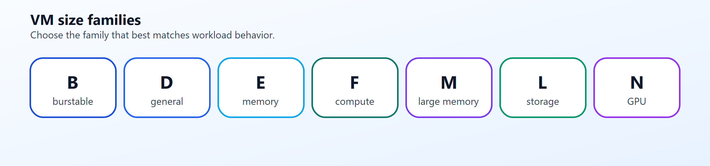
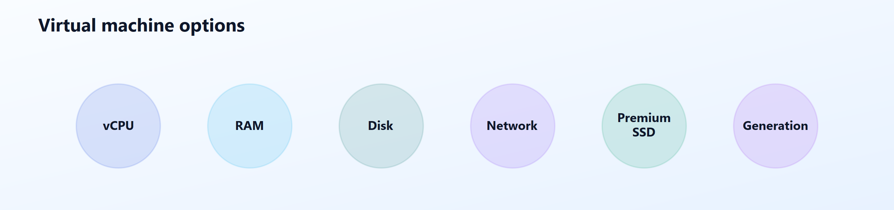
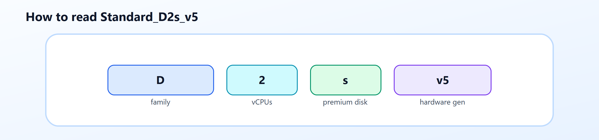
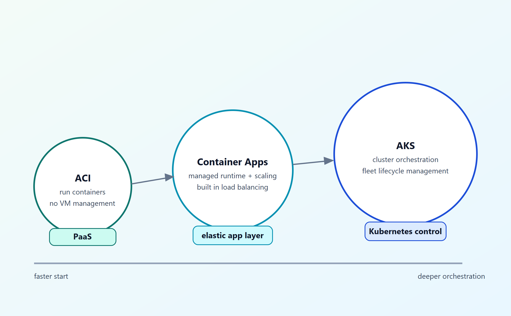

# AZ-900 — Servicios de proceso de Azure

Módulo 05 del [AZ-900T00](https://learn.microsoft.com/es-es/training/courses/az-900t00) · Ruta 2 · Área: Descripción de la arquitectura y los servicios de Azure (35–40%). El slug del módulo mantiene el nombre histórico `describe-azure-compute-networking-services` aunque el título actual es solo de proceso (el de redes volvió a ser módulo aparte).

## Concepto

Opciones de cómputo y cuándo usar cada una: máquinas virtuales y sus recursos, Virtual Machine Scale Sets, [[Azure Virtual Desktop]], contenedores ([[AKS]]/ACI), Azure Functions (serverless), opciones de hospedaje de aplicaciones y Azure Marketplace.

## Resumen en mis palabras

> *(pendiente — rellenar al estudiar el módulo)*

## Por qué importa para el examen

> *(pendiente — rellenar al estudiar el módulo)*

## Enlaces relacionados

**Módulo de Learn**: [Descripción de los servicios de proceso de Azure](https://learn.microsoft.com/es-es/training/modules/describe-azure-compute-networking-services/)

**AZ-900 Full Course de Savill** (vídeo por tema, @duración):
- [Describe the Resources Required for Virtual Machines — 06:17](https://youtu.be/PP5BWZ0cAJo)
- [Benefits and Usage of Core Compute Resources — 34:32](https://youtu.be/yKDSAYDLGrI)
- [Benefits and Usage of Serverless Technologies — 06:54](https://youtu.be/-xeJGiMw5OE)
- [Benefits and Usage of Azure Marketplace — 03:12](https://youtu.be/b7RuB4Bymgc)

**Páginas de `knowledge/`**: [[AKS]] · [[Azure Virtual Desktop]]

## Introducción

En este módulo se presentan los servicios de proceso de Azure y las opciones de innovación relacionadas. Obtenga información sobre las opciones de proceso principales, como máquinas virtuales, contenedores y Azure Functions. También revisará las opciones de hospedaje de aplicaciones con Azure App Service y aspectos básicos de los servicios de Azure AI, aprendizaje automático e IoT/Edge.

## Descripción de Azure Virtual Machines.

Con Azure Virtual Machines (VM), puede ejecutar servidores virtualizados en Azure como infraestructura como servicio (IaaS). Al igual que un servidor físico, controla el sistema operativo y el software instalado. Las máquinas virtuales son una buena opción cuando se necesita:

Control total sobre el sistema operativo (SO).
Capacidad de ejecutar software personalizado.
Usar configuraciones de hospedaje personalizadas.
Las máquinas virtuales de Azure eliminan la necesidad de comprar y mantener hardware de servidor físico. Como servicio IaaS, seguirá gestionando los parches, las actualizaciones y la configuración dentro de la máquina virtual.

Puede implementar máquinas virtuales rápidamente a partir de imágenes precompiladas. Una imagen es una plantilla que ya incluye un sistema operativo y herramientas como componentes de hospedaje web.

## Descripción de las familias y nombres de tamaño de máquina virtual.

Los tamaños de máquina virtual de Azure se agrupan en familias para que pueda elegir rápidamente un tamaño en función de sus necesidades de carga de trabajo.

| Familia | Enfoque típico | Ejemplo de uso |
| :--- | :--- | :--- |
| Serie B | Elástica, económica | Cargas de trabajo de desarrollo y pruebas con picos de CPU ocasionales |
| Serie D | Uso general | Servidores web, servidores de aplicaciones pequeños a medianos |
| Serie E | Optimización de memoria | Bases de datos en memoria, cargas de trabajo de análisis |
| Serie F | Optimización informática | Niveles de aplicaciones intensivos en CPU |
| Serie M | Uso de memoria grande | Bases de datos empresariales de gran tamaño |
| Serie L | Almacenamiento optimizado | Almacenamiento y procesamiento de datos de alto rendimiento |
| Serie N | GPU habilitada | Cargas de trabajo de aprendizaje e inferencia de inteligencia artificial y gráficos |

Cada máquina virtual también tiene opciones que puede personalizar en función de sus necesidades. Puede ajustar el número de CPU virtuales (vCPU), la cantidad de RAM y la configuración del disco de almacenamiento.

Algunos de los ajustes que puede realizar son:

Recuento de vCPU: afecta a la capacidad de proceso para cargas de trabajo simultáneas y enlazadas a CPU.
RAM: afecta a la cantidad de datos de trabajo que la máquina virtual puede mantener en memoria.
Configuración del disco: afecta a la capacidad de almacenamiento, las IOPS y el rendimiento.
Rendimiento de red: afecta al rendimiento de la transferencia de datos dentro y fuera de la máquina virtual.
Compatibilidad con SSD Premium: indica si el tamaño admite discos administrados Premium.
Generación de hardware: indica la generación de plataformas y puede afectar al rendimiento de línea base.

D: la familia de máquinas virtuales (de uso general en este caso)
2: el número de vCPUs para este tamaño
s: admite el almacenamiento SSD Premium.
v5: generación de hardware para esa familia

## Descripción de Azure Virtual Desktop.

Azure Virtual Desktop es un servicio de virtualización de aplicaciones y de escritorio en Azure. Permite a los usuarios acceder de forma segura a escritorios y aplicaciones de Windows desde muchos tipos de dispositivos y ubicaciones.

En un nivel fundamental, Azure Virtual Desktop es una opción administrada para el acceso a Escritorio remoto donde los escritorios y las aplicaciones permanecen en la nube en lugar de en dispositivos locales.

### Cuándo usar Azure Virtual Desktop.

Use Azure Virtual Desktop cuando un equipo necesite acceso centralizado a escritorios y aplicaciones entre usuarios distribuidos, contratistas o trabajadores híbridos.

### Descripción de contenedores de Azure.

#### Azure Container Instances
Azure Container Instances ofrece la manera más rápida y sencilla de ejecutar un contenedor en Azure, sin administrar ninguna máquina virtual ni adoptar servicios adicionales. Azure Container Instances es una oferta de plataforma como servicio (PaaS). Usted sube sus contenedores y el servicio los ejecuta por usted.

#### Azure Container Apps
Azure Container Apps son similares de muchas maneras a una instancia de contenedor. Permiten ponerse en marcha de inmediato, quitan la sobrecarga de administración de contenedores y son una oferta de PaaS. Container Apps también incluye equilibrio de carga integrado y escalado, por lo que el diseño puede adaptarse a la demanda cambiante.

#### Azure Kubernetes Service
Azure Kubernetes Service (AKS) es un servicio de orquestación de contenedores. Un servicio de orquestación administra el ciclo de vida de los contenedores. Al implementar una flota de contenedores, AKS puede hacer que la administración de flotas sea más sencilla y eficaz.

**Proyecto guiado**: [Creación de un punto de conexión de sitio web sencillo con Azure Functions](https://learn.microsoft.com/es-es/training/modules/guided-project-build-basic-website-endpoint-with-functions/)

## Relacionado

- [Índice AZ-900](../certifications/AZ-900/INDEX.md)
