# AZ-900 — Identidad, acceso y seguridad en Azure

Módulo 08 del [AZ-900T00](https://learn.microsoft.com/es-es/training/courses/az-900t00) · Ruta 2 · Área: Descripción de la arquitectura y los servicios de Azure (35–40%). Es el módulo con más vídeos de Savill asignados (9).

## Concepto

Servicios de directorio ([[Entra ID]] y Entra Domain Services), autenticación (SSO, MFA, passwordless), identidades externas, acceso condicional, [[Azure RBAC]], y modelos de seguridad: Confianza Cero, defensa en profundidad y Microsoft Defender for Cloud.

## Resumen en mis palabras

> En este módulo, se le presentará la identidad, el acceso y las herramientas y servicios de seguridad de Azure. Obtendrá información sobre los servicios de directorio en Azure, los métodos de autenticación y el control de acceso. También tratará la confianza cero, la defensa en profundidad y cómo mantienen su nube más segura. Por último, revisará los conceptos de cifrado, la administración de claves con Azure Key Vault y Microsoft Defender for Cloud.

## Por qué importa para el examen

> - Describir los servicios de directorio en Azure, incluido el identificador de Microsoft Entra y Microsoft Entra Domain Services.
> - Describir los métodos de autenticación en Azure, incluido el inicio de sesión único (SSO), la autenticación multifactor (MFA) y sin contraseña.
> - Describir identidades externas y acceso de invitado en Azure.
> - Describir el acceso condicional de Microsoft Entra.
> - Describir el control de acceso basado en rol (RBAC) de Azure.
> - Describir el concepto de Confianza cero.
> - Describir el propósito del modelo de defensa en profundidad.
> - Describir los conceptos de cifrado y las opciones de administración de claves en Azure.
> - Describir el propósito de Microsoft Defender for Cloud.

## Enlaces relacionados

**Módulo de Learn**: [Descripción de la identidad, el acceso y la seguridad de Azure](https://learn.microsoft.com/es-es/training/modules/describe-azure-identity-access-security/)

**AZ-900 Full Course de Savill** (vídeo por tema, @duración):
- [Overview of Microsoft Entra — 11:34](https://youtu.be/bSIF_GjaCmo)
- [Explain Authentication and Authorization — 03:52](https://youtu.be/GA-yNu6aFMk)
- [Describe Azure Directory Services — 14:06](https://youtu.be/E4__JBVE25I)
- [Functionality of Conditional Access, MFA and SSO — 12:29](https://youtu.be/DFwERh9Xxk0)
- [Describe Azure External Identities — 11:14](https://youtu.be/G5_z4PFgn2o)
- [Functionality and Usage of RBAC — 09:19](https://youtu.be/0iVyJBG06fM)
- [Describe the Concept of Zero Trust — 08:13](https://youtu.be/JX3w4to-qgo)
- [Concept of Defense in Depth — 07:17](https://youtu.be/CHKS2FcEMek)
- [Functionality of Microsoft Defender for Cloud — 09:47](https://youtu.be/eWcoMi_nQt4)

**Páginas de `knowledge/`**: [[Entra ID]] · [[Azure RBAC]] · [[Managed Identities]] · [[Key Vault]]

**Proyecto guiado**: [Configurar el nuevo acceso de los empleados (Id. de Entra y RBAC)](https://learn.microsoft.com/es-es/training/modules/guided-project-new-employee-access/)

## Relacionado

- [Índice AZ-900](../certifications/AZ-900/INDEX.md)
- Laboratorio: [acceso de empleados con Entra ID y RBAC](../labs/AZ-900/Entra/entra.md)

## Descripción de los servicios de directorio de Azure.

Microsoft Entra ID es el servicio de administración de identidades y acceso basada en la nube de Microsoft. Permite iniciar sesión y acceder tanto a las aplicaciones en la nube de Microsoft como a las aplicaciones en la nube que desarrolle.

### ¿Quién usa Microsoft Entra ID?

- **Administradores de TI**. Los administradores pueden usar el identificador de Entra de Microsoft para controlar el acceso a aplicaciones y recursos en función de los requisitos de carga de trabajo y seguridad.
- **Desarrolladores de aplicaciones**. Con Microsoft Entra ID, los desarrolladores pueden agregar funcionalidad a las aplicaciones que compilan mediante un enfoque basado en estándares. Por ejemplo, pueden agregar funcionalidad de SSO a una aplicación o habilitar una aplicación para que funcione con las credenciales existentes de un usuario.
- **Usuarios**. Los usuarios pueden administrar sus identidades y realizar acciones de mantenimiento como el autoservicio de restablecimiento de contraseña.
- **Suscriptores de servicios en línea**. Los suscriptores de Microsoft 365, Microsoft Office 365, Azure y Microsoft Dynamics CRM Online ya usan Microsoft Entra ID para autenticarse en su cuenta.

### ¿Qué hace Microsoft Entra ID?.

Microsoft Entra ID proporciona servicios como:

- **Autenticación** : comprueba la identidad antes de conceder acceso. Incluye autoservicio de restablecimiento de contraseña, autenticación multifactor, listas de contraseñas prohibidas y bloqueo inteligente.
- **Inicio de sesión único (SSO)**: permite que una identidad acceda a varias aplicaciones. Las ventajas y el comportamiento de SSO se abarcan en la unidad de métodos de autenticación.
- **Administración de aplicaciones**: administra aplicaciones locales y en la nube a través de características como Application Proxy, integración de aplicaciones SaaS y el portal Mis aplicaciones.
- **Administración de dispositivos**: admite el registro y la administración de dispositivos a través de herramientas como Microsoft Intune. Habilita las directivas de acceso condicional basadas en dispositivos que restringen el acceso a dispositivos conocidos.

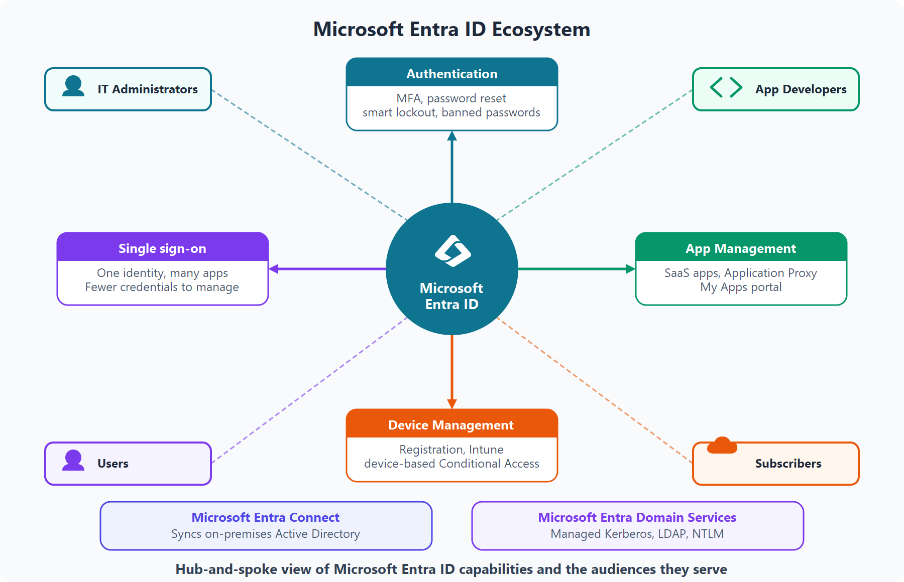

### ¿Puedo conectar mi AD local con Microsoft Entra ID?

Sin una conexión, un despliegue de Active Directory local y un despliegue de Identidad de Microsoft Entra ID en la nube requieren que mantenga dos conjuntos de identidades independientes. Microsoft Entra Connect puentea esa brecha.

### ¿Qué es Microsoft Entra Domain Services?.

Microsoft Entra Domain Services proporciona servicios de dominio administrados ( unión a un dominio, directiva de grupo, LDAP y autenticación Kerberos/NTLM) sin necesidad de implementar o mantener controladores de dominio en la nube.

### ¿Cómo funciona Microsoft Entra Domain Services?

Cuando cree un dominio administrado de Microsoft Entra Domain Services, defina un espacio de nombres único. Este 'namespace' es el nombre de dominio. Después, se implementan dos controladores de dominio de Windows Server en la región de Azure seleccionada. Esta implementación de controladores de dominio se conoce como "conjunto de réplicas".

### ¿La información está sincronizada?

Un dominio administrado está configurado para realizar una sincronización unidireccional desde Microsoft Entra ID a Microsoft Entra Domain Services.

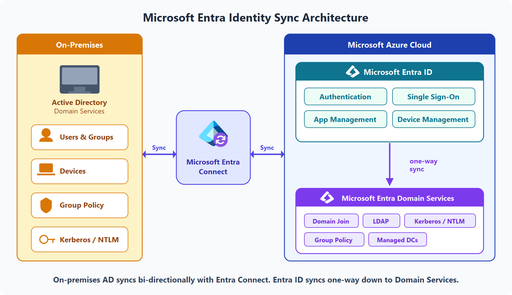

## Descripción de los métodos de autenticación de Azure.

La autenticación establece la identidad de una persona, servicio o dispositivo al requerir credenciales. En Azure, los métodos comunes incluyen contraseñas, inicio de sesión único (SSO), autenticación multifactor (MFA) y inicio de sesión sin contraseña. Los enfoques modernos están diseñados para mejorar la seguridad y la comodidad del usuario.

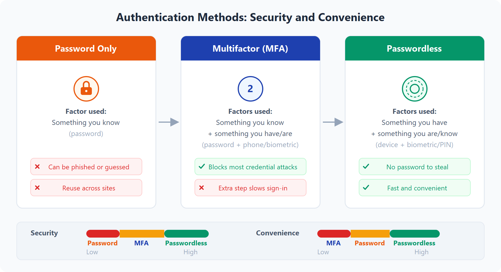

### ¿Qué es el inicio de sesión único?

El inicio de sesión único (SSO) permite al usuario iniciar sesión una vez y acceder a varias aplicaciones de confianza. El inicio de sesión único reduce la proliferación de contraseñas, lo que disminuye el riesgo de incidentes relacionados con credenciales y disminuye el bloqueo de cuentas y la carga de restablecimientos.

### ¿Qué es la autenticación multifactor?
La autenticación multifactor (MFA) requiere que los usuarios proporcionen dos o más formas.
- Algo que el usuario sabe : una contraseña o una pregunta de desafío.
- Algo que el usuario tiene : un código enviado a un teléfono móvil.
- Algo que el usuario es : una señal biométrica, como una huella digital o un examen facial.

### ¿Qué es la autenticación multifactor de Microsoft Entra?
La autenticación multifactor de Microsoft Entra es un servicio de Microsoft que proporciona funcionalidades de autenticación multifactor.

### ¿Qué es la autenticación sin contraseña?
Aunque MFA agrega seguridad, las propias contraseñas siguen siendo un desafío de facilidad de uso y riesgo. Los métodos sin contraseña eliminan la contraseña por completo y la reemplazan por un dispositivo de confianza más una señal biométrica o un PIN.

Después del registro inicial, el usuario inicia sesión con un factor que sabe o es , como un PIN o una huella digital, en lugar de escribir una contraseña.

Microsoft Entra ID admite tres opciones sin contraseña:

- Windows Hello para empresas
- Aplicación Microsoft Authenticator
- Claves de seguridad FIDO2.

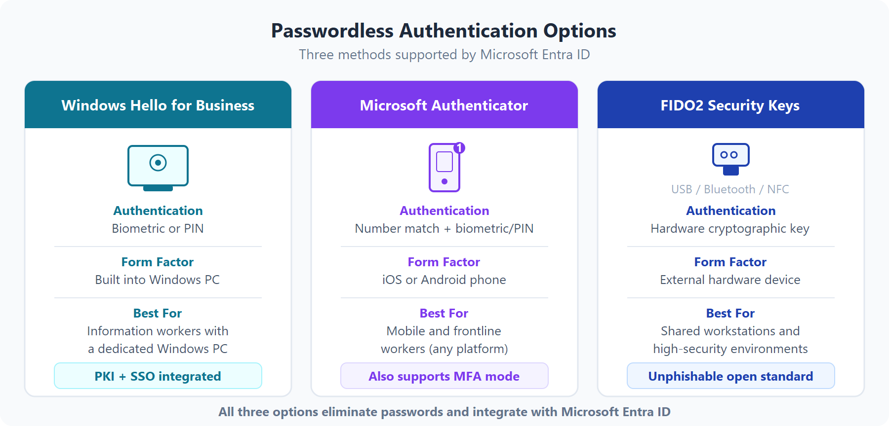

### Windows Hello para empresas

Windows Hello para empresas resulta muy conveniente para los trabajadores de la información que tienen su propio equipo con Windows designado. La información biométrica y las credenciales de PIN están vinculadas directamente al equipo del usuario, lo que impide el acceso de cualquier persona que no sea el propietario. Con la integración de la infraestructura de clave pública (PKI) y la compatibilidad integrada con el inicio de sesión único (SSO), Windows Hello para empresas proporciona un método práctico para acceder sin problemas a los recursos de trabajo locales y en la nube.

Aplicación Microsoft Authenticator

La aplicación Microsoft Authenticator también puede servir como credencial sin contraseña, convirtiendo cualquier teléfono iOS o Android en un factor de inicio de sesión seguro.

Para iniciar sesión, el usuario recibe una notificación en su teléfono, coincide con un número mostrado en la pantalla y confirma con una señal biométrica (entrada táctil o cara) o PIN. No se necesita ninguna contraseña.

### Claves de seguridad FIDO2

FIDO2 es un estándar abierto para la autenticación sin contraseña basada en la especificación de autenticación web (WebAuthn). Las claves de seguridad FIDO2 son dispositivos de hardware inphishable ( normalmente USB, pero también disponibles con Bluetooth o NFC) que controlan la autenticación sin un nombre de usuario o una contraseña.

Los usuarios registran una clave FIDO2 y, a continuación, la seleccionan en la pantalla de inicio de sesión como método de autenticación principal. Dado que el dispositivo de hardware controla la autenticación, no hay ninguna contraseña que se pueda exponer o adivinar.

## ¿Por qué importan las identidades externas?

A menudo, las organizaciones necesitan colaborar con asociados, proveedores, proveedores y contratistas. Las identidades externas permiten a esos usuarios acceder a los recursos aprobados mediante sus credenciales existentes, mientras que el equipo sigue aplicando directivas de acceso.
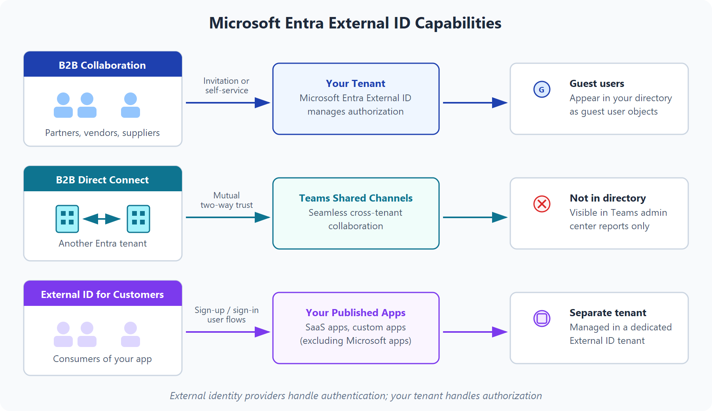

### Funcionalidades de identificador externo

- Colaboración B2B : colabore con usuarios externos al permitirles usar su identidad preferida para iniciar sesión en las aplicaciones de Microsoft u otras aplicaciones internas (aplicaciones SaaS, aplicaciones desarrolladas de forma personalizada, etc.). Los usuarios de colaboración B2B se representan en el directorio, normalmente como usuarios invitados.
  
- Conexión directa B2B : establezca una confianza mutua bidireccional con otro inquilino de Microsoft Entra para una colaboración sin problemas. La conexión directa B2B actualmente es compatible con los canales compartidos de Teams, lo que permite a los usuarios externos acceder a sus recursos desde sus instancias principales de Teams. Los usuarios de conexión directa B2B no se representan en el directorio, pero son visibles desde el canal compartido de Teams y se pueden supervisar en Teams informes del centro de administración.
  
- Id. externo de Microsoft Entra para clientes (anteriormente Azure AD B2C): publique aplicaciones SaaS modernas o aplicaciones desarrolladas personalizadas (excepto las aplicaciones de Microsoft) para consumidores y clientes, al tiempo que use Entra External ID para la administración de identidades y acceso.
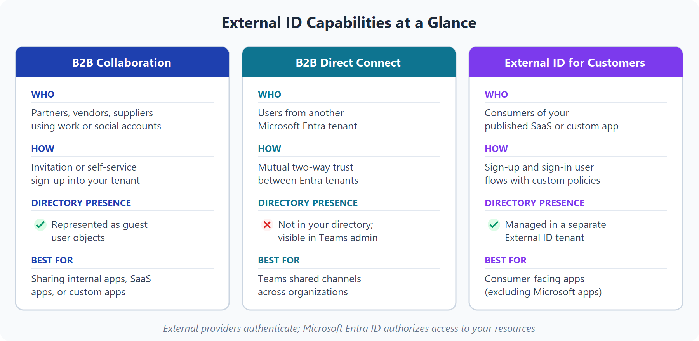

## Descripción del acceso condicional de Azure.

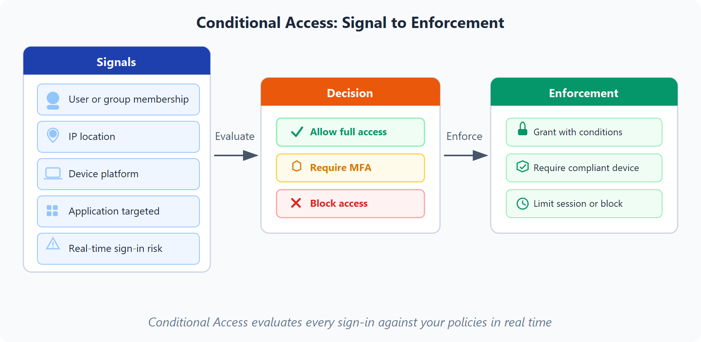

### ¿Cuándo se puede usar el acceso condicional?.

- Exija la autenticación multifactor (MFA) para acceder a una aplicación en función del rol, la ubicación o la red del solicitante. Por ejemplo, podría requerir MFA para administradores o para personas que se conectan desde ubicaciones de red de confianza externas.
- Requerir acceso a los servicios solo a través de aplicaciones cliente aprobadas. Por ejemplo, podría limitar qué aplicaciones de correo electrónico pueden conectarse al servicio de correo electrónico.
- Exija que los usuarios accedan a la aplicación solo desde dispositivos administrados. Un dispositivo administrado es un dispositivo que cumple los estándares de seguridad y cumplimiento.
- Para bloquear el acceso desde orígenes que no son de confianza, como ubicaciones desconocidas o inesperadas.
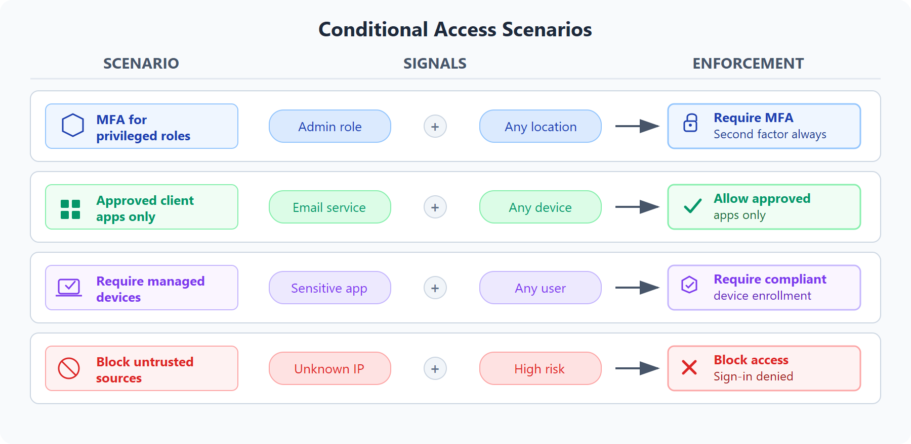

## Descripción del control de acceso basado en roles de Azure.
Cuando tenemos varios equipos de TI e ingeniería, ¿cómo podemos controlar el acceso que tienen a los recursos del entorno de nube? El principio de privilegios mínimos indica que solo debe conceder acceso al nivel necesario para completar una tarea. Si solo necesita acceso de lectura a un blob de almacenamiento, solo se le debe conceder acceso de lectura a ese blob de almacenamiento, no acceso de escritura ni acceso a otros blobs. Es una buena práctica de seguridad que se debe seguir.

### ¿Cómo se aplica el control de acceso basado en roles a los recursos?.
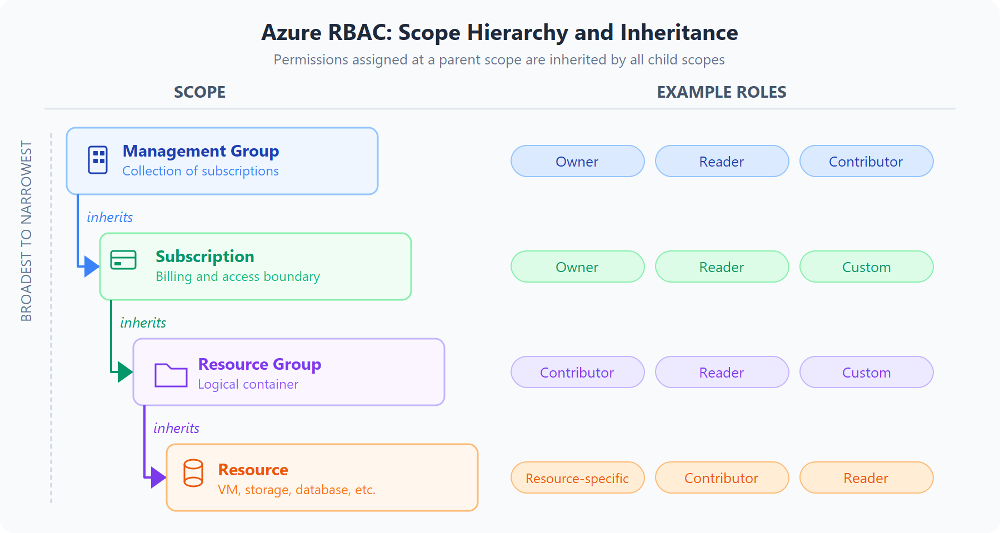

## Describir el modelo de confianza cero.

Confianza cero es un modelo de seguridad que supone el peor de los escenarios posibles y protege los recursos con esa expectativa. Confianza cero presupone que hay una vulneración y comprueba todas las solicitudes como si provinieran de una red no controlada.

Para abordar este nuevo mundo informático, Microsoft recomienda encarecidamente el modelo de seguridad de Confianza cero, que se basa en estos principios rectores:

- Comprobar explícitamente: realice siempre las operaciones de autorización y autenticación en función de todos los puntos de datos disponibles.

- Usar el acceso de privilegios mínimos: limite el acceso de los usuarios con Just-in-Time y Just-Enough-Access (JIT/JEA), directivas que se adaptan al nivel de riesgo y protección de datos.

- Asumir brecha: limite el impacto potencial y segmente el acceso. Comprobación del cifrado de un extremo a otro. Utilice el análisis para obtener visibilidad, impulsar la detección de amenazas y mejorar las defensas.

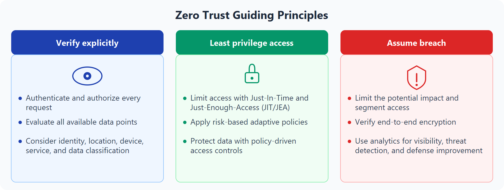

### Ejemplo en la práctica
Supongamos que un usuario inicia sesión desde un dispositivo no administrado en una red pública. Un enfoque de confianza cero sigue evaluando las señales de identidad, el estado del dispositivo y las condiciones de riesgo antes de conceder acceso. Puede permitir el acceso a aplicaciones de bajo riesgo, requerir MFA para sistemas confidenciales o bloquear el inicio de sesión por completo cuando el riesgo es demasiado alto.

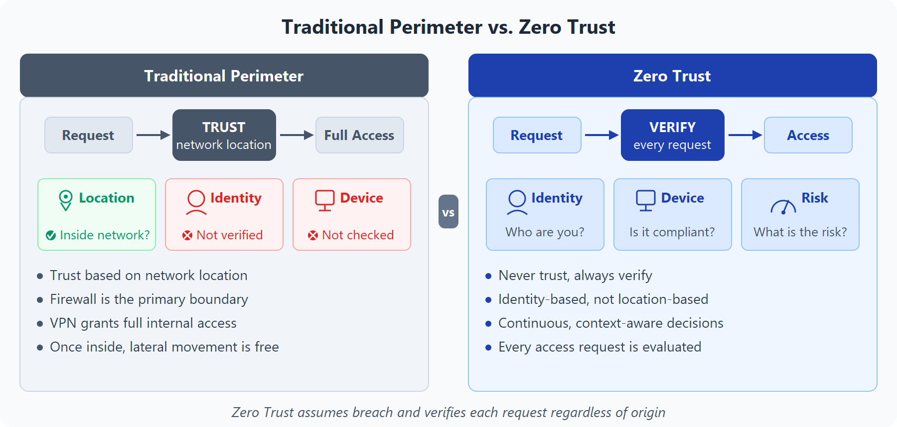

### Descripción de defensa en profundidad

El objetivo de la defensa en profundidad es proteger la información y evitar que personas no autorizadas a acceder puedan sustraerla.

### Capas de defensa en profundidad

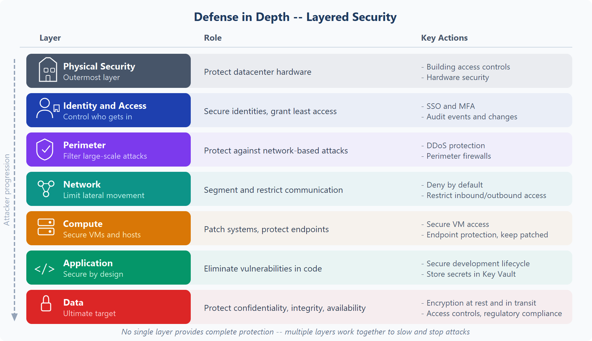

- La capa de seguridad física es la primera línea de defensa para proteger el hardware informático del centro de datos.
- La capa de identidad y acceso controla el acceso a la infraestructura y al control de cambios.
- La capa perimetral usa protección frente a ataques de denegación de servicio distribuido (DDoS) para filtrar los ataques a gran escala antes de que puedan causar una denegación de servicio para los usuarios.
- La capa de red limita la comunicación entre los recursos a través de controles de acceso y segmentación.
- La capa de proceso protege el acceso a las máquinas virtuales.
- La capa de aplicación ayuda a garantizar que las aplicaciones sean seguras y estén libres de vulnerabilidades de seguridad.
- La capa de datos controla el acceso a los datos operativos y de cliente que necesita proteger.

## Descripción del cifrado y la administración de claves en Azure.

El cifrado ayuda a proteger la confidencialidad de los datos haciendo que los datos no sean legibles para los usuarios no autorizados.

### Cifrado en reposo y en tránsito
El cifrado en reposo protege los datos cuando se almacenan, como en bases de datos, discos y cuentas de almacenamiento.
El cifrado en tránsito protege los datos mientras se mueve entre servicios, aplicaciones y usuarios.

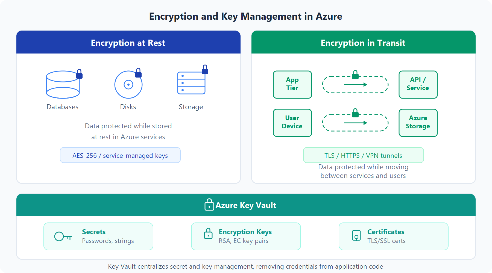

Considere una aplicación de línea de negocio que almacena los registros de clientes en Azure Storage y Azure SQL. Los datos deben cifrarse mientras se almacenan en esos servicios y mientras se mueven entre los niveles de aplicación, las API y los dispositivos de usuario.

### Administración de claves con Azure Key Vault

El uso de Key Vault ayuda a centralizar la administración de secretos y claves en lugar de almacenar valores confidenciales directamente en archivos de configuración o código de aplicación.

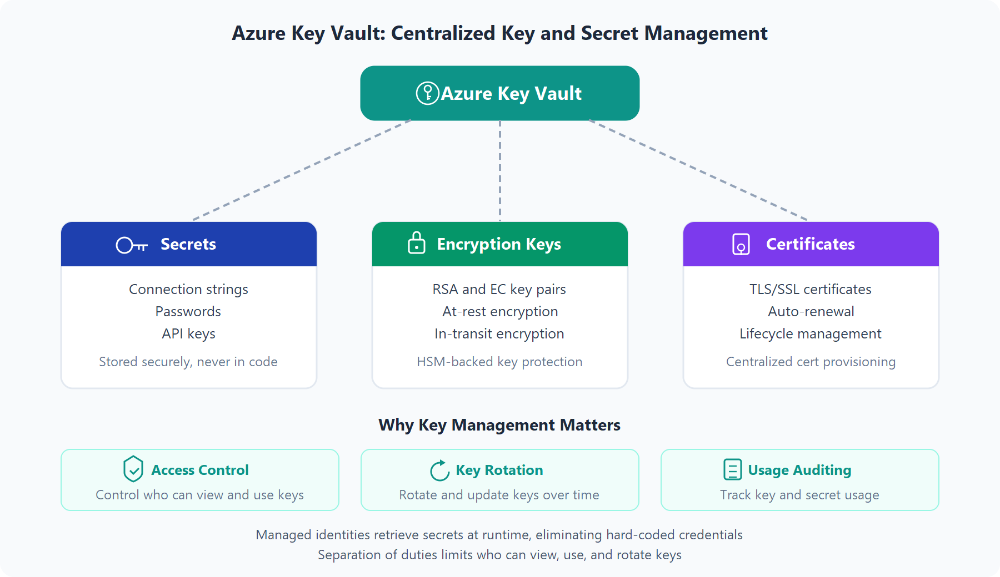

## Descripción de Microsoft Defender for Cloud.

Defender for Cloud es un servicio de administración de posturas de seguridad y protección contra amenazas. Supervisa los recursos en la nube, locales, híbridos y multinube y proporciona recomendaciones y alertas para mejorar la posición de seguridad.

Defender for Cloud le permite detectar amenazas en:

- Servicios PaaS de Azure: detecta amenazas en servicios como App Service, Azure SQL y Azure Storage.
- Servicios de datos de Azure: proporciona evaluaciones y recomendaciones de seguridad de datos para servicios como Azure SQL y Storage.
- Redes: ayuda a reducir la exposición por fuerza bruta a través de controles como el acceso a máquinas virtuales Just-In-Time y las directivas de puerto restrictivas.
- Defender for Cloud también puede proteger los recursos de otras nubes, incluidos AWS y GCP.

Defender for Cloud cubre tres necesidades vitales a medida que administra la seguridad de los recursos y las cargas de trabajo en la nube y en el entorno local:

- Evaluación continua: conozca la posición de seguridad. Identifique y realice un seguimiento de las vulnerabilidades.
- Seguro: proteja los recursos y los servicios con la prueba comparativa de seguridad en la nube de Microsoft (MCSB).
- Defensa: detecte y resuelva las amenazas a recursos, cargas de trabajo y servicios.

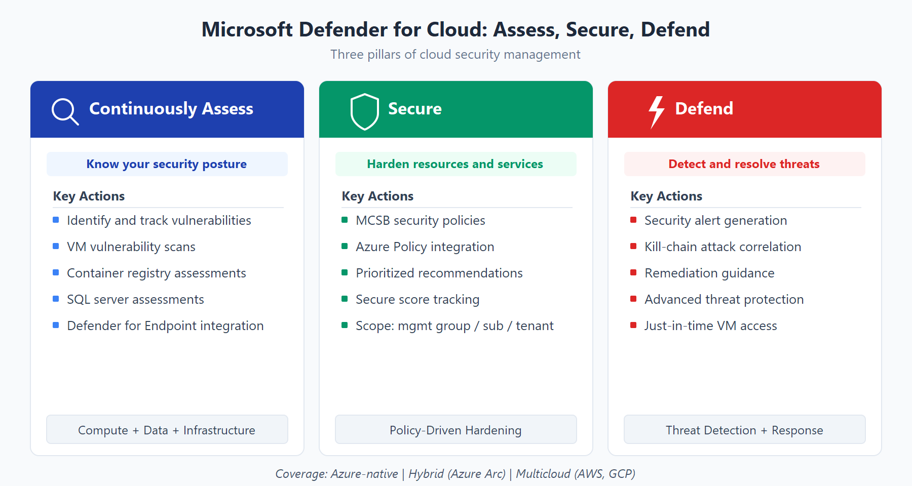