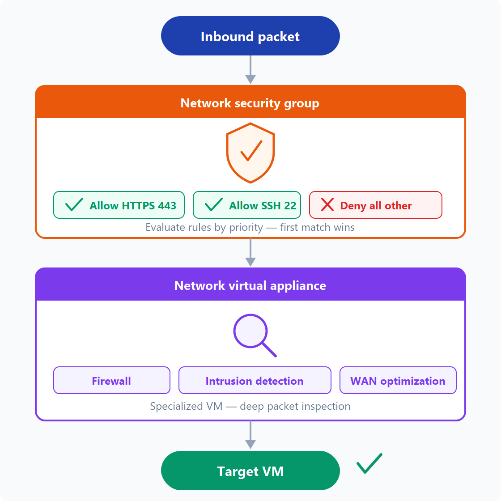
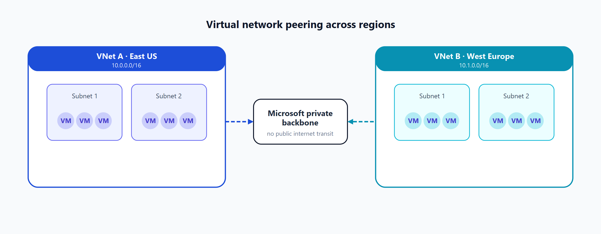
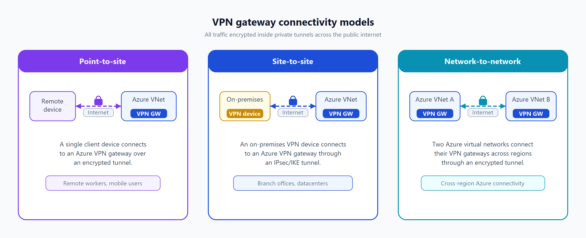
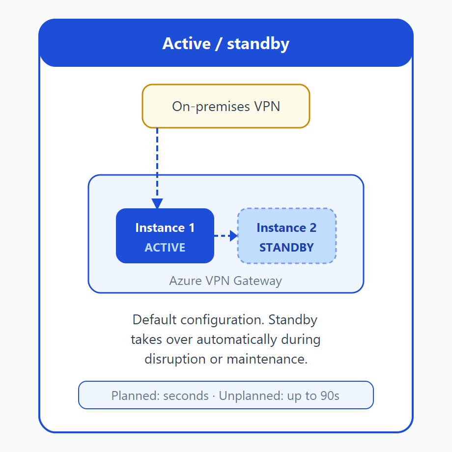
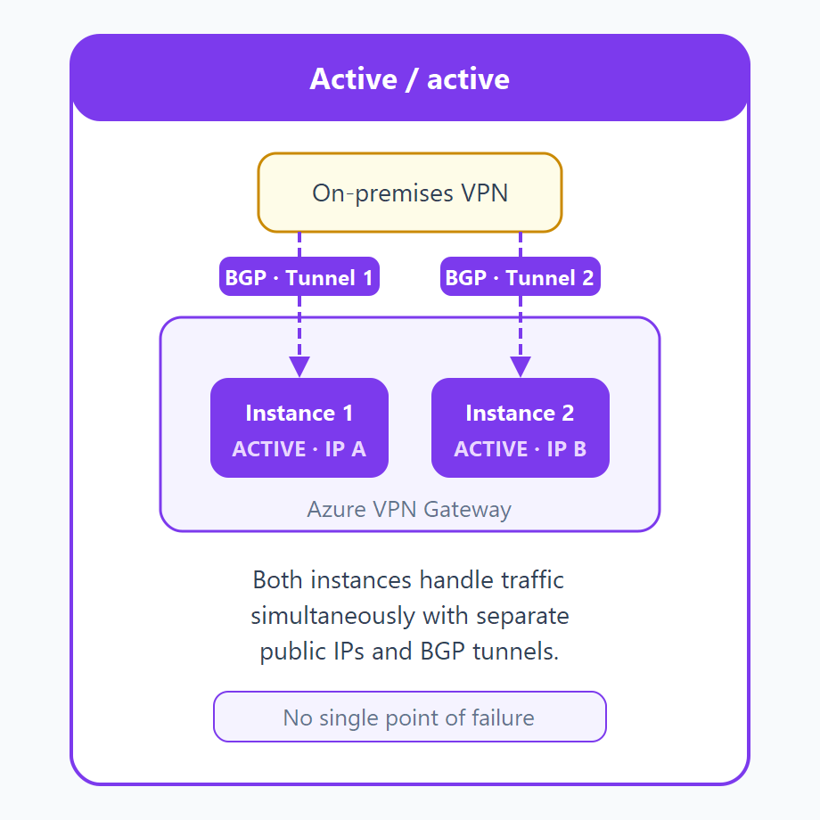
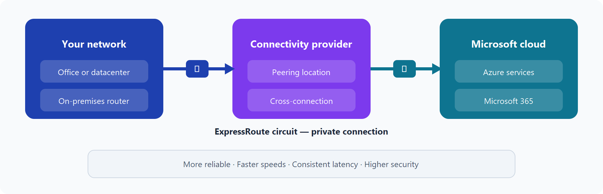
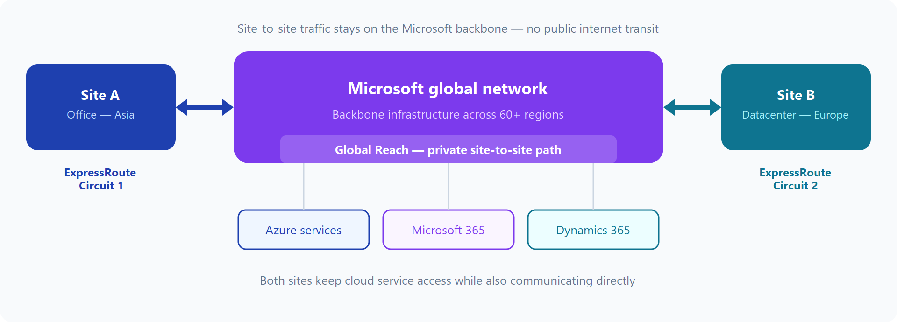
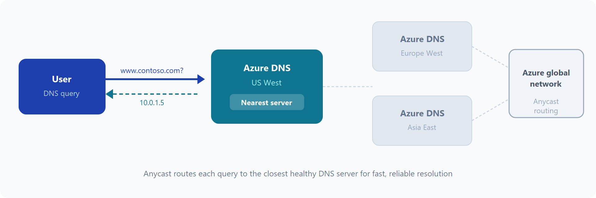
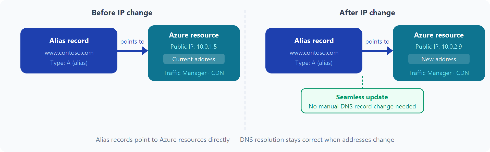

# AZ-900 — Servicios de red de Azure

Módulo 06 del [AZ-900T00](https://learn.microsoft.com/es-es/training/courses/az-900t00) · Ruta 2 · Área: Descripción de la arquitectura y los servicios de Azure (35–40%). Módulo separado de nuevo desde ~2026-03 (antes estaba fusionado con el de proceso).

## Concepto

Redes virtuales, subredes y puntos de conexión; conectividad híbrida con VPN Gateway y ExpressRoute; Azure DNS; y controles básicos de acceso a la red (NSG).

## Resumen en mis palabras

En este módulo se presentan las funcionalidades de red de Azure para una comunicación segura entre los recursos de Azure, los entornos locales y los clientes conectados a Internet.

## Por qué importa para el examen

> *(pendiente — rellenar al estudiar el módulo)*

## Enlaces relacionados

**Módulo de Learn**: [Descripción de los servicios de red de Azure](https://learn.microsoft.com/es-es/training/modules/describe-azure-networking-services/)

**AZ-900 Full Course de Savill** (vídeo por tema, @duración):
- [Benefits and Usage of Core Network Resources — 22:04](https://youtu.be/aNK0C9Oj2sg)
- [Describe Public and Private Endpoints — 07:23](https://youtu.be/bPNkXwRFsek)
- [Functionality and Usage of NSGs — 08:32](https://youtu.be/flCoRc1uv9o)

**Páginas de `knowledge/`**: [[Azure Networking]] (página de concepto, a ampliar) · [[Private Endpoints]] · [[Hub-Spoke]]

## Relacionado

- [Índice AZ-900](../certifications/AZ-900/INDEX.md)

## Descripción de los servicios de red de Azure.

**Objetivos de aprendizaje**
Después de completar este módulo, podrá:

Describir las redes virtuales de Azure, incluidas las subredes y los puntos de conexión

Descripción de las opciones de conectividad con Azure VPN Gateway

Describir cuándo usar Azure ExpressRoute

Descripción de las funcionalidades de Azure DNS

Descripción de los controles básicos de acceso a la red para los recursos de Azure

## Descripción de las redes virtuales de Azure.

### Aislamiento y segmentación
Azure Virtual Network le permite crear varias redes virtuales aisladas. Al configurar una red virtual, se define un espacio de direcciones IP privadas con intervalos de direcciones IP públicas o privadas. El intervalo IP solo existe dentro de la red virtual y no es enrutable en Internet. Después, puede dividir ese espacio de direcciones IP en subredes y asignar parte del espacio de direcciones definido a cada subred con nombre.

Para la resolución de nombres, puede usar el servicio de resolución de nombres integrado en Azure. También puede configurar la red virtual para que use un servidor DNS interno o externo.

### Comunicación con Internet
Puede permitir conexiones entrantes desde Internet mediante la asignación de una dirección IP pública a un recurso de Azure o la colocación del recurso detrás de un equilibrador de carga público.

### Comunicación entre recursos de Azure
Los recursos de Azure se pueden comunicar de forma segura entre sí de una de estas dos maneras:

Las redes virtuales no solo pueden conectar máquinas virtuales, sino también otros recursos de Azure, como App Service Environment para Power Apps, Azure Kubernetes Service y conjuntos de escalado de máquinas virtuales de Azure.
Los puntos de conexión de servicio se pueden conectar a otros tipos de recursos de Azure, como cuentas de almacenamiento y bases de datos de Azure SQL. Este enfoque le permite vincular varios recursos de Azure a redes virtuales para mejorar la seguridad y proporcionar un enrutamiento óptimo entre los recursos.

### Comunicación con recursos localizados en las instalaciones
Las redes virtuales de Azure permiten vincular recursos en el entorno local y dentro de la suscripción de Azure. De hecho, puede crear una red que abarque tanto el entorno local como el entorno en la nube. Hay tres maneras de lograr esta conectividad:

Las conexiones de red privada virtual de punto a sitio van de un equipo ajeno al entorno a su red privada. En este caso, el equipo cliente inicia una conexión VPN cifrada para conectarse a la red virtual de Azure.
Las redes virtuales privadas de sitio a sitio vinculan el dispositivo o puerta de enlace de VPN local con la puerta de enlace de VPN de Azure en una red virtual. De hecho, puede parecer que los dispositivos de Azure están en la red local. La conexión se cifra y funciona a través de Internet.
Azure ExpressRoute proporciona una conectividad privada dedicada a Azure que no se desplaza por Internet. ExpressRoute es útil para los entornos donde se necesita más ancho de banda e incluso mayores niveles de seguridad.

### Enrutar tráfico de red
De forma predeterminada, Azure enruta el tráfico entre las subredes de todas las redes virtuales conectadas, las redes locales e Internet. También puede controlar el enrutamiento e invalidar esa configuración del siguiente modo:

Las tablas de rutas permiten definir reglas sobre cómo se debe dirigir el tráfico. Puede crear tablas de rutas personalizadas que controlen cómo se enrutan los paquetes entre las subredes.
El Protocolo de puerta de enlace de borde (BGP) funciona con puertas de enlace de VPN de Azure, Azure Route Server o Azure ExpressRoute para propagar las rutas BGP locales a las redes virtuales de Azure.
Las rutas definidas por el usuario (UDR) permiten controlar las tablas de enrutamiento entre subredes dentro de una red virtual o entre redes virtuales, lo que proporciona un mayor control sobre el flujo de tráfico de red.

### Filtrado del tráfico de red
Las redes virtuales de Azure permiten filtrar el tráfico entre subredes mediante los métodos siguientes:

Los grupos de seguridad de red son recursos de Azure que pueden contener varias reglas de seguridad de entrada y salida. Estas reglas se pueden definir para permitir o bloquear el tráfico en función de factores como el protocolo, el puerto y las direcciones IP de destino y origen.
Las aplicaciones virtuales de red son máquinas virtuales especializadas que se pueden comparar con un dispositivo de red protegido. Una aplicación virtual de red ejerce una función de red determinada, como ejecutar un firewall o realizar la optimización de la red de área extensa (WAN).

## Conexión de redes virtuales

Puede vincular redes virtuales entre sí mediante el emparejamiento de red virtual. El emparejamiento permite que dos redes virtuales se conecten directamente entre sí. El tráfico de red entre redes emparejadas es privado y se desplaza por la red troncal de Microsoft, y nunca entra en la red pública de Internet. El emparejamiento permite que los recursos de cada red virtual se comuniquen entre sí. Estas redes virtuales pueden estar en regiones independientes, lo que le permite crear una red interconectada global a través de Azure.

## Descripción de las redes privadas virtuales de Azure.
Una red privada virtual (VPN) usa un túnel cifrado en otra red. Normalmente, las VPN se implementan para conectar entre sí dos o más redes privadas de confianza a través de una red que no es de confianza (normalmente, la red pública de Internet). El tráfico se cifra mientras viaja por la red que no es de confianza para evitar ataques de interceptación o de otro tipo. Las VPN pueden permitir que las redes compartan información confidencial de forma segura.

### Puertas de enlace de VPN
Una puerta de enlace de VPN es un tipo de puerta de enlace de red virtual. Las instancias de Azure VPN Gateway se implementan en una subred dedicada de la red virtual y permiten la conectividad siguiente:

- Conectar los centros de datos locales a redes virtuales a través de una conexión de sitio a sitio.
- Conectar los dispositivos individuales a redes virtuales a través de una conexión de punto a sitio.
- Conectar las redes virtuales a otras redes virtuales a través de una conexión entre redes.

Todas las transferencias de datos se cifran en un túnel privado mientras atraviesan Internet. Solo se puede implementar una única instancia de puerta de enlace de VPN en cada red virtual. Sin embargo, se puede usar una puerta de enlace para conectarse a varias ubicaciones, que incluye otras redes virtuales o centros de datos locales.

Al configurar una puerta de enlace VPN, debe especificar el tipo de VPN, ya sea basada en directivas o basada en rutas. La distinción principal entre estos dos tipos es cómo determinan qué tráfico necesita cifrado. En Azure, independientemente del tipo de red privada virtual, el método de autenticación que se emplea es una clave compartida previamente.

Las instancias de VPN Gateway basadas en directivas especifican de forma estática la dirección IP de los paquetes que se deben cifrar a través de cada túnel. Este tipo de dispositivo evalúa cada paquete de datos con respecto a esos conjuntos de direcciones IP para elegir el túnel a través del cual se envía ese paquete.
En las puertas de enlace basadas en rutas, los túneles IPSec se configuran como una interfaz de red o una interfaz de túnel virtual. El enrutamiento IP (ya sean rutas estáticas o protocolos de enrutamiento dinámico) decide cuál de estas interfaces de túnel se va a usar al enviar cada paquete. Las redes privadas virtuales basadas en rutas son el método preferido para conectar dispositivos locales. Son más resistentes a los cambios de la topología, como la creación de subredes.
Si necesita alguno de los siguientes tipos de conectividad, use una instancia de VPN Gateway basada en rutas:

- Conexiones entre redes virtuales
- Conexiones de punto a sitio
- Conexiones de varios sitios
- Coexistencia con una puerta de enlace de Azure ExpressRoute

### Escenarios de alta disponibilidad.

Si va a configurar una VPN para mantener la información segura, también quiere asegurarse de que es una configuración vpn de alta disponibilidad y tolerante a errores. Hay varias maneras de maximizar la resistencia de la puerta de enlace de VPN.

De forma predeterminada, las instancias de VPN Gateway se implementan como dos instancias en una configuración de activo-en espera, incluso si solo ve un recurso de VPN Gateway en Azure. Cuando el mantenimiento planeado o la interrupción imprevista afectan a la instancia activa, la instancia en espera asume de forma automática la responsabilidad de las conexiones sin ninguna intervención del usuario. Durante esta conmutación por error, las conexiones se interrumpen, pero por lo general se restauran en cuestión de segundos si se trata del mantenimiento planeado y en un plazo de 90 segundos en el caso de las interrupciones imprevistas.

### Activo/activo.

## Descripción de Azure ExpressRoute.

Azure ExpressRoute le permite ampliar las redes locales a la nube de Microsoft a través de una conexión privada, con la ayuda de un proveedor de conectividad. Esta conexión se denomina circuito ExpressRoute. Con ExpressRoute, puede establecer conexiones a servicios en la nube de Microsoft, como Microsoft Azure y Microsoft 365. ExpressRoute permite conectar oficinas, centros de datos u otras instalaciones a la nube de Microsoft. Cada ubicación tendría su propio circuito ExpressRoute.

### Características y ventajas de ExpressRoute
Hay varias ventajas para usar ExpressRoute como servicio de conexión entre Azure y redes locales.

- Conectividad de servicios en la nube de Microsoft en todas las regiones dentro de la región geopolítica.
- Conectividad global a los servicios de Microsoft en todas las regiones con Global Reach de ExpressRoute.
- Enrutamiento dinámico entre la red y Microsoft a través del Protocolo de puerta de enlace de borde (BGP).
- Redundancia integrada en todas las ubicaciones de configuración entre pares para una mayor confiabilidad.

### Conectividad con los Servicios en la nube de Microsoft
ExpressRoute permite el acceso directo a los siguientes servicios en todas las regiones:

- Microsoft Office 365
- Microsoft Dynamics 365
- Servicios de proceso de Azure, como Azure Virtual Machines
- Servicios en la nube de Azure, como Azure Cosmos DB y Azure Storage

### Conectividad global
Puede habilitar ExpressRoute Global Reach para intercambiar datos entre sus sitios locales en las instalaciones mediante la conexión de sus circuitos ExpressRoute. Por ejemplo, supongamos que tiene una oficina en Asia y un centro de datos en Europa, ambos con circuitos ExpressRoute que los conectan a la red de Microsoft. Puede usar Global Reach de ExpressRoute para conectar esas dos instalaciones, lo que les permite comunicarse sin transferir datos a través de la red pública de Internet.

> **Nota**
> 
> Qué es BGP (Border Gateway Protocol)
>Es el protocolo que usa Internet para decidir por qué camino debe viajar el tráfico cuando hay varias redes conectadas entre sí. Es literalmente el protocolo de enrutamiento que hace que Internet funcione a escala global — conecta miles de redes independientes (llamadas "sistemas autónomos") y les permite anunciarse mutuamente "estas direcciones IP están detrás de mí, puedes llegar a ellas por aquí".
> 
> **Analogía simple**
> 
>Imagina un GPS que en vez de calcular rutas de coche, calcula rutas entre redes enteras. Cada red (cada "sistema autónomo" — piensa en tu proveedor de Internet, Azure, otro proveedor) le dice a sus vecinos: "yo sé cómo llegar a estas direcciones, y me cuesta tantos saltos". Los vecinos van pasando esa información entre ellos, como un boca a boca, hasta que toda la red sabe el mejor camino para llegar a cualquier sitio.

### En palabras sencillas (con analogía)

Si la VPN era un túnel secreto cavado por debajo de la calle pública (Internet), ExpressRoute es directamente construir tu propia calle privada que va desde tu oficina hasta Azure, sin pisar nunca la calle pública. No hace falta cifrar nada porque nadie más puede entrar en tu calle — no es que esté escondida, es que físicamente no es la misma vía que usa todo el mundo.

Para tenerlo, necesitas un proveedor de conectividad (un socio que te construye/conecta esa calle privada) — no lo montas tú solo como con una VPN normal.

Ventajas frente a Internet público (y frente a la VPN)
Fiabilidad: no depende de la congestión de Internet
Velocidad y latencia constante: como tu propia carretera, sin atascos de otros coches
Más seguridad: los datos nunca tocan la red pública
Enrutamiento dinámico con BGP: la misma idea que vimos antes — las redes se anuncian rutas automáticamente
Redundancia integrada: el propio proveedor ya usa equipos duplicados para que no se caiga
Global Reach: conectar dos oficinas lejanas sin pasar por Internet

Si tienes una oficina en Asia y otra en Europa, cada una con su propio circuito ExpressRoute hacia Azure, Global Reach te permite conectar esos dos circuitos entre sí. Así, Asia y Europa hablan entre ellas usando la red troncal de Microsoft como "puente" — nunca tocan Internet pública, aunque ninguna de las dos redes de origen sea Azure.

Cuándo elegir ExpressRoute (típico en examen)
Necesitas conexión privada y estable a Azure
Tienes requisitos estrictos de cumplimiento normativo
Necesitas latencia predecible (por ejemplo, cargas de trabajo críticas o en tiempo real)
Quieres evitar tráfico sensible por Internet pública
El detalle trampa que preguntan en el examen

Ni siquiera con ExpressRoute te libras 100% de Internet: las consultas DNS, la comprobación de certificados revocados, y las peticiones a Azure CDN siguen yendo por Internet pública, aunque tengas ExpressRoute activo. Es un matiz que Microsoft mete a propósito para pillar a quien memoriza "ExpressRoute = 100% privado" sin entender el detalle. *

## Descripción de Azure DNS.

Azure DNS es un servicio de hospedaje para dominios DNS que ofrece resolución de nombres mediante la infraestructura de Microsoft Azure. Al hospedar los dominios en Azure, puede administrar los registros DNS con las mismas credenciales, API, herramientas y facturación que los demás servicios de Azure.

### Registros de alias
Azure DNS también admite conjuntos de registros de alias. Puede usar un conjunto de registros de alias que haga referencia a un recurso de Azure, como una dirección IP pública de Azure, un perfil de Azure Traffic Manager o un punto de conexión de Azure Content Delivery Network (CDN). Si cambia la dirección IP del recurso subyacente, el conjunto de registros de alias se actualiza sin problemas durante la resolución DNS. El conjunto de registros de alias apunta a la instancia de servicio, y la instancia de servicio está asociada con una dirección IP.

> **Nota Importante**
> 
>No puede usar Azure DNS para comprar un nombre de dominio. Por una tarifa anual, puede comprar un nombre de dominio mediante dominios de App Service o un registrador de nombres de dominio de terceros. Una vez adquiridos, los dominios se pueden hospedar en Azure DNS para la administración de registros.