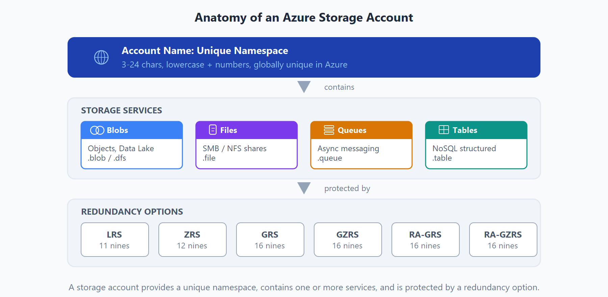
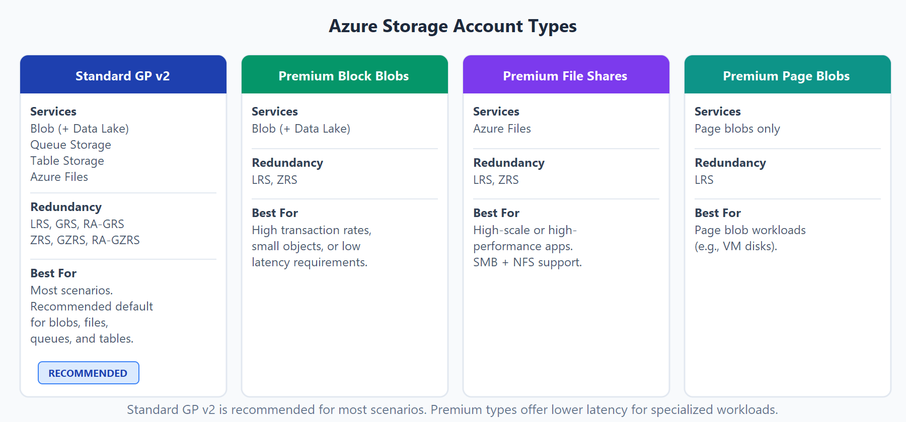
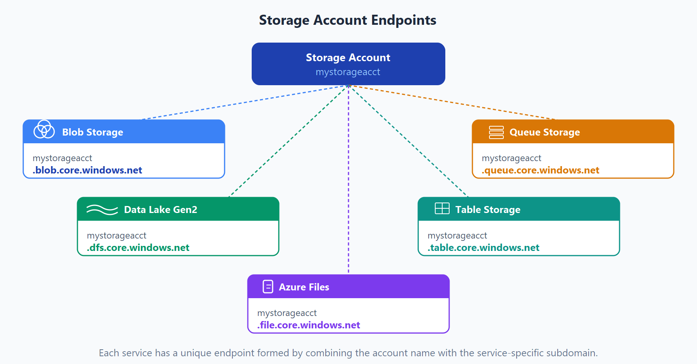
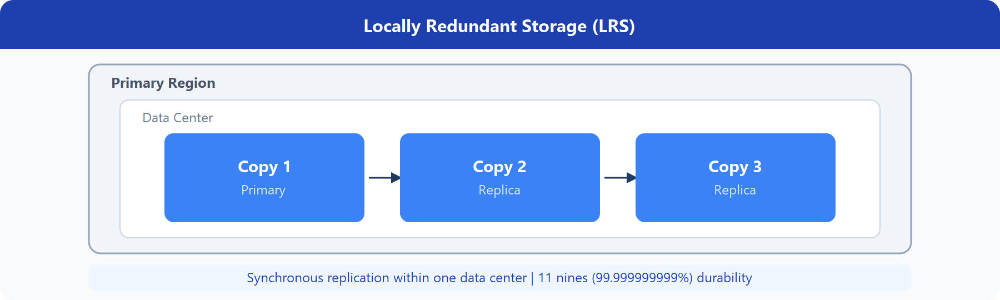
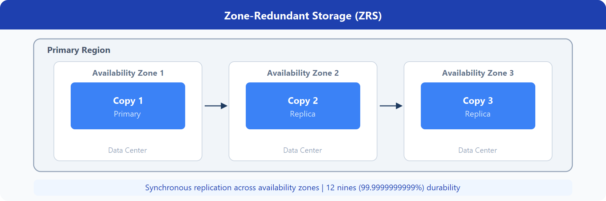
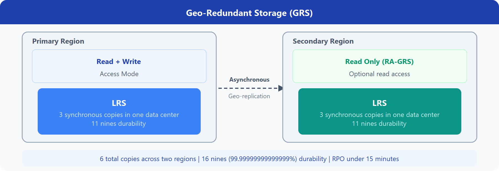
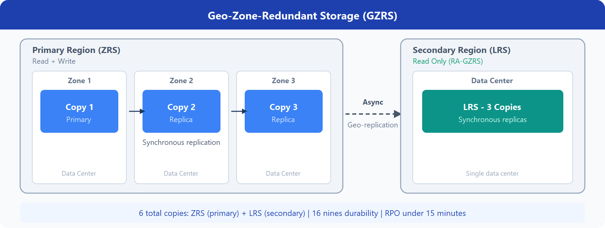
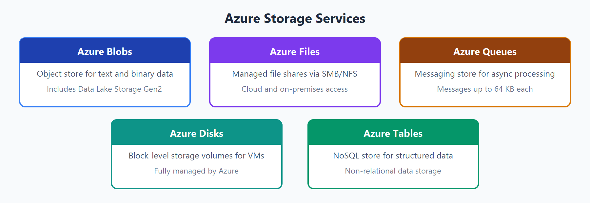
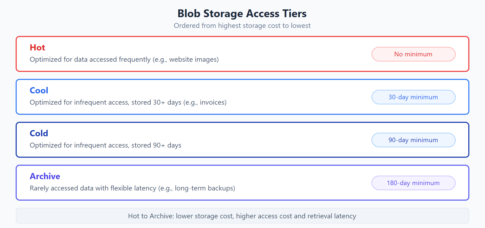
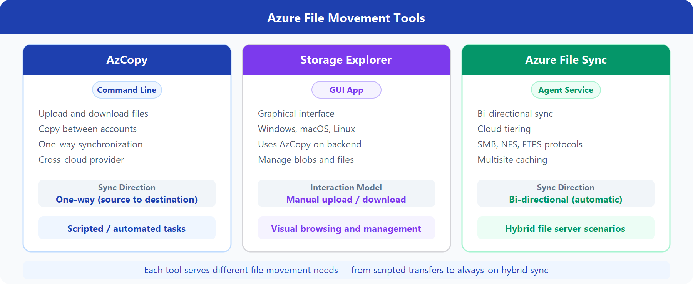

# AZ-900 — Servicios de almacenamiento de Azure

Módulo 07 del [AZ-900T00](https://learn.microsoft.com/es-es/training/courses/az-900t00) · Ruta 2 · Área: Descripción de la arquitectura y los servicios de Azure (35–40%).

## Concepto

Ventajas de Azure Storage, tipos de cuenta, niveles de acceso, redundancia (LRS/ZRS/GRS y variantes), servicios de datos (bases de datos) y herramientas de movimiento y migración (AzCopy, Storage Explorer, Azure File Sync, Azure Migrate, Data Box).

## Resumen en mis palabras

> *(pendiente — rellenar al estudiar el módulo)*

## Por qué importa para el examen

> *(pendiente — rellenar al estudiar el módulo)*

## Enlaces relacionados

**Módulo de Learn**: [Descripción de los servicios de almacenamiento de Azure](https://learn.microsoft.com/es-es/training/modules/describe-azure-storage-services/)

**AZ-900 Full Course de Savill** (vídeo por tema, @duración):
- [Benefits and Usage of Storage Account Resources — 18:04](https://youtu.be/b8BrfsxLSx8)
- [Benefits and Usage of Database Resources — 13:29](https://youtu.be/4sQOF9fSOAU)
- [Data Movement and Migration Options — 11:47](https://youtu.be/jNBcXnMTo9s)

**Proyectos guiados**: [Implementación de un sitio web estático con Azure Blob Storage](https://learn.microsoft.com/es-es/training/modules/guided-project-deploy-static-website-blob-storage/) · [Compartir archivos de forma segura](https://learn.microsoft.com/es-es/training/modules/guided-project-share-files-securely/)

## Relacionado

- [Índice AZ-900](../certifications/AZ-900/INDEX.md)

## Descripción de las cuentas de almacenamiento de Azure.

Una cuenta de almacenamiento proporciona un espacio de nombres único para los datos de Azure Storage al que se puede acceder desde cualquier lugar del mundo a través de HTTP o HTTPS. Los datos de esta cuenta son seguros, de alta disponibilidad, duraderos y escalables de forma masiva.

Al crear la cuenta de almacenamiento, primero seleccionará el tipo de cuenta de almacenamiento. El tipo de cuenta determina los servicios de almacenamiento y las opciones de redundancia, y afecta a los casos de uso. Estas opciones de redundancia se tratan más adelante en este módulo:

- Almacenamiento con redundancia local (LRS)
- Almacenamiento con redundancia geográfica (GRS)
- Almacenamiento con redundancia geográfica con acceso de lectura (RA-GRS)
- Almacenamiento con redundancia de zona (ZRS)
- Almacenamiento con redundancia de zona geográfica (GZRS)
- Almacenamiento con redundancia de zona geográfica con acceso de lectura (RA-GZRS)
  

| Tipo | Servicios admitidos | Opciones de redundancia | Uso |
|---|---|---|---|
| De uso general estándar, v2 | Blob Storage (incluido Data Lake Storage), Queue Storage, Table Storage y Azure Files | LRS, GRS, RA-GRS, ZRS, GZRS, RA-GZRS | Tipo de cuenta de almacenamiento estándar para blobs, archivos, colas y tablas. Se recomienda para la mayoría de los escenarios con Azure Storage. Si desea compatibilidad con NFS en Azure Files, utilice el tipo de cuenta de recursos compartidos de archivos Premium. |
| Blobs en bloques premium | Blob Storage (incluido Data Lake Storage) | LRS, ZRS | Tipo de cuenta de almacenamiento premium para blobs en bloques y blobs en anexos. Recomendado para escenarios con altas tasas de transacciones, objetos más pequeños o que requieren latencia constantemente baja. |
| Recursos compartidos de archivos Prémium | Azure Files | LRS, ZRS | Tipo de cuenta de almacenamiento Prémium solo para recursos compartidos de archivos. Recomendado para aplicaciones de gran escala o alto rendimiento. Admite recursos compartidos SMB y NFS. |
| Blobs en páginas Premium | Solo blobs en páginas | LRS | Tipo de cuenta de almacenamiento prémium solo para blobs en páginas. |

|Servicio de Storage	| Endpoint
|---|---|
Blob Storage	| <https://storage-account-name.blob.core.windows.net>
Data Lake Storage Gen2	| <https://storage-account-name.dfs.core.windows.net>
Azure Files	| <https://storage-account-name.file.core.windows.net>
Queue Storage	| <https://storage-account-name.queue.core.windows.net>
Table Storage	| <https://storage-account-name.table.core.windows.net>

## Descripción de la redundancia de almacenamiento de Azure.

### Almacenamiento con redundancia local
El almacenamiento con redundancia local (LRS) replica los datos tres veces dentro de un único centro de datos en la región primaria. LRS ofrece una durabilidad mínima de 11 nueves (99,999999999 %) de los objetos en un año determinado.

### Almacenamiento de redundancia por zona.

Para las regiones con zona de disponibilidad habilitada, el almacenamiento con redundancia de zona (ZRS) replica los datos de Azure Storage sincrónicamente en tres zonas de disponibilidad de Azure en la región primaria. ZRS proporciona a los objetos de datos de Azure Storage una durabilidad de al menos 12 nueves (99,9999999999 %) durante un año determinado.

### Almacenamiento con redundancia geográfica.

GRS copia los datos de forma sincrónica tres veces en la región primaria (LRS), a continuación, de forma asincrónica en la región secundaria (también LRS). Ofrece una fiabilidad de al menos 99,999999999 % a lo largo de un año.

 ### Almacenamiento con redundancia de zona geográfica.

 GZRS combina resistencia de nivel de zona en la región primaria con replicación geográfica en una región secundaria. Los datos se copian en tres zonas de disponibilidad de la región primaria y se replican en la región secundaria emparejada mediante LRS. Microsoft recomienda GZRS para cargas de trabajo que necesiten máxima coherencia, disponibilidad y resistencia de recuperación ante desastres.

 

### Acceso de lectura a los datos de la región secundaria.

GRS y GZRS protegen contra interrupciones regionales mediante la replicación de datos en una ubicación secundaria. Para leer los datos de la región secundaria antes de la conmutación por error, habilite el almacenamiento con redundancia geográfica con acceso de lectura (RA-GRS) o el almacenamiento con redundancia de zona geográfica con acceso de lectura (RA-GZRS).

### Descripción de los servicios de almacenamiento de Azure.

- Blobs de Azure: un almacén de objetos que se puede escalar de forma masiva para datos de texto y binarios. También incluye compatibilidad con el análisis de macrodatos a través de Data Lake Storage Gen2.
- Azure Files: recursos compartidos de archivos administrados para implementaciones locales y en la nube.
- Colas de Azure: un almacén de mensajería para mensajería confiable entre componentes de aplicación.
- Azure Disks: volúmenes de almacenamiento en el nivel de bloque para máquinas virtuales de Azure.
- Tablas de Azure: Opción tabla NoSQL para datos estructurados y no relacionales.

### Ventajas de Azure Storage
Azure Storage proporciona estas ventajas:

Duradero y altamente disponible. Las opciones de redundancia protegen los datos frente a errores de hardware, interrupciones e incidentes regionales.
Seguro. Todos los datos escritos en una cuenta de Azure Storage se cifran mediante el servicio. Azure Storage proporciona un control pormenorizado sobre quién tiene acceso a los datos.
Escalable. Azure Storage está diseñado para poderse escalar de forma masiva para satisfacer las necesidades de rendimiento y almacenamiento de datos de las aplicaciones de hoy en día.
Administrado. Azure controla automáticamente el mantenimiento, las actualizaciones y los problemas críticos del hardware.
Accesible. Se puede acceder a datos globalmente a través de HTTP o HTTPS mediante API REST, SDK, CLI de Azure, Azure PowerShell, Azure Portal o explorador de Azure Storage.

- Nivel de acceso frecuente: optimizado para almacenar datos a los que se accede con frecuencia (por ejemplo, imágenes para el sitio web).
- Nivel de acceso esporádico: optimizado para datos a los que se accede con poca frecuencia y que se almacenan al menos durante 30 días (por ejemplo, las facturas de los clientes).
- Nivel de acceso frío: está optimizado para almacenar datos a los que se accede con poca frecuencia y al menos durante 90 días.
- Nivel de acceso de archivo: conveniente para datos a los que raramente se accede y que se almacenan durante al menos 180 días con requisitos de latencia flexibles (por ejemplo, copias de seguridad a largo plazo).

.

### Colas de Azure
Azure Queue Storage almacena un gran número de mensajes para el procesamiento asincrónico. Las colas se acceden mediante llamadas HTTP/HTTPS autenticadas, pueden contener millones de mensajes y admitir mensajes de hasta 64 KB.

Queue Storage se empareja normalmente con Azure Functions, por lo que los mensajes desencadenan acciones en segundo plano.

### Discos de Azure
Azure Disk Storage (discos administrados) proporciona volúmenes de nivel de bloque para máquinas virtuales de Azure. Azure las virtualiza y administra para mejorar la resistencia y las operaciones más sencillas.

Tablas de Azure
Azure Table Storage es un almacén NoSQL para grandes cantidades de datos estructurados y no relacionales, accesibles a través de llamadas autenticadas desde entornos híbridos y en la nube.

Azure ofrece dos enfoques opuestos para meter datos en la nube, según tengas o no ancho de banda suficiente: **migración en línea (por red)** o **migración física (offline)**.

## Azure Migrate — migración "en tiempo real" por red

Es un **centro/hub unificado** (no una sola herramienta, sino un portal que agrupa varias) para migrar infraestructura on-premises a Azure.

- **Portal único**: iniciar, ejecutar y hacer seguimiento de toda la migración desde un solo sitio
- **Conjunto de herramientas integradas**: Discovery and assessment (detecta qué tienes y evalúa si es apto para la nube) y Server Migration (mueve las VMs), más migración de bases de datos y aplicaciones web
- También se integra con herramientas de terceros (ISV)

Piensa en él como el "GPS + camión de mudanzas" que va moviendo cosas mientras sigues funcionando, todo por red.

## Azure Data Box — migración física "offline"

Cuando tienes **demasiados datos** para mandarlos por Internet en un tiempo razonable (decenas de TB o más), Microsoft te envía un **disco físico** para que cargues los datos localmente y se lo devuelvas por mensajería.

- Capacidad máxima utilizable: **80 TB**
- Flujo: pides el dispositivo desde Azure Portal → lo conectas a tu red local → transfieres los datos → lo devuelves → Microsoft lo conecta a su datacenter y sube los datos automáticamente
- Todo el proceso se rastrea desde Azure Portal, aunque el dispositivo esté físicamente viajando
- Al terminar, el disco se **borra de forma segura** según el estándar **NIST 800-88r1** (dato muy preguntable en examen)

### Casos de uso típicos de Data Box
- Migración masiva única de datos locales a Azure
- Cargas periódicas grandes cuando la red es demasiado lenta
- Exportar datos desde Azure (funciona en ambas direcciones: import y export)

## La idea clave para el examen

**Azure Migrate** = mueves infraestructura/servidores/apps, por red, con seguimiento en portal.
**Data Box** = mueves datos masivos, físicamente, cuando el ancho de banda es el cuello de botella.

Suelen preguntar un escenario tipo "tienes 50 TB y una conexión lenta, ¿qué usas?" → la respuesta es Data Box, no Migrate, porque Migrate no está pensado para volúmenes tan grandes por red.

## Identificación de las opciones de movimiento de archivos de Azure

