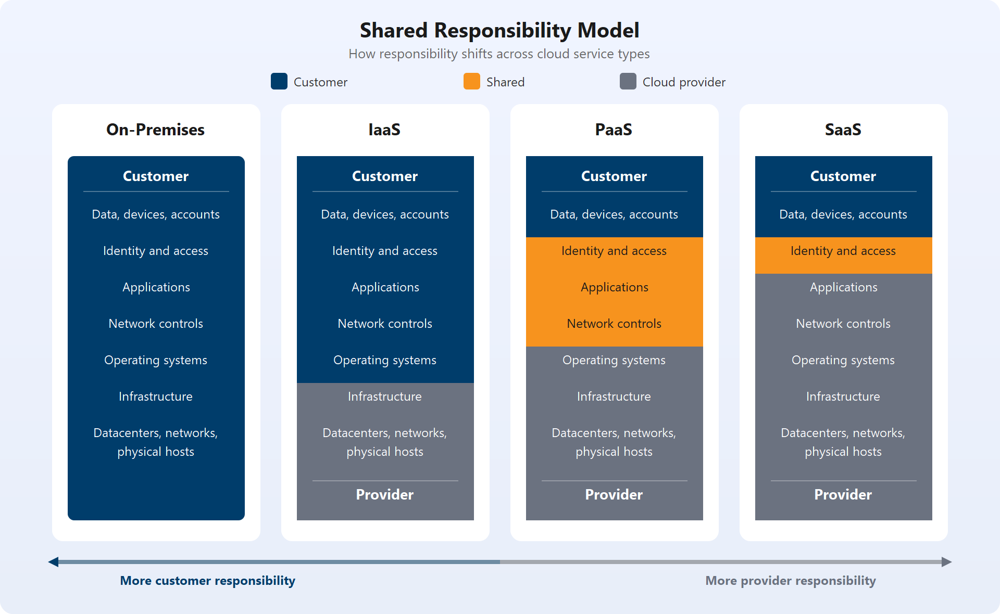
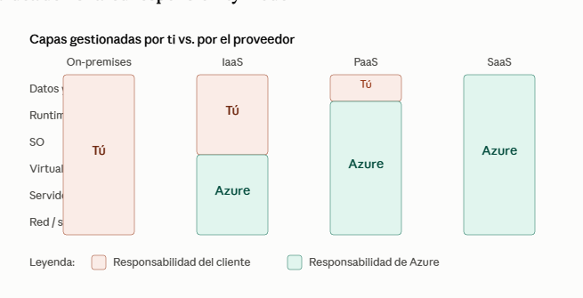
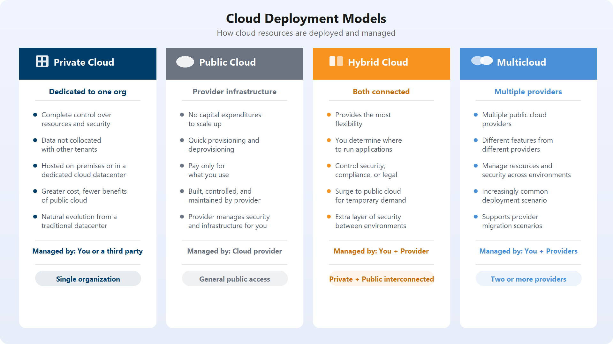

# AZ-900 — Informática en la nube

Módulo 01 del [AZ-900T00](https://learn.microsoft.com/es-es/training/courses/az-900t00) · Ruta 1 · Área: Descripción de los conceptos de la nube (25–30%).

## Concepto

Definición de informática en la nube, [[Shared Responsibility Model|responsabilidad compartida]], modelos de nube (público, privado, híbrido) y sus casos de uso, modelo basado en consumo (CapEx vs OpEx).

## Resumen en mis palabras

> *(pendiente — rellenar al estudiar el módulo)*

## Por qué importa para el examen

> *(pendiente — rellenar al estudiar el módulo)*

## Enlaces relacionados

**Módulo de Learn**: [Descripción de la informática en la nube](https://learn.microsoft.com/es-es/training/modules/describe-cloud-compute/)

**AZ-900 Full Course de Savill** (vídeo por tema, @duración):
- [CapEx, OpEx and Consumption-based — 07:13](https://youtu.be/WiwV9wb0GMo)
- [Differences Between Types of Cloud Computing — 12:41](https://youtu.be/7dlCrF2wmXU)

# Introducción a los aspectos básicos de Microsoft Azure

Microsoft Azure es una plataforma informática en la nube con un conjunto cada vez mayor de servicios que le ayudarán a crear soluciones que cumplan sus objetivos técnicos. Los servicios de Azure admiten todo, desde simple a complejo. Puede hospedar servicios web simples para aplicaciones accesibles desde Internet, ejecutar equipos totalmente virtualizados para soluciones de software personalizadas o usar servicios basados en la nube, como almacenamiento remoto, hospedaje de bases de datos y administración centralizada de cuentas. Azure también ofrece funcionalidades en inteligencia artificial (IA) e Internet de las cosas (IoT).

# Responsabilidad por modelo de servicio.

.

## On-premises (local/en tus instalaciones)

No es una sigla, es la infraestructura tradicional: tú tienes el hardware físico en tu propio edificio — servidores, racks, cableado, refrigeración, electricidad. Responsable de todo: desde el suelo del datacenter hasta la aplicación. Es el punto de partida "0% nube".

## IaaS — Infrastructure as a Service (Infraestructura como servicio)

El proveedor (Azure) te da la infraestructura virtualizada: máquinas virtuales, redes, almacenamiento. Tú sigues gestionando el sistema operativo, runtime, middleware y la aplicación. Es lo más parecido a on-premises pero sin tener que comprar/mantener hardware físico.

Ejemplo Azure: Azure Virtual Machines
Analogía: alquilas el terreno y la casa vacía, tú decides qué muebles poner

## PaaS — Platform as a Service (Plataforma como servicio)

El proveedor gestiona además el sistema operativo, runtime y middleware. Tú solo te preocupas de tu código y tus datos. Ideal si eres desarrollador y no quieres perder tiempo parcheando SO ni configurando servidores web.

Ejemplo Azure: Azure App Service, Azure SQL Database, Azure Functions
Analogía: alquilas un piso amueblado, tú solo traes tus cosas personales

## SaaS — Software as a Service (Software como servicio)

Todo gestionado por el proveedor. Tú solo usas la aplicación, sin preocuparte de nada por debajo. Es el nivel de menor control pero menor esfuerzo.

Ejemplo: Microsoft 365, Teams, Dynamics 365
Analogía: reservas un hotel — todo incluido, tú solo entras y usas la habitación
La idea del "shared responsibility model"

.

___

| Nube pública                                                            | Nube privada                                                                  | Nube híbrida                                                     |
| ----------------------------------------------------------------------- | ----------------------------------------------------------------------------- | ---------------------------------------------------------------- |
| No hay gastos de capital para escalar verticalmente.                    | Tiene control total sobre los recursos y la seguridad.                        | Proporciona la máxima flexibilidad.                              |
| Las aplicaciones pueden aprovisionarse y desaprovisionarse rápidamente. | Los datos no se intercalan con los datos de otros inquilinos                  | Determine dónde ejecutar las aplicaciones.                       |
| Solo pagas por lo que usas                                              | Debe adquirirse hardware para la puesta en funcionamiento y el mantenimiento. | Tú controlas los requisitos de seguridad, cumplimiento o legales |
| No tiene control total sobre los recursos y la seguridad                | Usted es responsable del mantenimiento y las actualizaciones de hardware      |                                                                  |

## CapEx:

Comprar servidores
       ↓
Gran inversión inicial
       ↓
Hardware propio
       ↓
Mantenimiento + renovación

## OpEx:

Consumir recursos cloud
       ↓
Pagar según utilización
       ↓
Escalar cuando sea necesario
       ↓
Coste operativo recurrente

**Páginas de `knowledge/`**: [[Shared Responsibility Model]] · [[Tipos de servicio en la nube (AZ-900)]]

## Relacionado

- [[Shared Responsibility Model]]
- [Índice AZ-900](../certifications/AZ-900/INDEX.md)
