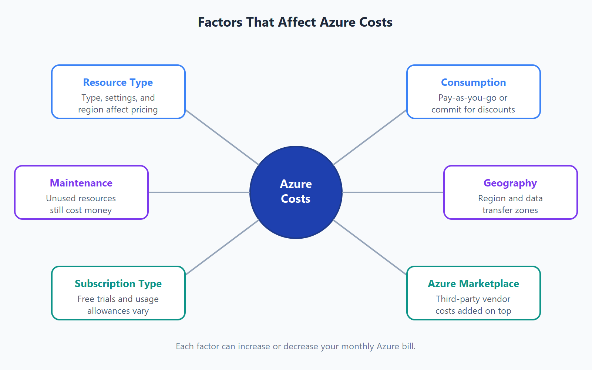
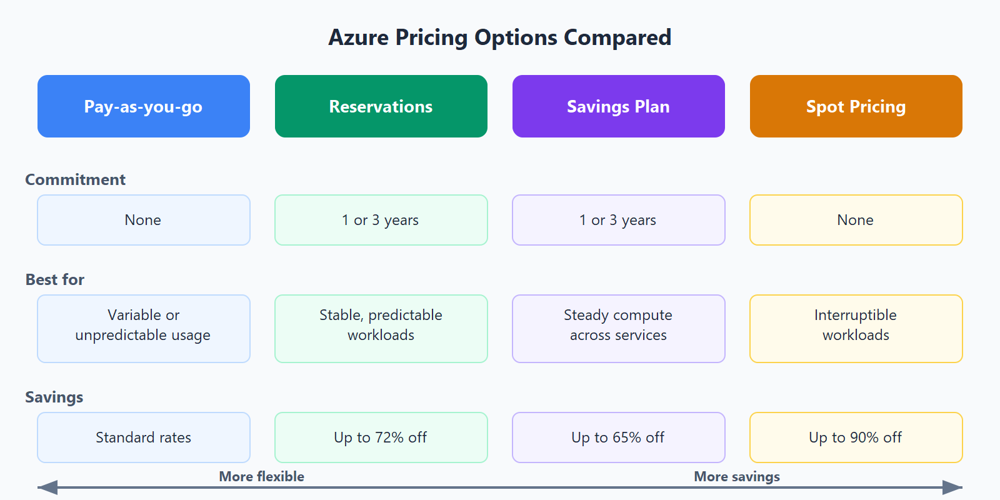
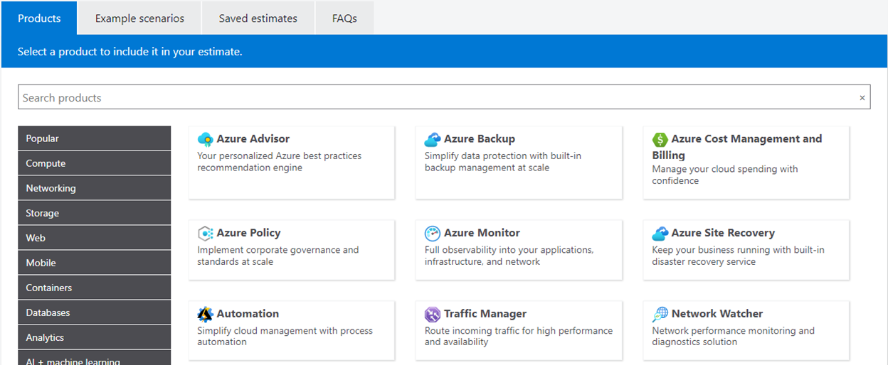
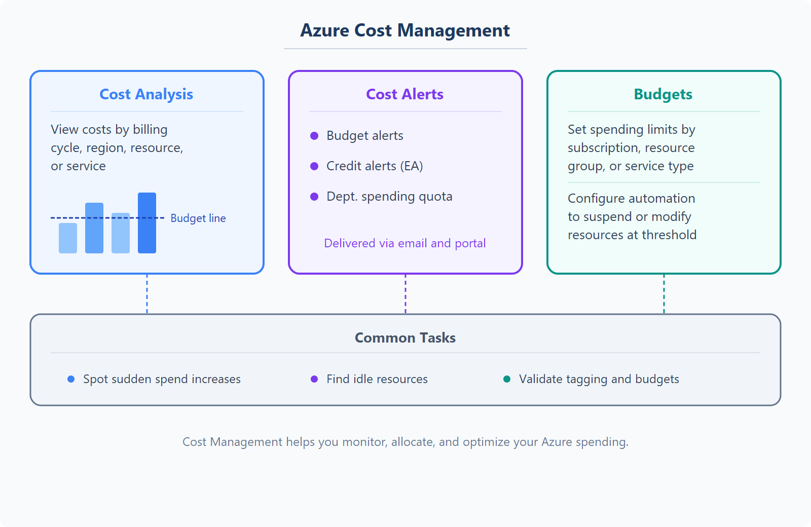
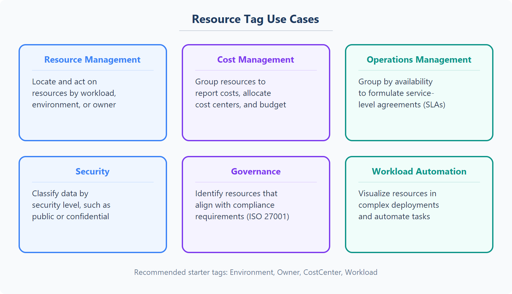

# AZ-900 — Administración de costos en Azure

Módulo 09 del [AZ-900T00](https://learn.microsoft.com/es-es/training/courses/az-900t00) · Ruta 3 · Área: Descripción de la administración y la gobernanza de Azure (30–35%).

## Concepto

Factores que afectan al coste, formas de reducirlo, calculadoras de precios y TCO, Microsoft Cost Management y etiquetas (tags) como mecanismo de atribución.

## Resumen en mis palabras

> En este módulo se exploran los métodos para calcular, realizar un seguimiento y administrar los costos en Azure.

## Por qué importa para el examen

> Describir factores que pueden afectar a los costos en Azure.
> Describir la calculadora de precios de Azure.
> Describir la herramienta de administración de costos de Microsoft.
> Describir el propósito de las etiquetas.
> Describir las opciones de optimización de costos, incluidas reservas, planes de ahorro y precios de Spot.

## Enlaces relacionados

**Módulo de Learn**: [Descripción de la administración de costos en Azure](https://learn.microsoft.com/es-es/training/modules/describe-cost-management-azure/)

**AZ-900 Full Course de Savill** (vídeo por tema, @duración):
- [Factors That Affect Costs — 06:32](https://youtu.be/fMShW_RGcxY)
- [Factors to Reduce Cost — 15:29](https://youtu.be/B5yiKE2DLH8)
- [Functionality and Usage of Pricing and TCO Calculators — 07:26](https://youtu.be/pE-bf8i5blU)
- [Functionality and Usage of Azure Cost Management — 05:48](https://youtu.be/FoBjC9CAF08)
- [Functionality and Usage of Tags — 05:06](https://youtu.be/eaf63hE_6SQ)

**Proyecto guiado**: [Configuración de límites de protección de costos en Azure](https://learn.microsoft.com/es-es/training/modules/guided-project-cost-guardrails/)

## Relacionado

- [Índice AZ-900](../certifications/AZ-900/INDEX.md)

## Describir factores que pueden afectar a los costos en Azure.

Muchos factores afectan cuánto paga. Algunos de los factores que afectan al costo son:

- **Tipo de recurso**
- **Consumo**
- **Mantenimiento**
- **Geografía**
- **Tipo de suscripción**
- **Azure Marketplace**

____

## Exploración de la calculadora de precios

La calculadora de precios está diseñada para proporcionarle un costo estimado para el aprovisionamiento de recursos en Azure. Puede obtener una estimación de recursos individuales, crear una solución o usar un escenario de ejemplo para ver una estimación del gasto de Azure.

## Describir la herramienta Microsoft Cost Management.
Microsoft Azure es un proveedor de nube global, lo que significa que puede aprovisionar recursos en cualquier parte del mundo.

### ¿Qué es Cost Management?.

## Describir el propósito de las etiquetas

Las etiquetas (tags) en Azure son pares clave-valor que se pueden aplicar a los recursos para organizarlos y administrarlos de manera más efectiva. Permiten:

- **Administración de recursos** Las etiquetas permiten localizar y actuar en recursos asociados a cargas de trabajo, entornos, equipos y propietarios específicos.
- **Administración y optimización de costos** Las etiquetas permiten agrupar recursos para que pueda informar sobre los costos, asignar centros de costos internos, realizar un seguimiento de los presupuestos y predecir el costo estimado.
- **Administración de operaciones** Las etiquetas permiten agrupar los recursos según la importancia de su disponibilidad para las operaciones. Esta agrupación le ayuda a formular acuerdos de nivel de servicio (SLA). Un Acuerdo de Nivel de Servicio es una garantía de tiempo de actividad o rendimiento entre usted y sus usuarios.
- **Seguridad** Las etiquetas permiten clasificar los datos por su nivel de seguridad, como público o confidencial.
- **Gobernanza y cumplimiento normativo** Las etiquetas permiten identificar recursos que se alinean con los requisitos de gobernanza o cumplimiento normativo, como ISO 27001. Las etiquetas también pueden formar parte de los esfuerzos de cumplimiento de los estándares. Por ejemplo, puede requerir que todos los recursos se etiqueten con un nombre de propietario o departamento.
- **Optimización y automatización de cargas de trabajo** Las etiquetas pueden ayudarle a visualizar todos los recursos que participan en implementaciones complejas. Por ejemplo, puede etiquetar un recurso con su nombre de aplicación o carga de trabajo asociado y usar software como Azure DevOps para realizar tareas automatizadas en esos recursos.

| Nombre | Valor |
|--------|-------|
| AppName | Nombre de la aplicación de la que forma parte el recurso. |
| CostCenter | Código interno del centro de costos. |
| Dueño | Nombre del propietario técnico o del servicio responsable del recurso. |
| Medio ambiente | Un nombre de entorno, como "Prod", "Dev" o "Test". |
| Impacto | Lo importante que es el recurso para las operaciones, como "crítico para la misión", "impacto alto" o "bajo impacto". |