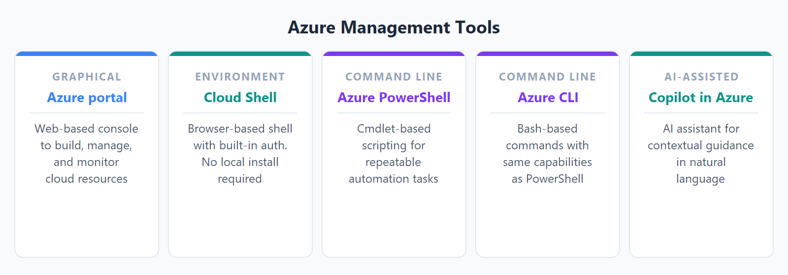
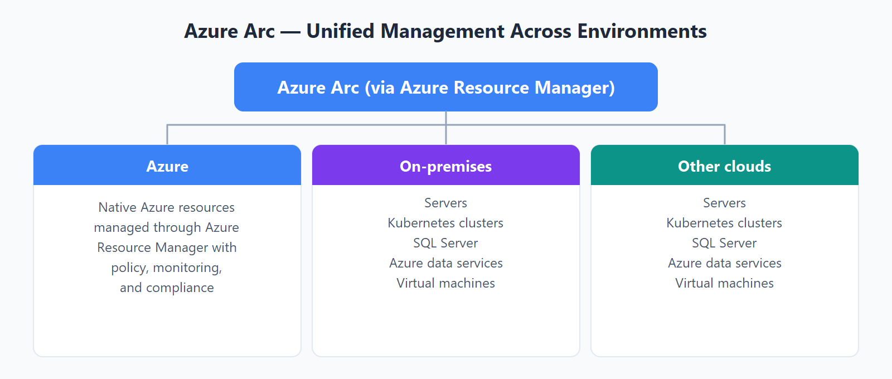

# AZ-900 — Herramientas de administración e implementación

Módulo 11 del [AZ-900T00](https://learn.microsoft.com/es-es/training/courses/az-900t00) · Ruta 3 · Área: Descripción de la administración y la gobernanza de Azure (30–35%).

## Concepto

Azure Portal, [[Azure Cloud Shell]], Azure CLI y Azure PowerShell, Azure Arc (recursos fuera de Azure) e Infrastructure as Code con plantillas ARM, Bicep y Terraform.

## Resumen en mis palabras

> *En este módulo se presentan las características y herramientas para administrar e implementar recursos de Azure. Obtenga información sobre Azure Portal (una interfaz gráfica para administrar recursos de Azure), la línea de comandos y las herramientas de scripting que ayudan a implementar o configurar recursos. También aprenderá sobre los servicios de Azure que le ayudarán a administrar los entornos locales y multinube desde Azure.*

## Por qué importa para el examen

> *(pendiente — rellenar al estudiar el módulo)*

## Enlaces relacionados

**Módulo de Learn**: [Descripción de las características y herramientas para administrar e implementar recursos de Azure](https://learn.microsoft.com/es-es/training/modules/describe-features-tools-manage-deploy-azure-resources/)

**AZ-900 Full Course de Savill** (vídeo por tema, @duración):
- [Functionality of Azure Management Solutions — 09:23](https://youtu.be/6xp-K60ChAk)
- [Benefits and Usage of Azure Resource Manager — 09:57](https://youtu.be/g4u0NL2-3XM)
- [Describe the Purpose of Azure Arc — 07:23](https://youtu.be/cW6_rvDYSHg)
- [Functionality and Usage of ARM Templates — 06:41](https://youtu.be/loxcA5MUf-I)

**Páginas de `knowledge/`**: [[Azure Cloud Shell]] · [[ARM Templates]] · [[Terraform vs Bicep]]

**Proyecto guiado**: [Administración de recursos de Azure con Cloud Shell y la CLI de Azure](https://learn.microsoft.com/es-es/training/modules/guided-project-manage-resources-cloud-shell-cli/)

## Relacionado

- [Índice AZ-900](../certifications/AZ-900/INDEX.md)

## Descripción de las herramientas para interactuar con Azure.

- Azure Portal
- Azure PowerShell
- Interfaz de la línea de comandos (CLI) de Azure
- Copilot en Azure

### ¿Qué es Azure Portal?

Azure Portal es una consola unificada basada en web que proporciona una alternativa a las herramientas de línea de comandos. 

### Azure Cloud Shell

zure Cloud Shell es una herramienta de shell basada en explorador que permite crear, configurar y administrar recursos de Azure mediante un shell. Azure Cloud Shell admite Tanto Azure PowerShell como la interfaz de la línea de comandos (CLI) de Azure, que es un shell de Bash.

[Azure Management Tools.](../assets/images/AZ-900/cloud-shell-icon.png)

### ¿Qué es Azure PowerShell?
Azure PowerShell es un shell con el que los desarrolladores, DevOps y profesionales de TI pueden ejecutar comandos denominados command-lets (cmdlets). Estos comandos llaman a la API REST de Azure para realizar tareas de administración en Azure.

### ¿Qué es la CLI de Azure?
La CLI de Azure es funcionalmente equivalente a Azure PowerShell, y la diferencia principal es la sintaxis de los comandos. Aunque Azure PowerShell usa comandos de PowerShell, la CLI de Azure usa comandos de Bash.

## Descripción del propósito de Azure Arc

La administración de entornos híbridos y multinube puede complicarse rápidamente. Azure proporciona una serie de herramientas para aprovisionar, configurar y supervisar recursos de Azure. ¿Qué ocurre con los recursos locales en una configuración híbrida o los recursos en la nube en una configuración multinube?

### ¿Qué puede hacer Azure Arc fuera de Azure?
Actualmente, Azure Arc permite administrar los siguientes tipos de recursos hospedados fuera de Azure:

- Servidores
- Clústeres de Kubernetes
- Servicios de datos de Azure
- SQL Server
- Máquinas virtuales (versión preliminar)

### Descripción de las plantillas de Azure Resource Manager y Azure ARM

### Ventajas de Azure Resource Manager
Con Azure Resource Manager, puede hacer lo siguiente:

- Administrar su infraestructura a través de plantillas declarativas en lugar de scripts. Una plantilla de Resource Manager es un archivo JSON que define lo que desea implementar en Azure.
- Implementar, administrar y supervisar todos los recursos de la solución en grupo, en lugar de controlarlos individualmente.
- Vuelva a implementar la solución a lo largo del ciclo de vida de desarrollo y tenga confianza en que los recursos se implementan en un estado coherente.
- Defina las dependencias entre recursos, por lo que se implementan en el orden correcto.
- Aplique el control de acceso a todos los servicios porque RBAC está integrado de forma nativa en la plataforma de administración.
- Aplique etiquetas a los recursos para organizar la suscripción y apoyar informes de costos.
### Bíceps

Bicep es un lenguaje declarativo para implementar recursos de Azure a través de ARM. En comparación con las plantillas de ARM json, Bicep suele ser más sencillo y más conciso.

Entre las ventajas de Bicep se incluyen:

- **Compatibilidad con los recursos actuales de Azure**: Bicep realiza un seguimiento de los tipos de recursos y las versiones de API de Azure.
- **Sintaxis simple**: Bicep es más fácil de leer y escribir que las plantillas JSON equivalentes.
- **Implementaciones repetibles**: los archivos Bicep son idempotentes en implementaciones consistentes del ciclo de vida.
- **Orquestación integrada**: Azure Resource Manager controla las dependencias y la ejecución de la implementación paralela.
- **Modularidad**: Reutilizar la lógica organizando las implementaciones en módulos de Bicep.

