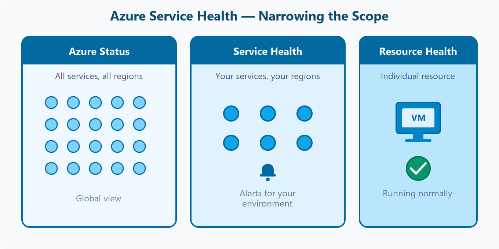
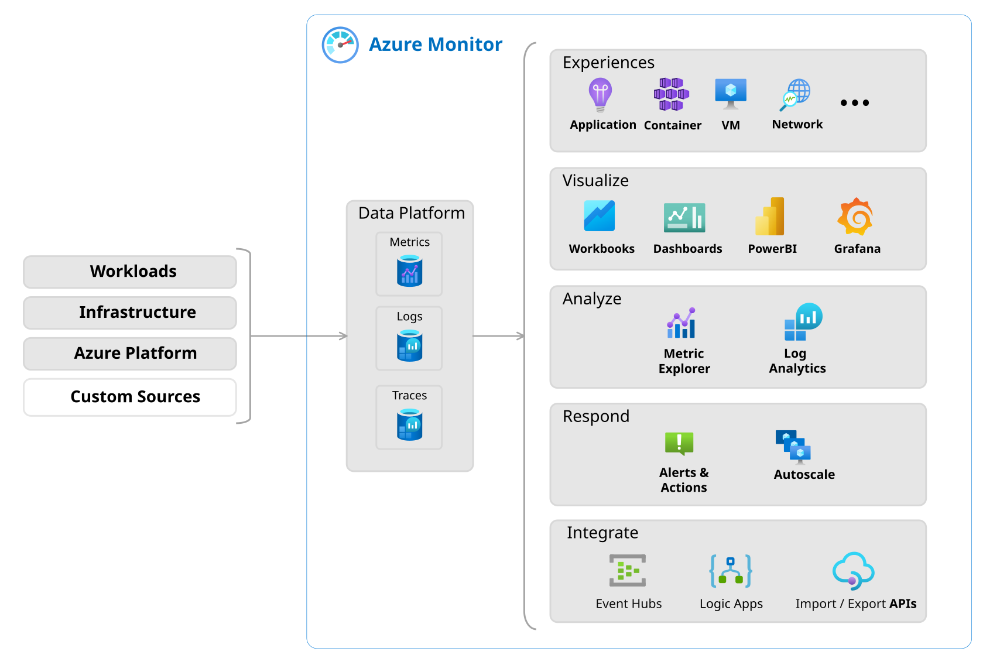

# AZ-900 — Herramientas de supervisión de Azure

Módulo 12 del [AZ-900T00](https://learn.microsoft.com/es-es/training/courses/az-900t00) · Ruta 3 · Área: Descripción de la administración y la gobernanza de Azure (30–35%).

## Concepto

Azure Advisor (recomendaciones), Azure Service Health (estado del servicio) y Azure Monitor con sus componentes: Log Analytics, alertas y Application Insights.

## Resumen en mis palabras

> *En este módulo, se le presentarán herramientas que le ayudarán a supervisar el entorno y las aplicaciones, tanto en Azure como en entornos locales o multinube.*

## Por qué importa para el examen

> *(pendiente — rellenar al estudiar el módulo)*

## Enlaces relacionados

**Módulo de Learn**: [Descripción de las herramientas de supervisión de Azure](https://learn.microsoft.com/es-es/training/modules/describe-monitoring-tools-azure/)

**AZ-900 Full Course de Savill** (vídeo por tema, @duración):
- [Functionality and Usage of Azure Advisor — 03:22](https://youtu.be/nqH4NboyEl0)
- [Functionality and Usage of Azure Monitor — 10:20](https://youtu.be/v68jL-l9Fww)
- [Functionality and Usage of Azure Service Health — 02:58](https://youtu.be/M1xPK4T4Vls)

**Proyecto guiado**: [Supervisión de Azure con alertas del registro de actividad y estado del servicio](https://learn.microsoft.com/es-es/training/modules/guided-project-monitor-service-health-activity-alerts/)

## Relacionado

- [Índice AZ-900](../certifications/AZ-900/INDEX.md)

## Describir el propósito de Azure Advisor.

Azure Advisor evalúa los recursos de Azure y realiza recomendaciones para ayudarle a mejorar la confiabilidad, la seguridad, el rendimiento y la eficacia de los costos. Piense en ella como una guía personalizada de procedimientos recomendados integrada en Azure Portal. Cada recomendación incluye una acción sugerida que puede tomar inmediatamente, posponer o descartar.

También puede configurar notificaciones para que Advisor le avise cuando aparezcan nuevas recomendaciones.

El panel de Advisor muestra recomendaciones para todas las suscripciones y puede filtrar por suscripción, grupo de recursos o servicio. Las recomendaciones se dividen en cinco categorías:

- **La confiabilidad** ayuda a mantener las aplicaciones en ejecución marcando los riesgos de configuración.
- **La seguridad** detecta amenazas y vulnerabilidades que podrían provocar infracciones.
- **El rendimiento** identifica los cambios que pueden acelerar las aplicaciones.
- **La excelencia operativa** sugiere mejoras de flujo de trabajo e implementación.
- **Cost** encuentra formas de reducir el gasto en Azure.

## Descripción de Azure Service Health.

Azure Service Health le ayuda a mantenerse informado sobre el estado de Azure y los recursos específicos que se ejecutan. Combina tres vistas que limitan el ámbito de los recursos globales a los individuales.

## Tres vistas de salud

- **Estado de Azure** proporciona una imagen global del estado de Azure en todos los servicios y regiones. Compruebe esta página cuando escuche una interrupción generalizada y quiera saber si afecta a Azure.
- **Service Health** se centra en los servicios y regiones de Azure que realmente usa. Dado que ha iniciado sesión, Service Health conoce los servicios que son importantes para usted y muestra interrupciones, mantenimiento programado y avisos de estado relevantes para su entorno. Puede configurar alertas para que se le notifique automáticamente.
- **Resource Health** se centra en los recursos individuales, como una máquina virtual específica. Indica si un recurso se está ejecutando normalmente o experimenta un problema y si el problema está en el lado de Azure o en el suyo.

## Descripción de Azure Monitor

Azure Monitor es una plataforma para recopilar, analizar y actuar sobre los datos de los recursos y aplicaciones de Azure. Funciona con entornos de Azure, locales y multinube.

### Azure Log Analytics: Análisis de Registros de Azure
Log Analytics es la herramienta en el portal de Azure donde se escriben y ejecutan consultas contra los datos recopilados por Azure Monitor. Puede realizar un filtrado sencillo, como buscar todos los errores en la última hora o ejecutar análisis avanzados para visualizar tendencias a lo largo del tiempo.

### Alertas de Azure Monitor.

Las alertas le notifican cuando Azure Monitor detecta que se ha cumplido una condición definida. Se crea una regla de alerta que especifica la condición y un grupo de acciones que controla quién recibe una notificación y qué ocurre a continuación.

## Application Insights

Application Insights es una característica de Azure Monitor que supervisa el rendimiento y el uso de las aplicaciones web, tanto si se ejecutan en Azure, en el entorno local como en otra nube.

Puede configurar Application Insights agregando un SDK al código de la aplicación o habilitando el agente de Application Insights sin cambios en el código.

Application Insights puede supervisar:

- Tasas de solicitud, tiempos de respuesta y tasas de error
- Llamadas de dependencia y su rendimiento
- Tiempos de carga de páginas, recuentos de usuarios y tendencias de sesión
- Contadores de rendimiento del servidor, como cpu, memoria y uso de red.

