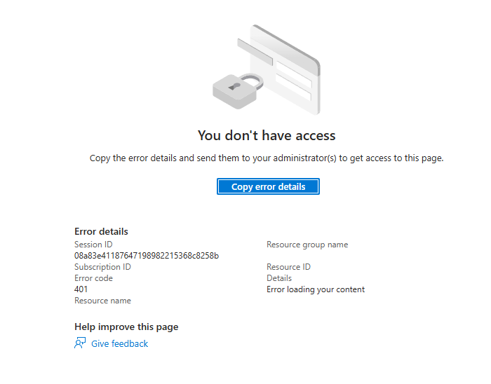

# Entra ID

> Página pendiente de contenido completo (Microsoft Entra ID, antes Azure AD). Stub creado al ingerir las guías de estudio de certificación que lo mencionan.

# Configuración de una aplicación de App Service o Azure Functions para usar el inicio de sesión de Microsoft Entra

Entramos en la web [entra](https://entra.microsoft.com/).
Seguimos las instrucciones de [Autenticación](https://learn.microsoft.com/es-es/azure/app-service/scenario-secure-app-authentication-app-service?tabs=workforce-configuration)

1. Entramos en App Registrations.
2. New registration.
3. Tenemos varios endpoints para loguear.
4. Creamos uno endpoint nuevo (ahora mismo no tenemos acceso).

Aqui tenemos ejemplos como implementarlo en la aplicación creada:
[Ejemplos creación apps](https://learn.microsoft.com/es-es/azure/app-service/quickstart-nodejs?tabs=windows&pivots=development-environment-vscode)

## Ejemplos

- [Registro de aplicación en Entra ID](../examples/entra/README.md)

## Relacionado

- [[Azure RBAC]]
- [[Managed Identities]]
- [[Shared Responsibility Model]]
