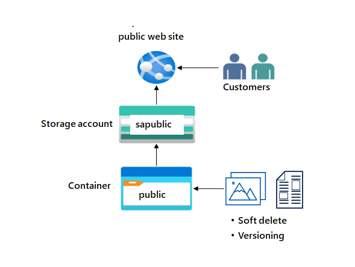

# Ejercicio: Proporcionar almacenamiento para el sitio web público

100 XP

- 5 minutos

## Escenario del ejercicio

El sitio web de la empresa proporciona imágenes de productos, vídeos, literatura de marketing y casos de éxito de clientes. Los clientes se encuentran en todo el mundo y la demanda se está expandiendo rápidamente. El contenido es crítico y requiere tiempos de carga de baja latencia. Es importante realizar un seguimiento de las versiones del documento y restaurar rápidamente los documentos si se eliminan.

## Aptitudes de trabajo

- Cree una cuenta de almacenamiento con alta disponibilidad.
- Asegúrese de que la cuenta de almacenamiento tiene acceso público anónimo.
- Cree un contenedor de Blob Storage para los documentos del sitio web.
- Habilite la eliminación temporal para que los archivos se puedan restaurar fácilmente.
- Habilite el control de versiones de blobs.

Nota:

Tiempo estimado: 30 minutos. Para completar este ejercicio, necesitará una [suscripción a Azure](https://azure.microsoft.com/pricing/purchase-options/azure-account?cid=msft_learn_39347c43-e5a6-266c-b57e-4dc092dda330).

Inicie el ejercicio y siga las instrucciones. Cuando termine, asegúrese de volver a esta página para que pueda continuar aprendiendo.

https://microsoftlearning.github.io/Secure-storage-for-Azure-Files-and-Azure-Blob-Storage/Instructions/Labs/LAB_02a_storage_public_website.html

The company website supplies product images, videos, marketing literature, and customer success stories. Customers are located worldwide and demand is rapidly expanding. The content is mission-critical and requires low latency load times. It’s important to keep track of the document versions and to quickly restore documents if they’re deleted.

## Architecture diagram

## Skilling tasks

- Create a storage account with high availability.
- Ensure the storage account has anonymous public access.
- Create a blob storage container for the website documents.
- Enable soft delete so files can be easily restored.
- Enable blob versioning.

## Estimated timing: 20 minutes

## Exercise instructions

## Create a storage account with high availability.

1. Create a storage account to support the public website.
    
    - In the portal, search for and select `Storage accounts`.
    - Select **+ Create**.
    - For **resource group** select **new**. Give your resource group a **name** and select **OK**.
    - Set the **Storage account name** to `publicwebsite`. Make sure the storage account name is unique by adding an identifier.
    - Take the defaults for other settings.
    - Select **Review** and then **Create**.
    - Wait for the storage account to deploy, and then select **Go to resource**.
2. This storage requires high availability if there’s a regional outage. Additionally, enable read access to the secondary region, Learn more about [storage account redundancy](https://learn.microsoft.com/azure/storage/common/storage-redundancy#geo-redundant-storage).
    
    - In the storage account, in the **Data management** section, select the **Redundancy** blade.
    - Ensure **Read-access Geo-redundant storage** is selected.
    - Review the primary and secondary location information.
3. Information on the public website should be accessible without requiring customers to login.
    
    - In the storage account, in the **Settings** section, select the **Configuration** blade.
    - Ensure the **Allow blob anonymous access** setting is **Enabled**.
    - Be sure to **Save** your changes.

## Create a blob storage container with anonymous read access

1. The public website has various images and documents. Create a blob storage container for the content. Learn more about [storage containers](https://learn.microsoft.com/azure/storage/blobs/storage-blobs-introduction#containers).
    - In your storage account, in the **Data storage** section, select the **Containers** blade.
    - Select **+ Container**.
    - Ensure the **Name** of the container is `public`.
    - Select **Create**.
2. Customers should be able to view the images without being authenticated. Configure anonymous read access for the public container blobs. Learn more about [configuring anonymous public access](https://learn.microsoft.com/azure/storage/blobs/anonymous-read-access-configure?tabs=portal).
    - Select your **public** container.
    - On the **Overview** blade, select **Change access level**.
    - Ensure the **Public access level** is **Blob (anonymous read access for blobs only)**.
    - Select **OK**.

## Practice uploading files and testing access.

1. For testing, upload a file to the **public** container. The type of file doesn’t matter. A small image or text file is a good choice.
    - Ensure you are viewing your container.
    - Select **Upload**.
    - **Browse to files** and select a file. Browse to a file of your choice.
    - Select **Upload**.
    - Close the upload window, **Refresh** the page and ensure your file was uploaded.
2. Determine the URL for your uploaded file. Open a browser and test the URL.
    - Select your uploaded file.
    - On the **Overview** tab, copy the **URL**.
    - Paste the URL into a new browser tab.
    - If you have uploaded an image file it will display in the browser. Other file types should be downloaded.

## Configure soft delete

1. It’s important that the website documents can be restored if they’re deleted. Configure blob soft delete for 21 days. Learn more about [soft delete for blobs](https://learn.microsoft.com/azure/storage/blobs/soft-delete-container-enable?tabs=azure-portal).
    - Go to the **Overview** blade of the **storage account**.
    - In the **Data management** section, select the **Data protection** blade.
    - Ensure the **Enable soft delete for blobs** is **checked**.
    - Change the **Keep deleted blobs for (in days)** setting to **21**.
    - Notice you can also **Enable soft delete for containers**.
    - Don’t forget to **Save** your changes.
2. If something gets deleted, you need to practice using soft delete to restore the files.
    - Navigate to your container where you uploaded a file.
    - Select the file you uploaded and then select **Delete**.
    - Select **Delete** to confirm deleting the file.
    - On the container **Overview** page, use the **Soft delete** dropdown and select **Show active and deleted blobs**. This control is to the right of the search box.
    - Select your deleted file, and use the ellipses on the far right, to **Undelete** the file.
    - Refresh the container and confirm the file has been restored.

## Configure blob versioning

1. It’s important to keep track of the different website product document versions. Learn more about [blob versioning](https://learn.microsoft.com/azure/storage/blobs/versioning-enable?tabs=portal).
    - Go to the **Overview** blade of the **storage account**.
    - In the **Data management** section, select the **Data protection** blade.
    - Ensure the **Enable versioning for blobs** checkbox is checked.
    - Notice your options to **keep all versions** or **delete versions after**.
    - Don’t forget to **Save** your changes.
2. As you have time experiment with restoring previous blob versions.
    - **Upload** another version of your container file. This overwrites your existing file.
    - Open the blob and select the **Versions** tab to view the previous file version.

## Extend your learning with Copilot

Copilot can assist you in your learning journey. Copilot can provide basic technical information, high-level steps, pros and cons, troubleshooting help, usage cases, coding examples, and much more. To access Copilot, open an Edge browser and choose Copilot (top right). Take a few minutes to try these prompts.

- What is Azure blob storage and when should it be used?
- Compare the different Azure storage redundancy models, highlighting their key features and use cases.
- What are the Azure storage tiers and how can those tiers save money?

## Learn more with self-paced training

- [Explore Azure Blob storage](https://learn.microsoft.com/training/modules/explore-azure-blob-storage/). In this module, you learn the core features and functionality of Azure Blob storage.

## Key takeaways

Congratulations on completing the lab. Here are the main takeaways for this lab.

- Azure Blob Storage is optimized for storing massive amounts of unstructured data. Unstructured data is data that doesn’t adhere to a particular data model or definition, such as text or binary data.
- Blob soft delete protects an individual blob, snapshot, or version from accidental deletes or overwrites by maintaining the deleted data in the system for a specified period of time.
- Blob versioning maintains previous versions of a blob. When blob versioning is enabled, you can restore an earlier version of a blob to recover your data if it’s modified or deleted.
- When a container is configured for anonymous access, any client can read data in that container.