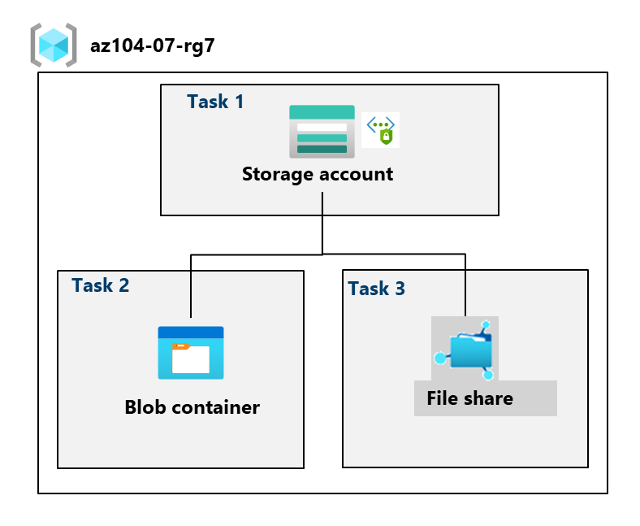
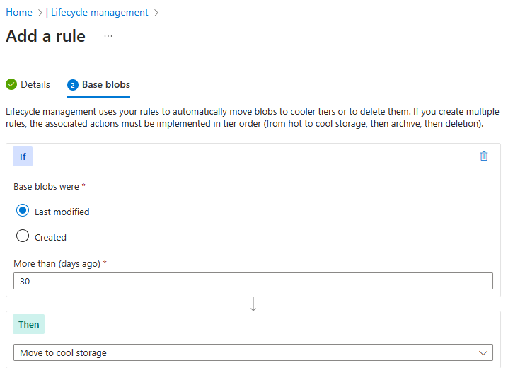
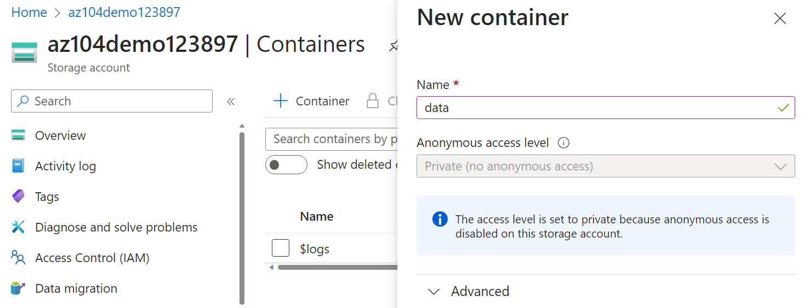
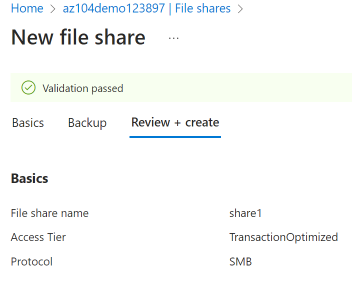
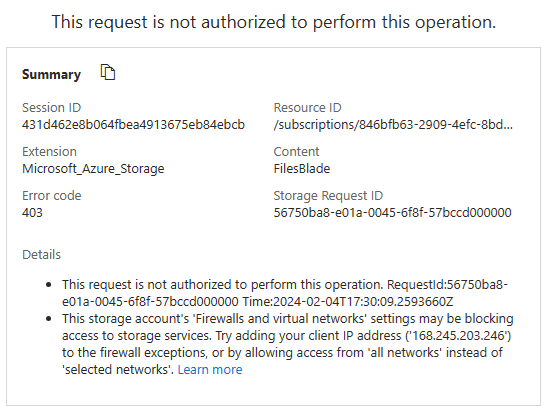

# Laboratorio 07: Administración de Azure Storage

Fuente: [laboratorio oficial de MicrosoftLearning](https://microsoftlearning.github.io/AZ-104-MicrosoftAzureAdministrator/Instructions/Labs/LAB_07-Manage_Azure_Storage.html). Los nombres de los controles pueden variar según la versión del portal. Necesitas una suscripción de Azure; las opciones disponibles pueden depender de ella. Los pasos usan **East US**, aunque puedes elegir otra región disponible. **Tiempo estimado: 50 minutos.** Elimina los recursos al terminar para evitar costes.

## Escenario y objetivos

La organización guarda archivos localmente y muchos se consultan pocas veces. Se quiere reducir el coste con niveles de acceso menos frecuentes, probar replicación y controles de seguridad (red, autenticación y autorización) y valorar Azure Files para compartir archivos.

1. Crear una cuenta de almacenamiento con redundancia geográfica y una regla de ciclo de vida.
2. Crear un contenedor privado, cargar un blob, protegerlo y probar una SAS.
3. Crear un recurso compartido de Azure Files y limitar el acceso por red.

## Tarea 1: Crear y configurar una cuenta de almacenamiento

1. Inicia sesión en [Azure Portal](https://portal.azure.com). Busca **Cuentas de almacenamiento** y selecciona **+ Crear**.

2. En **Datos básicos**, establece estos valores; deja los demás predeterminados:

| Ajuste | Valor |
| --- | --- |
| Suscripción | Tu suscripción de Azure |
| Grupo de recursos | `az104-rg7` (crear uno nuevo) |
| Nombre de la cuenta | De 3 a 24 letras minúsculas o dígitos, globalmente único; por ejemplo `az104lab7marta26`, si está disponible |
| Región | (US) East US u otra región disponible |
| Rendimiento | Estándar |
| Tipo de almacenamiento preferido | Azure Blob Storage o Azure Data Lake Storage |
| Redundancia | Almacenamiento con redundancia geográfica (GRS) |
| Acceso de lectura si la región principal no está disponible | Activar (RA-GRS) |

> **Ejemplo:** GRS mantiene una copia en otra región; RA-GRS permite además **leer** de la secundaria cuando proceda. La redundancia no concede permisos de lectura anónima.

3. Explora las ayudas de **Avanzado** y **Seguridad** y conserva sus valores predeterminados. En **Redes**, deshabilita **Acceso a la red pública**; se bloquea el acceso entrante a los datos desde Internet, no la administración de la cuenta mediante Azure Resource Manager.

4. En **Protección de datos**, observa el periodo predeterminado de eliminación temporal (la guía indica 7 días) y la opción de versiones de blobs. En **Cifrado**, revisa las opciones. Conserva los valores predeterminados y selecciona **Revisar y crear > Crear > Ir al recurso**.

5. En **Información general**, identifica los servicios de **contenedores**, **recursos compartidos de archivos**, **colas** y **tablas** de la cuenta.

6. En **Seguridad y redes > Redes**, confirma que el acceso público está deshabilitado. Selecciona **Administrar**, habilita el acceso público **solo desde redes seleccionadas** y agrega la IPv4 pública de tu equipo en **Redes virtuales, direcciones IP y excepciones**. Guarda. Puedes ignorar el aviso informativo sobre un perímetro de seguridad de red.

> **Por qué se añade la IP:** sin esta excepción, aunque tengas un rol de datos, el explorador del portal no podrá leer los blobs desde tu equipo. La regla IP limita la **red**; RBAC o una SAS decide **qué operaciones** se permiten.

7. En **Administración de datos > Redundancia**, observa las ubicaciones principal y secundaria. En **Administración de datos > Administración del ciclo de vida**, selecciona **Agregar una regla**. Llámala `Movetocool`: para blobs base cuya **última modificación fue hace más de 30 días**, selecciona **Mover a acceso esporádico** y agrega la regla.

> **Ejemplo:** `informe-abril.pdf` modificado hace 31 días puede pasar de *frecuente* a *esporádico*, con menor coste de capacidad y posibles costes de lectura mayores. Un archivo subido hoy no cambia de nivel inmediatamente.

## Tarea 2: Crear y proteger un contenedor de blobs

Un contenedor agrupa objetos como imágenes y documentos. `securitytest/` será un prefijo del nombre de los blobs, no un recurso compartido de archivos.

### Contenedor y retención

1. En la cuenta, abre **Almacenamiento de datos > Contenedores**, selecciona **+ Contenedor**, ponle `data` y deja el **Nivel de acceso público** en **Privado (sin acceso anónimo)**. Créalo.

2. En el menú de los tres puntos del contenedor, abre **Directiva de acceso**. Si aparece un aviso sobre autorización con clave compartida deshabilitada, continúa.

3. En **Almacenamiento de blobs inmutable**, agrega una directiva de **Retención basada en tiempo** (no suspensión legal) de **180 días** y guarda.

> **Ejemplo:** una retención activa protege blobs frente a borrados y modificaciones durante el plazo. La regla `Movetocool` solo cambia el **nivel de acceso** cuando se cumplen sus condiciones. No bloquees una directiva de retención sin comprobar las consecuencias: puede impedir la limpieza hasta que venza.

### Carga y acceso privado

1. En **Configuración > Configuración** de la cuenta, habilita **Permitir acceso con clave de cuenta de almacenamiento** y guarda, como indica el laboratorio. También habilita la autorización con clave compartida: en producción, mantenla deshabilitada si no es necesaria.

2. En **Control de acceso (IAM) > Agregar asignación de roles**, asigna a tu usuario **Storage Blob Data Contributor**. Repite con **Storage File Data Privileged Contributor** para la parte de Azure Files. Debes tener permisos para asignar roles; la propagación puede tardar unos minutos.

> **Diferencia:** el primer rol da acceso a datos de Blob; el segundo, a datos de Azure Files. Ninguno abre por sí solo el cortafuegos de la cuenta.

3. Abre `data`, selecciona **Cargar**, elige un archivo pequeño (por ejemplo `prueba.txt` con texto no confidencial) y expande **Avanzado**:

| Ajuste | Valor |
| --- | --- |
| Tipo de blob | Blob en bloques |
| Tamaño de bloque | 4 MiB |
| Nivel de acceso | Frecuente (*Hot*) |
| Cargar en carpeta | `securitytest` |
| Ámbito de cifrado | El predeterminado existente |

4. Selecciona **Cargar** y comprueba que aparece `securitytest/prueba.txt`. En su menú revisa **Descargar**, **Eliminar**, **Cambiar nivel** y **Adquirir concesión**. Algunas acciones pueden estar limitadas por la retención.

5. Abre el blob, copia su **URL** y pégala en una ventana privada. Debería aparecer `ResourceNotFound`, `PublicAccessNotPermitted` u otra denegación: el contenedor es privado.

> **Ejemplo:** `https://<cuenta>.blob.core.windows.net/data/securitytest/prueba.txt` identifica el objeto, pero conocer la URL no autoriza a leerlo.

### Lectura temporal mediante SAS

1. En el menú del blob selecciona **Generar SAS**. Si no está disponible la firma con clave de cuenta, usa **Clave de delegación de usuario**, que depende de Microsoft Entra y de permisos para obtener la clave.

2. Establece **Lectura** como único permiso, **fecha de ayer y hora actual** como inicio, **fecha de mañana y hora actual** como expiración y deja **IP permitidas** en blanco. Conserva el resto de valores predeterminados.

3. Selecciona **Generar token y URL de SAS**, copia la **URL de SAS del blob** y ábrela en otra ventana privada. Ahora deberías poder leer `prueba.txt`.

> **Ejemplo:** `https://<cuenta>.blob.core.windows.net/data/securitytest/prueba.txt?<parámetros-de-SAS>` concede lectura durante el plazo indicado **si la red está permitida**. La URL completa es una credencial: no la publiques ni la incluyas en capturas.

## Tarea 3: Crear y proteger Azure Files

Azure Files expone recursos compartidos con directorios y archivos; Blob Storage almacena objetos dentro de contenedores.

### Recurso compartido y explorador

1. En la cuenta, abre **Almacenamiento de datos > Recursos compartidos de archivos clásicos** y selecciona **+ Recurso compartido de archivos clásico**. Llámalo `share1` y conserva el nivel **Optimizado para transacciones**.

2. En **Copia de seguridad**, deja **Habilitar copia de seguridad** desactivado para simplificar el laboratorio; en un entorno real evalúa activarla. Selecciona **Revisar y crear > Crear**. Puedes ignorar el aviso posterior sobre copias de seguridad.

3. Abre **Explorador de almacenamiento > Recursos compartidos de archivos clásicos**. En `share1` puedes seleccionar **+ Agregar directorio** para crear `facturas` y **Cargar** para subir un archivo pequeño.

4. Si recibes un error de autorización, prueba **Cambiar cuenta de Azure AD** o el método **Cuenta de usuario de Microsoft Entra** del explorador. Comprueba también el rol de datos de Azure Files asignado en la tarea 2.

> **Ejemplo:** `share1/facturas/2026.txt` tiene estructura de directorios. En cambio, `data/securitytest/prueba.txt` es un blob con un prefijo en su nombre. Con tu IP permitida y el rol apropiado, deberías poder cargar un archivo; ver la cuenta en el portal no basta para acceder a sus datos.

### Limitar el acceso a la red virtual

1. Busca **Redes virtuales** (o entra desde **Infraestructura de red**) y crea `vnet1` en `az104-rg7`, con los demás valores predeterminados. Selecciona **Revisar y crear > Crear > Ir al recurso**.

2. En `vnet1`, abre **Configuración > Puntos de conexión de servicio > Agregar**. Selecciona el servicio **Microsoft.Storage**, deja las directivas sin seleccionar, marca la subred `default` y guarda.

3. Vuelve a la cuenta y abre **Seguridad y redes > Redes > Administrar**. Agrega una **red virtual existente**, `vnet1`, con la subred `default`.

4. En **Direcciones IPv4**, elimina la IP pública de tu equipo añadida en la tarea 1 y **guarda**. La lista de redes permitidas debe incluir la subred, pero no tu IP.

5. Actualiza el **Explorador de almacenamiento** y trata de ver el contenido de `share1` o `data`. Se espera una denegación desde tu navegador, que sigue fuera de `vnet1`. La regla puede tardar unos minutos en aplicarse; quizá aún puedas ver el recurso, pero no sus archivos.

> **Ejemplo de diagnóstico:** antes, `tu IP + rol de datos` permitía la carga; después, `rol de datos sin IP autorizada` no basta. El punto de conexión de servicio **no conecta tu portátil a la VNet**; permite el acceso de los recursos de la subred. Incluso una SAS válida está sujeta a la regla de red.

## Limpieza

Si usas tu propia suscripción, elimina `az104-rg7` desde Azure Portal y confirma su nombre y el borrado permanente. Antes comprueba que no contiene recursos ajenos al laboratorio. Una directiva de inmutabilidad bloqueada puede impedir eliminar blobs hasta que venza: revisa los errores antes de reintentar.

También puedes usar, si tienes permisos, `Remove-AzResourceGroup -Name az104-rg7` en PowerShell o `az group delete --name az104-rg7` en Azure CLI.

## Repaso

| Concepto | Ejemplo | Qué demuestra |
| --- | --- | --- |
| RA-GRS | Copia secundaria legible | Redundancia no significa autorización. |
| Ciclo de vida | `Movetocool` tras 30 días | Cambia el nivel del blob; no es una copia de seguridad. |
| Retención | 180 días | Protege frente a modificaciones y borrados durante el periodo. |
| SAS de lectura | URL temporal de `prueba.txt` | Da acceso limitado; no abre el cortafuegos. |
| Azure Files | `share1/facturas/2026.txt` | Archivos organizados en directorios. |
| Regla de red | Solo `vnet1/default` | Un rol válido no evita el bloqueo desde fuera de la red. |

Para profundizar: [proyecto guiado de Azure Files y Blob Storage](https://learn.microsoft.com/training/modules/guided-project-azure-files-azure-blobs/), [creación de cuentas de almacenamiento](https://learn.microsoft.com/training/modules/create-azure-storage-account/) y [ciclo de vida de blobs](https://learn.microsoft.com/training/modules/manage-azure-blob-storage-lifecycle).

## Relacionado

- [Seguridad de Azure Storage](../../../knowledge/az104-storage-security.md)
- [Cuentas de almacenamiento](../../../knowledge/az104-storage-accounts.md)
- [Índice de laboratorios AZ-104](../README.md)