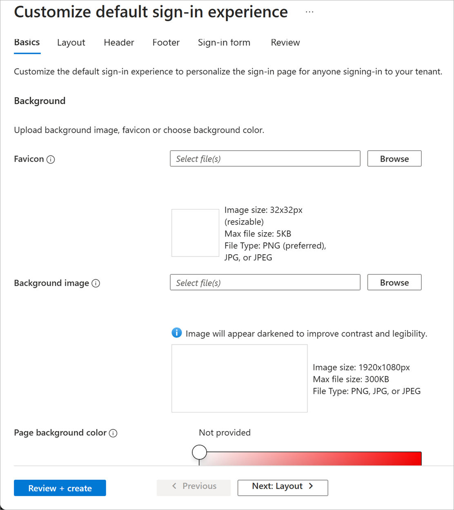
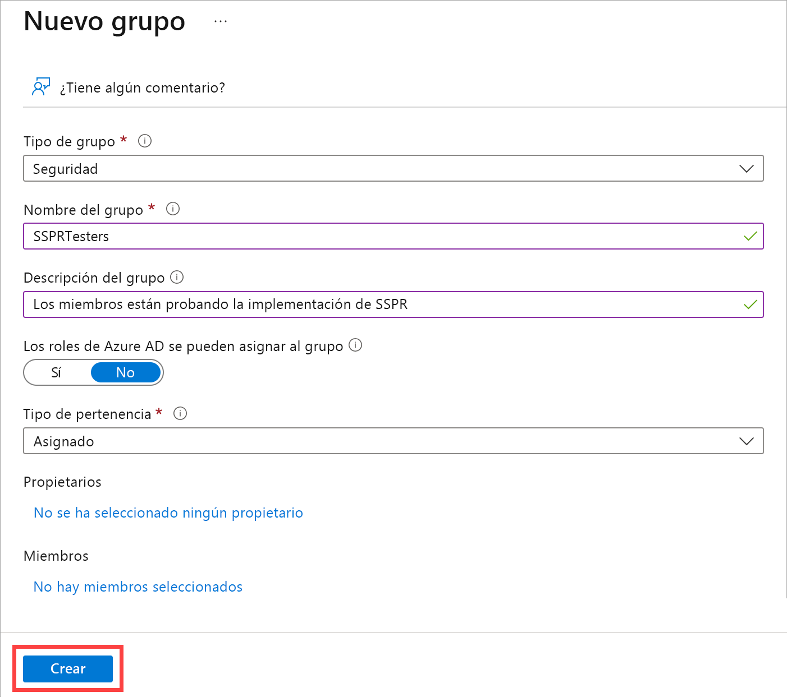
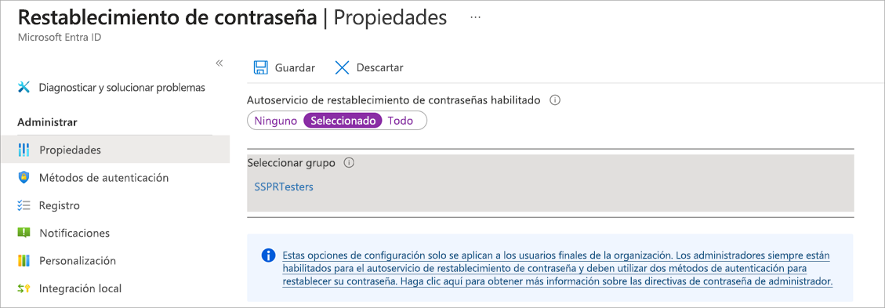
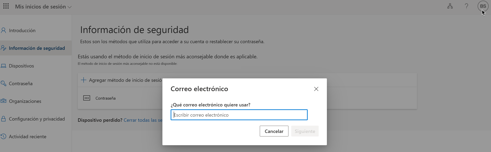
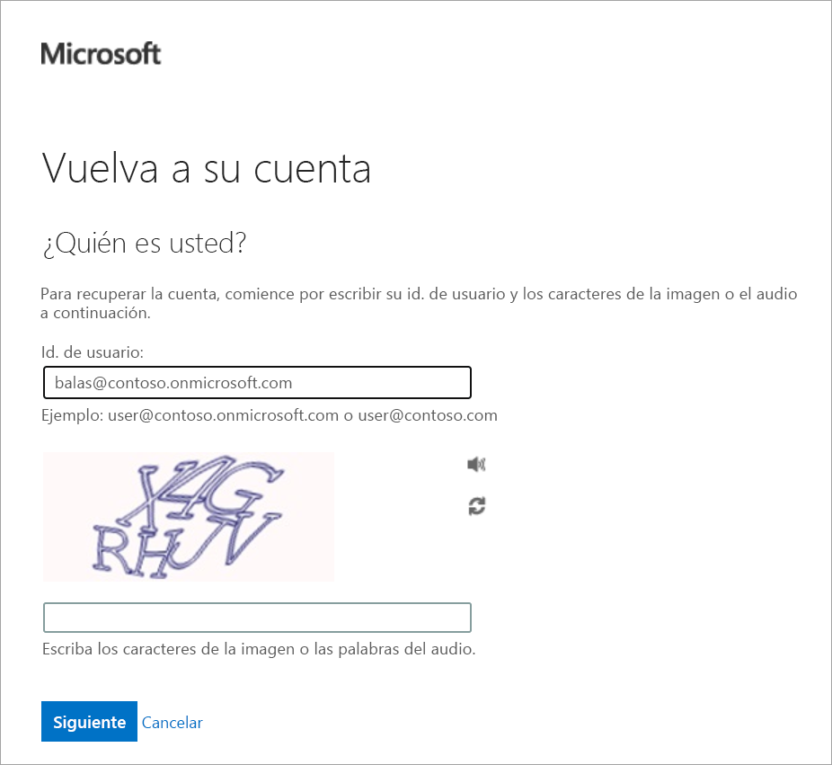

# Personalizar la información de marca de directorio

Supongamos que nos han pedido que la página de inicio de sesión de Azure muestre la información de marca de la organización minorista para que los usuarios puedan tener la tranquilidad de que están introduciendo credenciales en un sistema legítimo. Aquí aprenderemos a configurar esta información de marca personalizada.

Para completar este ejercicio, debemos tener dos archivos de imagen:

- Una imagen de fondo de la página. Debe ser un archivo PNG o JPG de 1920 × 1080 píxeles y menos de 300 KB.
- Una imagen de logotipo de la compañía. Debe ser un archivo PNG o JPG de 32 × 32 píxeles, con un tamaño menor de 5 KB.

## Personalización de marca de la organización de Microsoft Entra

Vamos a usar Microsoft Entra ID para configurar la personalización de marca.

1. Inicie sesión en [Azure Portal](https://portal.azure.com/).
    
2. Seleccione **Microsoft Entra ID** para ir a la organización de Microsoft Entra. Si no está en la organización de Microsoft Entra correcta, acceda al perfil de Azure y seleccione **Cambiar el directorio** para encontrar la organización.
    
3. En **Administrar**, seleccione **Personalización de marca de empresa**. A continuación, seleccione el botón **Personalizar** en el centro de la pantalla.
    
4. Junto a **Favicono**, seleccione **Examinar**. Seleccione la imagen del logotipo.
    
5. Junto a **Imagen de fondo**, seleccione **Examinar**. Seleccione la imagen de fondo de la página.
    
6. Seleccione un **color de fondo de página** o acepte el valor predeterminado.
   
    
    
7. Select **Review + Create**, and then select **Create**.
    
# Ejercicio: configurar el autoservicio de restablecimiento de contraseña.

En esta unidad, configurará y probará el autoservicio de restablecimiento de contraseña (SSPR) mediante el correo electrónico. Deberá usar el correo electrónico para completar el proceso de restablecimiento de contraseña en este ejercicio.

## Creación de un grupo

Queremos implementar SSPR en un conjunto limitado de usuarios en primer lugar para asegurarnos de que la configuración de SSPR funciona según lo previsto. Vamos a comenzar creando un grupo de seguridad para esta implementación limitada.

1. En la organización de Microsoft Entra que creó, en **Administrar**, seleccione **Grupos**.
    
2. Seleccione **Nuevo grupo**.
    
3. Escriba los siguientes valores:

|Configuración|Valor|
|---|---|
|Tipo de grupo|Seguridad|
|Nombre del grupo|SSPRTesters|
|Descripción del grupo|Los miembros están probando la implementación de SSPR|
|Tipo de pertenencia|Asignado|
4. Seleccione **Crear**.

## Creación de una cuenta de usuario

Para probar la configuración, cree una cuenta que no esté asociada a un rol de administrador. Usted también asignará la cuenta al grupo que ha creado.

1. En su organización de Microsoft Entra, en **Administrar**, seleccione **Usuarios**.
    
2. Seleccione **+ Nuevo usuario**, seleccione **Crear nuevo usuario** en la lista desplegable y use los valores siguientes:
   
3. Seleccione la pestaña **Assignments** (Asignaciones).
    
4. Seleccione **Agregar grupo**, active la casilla del grupo **SSPRTesters** y, después, el botón **Seleccionar**.
    
5. Seleccione **Revisar y crear** y luego **Crear**.

|Configuración|Valor|
|---|---|
|Nombre principal de usuario|balas|
|Nombre para mostrar|Bala Sandhu|
|Contraseña|Seleccione el icono **Copiar** situado junto a la contraseña generada automáticamente y pegue la contraseña en un editor de texto como el Bloc de notas.|
## Habilitación de SSPR

Ahora, estás listo para habilitar SSPR en el grupo.

1. En su organización de Microsoft Entra, en **Administrar**, seleccione **Restablecimiento de contraseña**.
    
2. En la página **Propiedades**, seleccione **Seleccionado**. Seleccione el vínculo de **Seleccionar grupo**, seleccione el cuadro situado junto al grupo **SSPRTesters** y, a continuación, el botón **Seleccionar**.
    
3. Seleccione **Guardar**.
    
    
    
4. En **Administrar**, seleccione las páginas **Métodos de autenticación**, **Registro** y **Notificaciones** para revisar los valores predeterminados. Asegúrese de que en **métodos de autenticación** tenga seleccionado **correo electrónico**.
    
5. Seleccione **Personalización**.
    
6. Seleccione **Sí** y después, en el cuadro de texto **Dirección URL o correo electrónico del departamento de soporte técnico personalizados**, escriba **admin@organization-domain-name.onmicrosoft.com**. Reemplace el "organization-domain-name" por el nombre de dominio de la organización de Microsoft Entra que creó. Si ha olvidado el nombre de dominio, mueva el puntero sobre el perfil en Azure Portal.
    
7. Seleccione **Guardar**.
    

## Registro en SSPR

Ahora que se ha completado la configuración de SSPR, registre un correo electrónico para el usuario que creó.

Nota:

Si recibe un mensaje que indica "El administrador no ha habilitado esta característica", use el modo privado o incógnito en el explorador web.

1. En una nueva ventana del explorador, vaya a [https://aka.ms/ssprsetup](https://aka.ms/ssprsetup).
    
2. Inicie sesión con el nombre de usuario **balas@organization-domain-name.onmicrosoft.com** y la contraseña que anotó anteriormente. Recuerde que debe reemplazar "organization-domain-name" por el nombre de dominio de la organización de Microsoft Entra que creó.
    
3. Si se le pide que actualice la contraseña, escriba otra nueva que prefiera. No olvide anotar la nueva contraseña.
    
4. Seleccione la pestaña **Información de seguridad** y, después, **+ Agregar método de inicio de sesión**.
    
5. En el cuadro **Agregar un método**, seleccione **Correo electrónico**.
    
6. Escriba los detalles del correo electrónico.
    
    
    
7. Cuando reciba el código en el correo electrónico, escriba el código en el cuadro de texto y seleccione **Siguiente**.
    

## Comprobación de SSPR

Ahora vamos a comprobar si el usuario puede restablecer su contraseña.

1. En una nueva ventana del explorador, vaya a [https://aka.ms/sspr](https://aka.ms/sspr).
    
2. En **Id. de usuario**, escriba **balas@organization-domain-name.onmicrosoft.com**. Reemplace "organization-domain-name" por el nombre de dominio que se ha usado para la organización de Microsoft Entra.
    
    
    
3. Escriba los caracteres del CAPTCHA y seleccione **Siguiente**.
    
4. Se selecciona el **Correo electrónico mi correo electrónico alternativo** botón de radio. Selecciona **Correo electrónico**.
    
5. Cuando llegue el correo electrónico, en el **Escriba el código de verificación** cuadro de texto, escriba el código que se envió. Seleccione **Siguiente**.
    
6. Escriba la nueva contraseña y seleccione **Finalizar**. No olvide anotar la nueva contraseña.
    
7. Cierre la ventana del explorador.