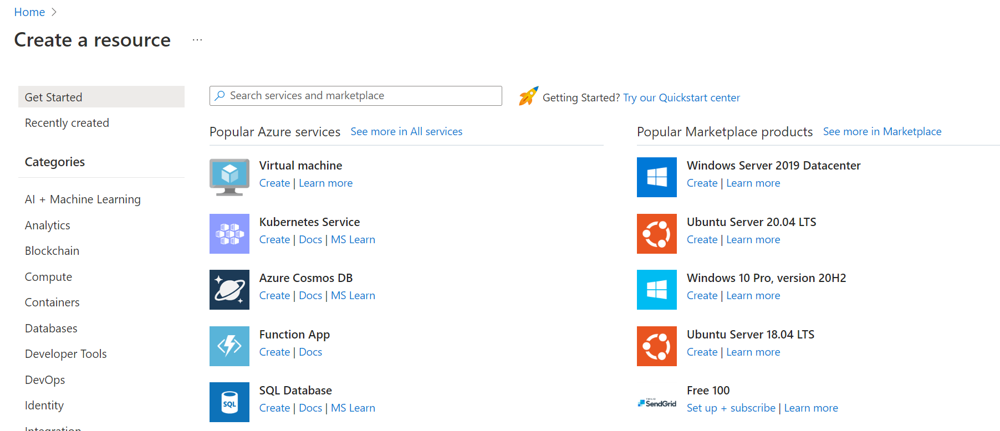
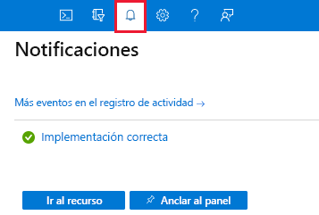
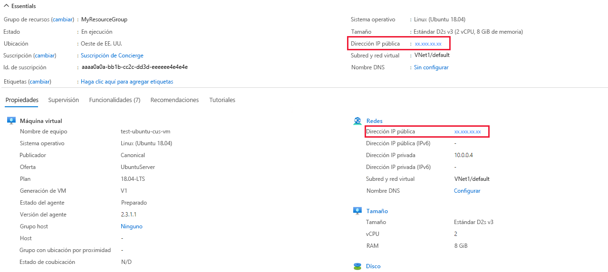

Ha planeado la infraestructura de red y ha identificado varias máquinas virtuales que quiere migrar a la nube. Hay varias opciones para crear las máquinas virtuales. La decisión que tome dependerá del entorno que le resulte más cómodo. Azure admite un portal basado en la Web para crear y administrar recursos. También puede optar por usar herramientas de línea de comandos que se ejecuten en Linux, macOS y Windows.

> [!NOTE] Nota:
> Este ejercicio es opcional. Si desea completar este ejercicio, deberá crear una suscripción de Azure antes de comenzar. Si no tiene una cuenta de Azure o no quiere crear una en este momento, puede leer las instrucciones para que comprenda la información que se presenta.

> [!NOTE] Nota:> 
> Debe usar un grupo de recursos para completar los pasos de este ejercicio. Puede usar un grupo de recursos que ya ha creado o puede crear un nuevo grupo de recursos específicamente para este ejercicio. Si decide crear un nuevo grupo de recursos, esto facilitará la limpieza de los recursos que cree a medida que complete el ejercicio. Si no tiene un grupo de recursos existente o desea crear uno nuevo específicamente para este ejercicio, puede seguir los pasos descritos en [Uso de Azure Portal y Azure Resource Manager para administrar grupos](https://learn.microsoft.com/es-es/azure/azure-resource-manager/management/manage-resource-groups-portal) de recursos para crear un grupo de recursos mediante Azure Portal, o puede seguir los pasos descritos en [Administración de grupos de recursos de Azure mediante la CLI de Azure](https://learn.microsoft.com/es-es/azure/azure-resource-manager/management/manage-resource-groups-cli) para crear un grupo de recursos mediante la CLI de Azure.
> 

> [!NOTE] Nota:
> En este ejercicio, reemplace **myResourceGroupName** en los ejemplos por el nombre de un grupo de recursos existente o el nombre del grupo de recursos que creó para este ejercicio.

#### Opciones para crear y administrar máquinas virtuales.

## Azure Portal

**Azure Portal** le proporciona una interfaz de usuario basada en web de fácil uso que le permite crear y administrar todos los recursos de Azure. Por ejemplo, puede configurar una nueva base de datos, aumentar la capacidad de proceso de las máquinas virtuales y supervisar el costo mensual. También es una gran herramienta de aprendizaje, ya que permite sondear todos los recursos disponibles y usar asistentes guiados para crear los que necesite.

### Creación de una máquina virtual en Azure Portal

Supongamos que desea crear una máquina virtual que ejecute un servidor web de Ubuntu. La configuración de un sitio no es difícil, pero hay un par de cuestiones que deben tenerse en cuenta. Debe instalar y configurar un sistema operativo, configurar un sitio web, instalar una base de datos y preocuparse de cosas como los firewalls. Vamos a tratar la creación de máquinas virtuales en los siguientes módulos, pero aquí vamos a crear una para ver lo fácil que es. No entraremos a ver en detalle todas las opciones. Consulte alguno de los módulos de **creación de una máquina virtual** para obtener toda la información de cada opción.

1. Inicie sesión en [Azure Portal](https://portal.azure.com/).
    
2. En la página principal de Azure, en **Servicios de Azure**, seleccione **Crear un recurso**. Aparece el panel **Crear un recurso**, en el que se muestran productos populares de los Servicios de Azure.
    
    
    
3. Queremos crear una máquina virtual, así que seleccione **Máquina virtual**.
    
4. Aparece el panel **Crear máquina virtual**.
### Configuración de la máquina virtual

Es necesario configurar los parámetros básicos de la máquina virtual. Si no está familiarizado con alguna de las opciones que aparecen en este momento, no se preocupe, es normal. En un módulo posterior se explicarán todas estas opciones. Se le invita a que copie los valores que se usan aquí.

5. En la pestaña **Aspectos básicos**, escriba los valores siguientes para cada opción.

|             Configuración             |                                 Valor                                 |
|:-------------------------------------:|:---------------------------------------------------------------------:|
|       **Detalles del proyecto**       |                                                                       |
|              Suscripción              |                       Selecciona la suscripción                       |
|           Grupo de recursos           |      Seleccione **myResourceGroupName** en la lista desplegable.      |
|       **Detalles de instancia**       |                                                                       |
|     Nombre de la máquina virtual      |                     Escriba _test-ubuntu-cus-vm_.                     |
|                Región                 | En la lista desplegable, seleccione una ubicación geográfica cercana. |
|      Opciones de disponibilidad       |           No se requiere redundancia de la infraestructura            |
|           Tipo de seguridad           |                               Estándar                                |
|                Imagen                 |                     Ubuntu Server 24.04 LTS: Gen2                     |
|            Arquitectura VM            |                                  x64                                  |
| Ejecución de Azure Spot con descuento |                              No activado                              |
|                Tamaño                 |                            Standard D2s V3                            |
|      **Cuenta de administrador**      |                                                                       |
|         Tipo de autenticación         |                          Clave pública SSH.                           |
|           Nombre de usuario           |                     Escriba un nombre de usuario.                     |
|    Origen de la clave pública SSH     |                 Generación de un nuevo par de claves                  |
|       Nombre del par de claves        |                      **test-ubuntu-cus-vm_key**                       |
|    **Reglas de puerto de entrada**    |                                                                       |
|      Puertos de entrada públicos      |                  Permitir los puertos seleccionados                   |
|    Selección de puertos de entrada    |                               SSH (22)                                |

6. Hay otras pestañas que puede explorar para ver la configuración que puede seleccionar durante la creación de máquinas virtuales. Cuando termine de explorar, haga clic en **Revisar y crear** para revisar y validar la configuración.

7. Azure valida los ajustes de configuración de un recurso antes de crearlo. Puede que deba proporcionar más información en función de los requisitos del creador de la imagen integrado en Azure. Es sencillo; basta con abrir la pestaña que tiene un error. Compruebe que todos los valores establecidos son los deseados y, después, seleccione **Crear** para implementar y crear la máquina virtual.
   
8. Se abre la ventana **Generar nuevo par de claves**. Seleccione **Descargar la clave privada y Crear recurso**.

9. La implementación se puede supervisar en **Detalles de la implementación** (en el panel **Información general**) o a través del panel **Notificaciones**. Seleccione el icono de notificaciones de la barra de herramientas de la esquina superior derecha para mostrar u ocultar el panel Notificaciones.
    
    
    
    El proceso de implementación de la máquina virtual tarda unos minutos en completarse. Recibe una notificación que le informa de que la implementación se realizó correctamente.
    
10. Haga clic en **Go to resource** (Ir al recurso). Aparece la página de **información general** de la máquina virtual.
    
    Aquí podrá ver toda la información y las opciones de configuración de la máquina virtual Ubuntu que acaba de crear. Uno de los componentes de la información es la **dirección IP pública**.
    
    
    
    Cuando habilitó la autenticación de clave pública SSH en un paso anterior, la interfaz de usuario también dio una opción para habilitar SSH. SSH permite conectarse a la máquina virtual a través de la dirección IP pública con cualquier cliente de SSH.
    

Enhorabuena. Con unos pocos pasos, ha implementado una máquina virtual que ejecuta Linux. Vamos a explorar otras formas de crear una máquina virtual.

