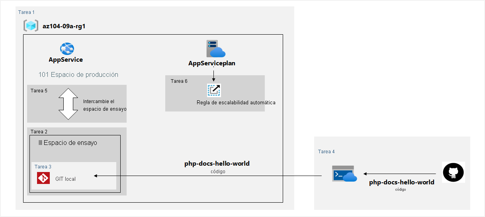
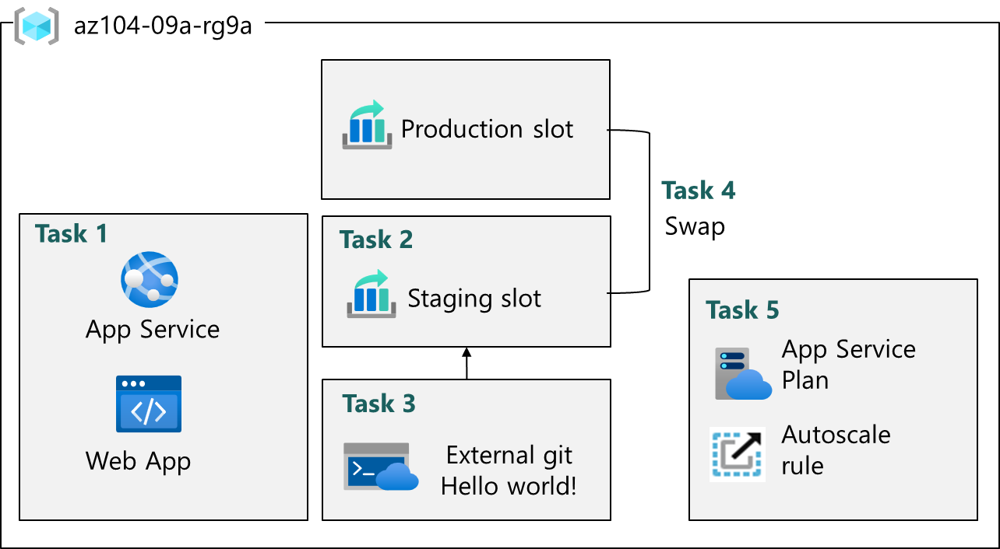
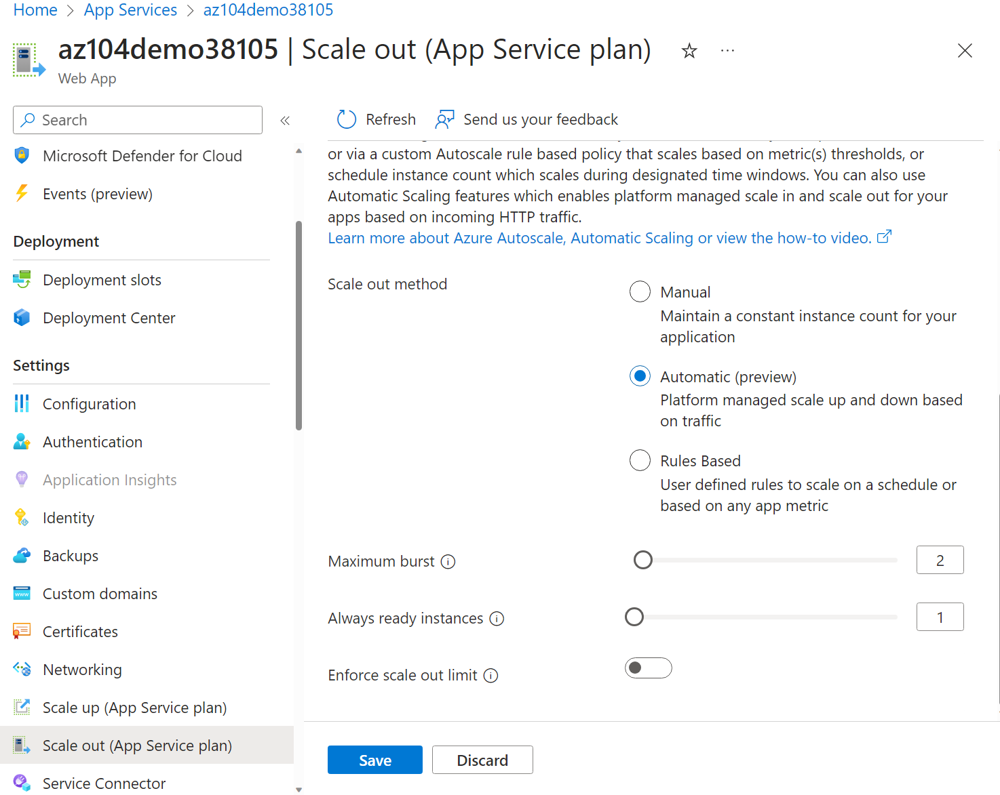

# Implementación de Web Apps.

Su organización está migrando aplicaciones web locales a Azure. Como administrador de Azure, debe hacer lo siguiente:

- Hospede sitios web que se ejecutan en servidores Windows con la pila en tiempo de ejecución de PHP.
- Use ranuras de implementación de Azure Web Apps.

## Diagrama de arquitectura



## Aptitudes de trabajo

- Cree una aplicación web de Azure.
- Creación de una ranura de implementación de almacenamiento provisional.
- Configure las opciones de implementación de web App.
- Implemente código en la ranura de implementación de ensayo.
- Cambie las ranuras de ensayo.
- Configure y pruebe el escalado automático de la aplicación web de Azure.

Nota:

Tiempo estimado: 20 minutos. Para completar este ejercicio, necesitará una [suscripción a Azure](https://azure.microsoft.com/pricing/purchase-options/azure-account?cid=msft_learn_be16880c-beb1-1937-cdee-01e9031ad9da).

Inicie el ejercicio y siga las instrucciones. Cuando termine, asegúrese de volver a esta página para que pueda continuar aprendiendo.
[Launch Exercise](https://microsoftlearning.github.io/AZ-104-MicrosoftAzureAdministrator/Instructions/Labs/LAB_09a-Implement_Web_Apps.html)
  

# Lab 09a - Implement Web Apps

## Lab introduction

In this lab, you learn about Azure web apps. You learn to configure a web app to display a Hello World application in an external GitHub repository. You learn to create a staging slot and swap with the production slot. You also learn about autoscaling to accommodate demand changes.

This lab requires an Azure subscription. Your subscription type may affect the availability of features in this lab. You may change the region, but the steps are written using East US.

## Estimated timing: 20 minutes

## Lab scenario

Your organization is interested in Azure Web apps for hosting your company websites. The websites are currently hosted in an on-premises data center. The websites are running on Windows servers using the PHP runtime stack. The hardware is nearing end-of-life and will soon need to be replaced. Your organization wants to avoid new hardware costs by using Azure to host the websites.

## Architecture diagram



## Job skills

- Task 1: Create and configure an Azure web app.
- Task 2: Create and configure a deployment slot.
- Task 3: Configure web app deployment settings.
- Task 4: Swap deployment slots.
- Task 5: Configure and test autoscaling of the Azure web app.

## Task 1: Create and configure an Azure web app

In this task, you create an Azure web app. Azure App Services is a Platform As a Service (PAAS) solution for web, mobile, and other web-based applications. Azure web apps is part Azure App Services hosting most runtime environments, such as PHP, Java, and .NET. The app service plan that you select determines the web app compute, storage, and features.

1. Sign in to the **Azure portal** - `https://portal.azure.com`.
    
2. Search for and select `App Services`.
    
3. Select **+ Create**, from drop-down menu, **Web App**. Notice the other choices.
    
4. On the **Basics** tab of the **Create Web App** blade, specify the following settings (leave others with their default values):
    
|Setting|Value|
|---|---|
|Subscription|your Azure subscription|
|Resource group|`az104-rg9` (If necessary, select **Create new**)|
|Web app name|any globally unique name|
|Publish|**Code**|
|Runtime stack|**PHP 8.2**|
|Operating system|**Linux**|
|Region|**East US**|
|Pricing plans|**Premium V3 P1V3**|
|Zone redundancy|accept the defaults|
    
5. Click **Review + create**, and then **Create**.
    

> [!NOTE]
Wait until the Web App is created before you proceed to the next task. This should take about a minute.

    

> [!NOTE]
 If the deployment fails, change to another region and try again. This is due to quotas in different regions.

    
6. After the deployment, select **Go to resource**.
    

## Task 2: Create and configure a deployment slot

In this task, you will create a staging deployment slot. Deployment slots enable you to perform testing prior to making your app available to the public (or your end users). After you have performed testing, you can swap the slot from development or staging to production. Many organizations use slots to perform pre-production testing. Additionally, many organizations run multiple slots for every application (for example, development, QA, test, and production).

1. On the blade of the newly deployed Web App, click the **Default domain** link to display the default web page in a new browser tab.
    
2. Close the new browser tab and, back in the Azure portal, in the **Deployment** section of the Web App blade, click **Deployment slots**.
    
3. Click **Add slot**, and add a new slot with the following settings:
    
|Setting|Value|
|---|---|
|Name|`staging`|
|Clone settings from|**Do not clone settings**|
    
4. Select **Add** to create the slot.
    
5. Refresh the page to view the Production and Staging slots.
    
6. Select the entry representing the newly created staging slot.
    

> [!NOTE]
 This will open the blade displaying the properties of the staging slot.

    
1. Review the staging slot blade and note that its URL differs from the one assigned to the production slot.
    

## Task 3: Configure Web App deployment settings

In this task, you will configure Web App deployment settings. Deployment settings allow for continuous deployment. This ensures that the app service has the latest version of the application.

1. In the **staging** slot, select **Configuration** then **General settings**.
    

> [!NOTE] 
> Make sure you are on the staging slot blade (instead of the production slot).

    
1. Under **SCM Basic Auth Publishing Credentials**, enable the checkbox and select **Apply**.
    
2. Ensure the **Deployment** section of the service menu is expanded, and select **Deployment Center** then **Settings**.
    
3. If an alert banner appears stating “SCM basic authentication is disabled for your app”, select **Enable here** and complete the steps to enable it.
    
4. In the **Source** drop-down list, select **External Git**. Notice the other choices.
    
5. In the repository field, enter `https://github.com/Azure-Samples/php-docs-hello-world`
    
6. In the branch field, enter `master`.
    
7. Select **Save**.
    
8. From the staging slot, select **Overview**.
    
9. Select the **Default domain** link, and open the URL in a new tab.
    
10. Verify that the staging slot displays **Hello World**.
    

> [!NOTE]
 The deployment may take a minute. Be sure to **Refresh** the application page.

## Task 4: Swap deployment slots

In this task, you will swap the staging slot with the production slot. Swapping a slot allows you to use the code that you have tested in your staging slot, and move it to production. The Azure portal will also prompt you if you need to move other application settings that you have customized for the slot. Swapping slots is a common task for application teams and application support teams, especially those deploying routine app updates and bug fixes.

1. Navigate back to the **Deployment slots** blade, and then select **Swap**.
    
2. Review the default settings and click **Start Swap**. Wait for the notification that the swap has finished.
    
3. Return to the portal home page. You should have both the production web app and the staging slot.
    
4. Search for `App Services` and select your App Service web app. This returns you to the Production Deployment slot.
    
5. Select the App Service web app and on the **Overview** blade of the Web App select the **Default domain** link to display the website home page.
    
6. Verify the production web page now displays the **Hello World!** page.
    

> [!NOTE]
Copy the Default domain **URL** you will need it for load testing in the next task.     

## Task 5: Configure and test autoscaling of the Azure Web App

In this task, you will configure autoscaling of Azure Web App. Autoscaling enables you to maintain optimal performance for your web app when traffic to the web app increases. To determine when the app should scale you can monitor metrics like CPU usage, memory, or bandwidth.

1. In the left pane, in the **App Service plan** section, select **Scale out**.
    

> [!NOTE]
Ensure you are working on the production slot, not the staging slot.

    
1. From the **Scaling** section, select **Automatic**. Notice the **Rules Based** option. Rules based scaling can be configured for different app metrics.
    
2. In the **Maximum burst** field, select **2**. Set **Minimum instances** to 1.
    
3. If you have a staging slot, open **Azure Cloud Shell** and run the following command to set the staging slot minimum elastic instance count to 1 before selecting **Save**:
   
    ```bash
    az webapp update --resource-group az104-rg9 --name <your-web-app-name> --slot staging --minimum-elastic-instance-count 1
    ```
    

> [!NOTE]
> Replace `<your-web-app-name>` with your app name. After the command succeeds, return to **Scale out** on the production web app and select **Save**.

    

    
4. Select **Save**.
    
5. Select **Diagnose and solve problems** (left pane of the web app main page).
    
6. In the **Load Test your App** box, select **Create Load Test**.    
    - Select **+ Create** and give your load test a **name**. The name must be unique.
    - Select **Review + create** and then **Create**.
7. Wait for the load test to create, and then select **Go to resource**.

|                       |                                                       |
| --------------------- | ----------------------------------------------------- |
| From the **Overview** | **Create by adding HTTP requests**, select **Create** |

    
9. On the **Test plan** tab, click **Add request**. In the **URL field**, paste in your **Default domain** URL. Ensure this is properly formatted and begins with **https://**. Select **Add** to save your changes.
    
10. Select **Review + create** and **Create**.
    

> [!NOTE]
It may take a couple of minutes to create the test. Watch the notifications.

    
9. Navigate to the test (it is listed on the home page).
    
10. Refresh and review the live metrics including **Virtual users**, **Response time**, and **Requests/sec**.
    
11. Select **Stop** to initiate the stop request, then select **Stop** again in the confirmation dialog to complete the test run. You don’t need to wait for the test to complete.

## Cleanup your resources

If you are working with **your own subscription** take a minute to delete the lab resources. This will ensure resources are freed up and cost is minimized. The easiest way to delete the lab resources is to delete the lab resource group.

- In the Azure portal, select the resource group, select **Delete the resource group**, **Enter resource group name**, and then click **Delete**. When a second Delete confirmation dialog appears, click **Delete** again to complete the deletion.
- Using Azure PowerShell, `Remove-AzResourceGroup -Name resourceGroupName`.
- Using the CLI, `az group delete --name resourceGroupName`.

## Extend your learning with Copilot

Copilot can assist you in learning how to use the Azure scripting tools. Copilot can also assist in areas not covered in the lab or where you need more information. Open an Edge browser and choose Copilot (top right) or navigate to _copilot.microsoft.com_. Take a few minutes to try these prompts.

- Summarize the steps to create and configure an Azure web app.
- What are ways I can scale an Azure Web App?

## Learn more with self-paced training

- [Host a web application with Azure App Service](https://learn.microsoft.com/en-us/training/modules/host-a-web-app-with-azure-app-service/). Learn how to create a website through the hosted web app platform in Azure App Service.
- [Configure web app settings](https://learn.microsoft.com/en-us/training/modules/configure-web-app-settings/). Learn how to create and manage application settings, install SSL/TLS certificates to secure web traffic, enable diagnostic logging, create virtual app to directory mappings, and manage app features.

## Key takeaways

Congratulations on completing the lab. Here are the main takeaways for this lab.

- Azure App Services lets you quickly build, deploy, and scale web apps.
- App Service includes support for many developer environments including ASP.NET, Java, PHP, and Python.
- Deployment slots allow you to create separate environments for deploying and testing your web app.
- You can manually or automatically scale a web app to handle additional demand.
- A wide variety of diagnostics and testing tools are available.
 # ☁️ Azure App Service — Deployment Slots, Staging, CI/CD y Swap
 

---

 

> [!abstract] 🎯 Idea principal  
> Un **Deployment Slot** es una instancia independiente de una Web App que permite desplegar y probar una versión de la aplicación **sin modificar directamente Production**.
> 
> El flujo típico es:
> 
> **GitHub → CI/CD → Staging → Pruebas → Swap → Production**

---

## 🧠 1. ¿Qué problema solucionan los Deployment Slots?

Imagina que tenemos una aplicación en producción:

```text
👤 Usuarios
    │
    ▼
🌐 Production
    │
    └── v1.0
```

Ahora hemos desarrollado una nueva versión:

```text
v1.1
```

Una opción peligrosa sería:

```text
GitHub
   │
   ▼
Production
   │
   └── 💥 Si algo falla → usuarios afectados
```

Con un **Deployment Slot** podemos hacer:

```text
                    ┌───────────────┐
GitHub ── CI/CD ──► │    Staging    │
                    │     v1.1      │
                    └───────┬───────┘
                            │
                         🧪 Tests
                            │
                            ▼
                         🔄 Swap
                            │
                            ▼
                    ┌───────────────┐
                    │  Production   │
                    │     v1.1      │
                    └───────────────┘
```

### 💡 La idea

> **Staging permite probar una versión nueva antes de promocionarla a Production.**

---

# 🌐 2. Cada Slot tiene su propia URL

Esto es muy importante.

Una Web App puede tener:

```text
Production
https://miapp.azurewebsites.net
```

y un slot llamado `staging`:

```text
Staging
https://miapp-staging.azurewebsites.net
```

Por tanto, **Staging no es simplemente una carpeta o una copia invisible**.

Es una aplicación desplegada y accesible mediante su propio hostname.

---

## 🔎 3. ¿Cómo compruebo que Staging funciona?

En Azure Portal:

```text
App Service
   │
   └── Deployment slots
          │
          └── staging
                │
                └── Overview
                      │
                      └── Default domain
```

Abres el **Default domain** del slot.

Por ejemplo:

```text
https://miapp-staging.azurewebsites.net
```

Y puedes comprobar la aplicación directamente.

### Ejemplo

Production:

```text
https://miapp.azurewebsites.net
```

muestra:

```text
Hello World v1.0
```

Mientras que Staging:

```text
https://miapp-staging.azurewebsites.net
```

muestra:

```text
Hello World v1.1
```

Esto significa que podemos probar **v1.1 sin modificar lo que están viendo los usuarios en Production**.

---

# 🚀 4. ¿Dónde entra CI/CD?

CI/CD no significa necesariamente:

```text
GitHub → Production
```

Puede ser:

```text
GitHub
   │
   ▼
CI/CD
   │
   ▼
Staging
```

Por ejemplo:

```text
        GitHub
          │
          │ push
          ▼
      CI/CD Pipeline
          │
          │ deploy
          ▼
      ┌─────────┐
      │ Staging │
      │  v1.1   │
      └────┬────┘
           │
           │ 🧪 Tests
           ▼
       ¿Funciona?
        /       \
      ❌         ✅
      │           │
      ▼           ▼
    Fix          Swap
                  │
                  ▼
             Production
                v1.1
```

### ⭐ Concepto importante

> **CI/CD es el mecanismo de despliegue.**
> 
> **Deployment Slots son los entornos donde podemos desplegar.**

No son conceptos excluyentes.

---

# 🔄 5. ¿Qué hace exactamente `Swap`?

Supongamos que tenemos:

|Slot|Versión|
|---|---|
|🟢 Production|v1.0|
|🟡 Staging|v1.1|

Después de probar Staging hacemos:

```text
🔄 Swap
```

El resultado es:

|Slot|Versión|
|---|---|
|🟢 Production|v1.1|
|🟡 Staging|v1.0|

Visualmente:

```text
ANTES

Production                 Staging
   │                         │
   ▼                         ▼
  v1.0                      v1.1
   │                         │
   └────────── 🔄 ───────────┘


DESPUÉS

Production                 Staging
   │                         │
   ▼                         ▼
  v1.1                      v1.0
```

> [!important] 🔄 Swap  
> **Swap intercambia/promociona las versiones entre los slots.**
> 
> La versión que estaba en Staging pasa a Production.

---

# 🛡️ 6. ¿Por qué es más seguro?

Sin slots:

```text
Developer
   │
   ▼
Production
   │
   ▼
💥 Error
   │
   ▼
Usuarios afectados
```

Con slots:

```text
Developer
   │
   ▼
Staging
   │
   ▼
🧪 Pruebas
   │
   ├── ❌ Error → corregir
   │
   └── ✅ OK
          │
          ▼
        Swap
          │
          ▼
     Production
```

La ventaja principal es que podemos **validar la nueva versión antes de exponerla a los usuarios**.

---

# ↩️ 7. ¿Y si después del Swap descubro un problema?

Tenemos:

```text
Production → v1.1
Staging    → v1.0
```

Si necesitamos volver atrás, conceptualmente podemos hacer otro:

```text
🔄 Swap
```

Resultado:

```text
Production → v1.0
Staging    → v1.1
```

Esto hace que los Deployment Slots sean muy útiles también para **rollback**.

> [!tip] 🧠 Idea para recordar  
> **Swap hacia adelante = promoción**
> 
> **Swap hacia atrás = rollback**

---

# 🧩 8. ¿Es Staging exactamente igual que Production?

No necesariamente.

Podemos tener:

```text
Production
    │
    ├── v1.0
    ├── configuración de producción
    └── datos/conexiones de producción
```

y:

```text
Staging
    │
    ├── v1.1
    ├── configuración de staging
    └── configuración específica
```

Azure permite marcar determinadas configuraciones como:

```text
Deployment slot setting
```

Estas configuraciones son **sticky**.

Es decir, permanecen asociadas al slot durante un Swap.

> [!warning] ⚠️ AZ-104  
> No asumas que absolutamente toda la configuración se intercambia durante un Swap.
> 
> Algunas configuraciones pueden estar marcadas como **slot settings** y permanecen en su slot.

---

# 🌍 9. Production vs Staging

|Característica|Production|Staging|
|---|---|---|
|URL|`miapp.azurewebsites.net`|`miapp-staging.azurewebsites.net`|
|Usuarios reales|✅ Normalmente sí|❌ Normalmente no|
|Código|Versión estable|Nueva versión|
|Se puede probar|✅|✅|
|Puede recibir CI/CD|✅|✅|
|Puede hacer Swap|✅|✅|
|Objetivo|Servir a usuarios|Probar nueva versión|

---

# 🔧 10. Ejemplo completo

Supongamos que tenemos una aplicación PHP.

## Versión actual

```text
Production
    │
    └── PHP App v1.0
```

Los usuarios acceden a:

```text
https://miapp.azurewebsites.net
```

---

## Nueva versión

El desarrollador modifica el código:

```text
v1.1
```

Hace:

```bash
git push
```

El pipeline CI/CD detecta el cambio.

```text
GitHub
   │
   ▼
CI/CD
   │
   ▼
Staging
```

Ahora:

```text
Production → v1.0
Staging    → v1.1
```

---

## 🧪 Probamos Staging

Abrimos:

```text
https://miapp-staging.azurewebsites.net
```

Comprobamos:

- ✅ La aplicación arranca
    
- ✅ Las páginas funcionan
    
- ✅ La conexión funciona
    
- ✅ Las nuevas funcionalidades funcionan
    
- ✅ No aparecen errores
    

---

## 🔄 Promocionamos

Si todo está correcto:

```text
Swap
```

Ahora:

```text
Production → v1.1
Staging    → v1.0
```

Los usuarios siguen utilizando:

```text
https://miapp.azurewebsites.net
```

pero ahora están recibiendo **v1.1**.

---

# 🧪 11. Ejemplo con tres entornos

No estamos limitados a `Production` + `Staging`.

Podemos tener:

```text
Development
      │
      ▼
   Testing
      │
      ▼
   Staging
      │
      ▼
 Production
```

Por ejemplo:

```text
┌───────────────┐
│ Development   │
│     v1.3      │
└───────┬───────┘
        │
        ▼
┌───────────────┐
│ QA / Testing  │
│     v1.3      │
└───────┬───────┘
        │
        ▼
┌───────────────┐
│ Staging       │
│     v1.3      │
└───────┬───────┘
        │
        │ Swap
        ▼
┌───────────────┐
│ Production    │
│     v1.3      │
└───────────────┘
```

---

# 🎯 12. Lo importante para AZ-104

> [!important] 🧠 Memoriza estas relaciones

### App Service

```text
PaaS
 ↓
Azure gestiona gran parte de la infraestructura
 ↓
Yo gestiono aplicación + configuración + despliegue
```

### Scale Up

```text
1 instancia
   ↓
Más CPU / RAM / características
```

**Palabra clave:** `Más potencia`

---

### Scale Out

```text
1 instancia
   ↓
2 instancias
   ↓
5 instancias
```

**Palabra clave:** `Más instancias`

---

### Autoscale

```text
Carga baja
   ↓
2 instancias

Carga alta
   ↓
6 instancias

Carga baja
   ↓
2 instancias
```

**Palabra clave:** `Automático`

---

### Deployment Slot

```text
Production
     ↕
  🔄 Swap
     ↕
Staging
```

**Palabra clave:** `Probar antes de producción`

---

### CI/CD

```text
Git
 ↓
Build
 ↓
Test
 ↓
Deploy
```

**Palabra clave:** `Automatización`

---

# 📝 13. La frase que debes recordar

> [!quote] 🎯 AZ-104  
> **CI/CD lleva la nueva versión a Staging; Staging permite probarla sin afectar a Production; Swap la promociona a Production.**

---

# 🧭 14. Mapa mental

```text
                    Azure App Service
                           │
          ┌────────────────┼────────────────┐
          │                │                │
          ▼                ▼                ▼
       Scale Up         Scale Out       Deployment
          │                │              Slots
          │                │                │
          ▼                ▼                ▼
    Más recursos      Más instancias    Staging
          │                │                │
          │                │                ▼
          │                │              Tests
          │                │                │
          │                │                ▼
          │                │              Swap
          │                │                │
          │                │                ▼
          │                │           Production
          │                │
          └────────────────┴────────────────┐
                                           │
                                        Autoscale
                                           │
                                           ▼
                                  Cambia instancias
                                  automáticamente
```

---

# 🧪 15. El laboratorio de Microsoft

En el laboratorio **LAB 09a — Implement Web Apps**, el escenario parte de aplicaciones web que estaban ejecutándose on-premises.

El flujo simplificado del laboratorio es:

```text
On-Premises
    │
    │ Migración
    ▼
Azure App Service
    │
    ├── Production
    │
    └── Staging
          │
          ▼
       GitHub
          │
          ▼
      Deploy
          │
          ▼
     Hello World
          │
          ▼
        Swap
          │
          ▼
      Production
```

> [!note] ℹ️ Detalle importante del laboratorio  
> Aunque el escenario habla de aplicaciones que originalmente estaban en **servidores Windows con PHP**, el laboratorio configura el App Service con:
> 
> - **Publish:** Code
>     
> - **Runtime stack:** PHP 8.2
>     
> - **Operating System:** Linux
>     
> 
> Es decir, el origen puede ser Windows, pero el destino utilizado en este laboratorio es **Azure App Service sobre Linux**.

---

# 📌 16. Resumen rápido

|Concepto|Qué hace|Ejemplo|
|---|---|---|
|**App Service**|Ejecuta aplicaciones web como PaaS|Web App PHP|
|**App Service Plan**|Prop||