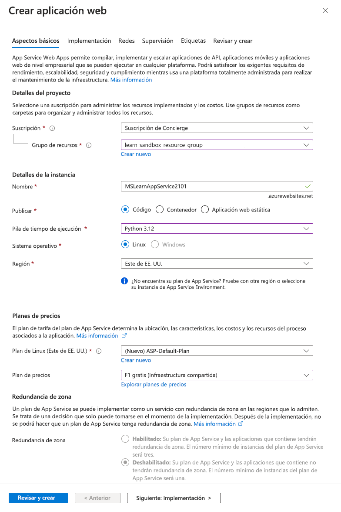
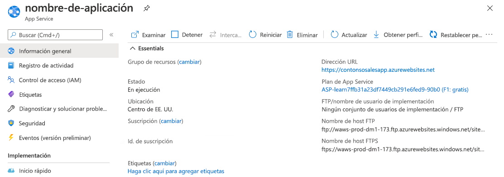
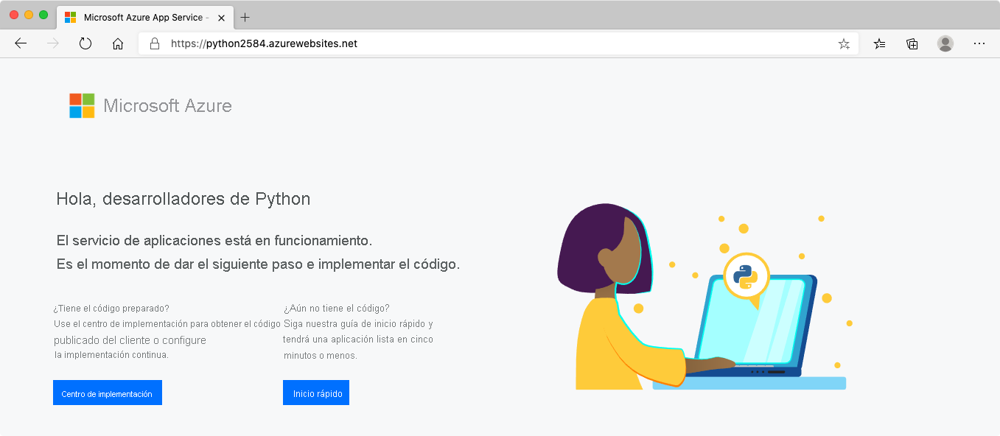

# Creación de una aplicación web en Azure Portal

En esta unidad, usará Azure Portal para crear una aplicación web.
[Creación de una aplicación web en Azure Portal](https://learn.microsoft.com/es-es/training/modules/host-a-web-app-with-azure-app-service/3-exercise-create-a-web-app-in-the-azure-portal?pivots=csharp)

## Creación de una aplicación web

Inicie sesión en [Azure Portal](https://portal.azure.com/) con su cuenta de Azure.

1. En el menú de Azure Portal o en la página de **Inicio**, seleccione **Crear un recurso**. Todo lo que se crea en Azure es un recurso. Aparecerá el panel **Crear un recurso**.
    
    Aquí, puede buscar el recurso que quiere crear o seleccionar uno de los recursos más populares que se crean en Azure Portal.
    
2. En el menú **Crear un recurso**, seleccione **Web**.
    
3. Seleccione **Aplicación web**. Si no lo ve, busque y seleccione **Aplicación web** en el cuadro de búsqueda. Se abrirá el panel **Crear aplicación web**.
    
4. En la pestaña **Aspectos básicos**, escriba los valores siguientes para cada opción.
    
|Configuración|Valor|Detalles|
|---|---|---|
|**Detalles del proyecto**|||
|Suscripción|Seleccione su suscripción a Azure.|La aplicación web que va a crear debe pertenecer a un grupo de recursos. Aquí, seleccionará la suscripción de Azure a la que pertenece el grupo de recursos.|
|Grupo de recursos|Seleccione **Crear nuevo** y escriba un nombre como **myResourceGroup**.|Grupo de recursos al que pertenece la aplicación web. Todos los recursos de Azure deben pertenecer a un grupo de recursos.|
|**Detalles de instancia**|||
|Nombre|_Escriba un nombre._|El nombre de la aplicación web. Este nombre se convierte en parte de la dirección URL de la aplicación:_hash_-._region.azurewebsites.net_.|
|Publicar|Código|El método que quiere usar para publicar la aplicación. Al publicar la aplicación como código, también debe configurar **Pila en tiempo de ejecución** a fin de preparar los recursos de App Service para ejecutar la aplicación.|
|Pila en tiempo de ejecución|Python 3.12|Plataforma en la que quiere que se ejecute la aplicación. Su elección podría afectar si tiene la posibilidad de elegir un sistema operativo: para algunos entornos de ejecución, el App Service solo admite un sistema operativo.|
|Sistema operativo|Linux|Sistema operativo que se usa en los servidores virtuales para ejecutar la aplicación.|
|Región|Este de EE. UU.|Región geográfica desde la que se hospeda la aplicación.|
|**Planes de precios**|||
|Plan de Linux|Acepte el valor predeterminado.|Nombre del plan de App Service que impulsa la aplicación. De manera predeterminada, el asistente crea un nuevo plan en la misma región que la aplicación web.|
|Plan de precios|F1 Gratis|El nivel de precios del plan de servicio que se va a crear. Este plan de precios determina las características de rendimiento de los servidores virtuales que potencian la aplicación y las características a las que tiene acceso. Seleccione **Gratis F1** en la lista desplegable.|


    

5. Deje las demás opciones con los valores predeterminados. Seleccione **Revisar y crear** para ir al panel de revisión y, después, seleccione **Crear**. En el portal se muestra el panel de implementación, donde se puede ver el estado de la implementación.
    
    Nota:
    
    La implementación puede tardar un momento en completarse.
    

## Vista previa de la aplicación web

1. Una vez finalizada la implementación, seleccione **Ir al recurso**. En el portal, se muestra el panel de Información general de App Service de tu aplicación web.
    
    
    
2. Para obtener una vista previa del contenido predeterminado de la aplicación web, seleccione la URL en **Dominio predeterminado** en la parte superior derecha. La página de inicio que se carga indica que tu aplicación web está operativa y lista para recibir la implementación del código de tu aplicación.
    



Deje abierta la pestaña del explorador con la página de marcador de posición de la nueva aplicación. Volverás a eso después de que tu aplicación esté desplegada.

# Preparación del código de la aplicación web

En esta unidad, aprenderá a crear el código para la aplicación web y a integrarlo en un repositorio de control de código fuente.

## Arranque de una aplicación web

Ahora que ha creado los recursos para implementar la aplicación web, tendrá que preparar el código que quiere implementar. Hay muchas maneras de arrancar una nueva aplicación web, por lo que es posible que lo que aprenda aquí sea diferente a lo que conoce. El objetivo es proporcionarle rápidamente un punto de partida para completar un ciclo completo hasta la implementación.

Nota:

Todos los comandos y código que se muestran en esta página solo tienen fines de explicación; **no es necesario ejecutar ninguno de ellos**. Se usan en un ejercicio posterior.

Para crear una aplicación web de inicio con varias líneas de código, puede usar Flask, un marco de trabajo de aplicación web de uso frecuente. Puede instalar Flask mediante el comando siguiente:

Bash

```
pip install flask
```

Después de que Flask esté disponible en el entorno, puede crear una aplicación web mínima mediante este código:

Python

```
from flask import Flask
app = Flask(__name__)

@app.route("/")
def hello():
    return "Hello World!\n"
```

En este código de ejemplo se crea un servidor que responde a todas las solicitudes con un mensaje "Hola mundo".

## Adición del código al control de código fuente

Una vez que el código de la aplicación web está listo, el paso siguiente suele consistir en incluirlo en un repositorio de control de código fuente, como Git. Si tiene Git instalado en el equipo, al ejecutar estos comandos en la carpeta de código fuente se inicializa el repositorio.

Bash

```
git init
git add .
git commit -m "Initial commit"
```

Estos comandos le permitirán inicializar un repositorio de Git local y crear una primera confirmación con el código. Podrá aprovechar de inmediato la ventaja de mantener un historial de los cambios con confirmaciones. Más adelante, también podrá sincronizar el repositorio local con un repositorio remoto, por ejemplo, hospedado en GitHub. Esta sincronización le permite configurar la integración continua y la implementación continua (CI/CD). Aunque se recomienda usar un repositorio de control de código fuente para las aplicaciones de producción, no es necesario para implementar una aplicación en Azure App Service.

> [!NOTE] Nota:
> 
> El uso de CI/CD permite una implementación de código más frecuente de forma confiable, mediante la automatización de las compilaciones, las pruebas y las implementaciones para cada cambio de código. Permite ofrecer nuevas características y correcciones de errores para la aplicación de forma más rápida y eficaz.

## Creación de un proyecto web

Para crear una aplicación web de inicio, usamos el marco aplicación web de Flask.

1. Ejecute los comandos siguientes en Azure Cloud Shell para configurar un entorno virtual e instalar Flask en el perfil:
    
    Bash
    
    ```
    python3 -m venv venv
    source venv/bin/activate
    pip install flask
    ```
    
2. Ejecute estos comandos para crear y cambiar al nuevo directorio de la aplicación web:
    
    Bash
    
    ```
    mkdir ~/BestBikeApp
    cd ~/BestBikeApp
    ```
    
3. Cree un archivo denominado _application.py_ con una respuesta HTML básica:
    
    Bash
    
    ```
    cat >application.py <<EOL
    from flask import Flask
    app = Flask(__name__)
    
    @app.route("/")
    def hello():
        return "<html><body><h1>Hello Best Bike App!</h1></body></html>\n"
    EOL
    ```
    
4. Para implementar la aplicación en Azure, debe guardar la lista de requisitos de la aplicación que ha realizado en un archivo _requirements.txt_. Para ello, ejecute el comando siguiente:
    
    Bash
    
    ```
    pip freeze > requirements.txt
    ```
    

Para probar la aplicación localmente, necesita Python 3 y Flask instalados en el sistema.

## Implementación automatizada

La implementación automatizada, o la integración continua, es un proceso que se usa para insertar nuevas características y correcciones de errores en un patrón repetitivo y rápido con un impacto mínimo en los usuarios finales.

Azure admite la implementación automatizada directamente desde varios orígenes. Están disponibles las opciones siguientes:

- **Azure Repos**: puede insertar el código en Azure Repos, compilar el código en la nube, ejecutar las pruebas, generar una versión del código e insertar el código en una aplicación web de Azure.
- **GitHub**: Azure admite la implementación automatizada directamente desde GitHub. Al conectar el repositorio de GitHub a Azure para la implementación automatizada, los cambios que se insertan en la rama de producción en GitHub se implementan automáticamente.
- **Bitbucket**: debido a sus similitudes con GitHub, puede configurar una implementación automatizada con Bitbucket.

## Implementación manual

Hay algunas opciones que puede usar para insertar el código en Azure de forma manual:

- **Git**: las aplicaciones web de App Service incluyen una dirección URL de Git que puede agregar como repositorio remoto. Al insertar en el repositorio remoto, se implementa la aplicación.
- _**az webapp up**_: `webapp up` es una característica de la `az` interfaz de línea de comandos que empaqueta la aplicación e la implementa. A diferencia de otros métodos de implementación, `az webapp up` puede crear una aplicación web de App por usted si no se ha creado una.
- **Implementar paquetes de aplicación**: puede usar `az webapp deploy` para implementar un archivo ZIP, WAR, EAR o JAR en App Service. También puede implementar scripts y archivos estáticos con el mismo método.
- **Visual Studio: Visual Studio** incluye un asistente para la implementación de App Service que le guía por el proceso de implementación.
- **FTP/S: FTP** o FTPS es una manera tradicional de insertar el código en muchos entornos de hospedaje, incluido App Service.

## Implementación con `az webapp up`

A continuación se implementará la aplicación Python con `az webapp up`. Este comando empaquetará la aplicación y la enviará a la instancia de App Service, donde se compila e implementa.

En primer lugar, es necesario recopilar información sobre el recurso de aplicación web. Ejecute estos comandos para establecer variables de shell que contengan el nombre de la aplicación, el nombre del grupo de recursos, el nombre del plan, la SKU y la ubicación. Usan otros comandos de `az` para solicitar la información de Azure; `az webapp up` necesita estos valores para dirigirse a la aplicación web existente.

Bash

```
export APPNAME=$(az webapp list --query [0].name --output tsv)
export APPRG=$(az webapp list --query [0].resourceGroup --output tsv)
export APPPLAN=$(az appservice plan list --query [0].name --output tsv)
export APPSKU=$(az appservice plan list --query [0].sku.name --output tsv)
export APPLOCATION=$(az appservice plan list --query [0].location --output tsv)
```

Ahora, ejecute `az webapp up` con los valores adecuados. Asegúrese de que está en el directorio `BestBikeApp` antes de ejecutar este comando.

Bash

```
cd ~/BestBikeApp
az webapp up --name $APPNAME --resource-group $APPRG --plan $APPPLAN --sku $APPSKU --location "$APPLOCATION"
```

La implementación tarda unos minutos, periodo durante el que obtendrá la salida de estado. Un código de estado 202 significa que la implementación se ha realizado correctamente.

## Comprobar la implementación

Ahora se examinará la aplicación. En la salida JSON, busque la dirección URL. Seleccione ese vínculo para abrir la aplicación en una nueva pestaña del explorador. La página tardará un momento en cargarse, ya que es la primera vez que App Service inicializa la aplicación.

Una vez que se cargue el programa, obtendrá el mensaje de saludo de la aplicación. Se ha implementado correctamente.