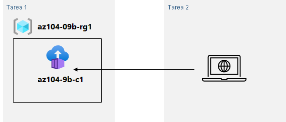
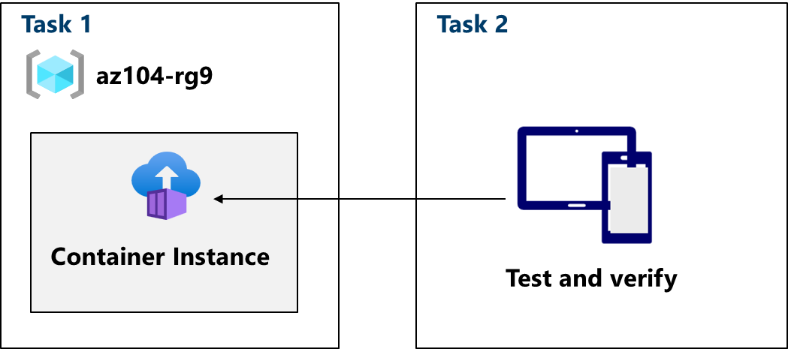
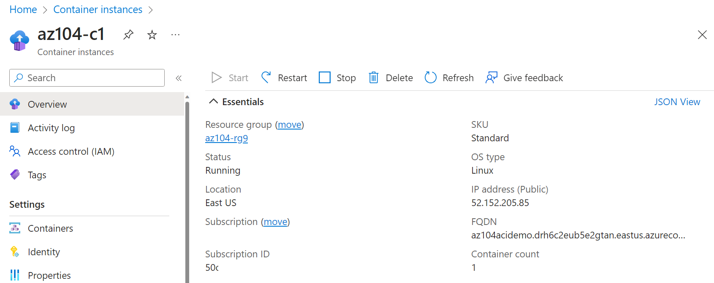

# Lab 09b - Implement Azure Container Instances

## Escenario del laboratorio

Tu organización tiene una aplicación web que se ejecuta en una máquina virtual del centro de datos local. La organización quiere mover todas las aplicaciones a la nube, pero no quiere tener un gran número de servidores para administrar. Decide evaluar Azure Container Instances y Docker.

## Diagrama de la arquitectura

## Aptitudes de trabajo

- Implemente una instancia de Azure Container Instance mediante una imagen de Docker.
- Pruebe y compruebe la implementación de una instancia de Azure Container Instance.

Nota:

Tiempo estimado: 15 minutos. Para completar este ejercicio, necesitará una [suscripción a Azure](https://azure.microsoft.com/pricing/purchase-options/azure-account?cid=msft_learn_012ea830-62e0-e74e-8ef3-fd769454aa12).

Inicie el ejercicio y siga las instrucciones. Cuando termine, asegúrese de volver a esta página para que pueda continuar aprendiendo.

## Lab introduction

In this lab, you learn how to implement and deploy Azure Container Instances.

This lab requires an Azure subscription. Your subscription type may affect the availability of features in this lab. You may change the region, but the steps are written using **East US**.

## Estimated timing: 15 minutes

## Lab scenario

Your organization has a web application that runs on a virtual machine in your on-premises data center. The organization wants to move all applications to the cloud but doesn’t want to have a large number of servers to manage. You decide to evaluate Azure Container Instances and Docker.

## Architecture diagram

## Job skills

- Task 1: Deploy an Azure Container Instance using a Docker image.
- Task 2: Test and verify deployment of an Azure Container Instance.

## Task 1: Deploy an Azure Container Instance using a Docker image

In this task, you will create a simple web application using a Docker image. Docker is a platform that provides the ability to package and run applications in isolated environments called containers. Azure Container Instances provides the compute environment for the container image.

1. Sign in to the **Azure portal** - `https://portal.azure.com`.
    
2. In the Azure portal, search for and select `Container instances` and then, on the **Container instances** blade, click **+ Create**.
    
3. On the **Basics** tab of the **Create container instance** blade, specify the following settings (leave others with their default values):
    
|Setting|Value|
|---|---|
|Subscription|Select your Azure subscription|
|Resource group|`az104-rg9` (If necessary, select **Create new**)|
|Container name|`az104-c1`|
|Region|**East US** (or a region available near you)|
|Image Source|**Quickstart images**|
|Image|**mcr.microsoft.com/azuredocs/aci-helloworld:latest (Linux)**|
    
4. Click **Next: Networking >** and specify the following settings (leave others with their default values):
    
|Setting|Value|
|---|---|
|DNS name label|any valid, globally unique DNS host name|
    

> [!NOTE]
 Your container will be publicly reachable at dns-name-label.region.azurecontainer.io. If you receive a **DNS name label not available** error message, specify a different value.

    
1. Click **Next: Monitoring >** and uncheck **Enable container instance logs**.
    
2. Click **Next: Advanced >**, review the settings without making any changes.
    
3. Click **Review + Create**, ensure that the validation passed and then select **Create**.
    
    > **Note**: Wait for the deployment to complete. This should take 2-3 minutes.
    
    > **Note**: While you wait, you may be interested in viewing the [code behind the sample application](https://github.com/Azure-Samples/aci-helloworld). To view the code, browse the \app folder.
    

## Task 2: Test and verify deployment of an Azure Container Instance

In this task, you review the deployment of the container instance. By default, the Azure Container Instance is accessible over port 80. After the instance has been deployed, you can navigate to the container using the DNS name that you provided in the previous task.

1. When the deployment completes, select **Go to resource** link.
    
2. On the **Overview** blade of the container instance, verify that **Status** is reported as **Running**.
    
3. Copy the value of the container instance **FQDN**, open a new browser tab, and navigate to the corresponding URL.
    
    
    
4. Verify that the **Welcome to Azure Container Instance** page is displayed. Refresh the page several times to create some log entries then close the browser tab.
    
5. In the **Settings** section of the container instance blade, click **Containers**, and then click **Logs**.
    
6. Verify that you see the log entries representing the HTTP GET request generated by displaying the application in the browser.
    

## Cleanup your resources

If you are working with **your own subscription** take a minute to delete the lab resources. This will ensure resources are freed up and cost is minimized. The easiest way to delete the lab resources is to delete the lab resource group.

- In the Azure portal, select the resource group, select **Delete the resource group**, **Enter resource group name**, and then click **Delete**. then click **Delete** again in the confirmation dialog that appears.
- Using Azure PowerShell, `Remove-AzResourceGroup -Name resourceGroupName`.
- Using the CLI, `az group delete --name resourceGroupName`.

## Extend your learning with Copilot

Copilot can assist you in learning how to use the Azure scripting tools. Copilot can also assist in areas not covered in the lab or where you need more information. Open an Edge browser and choose Copilot (top right) or navigate to _copilot.microsoft.com_. Take a few minutes to try these prompts.

- Summarize the steps to create and configure an Azure Container Instance.
- What are the ways I can run a serverless container on Azure?

## Learn more with self-paced training

- [Run container images in Azure Container Instances](https://learn.microsoft.com/training/modules/create-run-container-images-azure-container-instances/). Learn how Azure Container Instances can help you quickly deploy containers, how to set environment variables, and specify container restart policies.

## Key takeaways

Congratulations on completing the lab. Here are the main takeaways for this lab.

- Azure Container Instances (ACI) is a service that enables you to deploy containers on the Microsoft Azure public cloud.
- ACI doesn’t require you to provision or manage any underlying infrastructure.
- ACI supports both Linux containers and Windows containers.
- Workloads on ACI are usually started and stopped by some kind of process or trigger and are usually short-lived.