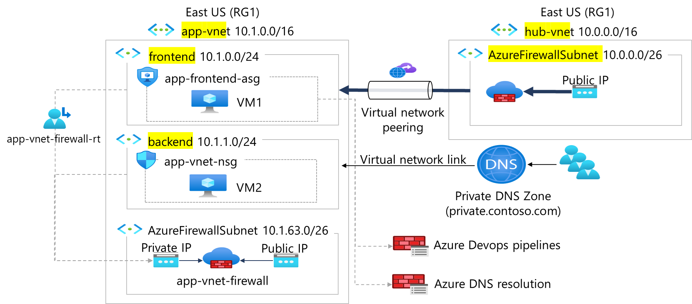

## Scenario

Your organization is migrating a web-based application to Azure. Your first task is to put in place the virtual networks and subnets. You also need to securely peer the virtual networks. You identify these requirements.

- Two virtual networks are required, **app-vnet** and **hub-vnet**. This simulates a hub and spoke network architecture.
- The app-vnet will host the application. This virtual network requires two subnets. The **frontend subnet** will host the web servers. The **backend subnet** will host the database servers.
- The hub-vnet only requires a subnet for the firewall.
- The two virtual networks must be able to communicate with each other securely and privately through **virtual network peering**.
- Both virtual networks should be in the same region.

## Skilling tasks

- Create a virtual network.
- Create a subnet.
- Configure vnet peering.

## Architecture diagram



## Estimated timing: 20 minutes

## Exercise instructions

**Note**: To complete this lab you will need an [Azure subscription](https://azure.microsoft.com/free/) with **Contributor** RBAC role assigned. In this lab, when you are asked to create a resource, for any properties that are not specified, use the default value.

## Create hub and spoke virtual networks and subnets

An [Azure virtual network](https://learn.microsoft.com/azure/virtual-network/virtual-networks-overview) enables many types of Azure resources to securely communicate with each other, the internet, and on-premises networks. All Azure resources in a virtual network are deployed into [subnets](https://learn.microsoft.com/azure/virtual-network/virtual-network-manage-subnet?tabs=azure-portal) within the virtual network.

1. Sign in to the **Azure portal** - `https://portal.azure.com`.
    
2. Search for and select `Virtual Networks`.
    
3. Select **+ Create** and complete the configuration of the **app-vnet**. This virtual network requires two subnets, **frontend** and **backend**.
    
|Property|Value|
|---|---|
|Resource group|**RG1**|
|Virtual network name|`app-vnet`|
|Region|**East US**|
|IPv4 address space|**10.1.0.0/16**|
|Subnet name|`frontend`|
|Subnet address range|**10.1.0.0/24**|
|Subnet name|`backend`|
|Subnet address range|**10.1.1.0/24**|
    

> [!NOTE] Leave all other settings as their defaults. When finished select **“Review + create** and then **Create**.

    
1. Create the **Hub-vnet** virtual network configuration. This virtual network has the firewall subnet.
    
| Property             | Value                   |
| -------------------- | ----------------------- |
| Resource group       | **RG1**                 |
| Name                 | `hub-vnet`              |
| Region               | **East US**             |
| IPv4 address space   | **10.0.0.0/16**         |
| Subnet name          | **AzureFirewallSubnet** |
| Subnet address range | **10.0.0.0/26**         |
    
2. Once the deployments are complete, search for and select your ‘virtual networks`.
    
3. Verify your virtual networks and subnets were deployed.
    

## Configure a peer relationship between the virtual networks

[Virtual network peering](https://learn.microsoft.com/azure/virtual-network/virtual-network-peering-overview) enables you to seamlessly connect two or more Virtual Networks in Azure.

1. Search for and select the `app-vnet` virtual network.
    
2. In the **Settings** blade, select **Peerings**.
    
3. **+ Add** a peering between the two virtual networks.

|Property|Value|
|---|---|
|Remote peering link name|`app-vnet-to-hub`|
|Virtual network|`hub-vnet`|
|Local virtual network peering link name|`hub-to-app-vnet`|

> [!NOTE]
Leave all other settings as their defaults. Select **“Add”** to create the virtual network peering.

    
4. Once the deployment completes, verify the **Peering status** is **Connected**.
    

## Learn more with online training

- [Introduction to Azure Virtual Networks](https://learn.microsoft.com/training/modules/introduction-to-azure-virtual-networks/). In this module, you learn how to design and implement Azure networking services. You learn about virtual networks, public and private IPs, DNS, virtual network peering, routing, and Azure Virtual NAT.

## Key takeaways

Congratulations on completing the exercise. Here are the main takeaways:

- Azure virtual networks (VNets) provide a secure and isolated network environment for your cloud resources. You can create multiple virtual networks per region per subscription.
- When designing virtual networks make sure the VNet address space (CIDR block) doesn’t overlap with your organization’s other network ranges.
- A subnet is a range of IP addresses in the VNet. You can segment VNets into different size subnets, creating as many subnets as you require for organization and security within the subscription limit. Each subnet must have a unique address range.
- Certain Azure services, such as Azure Firewall, require their own subnet.
- Virtual network peering enables you to seamlessly connect two Azure virtual networks. The virtual networks appear as one for connectivity purposes.


### Resumen rápido

Es una **red de Azure con dos VNets conectadas**, con un firewall que controla el tráfico. Usa **máquinas virtuales** (VM1 y VM2), **no contenedores**. El diagrama trata de **redes y seguridad**, no de cómo se ejecuta la aplicación.

### Las piezas, de izquierda a derecha

#### 1. `app-vnet` (10.1.0.0/16): la red de la aplicación

Es la red principal, dividida en tres subredes:

|Subred|Rango|Qué contiene|
|---|---|---|
|**frontend**|10.1.0.0/24|**VM1**, dentro de un grupo de seguridad de aplicación (`app-frontend-asg`)|
|**backend**|10.1.1.0/24|**VM2**, protegida por un NSG (`app-vnet-nsg`)|
|**AzureFirewallSubnet**|10.1.63.0/26|El firewall `app-vnet-firewall`, con IP privada y pública|

El patrón es el clásico: **frontend** (lo que atiende al usuario) y **backend** (lógica y datos), separados en subredes distintas.

#### 2. `hub-vnet` (10.0.0.0/16): la red central

Es una segunda red que contiene solo otro **Azure Firewall** con su IP pública. Es la topología **hub and spoke**: el _hub_ es el centro con los servicios compartidos (firewall) y las _spokes_ (como `app-vnet`) son las redes de cada aplicación.

#### 3. Virtual network peering

La flecha gruesa entre las dos VNets es un **peering**: conecta `hub-vnet` y `app-vnet` por la red interna de Microsoft, de modo que se comunican como si fueran una sola red, sin pasar por Internet.

#### 4. `app-vnet-firewall-rt`: la tabla de rutas

El icono de la izquierda con líneas discontinuas es una **tabla de rutas (UDR)**. Las líneas apuntan a las subredes frontend y backend y fuerzan a que su tráfico **pase por el firewall** (a su IP privada) en lugar de salir directo. Así todo el tráfico se inspecciona.

#### 5. Private DNS Zone (private.contoso.com)

Una **zona DNS privada** que permite resolver nombres internos (por ejemplo `vm2.private.contoso.com`) en vez de recordar IPs. El **Virtual network link** es el enlace que conecta esa zona con `app-vnet`, para que las VMs puedan usarla.

#### 6. Azure DevOps pipelines y Azure DNS resolution

Son reglas del firewall (líneas discontinuas hacia la derecha). Indican que el firewall **permite** el tráfico hacia Azure DevOps (para los pipelines de despliegue) y hacia la resolución DNS de Azure, mientras bloquea el resto.

### Cómo fluye el tráfico

```
Internet → IP pública → Firewall → VM1 (frontend) → VM2 (backend)
                            ▲
        Tabla de rutas: todo el tráfico de las subredes pasa por el firewall
```

### Qué servicios de Azure usa

|Servicio|Para qué|
|---|---|
|**Virtual Machines** (VM1, VM2)|Ejecutar la aplicación|
|**Virtual Network** (2 VNets)|Redes privadas|
|**Azure Firewall** (x2)|Filtrar y inspeccionar el tráfico|
|**Public IP**|Entrada desde Internet al firewall|
|**NSG**|Reglas de tráfico entre subredes|
|**ASG**|Agrupar VMs para aplicar reglas por rol|
|**Route table (UDR)**|Forzar el tráfico por el firewall|
|**VNet peering**|Unir hub y spoke|
|**Private DNS Zone**|Nombres internos|

### ¿VMs o contenedores?

**VMs.** El diagrama muestra dos VMs, y los ASG (que agrupan interfaces de red de VMs) refuerzan eso. No hay AKS, Container Apps ni ACI.

Lo importante es que **esta arquitectura de red no depende del cómputo**. Podrías sustituir VM1 y VM2 por contenedores (por ejemplo AKS en las subredes) y toda la red, el firewall y el DNS seguirían igual. Por eso este tipo de diagrama aparece en cursos de **seguridad y redes de Azure** (como AZ-500 o AZ-104), donde lo que se evalúa es la red, no el tipo de cómputo.

Si quieres, te explico algún concepto con más detalle, como la diferencia entre NSG y ASG, o cómo funciona el hub and spoke.