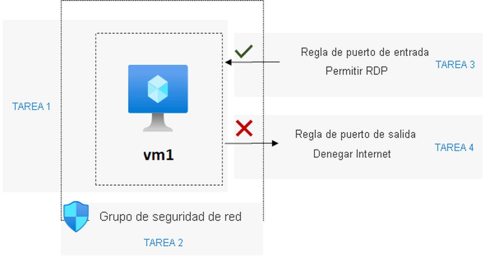
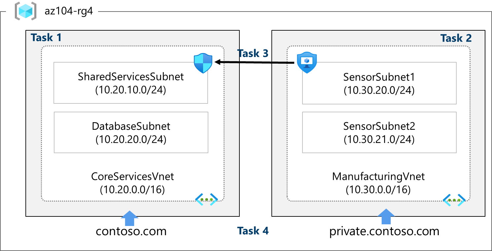

## Escenario del laboratorio

La organización quiere asegurarse de que el acceso a las máquinas virtuales está restringido. Como administrador de Azure, debe hacer lo siguiente:

- Cree y configure de grupos de seguridad de red.
- Asocie grupos de seguridad de red a máquinas virtuales.
- Deniegue y permita el acceso a las máquinas virtuales mediante grupos de seguridad de red.

## Diagrama de arquitectura



## Aptitudes de trabajo

- Cree una red virtual con subredes mediante el portal.
- Cree una red virtual y subredes mediante una plantilla.
- Cree y configure la comunicación entre un grupo de seguridad de aplicaciones y un grupo de seguridad de red.
- Configuración de zonas DNS de Azure públicas y privadas. (opcional).

> [!important] Importante
>
> Tiempo estimado: 50 minutos. Para completar este ejercicio, necesitará una [suscripción a Azure](https://azure.microsoft.com/pricing/purchase-options/azure-account?cid=msft_learn_181aa87c-d624-0fc4-782d-fc9f53c0a729).
>
> Inicie el ejercicio y siga las instrucciones. Cuando termine, asegúrese de volver a esta página para que pueda continuar aprendiendo.

[](https://microsoftlearning.github.io/AZ-104-MicrosoftAzureAdministrator/Instructions/Labs/LAB_04-Implement_Virtual_Networking.html)

# Lab 04 - Implement Virtual Networking.

## Lab introduction

This lab is the first of three labs that focuses on virtual networking. In this lab, you learn the basics of virtual networking and subnetting. You learn how to protect your network with network security groups and application security groups. You also learn about DNS zones and records.

This lab requires an Azure subscription. Your subscription type may affect the availability of features in this lab. You may change the region, but the steps are written using **East US**.

## Estimated time: 50 minutes

## Lab scenario

Your global organization plans to implement virtual networks. The immediate goal is to accommodate all the existing resources. However, the organization is in a growth phase and wants to ensure there is additional capacity for the growth.

The **CoreServicesVnet** virtual network has the largest number of resources. A large amount of growth is anticipated, so a large address space is necessary for this virtual network.

The **ManufacturingVnet** virtual network contains systems for the operations of the manufacturing facilities. The organization is anticipating a large number of internal connected devices for their systems to retrieve data from.

## Architecture diagram



These virtual networks and subnets are structured in a way that accommodates existing resources yet allows for the projected growth. Let’s create these virtual networks and subnets to lay the foundation for our networking infrastructure.

> [!tip] Did you know?
> It is a good practice to avoid overlapping IP address ranges to reduce issues and simplify troubleshooting. Overlapping is a concern across the entire network, whether in the cloud or on-premises. Many organizations design an enterprise-wide IP addressing scheme to avoid overlapping and plan for future growth.

## Job skills

- Task 1: Create a virtual network with subnets using the portal.
- Task 2: Create a virtual network and subnets using a template.
- Task 3: Create and configure communication between an Application Security Group and a Network Security Group.
- Task 4: Configure public and private Azure DNS zones.

## Task 1: Create a virtual network with subnets using the portal

The organization plans a large amount of growth for core services. In this task, you create the virtual network and the associated subnets to accommodate the existing resources and planned growth. In this task, you will use the Azure portal.

1. Sign in to the **Azure portal** - `https://portal.azure.com`.
    
2. Search for and select `Virtual Networks`.
    
3. Select **Create** on the Virtual networks page.
    
4. Complete the **Basics** tab for the CoreServicesVnet.
    
    |**Option**|**Value**|
    |---|---|
    |Resource Group|`az104-rg4` (if necessary, create new)|
    |Name|`CoreServicesVnet`|
    |Region|(US) **East US**|
    
    > [!note]
    > If deployment fails due to capacity or quota limits, adjust the configuration or choose a different region.
    
5. Move to the **Address space** tab.
    
    |**Option**|**Value**|
    |---|---|
    |IPv4 address space|Replace the prepopulated IPv4 address space with `10.20.0.0/16` (separate the entries)|
    
6. Select **+ Add a subnet**. Complete the name and address information for each subnet. Be sure to select **Add** for each new subnet.
    
    > [!warning]
    > Be sure to delete the default subnet - either before or after creating the other subnets.
    
    |**Subnet**|**Option**|**Value**|
    |---|---|---|
    |SharedServicesSubnet|Name|`SharedServicesSubnet`|
    ||Starting address|`10.20.10.0`|
    ||Size|`/24`|
    |DatabaseSubnet|Name|`DatabaseSubnet`|
    ||Starting address|`10.20.20.0`|
    ||Size|`/24`|
    
    > [!note]
    > Every virtual network must have at least one subnet. Reminder that five IP addresses will always be reserved, so consider that in your planning.
    
7. To finish creating the CoreServicesVnet and its associated subnets, select **Review + create**.
    
8. Verify your configuration passed validation, and then select **Create**.
    
9. Wait for the virtual network to deploy and then select **Go to resource**.
    
10. Take a minute to verify the **Address space** and the **Subnets**. Notice your other choices in the **Settings** blade.
    
11. In the **Automation** section, select **Export template**, and then wait for the template to be generated.
    
12. Select the **Template** tab and **Download** the template. Then, switch to the **Parameters** tab, and repeat the **Download** operation.
    
13. Navigate on the local machine to the **Downloads** folder.
    
14. Before proceeding, ensure you have the **template.json** file. You will use this template to create the ManufacturingVnet in the next task.
    

## Task 2: Create a virtual network and subnets using a template

In this task, you create the ManufacturingVnet virtual network and associated subnets. The organization anticipates growth for the manufacturing offices so the subnets are sized for the expected growth. For this task, you use a template to create the resources.

1. Locate the **template.json** file exported in the previous task. It should be in your **Downloads** folder.
    
2. Edit the file using the editor of your choice. Many editors have a _change all occurrences_ feature. If you are using Visual Studio Code be sure you are working in a **trusted window** and not in the **restricted mode**. Consult the architecture diagram to verify the details.
    

### Make changes for the ManufacturingVnet virtual network

1. Replace all occurrences of **CoreServicesVnet** with `ManufacturingVnet`.
    
2. Replace all occurrences of **10.20.0.0** with `10.30.0.0`.
    

### Make changes for the ManufacturingVnet subnets

1. Change all occurrences of **SharedServicesSubnet** to `SensorSubnet1`.
    
2. Change all occurrences of **10.20.10.0/24** to `10.30.20.0/24`.
    
3. Change all occurrences of **DatabaseSubnet** to `SensorSubnet2`.
    
4. Change all occurrences of **10.20.20.0/24** to `10.30.21.0/24`.
    
5. Read back through the file and ensure everything looks correct. Use the architecture diagram for resource names and IP addresses.
    
6. Be sure to **Save** your changes.
    

> [!note]
> There are completed template files in the lab files directory.

### Make changes to the parameters file

1. Locate the **parameters.json** file exported in the previous task. It should be in your **Downloads** folder.
    
2. Edit the file using the editor of your choice.
    
3. Replace the one occurrence of **CoreServicesVnet** with `ManufacturingVnet`.
    
4. **Save** your changes.
    

### Deploy the custom template

1. In the portal, search for and select `Deploy a custom template`.
    
2. Select **Build your own template in the editor** and then **Load file**.
    
3. Select the **template.json** file with your Manufacturing changes, then select **Save**.
    
4. Select **Edit parameters**, and then **Load file**.
    
5. Select the **parameters.json** file with your Manufacturing changes, then select **Save**.
    
6. Ensure your resource group, **az104-rg4** is selected.
    
7. Select **Review + create** and then **Create**.
    
8. Wait for the template to deploy, then confirm (in the portal) the Manufacturing virtual network and subnets were created.
    

> [!warning]
> If you have to deploy more than one time you may find some resources were successfully completed and the deployment is failing. You can manually remove those resources and try again.

## Task 3: Create and configure communication between an Application Security Group and a Network Security Group

In this task, we create an Application Security Group and a Network Security Group. The NSG will have an inbound security rule that allows traffic from the ASG. The NSG will also have an outbound rule that denies access to the internet.

### Create the Application Security Group (ASG)

1. In the Azure portal, search for and select `Application security groups`.
    
2. Click **Create** and provide the basic information.
    
    |Setting|Value|
    |---|---|
    |Subscription|_your subscription_|
    |Resource group|**az104-rg4**|
    |Name|`asg-web`|
    |Region|**East US**|
    
3. Click **Review + create** and then after the validation click **Create**.
    

> [!note]
> At this point, you would associate the ASG with virtual machine(s). These machines will be affected by the inbound NSG rule you create in the next task.

### Create the Network Security Group and associate it with CoreServicesVnet

1. In the Azure portal, search for and select `Network security groups`.

> [!note]
> You can also locate this resource using the Azure portal menu (icon top left). Select **Create a resource** and then in the **Networking** blade, select **Network security group**.

2. Select **+ Create** and provide information on the **Basics** tab.
    
    |Setting|Value|
    |---|---|
    |Subscription|_your subscription_|
    |Resource group|**az104-rg4**|
    |Name|`myNSGSecure`|
    |Region|**East US**|
    
3. Click **Review + create** and then after the validation click **Create**.
    
4. After the NSG is deployed, click **Go to resource**.
    
5. Under **Settings** click **Subnets** and then **Associate**.
    
    |Setting|Value|
    |---|---|
    |Virtual network|**CoreServicesVnet (az104-rg4)**|
    |Subnet|**SharedServicesSubnet**|
    
6. Click **OK** to save the association.
    

### Configure an inbound security rule to allow ASG traffic

1. Continue working with your NSG. In the **Settings** area, select **Inbound security rules**.
    
2. Review the default inbound rules. Notice that only other virtual networks and load balancers are allowed access.
    
3. Select **+ Add**.
    
4. On the **Add inbound security rule** blade, use the following information to add an inbound port rule. This rule allows ASG traffic. When you are finished, select **Add**.
    
    |Setting|Value|
    |---|---|
    |Source|**Application security group**|
    |Source application security groups|**asg-web**|
    |Source port ranges|*|
    |Destination|**Any**|
    |Service|**Custom** (notice your other choices)|
    |Destination port ranges|**80,443**|
    |Protocol|**TCP**|
    |Action|**Allow**|
    |Priority|**100**|
    |Name|`AllowASG`|
    

### Configure an outbound NSG rule that denies Internet access

1. After creating your inbound NSG rule, select **Outbound security rules**.
    
2. Notice the **AllowInternetOutBound** rule. Also notice the rule cannot be deleted and the priority is 65001.
    
3. Select **+ Add** and then configure an outbound rule that denies access to the internet. When you are finished, select **Add**.
    
    |Setting|Value|
    |---|---|
    |Source|**Any**|
    |Source port ranges|*|
    |Destination|**Service tag**|
    |Destination service tag|**Internet**|
    |Service|**Custom**|
    |Destination port ranges|`*`|
    |Protocol|**Any**|
    |Action|**Deny**|
    |Priority|**4096**|
    |Name|`DenyInternetOutbound`|
    

## Task 4: Configure public and private Azure DNS zones

In this task, you will create and configure public and private DNS zones.

### Configure a public DNS zone

You can configure Azure DNS to resolve host names in your public domain. For example, if you purchased the contoso.xyz domain name from a domain name registrar, you can configure Azure DNS to host the `contoso.com` domain and resolve www.contoso.xyz to the IP address of your web server or web app.

1. In the portal, search for and select `DNS zones`.
    
2. Select **+ Create**.
    
3. Configure the **Basics** tab.
    
    |Property|Value|
    |---|---|
    |Subscription|**Select your subscription**|
    |Resource group|**az104-rg4**|
    |Name|`contoso.com` (this name must be unique, contoso.com is reserved so change to something else.)|
    |Region|**East US** (review the informational icon)|
    
4. Select **Review + create** and then **Create**.
    
5. Wait for the DNS zone to deploy and then select **Go to resource**.
    
6. On the **Overview** blade notice the names of the four Azure DNS name servers assigned to the zone. **Copy** one of the name server addresses. You will need it in a future step for the nslookup command below.
    
7. Expand the **DNS Management** blade and select **Recordsets**. Click **+Add**.
    
    |Property|Value|
    |---|---|
    |Name|**www**|
    |Type|**A**|
    |Alias record set|**No**|
    |TTL|**1**|
    |IP address|**10.1.1.4**|
    

> [!note]
> In a real-world scenario, you’d enter the public IP address of your web server.

8. Select **Add** and verify your domain has an A record set named **www**.
    
9. Open a command prompt, and run the following command. If you have changed the domain name, make an adjustment.

    ```sh
    nslookup www.contosoxyz104.com <name server name you copied in step 6 above>
    ```
    
10. Verify the host name www.contosoxyz104.com resolves to the IP address you provided. This confirms name resolution is working correctly.
    

### Configure a private DNS zone

A private DNS zone provides name resolution services within virtual networks. A private DNS zone is only accessible from the virtual networks that it is linked to and can’t be accessed from the internet.

1. In the portal, search for and select `Private dns zones`.
    
2. Select **+ Create**.
    
3. On the **Basics** tab of Create private DNS zone, enter the information as listed in the table below:
    
    |Property|Value|
    |---|---|
    |Subscription|**Select your subscription**|
    |Resource group|**az104-rg4**|
    |Name|`private.contoso.com` (adjust if you had to rename)|
    |Region|**East US**|
    
4. Select **Review + create** and then **Create**.
    
5. Wait for the DNS zone to deploy and then select **Go to resource**.
    
6. Notice on the **Overview** blade there are no name server records.
    
7. Expand the **DNS Management** blade and then select **Virtual network links**. Configure the link.
    
    |Property|Value|
    |---|---|
    |Link name|`manufacturing-link`|
    |Virtual network|`ManufacturingVnet`|
    
8. Select **Create** and wait for the link to create.
    
9. From the **DNS Management** blade select **+ Recordsets**. You would now add a record for each virtual machine that needs private name-resolution support.
    
    |Property|Value|
    |---|---|
    |Name|**sensorvm**|
    |Type|**A**|
    |TTL|**1**|
    |IP address|**10.1.1.4**|
    

> [!note]
> In a real-world scenario, you’d enter the IP address for a specific manufacturing virtual machine.

## Cleanup your resources

If you are working with **your own subscription** take a minute to delete the lab resources. This will ensure resources are freed up and cost is minimized. The easiest way to delete the lab resources is to delete the lab resource group.

- In the Azure portal, select the resource group, select **Delete the resource group**, **Enter resource group name**, and then click **Delete**.
- Using Azure PowerShell, `Remove-AzResourceGroup -Name resourceGroupName`.
- Using the CLI, `az group delete --name resourceGroupName`.

## Extend your learning with Copilot

Copilot can assist you in learning how to use the Azure scripting tools. Copilot can also assist in areas not covered in the lab or where you need more information. Open an Edge browser and choose Copilot (top right) or navigate to _copilot.microsoft.com_. Take a few minutes to try these prompts.

- Share the top 10 best practices when deploying and configuring a virtual network in Azure.
- How do I use Azure PowerShell and Azure CLI commands to create a virtual network with a public IP address and one subnet.
- Explain Azure Network Security Group inbound and outbound rules and how they are used.
- What is the difference between Azure Network Security Groups and Azure Application Security Groups? Share examples of when to use each of these groups.
- Give a step-by-step guide on how to troubleshoot any network issues we face when deploying a network on Azure. Also share the thought process used for every step of the troubleshooting.

## Learn more with self-paced training

- [Introduction to Azure Virtual Networks](https://learn.microsoft.com/training/modules/introduction-to-azure-virtual-networks/). Design and implement core Azure Networking infrastructure such as virtual networks, public and private IPs, DNS, virtual network peering, routing, and Azure Virtual NAT.
- [Secure and isolate access to Azure resources by using network security groups and service endpoints](https://learn.microsoft.com/training/modules/secure-and-isolate-with-nsg-and-service-endpoints/). Network security groups and service endpoints help you secure your virtual machines and Azure services from unauthorized network access.
- [Host your domain on Azure DNS](https://learn.microsoft.com/training/modules/host-domain-azure-dns/). Create a DNS zone for your domain name. Create DNS records to map the domain to an IP address. Test that the domain name resolves to your web server.

## Key takeaways

Congratulations on completing the lab. Here are the main takeaways for this lab.

- A virtual network is a representation of your own network in the cloud.
- When designing virtual networks it is a good practice to avoid overlapping IP address ranges. This will reduce issues and simplify troubleshooting.
- A subnet is a range of IP addresses in the virtual network. You can divide a virtual network into multiple subnets for organization and security.
- A network security group contains security rules that allow or deny network traffic. There are default incoming and outgoing rules which you can customize to your needs.
- Application security groups are used to protect groups of servers with a common function, such as web servers or database servers.
- Azure DNS is a hosting service for DNS domains that provides name resolution. You can configure Azure DNS to resolve host names in your public domain. You can also use private DNS zones to assign DNS names to virtual machines (VMs) in your Azure virtual networks.

---

> [!abstract] Resumen en una frase
> Creas **dos redes virtuales** (una por portal, otra por plantilla), proteges tráfico con **NSG + ASG** y configuras **DNS público y privado**.

---

## 📖 Glosario de siglas

|Sigla|Significado|Qué es|
|---|---|---|
|**VNet**|Virtual Network|Tu red privada en la nube de Azure|
|**RG**|Resource Group|Contenedor lógico donde agrupas recursos|
|**CIDR**|Classless Inter-Domain Routing|Notación de rangos IP: `10.20.0.0/16`|
|**NSG**|Network Security Group|Conjunto de reglas que permiten o deniegan tráfico|
|**ASG**|Application Security Group|Agrupa VMs por función (p. ej. servidores web) para usarlas en reglas NSG|
|**VM**|Virtual Machine|Máquina virtual|
|**DNS**|Domain Name System|Traduce nombres (`www.x.com`) a IPs|
|**TTL**|Time To Live|Segundos que se cachea un registro DNS|
|**ARM**|Azure Resource Manager|Motor de despliegue; las plantillas `template.json` son ARM|
|**TCP**|Transmission Control Protocol|Protocolo de transporte orientado a conexión|
|**HTTP / HTTPS**|HyperText Transfer Protocol (Secure)|Puertos 80 / 443|
|**IP**|Internet Protocol|Dirección de red|
|**A (registro)**|Address record|Registro DNS que asocia un nombre con una IPv4|

---

## 🎯 Escenario

|Red|Necesidad|Decisión de diseño|
|---|---|---|
|**CoreServicesVnet**|Mayor número de recursos y mucho crecimiento previsto|Espacio de direcciones **grande** (`/16`)|
|**ManufacturingVnet**|Muchos dispositivos IoT (sensores) conectados|Subredes **dimensionadas para crecer**|

> [!tip] Buena práctica
> **Evita solapar rangos IP**, ni en la nube ni en local. Muchas empresas definen un esquema IP global para evitar conflictos.

---

## 🗺️ Arquitectura final

|VNet|Espacio de direcciones|Subred|Rango|
|---|---|---|---|
|**CoreServicesVnet**|`10.20.0.0/16`|SharedServicesSubnet|`10.20.10.0/24`|
|||DatabaseSubnet|`10.20.20.0/24`|
|**ManufacturingVnet**|`10.30.0.0/16`|SensorSubnet1|`10.30.20.0/24`|
|||SensorSubnet2|`10.30.21.0/24`|

> [!info] Datos clave
> 
> - Toda VNet necesita **al menos una subred**.
> - Azure **reserva 5 IPs por subred** → una `/24` da 251 utilizables.
> - Todo va en el grupo de recursos **`az104-rg4`**, región **East US**.

---

## 🛠️ Task 1 — Crear VNet con el portal

**Objetivo:** crear `CoreServicesVnet` con sus subredes.

|Paso|Acción|Valor|
|---|---|---|
|1|Portal → _Virtual Networks_ → **Create**|—|
|2|Pestaña **Basics**|RG `az104-rg4`, nombre `CoreServicesVnet`, región East US|
|3|Pestaña **Address space**|Sustituir por `10.20.0.0/16`|
|4|**+ Add a subnet** (x2)|`SharedServicesSubnet` y `DatabaseSubnet` (ver tabla anterior)|
|5|**Eliminar la subred `default`**|Antes o después de crear las otras|
|6|**Review + create** → **Create**|—|
|7|_Automation_ → **Export template**|Descargar `template.json` **y** `parameters.json`|

> [!warning] Importante
> Guarda `template.json`: lo reutilizas en la Task 2.

---

## 📄 Task 2 — Crear VNet con una plantilla

**Objetivo:** clonar la VNet anterior cambiando nombres y rangos con **buscar y reemplazar**.

### Cambios en `template.json`

|Buscar|Reemplazar por|
|---|---|
|`CoreServicesVnet`|`ManufacturingVnet`|
|`10.20.0.0`|`10.30.0.0`|
|`SharedServicesSubnet`|`SensorSubnet1`|
|`10.20.10.0/24`|`10.30.20.0/24`|
|`DatabaseSubnet`|`SensorSubnet2`|
|`10.20.20.0/24`|`10.30.21.0/24`|

### Cambios en `parameters.json`

|Buscar|Reemplazar por|
|---|---|
|`CoreServicesVnet` (1 sola aparición)|`ManufacturingVnet`|

### Desplegar

1. Portal → **Deploy a custom template**.
2. **Build your own template in the editor** → _Load file_ → `template.json` → **Save**.
3. **Edit parameters** → _Load file_ → `parameters.json` → **Save**.
4. Elegir RG `az104-rg4` → **Review + create** → **Create**.

> [!tip] Concepto: IaC
> Esto es **Infrastructure as Code (IaC)**: la infraestructura se define en un archivo reutilizable y repetible, en vez de hacer clics.

---

## 🔒 Task 3 — ASG + NSG

**Objetivo:** controlar qué tráfico entra y sale de una subred.

```
        asg-web (VMs web)
              │  permitido 80/443
              ▼
   ┌─────────────────────────┐
   │  myNSGSecure (NSG)      │ ──► asociado a SharedServicesSubnet
   └─────────────────────────┘
              │  Deny
              ▼
          Internet ✖
```

### 3.1 Crear el ASG

|Campo|Valor|
|---|---|
|Nombre|`asg-web`|
|RG / Región|`az104-rg4` / East US|

> [!note]
> Después se asociaría a las VMs que reciban la regla.

### 3.2 Crear el NSG y asociarlo

|Campo|Valor|
|---|---|
|Nombre|`myNSGSecure`|
|RG / Región|`az104-rg4` / East US|
|Asociar a (Settings → Subnets)|VNet `CoreServicesVnet` → subred `SharedServicesSubnet`|

### 3.3 Regla de **entrada**: permitir tráfico del ASG

|Ajuste|Valor|
|---|---|
|Name|`AllowASG`|
|Source|Application security group → `asg-web`|
|Source port ranges|`*` (cualquiera)|
|Destination|Any|
|Destination port ranges|`80,443`|
|Protocol|TCP|
|Action|**Allow**|
|Priority|`100`|

### 3.4 Regla de **salida**: denegar Internet

|Ajuste|Valor|
|---|---|
|Name|`DenyInternetOutbound`|
|Source|Any|
|Destination|Service tag → `Internet`|
|Destination port ranges|`*`|
|Protocol|Any|
|Action|**Deny**|
|Priority|`4096`|

> [!info] Cómo se evalúan las reglas
> 
> - **Número de prioridad más bajo = se evalúa primero** (100 antes que 4096).
> - La regla por defecto `AllowInternetOutBound` tiene prioridad **65001** y **no se puede borrar**; tu regla de prioridad 4096 la **supera** y bloquea Internet.
> - Las reglas de entrada por defecto solo permiten tráfico de otras VNets y de balanceadores de carga.
> - **Service tag**: etiqueta que representa un grupo de IPs gestionado por Azure (p. ej. `Internet`).

---

## 🌍 Task 4 — Zonas DNS

### 4.1 Zona DNS **pública**

Sirve para resolver nombres de tu dominio desde **Internet**.

|Campo|Valor|
|---|---|
|Nombre|`contoso.com` (debe ser único; el lab sugiere cambiarlo, p. ej. `contosoxyz104.com`)|
|RG / Región|`az104-rg4` / East US|

**Registro A:**

|Propiedad|Valor|
|---|---|
|Name|`www`|
|Type|`A`|
|Alias record set|No|
|TTL|`1`|
|IP address|`10.1.1.4` _(en la vida real, la IP pública del servidor)_|

**Verificación:**

```sh
nslookup www.contosoxyz104.com <servidor-de-nombres-copiado>
```

> [!tip] Name servers
> Azure asigna **4 servidores de nombres** a la zona. Copia uno de la pestaña _Overview_ para usarlo en `nslookup`.

### 4.2 Zona DNS **privada**

Resuelve nombres **solo dentro de las VNets enlazadas**; no es accesible desde Internet.

|Campo|Valor|
|---|---|
|Nombre|`private.contoso.com`|
|RG / Región|`az104-rg4` / East US|

**Virtual network link** (vincula la zona con una VNet):

|Propiedad|Valor|
|---|---|
|Link name|`manufacturing-link`|
|Virtual network|`ManufacturingVnet`|

**Registro A:**

|Propiedad|Valor|
|---|---|
|Name|`sensorvm`|
|Type|`A`|
|TTL|`1`|
|IP address|`10.1.1.4` _(en la vida real, la IP de la VM)_|

> [!info] Diferencias entre pública y privada
>
> |Aspecto|DNS **pública**|DNS **privada**|
> |---|---|---|
> |Accesible desde|Internet|Solo VNets enlazadas|
> |Name servers|Sí (4)|No tiene|
> |Necesita _virtual network link_|No|**Sí**|
> |Uso típico|Web pública (`www`)|Nombres internos de VMs|

---

## 🧹 Limpieza

Borra el grupo de recursos para evitar costes:

```bash
az group delete --name az104-rg4
```

```powershell
Remove-AzResourceGroup -Name az104-rg4
```

---

## ✅ Ideas clave para el examen

|#|Concepto|Recuerda|
|---|---|---|
|1|**VNet**|Tu red privada en Azure|
|2|**Solapamiento IP**|Evitarlo siempre; impide peering y VPN|
|3|**Subred**|Rango dentro de la VNet; Azure reserva **5 IPs**|
|4|**NSG**|Reglas allow/deny; menor prioridad numérica = primero|
|5|**ASG**|Agrupa VMs por función para usarlas como origen/destino en un NSG|
|6|**Plantilla ARM**|Se exporta, se edita y se redespliega (IaC)|
|7|**DNS público**|Resuelve dominios desde Internet, con name servers|
|8|**DNS privado**|Solo dentro de VNets enlazadas (_virtual network link_)|

---

## 🔗 Relacionado

- [Lab: Create and configure networking (hub-spoke + peering)](Create%20and%20configure%20network..md)
- [Redes virtuales de Azure](../../../knowledge/az104-virtual-networks.md)
- [Grupos de seguridad de red (NSG y ASG)](../../../knowledge/az104-network-security-groups.md)
- [Azure DNS](../../../knowledge/az104-azure-dns.md)
- [VNet Peering](../../../knowledge/az104-vnet-peering.md)
- [Contenedores vs VMs](../../../concepts/containers-vs-vms.md)