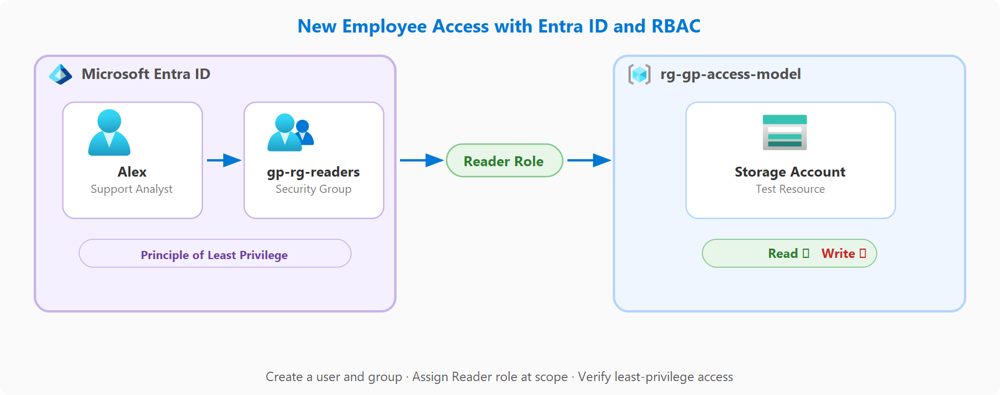

# Proyecto guiado: Configurar el nuevo acceso de los empleados (Id. de Entra y RBAC).

[Link](https://learn.microsoft.com/en-us/training/modules/guided-project-new-employee-access/)

>[!NOTE]
> Microsoft Entra ID es el servicio de identidad que administra usuarios y grupos en Azure. RBAC le permite asignar permisos específicos en un ámbito específico, por lo que los usuarios obtienen exactamente el acceso que necesitan y nada más. Juntos, implementan el principio de privilegios mínimos.

# Ejercicio: Creación de usuarios y grupos.

## Tarea 1: Preparar el entorno

1. Inicie sesión en [Azure Portal](https://portal.azure.com/) con una cuenta que pueda administrar usuarios y asignaciones de roles.
2. En la barra de búsqueda del portal, busque **Grupos de** recursos y seleccione **Grupos de recursos**.
3. Seleccione **+ Create**. Asigne al grupo de recursos **el nombrerg-gp-access-model**, elija su región preferida y seleccione **Revisar y crear y,** después, **Crear**.

## Tarea 2: Creación de una cuenta de almacenamiento de prueba

Cree una cuenta de almacenamiento dentro del grupo de recursos. Este recurso proporciona un ámbito para las asignaciones de roles de RBAC.

1. En la barra de búsqueda del portal, busque **Cuentas de almacenamiento** y seleccione **Cuentas de almacenamiento**.
2. Seleccione **+ Create**.
3. En la pestaña Aspectos básicos, seleccione **rg-gp-access-model** como grupo de recursos.
4. En **Nombre de la cuenta de almacenamiento**, escriba un nombre único global (por ejemplo, **stgpaccessmodel** seguido de las iniciales y un número).
5. En **Región**, use la misma región que el grupo de recursos.
6. En **Tipo de almacenamiento preferido**, seleccione **Azure Blob Storage o Azure Data Lake Storage Gen 2**.
7. En **Rendimiento**, seleccione **Estándar**.
8. En **Redundancia**, seleccione **Almacenamiento con redundancia local (LRS)**.
9. Seleccione **Revisar y crear** y, luego, **Crear**.
10. Cuando finalice la implementación, seleccione **Ir al recurso**.

## Tarea 3: Crear el grupo de seguridad

Configure un grupo de seguridad que actúe como contenedor para el nuevo usuario. El uso de grupos hace que la administración de permisos sea escalable: asigna permisos una vez a un grupo y, a continuación, agrega o quita usuarios según sea necesario.

1. En la barra de búsqueda del portal, busque **Id. de Microsoft Entra** y seleccione **Id. de Microsoft Entra**.
2. En el menú de la izquierda, en **Administrar**, seleccione **Grupos**.
3. Seleccione **Nuevo grupo**.
4. Para **Tipo de grupo**, seleccione **Seguridad**.
5. En **Nombre del grupo**, escriba **gp-rg-reader**.
6. En **Descripción del grupo**, escriba **Lectores para el grupo de recursos del proyecto guiado**.
7. Selecciona **Crear**.
## Tarea 4: Crear la cuenta de usuario

Cree una nueva identidad en Entra ID para el miembro del equipo. Esta cuenta de usuario se agregará al grupo de seguridad, heredando todos los permisos asignados a ese grupo.

1. En la barra de búsqueda del portal, busque **Id. de Microsoft Entra** y seleccione **Id. de Microsoft Entra**.
2. En el menú de la izquierda, en **Administrar**, seleccione **Usuarios**.
3. Seleccione **Nuevo usuario** y, a continuación, seleccione **Crear nuevo usuario**.
4. En **Nombre principal de usuario**, escriba un nombre único (por ejemplo, **alexgp**). Este es el nombre de inicio de sesión que el usuario usaría para acceder a Azure (combinado con el dominio del inquilino, se convierte en algo parecido a **alexgp@yourtenant.onmicrosoft.com**). Registre este valor: lo necesitará para su validación posterior.
5. En **Nombre para mostrar**, escriba **Proyecto guiado de Alex**.
6. Seleccione **Revisar y crear** y, luego, **Crear**.
7. Es posible que la lista Usuarios no se actualice automáticamente. Seleccione **Actualizar** para confirmar que el nuevo usuario aparece en la lista.
## Tarea 5: Agregar el usuario al grupo

Complete la pertenencia al grupo agregando el nuevo usuario. Esto establece la conexión entre el usuario y el grupo, por lo que el usuario hereda ahora todos los permisos de RBAC asignados al grupo.

1. En la lista Usuarios, active la casilla situada a la izquierda del **proyecto guiado de Alex**.
2. En el menú horizontal de la parte superior, seleccione **Editar**.
3. Seleccione **Agregar al grupo**.
4. Busque y seleccione **gp-rg-readers**, luego seleccione **Seleccionar**.

# Ejercicio: Asignación de roles RBAC en el ámbito.

## Tarea 1: Asignar el rol de Lector al grupo

Asigne el rol de lector a su grupo de seguridad en el ámbito del grupo de recursos. Esto concede a todos los miembros del grupo permiso para ver los recursos, pero no crearlos, modificarlos o eliminarlos, lo que implementa el principio de privilegios mínimos.

1. En la barra de búsqueda del portal, busque **Grupos de** recursos y seleccione **Grupos de recursos**.
2. Seleccione **rg-gp-access-model** en la lista.
3. En el menú izquierdo, seleccione **Control de acceso (IAM)** .
4. Seleccione **+ Agregar** y, luego, **Agregar asignación de roles**.
5. En la pestaña **Rol** , busque **Lector** en el cuadro de búsqueda.
6. Seleccione **Lector** en los resultados y, a continuación, seleccione **Siguiente**.
7. En la pestaña **Miembros** , en **Asignar acceso a**, confirme que está seleccionado **Usuario, grupo o entidad de servicio** .
8. Seleccione **+ Seleccionar miembros**.
9. En el cuadro de búsqueda, busque **gp-rg-readers** y selecciónelo en los resultados.
10. Seleccione **Seleccionar** para confirmar la selección de miembros.
11. Seleccione **Revisar y asignar**.
12. En la página de revisión, confirme que el rol es **Lector**, el ámbito es **rg-gp-access-model** y el miembro es **gp-rg-reader**.
13. Seleccione **Revisar y asignar** de nuevo para completar la asignación.

# Ejercicio: Comprobación del modelo con privilegios mínimos.

## Tarea 1: Comprobación del acceso con IAM

Use la característica Comprobar acceso para obtener una vista previa de los permisos que tiene el nuevo usuario en el ámbito del grupo de recursos. Esta herramienta de validación eficaz muestra exactamente qué acciones se permiten y deniegan.

1. En la barra de búsqueda del portal, busque **Grupos de** recursos y seleccione **Grupos de recursos**.
2. Seleccione **rg-gp-access-model** en la lista.
3. En el menú izquierdo, seleccione **Control de acceso (IAM)** .
4. Seleccione **Verificar acceso**.
5. Busque y seleccione **Proyecto guiado de Alex** (la cuenta de usuario que creó anteriormente).
6. Confirme que los resultados muestran una asignación de rol **lector** heredada a través del grupo **gp-rg-readers**.
## Tarea 2: Revisión de la asignación de roles en el registro de actividad

Compruebe el registro de actividad para ver la pista de auditoría de la asignación de roles que ha creado. Cada cambio de RBAC en Azure se registra, lo que es fundamental para la auditoría de seguridad y el cumplimiento.

1. En la barra de búsqueda del portal, busque **Grupos de** recursos y seleccione **Grupos de recursos**.
2. Seleccione **rg-gp-access-model** en la lista.
3. En el menú de la izquierda, seleccione **Registro de actividad**.
4. Busque una entrada con **nombre de operación** de **crear asignación de rol**.
5. Seleccione la entrada para ver los detalles, incluido quién realizó el cambio, cuándo se produjo y qué rol se asignó.
6. Anote el campo **Evento iniciado por** , que muestra su cuenta como la persona que creó la asignación.
## Tarea 3: Habilitar el pase de acceso temporal

Habilite el Pase de acceso temporal (TAP) como método de autenticación para el inquilino. TAP es un código de acceso limitado por tiempo que satisface los requisitos de MFA, por lo que la cuenta de prueba puede iniciar sesión sin configurar una aplicación de teléfono o autenticador.

1. En la barra de búsqueda del portal, busque **Métodos de autenticación** y seleccione **Métodos de autenticación** (en Microsoft Entra ID).
2. Seleccione **Directivas**.
3. Seleccione **Pase de acceso temporal**.
4. Establezca **Habilitar** en **Sí**.
5. En **Destino**, seleccione **Todos los usuarios** o seleccione **Agregar grupos** y agregue **gp-rg-readers**.
6. Haga clic en **Guardar**.

## Tarea 4: Generar un pase de acceso temporal para Alex

Cree un TAP para Alex. Este código de acceso único permite a Alex iniciar sesión en el portal sin configuración de MFA.

1. En la barra de búsqueda del portal, busque **Id. de Microsoft Entra** y seleccione **Id. de Microsoft Entra**.
2. En el menú de la izquierda, en **Administrar**, seleccione **Usuarios**.
3. Seleccione **Proyecto guiado de Alex** (haga clic en el nombre, no en la casilla).
4. En el menú izquierdo, seleccione **Métodos de autenticación**.
5. Seleccione **+ Agregar método de autenticación**.
6. En **Elegir método**, seleccione **Pase de acceso temporal**.
7. Deje los valores predeterminados (1 hora de duración, uso único) y seleccione **Agregar**.
8. Copie el código **de paso de acceso temporal** que aparece y guárdelo; es la única vez que puede verlo.

## Tarea 5: Iniciar sesión como Alex y probar permisos

Inicie sesión como Alex para experimentar el rol Lector de primera mano. Esta es la validación más fuerte: verá exactamente lo que Alex puede y no puede hacer en el portal.

1. Abra una nueva ventana del explorador **InPrivate** (Edge) o **Incógnito** (Chrome).
2. Ir a [https://portal.azure.com](https://portal.azure.com/).
3. Escriba el nombre principal de usuario que registró anteriormente (por ejemplo, **alexgp@yourtenant.onmicrosoft.com**).
4. Si aparece el campo contraseña, seleccione **Opciones** de inicio de sesión o **Usar un pase de acceso temporal** para cambiar a la entrada TAP.
5. Pegue el código **de pase de acceso temporal** y seleccione **Iniciar sesión**.
6. Cuando se le pida que actualice la contraseña, cree una contraseña y seleccione **Iniciar sesión**.
7. Después de iniciar sesión, busque **Grupos de** recursos en la barra de búsqueda del portal y seleccione **Grupos de recursos**.
8. Seleccione **rg-gp-access-model** en la lista. Confirme que puede ver el grupo de recursos y sus recursos; esto demuestra que funciona el acceso de lectura.
9. En la barra de búsqueda del portal, busque **Cuentas de almacenamiento** y seleccione **Cuentas de almacenamiento**.
10. Seleccione **+ Create**.
11. En la pestaña **Aspectos básicos** , seleccione **rg-gp-access-model** como grupo de recursos.
12. En **Nombre de la cuenta de almacenamiento**, escriba cualquier nombre (por ejemplo, **stgptestperm** seguido de las iniciales).
13. En **Región**, use la misma región que el grupo de recursos.
14. En **Tipo de almacenamiento preferido**, seleccione **Azure Blob Storage o Azure Data Lake Storage Gen 2**.
15. En **Rendimiento**, seleccione **Estándar**.
16. En **Redundancia**, seleccione **Almacenamiento con redundancia local (LRS)**.
17. Selecciona **Revisar + crear**.
18. Confirme que la creación falla con un error de permisos: Alex solo tiene acceso de lector y no puede crear recursos.
19. Cierre la ventana InPrivate/Incógnito y vuelva a la sesión principal del explorador.