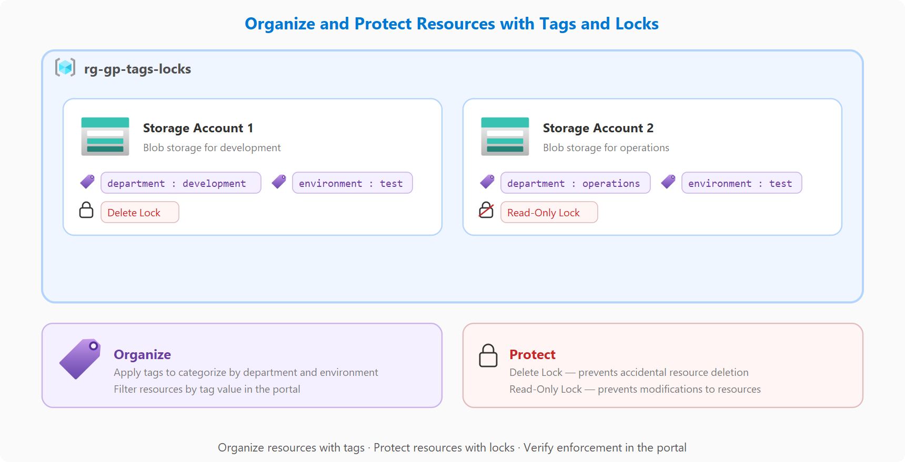

# Introducción a la infraestructura en la nube: Aplicación de aptitudes de Azure en proyectos guiados

[Link](https://learn.microsoft.com/es-es/training/modules/guided-project-organize-resources-tags-locks/)

## Escenario.

El equipo de desarrollo está configurando un entorno compartido de Azure y necesita mantener los recursos organizados y protegidos frente a cambios accidentales. Aplique etiquetas para realizar un seguimiento de qué departamento posee cada recurso y, a continuación, aplique bloqueos para evitar que los recursos críticos se modifiquen o eliminen por error.

- Ejercicio 1: Creación de recursos y aplicación de etiquetas organizativas.
- Ejercicio 2: Aplicar bloqueos de recursos para evitar cambios accidentales.
- Ejercicio 3 - Probar la implementación de bloqueos y confirmar el ciclo de vida completo del bloqueo.

1. Sign in to the [Azure portal](https://portal.azure.com/) with an account that has permissions to create and manage resources.
2. In the portal search bar, search for **Resource groups** and select **Resource groups**.
3. Select **+ Create**. Name the resource group **rg-gp-tags-locks**, choose your preferred region, and select **Review + create** then **Create**.

## Task 2: Create a test storage account

Create a low-cost storage account inside the resource group. This gives you a resource to tag and lock in the following exercises.

1. In the portal search bar, search for **Storage accounts** and select **Storage accounts**.
2. Select **+ Create**.
3. On the Basics tab, select **rg-gp-tags-locks** as the resource group.
4. For **Storage account name**, enter a globally unique name (for example, **stgptagslock** followed by your initials and a number).
5. For **Region**, use the same region as the resource group.
6. For **Preferred Storage Type**, select **Azure Blob Storage or Azure Data Lake Storage Gen 2**.
7. For **Performance**, select **Standard**.
8. For **Redundancy**, select **Locally-redundant storage (LRS)**.
9. Select **Review + create** and then select **Create**.
10. When deployment finishes, select **Go to resource**.

## Task 3: Tag the resource group

Apply organizational tags to the resource group. Tags are key-value pairs that help you categorize resources, track costs by department or project, and enforce governance policies.

1. In the portal search bar, search for **Resource groups** and select **Resource groups**.
2. Select **rg-gp-tags-locks** from the list.
3. In the left menu, select **Tags**.
4. Add the tag **department** with the value **development**.
5. Add the tag **environment** with the value **test**.
6. Select **Apply**.
7. Confirm both tags appear in the tags list.

# Exercise - Apply resource locks
This guided project consists of the following exercises:

Create resources and apply tags
Apply resource locks
Test lock enforcement
In this exercise, you apply two types of locks—a delete lock on the storage account and a read-only lock on the resource group. Locks add a layer of protection that prevents accidental changes or deletions, even by users who have full permissions.

This exercise includes the following tasks:

Apply a delete lock to the storage account
Apply a read-only lock to the resource group
Outcome: A delete lock on the storage account and a read-only lock on the resource group.

Task 1: Apply a delete lock to the storage account
Add a delete lock to prevent the storage account from being accidentally removed. A delete lock allows normal read and write operations but blocks deletion until the lock is removed. This protects critical resources from human error.

In the portal search bar, search for Storage accounts and select Storage accounts.
Select the first storage account you created (for example, stgptagslock).
In the left menu, under Settings, select Locks.
Select + Add.
For Lock name, enter prevent-delete.
For Lock type, select Delete.
Optionally add a note such as Prevents accidental deletion of test storage account.
Select OK.
Confirm the lock appears in the locks list.