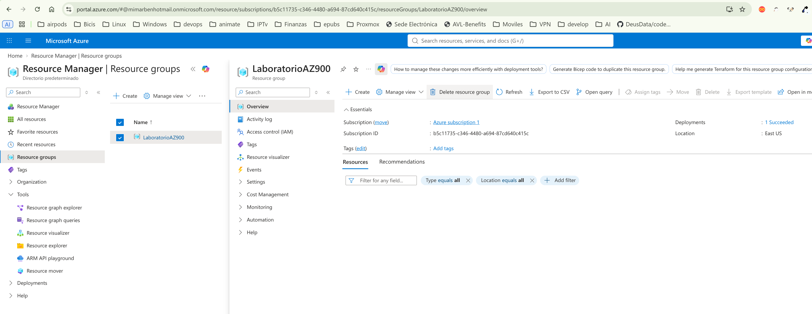

## Ejercicio: Creación de una cuenta de almacenamiento y habilitación del hospedaje

[Índice](https://learn.microsoft.com/es-es/training/paths/introduction-cloud-infrastructure-apply-azure-skills-guided-projects/)

Este proyecto guiado consta de los siguientes ejercicios:

- Ejercicio 1: Creación de una cuenta de almacenamiento y habilitación del hospedaje
- Ejercicio 2: Carga y comprobación del contenido del sitio
- Ejercicio 3: Actualización del contenido del sitio
- Limpieza de recursos

En este ejercicio, creará un grupo de recursos, configurará una cuenta de almacenamiento y activará la característica de hospedaje de sitios web estáticos. Al final, tiene una dirección URL pública lista para servir contenido web.

El ejercicio consta de las tareas siguientes:

Preparación del entorno
Creación de la cuenta de almacenamiento
Habilitar el hospedaje de sitios web estáticos
Inicie el ejercicio y siga las instrucciones. Cuando haya terminado, asegúrese de volver a esta página para poder continuar aprendiendo.

### Ejercicio 1: Preparación del entorno
En este ejercicio, creará un grupo de recursos, configurará una cuenta de almacenamiento y activará la característica de hospedaje de sitios web estáticos. Al final, tendrá una dirección URL pública lista para servir contenido web.

[Lab Exercise](https://microsoftlearning.github.io/Deploy-a-static-website-with-Azure-Blob-Storage/Instructions/Labs/2-exercise-create-storage-enable-hosting.html#task-1-prepare-the-environment)

#### Task 1: Prepare the environment

´´´bash
#### 1. Crear grupo de recursos.

`az group create --name LaboratorioAZ900 --location eastus`

Task 2: Create the storage account.

Storage accounts crear una con la misma zona que el grupo de recursos. En este caso, se creará en la zona "eastus".

Task 3: Enable static website hosting.

1. In the storage account left menu, under **Data management**, select **Static website**.
2. Set Static website to **Enabled**.
3. For **Index document name**, enter **index.html**.
4. For **Error document path**, enter **404.html**.
5. Select **Save**.
6. Note the **Primary endpoint** URL that appears after saving. This is the public URL for your website.

[Link to the web site](https://az900storageacc.z13.web.core.windows.net/)

#### Ejercicio 2: Carga y comprobación del contenido del sitio.

[Índice](https://microsoftlearning.github.io/Deploy-a-static-website-with-Azure-Blob-Storage/Instructions/Labs/3-exercise-upload-verify-content.html)

#### Task 1: Create the HTML file locally
[file](labs/AZ-900/index.html)

#### Task 2: Upload the file to the $web container.

## Delete the resource group.

1. In the portal search bar, search for **Resource groups** and select **Resource groups**.
2. Select **rg-gp-static-website** from the list.
3. Select **Delete resource group** from the top menu bar.
4. In the confirmation field, type **rg-gp-static-website** and select **Delete**.
5. In the confirmation dialog that appears, select **Delete** again to confirm.
6. Wait for the notification that confirms the resource group is deleted.

