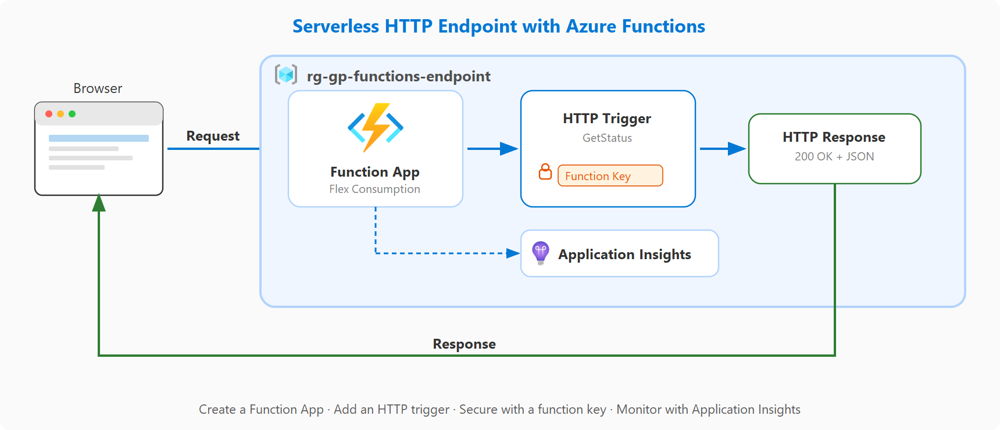

# Proyecto guiado: Creación de un punto de conexión de sitio web sencillo con Azure Functions

[Link](https://learn.microsoft.com/en-us/training/modules/guided-project-build-basic-website-endpoint-with-functions/)


> [!NOTE]
> Este proyecto guiado presenta el hospedaje sin servidor mediante la creación de un endpoint de función y la validación de respuestas.

Azure Functions es un servicio de proceso sin servidor que permite ejecutar código en respuesta a eventos sin administrar la infraestructura. Escribe una función, la implementa y Azure controla el escalado y el hospedaje. Con un desencadenador HTTP, la función obtiene su propia dirección URL a la que cualquier usuario puede llamar desde un explorador.

## Escenario

El equipo necesita un punto de conexión ligero para una página de contacto sin mantener servidores. Cree una aplicación de funciones, implemente una función desencadenada por HTTP mediante Cloud Shell y, a continuación, pruebe, proteja y supervise el punto de conexión, todo en una sola sesión.

- Ejercicio 1: Creación de una aplicación de funciones con el plan de consumo flexible sin servidor.
- Ejercicio 2: Implementación de una función de desencadenador HTTP desde Cloud Shell.
- Ejercicio 3: Probar el punto de conexión, agregar seguridad y revisar los registros.



# Ejercicio: Creación de la aplicación de funciones.

## Task 1: Prepare the environment.

1. Sign in to the [Azure portal](https://portal.azure.com/) with an account that has permissions to create Function App resources.
2. In the portal search bar, search for **Resource groups** and select **Resource groups**.
3. Select **+ Create**. Name the resource group **rg-gp-functions-endpoint**, choose your preferred region, and select **Review + create** then **Create**.
## Task 2: Configure the Function App.

Set up the Function App with serverless hosting. The Flex Consumption plan ensures you pay only for the execution time of your functions, making it cost-effective for occasional workloads.

1. In the portal search bar, search for **Function App** and select **Function App**.
2. Select **Create**.
3. Select **Flex Consumption** (Windows Comsuption, Flex not available in free mode) as the hosting option and select **Select**.
4. On the Basics tab, select **rg-gp-functions-endpoint** as the resource group.
5. For **Function App name**, enter a globally unique name (for example, **func-gp-endpoint-** followed by your initials and a number).
6. For **Secure unique default host name**, leave the default (**On**).
7. For **Region**, keep the default or choose your preferred region.
8. For **Runtime stack**, select **Node.js**.
9. For **Version**, keep the latest available LTS option.
10. For **Instance size**, leave the default (**2048 MB**).
11. Select **Review + create** and then select **Create**.

## Task 3: Verify the deployment.

Confirm that your Function App deployed successfully and is running.

1. When deployment completes, select **Go to resource**.
2. Confirm the Function App Overview page shows a **Running** status.


# Exercise - Create an HTTP-trigger function.

## Task 1: Open Cloud Shell

Launch Azure Cloud Shell so you can use the command line to create and deploy a function.

1. In the Azure portal, select the **Cloud Shell** icon in the top toolbar (it looks like a command prompt **>_**).
2. If prompted to choose **Bash** or **PowerShell**, select **Bash**. If Cloud Shell opens without prompting, look in the upper-left corner of the Cloud Shell pane. If you see a **Switch to Bash** button, select it. If you see **Switch to PowerShell**, you're already in Bash. It may take a minute for Cloud Shell to initialize.
3. If prompted to create storage, select **Create storage** and wait for Cloud Shell to initialize.
4. Confirm you see a Bash command prompt at the bottom of the portal.


## Task 2: Create the function project

Use the Azure Functions Core Tools in Cloud Shell to scaffold a new function project with an HTTP trigger.

1. At the Cloud Shell prompt, run the following command to create a new function project folder and switch into it:
 
`mkdir func-gp-endpoint && cd func-gp-endpoint`
      
2. Run the following command to initialize a new Functions project using the Node.js runtime. This may take a minute while it installs the required packages.
   
`func init --worker-runtime node --language javascript --model V4`
  
3. Run the following command to add an HTTP-triggered function named **GetStatus**:

`func new --name GetStatus --template "HTTP trigger" --authlevel anonymous`

   > [!NOTE]
   > The `--authlevel anonymous` flag means anyone with the URL can call this function without providing a key or signing in. This is useful for testing but should not be used for production endpoints that handle sensitive data.


## Task 3: Deploy the function to Azure

Publish the function project to the Function App you created in the previous exercise.

1. Run the following command to look up your Function App name and store it in a variable:
```Bash
FUNC_APP_NAME=$(az functionapp list --resource-group rg-gp-functions-endpoint --query "[0].name" -o tsv)
echo $FUNC_APP_NAME
```
    
Confirm the output displays the Function App name you created in the previous exercise.
    
2. Run the following command to publish the function project to your Function App:
```Bash
func azure functionapp publish $FUNC_APP_NAME
```
    
3. Wait for the deployment to complete. The output displays the function's public URL, which looks like:
```Bash
Functions in <your-function-app-name>:
    GetStatus - [httpTrigger]
    Invoke url: https://<your-function-app-name>.azurewebsites.net/api/getstatus
```
    
4. Copy the **Invoke url** from the output. You use this URL in the next exercise to test the function.
    

>[!NOTE]
>**Validation step:** Confirm the deployment output shows the **GetStatus** function with an Invoke url.

>[!WARNING]
>Algun error creando el storage y la conecction string.
>az storage account show-connection-string \
>  --name rggpfunctionsendpoint \
>  --resource-group rg-gp-functions-endpoint \
>  --query connectionString -o tsv
>
>az functionapp config appsettings set \
>  --name func-gp-endpoint-mm-01 \
>  --resource-group rg-gp-functions-endpoint \
>  --settings AzureWebJobsStorage="DefaultEndpointsProtocol=https;EndpointSuffix=core.windows.net;AccountName=rggpfunctionsendpoint;AccountKey=XXXXXXXXXXXXXXXXXXXXXXXXXXXXXXXXXXXXXXXXXXXXXXXXXXXXXXXXXXXXXXXXXXX_notvalid;BlobEndpoint=https://rggpfunctionsendpoint.blob.core.windows.net/;FileEndpoint=https://rggpfunctionsendpoint.file.core.windows.net/;QueueEndpoint=https://rggpfunctionsendpoint.queue.core.windows.net/;TableEndpoint=https://rggpfunctionsendpoint.table.core.windows.net/"
>
>func azure functionapp publish func-gp-endpoint-mm-01

Resultado final:

[2026-08-20T07:49:03.151Z] Syncing triggers...
Functions in func-gp-endpoint-mm-01:
    GetStatus - [httpTrigger]
        Invoke url: https://func-gp-endpoint-mm-01-bcd9ddebe6ehhwh8.spaincentral-01.azurewebsites.net/api/getstatus


# Exercise - Test endpoint and review logs.

## Task 1: Test the HTTP endpoint in a browser

Call your function endpoint to verify it responds correctly. This validates that your serverless function is deployed, running, and reachable from the public internet.

1. Open a new browser tab.
2. Paste the **Invoke url** you copied from the deployment output in the previous exercise into the address bar and press **Enter**.
3. Confirm the browser displays **Hello, world!** (or a similar greeting). This is the default response from the HTTP trigger template.
4. Open an incognito or private browser window, paste the same URL, and press **Enter**.
5. Confirm the function responds without requiring any sign-in. This works because you set the authorization level to **Anonymous** when you created the function.

## Task 2: Verify the function in the portal

Confirm the deployed function appears in the Azure portal alongside the Function App you created earlier.

1. In the Azure portal, in the portal search bar, search for **Function App** and select **Function App**.
2. Select the Function App you created in the previous exercise.
3. In the **Overview** page, under **Functions**, confirm **GetStatus** appears in the list with a trigger type of **HTTP**.

## Task 3: Enable Application Insights

When you created the Function App, you skipped past the Monitoring tab and accepted the defaults. Now that you want to track invocations, you need to enable Application Insights. This is a common pattern in Azure—you can add monitoring after the fact without recreating your resources.

1. Select **GetStatus** from the function list.
2. In the top menu, select **Invocations**.
3. The page displays a message that Application Insights is not configured. Select the **Configure Application Insights** button.
4. On the Application Insights configuration page, select **Turn on Application Insights**.
5. Before selecting **Apply**, note the **Log Analytics Workspace** name and location shown on the page. Write down the last four characters of the workspace name and the location—you need this information during cleanup.
6. Select **Apply**. When the **Apply monitoring settings** dialog appears noting the site will be restarted, select **Yes**. Wait for the configuration to complete.
7. Refresh the portal page (press **F5**) so the portal picks up the new Application Insights configuration.

## Task 4: Restrict access to the function

Now that monitoring is capturing data, change the authorization level so the function requires a key. This demonstrates how to secure a serverless endpoint.

1. In the Azure portal, select the **Cloud Shell** icon in the top toolbar to reopen Cloud Shell.
    
2. Navigate back to the project folder:
    
    Bash
    
    ```
    cd func-gp-endpoint
    ```
    
3. Run the following command to change the authorization level from **anonymous** to **function**:
    
    Bash
    
    ```
    sed -i "s/authLevel: 'anonymous'/authLevel: 'function'/" src/functions/GetStatus.js
    ```
    
4. Verify the change by running:
    
    Bash
    
    ```
    grep authLevel src/functions/GetStatus.js
    ```
    
    Confirm the output shows `authLevel: 'function'`.
    
5. Redeploy the function:
    
    Bash
    
    ```
    FUNC_APP_NAME=$(az functionapp list --resource-group rg-gp-functions-endpoint --query "[0].name" -o tsv)
    func azure functionapp publish $FUNC_APP_NAME
    ```
    
1. Wait for the deployment to complete.


## Task 5: Test restricted access

Verify that the function now rejects all unauthenticated requests, then use a function key to regain access.

1. Go back to the browser tab where you previously tested the function URL and refresh the page.
2. Confirm you receive a **401 Unauthorized** response. The function now requires a key for every request because you changed the authorization level from **anonymous** to **function**.
3. Return to the Azure portal. In the portal search bar, search for **Function App** and select **Function App**.
4. Select your Function App, then select **GetStatus** from the function list.
5. In the top menu, select **Function Keys**.
6. Copy the **default** key value.
7. Return to the browser tab with the function URL. Add **?code=** followed by the key you copied to the end of the URL and press **Enter**.
8. Confirm the function now responds with **Hello, world!** again. The key in the URL proves you are authorized to call the function.

## Task 6: Review invocation logs

Check Application Insights for records of your function invocations. The time spent in the previous tasks gave Application Insights time to process the data.

1. In the portal search bar, search for **Function App** and select **Function App**.
2. Select your Function App, then select **GetStatus** from the function list.
3. In the top menu, select **Invocations**.
4. Confirm the log shows your successful invocations (status **200**), including both the anonymous calls from Task 1 and the key-authenticated call from Task 5.
5. Select an invocation entry to view details such as the status code, duration, and timestamp.


https://func-gp-endpoint-mm-01-bcd9ddebe6ehhwh8.spaincentral-01.azurewebsites.net/api/getstatus?code=XXXXXXXXXXXXXXXXXXXXXXXXXXXXXXXXXXXXXXXXXXXXXXXXXXXXXXXXXXXXXXXXXXX_notvalid
