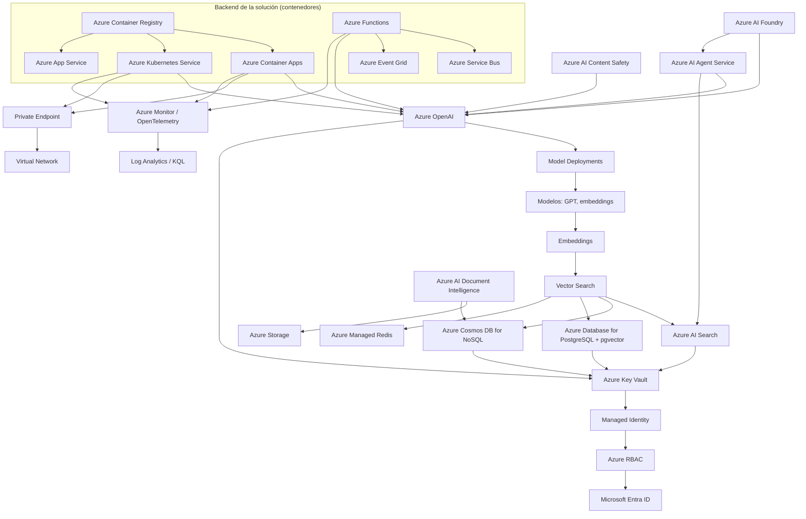

# Grafo de dependencias — AI-200

Representa cómo se relacionan entre sí los servicios que cubre AI-200 (ver [backlog.md](backlog.md) para el detalle de cada concepto). No es una arquitectura de referencia concreta, sino el mapa de dependencias típico de una solución de IA generativa en Azure con backend en contenedores.

## Lectura del grafo

- **Núcleo de IA generativa**: AI Foundry orquesta Azure OpenAI (modelos + embeddings) y el AI Agent Service; ambos consumen datos vectorizados desde AI Search, Cosmos DB, PostgreSQL o Redis según el patrón RAG elegido (Bloque 2 de la skills outline).
- **Backend en contenedores** (Bloque 1): cualquiera de los tres hosts (Container Apps, AKS, App Service) puede exponer la lógica que llama a Azure OpenAI; todos parten de una imagen en ACR.
- **Mensajería** (Bloque 3): Functions actúa como pegamento serverless entre Service Bus/Event Grid y el resto de servicios.
- **Seguridad y observabilidad** (Bloque 4): todo servicio con secretos pasa por Key Vault vía Managed Identity, cuyos permisos controla RBAC sobre identidades de Entra ID; el acceso de red se restringe con Private Endpoint + VNet; todo se instrumenta con Azure Monitor/OpenTelemetry y se consulta con KQL.

## Relacionado

- [backlog.md](backlog.md)
- [documentation-audit.md](documentation-audit.md)
- [INDEX.md](../../certifications/AI-200/INDEX.md)
- [[AKS]]
- [[Key Vault]]
- [[Managed Identities]]
- [[Azure RBAC]]
- [[Private Endpoints]]
- [[Azure Networking]]
