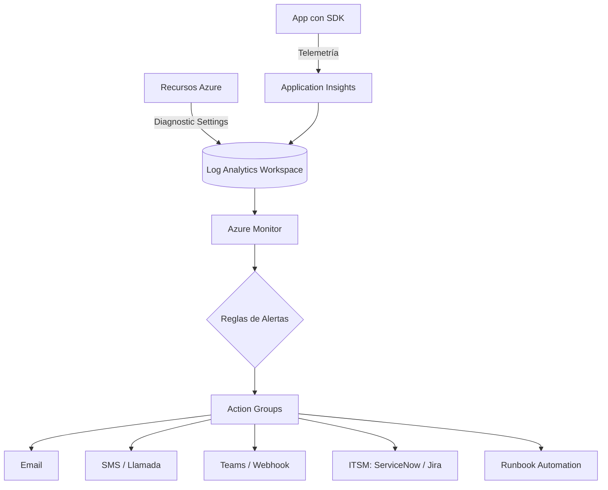
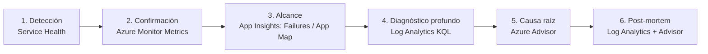
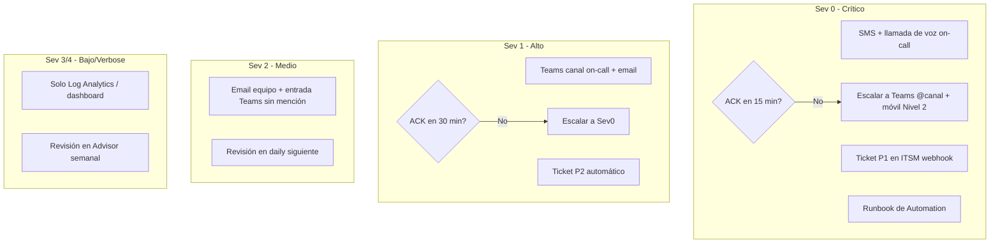

 
> [!question]
> - "Diseñe una estrategia de supervisión que combine Azure Advisor, Service Health, Azure Monitor, Log Analytics, Alertas y Application Insights".
> - "Recorra un escenario de interrupción y explique qué herramienta de supervisión se debe comprobar primero en cada fase del diagnóstico y la respuesta".
> - "Defina un modelo de alertas con niveles de gravedad, umbrales, grupos de acciones y rutas de escalación para una carga de trabajo de producción".

 ---
tags: [azure, monitoring, az-900, sre, alerting]
created: 2026-08-19
---

# Estrategia de Supervisión Azure

## 1. Arquitectura de supervisión por capas

| Capa | Herramienta | Qué cubre | Frecuencia |
|---|---|---|---|
| Plataforma (Microsoft) | **Service Health** | Incidentes de plataforma, mantenimientos planificados, salud del recurso | Push (eventos) |
| Recomendaciones | **Azure Advisor** | Coste, fiabilidad, rendimiento, seguridad, excelencia operativa | Semanal/mensual |
| Infraestructura | **Azure Monitor (Metrics)** | CPU, memoria, IOPS, latencia, throughput | Tiempo real (1 min) |
| Logs y consultas | **Log Analytics (KQL)** | Correlación de logs, diagnóstico profundo, auditoría | Bajo demanda + programado |
| Aplicación (APM) | **Application Insights** | Trazas de request, dependencias, excepciones, rendimiento de código | Tiempo real |
| Notificación | **Alertas + Action Groups** | Disparo automático y enrutado a personas/sistemas | Evento |

### Flujo de datos

> Regla clave: todo *diagnostic setting* y App Insights deben apuntar al **mismo Log Analytics Workspace** para poder correlacionar con `union` en KQL.

---

## 2. Escenario de interrupción — orden de comprobación por fase

| Fase | Pregunta | Herramienta primero | Acción |
|---|---|---|---|
| **1. Detección** | ¿Ya lo sabe Microsoft? | **Service Health → Service Issues** | Descarta causa de plataforma antes de investigar tu app |
| **2. Confirmación** | ¿Está afectando a mis recursos ahora? | **Azure Monitor – Metrics** | CPU/memoria/red del recurso, últimos 30-60 min |
| **3. Alcance** | ¿Qué componente falla exactamente? | **App Insights → Failures / Application Map** | Ver qué dependencia o endpoint tiene el pico de errores |
| **4. Diagnóstico profundo** | ¿Por qué falla? | **Log Analytics (KQL)** | Cruzar `AppExceptions`, `AppRequests`, `AzureDiagnostics` por correlationId |
| **5. Causa raíz** | ¿Es recurrente/evitable? | **Azure Advisor** | Revisar si ya existía recomendación de fiabilidad/rendimiento ignorada |
| **6. Post-mortem** | ¿Cómo evitarlo? | **Log Analytics + Advisor** | Ajustar umbrales, aplicar recomendación, documentar |

**Mnemotécnica:** Service Health → Metrics → App Insights → Log Analytics → Advisor
(¿es de Microsoft? → ¿qué recurso? → ¿qué transacción? → ¿por qué? → ¿cómo lo prevengo?)

---

## 3. Modelo de alertas para producción

### 3.1 Niveles de gravedad

| Sev | Nombre | Definición | SLA de respuesta |
|---|---|---|---|
| **Sev 0** | Crítico | Servicio caído / pérdida de datos | 15 min, 24×7 |
| **Sev 1** | Alto | Degradación severa, SLA en riesgo | 30 min, 24×7 |
| **Sev 2** | Medio | Degradación parcial, workaround disponible | 4 h, horario laboral extendido |
| **Sev 3** | Bajo | Informativo, tendencia a vigilar | 1 día laborable |
| **Sev 4** | Verbose | Auditoría / registro, sin acción inmediata | Sin SLA |

### 3.2 Umbrales de ejemplo — App Service + SQL + Front Door

| Métrica/señal | Origen | Umbral Sev 1 | Umbral Sev 2 | Ventana |
|---|---|---|---|---|
| Disponibilidad HTTP | App Insights (Availability test) | < 95% | < 99% | 5 min |
| Tasa de error 5xx | App Insights | > 5% requests | > 1% requests | 5 min |
| Latencia p95 | App Insights | > 2000 ms | > 800 ms | 5 min |
| CPU App Service | Azure Monitor | > 90% | > 75% | 10 min |
| DTU/vCore SQL | Azure Monitor | > 90% | > 70% | 10 min |
| Espacio en disco | Azure Monitor | > 90% | > 80% | 15 min |
| Excepciones no controladas | App Insights (KQL) | > 50/5min | > 10/5min | 5 min |
| Resource Health | Service Health | Unavailable | Degraded | Inmediato |

### 3.3 Rutas de escalación (Action Groups)

### 3.4 Buenas prácticas de configuración

- **Alert Processing Rules**: suprimir notificaciones en ventanas de mantenimiento planificado (evita ruido en despliegues).
- **Dynamic Thresholds** en Azure Monitor para métricas con estacionalidad (tráfico web) en vez de umbrales fijos.
- **Action Group compartido** entre Service Health Alerts y Resource Health Alerts → mismo flujo de escalación que las alertas propias.
- **Smart Detection** de App Insights (anomalías de fallos/rendimiento) enrutado directamente a AG-Sev1.
- **Log Analytics Workspace único** (no uno por recurso) para correlación cross-servicio vía `workspace().Table`.
- Revisar **Azure Advisor** mensualmente → convertir recomendaciones de fiabilidad en tickets de backlog.

---

## 4. Checklist rápido de despliegue

- [ ] Diagnostic Settings de todos los recursos apuntando al Log Analytics Workspace central
- [ ] Application Insights conectado al mismo Workspace
- [ ] Availability Tests configurados (App Insights)
- [ ] Action Groups creados por severidad (Sev0–Sev4)
- [ ] Alert Rules con Dynamic Thresholds donde aplique
- [ ] Alert Processing Rules para ventanas de mantenimiento
- [ ] Service Health Alerts vinculadas al Action Group correspondiente
- [ ] Revisión mensual de Azure Advisor documentada